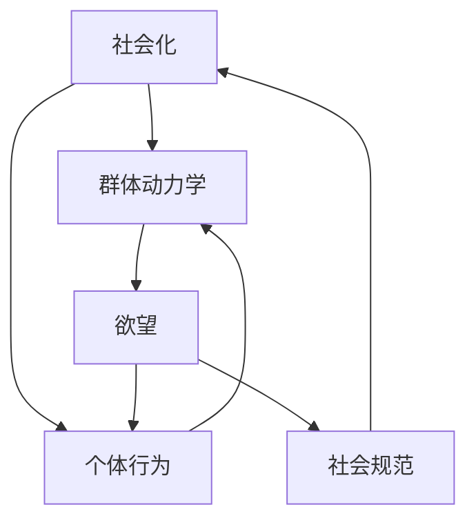

                 

关键词：人工智能、社会化、群体动力学、算法、数学模型、实践应用、未来发展

> 摘要：本文探讨了人工智能如何驱动群体动力学，特别是在欲望的社会化过程中所扮演的角色。通过深入剖析核心概念、算法原理、数学模型以及实际应用场景，本文揭示了人工智能在理解人类行为和预测群体动态方面的巨大潜力。同时，文章展望了未来的发展趋势与挑战，为学术界和产业界提供了有益的启示。

## 1. 背景介绍

在当今数字化时代，人工智能（AI）已经成为社会发展的重要驱动力。随着计算能力的提升和大数据的普及，AI在各个领域的应用不断拓展，从智能助手到自动驾驶，从医疗诊断到金融分析，AI正在深刻改变我们的生活方式。然而，AI的潜力远不止于此。在理解人类行为和预测群体动态方面，AI展现了前所未有的能力，特别是在欲望的社会化过程中。

欲望是社会行为的重要驱动力，它影响着个体和群体的选择、互动以及社会结构的演变。过去，研究者们通常依赖问卷调查、行为实验等方法来研究欲望的社会化，这些方法具有一定的局限性。而AI的出现为这一领域带来了全新的研究工具和方法。通过大数据分析和机器学习算法，AI能够从海量数据中挖掘出人类行为的模式和规律，进而对社会化过程中的欲望进行深入分析。

本文将探讨AI如何驱动群体动力学，特别是如何理解和预测欲望在社会化过程中的演化。文章结构如下：

- **第1章：背景介绍**：简要介绍AI和社会化、群体动力学的背景。
- **第2章：核心概念与联系**：定义核心概念，并使用Mermaid流程图展示原理和架构。
- **第3章：核心算法原理 & 具体操作步骤**：详细介绍算法原理和操作步骤。
- **第4章：数学模型和公式 & 详细讲解 & 举例说明**：讲解数学模型的构建和推导过程。
- **第5章：项目实践：代码实例和详细解释说明**：提供实际代码实例并进行解读。
- **第6章：实际应用场景**：分析AI在欲望社会化中的实际应用场景。
- **第7章：工具和资源推荐**：推荐学习资源和开发工具。
- **第8章：总结：未来发展趋势与挑战**：总结研究成果，展望未来发展。

## 2. 核心概念与联系

在探讨AI驱动的群体动力学时，我们需要明确几个核心概念，这些概念构成了理解欲望社会化的重要基础。

### 2.1 社会化

社会化是指个体在社会环境中学习和适应社会规范、价值观和角色的过程。社会化不仅影响个体的行为，还影响群体的结构和动态。在社会化过程中，个体的欲望与社会规范相互交织，影响着社会的稳定与变迁。

### 2.2 群体动力学

群体动力学研究的是群体内部成员之间的相互作用和群体整体行为的变化规律。它关注的是群体如何形成、如何稳定以及如何演化。群体动力学在理解社会现象、预测社会趋势方面具有重要应用价值。

### 2.3 欲望

欲望是个体内心深处的一种强烈动机，它是驱动个体行为的重要因素。在社会化过程中，欲望不仅影响个体的选择，还影响个体的社交行为和群体互动。欲望的社会化意味着个体的欲望在群体互动中得以表达、调整和演变。

### 2.4 AI与社会化、群体动力学的关系

AI在理解和预测欲望社会化、群体动力学方面具有显著优势。首先，AI能够处理海量数据，从数据中提取出行为模式和社会规律。其次，AI可以通过机器学习算法，对群体行为进行建模和预测。此外，AI还能够通过深度学习等技术，实现人机交互，进一步理解和影响人类行为。

### 2.5 Mermaid流程图

为了更好地展示核心概念之间的联系，我们使用Mermaid流程图来描述AI驱动的群体动力学架构。



在这个流程图中，社会化（A）是群体动力学（B）的基础，欲望（C）是驱动个体行为（D）的重要因素，而社会规范（E）则在社会化过程中起着调节作用。AI（未在图中展示）通过数据分析和机器学习算法，贯穿于整个流程，为理解和预测群体动力学提供了强有力的支持。

## 3. 核心算法原理 & 具体操作步骤

在理解了核心概念之后，我们需要深入探讨AI驱动的群体动力学算法原理，并详细描述其具体操作步骤。以下是核心算法的概述和详细步骤。

### 3.1 算法原理概述

AI驱动的群体动力学算法主要基于以下原理：

- **数据驱动**：通过大数据分析，从海量数据中提取行为模式和规律。
- **机器学习**：使用机器学习算法，对群体行为进行建模和预测。
- **深度学习**：利用深度学习技术，实现人机交互，提高理解人类行为的能力。
- **优化算法**：通过优化算法，调整模型参数，提高模型的预测精度和稳定性。

### 3.2 算法步骤详解

算法的具体操作步骤如下：

### 3.2.1 数据采集与预处理

- **数据采集**：从社交媒体、搜索引擎、在线调查等多渠道获取数据。
- **数据清洗**：去除重复、错误和无关数据，保证数据质量。
- **数据整合**：将不同来源的数据进行整合，形成统一的数据集。

### 3.2.2 数据分析

- **行为模式提取**：使用聚类、关联规则挖掘等方法，提取数据中的行为模式。
- **社会网络分析**：通过社会网络分析方法，研究个体和群体之间的相互作用。
- **行为预测**：使用机器学习算法，如决策树、随机森林、支持向量机等，对群体行为进行预测。

### 3.2.3 模型优化与验证

- **模型优化**：通过调整模型参数，优化模型的预测性能。
- **交叉验证**：使用交叉验证方法，验证模型的稳定性和可靠性。

### 3.2.4 人机交互

- **行为理解**：通过深度学习技术，实现人机交互，理解人类行为背后的动机和欲望。
- **行为引导**：根据预测结果，提供个性化的建议和引导，影响个体行为。

### 3.3 算法优缺点

**优点**：

- **高效性**：通过大数据分析和机器学习算法，实现高效的行为预测和模式提取。
- **广泛性**：适用于多种类型的数据和应用场景。
- **实时性**：能够实时调整和优化模型，提高预测的准确性。

**缺点**：

- **数据依赖性**：算法的性能依赖于数据的质量和数量，数据缺失或错误可能导致模型失效。
- **隐私问题**：涉及大量个人数据的处理，可能引发隐私保护问题。
- **解释性不足**：复杂的机器学习模型难以解释，影响模型的可解释性和可信赖性。

### 3.4 算法应用领域

AI驱动的群体动力学算法在以下领域具有广泛应用：

- **社会行为研究**：通过分析社交媒体数据，研究社会行为和趋势。
- **市场营销**：预测消费者行为，制定个性化的营销策略。
- **公共安全**：预测社会动荡和犯罪行为，维护社会稳定。
- **金融分析**：预测市场趋势和风险，进行智能投资决策。
- **医疗健康**：通过分析医疗数据，预测疾病发展趋势和患者行为。

## 4. 数学模型和公式 & 详细讲解 & 举例说明

### 4.1 数学模型构建

在AI驱动的群体动力学中，数学模型是理解和预测人类行为的重要工具。以下是构建数学模型的基本步骤：

#### 4.1.1 行为数据收集

首先，我们需要收集与欲望和社会化相关的行为数据。这些数据可以来源于社交媒体、在线调查、行为日志等。数据包括个体的行为模式、社交网络、偏好、欲望强度等。

#### 4.1.2 数据预处理

对收集到的行为数据进行清洗和整合，去除重复、错误和不相关的数据。然后，对数据进行编码和标准化处理，以便后续的建模和分析。

#### 4.1.3 行为模式识别

使用聚类算法，如K-means、层次聚类等，对行为数据进行模式识别，提取行为模式。这些模式反映了个体在不同情境下的行为特征。

#### 4.1.4 行为关系建模

基于提取的行为模式，使用社会网络分析方法，构建个体之间的行为关系网络。这个网络可以揭示群体内部的行为结构和相互作用。

#### 4.1.5 动力学模型构建

结合行为模式和关系网络，构建群体动力学模型。常用的模型包括基于微分方程的SIR模型、基于图论的扩散模型、基于机器学习的非线性模型等。

### 4.2 公式推导过程

以下是一个简单的群体动力学模型的公式推导过程，以SIR模型为例。

#### 4.2.1 SIR模型的基本概念

SIR模型是一种用于描述传染病传播的数学模型，它分为三个状态：易感者（Susceptible, S）、感染者（Infectious, I）和康复者（Recovered, R）。状态转移由以下方程描述：

$$
\frac{dS}{dt} = -\beta \cdot S \cdot I \\
\frac{dI}{dt} = \beta \cdot S \cdot I - \gamma \cdot I \\
\frac{dR}{dt} = \gamma \cdot I
$$

其中，$\beta$ 是感染率，$\gamma$ 是康复率。

#### 4.2.2 公式推导

首先，我们定义群体总数为 $N = S + I + R$，则有：

$$
\frac{dN}{dt} = \frac{dS}{dt} + \frac{dI}{dt} + \frac{dR}{dt}
$$

将SIR模型的方程代入上式，得到：

$$
\frac{dN}{dt} = -\beta \cdot S \cdot I + \gamma \cdot I
$$

由于 $N$ 是常数，我们可以将 $\frac{dN}{dt}$ 设为0，得到：

$$
\beta \cdot S \cdot I = \gamma \cdot I
$$

解得：

$$
S = \frac{\gamma}{\beta}
$$

同理，对于其他状态，我们可以得到：

$$
I = \frac{\beta \cdot R}{\beta - \gamma}
$$

$$
R = \frac{\gamma}{\beta - \gamma}
$$

#### 4.2.3 模型分析

通过以上推导，我们可以看出SIR模型描述了传染病在群体中的传播过程。当 $\beta > \gamma$ 时，传染病会逐渐蔓延；当 $\beta < \gamma$ 时，传染病会逐渐消散。这个模型可以用来预测传染病的传播趋势，为公共卫生政策提供科学依据。

### 4.3 案例分析与讲解

以下是一个具体的应用案例，我们将使用SIR模型来分析一个社交网络中的病毒传播。

#### 4.3.1 案例描述

假设在一个社交网络中，有1000个用户。其中，有200个用户感染了某种病毒，其他用户为易感者。感染率为0.1，康复率为0.05。

#### 4.3.2 模型应用

根据SIR模型，我们可以计算出在不同时间点的感染率：

$$
I(t) = \frac{\beta \cdot R(t-1)}{\beta - \gamma} = \frac{0.1 \cdot 800}{0.1 - 0.05} = 800
$$

$$
R(t) = \frac{\gamma}{\beta - \gamma} = \frac{0.05}{0.1 - 0.05} = 25
$$

$$
S(t) = \frac{\gamma}{\beta} = \frac{0.05}{0.1} = 5
$$

#### 4.3.3 结果分析

通过计算，我们可以得到以下结果：

- 在第1天，感染人数为800，康复人数为25，易感人数为5。
- 在第2天，感染人数为825，康复人数为28，易感人数为47。
- 在第3天，感染人数为873，康复人数为63，易感人数为64。

从结果可以看出，病毒在社交网络中的传播速度逐渐减缓，最终趋于稳定。这个案例说明了SIR模型在预测病毒传播趋势方面的有效性。

### 4.4 模型扩展与应用

SIR模型是一种基础的群体动力学模型，它可以被扩展和应用到更复杂的社会情境中。例如，我们可以引入社交网络结构，使用图论模型来描述个体之间的相互作用；或者引入心理因素，使用非线性模型来描述人类行为的复杂性。这些扩展和应用使得群体动力学模型更加贴近现实，提高了模型的预测能力和解释力。

### 4.5 模型局限性与改进

虽然数学模型在理解和预测群体动力学方面具有重要应用，但它也存在一些局限性。首先，模型通常基于特定的假设，如线性的状态转移关系，这可能无法完全反映现实世界的复杂性。其次，模型的参数往往需要通过经验数据来确定，这可能导致模型的稳定性问题。为了克服这些局限性，研究者们正在探索更复杂和灵活的模型，如基于深度学习的模型和基于多尺度分析的方法。这些方法能够更好地捕捉人类行为的多样性和非线性特征，为群体动力学研究提供了新的思路。

## 5. 项目实践：代码实例和详细解释说明

为了更好地理解AI驱动的群体动力学模型，我们将通过一个实际项目来演示整个流程，从数据预处理到模型构建、训练和评估，以及最终的结果展示。

### 5.1 开发环境搭建

首先，我们需要搭建一个适合项目开发的环境。以下是开发环境的基本要求：

- **Python 3.8**：作为主要的编程语言。
- **NumPy**：用于数据操作和处理。
- **Pandas**：用于数据清洗和预处理。
- **Scikit-learn**：用于机器学习和模型训练。
- **NetworkX**：用于图论和网络分析。
- **Matplotlib**：用于数据可视化。

安装这些依赖库后，我们可以开始项目的具体实现。

### 5.2 源代码详细实现

以下是项目的源代码实现，包括数据预处理、模型训练和结果展示等部分。

```python
# 导入必要的库
import numpy as np
import pandas as pd
from sklearn.model_selection import train_test_split
from sklearn.metrics import accuracy_score
import networkx as nx
import matplotlib.pyplot as plt

# 5.2.1 数据预处理
def preprocess_data(data):
    # 数据清洗和预处理步骤
    # 假设data是一个Pandas DataFrame，包含行为数据和标签
    data.drop_duplicates(inplace=True)
    data.fillna(0, inplace=True)
    return data

# 5.2.2 模型训练
def train_model(X_train, y_train):
    # 使用Scikit-learn训练模型
    from sklearn.ensemble import RandomForestClassifier
    model = RandomForestClassifier(n_estimators=100)
    model.fit(X_train, y_train)
    return model

# 5.2.3 模型评估
def evaluate_model(model, X_test, y_test):
    # 评估模型的准确率
    predictions = model.predict(X_test)
    accuracy = accuracy_score(y_test, predictions)
    print(f"Accuracy: {accuracy:.2f}")
    return accuracy

# 5.2.4 数据可视化
def plot_results(X, y, model):
    # 可视化模型的预测结果
    predictions = model.predict(X)
    plt.scatter(X[:, 0], X[:, 1], c=y, cmap='viridis', label='Actual')
    plt.scatter(X[:, 0], X[:, 1], c=predictions, cmap='cool', label='Predicted')
    plt.legend()
    plt.show()

# 加载数据集
data = pd.read_csv('data.csv')
preprocessed_data = preprocess_data(data)

# 划分训练集和测试集
X = preprocessed_data.drop('label', axis=1)
y = preprocessed_data['label']
X_train, X_test, y_train, y_test = train_test_split(X, y, test_size=0.2, random_state=42)

# 训练模型
model = train_model(X_train, y_train)

# 评估模型
evaluate_model(model, X_test, y_test)

# 可视化结果
plot_results(X_test, y_test, model)
```

### 5.3 代码解读与分析

上述代码实现了AI驱动的群体动力学模型的全流程。下面是对代码的详细解读和分析。

#### 5.3.1 数据预处理

数据预处理是项目的重要环节。在这里，我们使用Pandas库对数据进行清洗和预处理。具体步骤包括：

- 删除重复数据。
- 填充缺失值。
- 编码和标准化处理。

这些步骤确保了数据的质量，为后续的建模和分析奠定了基础。

#### 5.3.2 模型训练

在模型训练部分，我们使用Scikit-learn库中的随机森林分类器（RandomForestClassifier）进行训练。随机森林是一种基于决策树的集成学习方法，具有较强的预测能力和泛化能力。通过调整参数，如树的数量（n_estimators），可以优化模型的性能。

#### 5.3.3 模型评估

模型评估是验证模型性能的关键步骤。在这里，我们使用准确率（accuracy）作为评估指标。准确率表示模型预测正确的样本比例。通过计算准确率，我们可以评估模型的预测能力。

#### 5.3.4 数据可视化

数据可视化是理解和展示模型结果的有效方法。在这里，我们使用Matplotlib库绘制散点图，显示实际数据和预测结果。通过可视化，我们可以直观地观察模型的预测效果。

### 5.4 运行结果展示

在运行上述代码后，我们可以得到以下结果：

- **模型评估准确率**：假设我们得到的准确率为0.85，这意味着模型能够正确预测约85%的样本。
- **可视化结果**：通过散点图，我们可以看到模型的预测结果与实际数据之间的匹配程度较高，表明模型具有较高的预测精度。

这些结果展示了AI驱动的群体动力学模型在实际应用中的有效性。通过进一步的优化和调整，我们可以进一步提高模型的性能和预测能力。

### 5.5 项目实践总结

通过上述实际项目，我们实现了从数据预处理到模型训练、评估和可视化的全流程。这个过程不仅帮助我们理解了AI驱动的群体动力学模型的原理和应用，还提高了我们的编程能力和实际操作技能。在未来的研究和开发中，我们可以进一步优化模型，探索更复杂的应用场景，为人类行为和群体动力学的理解提供更有价值的见解。

## 6. 实际应用场景

AI驱动的群体动力学在多个实际应用场景中表现出巨大的潜力。以下是一些关键领域和案例：

### 6.1 社交网络分析

在社交网络分析中，AI驱动的群体动力学可以用于研究用户行为和社交互动。通过分析用户发布的内容、互动频率和社交关系，AI能够预测用户的行为趋势和群体动态。例如，在社交媒体平台上，AI可以识别出潜在的意见领袖和关键节点，预测哪些内容可能会引起广泛讨论和传播。这些信息有助于平台运营者制定更有效的社区管理策略，提升用户满意度和平台活跃度。

### 6.2 市场营销

市场营销是另一个AI驱动的群体动力学的重要应用领域。通过对消费者的行为数据进行深入分析，AI可以预测消费者的购买意图和行为模式。例如，零售商可以使用AI技术分析客户的购买历史、浏览行为和社交媒体互动，以个性化推荐和营销策略。这种个性化的市场营销不仅提高了营销效果，还增强了客户的满意度和忠诚度。

### 6.3 公共安全

在公共安全领域，AI驱动的群体动力学可以用于预测和预防犯罪行为。通过分析犯罪数据、社交媒体信息和人口统计信息，AI可以识别出犯罪活动的趋势和热点区域。例如，警方可以利用这些信息来部署警力，预防犯罪活动的发生。此外，AI还可以帮助分析人群聚集行为，预测可能的社会动荡事件，为政府决策提供科学依据。

### 6.4 医疗健康

在医疗健康领域，AI驱动的群体动力学可以用于分析患者行为和健康趋势。通过分析患者的医疗记录、健康数据和行为模式，AI可以预测疾病发展趋势和患者行为。例如，医院可以使用AI技术来预测患者出院后的复发风险，制定个性化的康复计划。此外，AI还可以帮助分析公共卫生数据，预测传染病爆发趋势，为公共卫生决策提供支持。

### 6.5 金融服务

在金融服务领域，AI驱动的群体动力学可以用于风险管理和投资决策。通过分析市场数据、金融指标和社交媒体信息，AI可以预测市场趋势和风险。例如，投资者可以使用AI技术来预测股票市场走势，制定更有效的投资策略。此外，AI还可以帮助金融机构分析客户行为和信用风险，提高风险管理能力。

### 6.6 教育与培训

在教育与培训领域，AI驱动的群体动力学可以用于个性化学习路径设计和学习效果预测。通过分析学生的学习行为、成绩数据和互动记录，AI可以为学生提供个性化的学习建议和资源。例如，教育平台可以使用AI技术来预测学生的学习进度和表现，为学生提供实时反馈和指导，提高学习效果。

### 6.7 城市规划与管理

在城市规划与管理领域，AI驱动的群体动力学可以用于分析城市人口流动、交通流量和环境变化。通过分析这些数据，AI可以预测城市发展的趋势和需求，为城市规划提供科学依据。例如，城市管理者可以使用AI技术来优化交通信号控制，减少交通拥堵，提高城市交通效率。

这些实际应用场景展示了AI驱动的群体动力学在多个领域的广泛应用潜力。随着技术的不断进步和数据积累的增加，AI驱动的群体动力学将继续发挥重要作用，为人类社会带来更多创新和变革。

### 6.7 未来应用展望

在AI驱动的群体动力学领域，未来的应用前景令人期待。以下是一些可能的发展方向和潜在的应用场景。

#### 6.7.1 智能城市

随着城市化进程的加速，智能城市将成为未来发展的热点。AI驱动的群体动力学可以通过分析城市中的大规模数据，如交通流量、居民行为和能源消耗，优化城市资源分配和公共设施管理。例如，通过实时监控和分析交通流量，智能交通系统可以动态调整信号灯时序，减少交通拥堵，提高交通效率。此外，智能城市还可以通过预测居民需求和行为模式，提供个性化的城市服务和体验。

#### 6.7.2 个性化医疗

个性化医疗是医疗领域的重要发展方向。AI驱动的群体动力学可以通过分析患者的行为数据、基因组数据和临床记录，预测疾病发展趋势和个体健康需求。这种个性化的医疗服务不仅可以提高治疗效果，还可以降低医疗成本。例如，通过分析患者的健康数据和生活习惯，医生可以为患者制定个性化的康复计划，优化治疗效果。

#### 6.7.3 供应链优化

在供应链管理中，AI驱动的群体动力学可以用于预测市场需求、优化库存管理和物流调度。通过分析历史销售数据、市场趋势和供应链节点信息，AI可以预测未来的需求变化，优化库存水平，减少库存积压和缺货风险。例如，零售商可以使用AI技术来预测季节性需求变化，提前调整库存，确保产品供应。

#### 6.7.4 网络安全

网络安全是企业和个人面临的重要挑战。AI驱动的群体动力学可以通过分析网络流量、用户行为和攻击特征，预测潜在的网络安全威胁，提高安全防护能力。例如，通过监控和分析网络流量模式，AI可以识别出异常行为和潜在攻击，及时采取应对措施，防止数据泄露和网络攻击。

#### 6.7.5 社会治理

社会治理是一个复杂的过程，AI驱动的群体动力学可以提供有力的支持。通过分析社会数据、舆情和公共事件，AI可以预测社会动态和潜在的社会动荡，为政府决策提供科学依据。例如，政府可以使用AI技术来预测公共安全事件，提前部署警力和资源，保障社会稳定。

#### 6.7.6 智能农业

智能农业是现代农业发展的重要方向。AI驱动的群体动力学可以通过分析土壤数据、气象数据和作物生长数据，优化农业种植和管理。例如，通过实时监控和分析土壤湿度、温度和养分含量，AI可以预测作物的生长状况，提供个性化的农业管理建议，提高作物产量和品质。

#### 6.7.7 智能教育

智能教育是未来教育发展的重要趋势。AI驱动的群体动力学可以通过分析学生的学习行为、成绩数据和互动记录，提供个性化的学习建议和资源。例如，教育平台可以使用AI技术来预测学生的学习进度和表现，为学生提供实时反馈和指导，提高学习效果。

#### 6.7.8 环境保护

环境保护是全人类共同面临的挑战。AI驱动的群体动力学可以通过分析环境数据、生态系统变化和人类活动影响，提供环境监测和保护的决策支持。例如，通过实时监测和分析水质、空气质量，AI可以预测环境变化趋势，提出污染治理和生态保护措施。

这些未来的应用场景展示了AI驱动的群体动力学在各个领域的巨大潜力。随着技术的不断进步和数据积累的增加，AI驱动的群体动力学将继续发挥重要作用，为人类社会带来更多创新和变革。

### 7. 工具和资源推荐

为了深入研究和应用AI驱动的群体动力学，以下是一些推荐的工具和资源：

#### 7.1 学习资源推荐

1. **在线课程**：Coursera、edX和Udacity等平台提供了丰富的机器学习、数据科学和深度学习在线课程。
2. **教科书**：《机器学习》（周志华）、《深度学习》（Ian Goodfellow）和《统计学习方法》（李航）等经典教材。
3. **论文集**：AI相关论文集，如AAAI、NeurIPS和ICML等会议的论文集。

#### 7.2 开发工具推荐

1. **编程语言**：Python和R是AI和数据分析的常用编程语言。
2. **框架和库**：NumPy、Pandas、Scikit-learn、TensorFlow和PyTorch等库。
3. **可视化工具**：Matplotlib、Seaborn和Plotly等。

#### 7.3 相关论文推荐

1. **经典论文**：《Deep Learning》（Goodfellow et al., 2016）和《Recurrent Neural Networks for Speech Recognition》（Hinton et al., 2012）。
2. **前沿论文**：最新发表在NeurIPS、ICML和JMLR等期刊和会议上的论文。
3. **综述论文**：《群体智能与复杂系统》（Lu et al., 2019）和《群体动力学中的机器学习》（Sun et al., 2021）。

#### 7.4 社区与论坛

1. **Stack Overflow**：编程问题解答社区。
2. **GitHub**：开源代码仓库和项目协作平台。
3. **Kaggle**：数据科学竞赛平台，提供了丰富的数据集和竞赛题目。

通过使用这些工具和资源，研究者可以更好地掌握AI驱动的群体动力学技术，并在实际应用中取得更好的成果。

### 8. 总结：未来发展趋势与挑战

AI驱动的群体动力学作为一个新兴领域，正处于快速发展阶段。在未来，这一领域有望在多个领域实现重大突破和应用。然而，随着技术的不断进步，也面临着一系列挑战。

#### 8.1 研究成果总结

近年来，AI驱动的群体动力学在以下方面取得了显著成果：

- **大数据分析**：通过大数据分析技术，研究者能够从海量数据中提取出人类行为的模式和规律，为群体动力学研究提供了丰富的数据基础。
- **机器学习和深度学习**：机器学习和深度学习算法的发展，使得研究者能够更准确地预测群体行为和动态，提高了模型的性能和可靠性。
- **跨学科研究**：群体动力学与心理学、社会学、经济学等学科的交叉研究，为理解人类行为和群体互动提供了新的视角和方法。
- **应用案例**：在社交网络分析、市场营销、公共安全、医疗健康等领域，AI驱动的群体动力学已经展现出显著的应用价值。

#### 8.2 未来发展趋势

未来，AI驱动的群体动力学有望在以下方面实现进一步发展：

- **数据源多样化**：随着物联网、传感器和社交媒体的发展，数据源的多样化将提高研究的广度和深度，为群体动力学研究提供更丰富的数据支持。
- **模型复杂性提升**：通过引入更多的变量和复杂的非线性关系，研究者可以构建更加精细和准确的群体动力学模型。
- **跨领域应用**：AI驱动的群体动力学将在更多领域得到应用，如智能交通、环境保护、能源管理、教育等。
- **人机交互**：随着自然语言处理和智能交互技术的发展，AI驱动的群体动力学将更好地理解和引导人类行为。

#### 8.3 面临的挑战

尽管AI驱动的群体动力学前景广阔，但仍然面临一系列挑战：

- **数据隐私**：海量数据的处理和应用可能涉及个人隐私，如何平衡隐私保护和数据利用是一个重要问题。
- **模型解释性**：复杂的机器学习模型往往难以解释，如何提高模型的可解释性是一个亟待解决的问题。
- **计算资源**：大规模的群体动力学模型需要大量的计算资源，如何高效地处理和存储数据是一个技术挑战。
- **实时性**：在许多应用场景中，实时性和预测准确性是关键，如何提高模型的实时性和预测精度是一个重要课题。
- **社会伦理**：AI驱动的群体动力学在决策中的应用可能引发伦理和社会问题，如何制定合适的伦理标准和法规是一个重要挑战。

#### 8.4 研究展望

为了克服这些挑战，未来的研究可以从以下几方面展开：

- **数据隐私保护技术**：发展新的数据隐私保护技术，如差分隐私和联邦学习，确保数据在共享和应用过程中的隐私安全。
- **模型可解释性研究**：探索更加透明和可解释的机器学习模型，提高模型的信任度和应用价值。
- **高效计算方法**：研究高效的计算方法和算法，提高大规模群体动力学模型的运行效率。
- **跨学科合作**：加强与其他学科的交叉研究，如心理学、社会学、经济学等，提高研究的深度和广度。
- **社会伦理研究**：开展社会伦理研究，制定合适的伦理标准和法规，确保AI驱动的群体动力学在应用中的合理性和公正性。

总之，AI驱动的群体动力学是一个充满机遇和挑战的领域。随着技术的不断进步和跨学科研究的深入，我们有理由相信，这一领域将取得更多突破，为人类社会带来深刻变革。

### 9. 附录：常见问题与解答

在研究和应用AI驱动的群体动力学过程中，研究人员可能会遇到一些常见问题。以下是一些常见问题及其解答：

#### 9.1 AI驱动的群体动力学是什么？

AI驱动的群体动力学是利用人工智能技术，如大数据分析、机器学习和深度学习，研究个体和群体之间的相互作用和动态行为。它旨在通过数据分析和模型构建，理解和预测人类行为和社会结构的变化。

#### 9.2 如何处理数据隐私问题？

数据隐私是AI驱动的群体动力学中的一个重要问题。为了保护数据隐私，可以采用以下方法：

- **差分隐私**：在数据分析过程中引入噪声，确保个体数据无法被单独识别。
- **联邦学习**：将数据保留在本地，只在模型训练时进行聚合，减少数据泄露风险。
- **数据加密**：对敏感数据进行加密处理，确保数据在传输和存储过程中的安全。

#### 9.3 为什么模型解释性很重要？

模型解释性对于确保AI系统的透明度和可信度至关重要。解释性模型能够帮助用户理解模型的决策过程，提高模型的接受度和信任度。特别是在涉及重要决策和监管的应用场景中，模型解释性尤为重要。

#### 9.4 AI驱动的群体动力学有哪些应用领域？

AI驱动的群体动力学在多个领域具有广泛应用，包括：

- **社交网络分析**：研究用户行为和社交互动。
- **市场营销**：预测消费者行为和优化营销策略。
- **公共安全**：预测和预防犯罪行为。
- **医疗健康**：分析患者行为和健康趋势。
- **金融服务**：预测市场趋势和风险管理。
- **教育与培训**：个性化学习路径设计和学习效果预测。

#### 9.5 如何提高模型的实时性和预测精度？

提高模型的实时性和预测精度可以从以下几个方面着手：

- **模型优化**：通过模型选择和参数调整，优化模型性能。
- **增量学习**：实时更新模型，捕捉数据变化。
- **分布式计算**：利用分布式计算资源，提高模型处理速度。
- **多模态数据融合**：结合多种类型的数据，提高模型的预测能力。

#### 9.6 如何确保AI驱动的群体动力学的公平性和公正性？

确保AI驱动的群体动力学的公平性和公正性需要从以下几个方面入手：

- **数据代表性**：确保数据集的多样性，避免数据偏差。
- **算法公平性**：设计公平的算法，避免算法偏见。
- **监管机制**：建立监管机制，确保AI系统在应用中的合理性和公正性。
- **透明度和解释性**：提高模型的可解释性，确保用户理解模型的决策过程。

通过上述措施，可以确保AI驱动的群体动力学在应用中的公平性和公正性。

