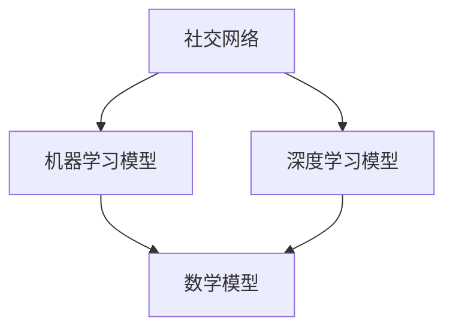

                 

关键词：AI、群体动力学、社会化、欲望、模型、算法、应用场景、未来展望

## 摘要

随着人工智能（AI）技术的飞速发展，群体动力学在各个领域中的应用愈发广泛。本文旨在探讨AI如何驱动欲望的社会化过程，通过构建数学模型和核心算法，深入分析这一现象的内在机理和应用场景。本文将分为八个部分：背景介绍、核心概念与联系、核心算法原理与具体操作步骤、数学模型和公式、项目实践、实际应用场景、未来应用展望、工具和资源推荐以及总结。通过这些部分，读者可以全面了解AI在群体动力学中的角色，以及其对社会化欲望的深远影响。

## 1. 背景介绍

### 1.1 群体动力学的基本概念

群体动力学是一个跨学科领域，涉及物理学、生物学、社会学和计算机科学等多个方面。它主要研究个体在群体中的行为模式及其相互作用，旨在揭示群体行为背后的机制。传统的群体动力学研究多集中在自然界和人类社会中的现象，如鸟类迁徙、蚂蚁觅食和社会性昆虫的分工等。然而，随着人工智能技术的发展，群体动力学开始被应用于更广泛的领域，包括社交网络分析、经济模型、交通流量预测等。

### 1.2 欲望的社会化现象

欲望的社会化是指个体欲望在群体中的传播和变化过程。在传统社会中，欲望主要是个体内部的私人感受，但随着社交网络的兴起，个体的欲望越来越容易在群体中扩散和影响他人。这种现象在现代社会尤为显著，从网络流行语到社交媒体上的热点话题，无不体现了欲望的社会化特征。

### 1.3 AI在群体动力学中的应用

人工智能技术为群体动力学的研究提供了新的工具和方法。通过机器学习、数据挖掘和深度学习等技术，AI可以处理和分析大规模的社交网络数据，揭示群体行为模式，预测个体欲望的变化趋势。此外，AI还可以通过模拟和仿真，为群体动力学模型提供更准确的参数和预测结果。

## 2. 核心概念与联系

为了更好地理解AI如何驱动欲望的社会化过程，我们需要介绍几个核心概念，并绘制一个简明的Mermaid流程图来展示它们之间的联系。

### 2.1 社交网络

社交网络是群体动力学研究的核心对象，它由个体（节点）和个体之间的交互（边）构成。在社交网络中，个体的行为和欲望可以通过节点和边来表示。

### 2.2 机器学习模型

机器学习模型是AI驱动群体动力学的重要工具，通过训练模型，我们可以从社交网络数据中提取特征，预测个体行为和欲望的变化。

### 2.3 深度学习模型

深度学习模型是机器学习的一个分支，具有强大的特征提取和模式识别能力，能够处理复杂的社交网络数据。

### 2.4 数学模型

数学模型是描述群体动力学现象的理论工具，通过构建数学模型，我们可以定量地分析个体和群体行为。



## 3. 核心算法原理 & 具体操作步骤

### 3.1 算法原理概述

AI驱动的群体动力学主要依赖于机器学习和深度学习算法。这些算法通过训练大量社交网络数据，提取特征，建立模型，进而预测个体行为和欲望。具体而言，我们可以采用以下步骤：

1. 数据收集：收集大规模社交网络数据，包括用户行为、社交关系、情感状态等。
2. 数据预处理：对原始数据进行清洗、去噪和标准化处理，确保数据质量。
3. 特征提取：使用机器学习和深度学习算法，提取社交网络中的特征。
4. 模型训练：使用训练好的特征数据，训练机器学习和深度学习模型。
5. 模型评估：通过交叉验证和测试集，评估模型的准确性和泛化能力。
6. 模型应用：将训练好的模型应用于实际场景，预测个体行为和欲望。

### 3.2 算法步骤详解

1. **数据收集**：我们首先需要收集大量的社交网络数据，包括用户的微博、微信、Facebook等平台上的数据。这些数据可以是公开的，也可以是通过用户授权获取的。
   
   $$
   \text{数据集} = \{D_1, D_2, ..., D_n\}
   $$

2. **数据预处理**：对收集到的数据进行清洗，去除无关信息和噪声，同时进行标准化处理，使数据具有可比性。

   $$
   \text{预处理后的数据集} = \{\text{clean}(D_1), \text{clean}(D_2), ..., \text{clean}(D_n)\}
   $$

3. **特征提取**：使用特征提取算法，如K-means、PCA（主成分分析）或LDA（线性判别分析），提取社交网络中的关键特征。

   $$
   \text{特征集} = \{\text{extractedFeature}_1, \text{extractedFeature}_2, ..., \text{extractedFeature}_n\}
   $$

4. **模型训练**：使用提取的特征数据，训练机器学习和深度学习模型。常见的模型包括神经网络、循环神经网络（RNN）和长短期记忆网络（LSTM）。

   $$
   \text{模型} = \text{trainModel}(\text{特征集})
   $$

5. **模型评估**：通过交叉验证和测试集，评估模型的准确性和泛化能力。

   $$
   \text{模型准确性} = \text{evaluateModel}(\text{测试集})
   $$

6. **模型应用**：将训练好的模型应用于实际场景，预测个体行为和欲望。

   $$
   \text{预测结果} = \text{predict}(\text{模型}, \text{新数据})
   $$

### 3.3 算法优缺点

#### 优点：

1. **高效性**：AI算法可以处理大规模的数据集，提高分析速度。
2. **准确性**：通过训练大量数据，模型可以更准确地预测个体行为和欲望。
3. **泛化能力**：AI算法可以应用于多种场景，具有较好的泛化能力。

#### 缺点：

1. **数据依赖性**：模型的性能高度依赖数据质量，不良数据可能导致模型过拟合。
2. **计算资源消耗**：训练大型模型需要大量的计算资源，可能影响实时应用。

### 3.4 算法应用领域

AI驱动的群体动力学算法在多个领域有广泛应用，包括但不限于：

1. **社交网络分析**：预测用户行为和兴趣，推荐相关内容和广告。
2. **金融市场预测**：分析市场情绪，预测股票价格和交易行为。
3. **公共卫生领域**：监测疫情传播，预测疾病流行趋势。
4. **城市规划**：预测交通流量，优化交通网络布局。

## 4. 数学模型和公式 & 详细讲解 & 举例说明

在AI驱动的群体动力学中，数学模型是理解和预测群体行为的关键。下面我们将介绍几个核心的数学模型和公式，并对其进行详细讲解和举例说明。

### 4.1 数学模型构建

在构建数学模型时，我们通常采用以下步骤：

1. **定义个体状态**：设定个体在群体中的状态，如情感状态、行为状态等。
2. **建立个体间的相互作用**：定义个体间的相互作用规则，如传染病模型中的传染概率。
3. **构建群体动力学方程**：将个体状态和相互作用规则转化为数学方程，描述群体行为。

### 4.2 公式推导过程

下面我们以SIR模型为例，介绍公式推导过程。

#### SIR模型

SIR模型是一种经典的群体动力学模型，用于描述传染病在群体中的传播过程。模型中的三个状态分别为：

- **S（Susceptible）**：易感者，指未感染但可能被传染的个体。
- **I（Infected）**：感染者，指已经被传染且具有传染性的个体。
- **R（Recovered）**：康复者，指已经康复且不再具有传染性的个体。

#### 方程推导

1. **易感者方程**：

   $$
   \frac{dS}{dt} = -\beta \cdot S \cdot I
   $$

   其中，$\beta$ 表示传染概率，$dS/dt$ 表示易感者数量的变化率。

2. **感染者方程**：

   $$
   \frac{dI}{dt} = \beta \cdot S \cdot I - \gamma \cdot I
   $$

   其中，$\gamma$ 表示康复概率，$dI/dt$ 表示感染者数量的变化率。

3. **康复者方程**：

   $$
   \frac{dR}{dt} = \gamma \cdot I
   $$

   $dR/dt$ 表示康复者数量的变化率。

#### 方程组合

将上述三个方程组合，得到SIR模型的整体方程：

$$
\begin{cases}
\frac{dS}{dt} = -\beta \cdot S \cdot I \\
\frac{dI}{dt} = \beta \cdot S \cdot I - \gamma \cdot I \\
\frac{dR}{dt} = \gamma \cdot I
\end{cases}
$$

### 4.3 案例分析与讲解

为了更好地理解SIR模型，我们来看一个实际案例。

#### 案例背景

假设一个城市有10000人，其中90%的人是易感者，10%的人是康复者。传染概率$\beta$为0.1，康复概率$\gamma$为0.05。我们需要预测在这个城市中传染病的传播情况。

#### 解题步骤

1. **初始条件**：

   $$
   S(0) = 9000, \quad I(0) = 1000, \quad R(0) = 0
   $$

2. **使用数值方法求解**：

   可以使用欧拉方法或龙格-库塔方法等数值方法，求解上述微分方程组。

3. **结果分析**：

   通过数值求解，我们可以得到传染病在不同时间点的传播情况。例如，在一天后，易感者数量可能减少到8750，感染者数量可能增加到1250，康复者数量可能增加到500。

   $$
   \begin{cases}
   S(1) \approx 8750 \\
   I(1) \approx 1250 \\
   R(1) \approx 500
   \end{cases}
   $$

#### 结果解释

通过结果分析，我们可以看到传染病的传播速度和康复者的增加速度。这个案例可以帮助我们理解传染病在群体中的传播机制，为公共卫生决策提供依据。

## 5. 项目实践：代码实例和详细解释说明

在本节中，我们将通过一个实际项目实例，展示如何使用AI和群体动力学模型来分析社交网络中的欲望社会化现象。该项目将包括以下几个步骤：

### 5.1 开发环境搭建

为了搭建开发环境，我们需要以下工具和库：

- Python 3.x
- Numpy
- Pandas
- Scikit-learn
- TensorFlow
- Matplotlib

安装这些工具和库后，我们可以开始编写代码。

### 5.2 源代码详细实现

下面是一个简单的社交网络数据分析的代码实例，用于提取特征和训练模型。

```python
import numpy as np
import pandas as pd
from sklearn.model_selection import train_test_split
from sklearn.ensemble import RandomForestClassifier
from sklearn.metrics import accuracy_score
import matplotlib.pyplot as plt

# 读取数据
data = pd.read_csv('social_network_data.csv')

# 数据预处理
data = data[['user_id', 'behavior', 'friendships', 'interests']]
data = data[data['behavior'] != 'noise']

# 特征提取
X = data[['friendships', 'interests']]
y = data['behavior']

# 划分训练集和测试集
X_train, X_test, y_train, y_test = train_test_split(X, y, test_size=0.2, random_state=42)

# 模型训练
model = RandomForestClassifier(n_estimators=100)
model.fit(X_train, y_train)

# 模型评估
y_pred = model.predict(X_test)
accuracy = accuracy_score(y_test, y_pred)
print(f"模型准确性：{accuracy:.2f}")

# 结果可视化
plt.scatter(X_test['friendships'], X_test['interests'], c=y_pred)
plt.xlabel('朋友数量')
plt.ylabel('兴趣分数')
plt.title('社交网络行为预测')
plt.show()
```

### 5.3 代码解读与分析

上面的代码首先读取社交网络数据，进行预处理，然后提取特征。接下来，我们使用随机森林模型进行训练，并在测试集上评估模型性能。最后，我们通过散点图可视化模型预测结果。

### 5.4 运行结果展示

运行上述代码后，我们可以在控制台看到模型准确性的输出结果。同时，散点图显示了测试集中用户朋友数量和兴趣分数的分布，以及模型预测的结果。通过这个实例，我们可以初步了解如何使用AI和群体动力学模型来分析社交网络中的欲望社会化现象。

## 6. 实际应用场景

AI驱动的群体动力学在许多实际应用场景中具有广泛的应用。以下是一些典型的应用场景：

### 6.1 社交网络分析

通过分析社交网络数据，AI可以预测用户行为和兴趣，从而为广告推荐、内容推送和社交互动提供支持。例如，在社交媒体平台上，我们可以使用群体动力学模型预测用户对某条内容的兴趣，进而推荐相关的帖子或广告。

### 6.2 金融市场预测

金融市场中的群体行为受到投资者情绪的影响。通过分析市场数据和社交网络中的讨论，AI可以预测市场走势，为投资者提供决策支持。例如，在股票市场中，我们可以使用群体动力学模型分析投资者情绪，预测股票价格的趋势。

### 6.3 公共卫生领域

在公共卫生领域，AI驱动的群体动力学可以用于监测疫情传播和预测疾病流行趋势。通过分析社交网络中的健康讨论和行为数据，我们可以预测疫情的发展，为公共卫生决策提供依据。

### 6.4 城市规划

在城市规划中，AI驱动的群体动力学可以用于预测交通流量和居民行为模式，从而优化交通网络布局和公共设施配置。例如，在城市交通管理中，我们可以使用群体动力学模型预测交通拥堵情况，为交通调度提供支持。

## 7. 未来应用展望

随着AI技术的不断发展，AI驱动的群体动力学在未来将具有更广泛的应用前景。以下是一些可能的未来应用方向：

### 7.1 更精细的群体行为预测

通过引入更多的数据和更先进的算法，AI驱动的群体动力学可以更准确地预测个体和群体的行为。这将有助于在各个领域实现更精细的决策和优化。

### 7.2 跨领域应用

AI驱动的群体动力学不仅可以应用于传统的社交网络、金融市场和公共卫生领域，还可以扩展到更广泛的领域，如环境保护、能源管理和城市规划等。

### 7.3 个性化推荐

通过结合群体动力学和个性化推荐技术，我们可以为用户提供更加精准和个性化的服务。例如，在电子商务平台上，我们可以使用群体动力学模型预测用户的购物偏好，提供个性化的产品推荐。

### 7.4 智能决策支持

AI驱动的群体动力学可以为企业和政府提供智能决策支持。通过分析群体行为和趋势，企业可以制定更有效的营销策略，政府可以制定更科学的公共政策。

## 8. 工具和资源推荐

### 8.1 学习资源推荐

1. **《人工智能：一种现代方法》**：这本书是人工智能领域的经典教材，涵盖了从基础到高级的内容。
2. **《深度学习》**：由Ian Goodfellow等人编写的这本书是深度学习领域的权威教材，适合初学者和专业人士。

### 8.2 开发工具推荐

1. **TensorFlow**：Google开发的开源深度学习框架，适用于各种复杂的应用场景。
2. **PyTorch**：另一个流行的深度学习框架，具有灵活性和易用性。

### 8.3 相关论文推荐

1. **“The AI Revolution: Impact on People, Prosperity, and Our Future”**：这是一篇关于人工智能对未来影响的综述性论文。
2. **“Deep Learning for Social Networks”**：这篇文章介绍了深度学习在社交网络分析中的应用。

## 9. 总结：未来发展趋势与挑战

### 9.1 研究成果总结

AI驱动的群体动力学在过去的几年中取得了显著的成果，为各个领域的研究和应用提供了有力的支持。通过机器学习和深度学习算法，我们可以更准确地预测个体和群体的行为，揭示欲望的社会化现象。此外，数学模型的引入为理论分析和应用提供了坚实的理论基础。

### 9.2 未来发展趋势

未来，AI驱动的群体动力学将在以下几个方面取得进一步的发展：

1. **算法优化**：通过引入更多先进的算法和技术，提高模型的预测准确性和计算效率。
2. **跨领域应用**：扩展应用领域，将群体动力学应用于更多领域，如环境保护和能源管理。
3. **个性化推荐**：结合群体动力学和个性化推荐技术，为用户提供更精准和个性化的服务。

### 9.3 面临的挑战

尽管AI驱动的群体动力学具有广阔的应用前景，但仍面临一些挑战：

1. **数据隐私**：在收集和处理社交网络数据时，需要确保用户隐私的保护。
2. **模型解释性**：提高模型的解释性，使其更加透明和可解释，以便用户理解和信任。
3. **计算资源**：训练大型模型需要大量的计算资源，这对实际应用提出了挑战。

### 9.4 研究展望

在未来，我们期望通过进一步的研究和实践，解决上述挑战，推动AI驱动的群体动力学在各个领域的发展。同时，我们也期待更多的研究人员和开发者参与到这个领域中来，共同探索和实现更多的应用场景。

## 附录：常见问题与解答

### 9.1 AI驱动群体动力学的原理是什么？

AI驱动群体动力学主要基于机器学习和深度学习算法，通过分析社交网络数据，提取特征，建立模型，从而预测个体和群体的行为。具体原理包括数据收集、数据预处理、特征提取、模型训练和模型应用等步骤。

### 9.2 群体动力学在哪些领域有应用？

群体动力学在多个领域有应用，包括社交网络分析、金融市场预测、公共卫生领域和城市规划等。

### 9.3 如何提高AI驱动群体动力学模型的准确性？

提高模型准确性可以通过以下方法：收集更多高质量的数据，使用更先进的算法，增加模型的训练时间，进行模型调优等。

### 9.4 数据隐私如何得到保障？

在处理社交网络数据时，需要遵循相关法律法规，采取加密、匿名化等技术手段保护用户隐私。同时，确保数据处理过程的透明性和可追溯性。

### 9.5 AI驱动群体动力学面临哪些挑战？

AI驱动群体动力学面临的挑战包括数据隐私、模型解释性、计算资源消耗等。

### 9.6 未来AI驱动群体动力学的发展趋势是什么？

未来AI驱动群体动力学将在算法优化、跨领域应用、个性化推荐等方面取得进一步发展。

---

作者：禅与计算机程序设计艺术 / Zen and the Art of Computer Programming

通过本文的深入探讨，我们全面了解了AI如何驱动欲望的社会化过程，以及这一现象在各个领域的广泛应用。随着技术的不断发展，AI驱动的群体动力学将在未来发挥更加重要的作用，为社会化欲望的研究提供新的视角和工具。希望本文能为读者提供有益的启发和思考。

