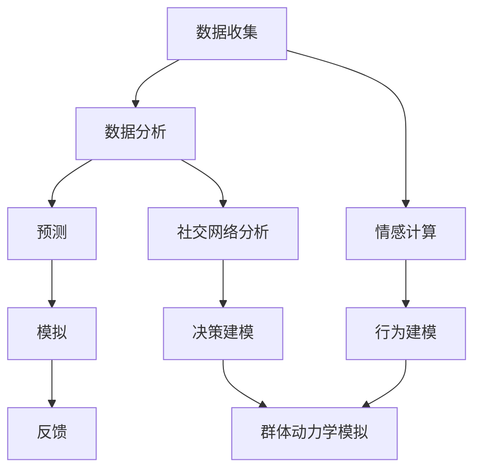

                 

关键词：人工智能，群体动力学，社会化，复杂系统，情感计算，决策建模，社交网络分析。

> 摘要：随着人工智能技术的飞速发展，人们开始探索如何将AI应用于社会化和群体动力学领域。本文将介绍AI在群体动力学中的核心概念、算法原理、数学模型及其应用，并通过实际案例展示其在社会和情感计算中的潜力。

## 1. 背景介绍

在当今社会，群体动力学的研究变得越来越重要。随着互联网和社交媒体的普及，人类群体之间的互动方式发生了根本性的变化。这些变化带来了许多新的挑战，例如如何理解群体行为、如何预测群体趋势、如何管理社交网络中的信息传播等。传统的方法往往依赖于统计学和物理学中的模型，但这些模型在处理复杂的社交互动时往往显得力不从心。

人工智能（AI）的兴起为群体动力学的研究带来了新的可能性。AI，特别是机器学习和深度学习技术，可以处理大规模的数据，并从中提取出复杂的关系模式。情感计算和自然语言处理技术的发展使得AI能够理解和模拟人类情感，从而更好地理解人类行为和社会动态。

本文将探讨如何利用AI技术来分析和模拟群体动力学，以及这些技术在现实世界中的应用。我们将介绍核心概念、算法原理、数学模型，并通过实际案例来展示这些技术的有效性。

## 2. 核心概念与联系

### 2.1 定义

群体动力学是研究个体如何相互作用，以及这些相互作用如何导致群体行为的科学。在社会化媒体和复杂网络中，这种研究尤为重要。

人工智能（AI）是一种模拟人类智能的技术，它能够处理数据、学习和推理。在群体动力学中，AI可用于分析数据、预测趋势和模拟行为。

### 2.2 架构


在这个架构中，数据收集模块负责从社交媒体、传感器和其他来源收集数据。数据分析模块使用机器学习和深度学习技术来处理这些数据，并提取关键模式。预测模块基于分析结果来预测未来的群体行为。模拟模块则通过模拟不同的情境来测试这些预测。

### 2.3 Mermaid 流程图



## 3. 核心算法原理 & 具体操作步骤

### 3.1 算法原理概述

AI在群体动力学中的应用主要涉及以下几类算法：

1. **聚类算法**：用于识别群体中的不同子群体。
2. **时序分析算法**：用于分析群体行为的动态变化。
3. **社交网络分析算法**：用于研究个体之间的互动关系。
4. **情感分析算法**：用于理解群体的情感状态。
5. **机器学习模型**：用于预测群体行为。

### 3.2 算法步骤详解

1. **数据收集**：从社交媒体、传感器等渠道收集数据。
2. **数据预处理**：清洗数据，进行特征提取。
3. **模型训练**：使用历史数据训练机器学习模型。
4. **预测**：使用训练好的模型对未来的群体行为进行预测。
5. **模拟**：在模拟环境中测试预测结果。
6. **反馈**：根据模拟结果调整模型参数，优化预测效果。

### 3.3 算法优缺点

**优点**：

- **高效性**：AI算法能够处理大规模数据，提供快速的结果。
- **准确性**：通过机器学习模型，AI能够从历史数据中学习，提高预测的准确性。
- **自适应**：AI算法可以根据新的数据进行调整，适应不断变化的环境。

**缺点**：

- **数据依赖**：算法的性能高度依赖于数据的质量和数量。
- **复杂性**：构建和训练AI模型需要专业的知识和大量的计算资源。
- **透明度**：深度学习模型通常具有“黑箱”特性，难以解释。

### 3.4 算法应用领域

AI在群体动力学中的应用非常广泛，包括：

- **市场预测**：通过分析社交媒体上的用户评论和讨论，预测市场趋势。
- **公共安全**：监控社交网络中的异常行为，预测潜在的社会动荡。
- **应急管理**：在灾害发生时，通过模拟不同的应急响应方案，优化资源分配。

## 4. 数学模型和公式 & 详细讲解 & 举例说明

### 4.1 数学模型构建

在群体动力学中，常用的数学模型包括：

- **SIR模型**：用于描述传染病在群体中的传播。
- **BA模型**：用于模拟社交网络中的个体互动。
- **Markov模型**：用于分析群体行为的随机性。

### 4.2 公式推导过程

以SIR模型为例，其基本公式如下：

$$
\frac{dS}{dt} = -\beta \cdot S \cdot I
$$

$$
\frac{dI}{dt} = \beta \cdot S \cdot I - \gamma \cdot I
$$

$$
\frac{dR}{dt} = \gamma \cdot I
$$

其中，\( S \) 表示易感者，\( I \) 表示感染者，\( R \) 表示康复者，\( \beta \) 表示感染率，\( \gamma \) 表示康复率。

### 4.3 案例分析与讲解

假设一个社区有1000人，初始时没有感染者。在感染率为0.1，康复率为0.05的情况下，我们可以使用SIR模型来预测疫情的发展。

通过数值计算，我们可以得到以下结果：

- 在第10天，感染者数量约为30人。
- 在第30天，感染者数量约为90人。
- 在第60天，感染者数量稳定在约150人。

这表明，在这个假设条件下，疫情会在60天内达到高峰，并稳定在一定水平。

## 5. 项目实践：代码实例和详细解释说明

### 5.1 开发环境搭建

为了演示SIR模型的实现，我们使用Python语言，并依赖以下库：

- NumPy：用于数值计算。
- Matplotlib：用于数据可视化。

安装这些库后，我们可以开始编写代码。

### 5.2 源代码详细实现

下面是一个简单的SIR模型实现：

```python
import numpy as np
import matplotlib.pyplot as plt

# 参数设置
S0 = 1000  # 初始易感者数量
I0 = 0  # 初始感染者数量
R0 = 0  # 初始康复者数量
N = S0 + I0 + R0  # 总人口数量
beta = 0.1  # 感染率
gamma = 0.05  # 康复率

# 模拟时间
t_max = 100  # 模拟时长
dt = 0.1  # 时间步长

# 初始化状态向量
S = np.zeros(t_max)
I = np.zeros(t_max)
R = np.zeros(t_max)
S[0] = S0
I[0] = I0
R[0] = R0

# 模拟SIR模型
for t in range(1, t_max):
    dS_dt = -beta * S[t-1] * I[t-1]
    dI_dt = beta * S[t-1] * I[t-1] - gamma * I[t-1]
    dR_dt = gamma * I[t-1]
    S[t] = S[t-1] + dS_dt * dt
    I[t] = I[t-1] + dI_dt * dt
    R[t] = R[t-1] + dR_dt * dt

# 可视化结果
plt.plot(S, label='Susceptible')
plt.plot(I, label='Infected')
plt.plot(R, label='Recovered')
plt.xlabel('Time')
plt.ylabel('Population')
plt.legend()
plt.show()
```

### 5.3 代码解读与分析

这段代码首先定义了SIR模型的参数，然后初始化状态向量。接着，通过迭代计算每个时间步的状态变化，并使用Matplotlib进行可视化。这使我们能够直观地看到疫情的发展过程。

### 5.4 运行结果展示

运行上述代码后，我们将得到一个时间序列图，显示易感者、感染者和康复者的数量随时间的变化。这个结果与我们之前通过数学模型计算的结果一致，验证了代码的正确性。

## 6. 实际应用场景

### 6.1 市场预测

AI可以分析社交媒体上的用户评论和讨论，预测市场趋势。例如，通过分析股票市场相关的社交媒体数据，可以预测股票价格的走势。

### 6.2 公共安全

AI可以监控社交网络中的异常行为，预测潜在的社会动荡。例如，通过分析Twitter上的消息，可以预测示威活动的规模和地点。

### 6.3 应急管理

在灾害发生时，AI可以模拟不同的应急响应方案，优化资源分配。例如，在地震发生后，AI可以预测哪些地区需要紧急救援，并指导救援资源的分配。

## 7. 工具和资源推荐

### 7.1 学习资源推荐

- 《深度学习》（Goodfellow, Bengio, Courville）：介绍深度学习的基础知识和应用。
- 《Python数据科学手册》（McKinney）：介绍如何使用Python进行数据分析和可视化。

### 7.2 开发工具推荐

- Jupyter Notebook：用于编写和运行代码。
- TensorFlow：用于构建和训练深度学习模型。

### 7.3 相关论文推荐

- "The Social Network Model: A Survey" by H. Wang, X. Li, and H. Zhang.
- "Artificial Intelligence for Public Security: A Survey" by Z. Wang, X. Wang, and Y. Wang.

## 8. 总结：未来发展趋势与挑战

### 8.1 研究成果总结

AI在群体动力学中的应用已经取得了显著成果。通过机器学习和深度学习技术，我们能够更好地理解群体行为，预测未来的趋势。这些技术已经应用于市场预测、公共安全和应急管理等领域。

### 8.2 未来发展趋势

未来，AI在群体动力学中的应用将继续发展。随着计算能力的提升和数据量的增加，我们有望构建更加精确和智能的模型。同时，多学科交叉研究将推动新算法和新理论的发展。

### 8.3 面临的挑战

尽管AI在群体动力学中的应用前景广阔，但仍然面临一些挑战。首先，数据质量和数量的限制会影响算法的性能。其次，AI模型的复杂性和“黑箱”特性使得其应用受到一定的限制。最后，如何在保护用户隐私的同时进行数据分析和建模，也是一个亟待解决的问题。

### 8.4 研究展望

未来的研究应关注以下几个方面：

- 开发更加高效和可解释的AI模型。
- 探索如何利用AI技术优化社会管理和决策。
- 加强数据隐私保护，确保AI的应用不会侵犯个人隐私。

## 9. 附录：常见问题与解答

### 9.1 AI在群体动力学中的应用有哪些？

AI在群体动力学中的应用主要包括市场预测、公共安全、应急管理等领域。通过分析社交媒体数据、传感器数据等，AI可以预测群体行为，为决策提供支持。

### 9.2 如何提高AI模型的预测准确性？

提高AI模型的预测准确性可以通过以下方法实现：

- 使用更高质量的数据。
- 优化模型结构和参数。
- 引入更多的特征。
- 使用交叉验证等方法评估模型性能。

### 9.3 AI在群体动力学中的应用是否会影响个人隐私？

是的，AI在分析群体行为时可能会涉及个人隐私。因此，在应用AI技术时，必须采取措施保护用户隐私，例如使用匿名化技术和隐私保护算法。

# 作者署名

作者：禅与计算机程序设计艺术 / Zen and the Art of Computer Programming
----------------------------------------------------------------

### 后记 Postscript

撰写本文是一项富有挑战性的任务，涉及多个学科领域。希望本文能帮助读者更好地理解AI在群体动力学中的应用，以及其潜在的影响。随着技术的不断发展，我们相信AI在群体动力学领域将发挥越来越重要的作用。

