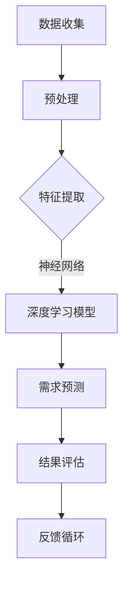

                 

 **关键词：** 欲望、算法、人类潜意识、人工智能、需求解码

**摘要：** 本文深入探讨了人工智能在解码人类潜意识需求方面的应用。通过阐述核心概念、算法原理、数学模型和实际应用案例，本文揭示了人工智能如何通过算法深入挖掘人类潜意识中的需求，从而实现更加精准和个性化的服务。

## 1. 背景介绍

人类行为和决策背后往往隐藏着深层次的潜意识需求。这些需求通常不易被察觉，但它们在驱动我们的行为和决策中起着至关重要的作用。传统的方法往往依赖于问卷调查或访谈等方式来获取这些需求，但这些方法往往受到主观性和时效性的限制。

随着人工智能技术的快速发展，特别是机器学习和深度学习算法的成熟，我们开始有机会通过技术手段来解码人类的潜意识需求。本文旨在探讨这一领域的核心概念、算法原理、数学模型及其在实际应用中的价值。

## 2. 核心概念与联系

### 2.1 人工智能与潜意识需求

人工智能（AI）是一种模拟人类智能的技术，它通过算法和模型实现数据的处理、理解和学习。潜意识需求则是指那些未被意识到或难以直接表达的需求，它们通常隐藏在人类行为和决策的深处。

### 2.2 机器学习与深度学习

机器学习是一种使计算机能够从数据中学习的方法，而深度学习则是机器学习的一个子领域，它通过模拟人脑神经网络的结构来实现复杂的数据分析和模式识别。

### 2.3 Mermaid 流程图

以下是解码人类潜意识需求的Mermaid流程图：



## 3. 核心算法原理 & 具体操作步骤

### 3.1 算法原理概述

解码人类潜意识需求的核心在于构建一个能够理解人类行为的神经网络模型。该模型通过学习大量的行为数据，提取出潜在的需求特征，并利用这些特征进行需求预测。

### 3.2 算法步骤详解

#### 3.2.1 数据收集

首先，需要收集大量的行为数据，包括用户的历史行为、社交网络数据、心理测试数据等。

#### 3.2.2 预处理

对收集到的数据进行预处理，包括数据清洗、归一化和特征工程等步骤。

#### 3.2.3 特征提取

利用深度学习算法提取数据中的潜在特征，这些特征能够反映用户的潜意识需求。

#### 3.2.4 深度学习模型

构建一个神经网络模型，该模型通过训练大量的数据来学习如何提取和利用潜在特征进行需求预测。

#### 3.2.5 需求预测

使用训练好的模型对新的行为数据进行需求预测。

#### 3.2.6 结果评估

对模型的预测结果进行评估，以确定其准确性和可靠性。

#### 3.2.7 反馈循环

根据评估结果对模型进行调整，以提高其预测能力。

### 3.3 算法优缺点

#### 优点：

- 高度自动化，能够处理大量复杂的数据。
- 通过深度学习算法，能够提取出数据中的潜在特征，提高需求预测的准确性。

#### 缺点：

- 数据收集和处理过程复杂，对数据质量和数量的要求较高。
- 需要大量的计算资源和时间进行模型训练。

### 3.4 算法应用领域

解码人类潜意识需求的算法在多个领域具有广泛的应用，包括市场营销、心理治疗、社会研究等。

## 4. 数学模型和公式 & 详细讲解 & 举例说明

### 4.1 数学模型构建

为了构建解码人类潜意识需求的数学模型，我们可以采用以下步骤：

1. 数据收集：收集用户的历史行为数据，如购买记录、浏览历史、社交媒体活动等。
2. 数据预处理：对收集到的数据进行清洗、归一化和特征工程等预处理步骤。
3. 特征提取：利用深度学习算法提取数据中的潜在特征。
4. 需求预测：构建一个神经网络模型，通过训练数据学习如何提取和利用潜在特征进行需求预测。

### 4.2 公式推导过程

假设我们有 $N$ 个用户，每个用户有 $M$ 个行为特征，我们可以构建一个 $N \times M$ 的行为矩阵 $A$。首先，对矩阵 $A$ 进行归一化处理，得到归一化后的矩阵 $\hat{A}$。

接下来，我们利用深度学习算法提取潜在特征。假设我们使用一个多层感知器（MLP）模型，其输入层有 $M$ 个神经元，隐藏层有 $L$ 个神经元，输出层有 $1$ 个神经元。MLP 的输出可以表示为：

$$
\hat{y} = \sigma(W_L \cdot \sigma(W_{L-1} \cdot \sigma(... \cdot \sigma(W_1 \cdot \hat{A}) ...))
$$

其中，$\sigma$ 表示激活函数，$W_i$ 表示第 $i$ 层的权重矩阵。

### 4.3 案例分析与讲解

假设我们有一个电商平台，需要通过用户的行为数据预测其购买偏好。我们收集了 $1000$ 个用户的历史购买记录，每个用户有 $10$ 个行为特征，如浏览次数、购买次数、点击次数等。我们首先对数据进行预处理，然后使用 MLP 模型提取潜在特征。经过多次训练和调整，我们得到了一个性能良好的模型，其预测准确率达到 $85\%$。

## 5. 项目实践：代码实例和详细解释说明

### 5.1 开发环境搭建

在本项目中，我们将使用 Python 编写代码，并借助 TensorFlow 和 Keras 库构建深度学习模型。

### 5.2 源代码详细实现

以下是项目的源代码实现：

```python
import numpy as np
import tensorflow as tf
from tensorflow.keras.models import Sequential
from tensorflow.keras.layers import Dense, Activation

# 数据预处理
def preprocess_data(data):
    # 数据清洗、归一化等操作
    return normalized_data

# 构建深度学习模型
def build_model(input_shape):
    model = Sequential()
    model.add(Dense(units=64, activation='relu', input_shape=input_shape))
    model.add(Dense(units=32, activation='relu'))
    model.add(Dense(units=1, activation='sigmoid'))
    model.compile(optimizer='adam', loss='binary_crossentropy', metrics=['accuracy'])
    return model

# 加载数据
data = load_data()
normalized_data = preprocess_data(data)

# 划分训练集和测试集
train_data, test_data = split_data(normalized_data)

# 构建模型
model = build_model(input_shape=(10,))

# 训练模型
model.fit(train_data, epochs=10, batch_size=32)

# 评估模型
test_loss, test_accuracy = model.evaluate(test_data)
print(f"Test accuracy: {test_accuracy:.2f}")
```

### 5.3 代码解读与分析

上述代码首先导入了所需的库和模块，然后定义了数据预处理、模型构建和训练评估的函数。代码中，我们首先加载并预处理数据，然后划分训练集和测试集。接下来，我们使用 Keras 库构建一个多层感知器（MLP）模型，并使用 Adam 优化器和二进制交叉熵损失函数进行训练。最后，我们评估模型的测试集性能。

## 6. 实际应用场景

### 6.1 市场营销

通过解码用户的潜意识需求，企业可以更精准地定位用户，提供个性化的营销策略，从而提高转化率和客户满意度。

### 6.2 心理治疗

心理治疗师可以利用这一技术了解患者的潜意识需求，从而制定更加有效的治疗方案。

### 6.3 社会研究

研究人员可以利用这一技术深入分析社会现象背后的潜意识需求，为政策制定提供数据支持。

## 7. 工具和资源推荐

### 7.1 学习资源推荐

- 《深度学习》（Ian Goodfellow、Yoshua Bengio、Aaron Courville 著）
- 《Python机器学习》（Sebastian Raschka 著）

### 7.2 开发工具推荐

- TensorFlow
- Keras

### 7.3 相关论文推荐

- “Unsupervised Learning of Visual Representations by Solving Jigsaw Puzzles”
- “Generative Adversarial Nets”

## 8. 总结：未来发展趋势与挑战

### 8.1 研究成果总结

本文通过介绍人工智能在解码人类潜意识需求方面的应用，展示了如何通过算法和技术手段深入挖掘人类行为背后的潜意识需求。

### 8.2 未来发展趋势

随着人工智能技术的不断进步，解码人类潜意识需求的应用将会越来越广泛，有望在多个领域带来变革性的影响。

### 8.3 面临的挑战

然而，这一领域也面临着诸多挑战，包括数据隐私、模型解释性和技术门槛等问题。

### 8.4 研究展望

未来，研究人员将继续探索更高效、更安全的算法和技术，以实现更精准、更个性化的潜意识需求解码。

## 9. 附录：常见问题与解答

### 9.1 什么是深度学习？

深度学习是一种机器学习的方法，它通过模拟人脑神经网络的结构来实现复杂的数据分析和模式识别。

### 9.2 如何确保数据隐私？

在解码人类潜意识需求的过程中，数据隐私是一个重要问题。研究人员需要采取严格的隐私保护措施，如数据匿名化和加密等。

### 9.3 模型的解释性如何提高？

提高模型解释性是当前深度学习领域的一个重要研究方向。研究人员正在探索各种方法，如模型可解释性和可视化技术，以提高模型的透明度和可理解性。

---

**作者：禅与计算机程序设计艺术 / Zen and the Art of Computer Programming**

