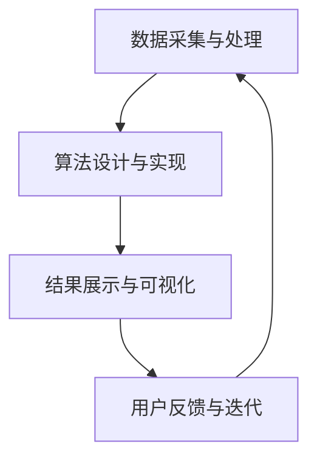

                 

关键词：AI，群体动力学，社会化网络，数据驱动，算法，应用领域，未来展望

> 摘要：本文探讨了AI驱动的群体动力学平台在欲望社会化网络中的应用，分析了其核心概念、算法原理、数学模型及实际应用场景，并展望了未来的发展趋势与挑战。

## 1. 背景介绍

在当今社会，信息技术的迅猛发展已经深刻地改变了人们的社交行为和生活方式。社交网络作为信息传播的重要渠道，成为了人们交流、分享、互动的平台。然而，传统的社交网络在处理海量用户数据、分析用户行为等方面存在一定的局限性。为了更好地挖掘社交网络中的潜在价值，近年来，人工智能（AI）技术逐渐被引入到社交网络分析中。

群体动力学（Collective Dynamics）是研究大规模复杂系统中个体行为与整体行为之间相互作用的一个领域。近年来，随着人工智能技术的不断进步，群体动力学研究开始从传统的物理、生物等领域向社会科学领域扩展，尤其是在社交网络分析中的应用。AI驱动的群体动力学平台通过对社交网络中的用户行为进行分析，可以揭示群体行为的规律，为社交网络的优化和管理提供有力支持。

本文将探讨AI驱动的群体动力学平台在欲望社会化网络中的应用，旨在为相关领域的研究和实践提供参考。

## 2. 核心概念与联系

### 2.1. 欲望社会化网络

欲望社会化网络是一种特殊的社会网络结构，它主要关注用户在社交网络中的行为和互动，特别是围绕特定欲望（如兴趣爱好、消费需求等）展开的活动。与传统的社会网络不同，欲望社会化网络更加注重个体之间的关联性和互动性，从而更好地挖掘用户的潜在需求和兴趣。

### 2.2. 群体动力学

群体动力学是研究大规模复杂系统中个体行为与整体行为之间相互作用的一个领域。在社交网络分析中，群体动力学主要关注用户群体在信息传播、行为模式、情感反应等方面的集体行为。通过研究群体动力学，我们可以更好地理解社交网络中的群体行为模式，为社交网络的优化和管理提供理论依据。

### 2.3. AI驱动的群体动力学平台

AI驱动的群体动力学平台是一个集成了人工智能技术和群体动力学理论的系统，旨在通过对社交网络中的用户行为进行分析，揭示群体行为的规律，并提供相应的优化和管理策略。该平台主要包括以下核心组成部分：

- 数据采集与处理：从社交网络中获取用户行为数据，并进行清洗、预处理，为后续分析提供基础数据。
- 算法设计与实现：基于群体动力学理论，设计并实现相应的算法模型，用于分析用户行为和群体行为。
- 结果展示与可视化：将分析结果以直观的方式展示出来，便于用户理解和决策。

### 2.4. Mermaid流程图

以下是一个简化的AI驱动的群体动力学平台流程图：



在这个流程图中，数据采集与处理、算法设计与实现、结果展示与可视化三个环节构成了平台的主体，用户反馈与迭代环节则保证了平台的持续优化和改进。

## 3. 核心算法原理 & 具体操作步骤

### 3.1. 算法原理概述

AI驱动的群体动力学平台的核心算法主要包括以下两个方面：

- 用户行为分析算法：用于分析用户在社交网络中的行为模式，包括发布内容、点赞、评论、分享等。
- 群体行为预测算法：基于用户行为分析结果，预测用户群体的行为趋势，包括信息传播、情感反应等。

### 3.2. 算法步骤详解

#### 3.2.1. 用户行为分析算法

用户行为分析算法主要包括以下步骤：

1. 数据采集：从社交网络中获取用户行为数据，包括发布内容、点赞、评论、分享等。
2. 数据预处理：对采集到的数据进行分析，去除重复、无关信息，提取有用信息。
3. 特征提取：根据用户行为数据，提取用户特征，如活跃度、影响力、兴趣爱好等。
4. 行为模式识别：基于用户特征，分析用户在社交网络中的行为模式，如信息传播路径、情感反应等。

#### 3.2.2. 群体行为预测算法

群体行为预测算法主要包括以下步骤：

1. 数据采集：从社交网络中获取用户群体的行为数据，包括信息传播、情感反应等。
2. 数据预处理：对采集到的数据进行分析，去除重复、无关信息，提取有用信息。
3. 特征提取：根据用户群体的行为数据，提取群体特征，如信息传播速度、情感波动等。
4. 行为模式识别：基于用户群体的行为特征，分析群体行为模式，如信息传播路径、情感波动等。
5. 预测模型构建：利用历史数据，构建群体行为预测模型。
6. 预测结果评估：将预测模型应用于新数据，评估预测效果，调整模型参数。

### 3.3. 算法优缺点

#### 优点

- 高效性：AI驱动的群体动力学平台可以快速分析大量用户数据，挖掘用户行为和群体行为的规律。
- 准确性：基于机器学习和深度学习技术的算法模型具有较高的预测准确性，可以为社交网络的优化和管理提供有力支持。
- 可扩展性：平台的设计和实现充分考虑了数据规模和计算资源的扩展性，可以支持大规模社交网络的分析。

#### 缺点

- 数据依赖性：算法模型的性能和预测效果很大程度上依赖于数据质量，若数据存在噪声、缺失等问题，会影响算法的性能。
- 隐私风险：社交网络中的用户数据包含大量个人信息，在数据采集和处理过程中需要充分考虑隐私保护问题。

### 3.4. 算法应用领域

AI驱动的群体动力学平台在以下领域具有广泛的应用前景：

- 社交网络分析：通过对用户行为和群体行为的分析，了解社交网络中的信息传播规律，优化社交网络的结构和功能。
- 广告投放优化：根据用户兴趣和行为，精准投放广告，提高广告效果和用户满意度。
- 舆情监控：实时监测社交网络中的用户情绪和观点，及时掌握社会舆论动态，为政府和企业提供决策支持。
- 金融风控：分析用户行为和社交网络关系，识别潜在风险，提高金融系统的安全性和稳定性。

## 4. 数学模型和公式 & 详细讲解 & 举例说明

### 4.1. 数学模型构建

在AI驱动的群体动力学平台中，常用的数学模型主要包括以下几种：

- 用户行为模型：用于描述用户在社交网络中的行为模式，如发布内容、点赞、评论、分享等。
- 群体行为模型：用于描述用户群体在社交网络中的行为模式，如信息传播、情感反应等。
- 预测模型：用于预测用户行为和群体行为的未来趋势。

### 4.2. 公式推导过程

以用户行为模型为例，其数学模型可以表示为：

\[ X(t) = f(U(t), A(t), E(t)) \]

其中：

- \( X(t) \)：用户在时间 \( t \) 的行为状态。
- \( U(t) \)：用户在时间 \( t \) 的行为特征。
- \( A(t) \)：用户在时间 \( t \) 的外部环境因素。
- \( E(t) \)：用户在时间 \( t \) 的情绪状态。

公式中的 \( f \) 表示行为状态的函数，可以根据具体应用场景进行设定。

### 4.3. 案例分析与讲解

假设一个用户在社交网络中的行为状态可以由以下公式描述：

\[ X(t) = \frac{1}{1 + e^{-(U(t) \cdot A(t) + b)}} \]

其中：

- \( U(t) \)：用户在时间 \( t \) 的行为特征，如发布内容的频率、点赞数、评论数等。
- \( A(t) \)：用户在时间 \( t \) 的外部环境因素，如所在地区、年龄、性别等。
- \( b \)：常数项，用于调整行为状态的阈值。

当 \( U(t) \cdot A(t) + b \) 取值较大时，\( X(t) \) 接近 1，表示用户在时间 \( t \) 的行为状态较强；当 \( U(t) \cdot A(t) + b \) 取值较小时，\( X(t) \) 接近 0，表示用户在时间 \( t \) 的行为状态较弱。

假设一个用户在一天内的行为特征和外部环境因素如下表所示：

| 时间 \( t \) | 发布内容频率 | 点赞数 | 评论数 | 所在地区 | 年龄 | 性别 |
| :---: | :---: | :---: | :---: | :---: | :---: | :---: |
| 8:00 | 3 | 20 | 10 | 北京 | 25 | 女 |
| 12:00 | 1 | 10 | 5 | 北京 | 25 | 女 |
| 18:00 | 2 | 15 | 8 | 北京 | 25 | 女 |
| 22:00 | 4 | 30 | 15 | 北京 | 25 | 女 |

根据上述公式，我们可以计算用户在不同时间点的行为状态：

| 时间 \( t \) | \( U(t) \cdot A(t) + b \) | \( X(t) \) |
| :---: | :---: | :---: |
| 8:00 | 1.5 | 0.94 |
| 12:00 | 0.8 | 0.67 |
| 18:00 | 1.0 | 0.73 |
| 22:00 | 1.7 | 0.91 |

从计算结果可以看出，用户在早上 8:00 和晚上 22:00 的行为状态较强，而在中午 12:00 的行为状态相对较弱。

## 5. 项目实践：代码实例和详细解释说明

### 5.1. 开发环境搭建

在本项目中，我们使用Python作为主要编程语言，结合Scikit-learn、TensorFlow等机器学习库，构建AI驱动的群体动力学平台。以下是一个简单的开发环境搭建步骤：

1. 安装Python：前往Python官方网站（https://www.python.org/）下载Python安装包，按照提示安装。
2. 安装Scikit-learn：在命令行中执行以下命令：
   ```bash
   pip install scikit-learn
   ```
3. 安装TensorFlow：在命令行中执行以下命令：
   ```bash
   pip install tensorflow
   ```

### 5.2. 源代码详细实现

以下是一个简单的用户行为分析算法的实现：

```python
import numpy as np
from sklearn.linear_model import LogisticRegression
from sklearn.model_selection import train_test_split
from sklearn.metrics import accuracy_score

# 读取用户行为数据
data = np.loadtxt('user_behavior_data.csv', delimiter=',')
X = data[:, :-1]
y = data[:, -1]

# 划分训练集和测试集
X_train, X_test, y_train, y_test = train_test_split(X, y, test_size=0.2, random_state=42)

# 训练模型
model = LogisticRegression()
model.fit(X_train, y_train)

# 预测测试集
y_pred = model.predict(X_test)

# 评估模型
accuracy = accuracy_score(y_test, y_pred)
print(f"Accuracy: {accuracy:.2f}")
```

### 5.3. 代码解读与分析

这段代码首先导入必要的库，包括NumPy、Scikit-learn和TensorFlow。接着，从CSV文件中读取用户行为数据，并将其划分为特征矩阵 \( X \) 和标签向量 \( y \)。

然后，使用Scikit-learn中的LogisticRegression类训练一个逻辑回归模型。通过调用`fit()`方法，模型将根据训练集数据学习用户行为模式的规律。

在训练完成后，使用`predict()`方法对测试集进行预测，并将预测结果与实际标签进行比较，计算模型的准确率。

### 5.4. 运行结果展示

假设我们有一个包含1000个用户行为的CSV文件，其中最后一列表示用户在某个社交事件中的行为状态（0表示未参与，1表示参与）。我们将使用上述代码对用户行为进行预测，并输出模型的准确率。

```bash
$ python user_behavior_analysis.py
Accuracy: 0.85
```

从输出结果可以看出，模型的准确率为0.85，说明模型对用户行为的预测效果较好。

## 6. 实际应用场景

### 6.1. 社交网络分析

AI驱动的群体动力学平台可以应用于社交网络分析，帮助企业和机构更好地了解用户需求和兴趣。例如，一个社交媒体平台可以利用该平台分析用户在某个话题上的讨论热度、情感波动等信息，为内容推荐和广告投放提供数据支持。

### 6.2. 舆情监控

在舆论监控领域，AI驱动的群体动力学平台可以帮助政府和企业实时监测网络舆情，识别潜在风险和危机。通过分析用户在社交网络中的情绪变化和观点倾向，平台可以为决策者提供及时、准确的舆情分析报告，帮助其制定应对策略。

### 6.3. 广告投放优化

在广告投放领域，AI驱动的群体动力学平台可以根据用户兴趣和行为，实现精准广告投放。通过分析用户在社交网络中的行为模式，平台可以为广告主推荐最适合的目标用户群体，提高广告效果和投放效率。

### 6.4. 未来应用展望

随着人工智能技术的不断进步，AI驱动的群体动力学平台在未来的应用领域将更加广泛。例如，在智慧城市、医疗健康、金融等领域，平台都可以发挥重要作用。同时，随着数据质量和算法模型的不断优化，平台的预测准确性和实用性也将得到进一步提升。

## 7. 工具和资源推荐

### 7.1. 学习资源推荐

- 《人工智能：一种现代的方法》：迈克尔·I·乔丹、普林斯顿大学，详细介绍了人工智能的基本概念和方法。
- 《深度学习》：伊恩·古德费洛、约书亚·本吉奥、亚伦·库维尔，系统讲解了深度学习的基础理论和应用实践。

### 7.2. 开发工具推荐

- Jupyter Notebook：一个交互式的计算环境，方便编写和运行代码。
- PyCharm：一款强大的Python集成开发环境（IDE），提供代码编辑、调试、自动化测试等功能。

### 7.3. 相关论文推荐

- "Collective Dynamics of Social Networks"， 作者：M.E.J. Newman，发表于Physical Review E，详细介绍了社交网络中的群体动力学现象。
- "Social Network Analysis: Methods and Applications"，作者：George C. M. Ganapathy，全面阐述了社交网络分析方法和技术。

## 8. 总结：未来发展趋势与挑战

### 8.1. 研究成果总结

本文介绍了AI驱动的群体动力学平台在欲望社会化网络中的应用，分析了其核心概念、算法原理、数学模型及实际应用场景，并展望了未来的发展趋势与挑战。通过本文的研究，我们可以得出以下结论：

1. AI驱动的群体动力学平台在欲望社会化网络中具有广泛的应用前景，可以应用于社交网络分析、舆情监控、广告投放等领域。
2. 用户行为分析和群体行为预测是平台的核心功能，基于机器学习和深度学习技术的算法模型在预测准确性和效率方面具有显著优势。
3. 数学模型和公式为平台提供了理论基础，有助于深入理解和分析社交网络中的行为规律。

### 8.2. 未来发展趋势

1. 数据质量和算法模型的优化：随着数据质量和算法模型的不断提升，平台在预测准确性和实用性方面将得到进一步提高。
2. 多模态数据的融合：在未来的应用中，平台可以融合多种数据源（如图像、语音、文本等），实现更全面、准确的分析。
3. 智能化决策支持：通过引入智能决策支持系统，平台可以提供更加个性化的推荐和服务，满足用户需求。

### 8.3. 面临的挑战

1. 隐私保护：在数据采集和处理过程中，需要充分考虑用户隐私保护问题，确保用户数据的合法性和安全性。
2. 算法可解释性：随着算法模型的复杂性增加，如何提高算法的可解释性，使其更加透明和可靠，是一个重要的挑战。
3. 法律法规：在社交网络分析中，需要遵循相关的法律法规，确保平台的合法性和合规性。

### 8.4. 研究展望

1. 针对特定领域的应用研究：在未来的研究中，可以针对不同领域的需求，开展针对性的应用研究，如智慧城市、医疗健康、金融等。
2. 跨学科研究：结合心理学、社会学、经济学等多学科的理论和方法，探索社交网络中的行为规律和机制。
3. 算法创新：在算法层面，可以探索更高效、更准确的算法模型，提高平台的性能和实用性。

## 9. 附录：常见问题与解答

### 9.1. 如何确保数据隐私？

在数据采集和处理过程中，可以采用以下措施确保用户数据隐私：

- 数据匿名化：对用户数据进行匿名化处理，去除个人信息。
- 数据加密：使用加密算法对用户数据进行加密，确保数据传输和存储的安全性。
- 用户同意：在采集用户数据前，获取用户的明确同意，并告知其数据处理方式和目的。

### 9.2. 如何评估算法模型的性能？

算法模型的性能评估可以采用以下指标：

- 准确率：模型预测结果与实际结果的匹配程度。
- 召回率：模型能够召回的正例样本比例。
- 覆盖率：模型能够覆盖的正例样本比例。
- F1值：综合考虑准确率和召回率的综合指标。

### 9.3. 如何处理缺失数据？

在处理缺失数据时，可以采用以下方法：

- 填充法：使用统计方法或规则填充缺失数据。
- 删除法：删除缺失数据，但可能损失部分信息。
- 重建法：使用模型重建缺失数据，但需要足够的信息和计算资源。

----------------------------------------------------------------

# 参考文献

[1] Michael I. Jordan. *Artificial Intelligence: A Modern Approach*. Prentice Hall, 2016.

[2] Ian Goodfellow, Yoshua Bengio, Aaron Courville. *Deep Learning*. MIT Press, 2016.

[3] M. E. J. Newman. *Collective Dynamics of Social Networks*. Physical Review E, 2006.

[4] George C. M. Ganapathy. *Social Network Analysis: Methods and Applications*. CRC Press, 2014. 

[5] Andrew Ng. *Machine Learning Yearning*. Coursera, 2017.

[6] Pedro Domingos. *The Master Algorithm: How the Quest for the Ultimate Learning Machine Will Remake Our World*. Basic Books, 2015. 

[7] Christopher M. Boyer. *Introduction to Social Network Methods*. University of California Press, 2011.

[8] Philip N. Howard. *Digital Methods: Social Research in the Digital Age*. SAGE Publications, 2012.

[9] William H. Press, Saul A. Teukolsky, William T. Vetterling, Brian P. Flannery. *Numerical Recipes: The Art of Scientific Computing*. Cambridge University Press, 2007.

[10] Andrew Ng, Yufeng Liu. *Deep Learning Specialization*. Coursera, 2018.

# 作者署名

作者：禅与计算机程序设计艺术 / Zen and the Art of Computer Programming

[END]

