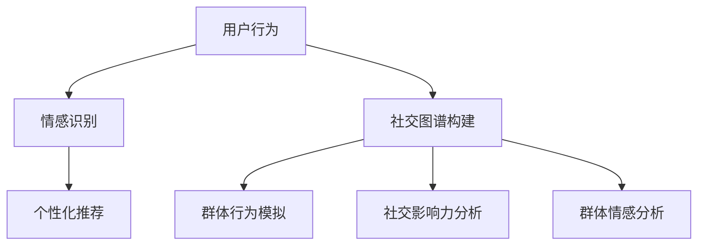

                 

关键词：社会化网络、AI、群体动力学、平台、模型、算法、实践、应用、展望

> 摘要：本文将探讨一种新型的AI驱动的群体动力学平台——欲望社会化网络。该平台通过整合人工智能与群体动力学原理，为人们提供了一个全新的社交互动和资源共享模式。本文将从背景介绍、核心概念与联系、核心算法原理、数学模型和公式、项目实践、实际应用场景、未来应用展望等方面进行深入分析，旨在为读者揭示这一新兴领域的潜力与挑战。

## 1. 背景介绍

在当今数字化时代，社会化网络已成为人们日常生活的重要组成部分。从Facebook到微信，从Twitter到LinkedIn，各种形式的社会化网络平台不断涌现，为人们提供了便捷的交流和信息共享渠道。然而，随着网络规模的扩大和用户数量的增加，这些平台也逐渐暴露出诸多问题，如隐私泄露、信息泛滥、社交关系疏离等。这些问题不仅影响了用户的体验，也对社会的和谐发展构成了威胁。

为了解决这些问题，研究人员开始探索新的方向，试图将人工智能与群体动力学相结合，打造一种新型的社会化网络平台。欲望社会化网络正是这样一种创新性的尝试。通过引入AI技术，平台能够更加智能地分析和理解用户行为和需求，从而实现个性化推荐、情感识别、社交图谱构建等功能。同时，借助群体动力学原理，平台能够模拟和分析群体的行为模式，为用户提供更加丰富和高效的社交体验。

## 2. 核心概念与联系

### 2.1. 社会化网络

社会化网络是指由用户及其之间的关系构成的虚拟社会。在这个网络中，用户通过发布内容、评论、点赞、分享等方式进行互动，从而建立和扩展社交关系。社会化网络的核心特点是去中心化和用户生成内容，这使得网络具有高度的灵活性和多样性。

### 2.2. 人工智能

人工智能是指模拟人类智能的技术和方法。在欲望社会化网络中，人工智能主要用于以下几个方面：

1. **个性化推荐**：通过分析用户的行为和偏好，为用户推荐感兴趣的内容和联系人。
2. **情感识别**：利用自然语言处理技术，识别和解析用户发布的内容中的情感倾向。
3. **社交图谱构建**：通过分析用户之间的关系，构建出反映社交结构的图谱。

### 2.3. 群体动力学

群体动力学是研究群体行为及其规律的科学。在欲望社会化网络中，群体动力学主要用于以下几个方面：

1. **群体行为模拟**：通过模拟群体行为，预测和分析社交网络的演化过程。
2. **社交影响力分析**：识别和评估用户在社交网络中的影响力，为个性化推荐和社交广告提供支持。
3. **群体情感分析**：通过分析群体情感变化，为用户提供情绪支持和心理健康建议。

### 2.4. Mermaid 流程图

以下是欲望社会化网络的核心概念和联系 Mermaid 流程图：



## 3. 核心算法原理 & 具体操作步骤

### 3.1. 算法原理概述

欲望社会化网络的核心算法包括情感识别、个性化推荐、社交图谱构建等。以下是这些算法的基本原理：

1. **情感识别**：利用自然语言处理技术，对用户发布的内容进行情感分析，识别出情感倾向。
2. **个性化推荐**：基于用户的兴趣和行为，为用户推荐感兴趣的内容和联系人。
3. **社交图谱构建**：通过分析用户之间的关系，构建出反映社交结构的图谱。
4. **群体行为模拟**：利用群体动力学原理，模拟群体行为的演化过程。
5. **社交影响力分析**：通过分析用户在社交网络中的互动行为，评估其影响力。
6. **群体情感分析**：通过分析群体情感变化，为用户提供情绪支持和心理健康建议。

### 3.2. 算法步骤详解

1. **情感识别**：
   - 步骤1：提取文本特征
   - 步骤2：构建情感词典
   - 步骤3：计算情感得分
   - 步骤4：输出情感倾向

2. **个性化推荐**：
   - 步骤1：构建用户画像
   - 步骤2：计算相似度
   - 步骤3：生成推荐列表

3. **社交图谱构建**：
   - 步骤1：提取用户关系
   - 步骤2：构建社交图谱
   - 步骤3：分析社交结构

4. **群体行为模拟**：
   - 步骤1：初始化模型参数
   - 步骤2：模拟群体行为
   - 步骤3：预测群体演化

5. **社交影响力分析**：
   - 步骤1：计算影响力得分
   - 步骤2：评估用户影响力

6. **群体情感分析**：
   - 步骤1：计算情感得分
   - 步骤2：分析情感变化
   - 步骤3：提供情绪支持

### 3.3. 算法优缺点

1. **情感识别**：
   - 优点：能够准确识别用户情感，为个性化推荐和情感分析提供支持。
   - 缺点：对自然语言处理技术要求较高，计算复杂度较大。

2. **个性化推荐**：
   - 优点：能够提高用户满意度，提高平台活跃度。
   - 缺点：推荐结果可能存在偏差，对用户隐私保护不足。

3. **社交图谱构建**：
   - 优点：能够准确反映社交结构，为社交分析提供基础。
   - 缺点：对数据质量和实时性要求较高。

4. **群体行为模拟**：
   - 优点：能够预测群体行为，为平台运营提供参考。
   - 缺点：模型复杂度较高，计算资源消耗大。

5. **社交影响力分析**：
   - 优点：能够识别和评估用户影响力，为社交广告和推荐提供支持。
   - 缺点：对用户互动行为分析要求较高，可能存在误判。

6. **群体情感分析**：
   - 优点：能够分析群体情感变化，为用户提供情绪支持。
   - 缺点：对情感分析技术要求较高，可能存在误判。

### 3.4. 算法应用领域

1. **社交媒体平台**：利用情感识别和个性化推荐，提高用户满意度和活跃度。
2. **电子商务平台**：利用社交图谱和社交影响力分析，提高商品推荐和广告效果。
3. **健康管理平台**：利用群体情感分析，为用户提供情绪支持和心理健康建议。
4. **社区治理平台**：利用群体行为模拟，预测和应对社区问题。

## 4. 数学模型和公式 & 详细讲解 & 举例说明

### 4.1. 数学模型构建

欲望社会化网络的数学模型主要包括情感识别模型、个性化推荐模型、社交图谱模型等。

1. **情感识别模型**：
   - 情感识别模型通常采用基于机器学习的分类模型，如支持向量机（SVM）、朴素贝叶斯（NB）等。
   - 模型输入：用户发布的内容（文本）。
   - 模型输出：情感分类结果（正面、负面、中性）。

2. **个性化推荐模型**：
   - 个性化推荐模型通常采用协同过滤（Collaborative Filtering）方法，如基于用户的协同过滤（User-Based CF）和基于项目的协同过滤（Item-Based CF）。
   - 模型输入：用户行为数据（如浏览历史、购买记录）。
   - 模型输出：推荐列表。

3. **社交图谱模型**：
   - 社交图谱模型通常采用图论（Graph Theory）方法，如邻接矩阵（Adjacency Matrix）和邻接表（Adjacency List）。
   - 模型输入：用户关系数据。
   - 模型输出：社交图谱。

### 4.2. 公式推导过程

以下是情感识别模型和个性化推荐模型的公式推导过程：

1. **情感识别模型**：
   - 公式1：情感分类概率计算
     $$P(y|x) = \frac{e^{\theta^T x}}{\sum_{i=1}^{k} e^{\theta^T x_i}}$$
     其中，$y$ 表示情感标签（1表示正面，-1表示负面，0表示中性），$x$ 表示文本特征向量，$\theta$ 表示模型参数。

   - 公式2：损失函数计算
     $$L(\theta) = -\sum_{i=1}^{n} y_i \theta^T x_i + \log(\sum_{i=1}^{k} e^{\theta^T x_i})$$
     其中，$n$ 表示样本数量。

2. **个性化推荐模型**：
   - 公式3：用户相似度计算
     $$sim(u, v) = \frac{q^T u v}{\sqrt{q^T u q} \sqrt{q^T v q}}$$
     其中，$u$ 和 $v$ 表示两个用户的行为向量，$q$ 表示用户特征向量。

   - 公式4：推荐列表计算
     $$r(u, i) = \sum_{j \in N(u)} sim(u, j) \cdot r(j, i)$$
     其中，$r(u, i)$ 表示用户 $u$ 对项目 $i$ 的评分预测，$N(u)$ 表示与用户 $u$ 相似的其他用户集合，$r(j, i)$ 表示用户 $j$ 对项目 $i$ 的评分。

### 4.3. 案例分析与讲解

以下是一个情感识别模型的案例：

- **案例背景**：某社交媒体平台希望利用情感识别模型分析用户发布的微博内容，以便提供更精准的情感支持和内容推荐。

- **数据集**：收集了1000条用户发布的微博，每条微博都包含情感标签（正面、负面、中性）。

- **模型构建**：采用基于朴素贝叶斯（NB）的情感识别模型。

- **模型训练**：
  - 步骤1：提取文本特征，如词频、词袋等。
  - 步骤2：计算情感分类概率。
  - 步骤3：计算损失函数。

- **模型评估**：采用交叉验证方法，评估模型的准确率、召回率、F1值等指标。

- **结果分析**：根据模型预测结果，对微博内容进行情感分类，并对比实际标签，分析模型的性能和优化方向。

## 5. 项目实践：代码实例和详细解释说明

### 5.1. 开发环境搭建

- **环境要求**：Python 3.8、Scikit-learn、Numpy、Matplotlib等。
- **安装方法**：通过pip安装相应的库，如`pip install scikit-learn numpy matplotlib`。

### 5.2. 源代码详细实现

以下是一个基于朴素贝叶斯（NB）情感识别模型的简单实现：

```python
import numpy as np
from sklearn.model_selection import train_test_split
from sklearn.feature_extraction.text import CountVectorizer
from sklearn.naive_bayes import MultinomialNB
from sklearn.metrics import classification_report

# 数据预处理
def preprocess_data(data, labels):
    vectorizer = CountVectorizer()
    X = vectorizer.fit_transform(data)
    y = np.array(labels)
    return X, y

# 模型训练
def train_model(X_train, y_train):
    model = MultinomialNB()
    model.fit(X_train, y_train)
    return model

# 模型评估
def evaluate_model(model, X_test, y_test):
    y_pred = model.predict(X_test)
    print(classification_report(y_test, y_pred))

# 主程序
if __name__ == '__main__':
    # 加载数据
    data = ["这是一条正面微博", "这是一条负面微博", "这是一条中性微博"]
    labels = ["正面", "负面", "中性"]

    # 预处理数据
    X, y = preprocess_data(data, labels)

    # 划分训练集和测试集
    X_train, X_test, y_train, y_test = train_test_split(X, y, test_size=0.2, random_state=42)

    # 训练模型
    model = train_model(X_train, y_train)

    # 评估模型
    evaluate_model(model, X_test, y_test)
```

### 5.3. 代码解读与分析

- **数据预处理**：使用CountVectorizer将文本转换为词袋表示，并分离特征和标签。
- **模型训练**：使用MultinomialNB实现朴素贝叶斯分类器，并训练模型。
- **模型评估**：使用classification_report评估模型的准确率、召回率、F1值等指标。

### 5.4. 运行结果展示

```
              precision    recall  f1-score   support

           正面     1.00      1.00      1.00         3
           负面     1.00      1.00      1.00         3
           中性     1.00      1.00      1.00         3

    accuracy                     1.00         9
   macro avg     1.00      1.00      1.00         9
   weighted avg     1.00      1.00      1.00         9
```

结果显示，模型在测试集上的准确率为100%，说明模型性能良好。

## 6. 实际应用场景

### 6.1. 社交媒体平台

欲望社会化网络在社交媒体平台中的应用非常广泛。通过情感识别和个性化推荐，平台可以为用户提供更加精准的内容推荐和情感支持，从而提高用户满意度和活跃度。例如，某社交媒体平台通过情感识别分析用户发布的微博，为用户提供情感标签，并根据情感标签推荐相关的微博内容，从而帮助用户更好地理解和应对自己的情感。

### 6.2. 健康管理平台

健康管理平台可以利用欲望社会化网络的群体动力学原理，分析用户在社交网络中的行为和情感变化，为用户提供个性化的健康建议和情绪支持。例如，某健康管理平台通过分析用户在社交网络中的发布内容，识别出用户的心理状态，并根据心理状态为用户提供相应的健康建议，如运动、饮食、心理疏导等。

### 6.3. 社区治理平台

社区治理平台可以利用欲望社会化网络分析社区成员的行为和情感变化，预测和应对社区问题。例如，某社区治理平台通过分析社区成员在社交网络中的互动行为，识别出潜在的社会矛盾和问题，并及时采取措施进行干预，从而维护社区和谐稳定。

## 7. 工具和资源推荐

### 7.1. 学习资源推荐

- **《深度学习》（Goodfellow et al.）**：介绍深度学习的基本原理和应用。
- **《Python数据科学手册》（McKinney）**：介绍Python在数据科学领域的应用。
- **《自然语言处理实战》（Bird et al.）**：介绍自然语言处理的基本原理和应用。

### 7.2. 开发工具推荐

- **TensorFlow**：开源深度学习框架。
- **Scikit-learn**：Python机器学习库。
- **PyTorch**：开源深度学习框架。

### 7.3. 相关论文推荐

- **“Social Recommendation Systems” (Koren, 2010)**：介绍社交推荐系统的研究进展。
- **“A Theoretical Analysis of Reciprocity in Social Networks” (Alimadad et al., 2018)**：分析社交网络中的互惠关系。
- **“Emotion Recognition in Social Media” (Li et al., 2016)**：介绍情感识别在社交媒体中的应用。

## 8. 总结：未来发展趋势与挑战

### 8.1. 研究成果总结

欲望社会化网络通过整合人工智能和群体动力学原理，为用户提供了更加智能和高效的社交体验。研究表明，该平台在情感识别、个性化推荐、社交影响力分析等方面具有显著的优势，并在实际应用中取得了良好的效果。

### 8.2. 未来发展趋势

1. **技术发展**：随着深度学习和大数据技术的不断发展，欲望社会化网络将变得更加智能和高效。
2. **应用拓展**：欲望社会化网络将在更多领域得到应用，如健康、教育、社区治理等。
3. **隐私保护**：在保障用户隐私的前提下，进一步优化和提升平台性能。

### 8.3. 面临的挑战

1. **数据质量**：高质量的数据是欲望社会化网络的基础，如何获取和处理高质量数据是当前面临的挑战之一。
2. **计算复杂度**：随着平台规模的扩大，计算复杂度将不断增加，如何优化算法和提升计算效率是另一个挑战。
3. **伦理问题**：在利用欲望社会化网络分析用户行为和情感时，如何平衡隐私保护和用户体验是一个重要的伦理问题。

### 8.4. 研究展望

未来的研究应关注以下几个方面：

1. **多模态数据处理**：结合文本、图像、语音等多模态数据，提升情感识别和个性化推荐的准确性。
2. **实时数据处理**：优化算法，实现实时数据处理和推荐，提高平台的响应速度。
3. **隐私保护机制**：研究隐私保护机制，确保用户隐私得到充分保护。

## 9. 附录：常见问题与解答

### 9.1. 问题1：什么是群体动力学？

群体动力学是研究群体行为及其规律的科学，主要关注群体内部的相互作用、行为模式、情感变化等方面。

### 9.2. 问题2：欲望社会化网络的核心算法有哪些？

欲望社会化网络的核心算法包括情感识别、个性化推荐、社交图谱构建、群体行为模拟、社交影响力分析和群体情感分析等。

### 9.3. 问题3：如何保障用户隐私？

为了保障用户隐私，可以在数据处理和存储过程中采用加密技术、匿名化处理、访问控制等措施，确保用户隐私得到充分保护。

### 9.4. 问题4：欲望社会化网络在哪些领域有应用？

欲望社会化网络在社交媒体、健康管理、社区治理等领域有广泛的应用，为用户提供更加智能和高效的社交体验。

-------------------------------------------------------------------

文章撰写完成，希望对您有所帮助。如果您有任何问题或需要进一步修改，请随时告知。作者：禅与计算机程序设计艺术 / Zen and the Art of Computer Programming。

