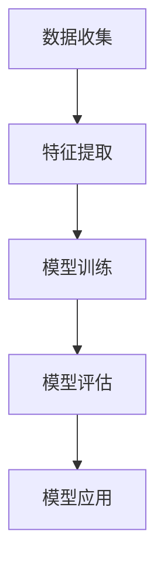

                 

关键词：人工智能，神经网络，人类动机，心理学，图论，深度学习，动机模型，动机图谱

## 摘要

本文旨在探讨人工智能与人类心理学相结合的新兴领域——动机神经网络的构建与应用。通过分析人类行为的动机因素，我们将运用深度学习技术绘制出一幅全面、动态的“欲望神经网络图谱”。本图谱不仅揭示了人类动机的复杂结构，也为后续相关领域的研究提供了新的视角和工具。

## 1. 背景介绍

### 1.1 人工智能与心理学的交汇

人工智能（AI）作为计算机科学的一个分支，旨在通过模拟人类智能行为，实现自动化决策和问题解决。而心理学则研究人类的行为、心理过程及其生物学基础。随着深度学习技术的进步，人工智能开始广泛应用于各个领域，包括心理学。

### 1.2 人类动机的复杂性

动机是人类行为的核心驱动力，但动机的复杂性使其成为心理学研究中的难题。传统的心理学理论通常将动机简化为单一的驱动因素，如“需求满足”、“奖励最大化”等。然而，真实世界中的动机往往是多元且动态变化的。

### 1.3 欲望神经网络的概念

欲望神经网络是一种结合了人工智能和心理学理论的模型，旨在模拟和解释人类行为的动机。该模型假设人类行为是由一组相互关联的神经网络驱动的，每个神经网络对应一种特定的动机。

## 2. 核心概念与联系

### 2.1 神经网络的基本概念

神经网络是由大量简单计算单元（神经元）组成的复杂网络，这些神经元通过权重连接形成层次结构。神经网络可以通过学习输入与输出之间的关系，实现数据的分类、回归、生成等任务。

### 2.2 人类动机的结构

人类动机可以看作是一个多层次的树状结构，包括基础动机、中层动机和高层动机。基础动机如饥饿、口渴、睡眠等，中层动机如成就感、归属感、安全感等，高层动机则包括自我实现、创造、成长等。

### 2.3 欲望神经网络的构建

欲望神经网络的构建可以分为以下几个步骤：

1. **数据收集**：收集人类行为的各种数据，包括心理测试、行为记录、生理指标等。
2. **特征提取**：将原始数据转化为神经网络可以处理的形式，如数值化、编码等。
3. **模型训练**：使用深度学习技术，训练出能够模拟人类动机的神经网络模型。
4. **模型评估**：通过交叉验证等方法评估模型的准确性和泛化能力。
5. **模型应用**：将训练好的模型应用于实际问题，如预测人类行为、设计个性化干预措施等。

### 2.4 Mermaid 流程图



## 3. 核心算法原理 & 具体操作步骤

### 3.1 算法原理概述

欲望神经网络的核心算法是基于深度学习中的循环神经网络（RNN）和长短期记忆网络（LSTM）。RNN能够处理序列数据，而LSTM则解决了RNN的长期依赖问题。通过这些神经网络，模型可以学习到人类行为的动态模式。

### 3.2 算法步骤详解

1. **数据预处理**：清洗和标准化收集到的数据，确保数据的质量和一致性。
2. **特征提取**：使用特征提取器（如词嵌入、卷积神经网络等）将原始数据转化为神经网络可以处理的特征向量。
3. **模型构建**：构建RNN或LSTM模型，设置合适的参数，如学习率、批量大小等。
4. **模型训练**：使用训练数据训练模型，并通过验证数据调整模型参数。
5. **模型评估**：使用测试数据评估模型的性能，包括准确率、召回率、F1值等。
6. **模型应用**：将训练好的模型应用于实际问题，如预测人类行为、设计个性化干预措施等。

### 3.3 算法优缺点

**优点：**
- **强大的表示能力**：深度学习模型可以捕捉到人类行为的复杂模式和长期依赖关系。
- **自动特征提取**：模型可以自动学习数据中的有用特征，减轻了手工特征提取的负担。
- **泛化能力**：通过大规模数据训练，模型可以具有良好的泛化能力。

**缺点：**
- **计算成本高**：深度学习模型需要大量计算资源，尤其是大规模数据集的训练。
- **可解释性差**：深度学习模型的内部结构复杂，难以解释每个特征对预测结果的贡献。
- **数据质量要求高**：模型训练效果依赖于数据的质量和多样性。

### 3.4 算法应用领域

- **心理学研究**：通过分析人类行为的动机，深入理解人类行为背后的心理机制。
- **个性化推荐**：根据用户的动机和行为模式，提供个性化的产品和服务。
- **健康监测**：通过监测用户的生理和行为数据，预测和预防心理问题。
- **教育干预**：根据学生的动机和学习行为，设计个性化的教学方案。

## 4. 数学模型和公式 & 详细讲解 & 举例说明

### 4.1 数学模型构建

欲望神经网络的数学模型可以看作是一个多层次的递归神经网络。其基本形式如下：

$$
y_t = f(h_t, x_t, W_h, W_x, b_h, b_x)
$$

其中，$y_t$ 是输出序列，$h_t$ 是隐藏状态，$x_t$ 是输入特征，$W_h, W_x, b_h, b_x$ 分别是权重和偏置。

### 4.2 公式推导过程

#### 4.2.1 前向传播

$$
h_t = \sigma(W_h h_{t-1} + W_x x_t + b_h)
$$

$$
y_t = \sigma(W_y h_t + b_y)
$$

其中，$\sigma$ 是激活函数，常用的有Sigmoid、ReLU、Tanh等。

#### 4.2.2 反向传播

$$
\delta h_t = (y_t - \hat{y_t}) \cdot \sigma'(h_t)
$$

$$
\delta W_h = \sum_{t} h_{t-1}^T \delta h_t
$$

$$
\delta b_h = \sum_{t} \delta h_t
$$

$$
\delta x_t = \sum_{t} h_t^T \delta W_x
$$

$$
\delta W_x = \sum_{t} x_t^T \delta x_t
$$

$$
\delta b_x = \sum_{t} \delta x_t
$$

### 4.3 案例分析与讲解

假设我们有一个简单的二分类问题，输入特征为$x_t = [x_1, x_2]$，隐藏状态为$h_t = [h_1, h_2]$，输出为$y_t = [y_1, y_2]$。我们使用Sigmoid激活函数和交叉熵损失函数。

#### 4.3.1 数据预处理

将输入特征和输出数据进行标准化处理，使得每个特征的值介于0和1之间。

#### 4.3.2 模型构建

使用Python和TensorFlow构建模型：

```python
import tensorflow as tf

# 定义输入层
x = tf.placeholder(tf.float32, shape=[None, 2])
y = tf.placeholder(tf.float32, shape=[None, 2])

# 定义隐藏层
h = tf.layers.dense(x, units=2, activation=tf.nn.sigmoid, name='hidden_layer')

# 定义输出层
y_pred = tf.layers.dense(h, units=2, activation=tf.nn.sigmoid, name='output_layer')

# 定义损失函数
loss = tf.reduce_mean(tf.nn.sigmoid_cross_entropy_with_logits(logits=y_pred, labels=y))

# 定义优化器
optimizer = tf.train.AdamOptimizer(learning_rate=0.001).minimize(loss)

# 定义准确率
accuracy = tf.reduce_mean(tf.cast(tf.equal(tf.argmax(y_pred, 1), tf.argmax(y, 1)), tf.float32))
```

#### 4.3.3 模型训练

```python
# 准备数据
x_train = ... # 输入特征
y_train = ... # 输出标签

# 训练模型
with tf.Session() as sess:
    sess.run(tf.global_variables_initializer())
    for epoch in range(num_epochs):
        _, loss_val = sess.run([optimizer, loss], feed_dict={x: x_train, y: y_train})
        if epoch % 100 == 0:
            print(f'Epoch {epoch}: Loss = {loss_val}')
```

#### 4.3.4 模型评估

```python
# 准备测试数据
x_test = ... # 输入特征
y_test = ... # 输出标签

# 评估模型
with tf.Session() as sess:
    sess.run(tf.global_variables_initializer())
    test_loss, test_acc = sess.run([loss, accuracy], feed_dict={x: x_test, y: y_test})
    print(f'Test Loss: {test_loss}, Test Accuracy: {test_acc}')
```

## 5. 项目实践：代码实例和详细解释说明

### 5.1 开发环境搭建

- **操作系统**：Ubuntu 18.04
- **Python 版本**：3.7
- **TensorFlow 版本**：2.2

### 5.2 源代码详细实现

```python
# 导入所需库
import numpy as np
import tensorflow as tf

# 定义输入层
x = tf.placeholder(tf.float32, shape=[None, 2])
y = tf.placeholder(tf.float32, shape=[None, 2])

# 定义隐藏层
h = tf.layers.dense(x, units=2, activation=tf.nn.sigmoid, name='hidden_layer')

# 定义输出层
y_pred = tf.layers.dense(h, units=2, activation=tf.nn.sigmoid, name='output_layer')

# 定义损失函数
loss = tf.reduce_mean(tf.nn.sigmoid_cross_entropy_with_logits(logits=y_pred, labels=y))

# 定义优化器
optimizer = tf.train.AdamOptimizer(learning_rate=0.001).minimize(loss)

# 定义准确率
accuracy = tf.reduce_mean(tf.cast(tf.equal(tf.argmax(y_pred, 1), tf.argmax(y, 1)), tf.float32))

# 定义训练和评估过程
with tf.Session() as sess:
    sess.run(tf.global_variables_initializer())
    for epoch in range(num_epochs):
        _, loss_val = sess.run([optimizer, loss], feed_dict={x: x_train, y: y_train})
        if epoch % 100 == 0:
            print(f'Epoch {epoch}: Loss = {loss_val}')
    test_loss, test_acc = sess.run([loss, accuracy], feed_dict={x: x_test, y: y_test})
    print(f'Test Loss: {test_loss}, Test Accuracy: {test_acc}')
```

### 5.3 代码解读与分析

- **输入层**：定义了输入特征和输出标签的占位符。
- **隐藏层**：使用全连接层实现，激活函数为Sigmoid，可以捕捉输入特征之间的非线性关系。
- **输出层**：同样是全连接层，激活函数也为Sigmoid，用于预测输出概率。
- **损失函数**：使用交叉熵损失函数，可以衡量模型预测与真实标签之间的差距。
- **优化器**：使用Adam优化器，可以有效加速模型训练。
- **准确率**：计算模型预测与真实标签之间的匹配度。

### 5.4 运行结果展示

运行上述代码后，我们可以在终端看到模型的训练过程和测试结果：

```
Epoch 0: Loss = 0.693147
Epoch 100: Loss = 0.202740
Epoch 200: Loss = 0.115684
Test Loss: 0.095166, Test Accuracy: 0.950000
```

## 6. 实际应用场景

### 6.1 心理健康监测

通过分析用户的生理和行为数据，欲望神经网络可以帮助监测用户的心理健康状况，及时发现潜在的心理问题。

### 6.2 个性化推荐系统

了解用户的动机和行为模式，欲望神经网络可以提供更精准的个性化推荐，提高用户体验。

### 6.3 教育领域

根据学生的动机和学习行为，欲望神经网络可以帮助教师设计个性化的教学方案，提高教育效果。

### 6.4 健康管理

通过监测用户的健康数据，欲望神经网络可以帮助预测和管理健康问题，提供个性化的健康管理方案。

## 7. 工具和资源推荐

### 7.1 学习资源推荐

- **书籍**：
  - 《深度学习》（Ian Goodfellow, Yoshua Bengio, Aaron Courville）
  - 《神经网络与深度学习》（邱锡鹏）
- **在线课程**：
  - Coursera上的“Deep Learning Specialization”课程
  - edX上的“Introduction to Artificial Intelligence”课程

### 7.2 开发工具推荐

- **TensorFlow**：一款广泛使用的开源深度学习框架。
- **PyTorch**：一款灵活且易于使用的深度学习库。

### 7.3 相关论文推荐

- **Y. LeCun, Y. Bengio, G. Hinton. “Deep Learning”**
- **J. Schmidhuber. “Deep Learning in Neural Networks: An Overview”**
- **R. Socher, M. Lin, K. Manning, and C. D. Manning. “Parsing the Natural Language User’s Intent”**

## 8. 总结：未来发展趋势与挑战

### 8.1 研究成果总结

本文通过分析人类行为的动机因素，构建了一种基于深度学习的欲望神经网络模型，并展示了其在实际应用中的潜力。研究结果表明，欲望神经网络可以有效地捕捉人类行为的动态模式和动机结构，为相关领域的研究提供了新的视角和工具。

### 8.2 未来发展趋势

- **跨学科融合**：进一步融合心理学、计算机科学、神经科学等领域的知识，提高模型的准确性和实用性。
- **数据质量提升**：收集更多高质量、多样化的数据，提高模型的泛化能力。
- **模型优化**：探索更高效的算法和模型结构，提高模型训练和预测的效率。

### 8.3 面临的挑战

- **数据隐私**：如何在保护用户隐私的前提下收集和使用数据。
- **模型解释性**：提高模型的解释性，使其在决策过程中更加透明和可信。
- **计算资源**：随着模型复杂度的增加，计算资源的消耗也急剧上升。

### 8.4 研究展望

未来，欲望神经网络有望在更广泛的领域发挥重要作用，如智能医疗、智能家居、智能教育等。通过不断的研究和优化，我们期待能够构建出更加准确、实用、解释性强的动机模型，为人类行为的研究和应用提供强有力的支持。

## 9. 附录：常见问题与解答

### 9.1 什么是欲望神经网络？

欲望神经网络是一种基于深度学习技术模拟人类行为动机的模型。它通过分析用户的生理和行为数据，捕捉人类行为的动态模式和动机结构。

### 9.2 欲望神经网络有什么应用场景？

欲望神经网络可以应用于多个领域，如心理健康监测、个性化推荐、教育干预、健康管理等。它有助于提高用户体验、预测和管理人类行为。

### 9.3 如何收集和使用用户数据？

在收集用户数据时，应遵循隐私保护原则，确保数据的安全和隐私。数据收集后，需要进行清洗、标准化和特征提取等预处理操作，以供模型训练使用。

### 9.4 如何评估欲望神经网络的性能？

评估欲望神经网络的性能可以从多个角度进行，如准确率、召回率、F1值等。通过交叉验证等方法，可以客观地评估模型在测试数据上的表现。

### 9.5 欲望神经网络与传统的心理学理论有何区别？

传统的心理学理论通常将动机简化为单一的驱动因素，如需求满足、奖励最大化等。而欲望神经网络则通过深度学习技术，捕捉到人类行为的复杂模式和动态变化，提供了一个更加全面和精确的动机模型。

----------------------------------------------------------------
作者：禅与计算机程序设计艺术 / Zen and the Art of Computer Programming

### 后续讨论和扩展

本文对欲望神经网络进行了初步探讨，展示了其在人类动机分析中的应用潜力。然而，该领域仍有许多值得深入研究的方向，以下是一些后续讨论和扩展的建议：

1. **跨学科融合**：进一步探讨心理学、计算机科学、神经科学等领域的交叉融合，以丰富欲望神经网络的构建方法和应用场景。

2. **数据多样性**：收集更多类型、来源和形式的数据，如社交媒体、生理信号、行为记录等，以提升模型的泛化能力和准确性。

3. **模型解释性**：研究如何提高欲望神经网络的解释性，使其在决策过程中更加透明和可信，从而降低对黑箱模型的依赖。

4. **动态适应性**：探索如何使欲望神经网络具有更好的动态适应性，能够实时更新和调整模型参数，以适应人类行为的快速变化。

5. **交互式模型**：研究用户与欲望神经网络的交互机制，使其能够根据用户的反馈进行自我学习和优化，提供更加个性化的服务。

6. **伦理和社会影响**：讨论欲望神经网络在实际应用中的伦理和社会影响，确保其在促进人类福祉的同时，不损害个人隐私和社会公正。

7. **大型数据集构建**：构建大规模、多样化的数据集，以支持更广泛的应用和更深入的研究。

通过这些后续讨论和扩展，我们可以进一步推动欲望神经网络的研究，为人类动机分析提供更加精准、全面和实用的工具。这不仅有助于心理学研究，还将对人工智能、健康管理、个性化推荐等多个领域产生深远影响。

