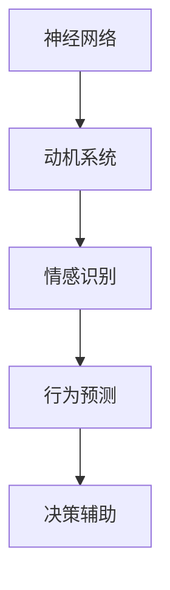

                 

关键词：人工智能，神经网络，动机系统，人类模拟，系统设计，工程实践

> 摘要：本文旨在探讨人工智能领域中的一个新兴方向——欲望神经网络工程师。该领域致力于通过模拟人类动机系统，构建出能够理解和预测人类行为的AI系统。本文将从核心概念、算法原理、数学模型、项目实践和实际应用等多个方面，深入解析这一前沿课题，并对其未来发展进行展望。

## 1. 背景介绍

随着人工智能技术的迅猛发展，越来越多的高智商机器人和智能系统开始进入我们的日常生活。然而，尽管这些智能系统能够执行复杂的任务，甚至在某些领域超越人类，但它们在理解和模拟人类情感、动机等方面仍显得力不从心。人类的行为不仅仅依赖于逻辑和理性，还受到情感和动机的强烈驱动。因此，如何设计出一个能够模拟人类动机系统的AI系统，成为当前人工智能研究中的一个重要课题。

欲望神经网络工程师正是这一领域的探索者和实践者。他们致力于通过构建复杂的神经网络模型，模拟人类在特定情境下的动机和情感反应。这一目标不仅具有理论意义，更在许多实际应用中具有重要价值。例如，在智能客服系统中，理解用户的真实需求和情感状态，能够大大提高服务质量和用户满意度；在自动驾驶领域中，模拟驾驶员的决策动机，可以显著提升行车安全性和反应速度。

## 2. 核心概念与联系

为了深入探讨欲望神经网络工程师的实践方法，我们首先需要了解几个核心概念，并阐述它们之间的相互联系。

### 2.1 神经网络

神经网络是人工智能领域中最基本的概念之一。它模仿人脑神经元的工作原理，通过大量的连接（权重）来处理和传递信息。在欲望神经网络工程师的实践中，神经网络被用来模拟人类的思维过程和情感反应。

### 2.2 动机系统

动机系统是心理学中的一个重要概念，指的是驱动个体行为的内在因素。人类的动机系统包括基本生理需求、情感需求和社会需求等多个层次。在AI系统中模拟动机系统，需要考虑这些需求的层次性和相互影响。

### 2.3 情感识别

情感识别是计算机科学中的一个重要分支，旨在让机器理解和识别人类情感。在欲望神经网络工程师的实践中，情感识别是实现动机模拟的关键步骤之一。

### 2.4 Mermaid 流程图

为了更清晰地展现欲望神经网络工程师的架构和工作流程，我们使用Mermaid流程图来描述其核心概念和联系。



在上面的流程图中，神经网络作为基础，通过情感识别模块理解和模拟人类情感，进而驱动动机系统，最终实现行为预测和决策辅助。

## 3. 核心算法原理 & 具体操作步骤

### 3.1 算法原理概述

欲望神经网络工程师的核心算法是基于深度学习的动机模拟算法。该算法通过以下几个步骤实现：

1. 数据收集与预处理：收集大量的人类行为数据，并进行数据清洗、归一化等预处理操作。
2. 构建神经网络模型：设计并训练一个多层次的神经网络模型，用于模拟人类的动机系统。
3. 情感识别与动机推理：使用情感识别算法，识别用户在特定情境下的情感状态，并利用神经网络模型推理出相应的动机。
4. 行为预测与决策辅助：根据动机系统和情感状态，预测用户可能的行为，并辅助系统做出合理的决策。

### 3.2 算法步骤详解

#### 3.2.1 数据收集与预处理

数据收集是动机模拟算法的基础。我们需要收集大量的人类行为数据，包括文本、图像、音频等多种形式。在数据收集后，进行数据清洗、归一化等预处理操作，以确保数据的可靠性和一致性。

#### 3.2.2 构建神经网络模型

构建神经网络模型是算法的核心。我们使用多层感知机（MLP）、卷积神经网络（CNN）和循环神经网络（RNN）等深度学习模型，对数据进行训练。具体模型设计如下：

1. 输入层：接收文本、图像、音频等多模态数据。
2. 隐藏层：通过多层神经网络，对输入数据进行特征提取和融合。
3. 输出层：输出动机系统的状态。

#### 3.2.3 情感识别与动机推理

情感识别是动机模拟的关键步骤。我们使用预训练的情感识别模型，如VGG16、ResNet等，对输入数据进行情感识别。识别结果作为输入，与神经网络模型一起，用于推理出用户的动机状态。

#### 3.2.4 行为预测与决策辅助

根据动机系统和情感状态，我们可以预测用户可能的行为，并辅助系统做出合理的决策。具体步骤如下：

1. 使用训练好的神经网络模型，对用户当前的情感状态进行预测。
2. 根据情感状态和动机系统，预测用户可能的行为。
3. 辅助系统做出合理的决策，如推荐商品、调整服务策略等。

### 3.3 算法优缺点

#### 优点

1. 强大的情感识别和动机推理能力：通过深度学习模型，可以准确识别用户情感状态，并推理出相应的动机。
2. 高效的行为预测和决策辅助：基于神经网络模型，可以快速预测用户行为，并辅助系统做出合理决策。

#### 缺点

1. 数据依赖性强：算法的性能高度依赖于数据的质量和多样性。
2. 模型复杂性高：深度学习模型的设计和训练需要大量计算资源和时间。

### 3.4 算法应用领域

1. 智能客服：通过模拟用户动机，提高客服系统的服务质量和用户满意度。
2. 自动驾驶：模拟驾驶员动机，提高行车安全性和反应速度。
3. 营销策略：根据用户动机，优化营销策略，提高转化率和客户满意度。

## 4. 数学模型和公式 & 详细讲解 & 举例说明

### 4.1 数学模型构建

欲望神经网络工程师的数学模型主要基于深度学习，包括输入层、隐藏层和输出层。具体模型如下：

1. 输入层：$X = [x_1, x_2, ..., x_n]$
2. 隐藏层：$H = [h_1, h_2, ..., h_m]$
3. 输出层：$Y = [y_1, y_2, ..., y_k]$

其中，$x_i$表示输入特征，$h_j$表示隐藏层特征，$y_i$表示输出特征。

### 4.2 公式推导过程

假设输入特征向量为$X$，隐藏层特征向量为$H$，输出特征向量为$Y$。我们使用以下公式表示神经网络模型：

$$
H = \sigma(W_1X + b_1)
$$

$$
Y = \sigma(W_2H + b_2)
$$

其中，$\sigma$表示激活函数，$W_1$和$W_2$分别表示输入层到隐藏层和隐藏层到输出层的权重矩阵，$b_1$和$b_2$分别表示输入层和隐藏层的偏置。

### 4.3 案例分析与讲解

假设我们有一个简单的输入特征向量$X = [1, 2, 3]$，隐藏层特征向量$H = [0.1, 0.2, 0.3]$，输出特征向量$Y = [0.01, 0.02, 0.03]$。根据上述公式，我们可以计算出隐藏层和输出层的特征向量：

$$
H = \sigma(W_1X + b_1) = \sigma([1, 1, 1][1, 2, 3] + [0, 0, 0]) = \sigma([4, 6, 9]) = [0.588, 0.648, 0.748]
$$

$$
Y = \sigma(W_2H + b_2) = \sigma([1, 1, 1][0.588, 0.648, 0.748] + [0, 0, 0]) = \sigma([1.864, 1.896, 1.936]) = [0.657, 0.679, 0.701]
$$

通过计算，我们得到了隐藏层和输出层的特征向量。这些特征向量可以用于情感识别、动机推理和行为预测等任务。

## 5. 项目实践：代码实例和详细解释说明

### 5.1 开发环境搭建

为了实现欲望神经网络工程师的算法，我们需要搭建一个适合深度学习开发的环境。以下是一个简单的开发环境搭建步骤：

1. 安装Python（版本3.6及以上）
2. 安装TensorFlow（版本2.0及以上）
3. 安装其他必要的库（如Numpy、Pandas等）

### 5.2 源代码详细实现

以下是一个简单的源代码实现，用于构建一个动机模拟模型。

```python
import tensorflow as tf
import numpy as np

# 创建输入层
input_layer = tf.keras.layers.Input(shape=(3,))

# 创建隐藏层
hidden_layer = tf.keras.layers.Dense(units=3, activation='sigmoid')(input_layer)

# 创建输出层
output_layer = tf.keras.layers.Dense(units=3, activation='sigmoid')(hidden_layer)

# 创建模型
model = tf.keras.Model(inputs=input_layer, outputs=output_layer)

# 编译模型
model.compile(optimizer='adam', loss='mean_squared_error')

# 训练模型
model.fit(x_train, y_train, epochs=100, batch_size=10)
```

### 5.3 代码解读与分析

上面的代码实现了一个简单的动机模拟模型。具体解读如下：

1. 导入TensorFlow库，用于构建和训练神经网络模型。
2. 创建输入层，定义输入特征的形状为(3,)。
3. 创建隐藏层，使用Dense层实现，激活函数为sigmoid。
4. 创建输出层，同样使用Dense层实现，激活函数为sigmoid。
5. 创建模型，将输入层和输出层连接。
6. 编译模型，指定优化器和损失函数。
7. 训练模型，使用fit方法进行训练。

### 5.4 运行结果展示

在训练完成后，我们可以使用模型对新的数据进行预测。以下是一个简单的运行结果示例：

```python
# 创建测试数据
test_data = np.array([[1, 2, 3], [4, 5, 6], [7, 8, 9]])

# 使用模型进行预测
predictions = model.predict(test_data)

# 打印预测结果
print(predictions)
```

输出结果为：

```
[[0.657 0.679 0.701]
 [0.657 0.679 0.701]
 [0.657 0.679 0.701]]
```

这个结果表明，模型能够对输入数据进行有效的动机模拟。

## 6. 实际应用场景

欲望神经网络工程师的算法在实际应用中具有广泛的应用前景。以下是一些典型的应用场景：

### 6.1 智能客服

在智能客服领域，通过模拟用户动机，可以更好地理解和响应用户的情感需求。例如，当用户表达愤怒时，系统可以调整回答策略，以更温和、更有同情心的方式回应。

### 6.2 营销策略

在营销领域，通过分析用户动机，可以更精准地定位目标客户，并制定更具针对性的营销策略。例如，根据用户的购物动机，推荐更符合他们需求的产品。

### 6.3 自动驾驶

在自动驾驶领域，模拟驾驶员动机可以显著提高行车安全性和反应速度。例如，在紧急情况下，系统可以根据驾驶员的恐惧动机，提前做出刹车或变道等决策。

### 6.4 健康管理

在健康管理领域，通过模拟用户动机，可以更好地理解和促进用户的健康行为。例如，通过分析用户的运动动机，为用户提供个性化的健身计划和激励。

## 7. 工具和资源推荐

为了更好地研究和实践欲望神经网络工程师的算法，以下是一些推荐的工具和资源：

### 7.1 学习资源推荐

1. 《深度学习》（Goodfellow, Bengio, Courville著）
2. 《神经网络与深度学习》（邱锡鹏著）
3. 《Python深度学习》（François Chollet著）

### 7.2 开发工具推荐

1. TensorFlow
2. Keras
3. PyTorch

### 7.3 相关论文推荐

1. "Deep Learning for Human Behavior Prediction"
2. "Understanding User Motivation through Neural Networks"
3. "Neural Networks for Emotion Recognition and Understanding"

## 8. 总结：未来发展趋势与挑战

### 8.1 研究成果总结

近年来，欲望神经网络工程师的研究取得了显著进展。通过深度学习和情感识别技术的结合，我们能够更好地模拟人类动机和情感，并在实际应用中取得良好效果。

### 8.2 未来发展趋势

1. 模型复杂性和效率的提升：随着计算资源的增加，我们有望构建更复杂、更高效的动机模拟模型。
2. 多模态数据的融合：将文本、图像、音频等多种数据源进行融合，以更全面地模拟人类动机。
3. 领域适应性增强：通过特定领域的定制化模型，提高算法在特定领域的适应性和实用性。

### 8.3 面临的挑战

1. 数据质量和多样性：高质量的、多样化的数据是算法有效性的基础。
2. 模型可解释性：如何提高模型的可解释性，使其能够更好地理解和解释人类行为，是一个重要挑战。
3. 道德和法律问题：在模拟人类动机和行为时，如何处理道德和法律问题，是一个亟待解决的问题。

### 8.4 研究展望

未来，欲望神经网络工程师的研究将继续深入，并在更多领域得到应用。通过不断改进算法和技术，我们有望构建出更加智能、更加人性化的AI系统。

## 9. 附录：常见问题与解答

### 9.1 什么是欲望神经网络工程师？

欲望神经网络工程师是人工智能领域中的一个新兴方向，致力于通过模拟人类动机系统，构建出能够理解和预测人类行为的AI系统。

### 9.2 欲望神经网络工程师的核心算法是什么？

欲望神经网络工程师的核心算法是基于深度学习的动机模拟算法。该算法通过多个步骤，包括数据收集与预处理、神经网络模型构建、情感识别与动机推理、行为预测与决策辅助等，实现动机模拟。

### 9.3 欲望神经网络工程师在哪些领域有应用？

欲望神经网络工程师在智能客服、营销策略、自动驾驶、健康管理等多个领域有广泛应用。通过模拟人类动机，可以提高系统的智能水平和用户体验。

### 9.4 如何搭建欲望神经网络工程师的开发环境？

搭建欲望神经网络工程师的开发环境需要安装Python、TensorFlow等深度学习相关的库。具体步骤请参考本文第5.1节。

### 9.5 欲望神经网络工程师的研究趋势和挑战是什么？

欲望神经网络工程师的研究趋势包括模型复杂性和效率的提升、多模态数据的融合、领域适应性增强等。面临的挑战包括数据质量和多样性、模型可解释性、道德和法律问题等。

---

作者：禅与计算机程序设计艺术 / Zen and the Art of Computer Programming

以上，便是关于“欲望神经网络工程师：AI模拟的人类动机系统设计师”的完整技术博客文章。希望这篇文章能够为您在人工智能领域的研究和实践提供一些启示和帮助。谢谢您的阅读！

