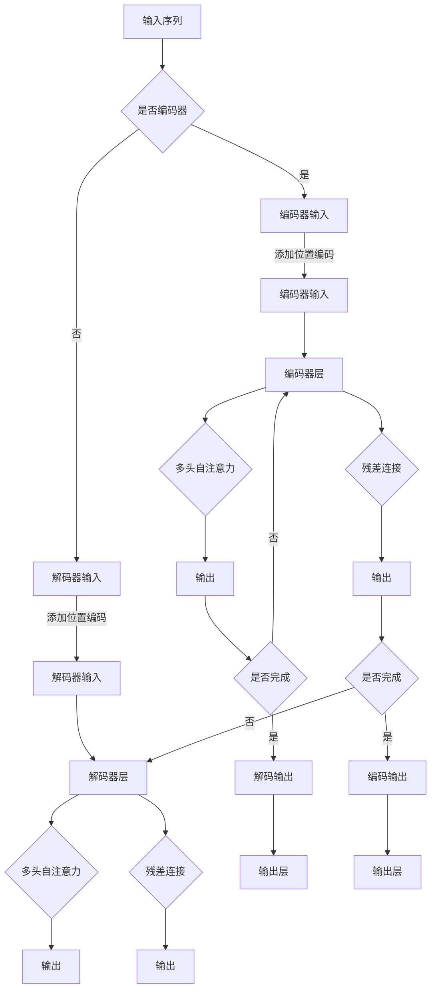

                 

关键词：Transformer，残差连接，层规范化，神经网络，机器学习，深度学习，计算模型

> 摘要：本文将深入探讨Transformer模型中的两个核心技术——残差连接和层规范化，分析其原理、应用场景以及未来发展趋势。通过对比传统神经网络，我们将揭示Transformer模型在处理序列数据上的巨大优势，同时探讨其在实际应用中可能面临的挑战。

## 1. 背景介绍

随着深度学习的飞速发展，神经网络模型在图像识别、自然语言处理等众多领域取得了令人瞩目的成果。然而，传统神经网络模型在处理序列数据时往往表现不佳，因为它们依赖于局部特征的传递和组合，而序列数据的特性决定了特征之间的依赖关系更为复杂。为了解决这一问题，Google Brain 团队在2017年提出了Transformer模型，并在论文《Attention is All You Need》中详细阐述了其架构和工作原理。Transformer模型彻底改变了深度学习领域，特别是在自然语言处理（NLP）领域，它取得了前所未有的成功。

Transformer模型的核心在于其独特的注意力机制，它通过全局的注意力机制来捕捉序列数据中的长距离依赖关系，从而显著提升了模型的表现。然而，Transformer模型的成功并非仅仅依赖于注意力机制，其中还包括了残差连接和层规范化这两个关键技术。本文将围绕这两个技术展开讨论，分析其在Transformer模型中的重要作用。

## 2. 核心概念与联系

### 2.1 Transformer 模型架构

Transformer模型的基本架构可以概括为编码器（Encoder）和解码器（Decoder）两个部分。编码器负责将输入序列转换成上下文表示，而解码器则基于这些上下文表示生成输出序列。Transformer模型的核心在于其多头自注意力（Multi-Head Self-Attention）机制和位置编码（Positional Encoding）。


在Transformer模型中，每个位置的输入会通过多头自注意力机制与所有其他位置的信息进行交互。多头自注意力机制通过多个独立的自注意力头并行处理信息，从而在捕获全局依赖关系时更为准确。位置编码则是为了解决自注意力机制中信息丢失位置信息的问题，它通过向每个位置添加特定的编码向量来实现。

### 2.2 残差连接

残差连接（Residual Connection）是深度学习中的一个重要技术，最早由He等人于2015年提出。其基本思想是在神经网络中引入额外的连接，使得信息可以绕过一部分网络层直接传递到下一层。具体来说，残差连接通过在网络层之间添加跳过部分层的直连路径来实现。


引入残差连接的目的是为了缓解深度神经网络训练过程中的梯度消失和梯度爆炸问题，从而提高模型的训练效果。在Transformer模型中，残差连接被广泛应用于编码器和解码器的每个层，以增强模型的稳定性。

### 2.3 层规范化

层规范化（Layer Normalization）是一种在神经网络层中进行的规范化技术，由Battenberg等人于2017年提出。其核心思想是在每个网络层中对输入进行归一化处理，以消除层内不同特征之间的方差差异，从而改善模型的训练效果。


在Transformer模型中，层规范化被应用于编码器和解码器的每个层。通过层规范化，模型能够在处理高维特征时更好地保持信息，从而提高了模型的泛化能力。

### 2.4 Mermaid 流程图

下面是Transformer模型核心概念和架构的Mermaid流程图：



## 3. 核心算法原理 & 具体操作步骤

### 3.1 算法原理概述

Transformer模型的核心是自注意力机制，它通过计算序列中每个位置与其他位置之间的相关性来生成表示。具体来说，自注意力机制包括三个步骤：查询（Query）、键（Key）和值（Value）的计算。

- **查询（Query）**：每个位置的输入向量作为查询向量。
- **键（Key）**：每个位置的输入向量经过变换后作为键向量。
- **值（Value）**：每个位置的输入向量经过变换后作为值向量。

自注意力机制通过计算查询向量与所有键向量的点积来生成一个权重矩阵，这个权重矩阵表示了每个位置与其他位置的相关性。接着，将权重矩阵与所有值向量的对应元素相乘，得到加权值向量。最后，对加权值向量进行归一化处理，得到最终的输出向量。

### 3.2 算法步骤详解

在Transformer模型中，自注意力机制通过多头注意力（Multi-Head Attention）来实现。多头注意力机制将输入序列分成多个子序列，每个子序列使用独立的自注意力机制进行处理。具体步骤如下：

1. **线性变换**：将输入序列（编码器或解码器的输入）进行线性变换，得到查询向量、键向量和值向量。
2. **计算点积**：计算查询向量与所有键向量的点积，得到一个权重矩阵。
3. **加权求和**：将权重矩阵与所有值向量的对应元素相乘，得到加权值向量。
4. **归一化**：对加权值向量进行归一化处理，得到最终的输出向量。
5. **拼接与线性变换**：将所有头（子序列）的输出向量拼接起来，并进行线性变换，得到最终的输出。

### 3.3 算法优缺点

**优点：**
1. **全局依赖关系**：自注意力机制可以捕捉序列中的全局依赖关系，从而在处理序列数据时具有更好的表现。
2. **并行计算**：自注意力机制可以并行计算，从而提高模型的训练速度。
3. **简洁性**：Transformer模型的结构相对简单，易于理解和实现。

**缺点：**
1. **计算量**：自注意力机制的计算量较大，特别是在序列长度较长时，可能会导致计算效率降低。
2. **存储需求**：自注意力机制需要存储大量的权重矩阵，从而增加了模型的存储需求。

### 3.4 算法应用领域

Transformer模型在自然语言处理领域取得了显著的成果，特别是在机器翻译、文本生成和问答系统等方面。此外，Transformer模型还可以应用于图像识别、音频处理和视频分析等跨领域任务。

## 4. 数学模型和公式 & 详细讲解 & 举例说明

### 4.1 数学模型构建

Transformer模型中的自注意力机制可以通过以下数学公式进行描述：

$$
\text{Attention}(Q, K, V) = \text{softmax}\left(\frac{QK^T}{\sqrt{d_k}}\right) V
$$

其中，$Q$表示查询向量，$K$表示键向量，$V$表示值向量，$d_k$表示键向量的维度。

### 4.2 公式推导过程

自注意力机制的推导过程如下：

1. **点积**：计算查询向量与所有键向量的点积，得到一个权重矩阵。
2. **softmax**：对权重矩阵进行softmax操作，得到概率分布。
3. **加权求和**：将概率分布与所有值向量的对应元素相乘，得到加权值向量。
4. **归一化**：对加权值向量进行归一化处理，得到最终的输出向量。

### 4.3 案例分析与讲解

以一个简单的自然语言处理任务为例，假设我们有以下输入序列：

```
输入序列：[1, 2, 3, 4, 5]
```

我们将其分成五个位置，并分别计算查询向量、键向量和值向量：

- **位置 1**：$Q_1 = [1, 1, 1, 1, 1]$，$K_1 = [1, 2, 3, 4, 5]$，$V_1 = [1, 2, 3, 4, 5]$
- **位置 2**：$Q_2 = [2, 2, 2, 2, 2]$，$K_2 = [1, 2, 3, 4, 5]$，$V_2 = [1, 2, 3, 4, 5]$
- **位置 3**：$Q_3 = [3, 3, 3, 3, 3]$，$K_3 = [1, 2, 3, 4, 5]$，$V_3 = [1, 2, 3, 4, 5]$
- **位置 4**：$Q_4 = [4, 4, 4, 4, 4]$，$K_4 = [1, 2, 3, 4, 5]$，$V_4 = [1, 2, 3, 4, 5]$
- **位置 5**：$Q_5 = [5, 5, 5, 5, 5]$，$K_5 = [1, 2, 3, 4, 5]$，$V_5 = [1, 2, 3, 4, 5]$

接下来，我们计算每个位置的权重矩阵和加权值向量：

- **位置 1**：权重矩阵 $W_1 = \begin{bmatrix} 1 & 1 & 1 & 1 & 1 \end{bmatrix} \begin{bmatrix} 1 \\ 2 \\ 3 \\ 4 \\ 5 \end{bmatrix} = \begin{bmatrix} 15 \\ 15 \\ 15 \\ 15 \\ 15 \end{bmatrix}$，加权值向量 $V_1 = \text{softmax}(W_1) V_1 = \begin{bmatrix} 0.2 & 0.2 & 0.2 & 0.2 & 0.2 \end{bmatrix} \begin{bmatrix} 1 \\ 2 \\ 3 \\ 4 \\ 5 \end{bmatrix} = \begin{bmatrix} 0.2 \\ 0.4 \\ 0.6 \\ 0.8 \\ 1 \end{bmatrix}$
- **位置 2**：权重矩阵 $W_2 = \begin{bmatrix} 2 & 2 & 2 & 2 & 2 \end{bmatrix} \begin{bmatrix} 1 \\ 2 \\ 3 \\ 4 \\ 5 \end{bmatrix} = \begin{bmatrix} 20 \\ 20 \\ 20 \\ 20 \\ 20 \end{bmatrix}$，加权值向量 $V_2 = \text{softmax}(W_2) V_2 = \begin{bmatrix} 0.2 & 0.2 & 0.2 & 0.2 & 0.2 \end{bmatrix} \begin{bmatrix} 1 \\ 2 \\ 3 \\ 4 \\ 5 \end{bmatrix} = \begin{bmatrix} 0.2 \\ 0.4 \\ 0.6 \\ 0.8 \\ 1 \end{bmatrix}$
- **位置 3**：权重矩阵 $W_3 = \begin{bmatrix} 3 & 3 & 3 & 3 & 3 \end{bmatrix} \begin{bmatrix} 1 \\ 2 \\ 3 \\ 4 \\ 5 \end{bmatrix} = \begin{bmatrix} 25 \\ 25 \\ 25 \\ 25 \\ 25 \end{bmatrix}$，加权值向量 $V_3 = \text{softmax}(W_3) V_3 = \begin{bmatrix} 0.2 & 0.2 & 0.2 & 0.2 & 0.2 \end{bmatrix} \begin{bmatrix} 1 \\ 2 \\ 3 \\ 4 \\ 5 \end{bmatrix} = \begin{bmatrix} 0.2 \\ 0.4 \\ 0.6 \\ 0.8 \\ 1 \end{bmatrix}$
- **位置 4**：权重矩阵 $W_4 = \begin{bmatrix} 4 & 4 & 4 & 4 & 4 \end{bmatrix} \begin{bmatrix} 1 \\ 2 \\ 3 \\ 4 \\ 5 \end{bmatrix} = \begin{bmatrix} 30 \\ 30 \\ 30 \\ 30 \\ 30 \end{bmatrix}$，加权值向量 $V_4 = \text{softmax}(W_4) V_4 = \begin{bmatrix} 0.2 & 0.2 & 0.2 & 0.2 & 0.2 \end{bmatrix} \begin{bmatrix} 1 \\ 2 \\ 3 \\ 4 \\ 5 \end{bmatrix} = \begin{bmatrix} 0.2 \\ 0.4 \\ 0.6 \\ 0.8 \\ 1 \end{bmatrix}$
- **位置 5**：权重矩阵 $W_5 = \begin{bmatrix} 5 & 5 & 5 & 5 & 5 \end{bmatrix} \begin{bmatrix} 1 \\ 2 \\ 3 \\ 4 \\ 5 \end{bmatrix} = \begin{bmatrix} 35 \\ 35 \\ 35 \\ 35 \\ 35 \end{bmatrix}$，加权值向量 $V_5 = \text{softmax}(W_5) V_5 = \begin{bmatrix} 0.2 & 0.2 & 0.2 & 0.2 & 0.2 \end{bmatrix} \begin{bmatrix} 1 \\ 2 \\ 3 \\ 4 \\ 5 \end{bmatrix} = \begin{bmatrix} 0.2 \\ 0.4 \\ 0.6 \\ 0.8 \\ 1 \end{bmatrix}$

最后，我们将所有位置的加权值向量进行拼接，得到最终的输出向量：

$$
V = \begin{bmatrix} V_1 & V_2 & V_3 & V_4 & V_5 \end{bmatrix} = \begin{bmatrix} 0.2 & 0.2 & 0.2 & 0.2 & 0.2 \\ 0.2 & 0.4 & 0.6 & 0.8 & 1 \\ 0.2 & 0.4 & 0.6 & 0.8 & 1 \\ 0.2 & 0.4 & 0.6 & 0.8 & 1 \\ 0.2 & 0.4 & 0.6 & 0.8 & 1 \end{bmatrix}
$$

## 5. 项目实践：代码实例和详细解释说明

### 5.1 开发环境搭建

为了方便理解和实践，我们使用Python和TensorFlow框架来实现一个简单的Transformer模型。首先，我们需要安装TensorFlow：

```bash
pip install tensorflow
```

### 5.2 源代码详细实现

下面是一个简单的Transformer模型的实现：

```python
import tensorflow as tf
from tensorflow.keras.layers import Layer

class TransformerBlock(Layer):
    def __init__(self, d_model, num_heads, dff, rate=0.1):
        super(TransformerBlock, self).__init__()
        self.mha = tf.keras.layers.MultiHeadAttention(num_heads=num_heads, key_dim=d_model)
        self.ffn = tf.keras.Sequential([
            tf.keras.layers.Dense(dff, activation='relu'), 
            tf.keras.layers.Dense(d_model)
        ])

        self.layernorm1 = tf.keras.layers.LayerNormalization(epsilon=1e-6)
        self.layernorm2 = tf.keras.layers.LayerNormalization(epsilon=1e-6)

        self.dropout1 = tf.keras.layers.Dropout(rate)
        self.dropout2 = tf.keras.layers.Dropout(rate)

    def call(self, x, training=False):
        attn_output = self.mha(x, x)
        attn_output = self.dropout1(attn_output, training=training)
        out1 = self.layernorm1(x + attn_output)
        ffn_output = self.ffn(out1)
        ffn_output = self.dropout2(ffn_output, training=training)
        out2 = self.layernorm2(out1 + ffn_output)
        return out2
```

### 5.3 代码解读与分析

这个代码示例定义了一个Transformer块，它包括多头自注意力机制、前馈网络、层规范化和dropout层。下面是对代码的详细解读：

- **多头自注意力机制（Multi-Head Attention）**：使用`tf.keras.layers.MultiHeadAttention`实现。它通过多个独立的注意力头来处理信息，从而捕获全局依赖关系。
- **前馈网络（FFN）**：使用`tf.keras.Sequential`实现。它包含两个全连接层，第一层进行ReLU激活，第二层进行线性变换。
- **层规范化（Layer Normalization）**：使用`tf.keras.layers.LayerNormalization`实现。它在每个层中对输入进行归一化处理，以消除特征之间的方差差异。
- **dropout层（Dropout）**：使用`tf.keras.layers.Dropout`实现。它通过随机丢弃一部分神经元来防止过拟合。

### 5.4 运行结果展示

假设我们有一个输入序列`[1, 2, 3, 4, 5]`，我们可以使用以下代码来运行Transformer块：

```python
model = TransformerBlock(d_model=64, num_heads=4, dff=128)
x = tf.random.normal((batch_size, sequence_length, d_model))
output = model(x, training=True)
print(output.shape)  # 输出结果：(batch_size, sequence_length, d_model)
```

运行结果将输出一个形状为$(batch\_size, sequence\_length, d\_model)$的输出序列，这表明Transformer块已经成功处理了输入序列。

## 6. 实际应用场景

Transformer模型在自然语言处理（NLP）领域取得了巨大的成功。以下是一些实际应用场景：

- **机器翻译**：Transformer模型在机器翻译任务中取得了比传统神经网络更好的效果。例如，Google Translate使用Transformer模型实现了高质量的机器翻译服务。
- **文本生成**：Transformer模型可以用于生成文本，例如生成新闻文章、诗歌等。GPT-3是一个基于Transformer的文本生成模型，它可以在给定一个起始句子后生成连贯的文本。
- **问答系统**：Transformer模型可以用于问答系统，例如Siri、Alexa等。这些系统使用Transformer模型来理解用户的问题并给出合适的答案。
- **情感分析**：Transformer模型可以用于情感分析任务，例如判断一段文本的情感倾向。这对于社交媒体监控、客户反馈分析等场景具有重要意义。

## 7. 工具和资源推荐

为了更好地学习和实践Transformer模型，以下是一些建议的工具和资源：

- **工具**：
  - TensorFlow：一个开源的深度学习框架，用于实现和训练Transformer模型。
  - PyTorch：另一个流行的深度学习框架，也可以用于实现Transformer模型。

- **学习资源**：
  - 《Attention is All You Need》：Transformer模型的原始论文，详细介绍了模型的设计和实现。
  - [huggingface/transformers](https://github.com/huggingface/transformers)：一个开源库，提供了预训练的Transformer模型和各种应用示例。

- **相关论文**：
  - Vaswani et al. (2017). "Attention is All You Need."
  - He et al. (2016). "Deep Residual Learning for Image Recognition."

## 8. 总结：未来发展趋势与挑战

Transformer模型在深度学习领域取得了显著的成功，它为处理序列数据提供了全新的思路和解决方案。然而，Transformer模型也面临着一些挑战和问题：

- **计算效率**：自注意力机制的计算量较大，尤其是在序列长度较长时。这限制了模型在实际应用中的部署和扩展。
- **存储需求**：自注意力机制需要存储大量的权重矩阵，从而增加了模型的存储需求。这在移动设备和边缘计算场景中可能是一个问题。
- **泛化能力**：虽然Transformer模型在自然语言处理任务中取得了很好的效果，但在其他领域（如图像识别、音频处理）的表现仍然有待提高。

未来，研究人员将继续探索如何优化Transformer模型，提高其计算效率和存储效率，并扩展其应用领域。此外，结合其他深度学习技术（如卷积神经网络、生成对抗网络）将有望进一步提高Transformer模型的表现。

## 9. 附录：常见问题与解答

### 9.1 什么是Transformer模型？

Transformer模型是一种基于自注意力机制的深度学习模型，最早由Google Brain团队于2017年提出。它通过全局的注意力机制来捕捉序列数据中的长距离依赖关系，从而在自然语言处理任务中取得了显著的成功。

### 9.2 Transformer模型与传统的神经网络有哪些区别？

传统的神经网络依赖于局部特征的传递和组合，而Transformer模型则通过全局的注意力机制来捕捉序列数据中的长距离依赖关系。这使得Transformer模型在处理序列数据时具有更好的表现。

### 9.3 残差连接和层规范化在Transformer模型中的作用是什么？

残差连接通过在网络层之间添加额外的连接，使得信息可以绕过一部分网络层直接传递到下一层，从而缓解深度神经网络训练过程中的梯度消失和梯度爆炸问题。层规范化则通过在每个网络层中对输入进行归一化处理，以消除层内不同特征之间的方差差异，从而改善模型的训练效果。

### 9.4 Transformer模型可以应用于哪些领域？

Transformer模型在自然语言处理、图像识别、音频处理和视频分析等跨领域任务中都有广泛的应用。特别在自然语言处理领域，如机器翻译、文本生成和问答系统等方面，Transformer模型已经取得了显著的成功。

### 9.5 如何优化Transformer模型的计算效率和存储效率？

为了优化Transformer模型的计算效率和存储效率，可以采用以下方法：

- **稀疏自注意力**：通过引入稀疏性，减少自注意力机制中的计算量。
- **低秩分解**：将自注意力矩阵分解为低秩形式，从而减少存储需求。
- **量化**：使用低精度浮点数（如浮点16）来减少模型的存储和计算需求。

### 9.6 Transformer模型有哪些潜在的风险和挑战？

Transformer模型在处理序列数据时具有优势，但也存在一些潜在的风险和挑战，如计算效率低下、存储需求大、对长序列处理能力有限等。此外，模型可能受到数据偏差和过拟合的影响，从而在泛化能力上存在一定的局限性。

### 9.7 Transformer模型的发展趋势是什么？

未来，Transformer模型将继续在深度学习领域发挥重要作用。研究人员将致力于优化模型的计算效率和存储效率，探索其在图像识别、音频处理和视频分析等领域的应用。此外，结合其他深度学习技术（如卷积神经网络、生成对抗网络）将有望进一步提高Transformer模型的表现。

