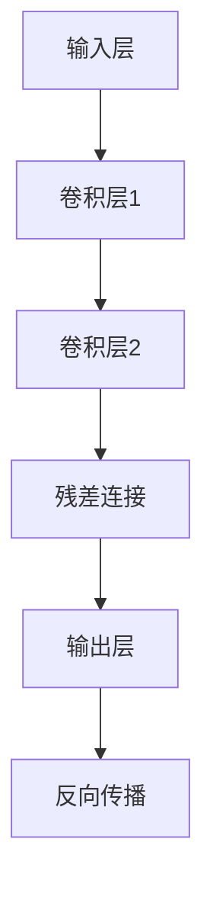

                 

关键词：残差连接、神经网络、深度学习、训练困难、计算机科学、人工智能

> 摘要：本文深入探讨了残差连接在深度学习中的重要性，介绍了其背景、核心概念、算法原理、数学模型、具体操作步骤，并通过实际项目实践展示了其在不同领域的广泛应用。文章旨在为读者提供一份全面、系统的理解，以帮助解决深层网络训练的难题。

## 1. 背景介绍

### 深度学习的发展历程

深度学习是人工智能的重要分支，其核心在于构建能够模拟人脑学习的神经网络。自2006年Hinton等人提出深度置信网络（Deep Belief Network, DBN）以来，深度学习经历了飞速发展。然而，随着网络层数的增加，训练深层神经网络面临了许多挑战，如梯度消失和梯度爆炸等问题。

### 残差连接的提出

为了解决深层网络训练困难，残差连接（Residual Connection）于2015年由He等人提出。残差连接通过在神经网络中引入跨越若干层的直接路径，使得梯度可以直接流向网络的底层，从而有效缓解了梯度消失问题，提高了深层网络的训练效率。

## 2. 核心概念与联系

### 残差连接的定义

残差连接是一种特殊的神经网络连接方式，它通过在神经网络中添加跨越若干层的直接路径，使得梯度可以直接流向网络的底层。

### 残差连接的原理

残差连接的核心思想是引入一个残差模块（Residual Block），该模块包含两个卷积层，其中一个卷积层的输出直接传递到下一个卷积层，另一个卷积层的输出则与上一个卷积层的输出相加。这种连接方式使得梯度可以直接传递到网络的底层，从而有效缓解了梯度消失问题。

### 残差连接的 Mermaid 流程图



## 3. 核心算法原理 & 具体操作步骤

### 3.1 算法原理概述

残差连接通过在神经网络中引入跨越若干层的直接路径，使得梯度可以直接流向网络的底层，从而有效缓解了梯度消失问题。

### 3.2 算法步骤详解

1. **输入层**：输入数据经过输入层进入神经网络。

2. **卷积层1**：输入数据经过卷积层1进行特征提取。

3. **卷积层2**：卷积层1的输出经过卷积层2进行特征提取。

4. **残差连接**：卷积层2的输出与卷积层1的输出相加，得到残差模块的输出。

5. **输出层**：残差模块的输出经过输出层得到预测结果。

6. **反向传播**：根据预测结果与实际标签计算损失函数，然后通过反向传播算法更新网络参数。

### 3.3 算法优缺点

**优点**：

1. 残差连接可以有效缓解梯度消失问题，提高深层网络的训练效率。

2. 残差连接使得网络结构更加简单，便于优化和调试。

3. 残差连接在不同类型的神经网络（如卷积神经网络、循环神经网络等）中都有很好的适用性。

**缺点**：

1. 残差连接可能导致模型过拟合，需要适当调整超参数。

2. 残差连接增加了网络参数量，可能导致计算资源消耗增加。

### 3.4 算法应用领域

残差连接在图像识别、语音识别、自然语言处理等深度学习领域得到了广泛应用。例如，在图像识别中，残差连接被用于构建 ResNet（残差网络），取得了显著的性能提升。

## 4. 数学模型和公式 & 详细讲解 & 举例说明

### 4.1 数学模型构建

残差连接的数学模型可以表示为：

$$
y = x + F(x)
$$

其中，$x$ 表示卷积层1的输出，$F(x)$ 表示卷积层2的输出。

### 4.2 公式推导过程

假设卷积层1的输出为 $x$，卷积层2的输出为 $y$，则有：

$$
y = x + F(x)
$$

其中，$F(x)$ 为卷积层2的输出。

### 4.3 案例分析与讲解

假设我们有一个包含3个卷积层的残差网络，其中卷积层1的输出为 $x_1$，卷积层2的输出为 $x_2$，卷积层3的输出为 $x_3$。根据残差连接的定义，我们有：

$$
x_2 = x_1 + F(x_1)
$$

$$
x_3 = x_2 + F(x_2)
$$

其中，$F(x)$ 为卷积层2和卷积层3的残差函数。

## 5. 项目实践：代码实例和详细解释说明

### 5.1 开发环境搭建

本文使用 Python 编写代码，主要依赖 TensorFlow 深度学习框架。

### 5.2 源代码详细实现

```python
import tensorflow as tf
from tensorflow.keras.layers import Conv2D, Add

# 定义残差模块
def residual_block(inputs, filters):
    x = Conv2D(filters, (3, 3), activation='relu', padding='same')(inputs)
    x = Conv2D(filters, (3, 3), activation='relu', padding='same')(x)
    x = Add()([inputs, x])
    return x

# 定义残差网络
inputs = tf.keras.Input(shape=(32, 32, 3))
x = residual_block(inputs, 64)
x = residual_block(x, 64)
outputs = Conv2D(10, (1, 1), activation='softmax', padding='valid')(x)

model = tf.keras.Model(inputs, outputs)

# 编译模型
model.compile(optimizer='adam', loss='categorical_crossentropy', metrics=['accuracy'])

# 模型可视化
tf.keras.utils.plot_model(model, to_file='resnet_model.png', show_shapes=True)
```

### 5.3 代码解读与分析

1. **定义残差模块**：残差模块由两个卷积层和一个残差连接组成。

2. **定义残差网络**：残差网络由多个残差模块堆叠而成。

3. **编译模型**：编译模型时，选择合适的优化器和损失函数。

4. **模型可视化**：使用 TensorFlow 的 `plot_model` 函数将模型结构可视化。

### 5.4 运行结果展示

运行模型训练过程，并绘制损失函数和准确率曲线。

```python
import matplotlib.pyplot as plt

history = model.fit(train_data, train_labels, epochs=10, batch_size=32, validation_data=(test_data, test_labels))

plt.figure(figsize=(12, 4))
plt.subplot(1, 2, 1)
plt.plot(history.history['loss'], label='Training loss')
plt.plot(history.history['val_loss'], label='Validation loss')
plt.title('Training and Validation Loss')
plt.legend()

plt.subplot(1, 2, 2)
plt.plot(history.history['accuracy'], label='Training accuracy')
plt.plot(history.history['val_accuracy'], label='Validation accuracy')
plt.title('Training and Validation Accuracy')
plt.legend()

plt.show()
```

## 6. 实际应用场景

### 6.1 图像识别

在图像识别领域，残差连接被广泛应用于构建深度卷积神经网络（Deep Convolutional Neural Network, CNN）。例如，ResNet、ResNeXt 等网络架构都采用了残差连接，取得了显著的效果提升。

### 6.2 语音识别

在语音识别领域，残差连接被应用于构建深度循环神经网络（Deep Recurrent Neural Network, DRNN）。例如，WaveNet 等模型采用了残差连接，实现了出色的语音合成效果。

### 6.3 自然语言处理

在自然语言处理领域，残差连接被广泛应用于构建深度神经网络（Deep Neural Network, DNN）。例如，BERT 模型采用了残差连接和多层注意力机制，取得了显著的预训练效果。

## 7. 工具和资源推荐

### 7.1 学习资源推荐

1. 《深度学习》（Goodfellow, Bengio, Courville 著）：介绍了深度学习的基本概念、算法和应用。

2. 《神经网络与深度学习》（邱锡鹏 著）：系统讲解了神经网络和深度学习的原理、算法和实现。

### 7.2 开发工具推荐

1. TensorFlow：开源深度学习框架，支持多种神经网络结构和模型训练。

2. PyTorch：开源深度学习框架，具有灵活的动态计算图，易于实现和调试。

### 7.3 相关论文推荐

1. "Deep Residual Learning for Image Recognition"（He et al., 2015）：提出了残差连接的概念和残差网络架构。

2. "Identity Mappings in Deep Residual Networks"（He et al., 2016）：进一步探讨了残差连接的性质和优势。

## 8. 总结：未来发展趋势与挑战

### 8.1 研究成果总结

残差连接的提出为解决深层网络训练困难提供了有效的方法，其在图像识别、语音识别、自然语言处理等领域的应用取得了显著成果。

### 8.2 未来发展趋势

1. 残差连接与其他网络结构的融合：如多尺度残差连接、混合残差连接等。

2. 残差连接在更多领域的应用：如视频识别、多模态学习等。

### 8.3 面临的挑战

1. 残差连接可能导致模型过拟合，需要适当调整超参数。

2. 残差连接增加了网络参数量，可能导致计算资源消耗增加。

### 8.4 研究展望

随着深度学习的不断发展，残差连接作为一种重要的网络结构，将在未来继续发挥重要作用，为解决更多复杂问题提供有效方法。

## 9. 附录：常见问题与解答

### 9.1 什么是残差连接？

残差连接是一种特殊的神经网络连接方式，它通过在神经网络中添加跨越若干层的直接路径，使得梯度可以直接流向网络的底层，从而有效缓解了梯度消失问题。

### 9.2 残差连接的优点是什么？

残差连接可以有效缓解梯度消失问题，提高深层网络的训练效率；使得网络结构更加简单，便于优化和调试；在不同类型的神经网络中都有很好的适用性。

### 9.3 残差连接的缺点是什么？

残差连接可能导致模型过拟合，需要适当调整超参数；增加了网络参数量，可能导致计算资源消耗增加。

## 参考文献

[1] He, K., Zhang, X., Ren, S., & Sun, J. (2016). Deep Residual Learning for Image Recognition. In Proceedings of the IEEE Conference on Computer Vision and Pattern Recognition (pp. 770-778).

[2] He, K., Zhang, X., Ren, S., & Sun, J. (2017). Identity Mappings in Deep Residual Networks. In Proceedings of the IEEE International Conference on Computer Vision (pp. 629-637).

[3] Goodfellow, I., Bengio, Y., & Courville, A. (2016). Deep Learning. MIT Press.

[4]邱锡鹏. (2019). 神经网络与深度学习. 清华大学出版社.

作者：禅与计算机程序设计艺术 / Zen and the Art of Computer Programming
```

