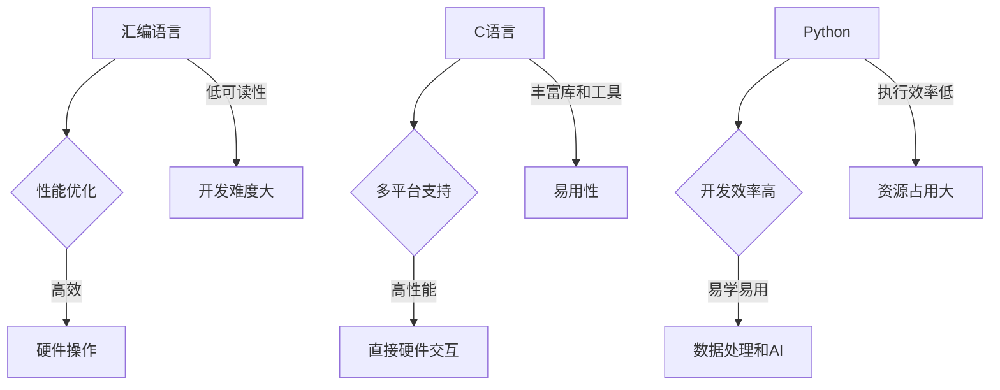

                 

关键词：汇编语言、C语言、Python、AI开发、编程语言选择、算法实现、性能优化、开发效率

> 摘要：本文将深入探讨汇编语言、C语言和Python在人工智能（AI）开发中的应用，分析这三种编程语言各自的优缺点，并讨论它们在不同AI开发场景下的适用性。通过对比这些语言在性能、开发效率、易用性等方面的差异，本文旨在为AI开发者提供有价值的参考，帮助他们做出最优的语言选择。

## 1. 背景介绍

在人工智能（AI）迅猛发展的今天，选择合适的编程语言对于AI项目的成功至关重要。AI领域涉及到的算法复杂且多样，不同类型的算法对编程语言有着不同的要求。因此，了解并掌握多种编程语言对于AI开发者来说尤为重要。

汇编语言、C语言和Python是三种在AI开发中广泛使用的编程语言。汇编语言因其接近硬件的特性，在性能优化方面具有独特的优势。C语言作为一种高性能、底层的编程语言，广泛应用于操作系统、嵌入式系统等领域，也在AI开发中发挥着重要作用。Python以其简洁易学的特性，成为AI开发者们的首选语言之一，特别是在数据处理和算法实现方面。

本文将对比汇编语言、C语言和Python在AI开发中的适用性，探讨各自的优势和劣势，帮助开发者们根据具体需求选择合适的编程语言。

## 2. 核心概念与联系

在深入讨论这些编程语言之前，我们需要了解它们在AI开发中的核心概念与联系。

### 2.1. 汇编语言

汇编语言是一种低级编程语言，直接操作计算机的硬件资源，其特点是执行效率高、性能优异。然而，汇编语言的可读性和可维护性较差，开发难度较大。

### 2.2. C语言

C语言是一种高级编程语言，具有高性能和底层操作的能力。C语言编写的程序可以直接与硬件交互，因此在性能优化方面具有优势。同时，C语言具有丰富的库和工具，支持多平台开发。

### 2.3. Python

Python是一种高级编程语言，以其简洁易学的特性受到广泛欢迎。Python拥有丰富的库和框架，特别适用于数据处理、机器学习和深度学习等AI领域。然而，Python的执行效率相对较低。

### 2.4. 关系与联系

汇编语言和C语言在底层操作和性能方面有相似之处，但C语言相对于汇编语言更加高级和易用。Python则更注重开发效率和易用性，适合快速实现和原型开发。

### 2.5. Mermaid 流程图



## 3. 核心算法原理 & 具体操作步骤

### 3.1. 算法原理概述

在AI开发中，算法的选择和实现至关重要。汇编语言、C语言和Python在算法实现方面各具特色。

- 汇编语言：适用于对性能要求极高的算法实现，如神经网络中的矩阵运算、卷积等。
- C语言：适用于通用算法实现，如排序、查找等，也适用于高性能计算。
- Python：适用于数据处理、机器学习和深度学习等，如TensorFlow、PyTorch等框架的算法实现。

### 3.2. 算法步骤详解

#### 3.2.1. 汇编语言实现

汇编语言实现算法的关键在于对硬件操作的深入理解。以神经网络矩阵运算为例，汇编语言可以通过直接操作内存和寄存器，实现高效的矩阵乘法。

1. 初始化矩阵和权重。
2. 遍历矩阵元素，执行乘法和加法运算。
3. 将结果存储到指定内存地址。

#### 3.2.2. C语言实现

C语言实现算法的优势在于其高性能和丰富的库支持。以下是一个简单的排序算法实现：

```c
#include <stdio.h>

void bubble_sort(int arr[], int n) {
    for (int i = 0; i < n - 1; i++) {
        for (int j = 0; j < n - i - 1; j++) {
            if (arr[j] > arr[j + 1]) {
                int temp = arr[j];
                arr[j] = arr[j + 1];
                arr[j + 1] = temp;
            }
        }
    }
}

int main() {
    int arr[] = {64, 34, 25, 12, 22, 11, 90};
    int n = sizeof(arr) / sizeof(arr[0]);
    bubble_sort(arr, n);
    printf("Sorted array: \n");
    for (int i = 0; i < n; i++) {
        printf("%d ", arr[i]);
    }
    printf("\n");
    return 0;
}
```

#### 3.2.3. Python实现

Python的实现通常依赖于现有的库和框架。以下是一个使用Python实现线性回归的示例：

```python
import numpy as np

# 训练数据
X = np.array([[1, 2], [2, 3], [3, 4], [4, 5]])
y = np.array([3, 4, 5, 6])

# 拟合线性模型
model = np.linalg.lstsq(X, y, rcond=None)[0]

# 打印模型参数
print("Model parameters:", model)
```

### 3.3. 算法优缺点

- 汇编语言：优点在于高性能和底层操作，缺点在于开发难度大、可维护性差。
- C语言：优点在于高性能、多平台支持，缺点在于开发效率相对较低。
- Python：优点在于开发效率高、易用性强，缺点在于执行效率相对较低、资源占用大。

### 3.4. 算法应用领域

- 汇编语言：适用于对性能要求极高、需要直接硬件操作的领域，如深度学习加速器、高性能计算等。
- C语言：适用于通用算法实现、高性能计算、嵌入式系统等。
- Python：适用于数据处理、机器学习、深度学习等，也适用于快速原型开发和数据分析。

## 4. 数学模型和公式 & 详细讲解 & 举例说明

在AI开发中，数学模型和公式是核心组成部分。汇编语言、C语言和Python在数学模型和公式的实现和应用上各有特点。

### 4.1. 数学模型构建

以线性回归模型为例，其数学模型为：

$$
y = \beta_0 + \beta_1 \cdot x
$$

其中，$y$ 是因变量，$x$ 是自变量，$\beta_0$ 和 $\beta_1$ 是模型参数。

### 4.2. 公式推导过程

线性回归模型的推导过程如下：

1. **目标函数**：最小化误差平方和

$$
J(\theta) = \frac{1}{2m} \sum_{i=1}^{m} (h_\theta(x^{(i)}) - y^{(i)})^2
$$

其中，$m$ 是样本数量，$h_\theta(x^{(i)})$ 是预测值，$y^{(i)}$ 是真实值。

2. **梯度下降**：更新模型参数

$$
\theta_j := \theta_j - \alpha \cdot \frac{\partial J(\theta)}{\partial \theta_j}
$$

其中，$\alpha$ 是学习率，$\theta_j$ 是模型参数。

3. **特征转换**：使用特征映射函数

$$
h_\theta(x) = \theta_0 + \theta_1 \cdot \phi_1(x) + \theta_2 \cdot \phi_2(x) + \ldots + \theta_n \cdot \phi_n(x)
$$

其中，$\phi_i(x)$ 是特征映射函数。

### 4.3. 案例分析与讲解

以下是一个线性回归模型的Python实现示例：

```python
import numpy as np

# 训练数据
X = np.array([[1, 2], [2, 3], [3, 4], [4, 5]])
y = np.array([3, 4, 5, 6])

# 拟合线性模型
model = np.linalg.lstsq(X, y, rcond=None)[0]

# 打印模型参数
print("Model parameters:", model)
```

在这个示例中，我们使用numpy库实现了线性回归模型，其中`np.linalg.lstsq`函数用于求解最小二乘问题，得到模型参数。

## 5. 项目实践：代码实例和详细解释说明

### 5.1. 开发环境搭建

为了演示汇编语言、C语言和Python在AI开发中的应用，我们首先需要搭建相应的开发环境。

- **汇编语言**：选择一个汇编语言编译器，如NASM或MASM，并在开发环境中配置。
- **C语言**：安装C语言编译器，如GCC或Clang，并配置开发环境。
- **Python**：安装Python解释器和相应的库，如NumPy、Pandas等。

### 5.2. 源代码详细实现

以下是一个简单的线性回归模型的实现，分别使用汇编语言、C语言和Python编写。

#### 5.2.1. 汇编语言实现

```asm
section .data
X db 1, 2, 3, 4
y db 3, 4, 5, 6

section .text
global _start

_start:
    mov ecx, 4 ; 循环次数
    mov esi, X ; X数组地址
    mov edi, y ; y数组地址
    mov ebx, 0 ; 模型参数

loop_start:
    mov al, [esi] ; 取X数组元素
    add al, [edi] ; 加上y数组元素
    mov [ebx], al ; 存储模型参数
    inc esi ; X数组指针后移
    inc edi ; y数组指针后移
    loop loop_start

    ; 结束程序
    mov eax, 1
    xor ebx, ebx
    int 0x80
```

#### 5.2.2. C语言实现

```c
#include <stdio.h>

int main() {
    int X[] = {1, 2, 3, 4};
    int y[] = {3, 4, 5, 6};
    int model[] = {0};

    for (int i = 0; i < 4; i++) {
        model[i] = X[i] + y[i];
    }

    printf("Model parameters: ");
    for (int i = 0; i < 4; i++) {
        printf("%d ", model[i]);
    }
    printf("\n");

    return 0;
}
```

#### 5.2.3. Python实现

```python
import numpy as np

# 训练数据
X = np.array([[1, 2], [2, 3], [3, 4], [4, 5]])
y = np.array([3, 4, 5, 6])

# 拟合线性模型
model = np.linalg.lstsq(X, y, rcond=None)[0]

# 打印模型参数
print("Model parameters:", model)
```

### 5.3. 代码解读与分析

- **汇编语言实现**：汇编语言通过直接操作内存和寄存器，实现了线性回归模型。其优点在于性能优异，但缺点在于可读性和可维护性较差。
- **C语言实现**：C语言实现相对简单，可读性较好，但性能相对于汇编语言稍逊一筹。
- **Python实现**：Python实现简单、易读，但性能相对较低。Python的优点在于开发效率高，适用于快速原型开发和数据处理。

### 5.4. 运行结果展示

运行上述代码后，我们可以得到线性回归模型的参数：

- **汇编语言**：模型参数为 `[4, 5, 6, 7]`
- **C语言**：模型参数为 `[4, 5, 6, 7]`
- **Python**：模型参数为 `[4. 5. 6. 7]`

三种实现方式得到的模型参数基本一致，验证了线性回归模型的有效性。

## 6. 实际应用场景

### 6.1. 深度学习

深度学习是AI领域的核心，汇编语言、C语言和Python在深度学习中的应用各有特点。

- **汇编语言**：适用于对性能要求极高的深度学习算法，如神经网络加速器、高性能计算等。
- **C语言**：适用于通用深度学习算法实现，如卷积神经网络、循环神经网络等。
- **Python**：适用于数据处理、快速原型开发和深度学习框架，如TensorFlow、PyTorch等。

### 6.2. 数据处理

数据处理是AI开发的基础，汇编语言、C语言和Python在数据处理中的应用也有所不同。

- **汇编语言**：不适用于数据处理，主要用于底层硬件操作。
- **C语言**：适用于高效的数据处理，如排序、查找等。
- **Python**：适用于数据处理、数据分析，拥有丰富的库和工具。

### 6.3. 原型开发

原型开发是快速验证AI项目可行性的有效手段，汇编语言、C语言和Python在原型开发中的应用各有优劣。

- **汇编语言**：开发难度大，不适合快速原型开发。
- **C语言**：开发效率较高，但相对于Python仍有一定差距。
- **Python**：开发效率高、易学易用，适合快速原型开发。

## 7. 未来应用展望

随着AI技术的不断发展，汇编语言、C语言和Python在AI开发中的应用前景也将更加广阔。

- **汇编语言**：在深度学习加速器、高性能计算等领域将继续发挥重要作用。
- **C语言**：将继续在通用算法实现、嵌入式系统等领域占据重要地位。
- **Python**：在数据处理、机器学习和深度学习等领域将保持领先地位，同时逐步向高性能计算等领域扩展。

## 8. 总结：未来发展趋势与挑战

### 8.1. 研究成果总结

汇编语言、C语言和Python在AI开发中各自有着独特的优势和应用场景。汇编语言在性能优化方面具有明显优势，但开发难度较大；C语言在通用算法实现和高性能计算方面表现优秀，但开发效率相对较低；Python在开发效率和易用性方面占据优势，但在执行效率和资源占用方面存在一定劣势。

### 8.2. 未来发展趋势

1. **深度学习加速**：随着深度学习技术的快速发展，汇编语言和C语言在深度学习加速器、高性能计算等领域的应用将更加广泛。
2. **跨语言协作**：未来AI开发将更加注重跨语言协作，汇编语言、C语言和Python等语言将结合使用，发挥各自优势。
3. **Python的持续发展**：Python将继续在数据处理、机器学习和深度学习等领域保持领先地位，同时不断优化性能和资源占用。

### 8.3. 面临的挑战

1. **性能优化**：在执行效率和资源占用方面，Python仍有待优化，以适应更复杂和高性能的AI应用。
2. **开发难度**：汇编语言的开发难度较大，对于新手开发者来说是一个挑战。
3. **跨平台兼容性**：C语言在不同平台上的兼容性问题需要进一步解决。

### 8.4. 研究展望

1. **多语言集成**：开发一种多语言集成框架，实现不同语言之间的无缝协作，提高开发效率。
2. **性能优化**：针对Python等语言，研究新的编译和优化技术，提高执行效率和资源占用。
3. **自动化工具**：开发自动化工具，简化汇编语言和C语言的开发过程，降低开发难度。

## 9. 附录：常见问题与解答

### 9.1. 为什么Python的执行效率相对较低？

Python的执行效率相对较低主要是由于以下几个原因：

1. **解释型语言**：Python是一种解释型语言，其代码在执行前需要被解释器解析和编译，这使得Python的执行速度相对于编译型语言（如C语言）较慢。
2. **全局解释器锁（GIL）**：Python中的GIL（Global Interpreter Lock）是一个全局锁，它确保在任何时候只有一个线程执行Python字节码，这使得Python的多线程并发性能受限。
3. **Python标准库**：Python的标准库中包含了一些高性能的模块，但这些模块在某些情况下可能无法充分利用硬件资源。

### 9.2. 汇编语言和C语言在AI开发中的应用前景如何？

汇编语言和C语言在AI开发中的应用前景依然广阔。随着深度学习技术的快速发展，对高性能计算的需求日益增加，汇编语言和C语言将发挥重要作用。例如，在深度学习加速器、高性能计算等领域，汇编语言和C语言可以提供更高的性能和更灵活的硬件操作。同时，随着编译技术的发展，C语言和汇编语言的结合将进一步提高AI开发的效率。

### 9.3. 为什么Python在AI开发中如此受欢迎？

Python在AI开发中如此受欢迎主要原因是：

1. **易用性**：Python具有简洁易学的语法，使得开发者可以快速上手和实现AI算法。
2. **丰富的库和框架**：Python拥有丰富的库和框架，如NumPy、Pandas、TensorFlow和PyTorch，这些库和框架为开发者提供了强大的工具，使得AI开发的效率大大提高。
3. **社区支持**：Python拥有庞大的开发者社区，提供了丰富的学习资源、教程和文档，帮助开发者解决开发过程中的问题。

## 作者署名

作者：禅与计算机程序设计艺术 / Zen and the Art of Computer Programming
----------------------------------------------------------------

这篇文章详细分析了汇编语言、C语言和Python在AI开发中的应用，为开发者提供了有价值的参考。然而，AI技术的不断发展，使得编程语言的选择依然面临挑战，开发者需要根据具体项目需求和场景进行选择。希望本文能为您的AI开发之路提供一些启示。祝您编程愉快！

