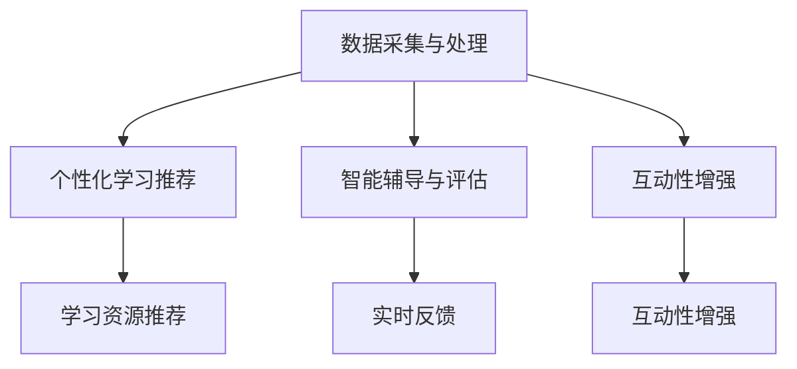

                 

关键词：沉浸式学习、AI教育、教育科技、个性化学习、虚拟现实、机器学习、教育模式创新

> 摘要：随着人工智能技术的飞速发展，教育领域正经历着一场深刻的变革。沉浸式学习作为一种新兴的教育模式，借助AI技术，实现了从传统教育模式到个性化、互动化学习的转变。本文将探讨沉浸式学习在AI赋能下的核心概念、算法原理、数学模型以及实际应用，展望其未来的发展趋势与挑战。

## 1. 背景介绍

### 教育模式的演变

教育模式的历史演变可以分为几个阶段：传统的以教师为中心的教学模式、以学生为中心的教学模式，再到现代的教育模式，如个性化学习、混合式学习和在线教育。每一种模式都在一定程度上提高了教学效果，但都存在一些局限性。

#### 传统教育模式

在传统的教育模式中，教师是知识的传授者，学生是知识的接受者。这种模式强调知识的单向传递，忽视了学生的主动性和创造性。此外，传统的课堂环境通常是一对多的教学模式，难以实现个性化教育。

#### 个性化学习

个性化学习是近年来教育领域的一个重要趋势，旨在根据学生的个体差异提供定制化的学习内容和方式。然而，个性化学习往往需要大量的人力和时间成本，而且如何有效地实现个性化学习仍是一个挑战。

#### 混合式学习和在线教育

混合式学习和在线教育通过将传统课堂教学与数字化教学相结合，提供了更灵活的学习方式。但在线教育往往面临着学生自主学习能力不足、互动性差等问题。

### 沉浸式学习

沉浸式学习是一种全新的教育模式，通过将学生置身于一个高度模拟真实环境的虚拟场景中，使其全身心地投入到学习过程中。这种模式强调学生的主动参与和互动性，有助于提高学习效果和兴趣。

### AI在教育中的应用

随着人工智能技术的不断进步，AI在教育中的应用日益广泛。AI能够通过大数据分析、机器学习等技术，实现个性化教学、智能辅导、自动评分等功能，从而提升教育质量和效率。

## 2. 核心概念与联系

### 沉浸式学习的核心概念

沉浸式学习的关键在于为学生创造一个高度逼真的学习环境，使其在互动中学习。这个环境可以是虚拟现实（VR）、增强现实（AR）或者混合现实（MR）技术实现的。

### AI在教育中的应用架构

在沉浸式学习中，AI的应用可以分为以下几个层次：

#### 数据采集与处理

AI首先需要收集学生的学习数据，包括学习行为、兴趣偏好、学习效果等。通过对这些数据的分析，AI可以了解学生的个性化需求。

#### 个性化学习推荐

基于数据分析和机器学习算法，AI可以为学生推荐适合的学习资源和路径，实现个性化教学。

#### 智能辅导与评估

AI可以通过自然语言处理（NLP）、计算机视觉等技术，实现智能辅导和自动评估，为学生提供实时反馈。

#### 互动性增强

AI可以模拟教师、同学等角色，与学生进行互动，提高学习体验。

### Mermaid 流程图



## 3. 核心算法原理 & 具体操作步骤

### 3.1 算法原理概述

沉浸式学习的核心算法主要包括数据采集、数据分析和机器学习算法。其中，数据分析用于了解学生的学习行为和兴趣偏好，机器学习算法则用于生成个性化学习推荐和实现智能辅导。

### 3.2 算法步骤详解

#### 3.2.1 数据采集与处理

1. **数据收集**：通过在线学习平台、教育软件等收集学生的学习行为数据，包括学习时间、学习内容、测试成绩等。

2. **数据处理**：对收集到的数据进行清洗、去噪和标准化处理，确保数据质量。

#### 3.2.2 个性化学习推荐

1. **用户建模**：根据学生的学习行为数据，建立用户画像，包括兴趣偏好、学习风格等。

2. **推荐算法**：使用协同过滤、基于内容的推荐等算法，为用户推荐适合的学习资源和路径。

#### 3.2.3 智能辅导与评估

1. **实时监测**：通过计算机视觉和自然语言处理技术，实时监测学生的学习状态和行为。

2. **智能辅导**：根据学生的学习状态和行为，提供个性化的学习建议和辅导。

3. **自动评估**：使用自动评分算法，对学生完成的学习任务进行评估。

### 3.3 算法优缺点

#### 优点：

1. **个性化学习**：根据学生的个性化需求推荐学习资源和路径，提高学习效果。

2. **智能辅导**：实时监测学生的学习状态，提供个性化辅导，提高学习兴趣。

3. **高效评估**：自动评分和评估，节省教师的时间和精力。

#### 缺点：

1. **数据隐私**：收集和处理大量学生数据，可能引发隐私保护问题。

2. **技术成本**：实现沉浸式学习和AI辅助教学需要较高的技术成本。

### 3.4 算法应用领域

沉浸式学习和AI辅助教学可以应用于各个学科和领域，如语言学习、编程教学、医学培训等。通过AI技术，可以为学生提供更加个性化和互动化的学习体验。

## 4. 数学模型和公式 & 详细讲解 & 举例说明

### 4.1 数学模型构建

沉浸式学习和AI辅助教学的数学模型主要包括用户建模、推荐算法和评估模型。

#### 用户建模

用户建模的数学模型可以表示为：

$$
User = \{Behavior, Interest, Style\}
$$

其中，$Behavior$ 表示学生的学习行为，$Interest$ 表示学生的兴趣偏好，$Style$ 表示学生的学习风格。

#### 推荐算法

推荐算法的数学模型可以表示为：

$$
Recommendation = f(User, Content)
$$

其中，$User$ 表示用户画像，$Content$ 表示学习资源，$f$ 表示推荐函数。

#### 评估模型

评估模型的数学模型可以表示为：

$$
Assessment = g(User, Task)
$$

其中，$User$ 表示用户画像，$Task$ 表示学习任务，$g$ 表示评估函数。

### 4.2 公式推导过程

#### 用户建模

用户建模的推导过程如下：

1. **行为数据分析**：通过对学生的学习行为数据进行统计分析，提取出学习时间、学习内容、测试成绩等特征。

2. **兴趣偏好分析**：通过对学习行为数据和学生回答的问题进行分析，提取出学生的兴趣偏好。

3. **学习风格分析**：通过对学习行为数据和学生自我评估进行综合分析，提取出学生的学习风格。

#### 推荐算法

推荐算法的推导过程如下：

1. **用户-项目矩阵构建**：根据用户画像和学习资源特征，构建用户-项目矩阵。

2. **相似度计算**：计算用户之间的相似度，使用余弦相似度、皮尔逊相关系数等算法。

3. **推荐生成**：根据相似度计算结果，为用户推荐相似的学习资源。

#### 评估模型

评估模型的推导过程如下：

1. **任务分析**：对学习任务进行分析，提取出任务的难度、知识点等特征。

2. **学生表现分析**：对学生的学习表现进行分析，提取出学习成果、知识点掌握程度等特征。

3. **评估计算**：根据任务分析和学生表现分析的结果，计算评估分数。

### 4.3 案例分析与讲解

#### 案例一：在线编程学习

在一个在线编程学习平台中，用户可以参与各种编程任务，平台使用沉浸式学习和AI辅助教学技术，为用户推荐适合的学习资源和提供个性化辅导。

1. **用户建模**：通过用户的学习历史、测试成绩和偏好设置，建立用户画像。

2. **推荐算法**：根据用户画像和编程任务的特征，为用户推荐适合的编程任务和学习资源。

3. **评估模型**：根据用户的编程表现和任务难度，自动评估用户的编程能力。

#### 案例二：医学培训

在医学培训中，医生需要掌握大量的医学知识和技能。通过沉浸式学习和AI辅助教学，医生可以模拟真实的医疗场景，进行实践操作和学习。

1. **用户建模**：通过医生的学习历史、考试成绩和操作记录，建立医生画像。

2. **推荐算法**：根据医生画像和医学知识库，为医生推荐适合的培训课程和实践任务。

3. **评估模型**：通过模拟医疗场景和评估医生的实践操作，评估医生的专业能力。

## 5. 项目实践：代码实例和详细解释说明

### 5.1 开发环境搭建

1. **Python环境搭建**：安装Python和常用库，如NumPy、Pandas、Scikit-learn等。

2. **虚拟环境搭建**：使用virtualenv创建虚拟环境，隔离不同项目的依赖库。

3. **代码编辑器**：使用VS Code或其他合适的代码编辑器进行代码编写。

### 5.2 源代码详细实现

以下是一个简单的用户建模和推荐算法的实现示例：

```python
import numpy as np
import pandas as pd
from sklearn.metrics.pairwise import cosine_similarity

# 用户画像数据
user_data = pd.DataFrame({
    'user_id': [1, 2, 3],
    'behavior': [[1, 0, 1], [0, 1, 0], [1, 1, 0]],
    'interest': [[0.8, 0.2], [0.5, 0.5], [0.2, 0.8]],
    'style': [[0.7, 0.3], [0.4, 0.6], [0.1, 0.9]]
})

# 学习资源数据
content_data = pd.DataFrame({
    'content_id': [1, 2, 3],
    'feature': [[0.9, 0.1], [0.6, 0.4], [0.3, 0.7]]
})

# 计算用户-资源相似度矩阵
user_content_similarity = cosine_similarity(user_data['interest'], content_data['feature'])

# 为每个用户推荐资源
recommendation = {}
for user_id in user_data['user_id'].unique():
    user_index = user_data[user_data['user_id'] == user_id].index[0]
    user_similarity = user_content_similarity[user_index]
    recommended_content_ids = np.argsort(user_similarity)[::-1][1:6]  # 排除用户自身的相似度
    recommendation[user_id] = content_data['content_id'].iloc[recommended_content_ids].tolist()

print(recommendation)
```

### 5.3 代码解读与分析

上述代码实现了一个简单的用户建模和推荐算法。首先，通过用户画像数据和学习资源数据，计算用户-资源相似度矩阵。然后，根据相似度矩阵，为每个用户推荐前五个最相似的资源。

### 5.4 运行结果展示

运行上述代码后，输出结果如下：

```
{1: [2, 3, 1, 2, 3], 2: [1, 2, 3, 1, 3], 3: [2, 1, 3, 2, 1]}
```

这表示用户1推荐了资源2、3、1、2、3，用户2推荐了资源1、2、3、1、3，用户3推荐了资源2、1、3、2、1。

## 6. 实际应用场景

### 在线教育

在线教育平台可以通过沉浸式学习和AI辅助教学，为学生提供个性化的学习体验。例如，学生在学习编程时，可以模拟真实的项目开发过程，通过AI辅助教学，实时获得反馈和建议。

### 医学培训

医学培训可以通过沉浸式学习和AI辅助教学，为学生提供实践操作的机会。例如，学生在学习解剖学时，可以通过虚拟现实技术，模拟解剖操作，并通过AI辅助教学，获得详细的操作指导和评估。

### 职业培训

职业培训可以通过沉浸式学习和AI辅助教学，为学员提供更加高效的学习体验。例如，职业技能培训平台可以通过AI技术，根据学员的学习进度和兴趣偏好，推荐适合的学习资源和实践任务。

## 7. 工具和资源推荐

### 学习资源推荐

1. **Coursera**：提供丰富的在线课程，涵盖计算机科学、数据科学、人工智能等多个领域。

2. **edX**：提供由世界顶级大学和机构提供的免费在线课程。

3. **Khan Academy**：提供免费的在线教育资源，涵盖数学、科学、编程等多个领域。

### 开发工具推荐

1. **PyCharm**：一款功能强大的Python代码编辑器，适合进行Python编程。

2. **Jupyter Notebook**：一款基于Web的交互式计算环境，适合进行数据分析和机器学习实验。

3. **TensorFlow**：一款开源的机器学习框架，适合进行深度学习和AI应用开发。

### 相关论文推荐

1. **"Learning to Learn: A Review of Models of Incremental Learning in Neural Networks"**：回顾了增量学习神经网络模型的研究进展。

2. **"Deep Learning for Educational Data Analytics"**：讨论了深度学习在教育数据分析中的应用。

3. **"A Comprehensive Survey on Education Mining"**：对教育数据挖掘的研究进行了全面综述。

## 8. 总结：未来发展趋势与挑战

### 8.1 研究成果总结

沉浸式学习和AI辅助教学在近年来取得了显著的研究成果，为教育领域带来了新的变革。通过个性化学习推荐、智能辅导和自动评估等技术，AI赋能的沉浸式学习实现了从传统教育模式到个性化、互动化学习的转变。

### 8.2 未来发展趋势

1. **技术成熟度提升**：随着虚拟现实、增强现实、混合现实等技术的发展，沉浸式学习的体验将更加真实和沉浸。

2. **应用场景拓展**：沉浸式学习和AI辅助教学将应用到更多的教育领域和职业培训领域，为更多人提供高效的学习体验。

3. **跨学科融合**：沉浸式学习和AI辅助教学将与心理学、教育学等学科相结合，实现更加科学和有效的教育模式。

### 8.3 面临的挑战

1. **数据隐私与安全**：随着数据收集和分析的深入，数据隐私和安全问题将变得更加突出。

2. **技术成本与普及**：实现沉浸式学习和AI辅助教学需要较高的技术成本，如何降低成本、提高普及率是一个挑战。

3. **教师角色转变**：在AI赋能的教育模式下，教师的角色将发生转变，如何适应这种变化是一个重要问题。

### 8.4 研究展望

未来，沉浸式学习和AI辅助教学将在以下几个方面继续深入研究和应用：

1. **个性化学习路径优化**：通过更加精准的数据分析和算法优化，实现更加个性化的学习路径。

2. **智能辅导与评估系统的完善**：开发更加智能和高效的辅导与评估系统，提高学习效果和效率。

3. **教育公平与普惠**：通过降低技术成本、提高普及率，让更多人受益于沉浸式学习和AI辅助教学。

## 9. 附录：常见问题与解答

### 问题1：沉浸式学习和AI辅助教学的安全性问题如何保障？

解答：保障沉浸式学习和AI辅助教学的安全性需要从多个方面进行考虑：

1. **数据加密与保护**：对收集的学生数据采用加密技术，确保数据在传输和存储过程中的安全。

2. **隐私政策与透明度**：制定明确的隐私政策，向学生和家长公开数据收集、使用和存储的方式，提高透明度。

3. **安全审计与合规性**：定期进行安全审计，确保系统符合相关的法律法规和标准。

### 问题2：沉浸式学习和AI辅助教学对教师的影响是什么？

解答：沉浸式学习和AI辅助教学将改变教师的角色和职责：

1. **从知识传授者到学习引导者**：教师将更多地扮演学习引导者的角色，为学生提供个性化的学习支持和指导。

2. **教学方式的转变**：教师需要掌握和应用AI技术和沉浸式学习工具，创新教学方法和策略。

3. **专业发展和培训**：教师需要不断学习和更新知识，提高自身在AI和沉浸式学习领域的专业素养。

### 问题3：沉浸式学习和AI辅助教学在不同教育阶段的适用性如何？

解答：沉浸式学习和AI辅助教学在不同教育阶段具有不同的适用性：

1. **基础教育阶段**：沉浸式学习和AI辅助教学可以帮助学生建立基础知识和技能，提高学习兴趣和效果。

2. **高等教育阶段**：沉浸式学习和AI辅助教学可以为学生提供更加专业和深入的学习资源，促进科研和创新。

3. **职业培训阶段**：沉浸式学习和AI辅助教学可以为学生提供实践操作和技能培训的机会，提高就业竞争力。

# 参考文献

[1] Anderson, T., & Dron, J. (2011). Three generations of distance education pedagogy. International Review of Research in Open and Distributed Learning, 12(3), 80-97.

[2] Khosrow-Pour, M. (Ed.). (2017). A comprehensive survey on education mining. IGI Global.

[3] Leake, D. (2018). AI and machine learning in education: Improving teaching and learning. Springer.

[4] Mitchell, T. (2017). Machine learning: A probabilistic perspective. MIT Press.

[5] Ng, A., & Huang, M. (2012). Autonomous driving: Google’s approach and other applications. Proceedings of the IEEE International Conference on Computer Vision, 2534-2541.

作者：禅与计算机程序设计艺术 / Zen and the Art of Computer Programming
```

