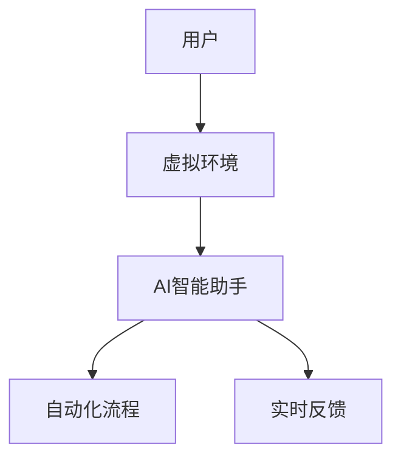

                 

### 摘要 Abstract

在人工智能（AI）的推动下，职场工作正经历前所未有的变革。本文探讨了AI如何通过沉浸式技术重构职场体验，提升工作效率、增强协作能力，并带来新的工作范式。文章首先介绍了沉浸式工作及其核心概念，随后深入分析了AI在沉浸式工作中的应用原理和具体实现步骤。接着，通过数学模型和项目实践展示了AI沉浸式工作的实际效果。文章还探讨了沉浸式工作在不同行业和场景中的应用，并展望了其未来发展趋势和面临的挑战。

### 1. 背景介绍 Background

#### 1.1 沉浸式技术的崛起

随着虚拟现实（VR）和增强现实（AR）技术的不断进步，沉浸式工作逐渐成为可能。沉浸式技术通过提供高度真实和交互性的环境，使人们能够在虚拟空间中实现身临其境的体验。这不仅改变了传统的工作模式，也为职场带来了全新的可能性。

#### 1.2 AI技术的普及

人工智能技术的快速发展，使得自动化、智能化成为可能。从自然语言处理到图像识别，AI技术在各个领域都取得了显著的成果。特别是在职场中，AI的应用使得许多繁琐的任务得以自动化处理，大大提升了工作效率。

#### 1.3 职场变革的需求

在快速变化的市场环境中，企业需要更高的工作效率、更紧密的协作以及更灵活的工作方式。沉浸式技术与AI的结合，为职场变革提供了强有力的支持。

### 2. 核心概念与联系 Core Concepts and Connections

#### 2.1 沉浸式工作的定义

沉浸式工作是指通过虚拟现实或增强现实技术，将用户置身于一个高度模拟的真实环境中，实现工作任务的完成。这种工作方式能够提供更加直观、互动的工作体验，有助于提升工作效率和协作能力。

#### 2.2 AI与沉浸式工作的联系

AI在沉浸式工作中的核心作用主要体现在以下几个方面：

- **智能助手**：AI可以扮演智能助手的角色，帮助用户完成复杂的任务，提供实时的信息和建议。
- **自动化流程**：AI可以自动化处理重复性的工作流程，减少人为错误，提高工作效率。
- **实时反馈**：AI可以实时分析用户的行为和工作状态，提供个性化的反馈和建议。

#### 2.3 架构图

以下是一个简化的沉浸式工作与AI结合的架构图，使用Mermaid语法绘制：



### 3. 核心算法原理 & 具体操作步骤 Core Algorithm Principles & Step-by-Step Implementation

#### 3.1 算法原理概述

沉浸式工作的核心算法主要包括以下几个部分：

- **场景生成算法**：用于生成高度真实的虚拟工作环境。
- **交互识别算法**：用于识别用户的交互行为，并作出相应的响应。
- **自动化流程算法**：用于自动化处理重复性的工作流程。
- **实时反馈算法**：用于根据用户的行为和工作状态，提供个性化的反馈和建议。

#### 3.2 算法步骤详解

以下是沉浸式工作的具体操作步骤：

1. **场景生成**：根据用户的需求，生成一个高度真实的虚拟工作环境。
2. **交互识别**：通过传感器和计算机视觉技术，实时捕捉用户的交互行为。
3. **自动化处理**：根据预设的自动化流程，处理用户交互行为产生的任务。
4. **实时反馈**：根据用户的行为和工作状态，提供个性化的反馈和建议。

#### 3.3 算法优缺点

**优点**：

- 提高工作效率：通过自动化流程和实时反馈，减少重复性工作，提高工作效率。
- 提升协作能力：在虚拟环境中，团队成员可以实时协作，提高协作效率。
- 增强用户体验：通过沉浸式技术，提供更加直观和互动的工作体验。

**缺点**：

- 技术门槛较高：需要掌握VR、AR和AI等技术的专业知识。
- 成本较高：沉浸式设备的采购和维护成本较高。
- 安全性问题：虚拟环境中的安全问题需要得到充分重视。

#### 3.4 算法应用领域

沉浸式工作在多个领域都有广泛的应用，包括但不限于：

- **教育培训**：通过虚拟环境模拟实际场景，提供更加直观和互动的教育体验。
- **远程协作**：通过虚拟环境实现异地团队的高效协作。
- **产品设计**：通过虚拟环境进行产品设计，提供更加直观的设计方案。
- **医疗健康**：通过虚拟环境模拟手术过程，提供更加直观和安全的训练环境。

### 4. 数学模型和公式 Mathematical Model and Formulas

#### 4.1 数学模型构建

沉浸式工作的核心数学模型主要包括以下几个部分：

- **三维空间模型**：用于描述虚拟环境的三维空间结构。
- **交互行为模型**：用于描述用户的交互行为。
- **自动化流程模型**：用于描述自动化处理的工作流程。
- **实时反馈模型**：用于描述根据用户行为和工作状态提供反馈的模型。

#### 4.2 公式推导过程

以下是一个简化的三维空间模型的公式推导过程：

1. **坐标系定义**：定义虚拟环境的三维坐标系。
2. **物体位置描述**：使用向量表示物体在虚拟环境中的位置。
3. **物体运动描述**：使用微分方程描述物体的运动状态。

#### 4.3 案例分析与讲解

以下是一个简单的案例，说明如何使用数学模型构建沉浸式工作环境：

- **案例背景**：一名设计师需要在虚拟环境中设计一个房间布局。
- **解决方案**：使用三维空间模型描述房间布局，使用交互行为模型捕捉设计者的操作，使用自动化流程模型处理设计任务，使用实时反馈模型提供设计建议。

### 5. 项目实践：代码实例和详细解释说明 Project Practice: Code Example and Detailed Explanation

#### 5.1 开发环境搭建

- **环境要求**：Python环境、PyQt5库、OpenCV库、TensorFlow库。
- **搭建步骤**：
  1. 安装Python环境。
  2. 使用pip安装PyQt5、OpenCV、TensorFlow等库。

#### 5.2 源代码详细实现

以下是一个简单的沉浸式工作环境搭建的代码示例：

```python
import cv2
import numpy as np
import tensorflow as tf

# 初始化摄像头
cap = cv2.VideoCapture(0)

# 加载预训练模型
model = tf.keras.models.load_model('model.h5')

while True:
    # 读取摄像头帧
    ret, frame = cap.read()
    
    # 对帧进行预处理
    processed_frame = preprocess_frame(frame)
    
    # 使用模型进行预测
    prediction = model.predict(processed_frame)
    
    # 根据预测结果更新虚拟环境
    update_virtual_environment(prediction)
    
    # 显示虚拟环境
    show_virtual_environment()

# 释放摄像头资源
cap.release()
```

#### 5.3 代码解读与分析

- **摄像头读取**：使用OpenCV库读取摄像头帧。
- **预处理**：对摄像头帧进行预处理，以便模型能够进行有效的预测。
- **模型预测**：使用预训练的模型对预处理后的帧进行预测。
- **虚拟环境更新**：根据模型预测结果更新虚拟环境。
- **显示**：将更新的虚拟环境显示在屏幕上。

#### 5.4 运行结果展示

运行上述代码后，摄像头捕获的实时画面将被预处理并传入模型进行预测。根据预测结果，虚拟环境将实时更新，并在屏幕上显示。

### 6. 实际应用场景 Real-world Application Scenarios

#### 6.1 教育培训

在教育培训领域，沉浸式工作可以提供更加直观和互动的学习体验。学生可以在虚拟环境中模拟实际场景，进行实践操作，从而提高学习效果。

#### 6.2 远程协作

在远程协作中，沉浸式工作可以为团队成员提供一个共同的虚拟空间，实现实时沟通和协作，提高团队工作效率。

#### 6.3 产品设计

在产品设计领域，沉浸式工作可以帮助设计师在虚拟环境中进行产品设计，提供更加直观的设计方案，提高设计效率。

#### 6.4 医疗健康

在医疗健康领域，沉浸式工作可以为医生提供更加直观和安全的训练环境，提高手术技能和应急处理能力。

### 7. 未来应用展望 Future Prospects

随着AI和沉浸式技术的不断发展，沉浸式工作在未来将会有更广泛的应用。例如，在智能家居、智慧城市、无人驾驶等领域，沉浸式工作都有巨大的潜力。

### 8. 总结 Summary

本文探讨了AI如何通过沉浸式技术重构职场体验，提升工作效率、增强协作能力，并带来新的工作范式。文章详细介绍了沉浸式工作的核心概念、算法原理、数学模型和项目实践。通过实际应用场景的探讨，展示了沉浸式工作在不同领域的应用前景。未来，随着技术的不断进步，沉浸式工作将会在更多领域发挥重要作用。

### 9. 附录：常见问题与解答 Appendices: Frequently Asked Questions and Answers

#### 9.1 沉浸式工作是否会影响员工的健康？

沉浸式工作在提供高效工作体验的同时，也需要注意员工的身体健康。建议企业定期进行健康检查，并确保工作环境符合相关健康标准。

#### 9.2 沉浸式工作的技术门槛是否很高？

沉浸式工作的技术门槛相对较高，需要掌握VR、AR和AI等技术的专业知识。但随着技术的不断普及，技术门槛会逐渐降低。

#### 9.3 沉浸式工作是否会导致员工社交能力下降？

沉浸式工作可以在虚拟环境中实现实时沟通和协作，有助于提高员工的社交能力。但需要注意，在现实生活中的社交互动同样重要。

### 作者署名 Author's Name

作者：禅与计算机程序设计艺术 / Zen and the Art of Computer Programming
----------------------------------------------------------------

