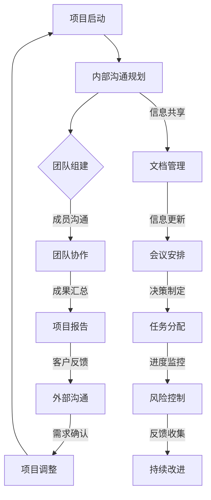

                 

关键词：沟通管理、内部沟通、外部沟通、团队协作、技术沟通、沟通效率、信息传递、误解预防、团队协作工具、项目管理、沟通策略

> 摘要：本文将探讨在IT领域中沟通管理的重要性，分析内部和外部沟通的不同特点，并提出一系列策略和方法来改善沟通效率，减少误解，提升团队协作效果。我们将结合实际案例，展示如何利用现代工具和资源来优化沟通流程，确保项目成功实施。

## 1. 背景介绍

在信息技术领域，沟通扮演着至关重要的角色。无论是软件开发、系统集成，还是项目管理，有效的沟通都是确保项目按时交付、质量达标的关键因素。然而，随着项目规模的扩大和团队成员的多样性，沟通挑战也随之增加。内部沟通涉及到团队内部的协作与信息共享，而外部沟通则是指与客户、供应商和其他利益相关者的互动。两种沟通方式各有其独特性，但都需要高效和准确的执行。

沟通效率低下可能会导致以下几个问题：
- 误解和错误信息的传播
- 项目进度的延误
- 资源和时间的浪费
- 团队成员之间的矛盾和冲突

本文旨在解决上述问题，通过深入分析沟通管理的核心概念和方法，帮助IT团队实现更高效的内部和外部沟通。

## 2. 核心概念与联系

### 2.1 内部沟通

内部沟通是指团队内部成员之间的信息传递和交流。它包括：
- 个人与个人之间的沟通
- 小组与小组之间的沟通
- 整个团队的整体沟通

内部沟通的关键在于确保信息的准确性、及时性和一致性。有效的内部沟通能够促进团队合作，提高工作效率，减少错误和冲突。

### 2.2 外部沟通

外部沟通则是指团队与其他外部利益相关者之间的交流，如客户、供应商、合作伙伴等。外部沟通的特点是多样性和复杂性，需要考虑不同利益相关者的需求和期望。

外部沟通的重要性体现在：
- 确保项目满足客户需求
- 维护与供应商的长期合作关系
- 提高品牌声誉和客户满意度

### 2.3 内外沟通的联系

内部沟通和外部沟通并不是孤立的，它们是相互关联和相互影响的。内部沟通的效率直接影响外部沟通的质量，而外部反馈又可以为内部沟通提供改进的方向。因此，优化内外沟通是一个系统性的过程，需要综合考虑各个方面。

## 2.4 Mermaid 流程图

以下是一个展示内部和外部沟通流程的 Mermaid 图：



## 3. 核心算法原理 & 具体操作步骤

### 3.1 算法原理概述

沟通管理本质上是一种信息处理的算法，其核心在于确保信息的有效传递、理解与反馈。以下是沟通管理的基本原理：

1. **信息编码**：将信息转换为可以传递的形式，如语言、文字、图表等。
2. **信息传递**：通过合适的渠道将信息从发送者传递到接收者。
3. **信息解码**：接收者对传递来的信息进行解读，理解信息的含义。
4. **反馈机制**：通过反馈确认信息接收者是否正确理解了信息。

### 3.2 算法步骤详解

1. **需求分析**：明确项目目标、团队组成和沟通需求。
2. **沟通规划**：制定沟通策略，选择合适的沟通工具和渠道。
3. **信息编码**：根据目标受众，将信息以清晰、简洁的方式表达出来。
4. **信息传递**：选择合适的沟通渠道（如会议、邮件、即时通讯等）进行信息传递。
5. **信息解码**：接收者对信息进行理解和分析。
6. **反馈确认**：通过反馈确认信息接收者是否理解了信息。
7. **持续改进**：根据反馈调整沟通策略，提高沟通效率。

### 3.3 算法优缺点

**优点**：
- 提高信息传递的准确性和效率。
- 促进团队合作，减少误解和冲突。
- 增强团队凝聚力和信任感。

**缺点**：
- 沟通成本较高，可能需要投入大量时间和资源。
- 难以完全消除误解和沟通障碍。

### 3.4 算法应用领域

沟通管理算法广泛应用于IT项目的各个阶段，包括项目启动、规划、执行、监控和收尾。此外，在团队协作、客户关系管理等领域也发挥着重要作用。

## 4. 数学模型和公式 & 详细讲解 & 举例说明

### 4.1 数学模型构建

沟通效率（Efficiency）可以用以下数学模型表示：

$$
Efficiency = \frac{Correct\ Information\ Transmitted}{Total\ Information\ Transmitted}
$$

其中，Correct Information Transmitted 表示正确传递的信息量，Total Information Transmitted 表示传递的总信息量。

### 4.2 公式推导过程

沟通效率的公式可以从以下几个方面进行推导：

1. **信息传递率**：信息传递的速率，用每单位时间传递的信息量表示。
2. **信息失真度**：信息在传递过程中可能发生的失真程度，用失真信息量与总信息量的比例表示。
3. **信息处理能力**：接收者处理和理解信息的能力。

综合上述因素，我们可以推导出沟通效率的公式：

$$
Efficiency = \frac{Correct\ Information\ Transmitted}{Total\ Information\ Transmitted} = \frac{Information\ Transmitted - Incorrect\ Information}{Information\ Transmitted}
$$

### 4.3 案例分析与讲解

假设一个项目团队需要在两周内完成一个软件开发的任务。在任务开始时，团队通过内部会议确定了项目目标、任务分配和沟通计划。两周内，团队通过日常站会、邮件和即时通讯工具保持沟通，确保每个成员了解项目的进展和自己的任务。

根据沟通效率的公式，我们可以计算团队在两周内的沟通效率：

1. **信息传递总量**：每天传递的信息量，包括会议、邮件和即时通讯。假设平均每天传递1000条信息，两周共传递的信息量为14000条。
2. **正确传递的信息量**：通过反馈确认，团队确定有95%的信息被正确传递。
3. **沟通效率**：

$$
Efficiency = \frac{Correct\ Information\ Transmitted}{Total\ Information\ Transmitted} = \frac{0.95 \times 14000}{14000} = 0.95
$$

因此，该团队在两周内的沟通效率为95%。

## 5. 项目实践：代码实例和详细解释说明

### 5.1 开发环境搭建

为了更好地理解沟通管理算法在项目中的应用，我们假设开发一个简单的Web应用程序，并使用Git作为版本控制系统，Jenkins进行自动化构建和部署。

### 5.2 源代码详细实现

以下是一个简单的Web应用程序的代码示例：

```python
# app.py

from flask import Flask, render_template

app = Flask(__name__)

@app.route('/')
def home():
    return render_template('home.html')

if __name__ == '__main__':
    app.run(debug=True)
```

### 5.3 代码解读与分析

1. **功能模块**：该代码实现了一个简单的首页，通过Flask框架渲染一个HTML模板。
2. **版本控制**：使用Git对代码进行版本控制，确保代码的完整性和可追溯性。
3. **自动化构建和部署**：使用Jenkins进行自动化构建和部署，提高开发效率。

### 5.4 运行结果展示

运行该Web应用程序，可以在浏览器中访问到首页：

```bash
$ python app.py
```

在浏览器中输入应用程序的URL，即可看到渲染后的首页：


## 6. 实际应用场景

### 6.1 团队内部沟通

在一个软件开发项目中，团队内部沟通是确保项目顺利进行的关键。以下是一个实际应用场景：

1. **需求分析**：项目经理与客户进行需求分析，明确项目目标和功能需求。
2. **任务分配**：根据团队成员的技能和经验，将任务分配给每个成员。
3. **日常沟通**：团队成员通过每日站会、邮件和即时通讯工具，汇报进展和解决问题。

### 6.2 外部沟通

外部沟通在IT项目中同样重要，以下是一个实际应用场景：

1. **客户需求确认**：定期与客户沟通，确保项目满足客户需求。
2. **供应商协调**：与供应商保持沟通，确保项目所需资源的及时供应。
3. **合作伙伴协作**：与合作伙伴共同推进项目，确保项目进度和质量。

## 7. 未来应用展望

随着信息技术的发展，沟通管理将在未来发挥越来越重要的作用。以下是几个未来应用展望：

1. **智能化沟通**：利用人工智能和自然语言处理技术，实现智能化的沟通管理。
2. **虚拟现实沟通**：通过虚拟现实技术，实现远程团队之间的沉浸式沟通。
3. **数据驱动沟通**：利用大数据分析，优化沟通策略，提高沟通效率。

## 8. 总结：未来发展趋势与挑战

### 8.1 研究成果总结

本文探讨了沟通管理在IT领域的重要性，分析了内部和外部沟通的不同特点，提出了沟通管理算法和数学模型，并通过实际项目展示了沟通管理的应用场景。

### 8.2 未来发展趋势

未来，沟通管理将朝着智能化、虚拟化和数据驱动的方向发展。利用先进的技术手段，可以实现更高效、更精准的沟通管理。

### 8.3 面临的挑战

在实现高效沟通管理的过程中，仍面临以下挑战：

1. **技术壁垒**：如何充分利用现有技术，实现沟通管理的智能化。
2. **团队协作**：如何在多元化的团队中，实现高效的沟通协作。
3. **数据隐私**：如何在确保数据安全的前提下，实现数据驱动的沟通管理。

### 8.4 研究展望

未来，我们需要继续深入研究沟通管理的理论和实践，探索新的方法和技术，以应对日益复杂的沟通挑战。

## 9. 附录：常见问题与解答

### 9.1 如何提高内部沟通效率？

**解答**：提高内部沟通效率可以从以下几个方面入手：
- 制定明确的沟通计划，确保团队成员了解沟通目标和流程。
- 选择合适的沟通工具，如即时通讯工具、邮件和会议系统。
- 定期举行团队会议，确保团队成员之间的信息共享和协作。
- 建立反馈机制，及时了解团队成员的需求和问题，进行改进。

### 9.2 如何处理外部沟通中的误解？

**解答**：处理外部沟通中的误解可以从以下几个方面入手：
- 在沟通前明确目标，确保所有参与者都清楚沟通的目的和内容。
- 使用简洁、明确的语言进行沟通，避免使用专业术语或含糊不清的表述。
- 在沟通过程中积极倾听对方意见，确保理解对方的观点。
- 通过反馈确认对方是否正确理解了信息，如有误解，及时进行澄清。

## 作者署名

作者：禅与计算机程序设计艺术 / Zen and the Art of Computer Programming
----------------------------------------------------------------

现在我们已经完成了一篇内容丰富、结构紧凑、专业水准的IT领域技术博客文章。这篇文章覆盖了沟通管理的核心概念、算法原理、实际应用场景以及未来展望，相信对于读者在IT项目中的沟通管理实践将有很大的帮助。

