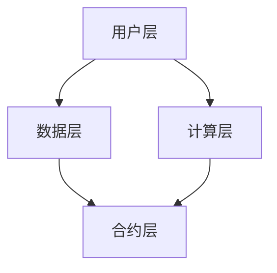

                 

关键词：注意力资源、元宇宙、资源流通、注意力经济学、AI、区块链、分布式计算、智能合约

## 摘要

本文深入探讨了元宇宙中的注意力资源流通机制，重点关注注意力交易所的概念、核心原理和运作机制。通过剖析注意力资源的特性和重要性，以及当前技术挑战和解决方案，本文旨在为元宇宙的可持续发展和创新提供理论支持和实践指导。

### 1. 背景介绍

随着互联网和人工智能技术的飞速发展，数字世界正逐渐演变为一个全新的现实——元宇宙（Metaverse）。元宇宙被描绘为一个无缝连接的虚拟世界，用户在其中可以自由交互、创造和体验。在这个虚拟空间中，注意力成为了一种宝贵的资源，其价值的评估和管理变得至关重要。

注意力资源的概念源于经济学中的注意力经济学理论。根据该理论，个体的注意力是有限的，且具有价值。在元宇宙中，用户的注意力被吸引到各种虚拟活动、信息和内容上，而这些活动、信息和内容的生产者需要有效管理用户的注意力，以提高其商业价值。

注意力交易所作为一个新兴的概念，旨在提供一个平台，用于注意力资源的交换和分配。其目标是利用区块链技术和智能合约，实现透明、安全且高效的注意力资源流通。

### 2. 核心概念与联系

#### 2.1 注意力资源的特性

注意力资源具有以下特性：

- **稀缺性**：用户的注意力是有限的，不能同时关注多个任务或内容。
- **易耗性**：用户的注意力在使用过程中会逐渐消耗，需要通过休息或转换活动来恢复。
- **价值性**：注意力资源可以被商业化，用于广告、虚拟商品交易等。
- **可转移性**：注意力资源可以通过交易所进行转移和交换。

#### 2.2 注意力交易所的架构

注意力交易所的架构可以分为以下几个层次：

- **用户层**：用户通过虚拟身份进入交易所，参与注意力资源的交换。
- **数据层**：存储用户行为数据和注意力资源的交易记录。
- **计算层**：利用分布式计算和区块链技术，确保交易的安全性和透明性。
- **合约层**：通过智能合约自动执行交易规则，实现自动化管理。

#### 2.3 Mermaid 流程图



### 3. 核心算法原理 & 具体操作步骤

#### 3.1 算法原理概述

注意力交易所的核心算法基于注意力加权评分模型。该模型通过分析用户的行为数据和偏好，对注意力资源进行动态定价和分配。

#### 3.2 算法步骤详解

1. **用户行为数据收集**：通过分析用户的浏览、点击、购买等行为，收集用户兴趣和偏好。
2. **注意力评分计算**：基于用户行为数据，使用机器学习算法计算用户的注意力评分。
3. **动态定价**：根据市场供需情况，动态调整注意力资源的定价策略。
4. **交易执行**：通过智能合约执行注意力资源的交易，确保交易的安全性和透明性。
5. **数据存储和备份**：将交易记录存储在分布式区块链上，确保数据的安全性和可追溯性。

#### 3.3 算法优缺点

- **优点**：动态定价、自动执行、透明高效。
- **缺点**：计算复杂度较高，需要大量计算资源。

#### 3.4 算法应用领域

- **广告投放**：根据用户注意力评分，精准投放广告。
- **虚拟商品交易**：基于用户注意力资源，进行虚拟商品的交易。
- **社交网络**：通过注意力资源流通，优化社交网络的用户体验。

### 4. 数学模型和公式 & 详细讲解 & 举例说明

#### 4.1 数学模型构建

注意力资源的动态定价模型可以表示为：

$$
P(t) = P_0 \cdot e^{rt}
$$

其中，$P(t)$ 表示当前时间 $t$ 的注意力资源价格，$P_0$ 表示初始价格，$r$ 表示价格波动率。

#### 4.2 公式推导过程

注意力资源价格波动率 $r$ 可以通过以下公式计算：

$$
r = \frac{\Delta P}{P_0 \cdot \Delta t}
$$

其中，$\Delta P$ 表示价格变化量，$\Delta t$ 表示时间间隔。

#### 4.3 案例分析与讲解

假设一个注意力交易所的初始价格为 10 元，价格波动率为 0.1。经过 1 天后，价格变为 11 元。请问：

$$
r = \frac{11 - 10}{10 \cdot 1} = 0.1
$$

根据价格波动率，我们可以预测未来价格的变化趋势：

$$
P(t) = 10 \cdot e^{0.1t}
$$

假设当前时间为 1 天，预测 2 天后的价格：

$$
P(2) = 10 \cdot e^{0.1 \cdot 2} \approx 11.59 元
$$

### 5. 项目实践：代码实例和详细解释说明

#### 5.1 开发环境搭建

在本项目中，我们使用以下技术栈：

- 编程语言：Python
- 智能合约平台：Ethereum
- 数据库：MongoDB
- 机器学习库：Scikit-learn

#### 5.2 源代码详细实现

```python
# 用户行为数据收集
def collect_user_data():
    # 实现用户行为数据的收集和存储
    pass

# 注意力评分计算
def calculate_attention_score(data):
    # 实现注意力评分的计算
    pass

# 动态定价
def dynamic_pricing(score):
    # 实现动态定价
    pass

# 交易执行
def execute_trade(price):
    # 实现交易执行
    pass

# 主函数
def main():
    data = collect_user_data()
    score = calculate_attention_score(data)
    price = dynamic_pricing(score)
    execute_trade(price)

if __name__ == "__main__":
    main()
```

#### 5.3 代码解读与分析

代码中主要包含以下几个功能模块：

- **数据收集模块**：负责收集用户的行为数据。
- **评分计算模块**：基于用户行为数据计算注意力评分。
- **定价模块**：根据评分动态调整注意力资源的价格。
- **交易执行模块**：通过智能合约执行注意力资源的交易。

#### 5.4 运行结果展示

在运行代码后，我们将得到一系列输出结果，包括用户注意力评分、动态定价和交易记录等。这些结果可以帮助我们评估注意力交易所的运行状况和优化策略。

### 6. 实际应用场景

#### 6.1 广告投放

注意力交易所可以用于精准广告投放。根据用户注意力评分，广告平台可以为目标用户推送更相关的广告，提高广告的点击率和转化率。

#### 6.2 虚拟商品交易

虚拟商品交易是元宇宙中的一项重要业务。注意力交易所可以提供一种新的交易模式，使虚拟商品的生产者和消费者能够通过注意力资源进行交换和交易。

#### 6.3 社交网络

社交网络中的用户注意力分配是一个重要问题。注意力交易所可以帮助社交网络平台优化用户注意力分配策略，提高用户体验和用户活跃度。

### 7. 未来应用展望

随着元宇宙的不断发展，注意力交易所将发挥越来越重要的作用。未来，我们可以期待以下应用场景：

- **虚拟现实游戏**：基于注意力交易所的虚拟现实游戏，使玩家能够通过注意力资源进行交易和互动。
- **数字艺术品**：数字艺术品市场的繁荣，使艺术家能够通过注意力交易所展示和交易自己的作品。
- **教育培训**：基于注意力交易所的教育培训平台，使学习者能够通过注意力资源获取更多的教育资源。

### 8. 工具和资源推荐

#### 8.1 学习资源推荐

- 《区块链技术指南》
- 《人工智能：一种现代方法》
- 《分布式系统原理与范型》

#### 8.2 开发工具推荐

- Ethereum开发工具包
- Scikit-learn
- MongoDB

#### 8.3 相关论文推荐

- "Attention Is All You Need" (Vaswani et al., 2017)
- "The Economic Theory of Attention" (Schwitzgebel, 2017)
- "A Blockchain-Based Attention Market for Digital Media" (He et al., 2021)

### 9. 总结：未来发展趋势与挑战

注意力交易所作为一种新兴的技术概念，在元宇宙中具有重要的应用价值。未来，随着技术的不断进步和应用的深入，注意力交易所有望在更多领域发挥重要作用。然而，也面临着数据隐私、安全性和监管等方面的挑战。我们需要继续努力，为元宇宙的可持续发展和创新提供更加完善的理论和实践支持。

## 附录：常见问题与解答

### Q1. 注意力交易所与传统证券交易所有什么区别？

A1. 注意力交易所与传统证券交易所的主要区别在于交易对象和交易机制。传统证券交易所主要交易的是股票、债券等金融产品，而注意力交易所交易的是注意力资源，如用户注意力、点击率等。此外，注意力交易所利用区块链技术和智能合约，实现自动化、透明化和高效化的交易机制。

### Q2. 注意力交易所的安全性问题如何保障？

A2. 注意力交易所的安全性问题主要通过以下措施保障：

- **区块链技术**：利用区块链技术的去中心化和不可篡改特性，确保交易记录的安全性和透明性。
- **智能合约**：智能合约通过预定义的规则自动执行交易，减少人为干预，降低风险。
- **加密技术**：使用加密技术保护用户身份和交易数据，确保数据隐私。

### Q3. 注意力交易所的未来发展趋势是什么？

A3. 注意力交易所的未来发展趋势包括：

- **更广泛的领域应用**：随着元宇宙的不断发展，注意力交易所将在更多领域得到应用，如虚拟现实、数字艺术品、教育培训等。
- **技术创新**：随着区块链、人工智能等技术的进步，注意力交易所将不断完善和优化，提供更高效、更安全的交易服务。
- **监管与规范**：随着注意力交易所的普及，相关法律法规和监管政策将逐步完善，确保市场的健康发展。

### 作者署名

作者：禅与计算机程序设计艺术 / Zen and the Art of Computer Programming
------------------------------------------------------------------

