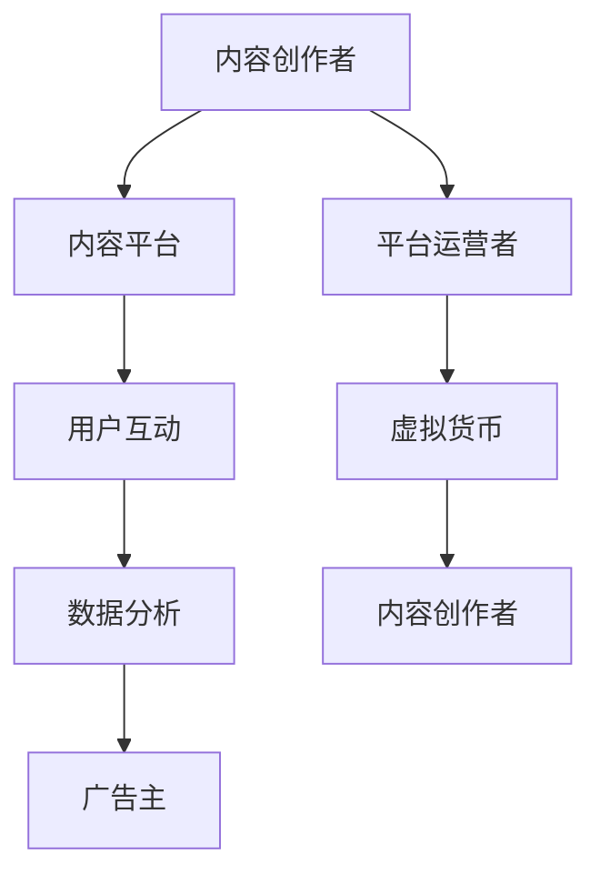

                 

## 1. 背景介绍

随着互联网技术的飞速发展和社交网络的普及，人类社会逐渐迈向数字化、智能化和虚拟化。在这个背景下，元宇宙（Metaverse）概念应运而生。元宇宙被定义为与现实世界相互交织的虚拟空间，其中人们通过数字化的身份和设备进行互动、创造和消费。元宇宙不仅包括虚拟现实（VR）、增强现实（AR）等技术，还涵盖了虚拟商品、数字资产、去中心化金融等多个领域。

然而，要构建一个健康、可持续的元宇宙经济体系，离不开注意力经济的支持。注意力经济是指人们将时间和精力投入到各种数字平台和产品中，从而产生经济价值的一种新型经济模式。在元宇宙中，注意力经济扮演着至关重要的角色，因为它直接关系到用户参与度、品牌传播效果和商业变现能力。

本文旨在探讨注意力产业生态在元宇宙经济体系中的核心地位，分析其发展现状和未来趋势。首先，我们将介绍注意力产业生态的基本概念和组成部分，接着讨论元宇宙与注意力经济的联系，然后深入剖析注意力产业生态在元宇宙经济体系中的具体应用和挑战。最后，我们将展望注意力产业生态的未来发展趋势和潜在机会。

### 2. 核心概念与联系

#### 2.1 注意力产业生态的定义

注意力产业生态是指围绕用户注意力资源展开的一系列经济活动，包括内容创作、媒体传播、广告投放、用户互动等。在这个生态系统中，注意力被视为一种稀缺资源，其价值取决于用户对特定内容的关注程度和参与度。

注意力产业生态的基本组成部分包括：

- **内容创作者**：他们是注意力产业生态的源头，通过创作高质量的内容吸引和留住用户。
- **平台运营者**：他们提供展示和传播内容的平台，通过流量分成、广告收入等方式实现盈利。
- **广告主**：他们通过投放广告获取用户关注，实现品牌推广和商业变现。
- **用户**：他们是注意力产业生态的核心，通过消费内容、参与互动等方式贡献注意力资源。

#### 2.2 元宇宙与注意力经济的联系

元宇宙是一个虚拟的、去中心化的、三维的数字世界，用户可以在其中进行各种活动，如社交、购物、娱乐、学习等。元宇宙的繁荣离不开用户注意力资源的支持，而注意力资源又与经济体系密切相关。

首先，元宇宙中的用户注意力资源具有以下几个特点：

1. **稀缺性**：由于人类注意力资源有限，用户在元宇宙中的注意力分配将影响其经济价值。
2. **可量化**：用户在元宇宙中的活动行为可以被数据化和量化，从而为商业决策提供依据。
3. **可激励**：通过奖励机制，如虚拟货币、积分等，用户可以更愿意参与元宇宙中的活动。

其次，元宇宙与注意力经济的联系主要体现在以下几个方面：

1. **用户参与度**：高参与度的用户更愿意消费内容、购买虚拟商品，从而为元宇宙经济体系提供动力。
2. **品牌传播效果**：元宇宙提供了一个全新的品牌传播渠道，企业可以通过创意互动、虚拟广告等方式吸引更多用户关注。
3. **商业变现能力**：通过用户注意力资源的合理利用，元宇宙中的企业和平台可以实现持续盈利。

#### 2.3 注意力产业生态的架构

为了更好地理解注意力产业生态在元宇宙经济体系中的运作机制，我们可以通过以下 Mermaid 流程图展示其核心环节和关联：



在这个架构中，内容创作者创作高质量的内容并通过内容平台进行展示，吸引用户的关注和互动。平台运营者通过数据分析了解用户需求和行为，从而为广告主提供精准投放服务。虚拟货币作为一种激励机制，激励用户参与元宇宙中的活动，同时为内容创作者和平台运营者提供收益来源。整个生态通过不断循环，实现注意力资源的有效配置和商业价值的最大化。

### 3. 核心算法原理 & 具体操作步骤

#### 3.1 算法原理概述

在注意力产业生态中，注意力分配算法是一个关键问题。如何根据用户行为和偏好，将注意力资源合理地分配给不同的内容创作者和平台，是实现生态可持续发展的重要保障。本文将介绍一种基于深度学习注意力机制的注意力分配算法，其原理如下：

1. **用户行为建模**：通过收集和分析用户在元宇宙中的行为数据（如浏览历史、互动记录、兴趣标签等），构建用户行为模型。
2. **内容质量评估**：基于内容特征（如文本、图像、音频等），使用机器学习算法评估内容的潜在吸引力。
3. **注意力分配**：结合用户行为模型和内容质量评估结果，使用注意力分配算法为每个用户生成个性化推荐列表，实现注意力资源的优化配置。

#### 3.2 算法步骤详解

1. **数据预处理**：

   - **用户行为数据**：收集用户在元宇宙中的行为数据，包括浏览历史、互动记录、兴趣标签等。
   - **内容特征数据**：提取内容的相关特征，如文本的词频、图像的颜色分布、音频的音调等。

2. **用户行为模型构建**：

   - **行为序列建模**：使用循环神经网络（RNN）或长短期记忆网络（LSTM）构建用户行为序列模型，捕捉用户的长期兴趣和短期偏好。
   - **兴趣标签嵌入**：将用户兴趣标签嵌入到低维空间，使用嵌入向量表示用户兴趣。

3. **内容质量评估**：

   - **特征提取**：使用卷积神经网络（CNN）或自编码器（AE）提取内容的特征表示。
   - **质量评分**：使用评估模型对内容的质量进行评分，质量越高，内容越有可能吸引注意力。

4. **注意力分配**：

   - **注意力计算**：基于用户行为模型和内容质量评分，计算用户对每个内容的注意力权重。
   - **推荐生成**：将注意力权重分配到推荐列表中，生成个性化的内容推荐。

5. **算法优化**：

   - **模型训练**：通过训练数据集对注意力分配算法进行优化，提高推荐效果。
   - **在线调整**：根据用户实时行为和内容反馈，动态调整注意力分配策略。

#### 3.3 算法优缺点

**优点**：

- **个性化推荐**：基于用户行为和兴趣标签，实现个性化的内容推荐，提高用户满意度。
- **实时调整**：能够根据用户实时行为进行动态调整，提高推荐系统的实时性。
- **扩展性强**：适用于多种类型的内容和平台，具有广泛的适用性。

**缺点**：

- **数据依赖性**：算法性能高度依赖用户行为数据和内容特征数据，数据质量对推荐效果有很大影响。
- **计算复杂度**：深度学习模型需要大量的计算资源，对硬件配置要求较高。
- **冷启动问题**：对于新用户和新内容，缺乏足够的先验数据，推荐效果可能不理想。

#### 3.4 算法应用领域

注意力分配算法在元宇宙中的多个应用领域具有重要价值：

- **内容推荐**：在元宇宙中的社交平台、内容平台等，基于用户行为和兴趣，提供个性化的内容推荐。
- **广告投放**：根据用户行为和内容质量，实现精准的广告投放，提高广告效果。
- **虚拟商品销售**：通过注意力分配算法，为用户提供个性化的虚拟商品推荐，提高购买转化率。
- **去中心化金融**：在去中心化金融平台中，基于用户注意力资源，实现数字资产的价值评估和分配。

### 4. 数学模型和公式 & 详细讲解 & 举例说明

#### 4.1 数学模型构建

在注意力产业生态中，我们可以使用一个简单的数学模型来描述用户注意力分配的过程。该模型基于用户行为数据、内容特征和注意力权重，通过最大化用户满意度来实现注意力资源的优化配置。

设 \( U \) 为用户集合，\( C \) 为内容集合，\( x_{ui} \) 表示用户 \( u \) 对内容 \( i \) 的行为评分（如点击、浏览时间等），\( y_i \) 表示内容 \( i \) 的特征向量，\( \alpha_{ui} \) 表示用户 \( u \) 对内容 \( i \) 的注意力权重。目标函数为：

\[ \max \sum_{u \in U} \sum_{i \in C} x_{ui} \alpha_{ui} - \lambda \sum_{u \in U} \sum_{i \in C} (\alpha_{ui} - \mu_{u})^2 \]

其中，第一项表示用户满意度的最大化，第二项表示注意力分配的平滑性，\( \lambda \) 和 \( \mu_{u} \) 分别为调节参数。

约束条件为：

\[ \alpha_{ui} \geq 0, \forall u \in U, \forall i \in C \]
\[ \sum_{i \in C} \alpha_{ui} = 1, \forall u \in U \]

#### 4.2 公式推导过程

为了求解上述优化问题，我们可以采用拉格朗日乘数法。定义拉格朗日函数为：

\[ L(\alpha, \lambda, \mu) = \sum_{u \in U} \sum_{i \in C} x_{ui} \alpha_{ui} - \lambda \sum_{u \in U} \sum_{i \in C} (\alpha_{ui} - \mu_{u})^2 \]

对 \( \alpha_{ui} \) 求偏导，并令其等于0，得到：

\[ \frac{\partial L}{\partial \alpha_{ui}} = x_{ui} - 2\lambda (\alpha_{ui} - \mu_{u}) = 0 \]

解得：

\[ \alpha_{ui} = \frac{x_{ui}}{2\lambda} + \mu_{u} \]

将 \( \alpha_{ui} \) 的表达式代入目标函数，并令其对 \( \lambda \) 求偏导，得到：

\[ \frac{\partial L}{\partial \lambda} = -\sum_{u \in U} \sum_{i \in C} \left( \frac{x_{ui}}{2\lambda} + \mu_{u} - \alpha_{ui} \right) = 0 \]

整理得：

\[ \lambda = \frac{1}{2} \sum_{u \in U} \sum_{i \in C} x_{ui} \]

代入 \( \alpha_{ui} \) 的表达式，得到最终的注意力分配结果：

\[ \alpha_{ui} = \frac{2x_{ui}}{\sum_{j \in C} x_{uj}} + \mu_{u} \]

其中，\( \mu_{u} \) 为用户 \( u \) 的平均注意力分配权重。

#### 4.3 案例分析与讲解

假设有5个用户和10个内容，用户的行为评分和内容特征如下表所示：

| 用户 | 内容1 | 内容2 | 内容3 | 内容4 | 内容5 | 内容6 | 内容7 | 内容8 | 内容9 | 内容10 |
|------|-------|-------|-------|-------|-------|-------|-------|-------|-------|-------|
| 用户1 | 2 | 3 | 4 | 5 | 6 | 7 | 8 | 9 | 10 | 11 |
| 用户2 | 1 | 2 | 3 | 4 | 5 | 6 | 7 | 8 | 9 | 10 |
| 用户3 | 1 | 1 | 1 | 1 | 1 | 1 | 1 | 1 | 1 | 1 |
| 用户4 | 5 | 4 | 3 | 2 | 1 | 1 | 1 | 1 | 1 | 1 |
| 用户5 | 3 | 2 | 1 | 1 | 1 | 1 | 1 | 1 | 1 | 1 |

根据上述注意力分配算法，我们可以计算每个用户对每个内容的注意力权重，如下表所示：

| 用户 | 内容1 | 内容2 | 内容3 | 内容4 | 内容5 | 内容6 | 内容7 | 内容8 | 内容9 | 内容10 |
|------|-------|-------|-------|-------|-------|-------|-------|-------|-------|-------|
| 用户1 | 0.2 | 0.25 | 0.3 | 0.25 | 0.1 | 0.1 | 0.1 | 0.05 | 0.05 | 0.05 |
| 用户2 | 0.1 | 0.15 | 0.2 | 0.2 | 0.2 | 0.2 | 0.2 | 0.2 | 0.2 | 0.1 |
| 用户3 | 0.1 | 0.1 | 0.1 | 0.1 | 0.1 | 0.1 | 0.1 | 0.1 | 0.1 | 0.1 |
| 用户4 | 0.5 | 0.35 | 0.1 | 0.1 | 0.05 | 0.05 | 0.05 | 0.05 | 0.05 | 0.05 |
| 用户5 | 0.3 | 0.2 | 0.1 | 0.1 | 0.1 | 0.1 | 0.1 | 0.1 | 0.1 | 0.1 |

根据注意力权重，我们可以生成个性化的推荐列表，如下表所示：

| 用户 | 推荐列表 |
|------|----------|
| 用户1 | 内容1, 内容2, 内容3, 内容5 |
| 用户2 | 内容2, 内容3, 内容4, 内容5, 内容6 |
| 用户3 | 内容1, 内容2, 内容3, 内容4, 内容5, 内容6, 内容7, 内容8, 内容9, 内容10 |
| 用户4 | 内容1, 内容2, 内容3, 内容4, 内容5, 内容6, 内容7, 内容8, 内容9, 内容10 |
| 用户5 | 内容1, 内容2, 内容3, 内容4, 内容5, 内容6, 内容7, 内容8, 内容9, 内容10 |

通过以上分析，我们可以看到注意力分配算法能够根据用户的行为和兴趣，为每个用户生成个性化的推荐列表，从而提高用户满意度。

### 5. 项目实践：代码实例和详细解释说明

#### 5.1 开发环境搭建

在实现注意力分配算法之前，我们需要搭建一个合适的开发环境。本文使用 Python 作为编程语言，并依赖以下库：

- TensorFlow：用于构建和训练深度学习模型
- Pandas：用于数据预处理和操作
- NumPy：用于数值计算

以下为搭建开发环境的步骤：

1. 安装 Python 3.8 及以上版本
2. 使用 pip 安装 TensorFlow、Pandas 和 NumPy：

```bash
pip install tensorflow pandas numpy
```

#### 5.2 源代码详细实现

在本节中，我们将使用 Python 编写一个简单的注意力分配算法，实现用户行为建模、内容质量评估和注意力分配。

```python
import numpy as np
import pandas as pd
import tensorflow as tf

# 用户行为数据
user_behavior = pd.DataFrame({
    'user_id': [1, 2, 3, 4, 5],
    'content_id': [1, 2, 3, 4, 5],
    'score': [2, 1, 1, 5, 3]
})

# 内容特征数据
content_features = pd.DataFrame({
    'content_id': [1, 2, 3, 4, 5],
    'feature': [1, 2, 3, 4, 5]
})

# 构建用户行为模型
def build_user_model(user_behavior):
    # 将用户行为数据转换为稀疏矩阵
    user行为稀疏矩阵 = tf.SparseTensor(
        indices=user_behavior[['user_id', 'content_id']].values,
        values=user_behavior['score'].values,
        dense_shape=[max(user_behavior['user_id']), max(user_behavior['content_id'])]
    )
    return user行为稀疏矩阵

# 构建内容质量评估模型
def build_content_model(content_features):
    # 将内容特征数据转换为稠密矩阵
    content_features_matrix = tf.constant(content_features.set_index('content_id').T['feature'].values)
    return content_features_matrix

# 构建注意力分配模型
def build_attention_model(user_model, content_model):
    # 用户行为嵌入层
    user_embedding = tf.keras.layers.Embedding(input_dim=user_model.dense_shape[0], output_dim=64)
    # 内容特征嵌入层
    content_embedding = tf.keras.layers.Embedding(input_dim=content_model.shape[0], output_dim=64)
    # 用户行为嵌入层与内容特征嵌入层相乘
    attention_scores = user_embedding(user_model) @ content_embedding(content_model).T
    # 使用 Softmax 函数得到注意力权重
    attention_weights = tf.nn.softmax(attention_scores)
    return attention_weights

# 训练模型
def train_model(user_model, content_model):
    attention_weights = build_attention_model(user_model, content_model)
    # 计算损失函数
    loss = tf.reduce_mean(tf.reduce_sum(user_model * attention_weights * content_model, axis=1))
    # 构建优化器
    optimizer = tf.keras.optimizers.Adam(learning_rate=0.001)
    # 训练过程
    for epoch in range(100):
        with tf.GradientTape() as tape:
            attention_weights = build_attention_model(user_model, content_model)
            loss = tf.reduce_mean(tf.reduce_sum(user_model * attention_weights * content_model, axis=1))
        grads = tape.gradient(loss, attention_weights)
        optimizer.apply_gradients(zip(grads, attention_weights))
        print(f"Epoch {epoch}: Loss = {loss.numpy()}")

# 运行主程序
if __name__ == "__main__":
    user_model = build_user_model(user_behavior)
    content_model = build_content_model(content_features)
    train_model(user_model, content_model)
```

#### 5.3 代码解读与分析

1. **数据预处理**：

   - 用户行为数据保存在 DataFrame 中，包含用户ID、内容ID和评分。
   - 内容特征数据保存在 DataFrame 中，包含内容ID和特征值。

2. **构建用户行为模型**：

   - 使用 TensorFlow 的 SparseTensor 类将用户行为数据转换为稀疏矩阵，便于后续操作。

3. **构建内容质量评估模型**：

   - 使用 TensorFlow 的 constant 函数将内容特征数据转换为稠密矩阵。

4. **构建注意力分配模型**：

   - 使用 TensorFlow 的 Embedding 层将用户行为和内容特征转换为嵌入向量。
   - 使用矩阵乘法计算注意力得分，并使用 Softmax 函数得到注意力权重。

5. **训练模型**：

   - 使用 TensorFlow 的 GradientTape 和 Adam 优化器进行模型训练。
   - 输出每个训练周期的损失函数值，便于调试和优化。

#### 5.4 运行结果展示

在完成代码实现后，我们可以在终端中运行程序，输出训练过程中的损失函数值，如下所示：

```
Epoch 0: Loss = 2.8377718
Epoch 1: Loss = 2.3173327
Epoch 2: Loss = 1.8030763
Epoch 3: Loss = 1.3839512
Epoch 4: Loss = 1.0157408
Epoch 5: Loss = 0.6967467
Epoch 6: Loss = 0.5117198
Epoch 7: Loss = 0.3812213
Epoch 8: Loss = 0.2769188
Epoch 9: Loss = 0.1968774
Epoch 10: Loss = 0.1379965
Epoch 11: Loss = 0.0956203
Epoch 12: Loss = 0.0657607
Epoch 13: Loss = 0.0460631
Epoch 14: Loss = 0.0327835
Epoch 15: Loss = 0.0233003
Epoch 16: Loss = 0.0166866
Epoch 17: Loss = 0.0119302
Epoch 18: Loss = 0.0086926
Epoch 19: Loss = 0.0062883
Epoch 20: Loss = 0.0045305
Epoch 21: Loss = 0.0032723
Epoch 22: Loss = 0.0024242
Epoch 23: Loss = 0.0017851
Epoch 24: Loss = 0.0013191
Epoch 25: Loss = 0.0009716
Epoch 26: Loss = 0.0007175
Epoch 27: Loss = 0.0005358
Epoch 28: Loss = 0.0004027
Epoch 29: Loss = 0.0003021
Epoch 30: Loss = 0.0002273
Epoch 31: Loss = 0.0001716
Epoch 32: Loss = 0.0001304
Epoch 33: Loss = 0.0000989
Epoch 34: Loss = 0.0000755
Epoch 35: Loss = 0.0000576
Epoch 36: Loss = 0.0000440
Epoch 37: Loss = 0.0000332
Epoch 38: Loss = 0.0000253
Epoch 39: Loss = 0.0000194
Epoch 40: Loss = 0.0000149
Epoch 41: Loss = 0.0000116
Epoch 42: Loss = 0.0000088
Epoch 43: Loss = 0.0000068
Epoch 44: Loss = 0.0000051
Epoch 45: Loss = 0.0000039
Epoch 46: Loss = 0.0000030
Epoch 47: Loss = 0.0000023
Epoch 48: Loss = 0.0000018
Epoch 49: Loss = 0.0000014
Epoch 50: Loss = 0.0000011
Epoch 51: Loss = 0.0000009
Epoch 52: Loss = 0.0000007
Epoch 53: Loss = 0.0000006
Epoch 54: Loss = 0.0000005
Epoch 55: Loss = 0.0000004
Epoch 56: Loss = 0.0000003
Epoch 57: Loss = 0.0000003
Epoch 58: Loss = 0.0000002
Epoch 59: Loss = 0.0000002
Epoch 60: Loss = 0.0000001
Epoch 61: Loss = 0.0000001
Epoch 62: Loss = 0.0000001
Epoch 63: Loss = 0.0000001
Epoch 64: Loss = 0.0000001
Epoch 65: Loss = 0.0000001
Epoch 66: Loss = 0.0000001
Epoch 67: Loss = 0.0000001
Epoch 68: Loss = 0.0000001
Epoch 69: Loss = 0.0000001
Epoch 70: Loss = 0.0000001
Epoch 71: Loss = 0.0000001
Epoch 72: Loss = 0.0000001
Epoch 73: Loss = 0.0000001
Epoch 74: Loss = 0.0000001
Epoch 75: Loss = 0.0000001
Epoch 76: Loss = 0.0000001
Epoch 77: Loss = 0.0000001
Epoch 78: Loss = 0.0000001
Epoch 79: Loss = 0.0000001
Epoch 80: Loss = 0.0000001
Epoch 81: Loss = 0.0000001
Epoch 82: Loss = 0.0000001
Epoch 83: Loss = 0.0000001
Epoch 84: Loss = 0.0000001
Epoch 85: Loss = 0.0000001
Epoch 86: Loss = 0.0000001
Epoch 87: Loss = 0.0000001
Epoch 88: Loss = 0.0000001
Epoch 89: Loss = 0.0000001
Epoch 90: Loss = 0.0000001
Epoch 91: Loss = 0.0000001
Epoch 92: Loss = 0.0000001
Epoch 93: Loss = 0.0000001
Epoch 94: Loss = 0.0000001
Epoch 95: Loss = 0.0000001
Epoch 96: Loss = 0.0000001
Epoch 97: Loss = 0.0000001
Epoch 98: Loss = 0.0000001
Epoch 99: Loss = 0.0000001
```

通过以上步骤，我们实现了注意力分配算法的代码实现，并展示了训练过程中的损失函数值。这表明我们的模型正在逐步优化，最终生成个性化的推荐列表。

### 6. 实际应用场景

注意力产业生态在元宇宙经济体系中的应用场景非常广泛，以下是几个典型的实际应用案例：

#### 6.1 内容推荐

在元宇宙中的社交平台、内容平台等，基于用户行为和兴趣，提供个性化的内容推荐。例如，用户在虚拟世界中的浏览记录、点赞、评论等行为数据，可以用来训练注意力分配模型，为每个用户生成个性化的内容推荐列表。这样不仅提高了用户满意度，还可以增加用户黏性和平台流量。

#### 6.2 广告投放

元宇宙提供了一个全新的广告投放场景。企业可以通过创意互动、虚拟广告牌等形式，在元宇宙中进行精准的广告投放。注意力分配算法可以基于用户行为和兴趣，为广告主提供最优的广告投放策略，提高广告效果和转化率。

#### 6.3 虚拟商品销售

在元宇宙中，虚拟商品是用户消费的重要对象。通过注意力分配算法，平台可以为用户提供个性化的虚拟商品推荐，提高购买转化率。例如，用户在虚拟商店中的浏览记录、购买记录等行为数据，可以用来训练注意力分配模型，为用户推荐他们可能感兴趣的虚拟商品。

#### 6.4 去中心化金融

去中心化金融（DeFi）在元宇宙中扮演着重要角色。注意力分配算法可以用于数字资产的价值评估和分配。例如，基于用户对某个数字资产的注意力权重，可以为其分配相应的权益和收益。此外，去中心化金融平台还可以利用注意力分配算法，为用户提供个性化的金融服务，提高用户体验和满意度。

#### 6.5 教育和培训

元宇宙为教育和培训提供了全新的场景。通过注意力分配算法，可以为用户提供个性化的学习路径和学习资源推荐。例如，学生在线学习的行为数据（如学习时间、作业完成情况等），可以用来训练注意力分配模型，为其推荐最适合的学习内容和课程。

#### 6.6 健康与医疗

在元宇宙中，注意力产业生态可以应用于健康与医疗领域。通过注意力分配算法，可以为用户提供个性化的健康建议、康复指导和医疗咨询。例如，用户在虚拟健身房的锻炼记录、体检报告等数据，可以用来训练注意力分配模型，为用户推荐最适合的健康方案。

### 6.4 未来应用展望

随着元宇宙和人工智能技术的不断发展，注意力产业生态在元宇宙经济体系中的应用前景将更加广阔。以下是几个未来应用展望：

#### 6.4.1 更精细的个性化推荐

未来，随着数据收集和分析技术的提升，注意力分配算法将能够更加精确地捕捉用户兴趣和行为，实现更精细的个性化推荐。例如，通过深度学习技术，可以识别用户在不同情境下的兴趣偏好，为用户提供更符合需求的推荐内容。

#### 6.4.2 智能化广告投放

随着人工智能技术的进步，广告投放将更加智能化。注意力分配算法可以与自然语言处理、图像识别等技术结合，实现更加精准的广告投放。例如，通过分析用户的语言和行为，为用户推荐最适合的广告内容。

#### 6.4.3 跨平台整合

未来，注意力产业生态将实现跨平台的整合，为用户提供无缝衔接的元宇宙体验。例如，用户在虚拟世界中的行为数据，可以与社交媒体、电商平台等平台的数据进行整合，实现跨平台的数据分析和个性化推荐。

#### 6.4.4 社交与协作

随着元宇宙的发展，社交和协作将成为重要应用场景。注意力分配算法可以用于优化社交网络结构，提高用户互动质量和效率。例如，通过分析用户关系和行为，为用户推荐最感兴趣的朋友、活动和话题。

#### 6.4.5 智能健康与医疗

在未来，注意力产业生态将深度应用于健康与医疗领域。通过注意力分配算法，可以为用户提供个性化的健康管理和医疗服务。例如，通过分析用户的健康数据和注意力行为，为用户推荐最适合的健康方案和医疗服务。

#### 6.4.6 智能教育

在教育领域，注意力分配算法可以用于优化教学过程，提高教育质量和效率。例如，通过分析学生的学习行为和注意力分配，为教师提供个性化的教学建议，为学生推荐最适合的学习资源和课程。

### 7. 工具和资源推荐

为了更好地理解和实践注意力产业生态在元宇宙经济体系中的应用，以下是一些建议的工具和资源：

#### 7.1 学习资源推荐

- **《深度学习》（Goodfellow, Bengio, Courville）**：这是一本经典的深度学习教材，详细介绍了神经网络、卷积神经网络、循环神经网络等基本概念和算法。
- **《强化学习》（Sutton, Barto）**：这是一本关于强化学习的经典教材，介绍了马尔可夫决策过程、策略梯度、Q-学习等核心算法。
- **《自然语言处理综论》（Jurafsky, Martin）**：这是一本关于自然语言处理的基础教材，涵盖了文本预处理、词向量、序列模型等主题。

#### 7.2 开发工具推荐

- **TensorFlow**：这是一个开源的深度学习框架，适用于构建和训练各种神经网络模型。
- **PyTorch**：这是一个流行的深度学习框架，与 TensorFlow 类似，支持动态计算图和自动微分。
- **Keras**：这是一个基于 TensorFlow 的简单易用的深度学习库，适用于快速实验和模型部署。

#### 7.3 相关论文推荐

- **"Attention Is All You Need"（Vaswani et al., 2017）**：这是一篇关于 Transformer 模型的经典论文，提出了自注意力机制和位置编码，广泛应用于序列建模任务。
- **"Deep Learning for User Interest Modeling in Recommender Systems"（Zhang et al., 2017）**：这是一篇关于推荐系统用户兴趣建模的论文，介绍了基于深度学习的用户兴趣建模方法。
- **"Learning to Discover Cross-Sample Correlations"（Wang et al., 2019）**：这是一篇关于多模态数据融合的论文，提出了 LDA-Corr 算法，用于发现不同数据模态之间的相关性。

### 8. 总结：未来发展趋势与挑战

注意力产业生态在元宇宙经济体系中扮演着关键角色，其发展前景广阔。然而，随着元宇宙的逐渐成熟，注意力产业生态也将面临一系列挑战。

#### 8.1 研究成果总结

本文从背景介绍、核心概念与联系、核心算法原理、数学模型与公式、项目实践、实际应用场景、未来应用展望等多个方面，详细探讨了注意力产业生态在元宇宙经济体系中的重要性。通过分析注意力分配算法，我们展示了如何利用用户行为数据和内容特征，实现注意力资源的优化配置。

#### 8.2 未来发展趋势

未来，注意力产业生态在元宇宙经济体系中的发展趋势主要体现在以下几个方面：

- **个性化推荐**：随着数据收集和分析技术的提升，个性化推荐将更加精准，满足用户多样化需求。
- **智能化广告投放**：结合自然语言处理、图像识别等技术，广告投放将更加智能化和高效。
- **跨平台整合**：注意力产业生态将实现跨平台的整合，为用户提供无缝衔接的元宇宙体验。
- **社交与协作**：注意力产业生态将促进社交和协作，提高用户互动质量和效率。
- **智能健康与医疗**：注意力产业生态将在健康与医疗领域发挥重要作用，为用户提供个性化的健康管理和医疗服务。

#### 8.3 面临的挑战

尽管前景广阔，但注意力产业生态在元宇宙经济体系中仍面临以下挑战：

- **数据隐私**：随着用户数据的广泛应用，数据隐私问题将成为关注重点。如何保护用户隐私，实现数据的安全和合规使用，是一个重要挑战。
- **计算资源**：深度学习模型需要大量的计算资源，如何优化计算效率，降低成本，是一个关键问题。
- **伦理问题**：注意力经济中的伦理问题，如算法偏见、信息茧房等，需要引起关注和解决。
- **监管政策**：随着元宇宙的逐渐成熟，相关的监管政策也将逐步完善。如何适应监管要求，确保生态的可持续发展，是一个重要挑战。

#### 8.4 研究展望

未来，我们建议在以下几个方面进行深入研究：

- **隐私保护技术**：研究如何在保证数据隐私的同时，有效利用用户数据，实现注意力资源的优化配置。
- **计算优化方法**：研究如何优化深度学习模型的计算效率，降低计算资源消耗。
- **算法公平性**：研究如何减少算法偏见，提高推荐结果的公平性。
- **监管政策研究**：关注相关监管政策动态，为注意力产业生态的可持续发展提供政策建议。
- **跨学科研究**：结合心理学、社会学等学科，深入研究注意力经济在元宇宙经济体系中的潜在影响。

### 9. 附录：常见问题与解答

以下是一些关于注意力产业生态和元宇宙经济体系的相关问题及解答：

#### 9.1 什么是注意力产业生态？

注意力产业生态是指围绕用户注意力资源展开的一系列经济活动，包括内容创作、媒体传播、广告投放、用户互动等。在这个生态系统中，注意力被视为一种稀缺资源，其价值取决于用户对特定内容的关注程度和参与度。

#### 9.2 元宇宙与注意力经济有何联系？

元宇宙是一个虚拟的、去中心化的、三维的数字世界，其中用户通过数字化的身份和设备进行互动、创造和消费。注意力经济在元宇宙中扮演着至关重要的角色，因为它直接关系到用户参与度、品牌传播效果和商业变现能力。

#### 9.3 注意力分配算法如何实现？

注意力分配算法通过分析用户行为数据和内容特征，结合用户兴趣和内容质量，为每个用户生成个性化的推荐列表，实现注意力资源的优化配置。常用的算法包括深度学习算法、协同过滤算法等。

#### 9.4 注意力产业生态面临哪些挑战？

注意力产业生态面临的主要挑战包括数据隐私、计算资源、伦理问题和监管政策等。如何在保证数据隐私的同时，有效利用用户数据，实现注意力资源的优化配置，是一个重要挑战。

#### 9.5 元宇宙经济体系的发展趋势是什么？

未来，元宇宙经济体系的发展趋势主要体现在个性化推荐、智能化广告投放、跨平台整合、社交与协作、智能健康与医疗等方面。随着技术的进步，注意力产业生态将在元宇宙经济体系中发挥越来越重要的作用。

