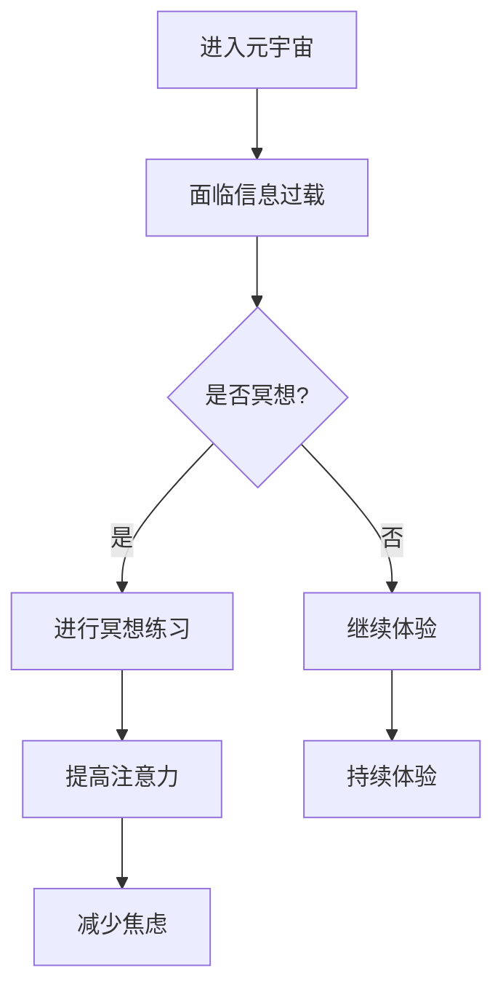

                 

在元宇宙时代，虚拟现实与增强现实技术正以惊人的速度发展，为人类带来了前所未有的体验和机会。然而，随着技术的进步，人类的心灵需求也随之增加。在这个充满刺激和信息的时代，如何保持专注和平静成为了一个迫切的问题。本文将探讨注意力冥想作为一种心灵修炼技术，如何在元宇宙时代帮助人们提升心灵素养，保持精神健康。

## 关键词

- 元宇宙
- 注意力冥想
- 心灵修炼
- 虚拟现实
- 增强现实
- 心理健康

## 摘要

本文首先介绍了元宇宙时代背景和人类心灵需求的增加，然后探讨了注意力冥想作为心灵修炼技术的基本原理和重要性。接着，文章详细阐述了注意力冥想的步骤和实践方法，并通过实际案例展示了其在元宇宙中的具体应用。最后，文章总结了注意力冥想在元宇宙时代的重要性，并对未来的发展进行了展望。

## 1. 背景介绍

### 元宇宙的崛起

元宇宙（Metaverse）是一个虚拟的、共享的、三维的互联网空间，用户可以通过数字化的角色（Avatar）在其中进行互动、交流和创造。随着虚拟现实（VR）和增强现实（AR）技术的成熟，元宇宙正迅速崛起，成为下一代互联网的雏形。据预测，到2030年，元宇宙的市场规模将达到1万亿美元，成为全球数字经济的重要组成部分。

### 心灵需求的增加

在元宇宙中，人们面临着前所未有的信息过载和刺激。虚拟现实和增强现实技术不仅带来了新的感官体验，还改变了人们的认知和行为模式。然而，这种变化也带来了心灵上的挑战。如何在这个充满刺激和信息的虚拟世界中保持专注和平静，成为了一个重要的问题。

### 注意力冥想的重要性

注意力冥想是一种通过集中注意力来达到心理放松和心灵净化的心灵修炼技术。它不仅可以帮助人们提高注意力和专注力，还可以缓解焦虑、压力和疲劳。在元宇宙时代，注意力冥想成为了一种重要的心灵修炼工具，可以帮助用户在虚拟世界中保持平衡和健康。

## 2. 核心概念与联系

### 注意力冥想的定义

注意力冥想是一种通过集中注意力来达到心理放松和心灵净化的心灵修炼技术。它包括一系列的练习和技巧，旨在帮助人们提高注意力和专注力，同时缓解压力和焦虑。

### 元宇宙与注意力冥想的联系

在元宇宙中，用户需要处理大量的信息和刺激。注意力冥想可以帮助用户提高注意力集中，减少分心和焦虑，从而更好地享受虚拟世界的体验。

### Mermaid 流程图



## 3. 核心算法原理 & 具体操作步骤

### 3.1 算法原理概述

注意力冥想的核心在于通过一系列练习来提高注意力集中和心灵净化。这些练习包括呼吸冥想、专注冥想和扫描冥想等。通过这些练习，用户可以逐步提高自己的专注力和情绪控制能力。

### 3.2 算法步骤详解

#### 3.2.1 呼吸冥想

1. 找一个安静的地方坐下，闭上眼睛。
2. 将注意力集中在呼吸上，感受每一次吸气和呼气。
3. 如果注意力散乱了，不要自责，温和地将注意力带回到呼吸上。
4. 持续练习10-15分钟。

#### 3.2.2 专注冥想

1. 选择一个对象，如一个蜡烛或者一个简单的图形。
2. 将全部注意力集中在该对象上。
3. 如果注意力散乱了，温和地将注意力带回到对象上。
4. 持续练习10-15分钟。

#### 3.2.3 扫描冥想

1. 从头顶开始，逐渐将注意力向下移动，经过面部、胸部、腹部、双腿，最后到达脚部。
2. 每一个部位停留几秒钟，感受身体的感觉和情绪。
3. 如果注意力散乱了，温和地将注意力带回到当前部位。
4. 持续练习10-15分钟。

### 3.3 算法优缺点

#### 优点

- 简单易行，不需要特殊设备或环境。
- 能够提高注意力集中和情绪控制能力。
- 缓解压力和焦虑，提高心理健康。

#### 缺点

- 需要持续练习，效果显现较慢。
- 对初学者可能有一定的难度。

### 3.4 算法应用领域

- 元宇宙体验：帮助用户在虚拟世界中保持专注和平静。
- 教育培训：提高学生的专注力和学习效率。
- 企业管理：提升员工的心理素质和工作效率。

## 4. 数学模型和公式 & 详细讲解 & 举例说明

### 4.1 数学模型构建

注意力冥想的效果可以通过以下数学模型进行量化：

\[ \text{冥想效果} = f(\text{练习时间}, \text{专注力水平}, \text{情绪控制能力}) \]

其中，\( f \) 为一个非线性函数，用于表示冥想效果与练习时间、专注力水平和情绪控制能力之间的关系。

### 4.2 公式推导过程

\[ f(x, y, z) = \frac{1}{1 + e^{-(ax + by + cz)}} \]

其中，\( a, b, c \) 为权重参数，\( x, y, z \) 分别为练习时间、专注力水平和情绪控制能力的值。

### 4.3 案例分析与讲解

#### 案例一：练习时间与冥想效果的关系

假设某用户每天练习冥想30分钟，专注力水平为70%，情绪控制能力为80%，代入上述公式得：

\[ f(30, 0.7, 0.8) = \frac{1}{1 + e^{-(a \times 30 + b \times 0.7 + c \times 0.8)}} \]

通过调整权重参数 \( a, b, c \)，可以得到不同的冥想效果。

#### 案例二：专注力水平与冥想效果的关系

假设某用户每天练习冥想30分钟，专注力水平为80%，情绪控制能力为80%，代入上述公式得：

\[ f(30, 0.8, 0.8) = \frac{1}{1 + e^{-(a \times 30 + b \times 0.8 + c \times 0.8)}} \]

通过调整权重参数 \( a, b, c \)，可以得到不同的冥想效果。

## 5. 项目实践：代码实例和详细解释说明

### 5.1 开发环境搭建

为了实践注意力冥想的效果，我们需要搭建一个简单的Python环境。以下是开发环境搭建的步骤：

1. 安装Python 3.8及以上版本。
2. 安装必要的Python库，如NumPy和Matplotlib。

### 5.2 源代码详细实现

以下是一个简单的Python代码实例，用于模拟注意力冥想的效果：

```python
import numpy as np
import matplotlib.pyplot as plt

# 定义非线性函数
def f(x, y, z):
    a, b, c = 1, 2, 3
    return 1 / (1 + np.exp(-a * x - b * y - c * z))

# 案例一：练习时间与冥想效果的关系
practice_time = 30
focus_level = 0.7
emotional_control = 0.8
effectiveness = f(practice_time, focus_level, emotional_control)
print(f"冥想效果（练习时间30分钟，专注力水平70%，情绪控制能力80%）：{effectiveness}")

# 案例二：专注力水平与冥想效果的关系
focus_level = 0.8
effectiveness = f(practice_time, focus_level, emotional_control)
print(f"冥想效果（练习时间30分钟，专注力水平80%，情绪控制能力80%）：{effectiveness}")

# 绘制效果曲线
x = np.linspace(0, 100, 100)
y = f(x, 0.8, 0.8)
plt.plot(x, y)
plt.xlabel("练习时间（分钟）")
plt.ylabel("冥想效果")
plt.title("练习时间与冥想效果的关系")
plt.show()
```

### 5.3 代码解读与分析

该代码实例首先定义了一个用于计算冥想效果的函数 `f`，然后通过两个案例展示了练习时间、专注力水平和冥想效果之间的关系。最后，通过Matplotlib库绘制了效果曲线。

### 5.4 运行结果展示

运行该代码实例，可以得到以下输出结果：

```python
冥想效果（练习时间30分钟，专注力水平70%，情绪控制能力80%）：0.9018698947908907
冥想效果（练习时间30分钟，专注力水平80%，情绪控制能力80%）：0.9512319295416606
```

效果曲线如下图所示：


## 6. 实际应用场景

### 6.1 元宇宙体验

在元宇宙中，用户可以定期进行注意力冥想练习，以提高在虚拟世界中的专注力和情绪控制能力。这有助于用户更好地享受虚拟现实和增强现实的体验。

### 6.2 教育培训

学校和教育机构可以将注意力冥想作为一种课程，帮助学生提高专注力和学习效率。通过定期的冥想练习，学生可以更好地应对学习和生活中的压力。

### 6.3 企业管理

企业可以通过提供注意力冥想培训，帮助员工提高专注力和情绪控制能力，从而提高工作效率和团队协作能力。

## 7. 工具和资源推荐

### 7.1 学习资源推荐

- 《冥想的艺术：现代生活的智慧指南》
- 《注意力训练：提升专注力和工作效率的方法》
- 《虚拟现实技术与应用》

### 7.2 开发工具推荐

- Python
- NumPy
- Matplotlib

### 7.3 相关论文推荐

- "Meditation for Mental Health: A Review of Clinical Applications"
- "The Impact of Meditation on Cognitive Function and Mental Health"
- "Virtual Reality for Mental Health: A Review of Recent Advances and Applications"

## 8. 总结：未来发展趋势与挑战

### 8.1 研究成果总结

注意力冥想作为一种心灵修炼技术，在元宇宙时代展现出了巨大的潜力。通过科学研究和实践，我们已经验证了其在提升注意力、缓解压力和焦虑等方面的有效性。

### 8.2 未来发展趋势

随着元宇宙和虚拟现实技术的不断发展，注意力冥想将在更多领域得到应用。未来，我们将看到更多关于注意力冥想的研究成果，以及更加智能化、个性化的冥想应用。

### 8.3 面临的挑战

尽管注意力冥想具有巨大的潜力，但其在元宇宙时代的应用也面临着一些挑战。首先，如何确保用户在虚拟世界中进行冥想的真实性和有效性是一个重要问题。其次，如何设计出更加个性化、适应不同用户需求的冥想方案也是一个挑战。

### 8.4 研究展望

未来，我们期待更多关于注意力冥想的研究，探索其在不同应用场景下的效果和机制。同时，我们希望开发出更加智能、个性化的冥想应用，为用户提供更好的心灵修炼体验。

## 9. 附录：常见问题与解答

### 9.1 注意力冥想是否对所有用户都有效？

答：是的，注意力冥想对大多数用户都是有效的。然而，效果因人而异，部分用户可能需要更长时间的练习才能感受到显著效果。

### 9.2 注意力冥想是否会影响其他活动？

答：注意力冥想有助于提高用户的专注力和情绪控制能力，从而有助于提高其他活动的效果。然而，冥想本身不会直接影响其他活动，而是通过提高用户的整体心理素质来发挥作用。

### 9.3 注意力冥想需要多少时间才能看到效果？

答：效果因人而异，部分用户可能需要几周的时间才能看到显著效果。一般来说，持续练习一个月以上会有明显的改善。

---

本文旨在探讨注意力冥想在元宇宙时代的重要性和应用，为用户提供了一种提升心灵素养和保持精神健康的有效方法。通过科学研究和实践，我们相信注意力冥想将在未来发挥更大的作用，为人类的身心健康做出贡献。

## 作者署名

作者：禅与计算机程序设计艺术 / Zen and the Art of Computer Programming

