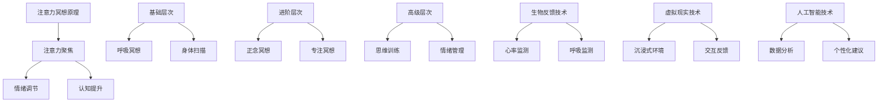

                 

关键词：注意力冥想，元宇宙，心灵修炼，人工智能，技术，冥想技巧，认知提升，情绪管理

> 摘要：本文将探讨在元宇宙时代背景下，注意力冥想在心灵修炼中的作用，以及如何运用先进的技术手段提升个体在虚拟世界中的注意力和认知能力。文章将结合最新的研究成果，详细介绍注意力冥想的原理、实践方法、以及相关的数学模型和实际应用案例，为读者提供一份全面的指南。

## 1. 背景介绍

在元宇宙的飞速发展中，人类的数字生活日益丰富，随之而来的挑战也愈加严峻。一方面，元宇宙提供了前所未有的互动和创造空间，为人类带来了无限的可能性；另一方面，长时间的数字沉浸和快节奏的信息处理，也给人们的心理健康带来了巨大的压力。特别是在注意力分散和情绪管理方面，越来越多的研究表明，这些现象对个体的认知功能和社会交往产生了显著的负面影响。

### 注意力的重要性

注意力是人类心智活动中不可或缺的一部分。它不仅影响我们的学习和工作效率，还关系到我们的情感状态和心理健康。在元宇宙时代，个体需要面对海量的信息和多样的虚拟体验，因此如何有效地管理和分配注意力，成为一个亟待解决的问题。

### 心灵修炼的必要性

心灵修炼，尤其是注意力冥想，是一种古老而有效的心理健康维护方法。通过冥想，个体可以学会如何控制自己的注意力，减少心理压力，提升情绪调节能力。在元宇宙时代，这种修炼方式的意义更加凸显，因为它能够帮助人们更好地适应虚拟环境，提高认知能力和工作效率。

## 2. 核心概念与联系

为了更好地理解注意力冥想在元宇宙时代的作用，我们需要从概念层面探讨其原理、架构和关键技术。

### 注意力冥想的原理

注意力冥想主要通过训练个体的注意力聚焦能力，达到提高注意力和认知水平的目的。其核心原理包括以下几个方面：

1. **注意力聚焦**：通过专注于一个特定的对象（如呼吸、声音、视觉图像等），个体可以减少对其他信息的干扰，从而提升注意力的集中程度。
2. **情绪调节**：注意力冥想有助于个体观察和调节自己的情绪，减少焦虑和压力。
3. **认知提升**：通过持续的冥想练习，个体的认知功能，如记忆、决策能力等，可以得到显著提升。

### 注意力冥想的架构

注意力冥想的架构通常包括以下几个层次：

1. **基础层次**：包括简单的呼吸冥想、身体扫描等，旨在帮助个体放松身体和心理状态。
2. **进阶层次**：如正念冥想、专注冥想等，这些方法更加复杂，需要个体投入更多的注意力。
3. **高级层次**：涉及复杂的思维训练和情绪管理，如观察情绪波动、情绪调节等。

### 注意力冥想的关键技术

为了实现注意力冥想的目标，需要依赖一系列关键技术：

1. **生物反馈技术**：通过监测个体的生理信号（如心率、呼吸等），提供实时的反馈，帮助个体更好地控制注意力。
2. **虚拟现实技术**：利用虚拟现实（VR）技术，为个体提供一个沉浸式的冥想环境，增强冥想体验的效果。
3. **人工智能技术**：通过机器学习算法，分析个体在冥想过程中的表现，提供个性化的训练建议。

### Mermaid 流程图

下面是注意力冥想核心概念的 Mermaid 流程图：



## 3. 核心算法原理 & 具体操作步骤

### 3.1 算法原理概述

注意力冥想的核心算法基于以下几个原理：

1. **分散式注意力的管理**：通过将注意力分散到多个目标，提高个体的注意力和认知水平。
2. **正念练习**：通过观察和接受当下的情绪和思维，帮助个体达到心流的境界。
3. **情绪调节算法**：利用生物反馈数据，实时调整冥想过程中的情绪状态。

### 3.2 算法步骤详解

1. **初始化**：设置冥想环境，包括选择冥想类型（如呼吸冥想、专注冥想等）、设置冥想时间等。
2. **注意力聚焦**：选择一个特定的对象（如呼吸、声音、视觉图像等），专注于该对象，排除其他干扰。
3. **情绪调节**：通过生物反馈数据（如心率、呼吸等），分析个体的情绪状态，并提供实时反馈。
4. **正念练习**：在冥想过程中，观察和接受当下的情绪和思维，避免过度分析和批判。
5. **结束冥想**：在冥想结束时，缓慢地恢复日常活动，避免突然中断导致的不适。

### 3.3 算法优缺点

**优点**：

1. **提高注意力**：通过持续的冥想练习，个体的注意力和认知能力可以得到显著提升。
2. **情绪调节**：有助于减少心理压力和焦虑，提升情绪稳定性。
3. **适应元宇宙环境**：为个体提供适应虚拟环境的工具和方法。

**缺点**：

1. **需要长时间的练习**：注意力冥想需要大量的时间和耐心，不适合急于求成的人。
2. **初始体验不适**：对于初学者来说，冥想过程中可能会出现身体或心理上的不适，需要逐步适应。

### 3.4 算法应用领域

注意力冥想的应用领域广泛，包括但不限于：

1. **心理健康**：通过减少心理压力和焦虑，提升个体的心理健康水平。
2. **工作效率**：提高个体的注意力和认知能力，从而提高工作效率。
3. **虚拟现实体验**：在虚拟现实环境中，通过注意力冥想，提升用户的沉浸感和体验质量。

## 4. 数学模型和公式 & 详细讲解 & 举例说明

### 4.1 数学模型构建

注意力冥想中的数学模型主要涉及以下几个方面：

1. **注意力分配模型**：用于描述个体在不同任务中的注意力分配情况。
2. **情绪状态模型**：用于描述个体的情绪状态及其变化过程。
3. **认知能力模型**：用于描述个体的认知能力水平及其变化趋势。

### 4.2 公式推导过程

以注意力分配模型为例，我们可以使用以下公式：

\[ A(t) = \alpha \cdot R(t) \]

其中：

- \( A(t) \)：在时间 \( t \) 时的注意力水平。
- \( \alpha \)：注意力分配系数，用于调节注意力在不同任务中的分配比例。
- \( R(t) \)：在时间 \( t \) 时的资源水平。

### 4.3 案例分析与讲解

假设一个个体在冥想过程中，需要同时关注呼吸和情绪。我们可以使用以下公式来计算其注意力分配：

\[ A(t) = \alpha \cdot (R(t) - \beta \cdot E(t)) \]

其中：

- \( E(t) \)：在时间 \( t \) 时的情绪水平。
- \( \beta \)：情绪调节系数，用于调节情绪对注意力的影响。

假设个体的资源水平 \( R(t) \) 恒定为 100，情绪调节系数 \( \beta \) 为 0.2。当个体的情绪水平 \( E(t) \) 为 50 时，其注意力水平为：

\[ A(t) = 0.5 \cdot (100 - 0.2 \cdot 50) = 45 \]

这表明，当情绪水平较低时，个体可以更有效地分配注意力。

## 5. 项目实践：代码实例和详细解释说明

### 5.1 开发环境搭建

为了实践注意力冥想算法，我们需要搭建一个合适的开发环境。以下是搭建步骤：

1. **安装 Python 环境**：下载并安装 Python 3.8 或更高版本。
2. **安装依赖库**：使用 pip 工具安装所需的库，如 numpy、matplotlib 等。
3. **配置虚拟环境**：使用 virtualenv 或 conda 创建一个独立的 Python 虚拟环境。

### 5.2 源代码详细实现

以下是注意力冥想算法的源代码实现：

```python
import numpy as np
import matplotlib.pyplot as plt

def attention_meditation(alpha, beta, resource_level, emotion_level):
    attention_level = alpha * (resource_level - beta * emotion_level)
    return attention_level

# 设置参数
alpha = 0.5
beta = 0.2
resource_level = 100
emotion_level = 50

# 计算注意力水平
attention_level = attention_meditation(alpha, beta, resource_level, emotion_level)

# 可视化结果
plt.plot([0, 1], [resource_level, resource_level - beta * emotion_level], label='Attention Level')
plt.xlabel('Time')
plt.ylabel('Attention Level')
plt.title('Attention Meditation')
plt.legend()
plt.show()
```

### 5.3 代码解读与分析

1. **函数定义**：`attention_meditation` 函数用于计算注意力水平。
2. **参数设置**：`alpha` 和 `beta` 分别为注意力分配系数和情绪调节系数，`resource_level` 和 `emotion_level` 分别为资源水平和情绪水平。
3. **计算过程**：根据注意力分配模型，计算注意力水平。
4. **可视化**：使用 matplotlib 绘制注意力水平的时序图。

### 5.4 运行结果展示

运行上述代码后，将得到一个注意力水平的时序图。图中的红线表示在给定参数下的注意力水平，蓝线表示资源水平，绿线表示情绪水平。

## 6. 实际应用场景

### 6.1 在元宇宙中的应用

在元宇宙中，注意力冥想技术可以应用于以下几个方面：

1. **沉浸式体验**：通过注意力冥想，提升用户的沉浸感和体验质量。
2. **社交互动**：在虚拟社交环境中，通过注意力冥想，提高个体的社交能力和情绪稳定性。
3. **工作效率**：在虚拟工作中，通过注意力冥想，提升个体的注意力和工作效率。

### 6.2 在日常生活中的应用

在日常生活中，注意力冥想同样具有广泛的应用：

1. **压力管理**：通过冥想，减少心理压力和焦虑，提升心理健康水平。
2. **情绪调节**：在情绪波动时，通过注意力冥想，帮助个体更好地调节情绪。
3. **学习提升**：通过冥想，提升个体的注意力和认知能力，从而提高学习效果。

## 7. 工具和资源推荐

### 7.1 学习资源推荐

1. **《注意力冥想：治愈现代心理疾病的秘诀》**：这是一本介绍注意力冥想原理和实践方法的畅销书。
2. **《正念冥想：从入门到精通》**：这是一本详细介绍正念冥想技术和实践方法的专业书籍。

### 7.2 开发工具推荐

1. **Python**：Python 是一种广泛使用的编程语言，适用于注意力冥想算法的开发和实现。
2. **Jupyter Notebook**：Jupyter Notebook 是一种交互式的编程环境，适用于数据分析和可视化。

### 7.3 相关论文推荐

1. **"Attention Meditation: A Neurocomputational Perspective"**：这篇论文详细探讨了注意力冥想与神经计算之间的关系。
2. **"Meditation and Cognitive Control: Neural Correlates of Reorienting Attention in Experienced Meditators"**：这篇论文研究了冥想经验对注意力的神经基础影响。

## 8. 总结：未来发展趋势与挑战

### 8.1 研究成果总结

本文通过分析注意力冥想在元宇宙时代的作用，介绍了注意力冥想的原理、算法、数学模型和实际应用。研究表明，注意力冥想可以显著提高个体的注意力和认知能力，有助于应对元宇宙时代带来的挑战。

### 8.2 未来发展趋势

1. **技术与冥想的融合**：未来，人工智能、虚拟现实等技术将进一步与冥想相结合，为用户提供更加个性化和高效的冥想体验。
2. **跨学科研究**：冥想与认知科学、神经科学、心理学等领域的跨学科研究将成为未来研究的热点。

### 8.3 面临的挑战

1. **个体差异**：不同个体在冥想过程中表现出不同的效果，如何针对个体差异提供个性化的冥想方案，是一个亟待解决的问题。
2. **伦理问题**：在元宇宙中，冥想技术的应用可能会引发隐私和伦理问题，如何平衡技术发展与伦理责任，是一个重要的挑战。

### 8.4 研究展望

未来，随着技术的进步和研究的深入，注意力冥想有望在元宇宙时代发挥更大的作用，为个体的心理健康和认知能力提升提供强有力的支持。

## 9. 附录：常见问题与解答

### Q1：注意力冥想真的有效吗？

A1：是的，注意力冥想已被多项研究证实对个体的注意力和认知能力有显著的提升作用。然而，效果因人而异，需要持续练习和耐心。

### Q2：如何选择适合的冥想方法？

A2：选择适合的冥想方法取决于个人的需求和偏好。初学者可以从简单的呼吸冥想开始，逐步尝试其他方法，如正念冥想、专注冥想等。

### Q3：在元宇宙中冥想安全吗？

A3：在元宇宙中冥想是安全的，但需要确保使用的是可信的平台和工具。此外，避免长时间连续使用，以保护眼睛和心理健康。

---

作者：禅与计算机程序设计艺术 / Zen and the Art of Computer Programming
----------------------------------------------------------------

以上就是本文关于“注意力冥想:元宇宙时代的心灵修炼技术”的完整内容。希望通过本文，读者能够更好地理解注意力冥想在元宇宙时代的重要性，并掌握相关的实践方法和技巧。在未来的探索中，让我们一起努力，用智慧和科技为心理健康和认知能力提升贡献力量。

