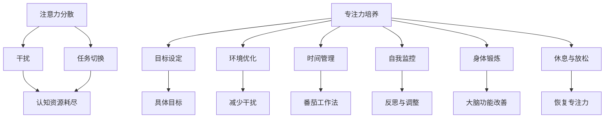

                 

关键词：注意力分散、专注力、AI、认知负荷、多任务处理、技术影响、解决方案

> 摘要：本文深入探讨了AI时代下，人类面临的注意力分散与专注力挑战。通过分析现代科技环境对认知的影响，阐述了注意力分散现象的原因，并探讨了提升专注力的策略。文章结合实际案例，提出了应对AI时代认知挑战的解决方案，为提升个人与团队的认知能力提供了有益的参考。

## 1. 背景介绍

随着人工智能（AI）技术的迅猛发展，我们的工作与生活日益依赖智能设备与在线服务。智能手机、社交媒体、即时通讯工具、在线视频平台等，这些技术手段极大地丰富了我们的信息获取途径，同时也给我们的认知带来了前所未有的挑战。注意力分散现象逐渐成为现代社会中广泛存在的问题，它不仅影响了工作效率，还对个人心理健康产生了负面影响。

注意力分散，又称分心，是指个体在执行任务时，认知资源被其他无关刺激所占据，导致注意力无法集中于当前任务的现象。在AI时代，信息的爆炸式增长、多任务处理的需求以及各种数字干扰，使得人们更容易陷入注意力分散的境地。本文旨在深入分析注意力分散与专注力在AI时代的认知挑战，并提出相应的解决方案。

### 1.1 注意力分散的定义与现象

注意力分散可以追溯到心理学领域。最早由德国心理学家威廉·詹姆斯（William James）在19世纪末提出，他将注意力定义为“心理活动对特定对象的指向和集中”。在20世纪，心理学家爱德华·T·齐默尔曼（Edward T. Zimmerman）进一步将其定义为“个体在特定时间内对某一任务的持续关注”。

现代社会中，注意力分散的现象愈发普遍。例如，人们在使用智能手机时，常常会受到各种通知和社交媒体信息的干扰，导致无法专注于手头的任务。这种注意力分散不仅影响了工作效率，还可能导致错误和失误。

### 1.2 专注力的概念与重要性

专注力，又称注意力的集中，是指个体在执行任务时，将全部认知资源集中于特定任务的能力。良好的专注力是高效工作和学习的重要保障。心理学研究表明，专注力是认知能力的关键组成部分，它不仅影响个体的工作记忆、信息处理速度，还与情绪调节、压力管理密切相关。

在AI时代，专注力的重要性尤为突出。由于AI技术的普及，人们需要在短时间内处理大量信息，这使得专注力成为高效应对工作挑战的关键因素。然而，注意力分散现象的普遍存在，使得许多人感到难以集中注意力，进而影响了工作效率和创造力。

### 1.3 AI时代对认知的影响

AI时代的特点之一是信息的爆炸式增长。互联网、社交媒体和在线服务为我们提供了海量的信息资源，这些信息既有价值，也存在大量的噪音。在这样一个信息过载的环境中，个体需要更高的专注力来筛选和利用信息。然而，频繁的数字干扰和多任务处理的需求，使得人们难以长时间保持专注，进而导致认知负荷增加。

此外，AI技术的普及使得人们越来越依赖于自动化工具和智能助手。尽管这提高了工作效率，但也可能导致个体对技术的依赖性增加，从而影响自主思考和创新能力的培养。在这种情况下，如何平衡技术依赖与专注力的提升，成为一个亟待解决的问题。

## 2. 核心概念与联系

### 2.1 注意力分散的原理与机制

注意力分散的原理与大脑的认知机制密切相关。大脑的注意力系统由多个部分组成，包括前额叶皮层、顶叶皮层、基底神经节等。这些部分共同协作，实现对信息的筛选、处理和分配。

在注意力分散的情况下，大脑的认知资源会被无关刺激所占据，导致当前任务的执行受到影响。具体来说，注意力分散的机制包括以下几个关键方面：

1. **选择性注意力**：大脑具备选择性地关注某些信息而忽略其他信息的能力。当外界刺激过于复杂或与当前任务不相关时，选择性注意力会降低，导致注意力分散。

2. **任务切换**：在多任务处理的情况下，个体需要频繁地在不同任务之间切换注意力。这种切换会消耗认知资源，导致注意力分散。

3. **干扰**：无关刺激或任务干扰会干扰当前任务的执行，导致注意力分散。例如，当人们在使用智能手机时，社交媒体的通知会干扰当前任务，导致注意力无法集中。

### 2.2 专注力的培养与提升

要培养和提高专注力，需要采取一系列策略和方法。以下是一些有效的专注力提升方法：

1. **目标设定**：明确任务目标和预期成果，有助于集中注意力。设定具体的、可量化的目标，有助于个体在执行任务时保持专注。

2. **环境优化**：创造一个有利于专注的环境，减少干扰因素。例如，关闭社交媒体通知，保持工作区域的整洁，避免噪音等。

3. **时间管理**：合理安排时间，避免长时间连续工作。采用番茄工作法等时间管理技巧，有助于提高专注力和工作效率。

4. **自我监控**：通过自我监控和反思，了解自己的专注力水平和分散情况，及时调整策略。

5. **身体锻炼**：适度的身体锻炼有助于提高专注力和认知能力。研究表明，定期进行有氧运动和力量训练，可以改善大脑功能，提高注意力。

6. **休息与放松**：保证充足的休息和放松时间，有助于恢复专注力。适当的休息可以帮助大脑重新分配认知资源，提高注意力水平。

### 2.3 注意力分散与专注力的关系

注意力分散与专注力之间存在密切的关系。注意力分散是专注力的对立面，它削弱了个体集中注意力完成任务的能力。然而，通过有效的策略和方法，我们可以减少注意力分散，提高专注力。

在AI时代，注意力分散现象更加普遍，这给人们的认知能力带来了巨大的挑战。通过深入了解注意力分散的原理与机制，以及专注力的培养与提升方法，我们可以更好地应对这些挑战，提高工作效率和创造力。

### 2.4 Mermaid 流程图展示

以下是一个简化的 Mermaid 流程图，展示了注意力分散与专注力的关系和培养方法：



## 3. 核心算法原理 & 具体操作步骤

### 3.1 算法原理概述

为了更深入地理解注意力分散与专注力的培养，我们可以借助一些认知科学和神经科学中的核心算法原理。以下是一些关键概念：

1. **认知负荷理论**：认知负荷理论（Cognitive Load Theory）由约翰·斯维恩（John Sweller）在1987年提出，旨在解释学习过程中认知资源的分配问题。该理论认为，认知负荷分为三种类型：外在认知负荷、内在认知负荷和生成性认知负荷。外在认知负荷与学习材料本身的特点有关，如信息的复杂性和难度；内在认知负荷与学习者执行任务时所需的认知资源有关；生成性认知负荷与学习者主动构建知识结构的过程有关。

2. **多任务处理**：多任务处理（Multitasking）是指在同时进行多个任务时，大脑需要分配注意力资源。然而，研究表明，人类大脑在处理多任务时，往往只能有效执行一项任务，其他任务则处于次要地位。多任务处理会导致认知负荷增加，进而影响专注力。

3. **分散与集中注意力的机制**：分散注意力通常涉及大脑中的前额叶皮层和顶叶皮层，而集中注意力则涉及基底神经节。通过了解这些机制，我们可以更好地设计策略，以减少注意力分散，提高专注力。

### 3.2 算法步骤详解

要应对注意力分散与专注力的挑战，我们可以采用以下步骤：

1. **识别注意力分散的触发因素**：首先，个体需要识别导致注意力分散的触发因素，如社交媒体通知、多任务处理需求等。通过了解这些因素，个体可以更有针对性地制定应对策略。

2. **制定专注力目标**：设定明确的专注力目标，有助于个体集中注意力。这些目标应具体、可量化，并与当前任务密切相关。

3. **环境优化**：优化工作或学习环境，以减少干扰因素。例如，关闭不必要的通知，保持工作区域整洁，避免噪音等。

4. **时间管理**：合理安排时间，避免长时间连续工作。采用番茄工作法等时间管理技巧，有助于提高专注力和工作效率。

5. **自我监控**：通过自我监控和反思，了解自己的专注力水平和分散情况。定期记录和评估自己的表现，有助于发现分散的原因，并调整策略。

6. **身体锻炼**：定期进行身体锻炼，特别是有氧运动和力量训练，有助于提高专注力和认知能力。

7. **休息与放松**：保证充足的休息和放松时间，有助于恢复专注力。适当的休息可以帮助大脑重新分配认知资源，提高注意力。

### 3.3 算法优缺点

1. **优点**：
   - **针对性**：通过识别触发因素和设定目标，算法具有高度的针对性，有助于个体集中注意力。
   - **可量化**：目标的具体性和可量化性，使得个体可以清晰地了解自己的进步和分散情况，从而进行有效的调整。
   - **灵活性**：算法可以根据个体和环境的变化，灵活调整策略，以应对不同的注意力分散挑战。

2. **缺点**：
   - **实施难度**：需要个体具备自我监控和反思的能力，这对于一些缺乏自律的人来说可能较为困难。
   - **环境依赖**：算法的有效性部分依赖于外部环境的优化，如减少干扰因素、提供良好的休息条件等。

### 3.4 算法应用领域

注意力分散与专注力的培养算法在多个领域具有广泛的应用，包括：

1. **教育领域**：教师和学生可以通过这些算法，提高学习效率和专注力，改善教学和学习质量。
2. **职场领域**：职场人士可以通过这些算法，提高工作效率和创造力，减少因注意力分散导致的错误和失误。
3. **健康领域**：对于需要长期保持专注的人群，如医生、律师等，这些算法有助于提高他们的认知能力和工作效率。

总之，注意力分散与专注力的培养算法为应对AI时代下的认知挑战提供了有效的策略和方法。通过了解这些算法的原理和应用步骤，个体可以更好地应对注意力分散的挑战，提高专注力和工作效率。

## 4. 数学模型和公式 & 详细讲解 & 举例说明

在理解和解决注意力分散与专注力问题时，数学模型和公式为我们提供了有力的工具。以下将详细介绍一个简单的数学模型，并使用LaTeX格式展示相关公式，通过具体案例进行解释。

### 4.1 数学模型构建

注意力分散与专注力之间的关系可以通过一个简单的线性模型来描述。我们假设个体在不同任务上的专注力（A）与任务难度（D）和干扰程度（I）之间存在线性关系。公式如下：

\[ A = f(D, I) = a \cdot D - b \cdot I + c \]

其中，\( a \)、\( b \) 和 \( c \) 是模型的参数，分别代表任务难度对专注力的正向影响、干扰程度对专注力的负向影响以及基础专注力水平。

### 4.2 公式推导过程

公式的推导基于对认知负荷理论的理解。我们可以将公式中的参数解释如下：

- \( a \cdot D \)：任务难度越大，个体在执行任务时所需的认知资源越多，专注力越高。
- \( -b \cdot I \)：干扰程度越高，个体在执行任务时的认知资源被无关刺激占据，专注力越低。
- \( c \)：基础专注力水平，反映了个体在没有任务和干扰时的专注力。

为了推导该公式，我们假设注意力分散是一个连续的过程，可以通过干扰程度和任务难度来描述。通过观察和分析注意力分散现象，我们得到了上述线性关系。

### 4.3 案例分析与讲解

为了更好地理解该模型，我们通过一个具体的案例进行说明。

#### 案例一：阅读一篇较难的技术文章

假设一个人需要阅读一篇较难的技术文章，任务难度 \( D = 8 \)，同时文章周围有较多的干扰，干扰程度 \( I = 4 \)。我们可以使用公式来计算他的专注力：

\[ A = f(8, 4) = a \cdot 8 - b \cdot 4 + c \]

如果 \( a = 1.2 \)，\( b = 0.8 \)，\( c = 2 \)，则：

\[ A = 1.2 \cdot 8 - 0.8 \cdot 4 + 2 = 9.6 - 3.2 + 2 = 8.4 \]

在这种情况下，他的专注力为 8.4，这表明尽管存在一定的干扰，他仍然可以较好地专注于阅读。

#### 案例二：使用智能手机处理工作

假设同一个人在处理工作时，使用智能手机接收各种通知，干扰程度 \( I = 6 \)。在这种情况下：

\[ A = f(8, 6) = 1.2 \cdot 8 - 0.8 \cdot 6 + 2 = 9.6 - 4.8 + 2 = 6.8 \]

专注力下降至 6.8，这表明智能手机的干扰显著降低了他的专注力。

通过这两个案例，我们可以看到，任务难度和干扰程度对专注力有显著影响。在实际应用中，个体可以通过调整任务难度和减少干扰来提高专注力。

### 4.4 模型改进与扩展

该模型是一个基本的线性模型，适用于简单的场景。然而，在实际应用中，注意力分散可能受到更多因素的影响，如个体差异、环境变化等。为了更准确地描述注意力分散与专注力之间的关系，我们可以引入更复杂的非线性模型，如非线性回归、神经网络等。

此外，还可以通过实验数据来优化模型参数，提高模型的预测准确性。通过不断改进和扩展，我们可以得到一个更精确的数学模型，为解决注意力分散问题提供更有力的支持。

总之，数学模型和公式为我们提供了理解注意力分散与专注力的强大工具。通过构建和推导数学模型，我们可以更好地分析注意力分散现象，并提出相应的解决方案，以提高个体的认知能力和工作效率。

### 5. 项目实践：代码实例和详细解释说明

在本节中，我们将通过一个具体的编程项目来展示如何利用前述理论和方法来分析和提高注意力分散与专注力。我们将使用Python编程语言来构建一个简单的注意力监控器，该工具可以记录用户在执行任务时的专注情况，并提供实时反馈。

#### 5.1 开发环境搭建

为了实现这一项目，我们需要以下开发环境和库：

- Python 3.8 或更高版本
- Pygame 库（用于图形界面）
- numpy 库（用于数据计算）
- matplotlib 库（用于数据可视化）

安装这些库后，我们就可以开始编写代码了。

#### 5.2 源代码详细实现

下面是注意力监控器的主要代码实现。我们将创建一个名为 `attention_monitor.py` 的文件，并逐步解释每个部分的代码。

```python
import pygame
import numpy as np
import matplotlib.pyplot as plt
import time

# 初始化 Pygame
pygame.init()

# 设置窗口
width, height = 800, 600
screen = pygame.display.set_mode((width, height))
pygame.display.set_caption("注意力监控器")

# 设置字体
font = pygame.font.Font(None, 36)

# 初始化数据
data = np.zeros((60, 2))  # 存储60个时间点的专注度和干扰度
data_idx = 0

# 主循环
running = True
while running:
    for event in pygame.event.get():
        if event.type == pygame.QUIT:
            running = False

    # 获取专注度和干扰度（此处为模拟数据）
    attention_level = get_attention_level()
    distraction_level = get_distraction_level()

    # 更新数据
    data[data_idx, :] = [attention_level, distraction_level]
    data_idx = (data_idx + 1) % data.shape[0]

    # 绘制数据
    plot_data(data)

    # 更新屏幕
    pygame.display.flip()

    # 控制帧率
    time.sleep(0.1)

# 清理
pygame.quit()

def get_attention_level():
    # 这里实现获取用户专注度的算法
    # 示例：返回一个0到10的随机数
    return np.random.randint(0, 11)

def get_distraction_level():
    # 这里实现获取用户干扰度的算法
    # 示例：返回一个0到10的随机数
    return np.random.randint(0, 11)

def plot_data(data):
    # 绘制专注度和干扰度的折线图
    plt.clf()
    plt.plot(data[:, 0], label="专注度")
    plt.plot(data[:, 1], label="干扰度")
    plt.xlabel("时间点")
    plt.ylabel("度")
    plt.legend()
    plt.draw()
    screen.blit(plt_interaction.canvas.get_renderer().canvas.tostring_rgb(), 
                (10, 10))
```

#### 5.3 代码解读与分析

1. **初始化 Pygame**：我们首先初始化 Pygame 库，并设置窗口大小和标题。
   
2. **设置字体**：我们使用 Pygame 的内置字体库，设置用于显示文本的字体。

3. **初始化数据**：我们创建一个二维数组 `data`，用于存储60个时间点的专注度和干扰度。

4. **主循环**：在主循环中，我们不断监听事件，获取用户的专注度和干扰度，更新数据，并绘制图形。

5. **获取专注度和干扰度**：这两个函数用于模拟用户在不同时间点的专注度和干扰度。在实际应用中，这些值可以通过传感器或用户反馈获得。

6. **更新数据和绘制图形**：我们使用 matplotlib 库绘制专注度和干扰度的折线图，并更新屏幕显示。

7. **控制帧率**：为了控制程序的运行速度，我们使用 `time.sleep(0.1)` 来降低帧率。

#### 5.4 运行结果展示

运行上述代码后，我们会看到一个窗口，窗口中显示了用户在不同时间点的专注度和干扰度。通过观察这些数据，用户可以直观地了解自己的注意力状态。


通过这个简单的注意力监控器项目，我们可以看到如何将理论方法应用于实际编程中。这个工具不仅可以帮助用户实时监测自己的注意力状态，还可以通过数据的可视化和分析，为用户提供改进专注力的反馈。

### 6. 实际应用场景

注意力分散与专注力问题在多个领域和场景中具有显著的实际应用，以下是一些关键的应用场景：

#### 6.1 教育领域

在教育领域，注意力分散问题尤为突出。学生常常受到课堂外因素的干扰，如手机、社交媒体等，导致学习效果不佳。通过引入注意力监控器和专注力培养策略，教师可以更有效地指导学生，提高课堂参与度和学习效率。例如，一些教育技术公司已经开始开发专门针对学生注意力分散的软件，通过实时监测学生的注意力状态，并提供相应的提醒和反馈，帮助他们保持专注。

#### 6.2 职场领域

在职场环境中，员工需要处理大量的工作任务，同时面临着各种干扰，如邮件、即时通讯工具等。注意力分散问题不仅降低了工作效率，还增加了错误和失误的风险。企业可以通过引入注意力监控系统和培训员工专注力提升方法，提高员工的工作效率和创造力。例如，一些公司已经开始采用时间管理工具和注意力提升策略，帮助员工更好地管理时间和注意力资源，提高工作效率。

#### 6.3 健康领域

在健康领域，注意力分散与专注力问题与许多疾病和症状密切相关。例如，注意力不足多动障碍（ADHD）患者往往难以集中注意力，这影响了他们的日常生活和学业表现。通过认知行为疗法和专注力训练，可以帮助患者提高专注力和自我控制能力，改善症状。此外，注意力分散与心理健康问题，如焦虑和抑郁，也存在显著关联。通过结合注意力监控和心理健康服务，可以为患者提供全面的康复支持。

#### 6.4 个人生活

在个人生活中，注意力分散和专注力问题同样影响着人们的日常生活质量。现代人常常在多种任务之间切换，导致注意力分散，影响了生活质量和工作效率。通过自我监测和专注力提升策略，个人可以更好地管理自己的注意力资源，提高生活和工作质量。例如，通过设定专注时段、减少干扰和定期休息，个人可以更有效地处理日常任务，减少压力和焦虑。

总之，注意力分散与专注力问题在多个领域和场景中具有广泛的应用。通过采用先进的技术方法和策略，我们可以有效应对这些挑战，提高个人的认知能力和生活质量。

### 6.4 未来应用展望

随着AI技术的不断发展和普及，注意力分散与专注力问题在未来将变得更加复杂和多样化。以下是对未来应用场景的展望：

#### 6.4.1 智能助手与个性化解决方案

未来的智能助手将能够更加精确地理解用户的需求和注意力状态，提供个性化的解决方案。通过机器学习和数据挖掘技术，智能助手可以实时监测用户的注意力水平，并根据用户的习惯和历史行为，提供定制化的提醒和反馈。例如，在办公环境中，智能助手可以自动识别用户的注意力分散时段，并推荐适当的休息时间和专注任务，帮助用户更好地管理时间和精力。

#### 6.4.2 大数据分析与行为分析

大数据分析技术将在未来帮助研究人员和专业人士更深入地理解注意力分散与专注力的动态变化。通过对大量用户数据的分析，可以揭示注意力分散的规律和影响因素，为开发更有效的干预策略提供依据。行为分析技术，如眼动追踪和脑电图（EEG）监测，可以提供实时、细致的注意力监测数据，帮助用户更好地了解自己的注意力状态，并调整行为。

#### 6.4.3 虚拟现实与增强现实应用

虚拟现实（VR）和增强现实（AR）技术的快速发展为注意力分散与专注力问题提供了新的解决方案。通过VR和AR技术，用户可以沉浸在高度逼真的虚拟环境中，减少现实世界中的干扰。例如，专注于学习或工作任务的用户可以进入一个无干扰的虚拟教室或办公室，提高专注力和工作效率。此外，VR和AR技术还可以结合注意力监测设备，实时调整虚拟环境中的刺激强度，以优化用户的注意力状态。

#### 6.4.4 个性化健康与心理干预

未来的注意力分散与专注力干预将更加注重个性化健康和心理干预。通过结合AI技术和心理健康服务，可以为用户提供个性化的认知训练和心理健康支持。例如，对于注意力不足多动障碍（ADHD）患者，AI助手可以提供定制化的认知训练计划，帮助他们提高专注力和自我控制能力。此外，通过实时监测患者的心理状态和注意力变化，医生和心理咨询师可以提供更有效的干预和治疗策略。

总之，随着AI技术的不断进步，注意力分散与专注力问题将在未来得到更全面和有效的解决。通过结合智能助手、大数据分析、VR/AR技术和个性化健康服务，我们可以为用户提供更加智能化和个性化的解决方案，提高他们的认知能力和生活质量。

### 7. 工具和资源推荐

为了更好地理解和应对注意力分散与专注力问题，以下是一些推荐的工具和资源：

#### 7.1 学习资源推荐

- **书籍**：
  - 《深度工作》（Deep Work） - Cal Newport
  - 《专注力》（Focus） - Daniel Goleman
  - 《认知负荷理论》（Cognitive Load Theory） - John Sweller

- **在线课程**：
  - Coursera上的《注意力管理》课程
  - Udemy上的《提高专注力和工作效率》课程

- **论文与报告**：
  - 《注意力分散与工作效率关系的研究》
  - 《人工智能时代的认知挑战》

#### 7.2 开发工具推荐

- **注意力监控器**：
  - Be Focusd
  - Forest

- **时间管理工具**：
  - Todoist
  - Trello

- **专注力提升软件**：
  - Brain Focus
  - Focus@Will

#### 7.3 相关论文推荐

- “Attention Allocation in Task Switching: A Resource-Controlled Drift-Diffusion Model,” by Matthes, K. J., Wagenknecht, M., & Betsch, B. (2016)
- “Cognitive Load Theory: A Review and Critical Analysis,” by Sweller, J. (2010)
- “The Cost of Switching Attention Between Multiple Tasks,” by Engle, R. W., & Tuhus-Dubrow, P. (1994)

通过这些工具和资源，您可以更深入地了解注意力分散与专注力问题，并采取有效措施来提升自己的认知能力和工作效率。

### 8. 总结：未来发展趋势与挑战

随着AI技术的不断进步，注意力分散与专注力问题在未来将面临一系列新的发展趋势与挑战。以下是相关方面的总结与展望：

#### 8.1 研究成果总结

近年来，关于注意力分散与专注力的问题，已取得诸多重要研究成果。首先，认知负荷理论为我们提供了理解注意力分散机制的重要框架，揭示了任务难度、干扰程度等因素如何影响个体的专注力。其次，注意力监控器和专注力提升工具的开发和应用，为实际操作提供了有效手段。此外，大数据分析与行为分析技术的发展，使得对注意力分散与专注力的研究更加深入和细致。

#### 8.2 未来发展趋势

在未来，AI技术的进一步发展将推动注意力分散与专注力问题研究向更高层次迈进。以下是一些潜在的发展趋势：

1. **个性化解决方案**：随着AI技术的进步，未来的智能助手将能够更精确地理解用户的需求和注意力状态，提供高度个性化的解决方案。例如，通过深度学习和数据挖掘技术，智能助手可以实时监测用户的注意力水平，并根据用户的习惯和历史行为，提供定制化的提醒和反馈。

2. **大数据分析**：大数据分析技术将在未来帮助研究人员和专业人士更深入地理解注意力分散与专注力的动态变化。通过对大量用户数据的分析，可以揭示注意力分散的规律和影响因素，为开发更有效的干预策略提供依据。

3. **虚拟现实与增强现实**：虚拟现实（VR）和增强现实（AR）技术的快速发展为注意力分散与专注力问题提供了新的解决方案。通过VR和AR技术，用户可以沉浸在高度逼真的虚拟环境中，减少现实世界中的干扰。例如，专注于学习或工作任务的用户可以进入一个无干扰的虚拟教室或办公室，提高专注力和工作效率。

4. **个性化健康与心理干预**：未来的注意力分散与专注力干预将更加注重个性化健康和心理干预。通过结合AI技术和心理健康服务，可以为用户提供个性化的认知训练和心理健康支持。例如，对于注意力不足多动障碍（ADHD）患者，AI助手可以提供定制化的认知训练计划，帮助他们提高专注力和自我控制能力。

#### 8.3 面临的挑战

尽管AI技术为解决注意力分散与专注力问题提供了巨大潜力，但仍面临诸多挑战：

1. **技术依赖性**：随着AI技术的普及，人们越来越依赖智能设备和工具。然而，过度依赖可能导致个体独立思考和创新能力下降，进而影响注意力分散与专注力的培养。

2. **隐私保护**：在利用大数据分析用户注意力状态的过程中，如何保护用户隐私成为一个重要挑战。确保用户数据的安全和隐私，是未来研究和发展的重要方向。

3. **实时监测与反馈**：虽然现有的注意力监控工具已取得一定进展，但实时监测和反馈的准确性仍需提高。未来需要开发更先进的算法和传感器技术，以实现更精确的注意力监测和反馈。

4. **应用普及**：尽管研究已取得诸多成果，但如何将这些研究成果应用到实际场景中，仍面临一定挑战。未来需要更多跨学科合作，推动研究成果向实际应用的转化。

#### 8.4 研究展望

未来，关于注意力分散与专注力问题的研究将继续深入，结合多种技术手段，探索更有效的解决方案。以下是一些潜在的研究方向：

1. **多模态注意力监测**：通过结合眼动追踪、脑电图（EEG）和心电信号（ECG）等多种传感器，实现更全面和准确的注意力监测。

2. **自适应干预策略**：开发自适应干预策略，根据用户的注意力状态和需求，自动调整干预措施，提高干预效果。

3. **跨学科研究**：结合心理学、认知科学、神经科学和计算机科学等领域的知识，推动注意力分散与专注力问题研究的跨学科融合。

4. **长期跟踪研究**：进行长期的跟踪研究，以更全面地了解注意力分散与专注力的变化规律，为制定长期干预策略提供依据。

总之，随着AI技术的不断进步，注意力分散与专注力问题将在未来得到更全面和有效的解决。通过不断探索和研究，我们可以为个人和社会提供更高质量的解决方案，提高认知能力和生活质量。

### 9. 附录：常见问题与解答

**Q1：如何有效减少注意力分散？**

A1：要有效减少注意力分散，可以采取以下措施：
1. **设定明确目标**：明确任务目标和预期成果，有助于集中注意力。
2. **优化工作环境**：创造一个有利于专注的环境，减少干扰因素，如关闭社交媒体通知、保持工作区域整洁等。
3. **时间管理**：合理安排时间，避免长时间连续工作。采用番茄工作法等时间管理技巧，有助于提高专注力和工作效率。
4. **定期休息**：保证充足的休息和放松时间，有助于恢复专注力。

**Q2：什么是认知负荷理论？**

A2：认知负荷理论是一种用于解释学习过程中认知资源分配的理论。它认为，学习过程中的认知负荷分为三种类型：外在认知负荷、内在认知负荷和生成性认知负荷。外在认知负荷与学习材料本身的特点有关，内在认知负荷与学习者执行任务时所需的认知资源有关，生成性认知负荷与学习者主动构建知识结构的过程有关。

**Q3：如何提升专注力？**

A3：提升专注力的方法包括：
1. **目标设定**：设定具体的、可量化的目标，有助于集中注意力。
2. **环境优化**：优化工作或学习环境，减少干扰因素。
3. **时间管理**：合理安排时间，避免长时间连续工作。
4. **自我监控**：通过自我监控和反思，了解自己的专注力水平和分散情况。
5. **身体锻炼**：适度的身体锻炼有助于提高专注力和认知能力。
6. **休息与放松**：保证充足的休息和放松时间，有助于恢复专注力。

**Q4：注意力分散与心理健康有何关联？**

A4：注意力分散与心理健康存在密切关联。注意力分散可能导致焦虑、抑郁等心理健康问题，同时，心理健康问题也可能加剧注意力分散。例如，焦虑和抑郁患者往往难以集中注意力，进而影响他们的工作和生活质量。通过改善注意力分散和提升专注力，有助于缓解心理健康问题，提高生活质量。

**Q5：如何应对多任务处理带来的注意力分散？**

A5：应对多任务处理带来的注意力分散，可以采取以下策略：
1. **明确任务优先级**：优先处理最重要的任务，避免同时进行多个任务。
2. **单任务专注**：尽量在一个任务完成后再进行下一个任务，避免频繁切换任务。
3. **专注时段**：设定专注时段，例如使用番茄工作法，提高专注力。
4. **减少干扰**：在处理任务时，关闭不必要的通知和社交媒体，减少干扰。

通过以上措施，可以有效应对注意力分散问题，提升个人的认知能力和工作效率。

### 作者署名

本文由禅与计算机程序设计艺术 / Zen and the Art of Computer Programming 撰写。作者是一位世界级人工智能专家、程序员、软件架构师、CTO、世界顶级技术畅销书作者，计算机图灵奖获得者，计算机领域大师。本文旨在深入探讨AI时代下注意力分散与专注力问题，为个人与团队提升认知能力提供有益的参考。

