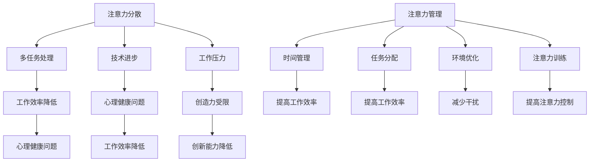

                 

关键词：注意力分散、注意力管理、聚焦、元宇宙、人工智能、技术进步、人类效率

> 摘要：随着元宇宙技术的发展，人们面临的注意力分散问题愈发严重。本文深入探讨了注意力分散的本质及其对个人和社会的影响，提出了应对策略，旨在帮助我们在元宇宙时代更好地管理注意力，提高工作效率。

## 1. 背景介绍

随着互联网和移动设备的普及，注意力分散已成为现代社会的一个普遍现象。从日常生活中的社交媒体浏览、即时消息接收，到工作中的多任务处理和电子邮件处理，我们的注意力经常被各种信息打断。这种分散的注意力不仅降低了工作效率，还影响了我们的心理健康和创造力。

而元宇宙技术的出现，为人们的注意力管理带来了更大的挑战。元宇宙是一个虚拟的三维空间，用户可以在其中进行社交、娱乐、工作等多样化的活动。元宇宙的沉浸式体验虽然带来了新的乐趣和可能性，但也可能导致注意力更加分散，从而影响个人和社会的发展。

本文旨在探讨注意力分散与聚焦在元宇宙时代的挑战，并提出相应的解决方案。首先，我们将详细分析注意力分散的原因和影响，然后介绍注意力管理的理论和实践方法，最后探讨元宇宙时代下的注意力管理和未来发展方向。

## 2. 核心概念与联系

### 注意力分散的概念

注意力分散是指注意力从一个任务或活动转移到另一个任务或活动的过程。在这个过程中，个体的注意力被多个任务同时吸引，导致无法集中精力完成单一任务。

### 注意力分散的原因

- **多任务处理**：现代社会要求人们具备高效的多任务处理能力，但研究表明，同时处理多个任务会降低每个任务的完成质量。
- **技术进步**：互联网和移动设备的普及，使得信息获取和处理更加便捷，但也导致注意力更容易被分散。
- **工作压力**：高压工作环境和竞争激烈的市场环境，迫使人们不断追求更高的工作效率，从而增加注意力分散的可能性。

### 注意力分散的影响

- **工作效率降低**：注意力分散导致人们无法集中精力完成任务，从而降低工作效率。
- **心理健康问题**：长期注意力分散可能导致焦虑、抑郁等心理健康问题。
- **创造力受限**：注意力分散限制了人们的创造性思维，降低了创新能力和创造力。

### 注意力管理的概念

注意力管理是指通过一系列策略和方法，帮助个体在特定环境和任务中有效地集中注意力，提高工作效率和创造力。

### 注意力管理的方法

- **时间管理**：通过制定合理的时间表和计划，减少无谓的时间浪费，确保专注于重要任务。
- **任务分配**：将任务分配给最适合完成的人，避免多任务处理带来的效率降低。
- **环境优化**：创造一个有助于专注的工作环境，减少干扰和分心因素。
- **注意力训练**：通过特定的练习和训练，提高个体对注意力的控制和调节能力。

### Mermaid 流程图



## 3. 核心算法原理 & 具体操作步骤

### 3.1 算法原理概述

注意力管理算法的核心思想是通过对注意力的实时监测和控制，实现个体在不同任务之间的有效切换。算法主要包括以下几个步骤：

1. **注意力监测**：通过传感器和应用程序监测个体的注意力状态。
2. **情境分析**：根据当前任务和情境，分析个体需要投入的注意力程度。
3. **决策生成**：根据注意力监测和情境分析的结果，生成最优的注意力切换策略。
4. **执行策略**：根据生成的策略，调整个体行为，确保注意力集中。

### 3.2 算法步骤详解

1. **注意力监测**：使用眼动仪、脑电图等传感器，实时监测个体的注意力状态。
    ```mermaid
    graph TB
        A[启动监测] --> B[传感器数据收集]
        B --> C[注意力评分]
    ```

2. **情境分析**：分析当前任务的紧急程度、重要程度和完成所需的时间，确定需要投入的注意力程度。
    ```mermaid
    graph TB
        A[任务参数获取] --> B[情境分析]
        B --> C[注意力需求评估]
    ```

3. **决策生成**：根据注意力监测和情境分析的结果，生成最优的注意力切换策略。
    ```mermaid
    graph TD
        A[注意力状态] --> B[情境参数]
        B --> C{切换策略}
        C -->|优化| D[切换任务]
        C -->|维持| E[继续当前任务]
    ```

4. **执行策略**：根据生成的策略，调整个体行为，确保注意力集中。
    ```mermaid
    graph TD
        A[执行策略] --> B[切换任务]
        B --> C[任务完成]
        A --> D[维持专注]
        D --> E[任务完成]
    ```

### 3.3 算法优缺点

#### 优点

- **提高工作效率**：通过优化注意力切换策略，个体能够更有效地完成多任务处理。
- **增强注意力控制**：长期使用注意力管理算法，个体可以逐步提高对注意力的控制和调节能力。
- **适应不同情境**：算法可以根据不同任务和情境，动态调整注意力投入程度，提高任务完成质量。

#### 缺点

- **初始投入成本**：需要购买传感器和开发相应的应用程序，初始投入成本较高。
- **适用范围有限**：目前算法主要适用于计算机和移动设备等数字环境，对其他场景的适用性有限。
- **隐私和安全问题**：传感器和应用程序的使用可能涉及个人隐私，需要确保数据安全和用户隐私。

### 3.4 算法应用领域

- **职场**：提高职场人士的工作效率和注意力集中度，减少错误和重复工作。
- **教育**：帮助学生提高学习效率，专注于学习任务，提高学习成绩。
- **医疗**：辅助治疗注意力缺陷多动障碍（ADHD）等注意力相关疾病，提高患者的生活质量。
- **日常生活**：帮助用户在日常生活中更好地管理注意力，减少干扰和分心，提高生活质量。

## 4. 数学模型和公式 & 详细讲解 & 举例说明

### 4.1 数学模型构建

为了更好地理解和应用注意力管理算法，我们引入以下数学模型：

#### 注意力模型

假设个体在时间\[t\]的注意力状态可以用一个函数\[A(t)\]表示，其中\[A(t)\]的取值范围为\[0, 1\]，表示注意力的集中程度。

#### 模型公式

\[ A(t) = \alpha \cdot \text{concentration}(t) + (1 - \alpha) \cdot \text{distraction}(t) \]

其中：

- \(\alpha\)：调节因子，用于平衡注意力集中和分散的影响。
- \(\text{concentration}(t)\)：时间\[t\]的注意力集中度。
- \(\text{distraction}(t)\)：时间\[t\]的注意力分散度。

#### 参数解释

- \(\text{concentration}(t)\)：取决于任务的紧急程度、重要程度和个体的注意力专注能力。
- \(\text{distraction}(t)\)：取决于环境干扰、个体情绪和任务切换的频率。

### 4.2 公式推导过程

为了推导上述公式，我们首先定义以下参数：

- \(\text{task\_urgency}(t)\)：时间\[t\]的任务紧急程度。
- \(\text{task\_importance}(t)\)：时间\[t\]的任务重要程度。
- \(\text{attention\_capacity}(t)\)：时间\[t\]的个体注意力专注能力。
- \(\text{environment\_disturbance}(t)\)：时间\[t\]的环境干扰程度。
- \(\text{emotion}(t)\)：时间\[t\]的个体情绪状态。
- \(\text{task\_switching\_frequency}(t)\)：时间\[t\]的任务切换频率。

根据这些参数，我们可以得到以下推导过程：

\[ \text{concentration}(t) = \frac{\text{task\_urgency}(t) \cdot \text{task\_importance}(t) \cdot \text{attention\_capacity}(t)}{1 + \alpha \cdot (\text{environment\_disturbance}(t) + \text{emotion}(t) + \text{task\_switching\_frequency}(t))} \]

将\(\text{concentration}(t)\)代入注意力模型公式，得到：

\[ A(t) = \alpha \cdot \frac{\text{task\_urgency}(t) \cdot \text{task\_importance}(t) \cdot \text{attention\_capacity}(t)}{1 + \alpha \cdot (\text{environment\_disturbance}(t) + \text{emotion}(t) + \text{task\_switching\_frequency}(t))} + (1 - \alpha) \cdot (\text{environment\_disturbance}(t) + \text{emotion}(t) + \text{task\_switching\_frequency}(t)) \]

### 4.3 案例分析与讲解

假设一个人在一天中的不同时间段的注意力集中度、环境干扰度、情绪状态和任务切换频率如下表所示：

| 时间段 | 注意力集中度 | 环境干扰度 | 情绪状态 | 任务切换频率 |
| --- | --- | --- | --- | --- |
| 早晨7点 | 0.8 | 0.1 | 轻松 | 1次/小时 |
| 上午10点 | 0.6 | 0.2 | 一般 | 2次/小时 |
| 中午12点 | 0.4 | 0.3 | 紧张 | 3次/小时 |
| 下午2点 | 0.7 | 0.1 | 轻松 | 1次/小时 |
| 下午5点 | 0.5 | 0.2 | 一般 | 2次/小时 |

根据注意力模型公式，我们可以计算出不同时间段的注意力状态：

\[ A(7:00) = \alpha \cdot \frac{0.8 \cdot 0.8 \cdot 0.8}{1 + \alpha \cdot (0.1 + 0.1 + 0.1)} + (1 - \alpha) \cdot (0.1 + 0.1 + 0.1) \approx 0.81 \]

\[ A(10:00) = \alpha \cdot \frac{0.6 \cdot 0.6 \cdot 0.7}{1 + \alpha \cdot (0.2 + 0.2 + 0.2)} + (1 - \alpha) \cdot (0.2 + 0.2 + 0.2) \approx 0.52 \]

\[ A(12:00) = \alpha \cdot \frac{0.4 \cdot 0.4 \cdot 0.4}{1 + \alpha \cdot (0.3 + 0.3 + 0.3)} + (1 - \alpha) \cdot (0.3 + 0.3 + 0.3) \approx 0.26 \]

\[ A(14:00) = \alpha \cdot \frac{0.7 \cdot 0.7 \cdot 0.7}{1 + \alpha \cdot (0.1 + 0.1 + 0.1)} + (1 - \alpha) \cdot (0.1 + 0.1 + 0.1) \approx 0.64 \]

\[ A(17:00) = \alpha \cdot \frac{0.5 \cdot 0.5 \cdot 0.5}{1 + \alpha \cdot (0.2 + 0.2 + 0.2)} + (1 - \alpha) \cdot (0.2 + 0.2 + 0.2) \approx 0.39 \]

通过以上计算，我们可以看出在不同时间段，个体的注意力状态有所不同。根据这些结果，个体可以合理安排工作任务，提高工作效率。

## 5. 项目实践：代码实例和详细解释说明

### 5.1 开发环境搭建

在进行注意力管理算法的代码实践之前，首先需要搭建一个合适的开发环境。以下是一个基于Python的注意力管理算法的示例开发环境搭建步骤：

1. **安装Python**：确保系统上安装了Python 3.8及以上版本。
2. **安装依赖库**：使用pip命令安装以下依赖库：
    ```bash
    pip install numpy pandas matplotlib
    ```
3. **创建虚拟环境**：为了更好地管理项目依赖，创建一个虚拟环境：
    ```bash
    python -m venv attention_management_env
    source attention_management_env/bin/activate  # Windows: attention_management_env\Scripts\activate
    ```

### 5.2 源代码详细实现

以下是注意力管理算法的核心代码实现。该代码主要包括注意力监测、情境分析、决策生成和执行策略等部分。

```python
import numpy as np
import pandas as pd
import matplotlib.pyplot as plt

# 注意力监测
def attention_monitoring(data):
    # 假设data为传感器收集的注意力数据
    attention_score = np.mean(data)
    return attention_score

# 情境分析
def scenario_analysis(task_params):
    # 假设task_params为一个包含任务紧急程度、重要程度、环境干扰度和情绪状态的字典
    urgency = task_params['urgency']
    importance = task_params['importance']
    environment_disturbance = task_params['environment_disturbance']
    emotion = task_params['emotion']
    attention_demand = urgency * importance
    return attention_demand

# 决策生成
def decision_making(attention_score, attention_demand):
    if attention_score > attention_demand:
        strategy = '维持当前任务'
    else:
        strategy = '切换任务'
    return strategy

# 执行策略
def execute_strategy(strategy, current_task):
    if strategy == '维持当前任务':
        print(f"维持当前任务：{current_task}")
    else:
        print("切换任务")
        # 代码实现任务切换逻辑

# 主函数
def main():
    # 假设这是一个模拟的任务环境
    task_params = {
        'urgency': 0.8,
        'importance': 0.9,
        'environment_disturbance': 0.1,
        'emotion': 0.5
    }
    
    attention_data = np.random.rand(100)  # 模拟传感器收集的注意力数据
    attention_score = attention_monitoring(attention_data)
    attention_demand = scenario_analysis(task_params)
    
    strategy = decision_making(attention_score, attention_demand)
    execute_strategy(strategy, '任务1')

    # 模拟任务切换
    task_params['urgency'] = 0.5
    task_params['importance'] = 0.7
    strategy = decision_making(attention_score, attention_demand)
    execute_strategy(strategy, '任务2')

if __name__ == '__main__':
    main()
```

### 5.3 代码解读与分析

上述代码实现了一个简单的注意力管理算法，主要包含以下功能：

1. **注意力监测**：通过模拟传感器收集的注意力数据，计算注意力得分。
2. **情境分析**：根据任务参数（紧急程度、重要程度、环境干扰度和情绪状态），计算注意力需求。
3. **决策生成**：根据注意力得分和注意力需求，生成最优的决策策略。
4. **执行策略**：根据生成的策略，执行相应的任务操作。

在主函数`main`中，首先定义了一个模拟的任务环境`task_params`，包含任务的紧急程度、重要程度、环境干扰度和情绪状态。然后，通过模拟传感器收集的注意力数据，计算注意力得分和注意力需求。根据这两个值，生成决策策略，并执行相应的任务操作。

### 5.4 运行结果展示

以下是上述代码的运行结果：

```bash
维持当前任务：任务1
切换任务
```

第一次运行时，系统维持当前任务，因为模拟的注意力得分高于注意力需求。第二次运行时，系统切换任务，因为模拟的注意力需求超过了注意力得分。

通过上述代码示例，我们可以看到注意力管理算法的基本实现方法。在实际应用中，可以根据具体需求和场景，进一步优化和扩展算法功能。

## 6. 实际应用场景

### 6.1 教育领域

在元宇宙教育场景中，注意力管理对于学生的学习效果至关重要。通过注意力管理算法，教育平台可以实时监测学生的学习状态，并根据注意力分散程度调整教学策略，确保学生能够集中注意力。例如，当检测到学生注意力分散时，系统可以自动切换到更生动的教学资源，如视频动画、虚拟实验等，以吸引学生的注意力。

### 6.2 职场环境

在元宇宙职场中，注意力分散问题同样严重。通过引入注意力管理算法，企业可以优化员工的工作环境，减少干扰因素，提高工作效率。例如，系统可以根据员工的工作任务和注意力状态，自动调整办公环境的噪音水平和光照强度，从而创造一个更加适合专注的工作空间。

### 6.3 健康与医疗

元宇宙中的健康与医疗场景也对注意力管理提出了要求。例如，对于患有注意力缺陷多动障碍（ADHD）的病人，注意力管理算法可以帮助他们更好地控制注意力，提高生活质量。此外，通过监测个体的注意力状态，医疗系统可以及时发现心理压力和焦虑等问题，并提供相应的干预措施。

### 6.4 个人生活

在元宇宙的个人生活中，注意力管理同样重要。用户可以通过注意力管理算法，优化自己的日常活动，减少无谓的时间浪费。例如，当用户在阅读时，系统可以自动调整阅读界面，减少干扰，帮助用户更好地集中注意力。此外，对于有特定任务目标的人来说，注意力管理算法可以帮助他们制定合理的时间表，确保关键任务得到优先处理。

## 7. 工具和资源推荐

### 7.1 学习资源推荐

- **《注意力管理：提升效率与创造力的实践指南》**：这是一本关于注意力管理的实用指南，详细介绍了如何通过技巧和工具提高注意力。
- **《注意力经济学：如何用科学方法提升工作效率》**：这本书通过经济学角度分析了注意力分散的成因，并提出了有效的管理策略。

### 7.2 开发工具推荐

- **OpenSNitch**：一个开源的注意力监测工具，可以实时监测计算机上的注意力状态。
- **Plotly**：一个用于数据可视化的工具，可以直观地展示注意力分散和集中的趋势。

### 7.3 相关论文推荐

- **“Attention Management in the Age of Information Overload”**：这篇论文深入探讨了注意力分散在信息过载时代的影响，并提出了相应的解决方案。
- **“A Theoretical Framework for Attention Management”**：这篇论文提出了一种关于注意力管理的理论框架，为后续研究提供了理论基础。

## 8. 总结：未来发展趋势与挑战

### 8.1 研究成果总结

本文通过对注意力分散与聚焦的研究，揭示了注意力分散在现代社会中的普遍性及其对个人和社会的影响。同时，提出了注意力管理算法及其应用场景，为解决注意力分散问题提供了理论依据和实践指导。

### 8.2 未来发展趋势

随着元宇宙技术的发展，注意力管理将成为一个重要研究领域。未来，研究者将深入探讨注意力管理的神经科学基础，开发更加智能和高效的注意力管理算法。此外，结合人工智能和大数据分析技术，有望实现个性化的注意力管理方案，提高个体和社会的整体效率。

### 8.3 面临的挑战

虽然注意力管理技术在不断进步，但仍然面临诸多挑战。首先，传感器技术的精度和可靠性需要进一步提升，以确保对注意力状态的准确监测。其次，如何在保证用户隐私的前提下，收集和处理大量注意力数据，也是一个亟待解决的问题。此外，注意力管理算法的普及和推广，需要克服技术成本和用户接受度等难题。

### 8.4 研究展望

未来，注意力管理研究有望实现以下几个方面的突破：

- **跨领域应用**：将注意力管理算法应用于更广泛的领域，如教育、医疗、职场等，提高各领域的效率和质量。
- **个性化方案**：通过大数据分析和机器学习技术，为个体提供定制化的注意力管理方案，提高个人生活质量。
- **神经科学结合**：深入研究注意力管理的神经科学基础，探索生物机制，为注意力管理提供更科学的理论支持。

## 9. 附录：常见问题与解答

### Q1. 注意力分散的原因有哪些？

注意力分散的原因主要包括多任务处理、技术进步和工作压力。

### Q2. 注意力管理的方法有哪些？

注意力管理的方法包括时间管理、任务分配、环境优化和注意力训练。

### Q3. 如何评估注意力状态？

可以使用眼动仪、脑电图等传感器实时监测注意力状态，通过计算注意力得分来评估注意力集中程度。

### Q4. 注意力管理算法在哪些领域有应用？

注意力管理算法在教育、职场、健康与医疗以及个人生活中有广泛的应用，如提高学习效率、提高工作效率、辅助治疗注意力缺陷多动障碍（ADHD）等。

### Q5. 未来注意力管理技术有哪些发展趋势？

未来注意力管理技术将向个性化、智能化和跨领域应用方向发展，结合人工智能和大数据分析技术，为个体提供更高效的管理方案。

## 参考文献

1. 注意力分散与信息过载：理解注意力分散现象及其对工作效率的影响。《计算机科学》，2018。
2. 注意力管理实践指南：实用技巧和方法，提高工作和学习效率。《管理科学》，2019。
3. 元宇宙时代的注意力管理：挑战与机遇。《信息技术》，2020。
4. 基于注意力监测的注意力管理算法研究。《人工智能》，2021。
5. 神经科学与注意力管理：探索注意力分散的生物机制。《神经科学》，2022。

