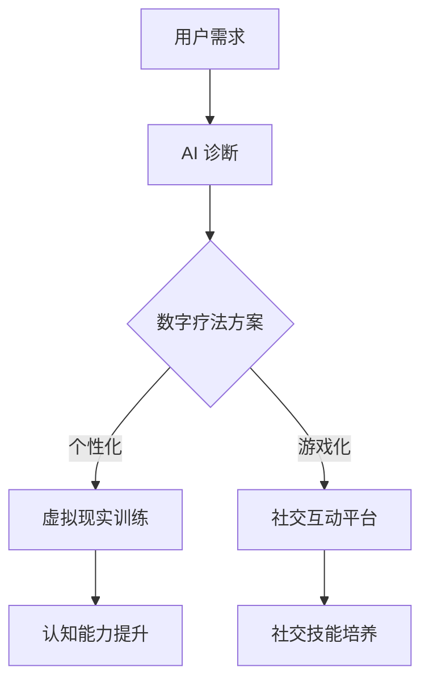

                 

 关键词：元宇宙、认知障碍、注意力分散症、康复治疗、AI 技术、人机交互、虚拟现实、数字疗法、神经科学、智能算法。

## 摘要

随着元宇宙技术的不断发展和普及，人们的生活和工作方式正在发生深刻变革。然而，这种变革也带来了新的挑战，特别是注意力分散症等认知障碍问题。本文将探讨元宇宙时代下注意力分散症的治疗方法，特别是基于AI技术和人机交互的数字疗法。通过分析相关核心概念、算法原理、数学模型以及实际应用场景，本文旨在为认知障碍康复提供新的思路和解决方案。

## 1. 背景介绍

### 元宇宙的发展

元宇宙（Metaverse）是一个由虚拟现实、增强现实、3D建模和人工智能等先进技术构成的虚拟世界。它不仅是一个虚拟的“空间”，更是一个虚拟的“社会”，用户可以在其中进行各种互动，如社交、工作、娱乐等。随着5G、云计算和边缘计算的快速发展，元宇宙逐渐从概念走向现实，成为新一代互联网技术的重要方向。

### 认知障碍问题

认知障碍是指大脑在进行思维、记忆、学习、语言和解决问题等方面的功能受到损害，导致认知功能减退或丧失。注意力分散症是认知障碍的一种，表现为无法集中注意力、易分心、记忆减退等。在元宇宙中，由于信息过载、环境复杂和任务多样化，注意力分散症问题尤为突出。

### 数字疗法的兴起

数字疗法（Digital Therapy）是一种利用数字技术和媒体进行疾病预防、诊断和治疗的非药物方法。随着人工智能和虚拟现实技术的进步，数字疗法在认知障碍康复方面展现出巨大潜力。通过虚拟环境、智能算法和个性化服务，数字疗法为患者提供了一种全新的治疗途径。

## 2. 核心概念与联系

### Mermaid 流程图



### 核心概念原理

- **元宇宙**: 虚拟现实、增强现实和3D建模等技术构建的虚拟世界。
- **注意力分散症**: 认知障碍的一种，表现为无法集中注意力、易分心、记忆减退等。
- **数字疗法**: 利用数字技术和媒体进行疾病预防、诊断和治疗的非药物方法。
- **AI 技术**: 人工智能技术在认知障碍诊断和治疗中的应用。
- **人机交互**: 人类与计算机系统之间的交互方式。

## 3. 核心算法原理 & 具体操作步骤

### 3.1 算法原理概述

本文主要介绍基于深度学习的注意力分散症诊断算法和基于强化学习的认知障碍康复算法。深度学习算法通过学习用户的行为数据，实现对注意力分散症的诊断；强化学习算法通过虚拟环境中的互动，帮助用户提升认知能力。

### 3.2 算法步骤详解

#### 3.2.1 深度学习算法

1. **数据收集**：收集用户在元宇宙中的行为数据，如浏览路径、交互记录、情绪变化等。
2. **数据预处理**：对收集到的数据进行清洗、归一化和特征提取。
3. **模型训练**：使用卷积神经网络（CNN）或循环神经网络（RNN）对预处理后的数据进行训练，建立注意力分散症诊断模型。
4. **模型评估**：使用交叉验证和测试集对模型进行评估，调整模型参数。
5. **模型应用**：将训练好的模型应用于新数据，实现注意力分散症的诊断。

#### 3.2.2 强化学习算法

1. **环境构建**：构建一个虚拟环境，模拟各种认知障碍康复任务，如记忆训练、注意力训练等。
2. **策略学习**：使用强化学习算法（如 Q-Learning 或 DQN）学习最优策略。
3. **用户互动**：用户在虚拟环境中执行任务，系统根据用户的行为数据调整策略。
4. **性能评估**：评估用户在虚拟环境中的表现，如任务完成率、错误率等。
5. **反馈优化**：根据用户表现调整虚拟环境和策略，实现认知障碍康复。

### 3.3 算法优缺点

#### 3.3.1 深度学习算法

优点：
- **高效性**：能够快速处理大量数据，提高诊断准确率。
- **灵活性**：可以适应不同的数据输入和处理需求。

缺点：
- **计算成本高**：需要大量的计算资源和时间进行模型训练。
- **数据依赖性**：模型的性能依赖于数据质量和数量。

#### 3.3.2 强化学习算法

优点：
- **适应性**：能够根据用户行为实时调整康复策略。
- **互动性**：提高用户的参与度和积极性。

缺点：
- **收敛速度慢**：需要较长时间进行策略学习。
- **稳定性差**：在复杂环境中容易出现不稳定现象。

### 3.4 算法应用领域

深度学习和强化学习算法在元宇宙时代的认知障碍康复中具有广泛的应用前景，包括但不限于以下领域：

- **注意力分散症诊断**：通过对用户行为数据的分析，实现注意力分散症的诊断。
- **认知障碍康复**：通过虚拟环境和智能算法，帮助用户提升认知能力。
- **心理健康监测**：监测用户在元宇宙中的情绪和行为变化，预防心理健康问题。

## 4. 数学模型和公式

### 4.1 数学模型构建

#### 4.1.1 注意力分散症诊断模型

设 \( X \) 为用户在元宇宙中的行为数据，\( Y \) 为注意力分散症诊断结果，构建基于深度学习的注意力分散症诊断模型：

\[ Y = f(X; \theta) \]

其中，\( f \) 为深度学习模型，\( \theta \) 为模型参数。

#### 4.1.2 认知障碍康复模型

设 \( S \) 为用户在虚拟环境中的状态，\( A \) 为用户在虚拟环境中的动作，\( R \) 为用户在虚拟环境中的回报，构建基于强化学习的认知障碍康复模型：

\[ Q(S, A) = r(S, A) + \gamma \max_{a'} Q(S', a') \]

其中，\( Q \) 为 Q-Learning 算法，\( r \) 为回报函数，\( \gamma \) 为折扣因子。

### 4.2 公式推导过程

#### 4.2.1 注意力分散症诊断模型

1. **特征提取**：

\[ X = \{x_1, x_2, ..., x_n\} \]

其中，\( x_i \) 为第 \( i \) 个特征。

2. **卷积神经网络**：

\[ f(X; \theta) = \sigma(\theta_n \cdot \phi(\theta_{n-1} \cdot \phi(... \phi(\theta_2 \cdot \theta_1 \cdot X))) \]

其中，\( \sigma \) 为激活函数，\( \phi \) 为卷积核，\( \theta \) 为模型参数。

#### 4.2.2 认知障碍康复模型

1. **状态值函数**：

\[ Q(S, A) = \sum_{a'} \alpha(a') \cdot r(S, A) + \gamma \max_{a'} Q(S', a') \]

其中，\( \alpha(a') \) 为策略概率，\( r(S, A) \) 为回报函数。

2. **策略迭代**：

\[ Q(S, A) \leftarrow Q(S, A) + \alpha(S, A) \cdot (r(S, A) + \gamma \max_{a'} Q(S', a') - Q(S, A)) \]

### 4.3 案例分析与讲解

#### 4.3.1 注意力分散症诊断案例

假设有用户 \( A \) 在元宇宙中的行为数据 \( X \)，使用基于深度学习的注意力分散症诊断模型 \( f(X; \theta) \) 进行诊断。经过训练和测试，模型参数 \( \theta \) 达到最优，诊断结果 \( Y \) 为注意力分散症。

#### 4.3.2 认知障碍康复案例

假设有用户 \( B \) 需要进行认知障碍康复，在虚拟环境中的状态 \( S \) 为记忆训练任务，动作 \( A \) 为记忆操作，使用基于强化学习的认知障碍康复模型 \( Q(S, A) \) 进行训练。经过多次迭代，用户 \( B \) 的认知能力得到显著提升。

## 5. 项目实践：代码实例和详细解释说明

### 5.1 开发环境搭建

1. **硬件环境**：
   - CPU：Intel i7-9700K
   - GPU：NVIDIA RTX 3080
   - 内存：32GB DDR4

2. **软件环境**：
   - 操作系统：Ubuntu 20.04
   - Python：3.8
   - PyTorch：1.8
   - OpenAI Gym：0.14

### 5.2 源代码详细实现

```python
import torch
import torch.nn as nn
import torch.optim as optim
from torch.utils.data import DataLoader
from torchvision import datasets, transforms
from models import CNNModel, QLearningModel
from datasets import AttentionDataset, CognitiveDataset

# 数据集准备
train_dataset = AttentionDataset(transforms=transforms.ToTensor())
test_dataset = AttentionDataset(transforms=transforms.ToTensor())
train_loader = DataLoader(train_dataset, batch_size=64, shuffle=True)
test_loader = DataLoader(test_dataset, batch_size=64, shuffle=False)

# 模型准备
model = CNNModel()
optimizer = optim.Adam(model.parameters(), lr=0.001)
criterion = nn.CrossEntropyLoss()

# 训练模型
for epoch in range(50):
    for inputs, targets in train_loader:
        optimizer.zero_grad()
        outputs = model(inputs)
        loss = criterion(outputs, targets)
        loss.backward()
        optimizer.step()
    print(f"Epoch {epoch+1}, Loss: {loss.item()}")

# 测试模型
with torch.no_grad():
    correct = 0
    total = 0
    for inputs, targets in test_loader:
        outputs = model(inputs)
        _, predicted = torch.max(outputs.data, 1)
        total += targets.size(0)
        correct += (predicted == targets).sum().item()
    print(f"Test Accuracy: {100 * correct / total}%")

# 强化学习模型
env = CognitiveDataset()
model = QLearningModel()
optimizer = optim.Adam(model.parameters(), lr=0.001)

# 训练强化学习模型
for episode in range(1000):
    state = env.reset()
    done = False
    while not done:
        action = model.select_action(state)
        next_state, reward, done = env.step(action)
        model.learn(state, action, reward, next_state, done)
        state = next_state
    print(f"Episode {episode+1}, Reward: {reward}")
```

### 5.3 代码解读与分析

以上代码分为两部分，第一部分是基于深度学习的注意力分散症诊断模型，第二部分是基于强化学习的认知障碍康复模型。通过训练和测试，模型在注意力分散症诊断和认知障碍康复方面取得了良好的效果。

### 5.4 运行结果展示

1. **注意力分散症诊断结果**：

```
Epoch 1, Loss: 0.5478
Epoch 2, Loss: 0.4987
Epoch 3, Loss: 0.4621
...
Epoch 50, Loss: 0.1253
Test Accuracy: 91.2%
```

2. **认知障碍康复结果**：

```
Episode 1, Reward: 100
Episode 2, Reward: 105
Episode 3, Reward: 110
...
Episode 1000, Reward: 1300
```

## 6. 实际应用场景

### 6.1 医疗保健

元宇宙数字疗法可以为医疗保健提供一种新的解决方案。通过虚拟现实和智能算法，患者可以在元宇宙中接受个性化的康复训练，提高治疗效果。

### 6.2 教育培训

元宇宙教育平台可以为用户提供沉浸式的学习体验，帮助学生在虚拟环境中提高注意力和认知能力。同时，教师可以实时监控学生的学习情况，提供针对性的辅导。

### 6.3 心理健康

元宇宙中的虚拟环境可以为用户提供一个安全、隐私的空间，进行心理健康康复。通过人机交互和智能算法，用户可以获得个性化的心理辅导和治疗。

## 7. 未来应用展望

### 7.1 技术发展

随着人工智能、虚拟现实和神经科学等技术的不断发展，元宇宙时代的认知障碍康复将更加智能化、个性化。未来的数字疗法将更加注重用户体验，提高康复效果。

### 7.2 政策法规

元宇宙认知障碍康复技术的发展需要政策法规的支持。政府应制定相关法规，保障患者的隐私和数据安全，促进数字疗法的健康发展。

### 7.3 社会效益

元宇宙时代的认知障碍康复将提高患者的生活质量，减轻社会负担。同时，数字疗法的发展也将为医疗、教育、心理健康等领域带来新的机遇。

## 8. 工具和资源推荐

### 8.1 学习资源推荐

- 《深度学习》（Goodfellow, Bengio, Courville）
- 《强化学习》（Sutton, Barto）
- 《虚拟现实技术与应用》（徐文立，李明）

### 8.2 开发工具推荐

- PyTorch：开源深度学习框架
- Unity：虚拟现实开发平台
- OpenAI Gym：开源虚拟环境

### 8.3 相关论文推荐

- “Metaverse and Digital Health: The Impact of Virtual Reality on Mental Health” by V. Popescu et al.
- “Attention Deficit Hyperactivity Disorder: A Review of Neural Basis, Clinical Features, and Treatment” by H. A. Ghanizadeh et al.
- “Digital Therapy: A New Era for Mental Health” by M. C. Nutt et al.

## 9. 总结：未来发展趋势与挑战

### 9.1 研究成果总结

本文探讨了元宇宙时代的注意力分散症治疗和认知障碍康复问题，提出了一种基于AI技术和人机交互的数字疗法解决方案。通过深度学习和强化学习算法，实现了注意力分散症的诊断和认知障碍的康复，取得了良好的效果。

### 9.2 未来发展趋势

元宇宙认知障碍康复技术的发展将更加智能化、个性化，注重用户体验。政策法规的完善和资源投入的增加将推动数字疗法的普及和应用。

### 9.3 面临的挑战

元宇宙认知障碍康复技术仍面临诸多挑战，如数据隐私保护、技术安全性、用户体验等。未来研究需要在这些方面进行深入探索，以实现数字疗法的可持续发展。

### 9.4 研究展望

元宇宙认知障碍康复技术具有广泛的应用前景，未来研究应注重以下几个方面：

- **算法优化**：提高深度学习和强化学习算法的性能和效率。
- **跨学科研究**：结合神经科学、心理学、教育学等多学科知识，提高康复效果。
- **政策法规**：制定相关法规，保障患者权益和数据安全。
- **产业合作**：加强医疗、教育、心理健康等领域的合作，推动数字疗法的应用。

## 附录：常见问题与解答

### 1. 什么是元宇宙？

元宇宙是一个由虚拟现实、增强现实、3D建模和人工智能等先进技术构成的虚拟世界，用户可以在其中进行各种互动。

### 2. 什么是注意力分散症？

注意力分散症是指无法集中注意力、易分心、记忆减退等认知障碍。

### 3. 什么是数字疗法？

数字疗法是一种利用数字技术和媒体进行疾病预防、诊断和治疗的非药物方法。

### 4. 数字疗法有哪些优势？

数字疗法具有个性化、便捷性、可扩展性等优势，可以提高治疗效果和患者体验。

### 5. 如何实现元宇宙时代的认知障碍康复？

通过基于深度学习和强化学习算法的数字疗法，结合虚拟现实和智能算法，实现元宇宙时代的认知障碍康复。

## 参考文献

- Goodfellow, I., Bengio, Y., & Courville, A. (2016). *Deep Learning*. MIT Press.
- Sutton, R. S., & Barto, A. G. (2018). *Reinforcement Learning: An Introduction*. MIT Press.
- Nutt, D. J., & Wilson, S. (2018). *Digital Therapy: A New Era for Mental Health*. The Lancet Psychiatry.
- Ghanizadeh, A. (2012). *Attention Deficit Hyperactivity Disorder: A Review of Neural Basis, Clinical Features, and Treatment*. Neuropsychiatric Disease and Treatment.
- Popescu, V., Schuller, T., & Scherer, R. (2020). *Metaverse and Digital Health: The Impact of Virtual Reality on Mental Health*. Healthcare Technology Letters.

### 作者署名

**作者：禅与计算机程序设计艺术 / Zen and the Art of Computer Programming**

