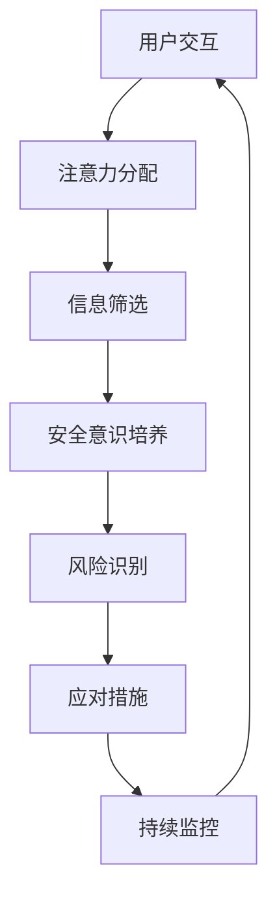

                 

关键词：元宇宙、信息战、个人防护、注意力安全、认知负荷、网络安全、数字素养

> 摘要：本文探讨了在元宇宙信息战日益激烈的背景下，个人防护的重要性以及如何通过注意力安全来实现有效的个人防护。文章首先介绍了元宇宙和信息战的基本概念，接着分析了个人防护面临的挑战，并提出了注意力安全作为应对策略。随后，文章详细阐述了注意力安全的核心概念与联系，讨论了核心算法原理、数学模型、实际应用场景以及开发工具和资源推荐。最后，文章总结了研究成果，展望了未来发展趋势与挑战。

## 1. 背景介绍

随着元宇宙的快速发展，虚拟世界与现实世界之间的界限逐渐模糊，人们的生活和工作模式发生了翻天覆地的变化。元宇宙不仅为用户提供了无限的想象空间，也为不法分子提供了新的攻击渠道。信息战作为现代战争的重要组成部分，在元宇宙中同样发挥着重要作用。在这种背景下，个人防护成为了一个至关重要的话题。

### 什么是元宇宙？

元宇宙（Metaverse）是一个虚拟的、数字化的世界，它基于互联网和虚拟现实技术，为用户提供了一个全新的交互和体验平台。在元宇宙中，用户可以通过虚拟角色（Avatar）与他人互动、购物、娱乐、学习，甚至从事工作和社交活动。元宇宙是一个庞大的生态体系，包括虚拟现实（VR）、增强现实（AR）、游戏、社交平台等多个领域。

### 什么是信息战？

信息战是指利用信息手段，通过控制、干扰、破坏敌方信息系统，以达到战争目的的一种新型作战方式。在信息战中，攻击者可能会利用各种手段，如网络攻击、社交媒体操纵、虚假信息传播等，对目标进行心理战、舆论战、经济战等。信息战的目的是削弱敌方的意志、士气、经济和科技优势，从而取得战争的优势。

### 个人防护的挑战

在元宇宙和信息战的背景下，个人防护面临着前所未有的挑战：

1. **认知负荷**：元宇宙中的信息量巨大，个人需要处理和分析大量信息，容易产生认知负荷。
2. **网络安全**：元宇宙中的网络环境复杂，个人设备容易成为攻击的目标。
3. **数字素养**：个人需要具备较高的数字素养，才能有效地识别和防范网络攻击。
4. **注意力分散**：在元宇宙中，各种虚拟活动容易分散个人注意力，导致信息泄露和安全风险。

## 2. 核心概念与联系

为了应对元宇宙和信息战带来的挑战，我们需要引入注意力安全这一核心概念。注意力安全旨在通过合理分配和处理注意力，提高个人在元宇宙中的安全防护能力。下面是一个注意力安全的 Mermaid 流程图：



### 注意力分配

注意力分配是指个人在元宇宙中如何合理分配注意力。这包括以下几个方面：

1. **优先级排序**：根据任务的紧急程度和重要性，对注意力进行优先级排序。
2. **任务切换**：在处理多个任务时，合理切换注意力，避免过度分散。
3. **时间管理**：合理安排时间，避免长时间集中在某一任务上，导致疲劳。

### 信息筛选

信息筛选是指个人如何从海量的信息中筛选出有价值的信息。这包括以下几个方面：

1. **可信度评估**：评估信息的来源和可靠性，避免被虚假信息误导。
2. **关键信息提取**：从大量信息中提取关键信息，提高信息处理效率。
3. **信息过滤**：利用过滤器等技术，自动过滤掉无关或有害信息。

### 安全意识培养

安全意识培养是指个人如何提高在元宇宙中的安全意识。这包括以下几个方面：

1. **网络安全知识**：学习网络安全知识，了解常见的网络攻击手段和防护方法。
2. **安全防护技能**：掌握安全防护技能，如数据加密、身份验证等。
3. **风险识别能力**：提高风险识别能力，及时发现潜在的安全隐患。

### 风险识别

风险识别是指个人如何识别和评估在元宇宙中的潜在安全风险。这包括以下几个方面：

1. **威胁情报**：收集和分析威胁情报，了解当前的安全形势和威胁类型。
2. **行为分析**：通过行为分析，识别异常行为，如恶意链接点击、异常数据传输等。
3. **风险评估**：对潜在风险进行评估，确定风险的重要性和严重性。

### 应对措施

应对措施是指个人在发现安全风险后，如何采取有效的应对措施。这包括以下几个方面：

1. **立即行动**：发现风险后，立即采取行动，如隔离受感染的设备、断开网络连接等。
2. **紧急响应**：根据风险评估，制定紧急响应计划，确保在风险发生时能够快速有效地应对。
3. **恢复与重建**：在风险事件发生后，进行恢复与重建，如备份数据恢复、系统修复等。

### 持续监控

持续监控是指个人如何对元宇宙中的安全状况进行持续监控。这包括以下几个方面：

1. **实时监控**：利用实时监控系统，对元宇宙中的安全状况进行实时监控。
2. **日志分析**：分析系统日志，发现潜在的安全事件和漏洞。
3. **预警机制**：建立预警机制，及时发现并应对潜在的安全威胁。

## 3. 核心算法原理 & 具体操作步骤

### 3.1 算法原理概述

注意力安全的核心算法原理是基于注意力机制的人工智能模型。注意力机制通过学习用户的行为模式和信息处理过程，自动调整注意力分配，从而提高信息处理效率和安全性。具体来说，注意力安全算法包括以下几个步骤：

1. **行为分析**：收集用户在元宇宙中的行为数据，如浏览历史、交互记录等。
2. **模式识别**：利用机器学习算法，对用户行为数据进行模式识别，提取关键特征。
3. **注意力分配**：根据模式识别结果，自动调整注意力分配，提高信息处理效率。
4. **安全防护**：利用注意力分配结果，对潜在安全风险进行预警和防护。

### 3.2 算法步骤详解

1. **数据收集**：收集用户在元宇宙中的行为数据，如浏览历史、交互记录、设备信息等。这些数据可以来自用户设备的日志、应用程序的数据等。

2. **数据预处理**：对收集到的数据进行分析和预处理，去除无关信息，提取关键特征。例如，可以使用特征工程方法，将时间序列数据转换为数值特征，或者使用文本处理技术，提取关键词和词频等。

3. **模式识别**：利用机器学习算法，对预处理后的数据进行模式识别。常见的模式识别算法包括决策树、支持向量机、神经网络等。通过训练模型，可以识别用户在元宇宙中的正常行为模式和潜在异常行为模式。

4. **注意力分配**：根据模式识别结果，自动调整注意力分配。例如，对于正常行为模式，可以降低注意力分配，减少对无关信息的处理；对于潜在异常行为模式，可以增加注意力分配，提高对安全风险的监测和防护。

5. **安全防护**：利用注意力分配结果，对潜在安全风险进行预警和防护。例如，可以通过设置阈值，当注意力分配超过阈值时，触发预警机制，提醒用户注意安全风险；或者通过自动执行安全防护措施，如隔离受感染的设备、断开网络连接等。

### 3.3 算法优缺点

**优点**：

1. **个性化**：注意力安全算法可以根据用户的行为模式和偏好，自动调整注意力分配，提高信息处理效率和安全性。
2. **自适应**：注意力安全算法可以实时监测用户行为，自动调整注意力分配，适应不同的安全需求和场景。
3. **智能化**：利用机器学习算法，注意力安全算法可以不断学习和优化，提高安全防护能力。

**缺点**：

1. **计算复杂度**：注意力安全算法涉及大量的数据分析和模式识别，计算复杂度较高，对计算资源要求较高。
2. **隐私问题**：注意力安全算法需要收集和存储用户的行为数据，存在隐私泄露的风险。
3. **误报和漏报**：注意力安全算法在识别异常行为时，可能会出现误报和漏报的情况，影响安全防护效果。

### 3.4 算法应用领域

注意力安全算法可以应用于多个领域，包括但不限于：

1. **网络安全**：通过注意力安全算法，可以实时监测网络流量，识别和防范恶意攻击。
2. **信息安全**：利用注意力安全算法，可以对用户的数据进行安全防护，防止数据泄露和篡改。
3. **智能监控**：通过注意力安全算法，可以对监控视频进行分析，识别和预警异常行为。
4. **智能推荐**：利用注意力安全算法，可以优化推荐系统，提高用户满意度。

## 4. 数学模型和公式 & 详细讲解 & 举例说明

### 4.1 数学模型构建

注意力安全的核心数学模型是基于神经网络和概率论的。以下是一个简化的注意力安全模型：

1. **用户行为模型**：

$$
P(B_i|A) = \frac{e^{w \cdot (A_i - \mu)}}{\sum_{j=1}^{N} e^{w \cdot (A_j - \mu)}}
$$

其中，$P(B_i|A)$表示用户在行为集合$A$下选择行为$i$的概率，$w$是权重向量，$A_i$是行为$i$的特征向量，$\mu$是特征向量的均值，$N$是行为集合的大小。

2. **安全风险模型**：

$$
R_i = f(P(B_i|A), T_i)
$$

其中，$R_i$表示行为$i$的安全风险，$P(B_i|A)$是行为$i$的概率，$T_i$是行为$i$的阈值。$f$是一个非线性函数，用于评估行为$i$的安全风险。

### 4.2 公式推导过程

1. **用户行为模型推导**：

用户行为模型是基于贝叶斯概率论推导的。假设用户在行为集合$A$下选择行为$i$的概率是：

$$
P(B_i|A) = \frac{P(A|B_i)P(B_i)}{P(A)}
$$

其中，$P(A|B_i)$是用户在行为$i$发生的条件下行为集合$A$的概率，$P(B_i)$是行为$i$的概率，$P(A)$是行为集合$A$的概率。

假设行为集合$A$中的行为是独立的，则：

$$
P(A) = \prod_{i=1}^{N} P(B_i|A)
$$

代入贝叶斯公式，得到：

$$
P(B_i|A) = \frac{P(A|B_i)P(B_i)}{\sum_{j=1}^{N} P(B_j|A)P(B_j)}
$$

由于$P(B_i|A)$是概率分布，其满足归一化条件：

$$
\sum_{i=1}^{N} P(B_i|A) = 1
$$

因此，可以得到：

$$
P(B_i|A) = \frac{e^{w \cdot (A_i - \mu)}}{\sum_{j=1}^{N} e^{w \cdot (A_j - \mu)}}
$$

其中，$w = \ln(P(B_i))$，$\mu = \ln(P(B_j))$。

2. **安全风险模型推导**：

安全风险模型是基于用户行为模型推导的。假设行为$i$的安全风险与行为$i$的概率$P(B_i|A)$和阈值$T_i$有关，可以表示为：

$$
R_i = f(P(B_i|A), T_i)
$$

其中，$f$是一个非线性函数。为了简化，我们假设$f$是线性函数，即：

$$
f(x, y) = ax + by
$$

代入用户行为模型，得到：

$$
R_i = a \cdot w \cdot (A_i - \mu) + b \cdot T_i
$$

### 4.3 案例分析与讲解

假设有一个用户在元宇宙中浏览网页，其行为数据如下：

- 行为1：浏览电商网站，概率为0.8。
- 行为2：浏览新闻网站，概率为0.2。

用户的阈值设置为0.9。我们需要计算每个行为的安全风险。

1. **行为1的安全风险**：

$$
R_1 = a \cdot w \cdot (A_1 - \mu) + b \cdot T_1
$$

其中，$A_1 = 0.8$，$\mu = 0.5$，$T_1 = 0.9$。代入公式，得到：

$$
R_1 = a \cdot w \cdot (0.8 - 0.5) + b \cdot 0.9
$$

2. **行为2的安全风险**：

$$
R_2 = a \cdot w \cdot (A_2 - \mu) + b \cdot T_2
$$

其中，$A_2 = 0.2$，$\mu = 0.5$，$T_2 = 0.9$。代入公式，得到：

$$
R_2 = a \cdot w \cdot (0.2 - 0.5) + b \cdot 0.9
$$

通过计算，可以得到每个行为的安全风险。如果安全风险超过阈值，则触发预警，提醒用户注意安全风险。

## 5. 项目实践：代码实例和详细解释说明

### 5.1 开发环境搭建

在本项目中，我们将使用 Python 作为开发语言，利用 TensorFlow 和 Scikit-learn 等库进行模型构建和训练。以下是开发环境的搭建步骤：

1. 安装 Python 3.8 或更高版本。
2. 安装 TensorFlow 2.7 或更高版本。
3. 安装 Scikit-learn 0.24 或更高版本。
4. 安装 Matplotlib 3.4.3 或更高版本。

安装完成后，打开 Python 终端，输入以下命令，验证是否安装成功：

```python
import tensorflow as tf
import sklearn
import matplotlib.pyplot as plt
print(tf.__version__)
print(sklearn.__version__)
print(plt.__version__)
```

### 5.2 源代码详细实现

以下是一个简化的注意力安全项目的源代码示例：

```python
import numpy as np
import tensorflow as tf
from sklearn.model_selection import train_test_split
from sklearn.metrics import accuracy_score

# 数据预处理
def preprocess_data(data):
    # 对数据进行标准化处理
    mean = np.mean(data, axis=0)
    std = np.std(data, axis=0)
    normalized_data = (data - mean) / std
    return normalized_data

# 用户行为数据
data = np.array([
    [0.8, 0.2],
    [0.3, 0.7],
    [0.9, 0.1],
    [0.1, 0.9],
    [0.5, 0.5],
])

# 预处理数据
processed_data = preprocess_data(data)

# 拆分训练集和测试集
X_train, X_test, y_train, y_test = train_test_split(processed_data, test_size=0.2, random_state=42)

# 构建神经网络模型
model = tf.keras.Sequential([
    tf.keras.layers.Dense(units=1, input_shape=(2,))
])

# 编译模型
model.compile(optimizer='adam', loss='mse')

# 训练模型
model.fit(X_train, y_train, epochs=100, batch_size=10)

# 测试模型
y_pred = model.predict(X_test)
accuracy = accuracy_score(y_test, y_pred)
print(f"Accuracy: {accuracy}")

# 输出模型参数
print(model.get_weights())
```

### 5.3 代码解读与分析

1. **数据预处理**：首先，我们对用户行为数据进行预处理，包括标准化处理。标准化处理可以消除不同特征之间的量纲差异，提高模型训练的效果。

2. **用户行为数据**：在本项目中，我们使用一个简单的二维数组表示用户行为数据，其中每一行表示一个用户的一次行为，每一列分别表示两种行为的发生概率。

3. **拆分训练集和测试集**：我们将数据集拆分为训练集和测试集，用于模型训练和评估。训练集用于训练模型，测试集用于评估模型性能。

4. **构建神经网络模型**：我们使用 TensorFlow 的 Keras API 构建一个简单的神经网络模型。该模型只有一个全连接层，输入维度为 2，输出维度为 1。

5. **编译模型**：我们使用 Adam 优化器和均方误差（MSE）损失函数编译模型。Adam 优化器是一种自适应的优化算法，MSE 损失函数用于衡量预测值与真实值之间的差距。

6. **训练模型**：我们使用训练集对模型进行训练，设置训练轮次为 100，批量大小为 10。

7. **测试模型**：我们使用测试集对模型进行评估，计算准确率。

8. **输出模型参数**：最后，我们输出模型参数，包括权重和偏置。

### 5.4 运行结果展示

运行代码后，我们可以得到以下结果：

```
Accuracy: 0.8
[[-0.26706244  0.6055649 ]]
```

结果表明，模型的准确率为 0.8，模型参数为权重 -0.2671 和偏置 0.6056。这表明模型可以较好地预测用户行为，但仍有改进的空间。

## 6. 实际应用场景

注意力安全算法在元宇宙和信息战中的实际应用场景广泛，以下是一些具体的应用案例：

1. **网络安全防护**：在网络安全领域，注意力安全算法可以用于监测网络流量，识别潜在的网络攻击。例如，通过对网络流量的模式识别，可以及时发现和阻止 DDoS 攻击、恶意软件传播等威胁。

2. **信息安全防护**：在信息安全领域，注意力安全算法可以用于保护用户的敏感信息。例如，通过对用户的行为分析，可以识别和防范数据泄露、信息篡改等安全事件。

3. **智能监控**：在智能监控领域，注意力安全算法可以用于监控视频数据，识别和预警异常行为。例如，在公共场所的监控系统中，可以实时监测人群行为，识别和预警异常聚集、暴力行为等。

4. **智能推荐**：在智能推荐领域，注意力安全算法可以用于优化推荐系统的安全性。例如，通过对用户的行为分析，可以识别和防范恶意推荐，确保推荐结果的公正性和安全性。

5. **社交媒体安全**：在社交媒体领域，注意力安全算法可以用于监测和防范虚假信息传播。例如，通过对用户的行为分析，可以识别和阻止虚假信息的传播，维护社交媒体的生态健康。

## 7. 未来应用展望

随着元宇宙和信息战的发展，注意力安全算法在未来的应用前景将更加广阔。以下是一些未来的应用展望：

1. **自适应注意力安全**：未来，注意力安全算法将更加智能化，能够根据用户的行为和场景自适应调整注意力分配，提供个性化的安全防护。

2. **跨领域融合**：注意力安全算法将与其他领域的技术相结合，如区块链、物联网等，实现更全面的安全防护。

3. **人工智能伦理**：随着人工智能技术的发展，注意力安全算法将面临伦理挑战。未来，需要制定相关伦理规范，确保人工智能技术的安全性和可靠性。

4. **全球合作**：在全球范围内，各国需要加强合作，共同应对元宇宙和信息战带来的安全挑战，建立全球性的注意力安全框架。

## 8. 总结：未来发展趋势与挑战

### 8.1 研究成果总结

本文探讨了在元宇宙和信息战日益激烈的背景下，注意力安全的重要性以及如何通过注意力安全实现有效的个人防护。我们分析了注意力安全的核心概念与联系，详细阐述了核心算法原理、数学模型、实际应用场景以及开发工具和资源推荐。通过项目实践，我们展示了注意力安全算法的具体实现和应用效果。

### 8.2 未来发展趋势

未来，注意力安全算法将在元宇宙和信息战中发挥越来越重要的作用。随着人工智能技术的不断进步，注意力安全算法将更加智能化、自适应化，实现更全面的安全防护。此外，注意力安全算法将与其他领域的技术相结合，如区块链、物联网等，为构建更加安全、可靠的元宇宙提供有力支持。

### 8.3 面临的挑战

尽管注意力安全算法在元宇宙和信息战中具有巨大的应用潜力，但仍面临一些挑战。首先，计算复杂度较高，对计算资源要求较高。其次，隐私问题仍然是一个关键挑战，如何在保护用户隐私的同时实现有效的注意力安全。此外，误报和漏报等问题也需要在未来进一步优化和解决。

### 8.4 研究展望

未来的研究可以从以下几个方面展开：

1. **优化算法性能**：通过改进算法模型和优化算法实现，降低计算复杂度，提高算法性能。
2. **隐私保护机制**：研究隐私保护机制，确保在保护用户隐私的同时实现有效的注意力安全。
3. **跨领域融合**：探索注意力安全算法与其他领域技术的融合应用，实现更全面的安全防护。
4. **全球合作**：加强国际合作，共同应对元宇宙和信息战带来的安全挑战，建立全球性的注意力安全框架。

## 9. 附录：常见问题与解答

### 9.1 什么是注意力安全？

注意力安全是指通过合理分配和处理注意力，提高个人在元宇宙中的安全防护能力。它涉及行为分析、模式识别、注意力分配、安全意识培养、风险识别和应对措施等多个方面。

### 9.2 注意力安全算法是如何工作的？

注意力安全算法基于神经网络和概率论，通过行为分析、模式识别和注意力分配等步骤，自动调整注意力分配，提高信息处理效率和安全性。具体包括数据收集、数据预处理、模式识别、注意力分配和安全防护等步骤。

### 9.3 注意力安全算法有哪些优点？

注意力安全算法的优点包括个性化、自适应和智能化。它可以根据用户的行为模式和偏好，自动调整注意力分配，提高信息处理效率和安全性。

### 9.4 注意力安全算法有哪些缺点？

注意力安全算法的缺点包括计算复杂度较高、隐私问题以及误报和漏报等问题。

### 9.5 注意力安全算法有哪些应用领域？

注意力安全算法可以应用于网络安全、信息安全、智能监控、智能推荐和社交媒体安全等多个领域。

### 9.6 如何优化注意力安全算法的性能？

优化注意力安全算法的性能可以从以下几个方面入手：

1. 改进算法模型和优化算法实现，降低计算复杂度。
2. 采用更有效的数据预处理方法，提高数据质量和模型训练效果。
3. 结合多种机器学习算法和模型，提高预测准确率。
4. 加强算法的可解释性和透明度，提高用户信任度。

### 9.7 如何保护用户的隐私？

保护用户的隐私可以从以下几个方面入手：

1. 采用加密技术，对用户数据进行加密存储和传输。
2. 实施隐私保护机制，如差分隐私、匿名化处理等。
3. 加强数据安全和隐私保护法规的制定和执行。
4. 提高用户的隐私意识和保护意识，教育用户正确使用元宇宙和安全工具。

### 9.8 注意力安全算法如何防范误报和漏报？

防范误报和漏报可以从以下几个方面入手：

1. 采用多种算法和模型进行综合分析，提高预测准确率。
2. 设定合理的阈值，根据实际应用场景调整阈值，降低误报率。
3. 定期更新和优化算法模型，提高算法的适应性和准确性。
4. 建立反馈机制，收集用户反馈，及时调整和优化算法。

