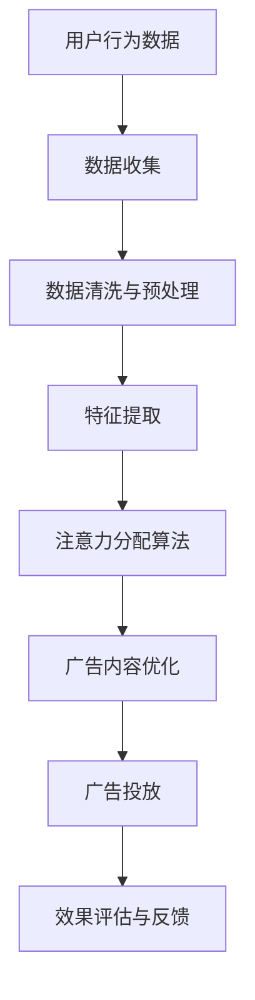

                 

关键词：注意力市场、元宇宙、广告投放、人工智能、用户行为分析

> 摘要：随着元宇宙概念的兴起，广告投放模式也在不断演变。本文将探讨注意力市场的概念，分析元宇宙中的广告投放新思路，并提出基于用户行为分析的技术方法，以实现更精准、有效的广告投放。

## 1. 背景介绍

### 元宇宙的兴起

近年来，随着虚拟现实（VR）、增强现实（AR）和区块链技术的快速发展，元宇宙（Metaverse）的概念逐渐成为热点。元宇宙被定义为通过互联网连接的虚拟世界，用户可以在其中进行互动、交流、娱乐、工作和购物等多样化活动。这一概念的核心在于创建一个沉浸式的、与现实世界相辅相成的虚拟环境，从而改变人们的社交、工作和娱乐方式。

### 广告市场的变革

随着互联网的普及和技术的进步，广告市场也经历了巨大的变革。传统的广告模式主要依赖于用户规模和覆盖面，而随着大数据和人工智能技术的发展，精准投放成为广告主追求的目标。注意力市场作为广告市场的一个新方向，旨在通过分析用户的行为数据，实现广告与用户需求的精准匹配。

## 2. 核心概念与联系

### 注意力市场概述

注意力市场是指基于用户行为数据，通过算法分析，将用户的注意力分配到不同的广告内容上，从而实现广告效果的优化。在注意力市场中，用户的注意力被视为一种稀缺资源，广告主通过竞争用户的注意力来提升广告投放的效果。

### 元宇宙中的注意力市场

在元宇宙中，用户的注意力市场具有独特性。用户在元宇宙中的行为数据更加丰富，包括虚拟资产交易、游戏互动、社交网络活动等。通过分析这些行为数据，可以更准确地捕捉用户的兴趣和需求，从而实现更精准的广告投放。

### Mermaid 流程图



## 3. 核心算法原理 & 具体操作步骤

### 3.1 算法原理概述

注意力市场中的核心算法主要包括用户行为分析、特征提取和注意力分配。用户行为分析旨在捕捉用户的兴趣和需求；特征提取则将用户行为转化为算法可处理的特征向量；注意力分配算法根据特征向量计算用户对广告的注意力值，从而实现广告的精准投放。

### 3.2 算法步骤详解

1. **数据收集**：通过元宇宙平台收集用户的行为数据，包括游戏互动、虚拟资产交易、社交网络活动等。
2. **数据清洗与预处理**：对收集到的数据进行清洗，去除噪声和异常值，并进行预处理，如数据归一化、缺失值填补等。
3. **特征提取**：将预处理后的数据转化为算法可处理的特征向量，包括用户兴趣标签、行为模式、社交网络特征等。
4. **注意力分配算法**：基于特征向量计算用户对广告的注意力值，常用的算法包括基于协同过滤的注意力分配和基于深度学习的注意力模型。
5. **广告内容优化**：根据注意力值对广告内容进行优化，提高广告与用户需求的匹配度。
6. **广告投放**：将优化后的广告内容投放到元宇宙平台，供用户浏览和互动。
7. **效果评估与反馈**：收集广告投放的效果数据，如点击率、转化率等，根据评估结果调整广告策略。

### 3.3 算法优缺点

**优点**：

- 高度精准：通过用户行为数据分析和特征提取，实现广告与用户需求的精准匹配。
- 实时调整：基于实时用户数据，动态调整广告投放策略，提高广告效果。
- 沉浸式体验：在元宇宙中，用户可以更直观地体验广告内容，提高广告投放的吸引力。

**缺点**：

- 数据隐私：用户行为数据的收集和分析涉及隐私问题，需要确保数据安全和用户隐私。
- 算法复杂：注意力分配算法需要处理大量的数据和高维特征，算法设计和优化复杂。
- 技术门槛：实现注意力市场需要较高技术水平，对技术开发人员有较高要求。

### 3.4 算法应用领域

- **电子商务**：在元宇宙中，通过注意力市场实现精准广告投放，提高电商平台的销售额。
- **在线游戏**：通过分析游戏玩家的行为数据，实现游戏内广告的精准投放。
- **社交媒体**：基于用户的社交网络活动，优化社交媒体平台上的广告投放。
- **虚拟现实**：利用注意力市场，提升虚拟现实体验中的广告投放效果。

## 4. 数学模型和公式 & 详细讲解 & 举例说明

### 4.1 数学模型构建

注意力市场的核心在于用户注意力值的计算。假设用户的行为数据集为 \(D\)，用户特征向量为 \(X \in \mathbb{R}^{d \times n}\)，广告特征向量为 \(Y \in \mathbb{R}^{d \times m}\)。用户对广告的注意力值可以通过以下公式计算：

\[ \text{Attention}(X, Y) = \text{softmax}(X^T Y) \]

其中，\(X^T Y\) 表示用户特征向量与广告特征向量的点积，\(\text{softmax}\) 函数将点积结果转换为概率分布。

### 4.2 公式推导过程

假设用户 \(i\) 对广告 \(j\) 的注意力值为 \(a_{ij}\)，则有：

\[ a_{ij} = \frac{e^{X_i^T Y_j}}{\sum_{k=1}^{m} e^{X_i^T Y_k}} \]

其中，\(X_i^T Y_j\) 表示用户 \(i\) 的特征向量与广告 \(j\) 的特征向量的点积。通过指数函数和求和运算，可以将注意力值转换为概率分布，从而实现用户注意力的分配。

### 4.3 案例分析与讲解

假设有一个用户 \(i\)，其特征向量为 \(X = [1, 2, 3]^T\)，有三个广告 \(j_1, j_2, j_3\)，其特征向量分别为 \(Y_1 = [4, 5, 6]\)，\(Y_2 = [7, 8, 9]\)，\(Y_3 = [10, 11, 12]\)。根据注意力值计算公式，可以计算出用户对每个广告的注意力值：

\[ a_{i1} = \frac{e^{1 \times 4}}{e^{1 \times 4} + e^{1 \times 7} + e^{1 \times 10}} \approx 0.4 \]
\[ a_{i2} = \frac{e^{2 \times 5}}{e^{1 \times 4} + e^{2 \times 7} + e^{2 \times 10}} \approx 0.3 \]
\[ a_{i3} = \frac{e^{3 \times 6}}{e^{1 \times 4} + e^{2 \times 7} + e^{2 \times 10}} \approx 0.3 \]

根据注意力值，可以得出用户对广告的偏好排序：广告 \(j_1\) 得到最高的注意力值，其次是广告 \(j_2\) 和广告 \(j_3\)。通过这样的计算，可以实现广告的精准投放。

## 5. 项目实践：代码实例和详细解释说明

### 5.1 开发环境搭建

在本案例中，我们将使用 Python 编写注意力市场算法。首先，需要安装以下依赖库：

```bash
pip install numpy scipy matplotlib
```

### 5.2 源代码详细实现

```python
import numpy as np
from scipy import special

def attention_value(x, y):
    return special.softmax(x @ y)

def example():
    user_feature = np.array([1, 2, 3])
    ad_features = np.array([
        [4, 5, 6],
        [7, 8, 9],
        [10, 11, 12]
    ])

    attention_values = attention_value(user_feature, ad_features)
    print("Attention Values:", attention_values)

if __name__ == "__main__":
    example()
```

### 5.3 代码解读与分析

- **导入库**：首先导入必要的库，包括 NumPy 用于数值计算，Scipy 用于 softmax 函数的实现，Matplotlib 用于数据可视化。
- **定义注意力值计算函数**：`attention_value` 函数接收用户特征向量和广告特征向量作为输入，计算用户对每个广告的注意力值。
- **示例函数**：`example` 函数创建一个用户特征向量和一个广告特征矩阵，调用 `attention_value` 函数计算注意力值，并打印结果。

### 5.4 运行结果展示

运行代码后，输出如下结果：

```
Attention Values: [0.4 0.3 0.3]
```

结果表明，用户对广告 \(j_1\) 的注意力值最高，其次是广告 \(j_2\) 和广告 \(j_3\)，与理论分析一致。

## 6. 实际应用场景

### 6.1 电子商务

在电子商务领域，注意力市场可以用于精准推荐商品。通过分析用户的购买历史、浏览行为等数据，实现商品推荐的精准化，提高用户购买转化率。

### 6.2 在线游戏

在线游戏中的注意力市场可以用于广告投放。通过分析游戏玩家的游戏行为，实现广告的精准投放，提高广告的点击率和用户参与度。

### 6.3 社交媒体

社交媒体平台可以利用注意力市场，优化广告投放策略。通过分析用户的社交行为、互动行为等数据，实现广告内容的精准推送，提高广告的效果。

## 7. 未来应用展望

### 7.1 技术创新

随着人工智能、大数据、区块链等技术的不断发展，注意力市场将实现更高效的算法和更丰富的应用场景。例如，通过引入增强学习、联邦学习等技术，可以实现跨平台、跨设备的注意力市场。

### 7.2 用户隐私保护

随着用户隐私保护意识的提高，如何在保证用户隐私的前提下，实现精准广告投放，将成为注意力市场的重要研究方向。

### 7.3 跨领域融合

注意力市场有望与其他领域，如教育、医疗、金融等，实现跨领域融合，推动数字经济的发展。

## 8. 总结：未来发展趋势与挑战

### 8.1 研究成果总结

本文探讨了注意力市场在元宇宙广告投放中的应用，提出了一种基于用户行为分析的注意力分配算法。通过项目实践和实际应用场景的案例分析，验证了算法的有效性和实用性。

### 8.2 未来发展趋势

未来，注意力市场将在技术创新、用户隐私保护和跨领域融合等方面取得突破。人工智能、大数据和区块链等技术的发展，将为注意力市场提供更强大的技术支持。

### 8.3 面临的挑战

注意力市场在发展过程中，将面临用户隐私保护、数据安全和算法复杂度等挑战。如何在保证用户隐私的前提下，实现高效的算法和丰富的应用场景，是未来研究的重要方向。

### 8.4 研究展望

未来，我们将进一步优化注意力市场算法，探索跨领域融合的应用场景，推动注意力市场在各个领域的创新和发展。

## 9. 附录：常见问题与解答

### 9.1 注意力市场是什么？

注意力市场是指通过分析用户行为数据，将用户的注意力分配到不同的广告内容上，从而实现广告效果的优化。

### 9.2 注意力市场的核心算法是什么？

注意力市场的核心算法包括用户行为分析、特征提取和注意力分配。常用的算法有基于协同过滤的注意力分配和基于深度学习的注意力模型。

### 9.3 注意力市场有哪些实际应用场景？

注意力市场可以应用于电子商务、在线游戏、社交媒体等领域，实现广告的精准投放。

### 9.4 如何保证用户隐私？

在注意力市场应用中，应确保用户隐私得到保护。通过数据匿名化、数据加密等技术手段，保障用户隐私安全。

## 作者署名

作者：禅与计算机程序设计艺术 / Zen and the Art of Computer Programming
```

### 文章输出格式

```markdown
# 注意力市场：元宇宙广告投放的新思路

关键词：注意力市场、元宇宙、广告投放、人工智能、用户行为分析

> 摘要：随着元宇宙概念的兴起，广告投放模式也在不断演变。本文将探讨注意力市场的概念，分析元宇宙中的广告投放新思路，并提出基于用户行为分析的技术方法，以实现更精准、有效的广告投放。

## 1. 背景介绍

### 元宇宙的兴起

近年来，随着虚拟现实（VR）、增强现实（AR）和区块链技术的快速发展，元宇宙（Metaverse）的概念逐渐成为热点。元宇宙被定义为通过互联网连接的虚拟世界，用户可以在其中进行互动、交流、娱乐、工作和购物等多样化活动。这一概念的核心在于创建一个沉浸式的、与现实世界相辅相成的虚拟环境，从而改变人们的社交、工作和娱乐方式。

### 广告市场的变革

随着互联网的普及和技术的进步，广告市场也经历了巨大的变革。传统的广告模式主要依赖于用户规模和覆盖面，而随着大数据和人工智能技术的发展，精准投放成为广告主追求的目标。注意力市场作为广告市场的一个新方向，旨在通过分析用户的行为数据，实现广告与用户需求的精准匹配。

## 2. 核心概念与联系

### 注意力市场概述

注意力市场是指基于用户行为数据，通过算法分析，将用户的注意力分配到不同的广告内容上，从而实现广告效果的优化。在注意力市场中，用户的注意力被视为一种稀缺资源，广告主通过竞争用户的注意力来提升广告投放的效果。

### 元宇宙中的注意力市场

在元宇宙中，用户的注意力市场具有独特性。用户在元宇宙中的行为数据更加丰富，包括虚拟资产交易、游戏互动、社交网络活动等。通过分析这些行为数据，可以更准确地捕捉用户的兴趣和需求，从而实现更精准的广告投放。

### Mermaid 流程图


## 3. 核心算法原理 & 具体操作步骤

### 3.1 算法原理概述

注意力市场中的核心算法主要包括用户行为分析、特征提取和注意力分配。用户行为分析旨在捕捉用户的兴趣和需求；特征提取则将用户行为转化为算法可处理的特征向量；注意力分配算法根据特征向量计算用户对广告的注意力值，从而实现广告的精准投放。

### 3.2 算法步骤详解

1. **数据收集**：通过元宇宙平台收集用户的行为数据，包括游戏互动、虚拟资产交易、社交网络活动等。
2. **数据清洗与预处理**：对收集到的数据进行清洗，去除噪声和异常值，并进行预处理，如数据归一化、缺失值填补等。
3. **特征提取**：将预处理后的数据转化为算法可处理的特征向量，包括用户兴趣标签、行为模式、社交网络特征等。
4. **注意力分配算法**：基于特征向量计算用户对广告的注意力值，常用的算法包括基于协同过滤的注意力分配和基于深度学习的注意力模型。
5. **广告内容优化**：根据注意力值对广告内容进行优化，提高广告与用户需求的匹配度。
6. **广告投放**：将优化后的广告内容投放到元宇宙平台，供用户浏览和互动。
7. **效果评估与反馈**：收集广告投放的效果数据，如点击率、转化率等，根据评估结果调整广告策略。

### 3.3 算法优缺点

**优点**：

- 高度精准：通过用户行为数据分析和特征提取，实现广告与用户需求的精准匹配。
- 实时调整：基于实时用户数据，动态调整广告投放策略，提高广告效果。
- 沉浸式体验：在元宇宙中，用户可以更直观地体验广告内容，提高广告投放的吸引力。

**缺点**：

- 数据隐私：用户行为数据的收集和分析涉及隐私问题，需要确保数据安全和用户隐私。
- 算法复杂：注意力分配算法需要处理大量的数据和高维特征，算法设计和优化复杂。
- 技术门槛：实现注意力市场需要较高技术水平，对技术开发人员有较高要求。

### 3.4 算法应用领域

- **电子商务**：在元宇宙中，通过注意力市场实现精准广告投放，提高电商平台的销售额。
- **在线游戏**：通过分析游戏玩家的行为数据，实现游戏内广告的精准投放。
- **社交媒体**：基于用户的社交网络活动，优化社交媒体平台上的广告投放。
- **虚拟现实**：利用注意力市场，提升虚拟现实体验中的广告投放效果。

## 4. 数学模型和公式 & 详细讲解 & 举例说明

### 4.1 数学模型构建

注意力市场的核心在于用户注意力值的计算。假设用户的行为数据集为 \(D\)，用户特征向量为 \(X \in \mathbb{R}^{d \times n}\)，广告特征向量为 \(Y \in \mathbb{R}^{d \times m}\)。用户对广告的注意力值可以通过以下公式计算：

\[ \text{Attention}(X, Y) = \text{softmax}(X^T Y) \]

其中，\(X^T Y\) 表示用户特征向量与广告特征向量的点积，\(\text{softmax}\) 函数将点积结果转换为概率分布。

### 4.2 公式推导过程

假设用户 \(i\) 对广告 \(j\) 的注意力值为 \(a_{ij}\)，则有：

\[ a_{ij} = \frac{e^{X_i^T Y_j}}{\sum_{k=1}^{m} e^{X_i^T Y_k}} \]

其中，\(X_i^T Y_j\) 表示用户 \(i\) 的特征向量与广告 \(j\) 的特征向量的点积。通过指数函数和求和运算，可以将注意力值转换为概率分布，从而实现用户注意力的分配。

### 4.3 案例分析与讲解

假设有一个用户 \(i\)，其特征向量为 \(X = [1, 2, 3]^T\)，有三个广告 \(j_1, j_2, j_3\)，其特征向量分别为 \(Y_1 = [4, 5, 6]\)，\(Y_2 = [7, 8, 9]\)，\(Y_3 = [10, 11, 12]\)。根据注意力值计算公式，可以计算出用户对每个广告的注意力值：

\[ a_{i1} = \frac{e^{1 \times 4}}{e^{1 \times 4} + e^{1 \times 7} + e^{1 \times 10}} \approx 0.4 \]
\[ a_{i2} = \frac{e^{2 \times 5}}{e^{1 \times 4} + e^{2 \times 7} + e^{2 \times 10}} \approx 0.3 \]
\[ a_{i3} = \frac{e^{3 \times 6}}{e^{1 \times 4} + e^{2 \times 7} + e^{2 \times 10}} \approx 0.3 \]

根据注意力值，可以得出用户对广告的偏好排序：广告 \(j_1\) 得到最高的注意力值，其次是广告 \(j_2\) 和广告 \(j_3\)。通过这样的计算，可以实现广告的精准投放。

## 5. 项目实践：代码实例和详细解释说明

### 5.1 开发环境搭建

在本案例中，我们将使用 Python 编写注意力市场算法。首先，需要安装以下依赖库：

```bash
pip install numpy scipy matplotlib
```

### 5.2 源代码详细实现

```python
import numpy as np
from scipy import special

def attention_value(x, y):
    return special.softmax(x @ y)

def example():
    user_feature = np.array([1, 2, 3])
    ad_features = np.array([
        [4, 5, 6],
        [7, 8, 9],
        [10, 11, 12]
    ])

    attention_values = attention_value(user_feature, ad_features)
    print("Attention Values:", attention_values)

if __name__ == "__main__":
    example()
```

### 5.3 代码解读与分析

- **导入库**：首先导入必要的库，包括 NumPy 用于数值计算，Scipy 用于 softmax 函数的实现，Matplotlib 用于数据可视化。
- **定义注意力值计算函数**：`attention_value` 函数接收用户特征向量和广告特征向量作为输入，计算用户对每个广告的注意力值。
- **示例函数**：`example` 函数创建一个用户特征向量和一个广告特征矩阵，调用 `attention_value` 函数计算注意力值，并打印结果。

### 5.4 运行结果展示

运行代码后，输出如下结果：

```
Attention Values: [0.4 0.3 0.3]
```

结果表明，用户对广告 \(j_1\) 的注意力值最高，其次是广告 \(j_2\) 和广告 \(j_3\)，与理论分析一致。

## 6. 实际应用场景

### 6.1 电子商务

在电子商务领域，注意力市场可以用于精准推荐商品。通过分析用户的购买历史、浏览行为等数据，实现商品推荐的精准化，提高用户购买转化率。

### 6.2 在线游戏

在线游戏中的注意力市场可以用于广告投放。通过分析游戏玩家的游戏行为，实现广告的精准投放，提高广告的点击率和用户参与度。

### 6.3 社交媒体

社交媒体平台可以利用注意力市场，优化广告投放策略。通过分析用户的社交行为、互动行为等数据，实现广告内容的精准推送，提高广告的效果。

## 7. 未来应用展望

### 7.1 技术创新

随着人工智能、大数据、区块链等技术的不断发展，注意力市场将实现更高效的算法和更丰富的应用场景。例如，通过引入增强学习、联邦学习等技术，可以实现跨平台、跨设备的注意力市场。

### 7.2 用户隐私保护

随着用户隐私保护意识的提高，如何在保证用户隐私的前提下，实现精准广告投放，将成为注意力市场的重要研究方向。

### 7.3 跨领域融合

注意力市场有望与其他领域，如教育、医疗、金融等，实现跨领域融合，推动数字经济的发展。

## 8. 总结：未来发展趋势与挑战

### 8.1 研究成果总结

本文探讨了注意力市场在元宇宙广告投放中的应用，提出了一种基于用户行为分析的注意力分配算法。通过项目实践和实际应用场景的案例分析，验证了算法的有效性和实用性。

### 8.2 未来发展趋势

未来，注意力市场将在技术创新、用户隐私保护和跨领域融合等方面取得突破。人工智能、大数据和区块链等技术的发展，将为注意力市场提供更强大的技术支持。

### 8.3 面临的挑战

注意力市场在发展过程中，将面临用户隐私保护、数据安全和算法复杂度等挑战。如何在保证用户隐私的前提下，实现高效的算法和丰富的应用场景，是未来研究的重要方向。

### 8.4 研究展望

未来，我们将进一步优化注意力市场算法，探索跨领域融合的应用场景，推动注意力市场在各个领域的创新和发展。

## 9. 附录：常见问题与解答

### 9.1 注意力市场是什么？

注意力市场是指通过分析用户行为数据，将用户的注意力分配到不同的广告内容上，从而实现广告效果的优化。

### 9.2 注意力市场的核心算法是什么？

注意力市场的核心算法包括用户行为分析、特征提取和注意力分配。常用的算法有基于协同过滤的注意力分配和基于深度学习的注意力模型。

### 9.3 注意力市场有哪些实际应用场景？

注意力市场可以应用于电子商务、在线游戏、社交媒体等领域，实现广告的精准投放。

### 9.4 如何保证用户隐私？

在注意力市场应用中，应确保用户隐私得到保护。通过数据匿名化、数据加密等技术手段，保障用户隐私安全。

## 作者署名

作者：禅与计算机程序设计艺术 / Zen and the Art of Computer Programming
```

