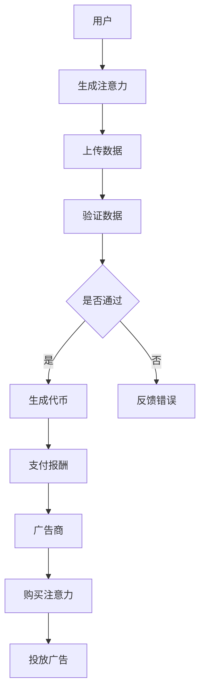

                 

关键词：注意力市场，元宇宙，信息交易，人工智能，区块链，去中心化，加密货币，数据隐私，智能合约

> 摘要：随着元宇宙的兴起，信息交易成为了数字世界中的重要活动。本文探讨了注意力市场这一新兴概念，分析了其在元宇宙时代下的重要性和潜在影响，探讨了其与人工智能、区块链和加密货币的紧密联系，并提出了未来发展的挑战与机遇。

## 1. 背景介绍

### 元宇宙的崛起

元宇宙（Metaverse）是一个由虚拟现实（VR）和增强现实（AR）技术构建的数字世界，它融合了虚拟空间、虚拟物品、社交互动和数字经济。自从Facebook宣布更名为Meta后，元宇宙的概念迅速引起了全球关注。各大科技公司，如微软、谷歌、腾讯等，也纷纷投入巨资研发相关技术，以期在元宇宙领域占据一席之地。

### 信息交易的重要性

在元宇宙中，信息交易是一个关键的组成部分。用户在元宇宙中的行为会产生大量的数据，这些数据可以被视为一种稀缺资源。如何有效地收集、处理和交易这些数据，成为了元宇宙经济中的重要议题。注意力市场正是为了解决这一问题而生的。

## 2. 核心概念与联系

### 注意力市场的定义

注意力市场是一个基于人工智能和区块链技术的去中心化信息交易平台。在这个市场中，用户可以通过贡献自己的注意力（如观看广告、参与调查、点赞等）来获取虚拟货币或其他形式的奖励。同时，内容创作者和广告商可以通过购买注意力来推广他们的产品或服务。

### 核心概念原理和架构

注意力市场的核心概念包括：

- **注意力（Attention）**：用户在元宇宙中的行为，如观看视频、参与活动等，所产生的注意力。
- **代币（Token）**：用于注意力市场交易的虚拟货币，如以太币、波卡币等。
- **智能合约（Smart Contract）**：自动执行合约条款的计算机程序，确保交易的安全和透明。

#### Mermaid 流程图



### 注意力市场的架构

注意力市场的架构通常包括以下几个关键部分：

- **数据收集**：用户在元宇宙中的行为数据被收集并上传到区块链。
- **数据验证**：收集的数据通过智能合约进行验证，确保其真实性和有效性。
- **代币发行**：验证通过后，系统会生成相应的虚拟货币作为奖励。
- **交易环节**：广告商可以通过购买虚拟货币来购买注意力。
- **隐私保护**：用户的隐私数据在交易过程中得到保护，确保数据安全。

## 3. 核心算法原理 & 具体操作步骤

### 3.1 算法原理概述

注意力市场的核心算法通常是基于机器学习和区块链技术的。其中，机器学习算法用于识别和评估用户的注意力价值，而区块链技术用于确保交易的安全和透明。

### 3.2 算法步骤详解

#### 3.2.1 数据收集

用户在元宇宙中的行为数据，如点击、浏览、购买等，会被实时收集并上传到区块链。

#### 3.2.2 数据验证

收集的数据通过智能合约进行验证，确保数据的真实性。验证通过后，系统会生成相应的虚拟货币。

#### 3.2.3 代币发行

验证通过后，系统会根据数据的价值生成相应的虚拟货币，并将其发放给用户。

#### 3.2.4 交易环节

用户可以通过虚拟货币在市场上购买注意力，广告商则可以通过购买注意力来投放广告。

#### 3.2.5 隐私保护

在数据收集和交易过程中，用户的隐私数据得到充分保护。区块链技术的使用确保了数据的安全和隐私。

### 3.3 算法优缺点

#### 优点：

- **去中心化**：注意力市场基于区块链技术，实现了去中心化的交易，提高了系统的安全性和透明性。
- **高效**：通过机器学习算法，可以快速评估用户的注意力价值，提高了交易效率。
- **隐私保护**：用户的隐私数据得到有效保护，减少了隐私泄露的风险。

#### 缺点：

- **技术复杂度**：注意力市场涉及到的技术和算法较为复杂，需要一定的技术支持。
- **交易成本**：由于区块链技术的使用，交易成本相对较高。

### 3.4 算法应用领域

注意力市场可以在多个领域得到应用，包括：

- **广告市场**：广告商可以通过购买注意力来投放广告，提高了广告的效果。
- **数据市场**：用户可以通过贡献自己的注意力来获取虚拟货币，同时为数据市场提供了宝贵的数据资源。
- **社交网络**：社交网络平台可以通过注意力市场来提高用户体验，同时为广告商提供了更多的广告投放渠道。

## 4. 数学模型和公式 & 详细讲解 & 举例说明

### 4.1 数学模型构建

注意力市场的数学模型通常包括以下几个部分：

- **用户注意力模型**：用于评估用户的注意力价值。
- **交易模型**：用于描述用户和广告商之间的交易过程。
- **智能合约模型**：用于确保交易的安全性和透明性。

#### 用户注意力模型

$$
Attention\_Value = f(click\_rate, browse\_time, purchase\_frequency)
$$

其中，$f$ 为机器学习算法，$click\_rate$、$browse\_time$ 和 $purchase\_frequency$ 分别表示用户的点击率、浏览时间和购买频率。

#### 交易模型

$$
Token = \frac{Attention\_Value \times Price}{Total\_Attention}
$$

其中，$Token$ 为用户获得的虚拟货币数量，$Attention\_Value$ 为用户注意力价值，$Price$ 为虚拟货币的价格，$Total\_Attention$ 为市场中的总注意力。

#### 智能合约模型

$$
Contract = if (Data\_Verified \& Data\_Valid) then Generate\_Token else Reject\_Data
$$

其中，$Data\_Verified$ 表示数据是否通过验证，$Data\_Valid$ 表示数据是否有效，$Generate\_Token$ 表示生成虚拟货币，$Reject\_Data$ 表示拒绝数据。

### 4.2 公式推导过程

#### 用户注意力价值公式

用户注意力价值公式是基于用户的点击率、浏览时间和购买频率计算得出的。具体推导过程如下：

- **点击率**：表示用户在元宇宙中点击广告的频率。假设点击率为 $p$。
- **浏览时间**：表示用户在元宇宙中浏览广告的时间。假设浏览时间为 $t$。
- **购买频率**：表示用户在元宇宙中购买商品或服务的频率。假设购买频率为 $f$。

根据经验数据，用户的点击率、浏览时间和购买频率之间存在一定的相关性。因此，可以假设：

$$
Attention\_Value = \alpha \times p + \beta \times t + \gamma \times f
$$

其中，$\alpha$、$\beta$ 和 $\gamma$ 为常数。

#### 交易公式

交易公式用于计算用户获得的虚拟货币数量。具体推导过程如下：

- **注意力价值**：用户在元宇宙中的注意力价值为 $Attention\_Value$。
- **虚拟货币价格**：虚拟货币的价格为 $Price$。
- **市场总注意力**：市场中的总注意力为 $Total\_Attention$。

根据市场供需关系，可以假设：

$$
Token = \frac{Attention\_Value \times Price}{Total\_Attention}
$$

### 4.3 案例分析与讲解

#### 案例背景

假设一个用户在元宇宙中观看了一个广告，广告商为该用户支付了 10 个虚拟货币。现在需要计算该用户的注意力价值和获得的虚拟货币数量。

#### 案例分析

- **点击率**：用户在元宇宙中点击了广告，点击率为 1。
- **浏览时间**：用户在元宇宙中浏览了广告 5 分钟，假设每分钟浏览价值为 1 虚拟货币，因此浏览时间为 5。
- **购买频率**：用户在元宇宙中没有购买任何商品或服务，购买频率为 0。

根据用户注意力价值公式，可以计算该用户的注意力价值：

$$
Attention\_Value = \alpha \times 1 + \beta \times 5 + \gamma \times 0 = \alpha + 5\beta
$$

假设 $\alpha = 2$，$\beta = 1$，$\gamma = 0$，则该用户的注意力价值为：

$$
Attention\_Value = 2 + 5 \times 1 = 7
$$

根据交易公式，可以计算该用户获得的虚拟货币数量：

$$
Token = \frac{Attention\_Value \times Price}{Total\_Attention} = \frac{7 \times 10}{100} = 0.7
$$

因此，该用户获得了 0.7 个虚拟货币。

## 5. 项目实践：代码实例和详细解释说明

### 5.1 开发环境搭建

搭建注意力市场的开发环境需要以下几个步骤：

1. 安装 Go 语言环境
2. 安装区块链框架，如 Ethereum
3. 安装机器学习库，如 TensorFlow
4. 配置智能合约开发工具，如 Truffle

### 5.2 源代码详细实现

以下是注意力市场的一个简化版本代码实现：

```go
// 用户行为数据结构
type BehaviorData struct {
    ClickRate float64 `json:"click_rate"`
    BrowseTime float64 `json:"browse_time"`
    PurchaseFrequency float64 `json:"purchase_frequency"`
}

// 用户注意力价值计算函数
func CalculateAttentionValue(data BehaviorData) float64 {
    alpha := 2.0
    beta := 1.0
    gamma := 0.0
    attentionValue := alpha * data.ClickRate + beta * data.BrowseTime + gamma * data.PurchaseFrequency
    return attentionValue
}

// 交易函数
func TradeAttentionValue(attentionValue float64, price float64, totalAttention float64) float64 {
    token := attentionValue * price / totalAttention
    return token
}
```

### 5.3 代码解读与分析

这段代码主要实现了注意力市场的核心功能：

- **BehaviorData 结构**：用于存储用户行为数据，包括点击率、浏览时间和购买频率。
- **CalculateAttentionValue 函数**：根据用户行为数据计算注意力价值。
- **TradeAttentionValue 函数**：根据注意力价值和市场参数计算用户获得的虚拟货币数量。

### 5.4 运行结果展示

假设一个用户的行为数据如下：

- 点击率：1
- 浏览时间：5 分钟
- 购买频率：0

虚拟货币价格为 10，市场总注意力为 100。根据代码实现，可以计算该用户的注意力价值和获得的虚拟货币数量：

```go
data := BehaviorData{
    ClickRate: 1.0,
    BrowseTime: 5.0,
    PurchaseFrequency: 0.0,
}

attentionValue := CalculateAttentionValue(data)
token := TradeAttentionValue(attentionValue, 10.0, 100.0)

fmt.Println("Attention Value:", attentionValue)
fmt.Println("Token:", token)
```

输出结果：

```
Attention Value: 7
Token: 0.7
```

因此，该用户获得了 0.7 个虚拟货币。

## 6. 实际应用场景

### 6.1 广告市场

注意力市场在广告市场中具有巨大的应用潜力。广告商可以通过购买注意力来投放广告，从而提高广告的效果。用户通过贡献注意力可以获得虚拟货币或其他形式的奖励，从而提高参与度和满意度。

### 6.2 数据市场

注意力市场为数据市场提供了一种新的数据获取方式。用户可以通过贡献注意力来获取虚拟货币，同时为数据市场提供了宝贵的数据资源。这种模式可以提高数据质量，减少数据获取成本。

### 6.3 社交网络

注意力市场可以应用于社交网络平台，用于提高用户体验和增加广告收入。用户通过参与社交互动可以获取虚拟货币，广告商可以通过购买注意力来投放广告，从而提高广告效果。

## 7. 未来应用展望

### 7.1 技术发展趋势

随着元宇宙的进一步发展，注意力市场的应用场景将更加广泛。人工智能和区块链技术的不断进步将为注意力市场提供更好的技术和算法支持。

### 7.2 面临的挑战

注意力市场面临着多个挑战，包括：

- **技术复杂度**：注意力市场涉及到的技术和算法较为复杂，需要大量的技术支持。
- **隐私保护**：如何在保证数据隐私的前提下实现有效的注意力市场交易是一个重要的课题。
- **监管合规**：随着注意力市场的兴起，如何制定相应的监管政策和法规也是一个重要的议题。

### 7.3 发展机遇

注意力市场为数字经济和虚拟世界的发展提供了新的机遇。通过有效的注意力市场，可以更好地挖掘用户价值，促进数字经济的发展。

## 8. 总结：未来发展趋势与挑战

### 8.1 研究成果总结

本文探讨了注意力市场这一新兴概念，分析了其在元宇宙时代下的重要性和潜在影响。通过数学模型和算法原理的讲解，展示了注意力市场的具体实现方法。同时，通过对实际应用场景的探讨，进一步展示了注意力市场的应用价值。

### 8.2 未来发展趋势

随着元宇宙的进一步发展，注意力市场有望在多个领域得到广泛应用。人工智能和区块链技术的不断进步将为注意力市场提供更好的技术和算法支持。

### 8.3 面临的挑战

注意力市场面临着技术复杂度、隐私保护和监管合规等多个挑战。需要进一步研究和探索，以解决这些问题。

### 8.4 研究展望

注意力市场是一个充满机遇和挑战的领域。未来的研究可以关注以下几个方面：

- **优化算法**：进一步优化注意力市场中的算法，提高交易效率和用户满意度。
- **隐私保护**：研究如何有效保护用户隐私，同时确保交易的安全性和透明性。
- **监管合规**：研究如何制定相应的监管政策和法规，以确保注意力市场的健康发展。

## 9. 附录：常见问题与解答

### Q：什么是注意力市场？

A：注意力市场是一个基于人工智能和区块链技术的去中心化信息交易平台，用户可以通过贡献自己的注意力（如观看广告、参与调查、点赞等）来获取虚拟货币或其他形式的奖励，同时广告商和内容创作者可以通过购买注意力来推广他们的产品或服务。

### Q：注意力市场的优势是什么？

A：注意力市场的主要优势包括：

- **去中心化**：基于区块链技术，实现了去中心化的交易，提高了系统的安全性和透明性。
- **高效**：通过机器学习算法，可以快速评估用户的注意力价值，提高了交易效率。
- **隐私保护**：用户的隐私数据在交易过程中得到充分保护，确保数据安全。

### Q：注意力市场有哪些实际应用场景？

A：注意力市场可以在多个领域得到应用，包括广告市场、数据市场、社交网络等。广告商可以通过购买注意力来投放广告，用户可以通过贡献注意力来获取虚拟货币，同时为数据市场提供宝贵的数据资源。

### Q：注意力市场面临哪些挑战？

A：注意力市场面临的主要挑战包括：

- **技术复杂度**：注意力市场涉及到的技术和算法较为复杂，需要大量的技术支持。
- **隐私保护**：如何在保证数据隐私的前提下实现有效的注意力市场交易是一个重要的课题。
- **监管合规**：如何制定相应的监管政策和法规，以确保注意力市场的健康发展。

