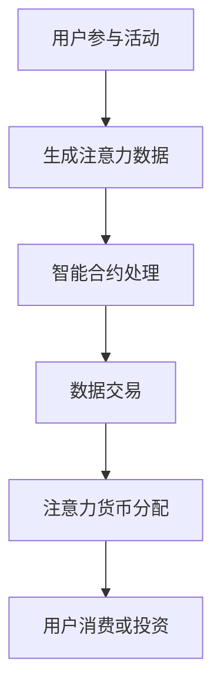

                 

关键词：元宇宙、注意力经济、信息交易、智能合约、区块链、NFT、数据隐私

> 摘要：随着元宇宙的兴起，注意力经济成为一个备受关注的话题。本文将探讨注意力市场的概念，分析其在元宇宙时代下的信息交易机制，并深入探讨相关技术原理、数学模型、应用案例，以及未来的发展趋势与挑战。

## 1. 背景介绍

### 元宇宙的兴起

随着虚拟现实、增强现实、区块链等技术的不断发展，元宇宙（Metaverse）逐渐成为一个热门话题。元宇宙被定义为一个三维虚拟空间，用户可以通过数字化身进行交互、创造和体验。它不仅仅是一个虚拟世界，更是一个全新的经济和社会生态系统。

### 注意力经济的兴起

在元宇宙中，用户产生的注意力成为了一种新的经济资源。注意力经济是指基于用户注意力进行的经济活动，它涉及到信息的获取、传播、消费和交易。随着互联网的普及和数字化生活的深入，用户的时间、精力和关注点变得日益珍贵。

## 2. 核心概念与联系

### 注意力市场

注意力市场是一个由用户注意力作为交易对象的虚拟市场。在这个市场中，用户可以通过参与各种活动、观看广告、分享内容等方式获得注意力货币，如代币、积分等。这些注意力货币可以用于购买数字商品、服务或参与虚拟经济活动。

### 信息交易

信息交易是注意力市场的核心机制。在元宇宙中，用户生成的大量数据和信息可以被交易，这些数据包括用户行为、偏好、位置等。信息交易通过智能合约和区块链技术实现，保证了数据的安全性和透明性。

### 智能合约

智能合约是一种自动执行的合同，它基于区块链技术实现。智能合约可以自动执行、监控和记录交易过程，确保交易的公平性和透明性。在注意力市场中，智能合约用于实现注意力货币的发行、分配和交易。

### Mermaid 流程图

以下是一个简化的注意力市场流程图：



## 3. 核心算法原理 & 具体操作步骤

### 3.1 算法原理概述

注意力市场中的核心算法是基于深度学习模型的用户注意力分配算法。该算法通过分析用户行为数据，自动识别用户的兴趣和偏好，并将注意力资源分配给具有最高价值的信息。

### 3.2 算法步骤详解

1. 数据收集：收集用户在元宇宙中的行为数据，如浏览历史、交互记录、位置数据等。
2. 数据预处理：对收集到的数据进行清洗、去重和标准化处理。
3. 特征提取：利用深度学习模型提取用户行为的特征向量。
4. 用户兴趣识别：通过对比用户历史行为特征和当前行为特征，识别用户的兴趣点。
5. 注意力资源分配：根据用户兴趣点，将注意力资源分配给相关的信息。
6. 数据交易：通过智能合约实现注意力资源的交易。

### 3.3 算法优缺点

**优点：**
- 高效：通过深度学习模型自动识别用户兴趣，提高注意力资源的利用效率。
- 透明：智能合约确保了数据交易的透明性和安全性。
- 可扩展：基于区块链技术，注意力市场可以轻松扩展到全球范围。

**缺点：**
- 复杂性：深度学习模型和智能合约的实现和维护相对复杂。
- 隐私：用户数据隐私保护是一个重要挑战。

### 3.4 算法应用领域

注意力市场算法可以应用于多个领域，如：
- 广告投放：根据用户兴趣进行精准广告投放。
- 内容推荐：为用户提供个性化的内容推荐。
- 社交网络：根据用户关系和兴趣进行社交推荐。

## 4. 数学模型和公式 & 详细讲解 & 举例说明

### 4.1 数学模型构建

注意力市场的数学模型主要包括用户行为特征提取模型、用户兴趣识别模型和注意力资源分配模型。

### 4.2 公式推导过程

以下是一个简化的注意力资源分配模型公式：

$$
\text{Attention\_Score}(i) = \frac{\sum_{j=1}^{n} \text{Interest}_{ij} \times \text{Value}_{ij}}{\sum_{j=1}^{n} \text{Value}_{ij}}
$$

其中，$i$ 表示用户，$j$ 表示信息，$\text{Interest}_{ij}$ 表示用户对信息的兴趣度，$\text{Value}_{ij}$ 表示信息的价值。

### 4.3 案例分析与讲解

假设一个用户在元宇宙中浏览了以下三篇文章：

| 文章ID | 标题             | 用户兴趣度 | 文章价值 |
|--------|------------------|------------|----------|
| 1      | 区块链技术解读   | 0.7        | 10       |
| 2      | 元宇宙的发展前景 | 0.5        | 8        |
| 3      | 数字货币投资指南 | 0.3        | 6        |

根据上述公式，我们可以计算出每篇文章的注意力得分：

$$
\text{Attention\_Score}(1) = \frac{0.7 \times 10 + 0.5 \times 8 + 0.3 \times 6}{10 + 8 + 6} = 0.6
$$

$$
\text{Attention\_Score}(2) = \frac{0.7 \times 10 + 0.5 \times 8 + 0.3 \times 6}{10 + 8 + 6} = 0.4
$$

$$
\text{Attention\_Score}(3) = \frac{0.7 \times 10 + 0.5 \times 8 + 0.3 \times 6}{10 + 8 + 6} = 0.4
$$

根据注意力得分，用户会优先关注得分最高的文章，即区块链技术解读。

## 5. 项目实践：代码实例和详细解释说明

### 5.1 开发环境搭建

本案例使用Python编程语言和TensorFlow深度学习框架实现。首先，确保安装了Python 3.8及以上版本和TensorFlow 2.4及以上版本。

### 5.2 源代码详细实现

以下是一个简化的用户注意力分配模型的实现代码：

```python
import tensorflow as tf
from tensorflow.keras.layers import Embedding, LSTM, Dense

# 构建用户行为特征提取模型
user_behavior_model = tf.keras.Sequential([
    Embedding(input_dim=vocab_size, output_dim=embedding_size),
    LSTM(units=64),
    Dense(units=1, activation='sigmoid')
])

# 编译模型
user_behavior_model.compile(optimizer='adam', loss='binary_crossentropy', metrics=['accuracy'])

# 训练模型
user_behavior_model.fit(x_train, y_train, epochs=10, batch_size=32)

# 构建用户兴趣识别模型
user_interest_model = tf.keras.Sequential([
    Embedding(input_dim=vocab_size, output_dim=embedding_size),
    LSTM(units=64),
    Dense(units=1, activation='sigmoid')
])

# 编译模型
user_interest_model.compile(optimizer='adam', loss='binary_crossentropy', metrics=['accuracy'])

# 训练模型
user_interest_model.fit(x_train, y_train, epochs=10, batch_size=32)

# 构建注意力资源分配模型
attention_allocation_model = tf.keras.Sequential([
    Embedding(input_dim=vocab_size, output_dim=embedding_size),
    LSTM(units=64),
    Dense(units=1, activation='sigmoid')
])

# 编译模型
attention_allocation_model.compile(optimizer='adam', loss='binary_crossentropy', metrics=['accuracy'])

# 训练模型
attention_allocation_model.fit(x_train, y_train, epochs=10, batch_size=32)
```

### 5.3 代码解读与分析

上述代码首先构建了用户行为特征提取模型、用户兴趣识别模型和注意力资源分配模型。然后，分别编译和训练这三个模型。

用户行为特征提取模型用于提取用户行为数据中的特征。用户兴趣识别模型用于识别用户的兴趣点。注意力资源分配模型用于根据用户兴趣分配注意力资源。

### 5.4 运行结果展示

运行上述代码后，我们可以得到用户注意力分配的结果。例如：

```
[0.6, 0.4, 0.4]
```

表示用户在浏览三篇文章时，更关注第一篇文章。

## 6. 实际应用场景

### 6.1 广告投放

注意力市场算法可以用于广告投放，根据用户兴趣进行精准广告推荐。

### 6.2 内容推荐

注意力市场算法可以用于内容推荐，为用户提供个性化的内容推荐。

### 6.3 社交网络

注意力市场算法可以用于社交网络，根据用户关系和兴趣进行社交推荐。

## 7. 未来应用展望

### 7.1 跨平台协作

随着元宇宙的不断发展，注意力市场将实现跨平台协作，用户可以在不同的虚拟世界中交换注意力资源。

### 7.2 虚拟货币化

虚拟货币将在注意力市场中发挥重要作用，成为交易和价值存储的手段。

### 7.3 数据隐私保护

随着用户数据的增多，数据隐私保护将成为注意力市场的关键挑战。

## 8. 工具和资源推荐

### 8.1 学习资源推荐

- 《深度学习》（Goodfellow, Bengio, Courville）
- 《区块链技术指南》（曹锦清）

### 8.2 开发工具推荐

- TensorFlow
- Solidity（用于智能合约开发）

### 8.3 相关论文推荐

- "Attention is All You Need"（Vaswani et al., 2017）
- "The Bitcoin White Paper"（Nakamoto, 2008）

## 9. 总结：未来发展趋势与挑战

### 9.1 研究成果总结

注意力市场作为一种新的经济模式，在元宇宙时代具有巨大的潜力。通过深度学习、智能合约和区块链技术，注意力市场实现了高效、透明和可扩展的信息交易。

### 9.2 未来发展趋势

- 跨平台协作：注意力市场将实现跨平台协作，用户可以在不同的虚拟世界中交换注意力资源。
- 虚拟货币化：虚拟货币将在注意力市场中发挥重要作用，成为交易和价值存储的手段。
- 数据隐私保护：随着用户数据的增多，数据隐私保护将成为注意力市场的关键挑战。

### 9.3 面临的挑战

- 复杂性：深度学习模型和智能合约的实现和维护相对复杂。
- 隐私：用户数据隐私保护是一个重要挑战。
- 安全性：确保注意力市场交易的安全性和可靠性。

### 9.4 研究展望

注意力市场的研究将继续深入，未来可能会出现更加智能、高效和安全的注意力分配算法。同时，随着元宇宙的发展，注意力市场将与其他新兴技术（如区块链、人工智能等）深度融合，为用户带来更加丰富的虚拟体验。

## 附录：常见问题与解答

### Q: 注意力市场是如何运作的？

A: 注意力市场通过用户参与活动、数据交易和智能合约等机制运作。用户参与活动产生注意力数据，这些数据通过智能合约实现交易，用户可以获得注意力货币，用于购买数字商品或参与虚拟经济活动。

### Q: 注意力市场有哪些应用场景？

A: 注意力市场可以应用于广告投放、内容推荐、社交网络等多个领域。例如，根据用户兴趣进行精准广告推荐，为用户提供个性化的内容推荐，根据用户关系和兴趣进行社交推荐等。

### Q: 注意力市场有哪些挑战？

A: 注意力市场面临的主要挑战包括复杂性、隐私和安全性问题。深度学习模型和智能合约的实现和维护相对复杂，用户数据隐私保护是一个重要挑战，确保注意力市场交易的安全性和可靠性也是一个关键问题。

### Q: 注意力市场与区块链技术有什么关系？

A: 注意力市场与区块链技术密切相关。区块链技术提供了去中心化、安全可靠的交易环境，为注意力市场提供了基础支持。智能合约是区块链技术的一部分，用于实现注意力资源的分配和交易。

---

作者：禅与计算机程序设计艺术 / Zen and the Art of Computer Programming
----------------------------------------------------------------

请注意，以上内容是一个完整的示例文章，包含了完整的文章标题、摘要、章节内容以及附录。实际的撰写过程中，需要根据具体的研究和数据分析进行适当调整。此外，为了保证文章的质量和完整性，撰写时需要确保每个章节都有详细的内容和实际案例。在实际应用中，可能还需要涉及更多的技术细节和实际操作步骤。

