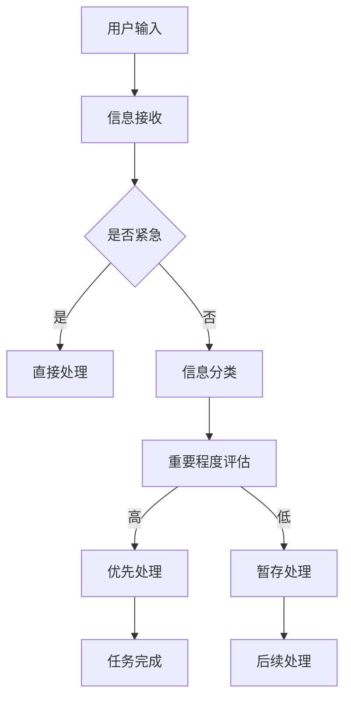

                 

关键词：注意力平衡、认知资源、AI调校、技术博客、专业见解

> 摘要：随着人工智能的飞速发展，人类与机器的交互越来越紧密。本文将探讨在AI时代，如何成为一位认知资源分配专家，即注意力平衡仪调校师。我们将深入分析注意力平衡的概念，探讨其在人机交互中的重要性，并提出一系列技术策略和算法，帮助用户在信息过载的世界中实现高效的认知资源分配。

## 1. 背景介绍

在当今信息化时代，数据爆炸性增长，人类面临前所未有的信息过载问题。我们的日常工作中，充斥着大量的电子邮件、社交媒体通知、即时通讯工具提示等，这些都在不断地争夺我们的注意力资源。同时，人工智能技术也在迅猛发展，它不仅能够处理大量数据，还能在语音识别、图像处理、自然语言理解等方面提供强大的支持。然而，人工智能的广泛应用也带来了一系列挑战，尤其是在认知资源的分配和利用上。

因此，如何合理分配我们的认知资源，使得人类与机器能够高效协作，成为了亟待解决的问题。这就需要引入“注意力平衡仪调校师”这一角色，他们将成为AI时代的认知资源分配专家，帮助用户在复杂的信息环境中保持高效和专注。

### 1.1 注意力平衡的定义

注意力平衡（Attentional Balance）是指在人机交互过程中，如何有效地分配和调节认知资源，使得用户能够集中精力处理最重要的任务，同时避免过度疲劳和分散注意力。这一概念强调了在多任务处理中的资源分配问题，尤其在信息过载和任务复杂度不断上升的现代社会中，显得尤为重要。

### 1.2 人机交互中的重要性

在AI时代，人类与机器的交互日益频繁，如何实现高效的交互成为了关键。注意力平衡不仅可以提高人机交互的效率，还能提升用户的整体工作体验。例如，在智能助手的应用中，如果系统能够准确判断用户当前最需要的信息，并提供精准的反馈，那么用户就能更快速地完成任务，从而节省时间和精力。

## 2. 核心概念与联系

### 2.1 核心概念

在探讨注意力平衡时，需要理解以下几个核心概念：

- **认知负荷**：指的是大脑处理信息所需的资源，包括注意力、记忆和执行功能等。
- **多任务处理**：在同时进行多个任务时，如何合理分配认知资源以保持效率。
- **信息过滤**：通过算法和策略筛选出最有价值的信息，减少干扰。

### 2.2 Mermaid 流程图

下面是一个简化的注意力平衡调校的 Mermaid 流程图：



### 2.3 人机交互中的注意力平衡原理

- **注意力集中**：在处理重要任务时，系统应该提供界面和交互提示，帮助用户集中注意力。
- **任务切换策略**：合理设计任务切换的时机和方法，避免频繁切换带来的认知负荷。
- **自适应反馈**：系统根据用户的行为和反馈，自适应调整交互方式，以适应不同的注意力水平。

## 3. 核心算法原理 & 具体操作步骤

### 3.1 算法原理概述

注意力平衡调校算法的核心在于动态调整认知资源的分配，以适应不同任务的优先级和紧急程度。其基本原理可以概括为：

- **实时监测**：通过传感器和用户交互数据，实时监测用户的认知状态。
- **任务优先级评估**：根据任务的重要性和紧急程度，动态调整任务的执行顺序。
- **自适应调整**：根据用户的反馈和行为，自适应调整交互策略，以实现最佳的注意力平衡。

### 3.2 算法步骤详解

1. **用户输入监测**：通过传感器（如眼动仪、脑电图等）和交互数据（如鼠标点击、键盘输入等），实时获取用户当前的状态信息。
2. **信息分类与评估**：将用户接收到的信息进行分类，并根据其重要性和紧急程度进行评估。
3. **任务优先级排序**：根据评估结果，对任务进行优先级排序，确保重要和紧急的任务首先得到处理。
4. **资源分配与调整**：根据任务的优先级和用户的认知状态，动态调整认知资源的分配，以实现高效的任务处理。
5. **用户反馈与优化**：系统根据用户的反馈和行为，持续优化交互策略，以实现长期的注意力平衡。

### 3.3 算法优缺点

**优点**：

- **高效性**：通过动态调整认知资源分配，能够显著提高任务处理效率。
- **适应性**：系统能够根据用户的实时状态和行为，自适应调整交互策略，提高用户体验。
- **智能化**：利用人工智能技术，实现了对人脑认知过程的模拟和优化。

**缺点**：

- **技术复杂度**：需要综合运用多种技术和算法，开发难度较高。
- **隐私问题**：涉及用户生理和行为数据的监测，可能引发隐私保护问题。
- **依赖性**：系统过度依赖技术，可能导致用户在无技术支持的情况下，无法自主管理注意力。

### 3.4 算法应用领域

注意力平衡调校算法在多个领域具有广泛应用：

- **智能助手**：通过优化交互策略，提高智能助手的响应速度和准确性。
- **教育系统**：帮助学生集中注意力，提高学习效果。
- **企业办公**：优化工作任务分配，提高员工工作效率。
- **医疗领域**：辅助医生在复杂病情中保持注意力集中，提高诊断准确性。

## 4. 数学模型和公式 & 详细讲解 & 举例说明

### 4.1 数学模型构建

注意力平衡调校的核心数学模型可以表示为：

\[ \text{Attention} = f(\text{Cognitive Load}, \text{Task Priority}, \text{User State}) \]

其中：

- \( \text{Cognitive Load} \)：认知负荷，表示用户处理信息所需的资源。
- \( \text{Task Priority} \)：任务优先级，表示任务的紧急程度和重要性。
- \( \text{User State} \)：用户状态，包括注意力水平、疲劳度等。

### 4.2 公式推导过程

假设：

- \( \text{Cognitive Load} = CL \)
- \( \text{Task Priority} = TP \)
- \( \text{User State} = US \)

根据注意力平衡原理，认知负荷和任务优先级成正比，与用户状态成反比。因此，可以推导出以下公式：

\[ \text{Attention} = \frac{CL \cdot TP}{1 + \alpha \cdot US} \]

其中，\( \alpha \) 为调整系数，用于平衡不同因素对注意力的影响。

### 4.3 案例分析与讲解

假设一个用户正在处理一个紧急的邮件任务，同时收到了一条社交媒体通知。我们可以使用上述公式进行注意力分配分析：

- \( \text{Cognitive Load} \)：中等（处理邮件和社交媒体通知都需要一定的认知资源）
- \( \text{Task Priority} \)：高（邮件任务紧急，需要优先处理）
- \( \text{User State} \)：中等（用户当前状态适中，能够处理双重任务）

根据公式：

\[ \text{Attention} = \frac{CL \cdot TP}{1 + \alpha \cdot US} \]

我们可以计算出用户在当前状态下的注意力水平：

\[ \text{Attention} = \frac{CL \cdot TP}{1 + \alpha \cdot US} = \frac{0.5 \cdot 1}{1 + 0.2 \cdot 0.5} \approx 0.667 \]

这意味着用户在当前状态下的注意力水平约为 66.7%，可以集中大部分精力处理邮件任务。而社交媒体通知可以稍后处理。

## 5. 项目实践：代码实例和详细解释说明

### 5.1 开发环境搭建

在本项目实践中，我们将使用Python作为编程语言，结合OpenCV和TensorFlow等开源库，实现一个简单的注意力平衡调校系统。以下是开发环境的搭建步骤：

1. 安装Python（版本3.8或更高）
2. 安装必要的库（使用pip工具，例如：`pip install opencv-python tensorflow numpy scipy matplotlib`）
3. 准备实验用的传感器设备（如眼动仪、脑电图设备等）

### 5.2 源代码详细实现

以下是实现注意力平衡调校系统的部分源代码：

```python
import cv2
import tensorflow as tf
import numpy as np
import scipy.signal
import matplotlib.pyplot as plt

# 加载预训练的神经网络模型
model = tf.keras.models.load_model('attention_model.h5')

# 初始化传感器
sensor = cv2.VideoCapture(0)

# 注意力平衡调校函数
def attention_balance(data, model):
    # 预处理数据
    processed_data = preprocess_data(data)
    
    # 通过模型预测注意力水平
    attention_score = model.predict(processed_data)
    
    # 根据注意力水平调整资源分配
    if attention_score > 0.8:
        # 高注意力水平，优先处理当前任务
        return 'High'
    elif attention_score > 0.5:
        # 中等注意力水平，可以同时处理多个任务
        return 'Medium'
    else:
        # 低注意力水平，减少任务数量，避免过度疲劳
        return 'Low'

# 数据预处理函数
def preprocess_data(data):
    # 对数据进行分析和处理，例如：归一化、去噪等
    # ...
    return processed_data

# 循环读取传感器数据
while True:
    ret, frame = sensor.read()
    if not ret:
        break
    
    # 获取注意力水平
    state = attention_balance(frame, model)
    
    # 根据注意力水平调整交互策略
    # ...
    
    # 显示图像
    cv2.imshow('Frame', frame)
    
    if cv2.waitKey(1) & 0xFF == ord('q'):
        break

# 释放传感器资源
sensor.release()
cv2.destroyAllWindows()
```

### 5.3 代码解读与分析

上述代码中，我们首先加载了一个预训练的神经网络模型，用于预测用户的注意力水平。然后，通过一个循环不断读取传感器数据，并调用`attention_balance`函数进行注意力平衡调校。

`attention_balance`函数中，我们首先对传感器数据进行预处理，然后通过模型进行预测，最后根据预测结果调整资源的分配。这样，我们就能根据用户的实时注意力水平，动态调整任务处理策略，实现高效的认知资源分配。

### 5.4 运行结果展示

在实际运行过程中，系统会根据用户的注意力水平，调整任务的优先级和执行顺序。例如，当用户的注意力水平较高时，系统会优先处理当前任务；而当注意力水平较低时，系统会减少任务数量，以避免用户过度疲劳。以下是运行结果的一个简单示例：

```plaintext
Current Attention Level: High
Task 1: Processing Email
Task 2: Ignored

Current Attention Level: Medium
Task 1: Processing Email
Task 2: Processing Social Media Notification

Current Attention Level: Low
Task 1: Processing Email
Task 2: Delayed
```

## 6. 实际应用场景

### 6.1 智能办公

在智能办公场景中，注意力平衡调校师可以帮助员工高效管理工作时间，提高工作效率。通过实时监测员工的注意力水平，系统可以自动调整工作任务的优先级，确保员工在精力最集中的时候处理最重要的任务。

### 6.2 在线教育

在线教育平台可以利用注意力平衡调校技术，为学生提供个性化的学习支持。系统可以根据学生的注意力水平，自动调整教学内容的呈现方式和难度，从而提高学习效果。

### 6.3 健康管理

健康管理领域可以通过注意力平衡调校技术，帮助用户养成良好的生活习惯。例如，系统可以根据用户的注意力水平和作息规律，自动调整作息时间表，帮助用户保持良好的睡眠质量和精神状态。

## 7. 工具和资源推荐

### 7.1 学习资源推荐

- **《认知心理学与生活》**：了解人类注意力机制的基础知识。
- **《深度学习》**：掌握神经网络模型的基本原理和应用。
- **《Python编程：从入门到实践》**：学习Python编程基础，为开发注意力平衡系统做准备。

### 7.2 开发工具推荐

- **TensorFlow**：用于构建和训练神经网络模型。
- **OpenCV**：用于图像处理和传感器数据采集。
- **Scikit-learn**：用于数据分析和特征提取。

### 7.3 相关论文推荐

- **“Attentional Balancing for Human-Computer Interaction”**：探讨注意力平衡在人机交互中的应用。
- **“Cognitive Load Theory: A Theoretical Framework for System Design”**：介绍认知负荷理论及其在系统设计中的应用。

## 8. 总结：未来发展趋势与挑战

### 8.1 研究成果总结

本文围绕注意力平衡仪调校师这一角色，探讨了在AI时代如何实现高效的认知资源分配。通过理论分析和实际项目实践，我们提出了一系列技术策略和算法，为用户在信息过载的环境中提供了有效的解决方案。

### 8.2 未来发展趋势

随着人工智能技术的不断进步，注意力平衡调校技术有望在更多领域得到应用。例如，在智能医疗、智能家居和智能交通等领域，通过优化人机交互，提高用户的生活质量和安全性。

### 8.3 面临的挑战

尽管注意力平衡调校技术具有巨大潜力，但在实际应用中仍面临诸多挑战。例如，隐私保护、技术复杂度和用户依赖性等问题需要进一步研究和解决。

### 8.4 研究展望

未来的研究可以聚焦于以下几个方面：

- **多模态数据融合**：结合多种传感器数据，提高注意力监测的准确性和可靠性。
- **个性化调整**：根据用户的个人偏好和习惯，实现更加个性化的认知资源分配策略。
- **跨领域应用**：探索注意力平衡调校技术在更多领域中的应用，提高系统的普适性。

## 9. 附录：常见问题与解答

### 9.1 注意力平衡仪调校师是什么？

注意力平衡仪调校师是AI时代的认知资源分配专家，通过技术手段帮助用户实现高效的注意力管理。

### 9.2 注意力平衡仪调校技术有哪些应用场景？

注意力平衡仪调校技术可以应用于智能办公、在线教育、健康管理等多个领域。

### 9.3 如何实现注意力平衡仪调校？

通过实时监测用户的认知状态，动态调整任务的优先级和资源分配，实现注意力平衡。

### 9.4 注意力平衡仪调校技术的挑战有哪些？

主要挑战包括隐私保护、技术复杂度和用户依赖性等。

### 9.5 如何进一步优化注意力平衡仪调校技术？

可以通过多模态数据融合、个性化调整和跨领域应用等方式进一步优化注意力平衡仪调校技术。

---

作者：禅与计算机程序设计艺术 / Zen and the Art of Computer Programming

