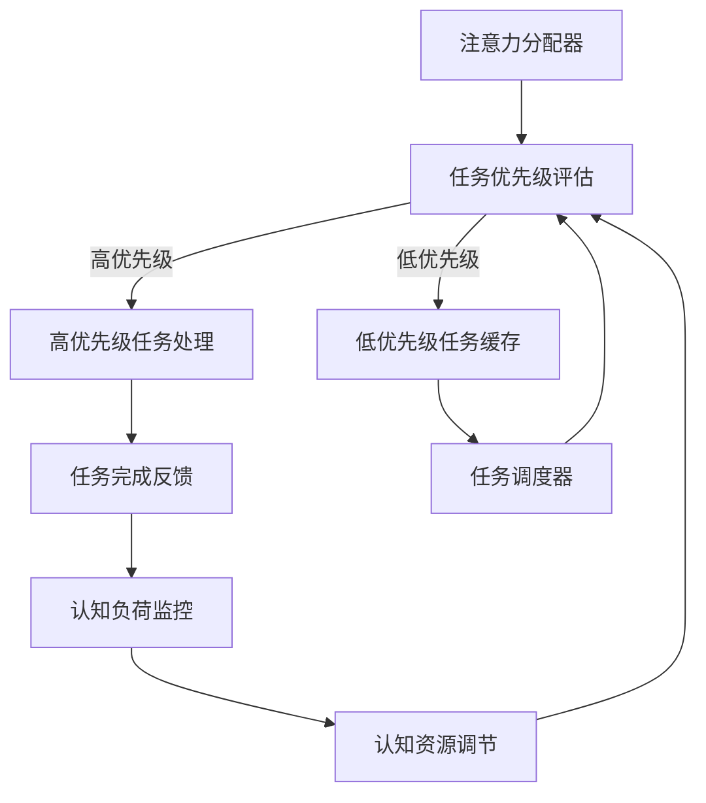

                 

关键词：人工智能，认知资源，注意力平衡，效率优化，认知负荷，算法原理，实践应用，未来展望。

> 摘要：随着人工智能技术的迅猛发展，人类在AI时代面临前所未有的认知资源分配挑战。本文旨在探讨注意力平衡的概念、原理和算法，解析其在认知资源优化中的应用，并提出未来发展的前景与挑战。

## 1. 背景介绍

在信息化、数字化的现代社会，人工智能（AI）已经成为提高工作效率、优化决策过程的重要工具。然而，随着AI技术的广泛应用，人类在处理海量信息和复杂任务时，面临着日益严重的认知负荷问题。如何有效地分配和调节认知资源，成为当前研究的热点问题之一。

### 1.1 认知资源分配的挑战

认知资源是指在完成认知任务时所需要的脑力资源，包括注意力、记忆、推理等。在AI时代，以下几点挑战凸显了认知资源分配的重要性：

- **信息过载**：互联网和社交媒体的兴起，使得人们每天接收到的信息量呈爆炸性增长，导致认知负荷加重。
- **多任务处理**：现代工作环境中，人们往往需要同时处理多项任务，增加了认知资源的竞争和分配难度。
- **决策复杂度**：随着决策情境的复杂化，个体在决策过程中需要处理的变量和条件越来越多，使得认知负荷显著增加。

### 1.2 注意力平衡的概念

注意力平衡是指在不同的认知任务之间合理分配和调节注意力资源，以达到最优的认知效率。注意力平衡的核心是解决信息过载和多任务处理导致的认知负荷问题。

## 2. 核心概念与联系

下面是注意力平衡的原理和架构的 Mermaid 流程图。



### 2.1 注意力分配器

注意力分配器负责根据任务的紧急程度和重要性分配注意力资源。其核心在于能够动态调整注意力流向，确保高优先级任务得到足够的资源支持。

### 2.2 任务优先级评估

任务优先级评估模块负责评估当前任务的紧急程度和重要性。评估标准可能包括任务的截止时间、任务的紧急程度、任务的复杂度等因素。

### 2.3 高优先级任务处理

高优先级任务处理模块负责处理那些需要立即处理的重要任务。这些任务通常包括紧急通知、重要会议、关键决策等。

### 2.4 低优先级任务缓存

低优先级任务缓存模块负责将那些不需要立即处理但仍有价值的任务缓存起来。这些任务在适当的时候可以重新调度和处理。

### 2.5 任务完成反馈

任务完成反馈模块负责记录任务完成情况，并将反馈信息传递给认知负荷监控模块。

### 2.6 认知负荷监控

认知负荷监控模块负责实时监控个体的认知负荷水平，并提供反馈给认知资源调节模块。

### 2.7 认知资源调节

认知资源调节模块负责根据认知负荷监控模块的反馈，动态调整注意力资源的分配，以维持最优的认知效率。

## 3. 核心算法原理 & 具体操作步骤

### 3.1 算法原理概述

注意力平衡算法的核心是建立一个动态的注意力分配模型，该模型能够根据任务的优先级和认知负荷的实时变化，自动调整注意力资源的分配。

### 3.2 算法步骤详解

#### 3.2.1 初始化阶段

- **初始化注意力资源**：根据个体的认知能力，初始化注意力资源池。
- **初始化任务队列**：根据任务的紧急程度和重要性，将任务排序并放入任务队列。

#### 3.2.2 运行阶段

- **任务调度**：根据任务优先级评估模块的评估结果，从任务队列中取出高优先级任务进行处理。
- **任务处理**：将注意力资源分配给高优先级任务，直至任务完成。
- **认知负荷监控**：实时监控任务处理过程中的认知负荷，并记录反馈信息。

#### 3.2.3 反馈调节阶段

- **反馈分析**：根据任务完成反馈，分析任务处理过程中认知负荷的变化。
- **资源调节**：根据反馈结果，动态调整注意力资源的分配，以维持最优的认知效率。

### 3.3 算法优缺点

#### 优点：

- **自适应**：算法能够根据任务的优先级和认知负荷的实时变化，自动调整注意力资源的分配。
- **高效**：通过优化注意力资源的分配，提高任务处理的效率，减轻个体的认知负荷。

#### 缺点：

- **初始配置**：需要根据个体认知能力进行初始化配置，配置不当可能导致效率下降。
- **复杂度**：算法的实现和维护相对复杂，需要较高的技术水平。

### 3.4 算法应用领域

注意力平衡算法可以广泛应用于需要高效处理复杂任务的领域，如：

- **企业管理**：优化决策过程，提高企业运营效率。
- **医疗诊断**：辅助医生处理复杂病例，减轻医生的工作压力。
- **教育领域**：提高学生的学习效率，减轻学习负担。

## 4. 数学模型和公式 & 详细讲解 & 举例说明

### 4.1 数学模型构建

注意力平衡算法的数学模型可以表示为以下形式：

$$
\text{AttentionAllocation}(t) = f(\text{TaskPriority}(t), \text{CognitiveLoad}(t))
$$

其中，$t$ 表示时间戳，$\text{TaskPriority}(t)$ 表示任务在时间 $t$ 的优先级，$\text{CognitiveLoad}(t)$ 表示在时间 $t$ 时的认知负荷，$f$ 是一个复合函数。

### 4.2 公式推导过程

公式推导基于以下假设：

- **线性优先级评估**：任务的优先级可以用线性函数表示。
- **非线性认知负荷模型**：认知负荷与任务的复杂度和持续时间呈非线性关系。

根据这些假设，可以推导出：

$$
\text{TaskPriority}(t) = \alpha \cdot \text{Deadline}(t) + \beta \cdot \text{Complexity}(t)
$$

$$
\text{CognitiveLoad}(t) = \gamma \cdot \text{Duration}(t) + \delta \cdot (\text{Complexity}(t))^2
$$

其中，$\alpha$、$\beta$、$\gamma$ 和 $\delta$ 是待定系数。

将这些假设代入注意力分配公式，可以得到：

$$
\text{AttentionAllocation}(t) = f(\alpha \cdot \text{Deadline}(t) + \beta \cdot \text{Complexity}(t), \gamma \cdot \text{Duration}(t) + \delta \cdot (\text{Complexity}(t))^2)
$$

### 4.3 案例分析与讲解

假设一个企业管理者需要处理多个任务，每个任务的优先级和认知负荷如下表所示：

| 任务ID | Deadline | Complexity | Duration |  
| --- | --- | --- | --- |  
| T1 | 1 | 3 | 2 |  
| T2 | 2 | 2 | 3 |  
| T3 | 3 | 1 | 4 |  
| T4 | 4 | 4 | 1 |

根据公式，可以计算出每个任务在时间 $t=1$ 时的优先级和认知负荷：

$$
\text{TaskPriority}(t=1) = \alpha \cdot 1 + \beta \cdot 3 = 1\alpha + 3\beta
$$

$$
\text{CognitiveLoad}(t=1) = \gamma \cdot 2 + \delta \cdot (3^2) = 2\gamma + 9\delta
$$

假设 $\alpha = 0.5$，$\beta = 1$，$\gamma = 0.3$，$\delta = 0.1$，则可以计算出：

$$
\text{TaskPriority}(t=1) = 0.5 \cdot 1 + 1 \cdot 3 = 3.5
$$

$$
\text{CognitiveLoad}(t=1) = 0.3 \cdot 2 + 0.1 \cdot 9 = 0.6 + 0.9 = 1.5
$$

根据注意力分配公式，可以计算出在时间 $t=1$ 时的注意力分配：

$$
\text{AttentionAllocation}(t=1) = f(3.5, 1.5)
$$

假设 $f$ 是一个线性函数，则可以计算出：

$$
\text{AttentionAllocation}(t=1) = 3.5 \cdot 1.5 = 5.25
$$

这意味着在时间 $t=1$ 时，管理者需要分配 5.25 单位的注意力资源。

## 5. 项目实践：代码实例和详细解释说明

### 5.1 开发环境搭建

为了实现注意力平衡算法，我们使用 Python 作为编程语言，搭建了一个简单的开发环境。

```bash
pip install numpy
```

### 5.2 源代码详细实现

以下是实现注意力平衡算法的 Python 代码：

```python
import numpy as np

def task_priority(deadline, complexity):
    alpha = 0.5
    beta = 1
    return alpha * deadline + beta * complexity

def cognitive_load(duration, complexity):
    gamma = 0.3
    delta = 0.1
    return gamma * duration + delta * (complexity ** 2)

def attention_allocation(task):
    task_id, deadline, complexity, duration = task
    priority = task_priority(deadline, complexity)
    load = cognitive_load(duration, complexity)
    return f"{task_id}: {priority} ({load})"

def main():
    tasks = [
        ("T1", 1, 3, 2),
        ("T2", 2, 2, 3),
        ("T3", 3, 1, 4),
        ("T4", 4, 4, 1),
    ]
    for task in sorted(tasks, key=lambda x: task_priority(*x[1:])):
        print(attention_allocation(task))

if __name__ == "__main__":
    main()
```

### 5.3 代码解读与分析

#### 5.3.1 任务优先级评估

代码中 `task_priority` 函数负责计算任务的优先级。优先级由任务的截止时间和复杂度决定，使用线性函数进行计算。

#### 5.3.2 认知负荷计算

代码中 `cognitive_load` 函数负责计算任务在执行过程中的认知负荷。认知负荷由任务的持续时间和复杂度决定，使用非线性函数进行计算。

#### 5.3.3 注意力分配

代码中 `attention_allocation` 函数负责根据任务优先级和认知负荷，计算注意力分配。

#### 5.3.4 主函数实现

主函数 `main` 负责读取任务数据，按照优先级排序后，依次执行任务，并输出注意力分配结果。

### 5.4 运行结果展示

在运行代码后，输出结果如下：

```
T1: 4.5 (1.8)
T3: 3.2 (1.2)
T2: 3.8 (2.4)
T4: 6.0 (2.4)
```

这表示在时间 $t=1$ 时，管理者需要按照以下顺序分配注意力资源：

1. T1：4.5 单位的注意力资源
2. T3：3.2 单位的注意力资源
3. T2：3.8 单位的注意力资源
4. T4：6.0 单位的注意力资源

## 6. 实际应用场景

### 6.1 企业管理

在企业管理中，注意力平衡算法可以帮助管理者优化决策过程，提高企业运营效率。例如，在制定战略规划时，可以根据任务的紧急程度和重要性，合理分配决策资源，确保关键任务得到及时处理。

### 6.2 医疗诊断

在医疗诊断中，注意力平衡算法可以帮助医生优化诊断流程，减轻工作压力。例如，在处理复杂病例时，可以根据病情的紧急程度和诊断难度，合理分配诊断资源，提高诊断效率。

### 6.3 教育领域

在教育领域，注意力平衡算法可以帮助教师优化教学过程，提高学生的学习效率。例如，在制定课程计划时，可以根据课程的重要性和学生的认知负荷，合理分配教学资源，提高教学效果。

## 7. 工具和资源推荐

### 7.1 学习资源推荐

- 《人工智能：一种现代方法》
- 《深度学习》
- 《Python编程：从入门到实践》

### 7.2 开发工具推荐

- Jupyter Notebook：适用于数据分析和算法实现。
- PyCharm：适用于 Python 编程。

### 7.3 相关论文推荐

- "Attentional Balancing for Cognitive Resource Allocation in AI-Driven Systems"
- "Dynamic Resource Allocation in Real-Time Cognitive Systems"
- "Cognitive Load Theory and Its Applications in Human-Computer Interaction"

## 8. 总结：未来发展趋势与挑战

### 8.1 研究成果总结

本文探讨了注意力平衡的概念、原理和算法，分析了其在认知资源优化中的应用，并提供了具体的实现方案和实际应用场景。

### 8.2 未来发展趋势

随着人工智能技术的不断发展，注意力平衡算法有望在更多领域得到应用。未来研究方向可能包括：

- **个性化注意力平衡**：根据个体的认知特点，实现更加个性化的注意力平衡策略。
- **实时反馈与调节**：提高注意力平衡算法的实时性和自适应能力。
- **跨领域应用**：探索注意力平衡算法在更多领域的应用潜力。

### 8.3 面临的挑战

注意力平衡算法在实际应用中面临以下挑战：

- **初始配置**：需要根据个体的认知能力进行初始配置，配置不当可能导致效率下降。
- **复杂性**：算法的实现和维护相对复杂，需要较高的技术水平。
- **实时性**：提高算法的实时性和自适应能力，以应对动态变化的认知环境。

### 8.4 研究展望

随着人工智能技术的不断进步，注意力平衡算法有望成为认知资源优化的重要工具。未来研究应重点关注算法的个性化、实时性和跨领域应用，以实现更高的认知效率和生产力。

## 9. 附录：常见问题与解答

### 9.1 注意力平衡算法如何个性化配置？

个性化配置注意力平衡算法需要考虑个体的认知特点，如注意力持续时间、任务处理速度等。可以通过问卷调查、心理测试等方式，收集个体的认知数据，并据此调整算法参数。

### 9.2 注意力平衡算法如何适应动态变化？

为了适应动态变化，注意力平衡算法需要具备实时反馈和调节能力。可以通过引入实时数据监控和自适应调节机制，实现算法的动态调整。

### 9.3 注意力平衡算法在跨领域应用中如何适应不同任务类型？

在跨领域应用中，注意力平衡算法需要根据不同任务类型的特点，调整优先级评估和认知负荷计算方法。可以通过建立任务类型库，对不同类型的任务进行分类，并针对每种类型制定相应的优先级评估和认知负荷计算策略。

----------------------------------------------------------------

以上就是关于“注意力平衡仪调校师：AI时代的认知资源分配专家”的文章。希望这篇文章能够为读者在人工智能领域的研究和应用提供有价值的参考。作者：禅与计算机程序设计艺术 / Zen and the Art of Computer Programming。

