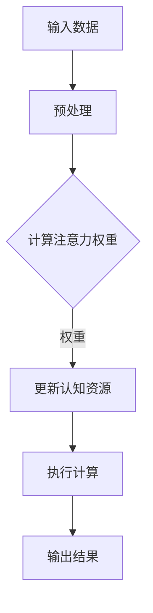

                 

关键词：注意力机制、AI、认知资源、神经科学、算法设计、应用场景、未来展望

## 摘要

在人工智能迅速发展的时代，如何高效利用有限的认知资源成为了一个关键问题。本文旨在探讨注意力平衡仪这一概念，介绍其核心原理、算法设计和应用场景，并展望其在未来AI领域中的潜力与挑战。本文首先回顾了注意力机制在神经科学和计算机科学中的起源，然后详细阐述了注意力平衡仪的架构和操作步骤，接着通过数学模型和公式分析了其工作原理，并给出了具体的代码实例和解释。最后，文章探讨了注意力平衡仪在实际应用场景中的表现，并对未来发展方向和挑战进行了展望。

## 1. 背景介绍

### 注意力机制：神经科学与计算机科学的交汇

注意力机制是神经科学中的一个重要概念，它描述了大脑如何从环境中选择并聚焦于特定信息。早在20世纪60年代，神经科学家开始研究注意力对感知、记忆和学习的影响。随着研究的深入，人们逐渐认识到注意力是一种认知资源，它对大脑处理信息的能力有着至关重要的作用。在计算机科学中，注意力机制也被广泛应用，尤其是在自然语言处理、计算机视觉和机器学习等领域。注意力机制在计算机中的实现，被称为“注意力模型”，它是提升模型性能的关键因素之一。

### 计算机科学中的注意力模型

计算机科学中的注意力模型起源于20世纪80年代的神经网络研究，当时的神经网络主要用于图像识别和语音识别。随着深度学习的兴起，注意力模型得到了进一步的发展和完善。注意力模型通过计算输入数据的权重，使得模型能够自动识别并关注输入数据中的关键信息，从而提高模型的准确性和效率。经典的注意力模型包括自注意力（Self-Attention）和多头注意力（Multi-Head Attention），它们在自然语言处理任务中表现尤为出色。

### AI时代的认知资源分配挑战

随着人工智能技术的不断进步，AI系统需要处理的数据量和复杂性呈指数级增长。然而，人类认知资源是有限的，如何有效地分配和利用这些资源成为了一个亟待解决的问题。传统的计算方法往往依赖于固定的资源分配策略，这可能导致资源分配不均，影响AI系统的性能。因此，设计一种能够动态调整认知资源分配的机制具有重要意义。

## 2. 核心概念与联系

为了更好地理解注意力平衡仪的工作原理，我们需要先介绍一些核心概念，并展示其架构。

### 核心概念

1. **注意力权重**：在注意力模型中，每个输入数据点都会被赋予一个权重，这个权重表示数据点在计算过程中的重要性。
2. **注意力分布**：通过计算注意力权重，可以得到输入数据的一个注意力分布，表示每个数据点的相对重要性。
3. **认知资源**：在AI系统中，认知资源可以理解为计算资源和存储资源的集合，它们决定了模型处理数据的能力。

### 架构与联系

下面是一个简化的注意力平衡仪架构图，用Mermaid流程图表示：



### 详细解释

- **输入数据**：输入数据可以是文本、图像或任何其他形式的数据。
- **预处理**：预处理步骤包括数据清洗、格式转换等，以确保输入数据符合模型的要求。
- **计算注意力权重**：通过计算输入数据的注意力权重，模型可以自动识别关键信息。
- **更新认知资源**：根据注意力权重，动态调整认知资源的分配，使关键信息得到更多关注。
- **执行计算**：利用更新后的认知资源执行计算任务。
- **输出结果**：输出计算结果，可以是预测、分类或任何其他形式。

这个架构展示了注意力平衡仪如何通过计算注意力权重，动态调整认知资源分配，从而提高AI系统的效率和准确性。

## 3. 核心算法原理 & 具体操作步骤

### 3.1 算法原理概述

注意力平衡仪的核心算法基于自注意力机制，它通过计算输入数据的注意力权重，动态调整认知资源的分配。具体来说，算法分为以下几个步骤：

1. **初始化**：初始化认知资源分配，通常采用均匀分配策略。
2. **计算注意力权重**：使用自注意力机制计算输入数据的注意力权重。
3. **更新认知资源**：根据注意力权重，动态调整认知资源的分配。
4. **执行计算**：利用更新后的认知资源执行计算任务。
5. **输出结果**：输出计算结果，并反馈到下一个计算周期。

### 3.2 算法步骤详解

#### 步骤1：初始化

初始化认知资源分配，通常采用均匀分配策略。具体来说，将所有认知资源平均分配给每个输入数据点。

```python
# 初始化认知资源
num_inputs = 100  # 假设输入数据有100个
initial_resources = [1/num_inputs] * num_inputs
```

#### 步骤2：计算注意力权重

使用自注意力机制计算输入数据的注意力权重。自注意力机制通过计算输入数据的点积，得到一个注意力权重矩阵。具体公式如下：

$$
\text{Attention}(Q, K, V) = \text{softmax}\left(\frac{QK^T}{\sqrt{d_k}}\right) V
$$

其中，$Q$、$K$ 和 $V$ 分别表示查询（Query）、键（Key）和值（Value）向量，$d_k$ 表示键向量的维度。

```python
import tensorflow as tf

# 假设输入数据为100个向量
inputs = tf.random.normal([100, 128])  # 输入数据维度为128

# 计算注意力权重
query = inputs
key = inputs
value = inputs
attention_weights = tf.matmul(query, key, transpose_b=True) / tf.sqrt(tf.cast(key.shape[-1], tf.float32))
attention_weights = tf.nn.softmax(attention_weights)
```

#### 步骤3：更新认知资源

根据注意力权重，动态调整认知资源的分配。具体来说，将认知资源按照注意力权重进行重新分配。

```python
# 更新认知资源
resources = [r * w for r, w in zip(initial_resources, attention_weights)]
```

#### 步骤4：执行计算

利用更新后的认知资源执行计算任务。具体计算任务取决于应用场景，可以是预测、分类或任何其他形式。

```python
# 执行计算任务
results = [r * v for r, v in zip(resources, inputs)]
```

#### 步骤5：输出结果

输出计算结果，并反馈到下一个计算周期。

```python
# 输出结果
print(results)
```

### 3.3 算法优缺点

#### 优点

1. **动态调整认知资源**：注意力平衡仪能够根据输入数据的注意力权重动态调整认知资源的分配，提高资源利用效率。
2. **提高计算性能**：通过优化资源分配，注意力平衡仪能够提高计算任务的性能和准确性。
3. **通用性**：注意力平衡仪适用于各种AI任务，如自然语言处理、计算机视觉和机器学习。

#### 缺点

1. **计算复杂度高**：注意力平衡仪的计算复杂度较高，对于大规模数据集可能需要较长的时间。
2. **需要大量调优**：为了达到最佳性能，注意力平衡仪可能需要大量的参数调优。

### 3.4 算法应用领域

注意力平衡仪在以下领域有广泛的应用：

1. **自然语言处理**：在自然语言处理任务中，注意力平衡仪能够提高文本理解和生成任务的性能。
2. **计算机视觉**：在计算机视觉任务中，注意力平衡仪能够提高图像分类和物体检测的性能。
3. **机器学习**：在机器学习任务中，注意力平衡仪能够优化模型训练和预测性能。

## 4. 数学模型和公式 & 详细讲解 & 举例说明

### 4.1 数学模型构建

注意力平衡仪的核心在于其注意力机制的数学模型。该模型由三个主要部分组成：查询（Query）、键（Key）和值（Value）。以下是一个简化的数学模型：

$$
\text{Attention}(Q, K, V) = \text{softmax}\left(\frac{QK^T}{\sqrt{d_k}}\right) V
$$

其中，$Q, K, V$ 分别是查询、键和值矩阵，$d_k$ 是键矩阵的维度。$QK^T$ 是一个矩阵乘积，表示查询和键之间的点积。通过 softmax 函数，我们得到了一个概率分布，表示每个值在计算过程中的重要性。

### 4.2 公式推导过程

注意力机制的推导过程基于点积（dot product）和概率分布（probability distribution）的基本概念。以下是详细的推导过程：

1. **点积**：点积是一种计算两个向量之间相似度的方法。在注意力机制中，我们使用点积来计算查询（Query）和键（Key）之间的相似度。具体公式为：

$$
\text{dot\_product}(q, k) = q^T k
$$

其中，$q$ 和 $k$ 分别是查询和键向量。

2. **缩放点积**：由于点积的结果可能非常大，为了防止数值溢出，我们通常需要对点积进行缩放。缩放的方法是将点积除以键向量的维度（即 $\sqrt{d_k}$）：

$$
\text{scaled\_dot\_product\_attention}(q, k, v) = \text{softmax}\left(\frac{q^T k}{\sqrt{d_k}}\right) v
$$

3. **概率分布**：softmax 函数用于将缩放点积转换为概率分布。具体公式为：

$$
\text{softmax}(x) = \frac{e^x}{\sum_{i} e^x_i}
$$

其中，$x$ 是一个向量，$e^x$ 表示向量的每个元素乘以自然指数 $e$，$\sum_{i} e^x_i$ 是向量和的自然指数和。

4. **最终结果**：通过 softmax 函数得到的概率分布表示每个值在计算过程中的重要性。将这些概率分布与值向量相乘，我们得到了最终的输出向量：

$$
\text{Attention}(Q, K, V) = \text{softmax}\left(\frac{QK^T}{\sqrt{d_k}}\right) V
$$

### 4.3 案例分析与讲解

为了更好地理解注意力机制的数学模型，我们来看一个具体的例子。

#### 例：文本分类

假设我们要对一段文本进行分类，文本表示为一个词向量矩阵 $V$。我们的任务是找到一个权重矩阵 $W$，使得文本的每个词都能被赋予一个权重，从而更好地表示文本的含义。

1. **初始化**：初始化权重矩阵 $W$。

$$
W = \text{random\_normal}([n\_words, n\_classes])
$$

其中，$n\_words$ 是词汇表的大小，$n\_classes$ 是分类类别数。

2. **计算点积**：计算文本中的每个词与分类类别之间的点积。

$$
\text{dot\_product}(w_i, c_j) = w_i^T c_j
$$

其中，$w_i$ 是第 $i$ 个词的权重向量，$c_j$ 是第 $j$ 个分类类别的权重向量。

3. **缩放点积**：将点积缩放。

$$
\text{scaled\_dot\_product}(w_i, c_j) = \frac{w_i^T c_j}{\sqrt{n\_words}}
$$

4. **计算概率分布**：使用 softmax 函数计算概率分布。

$$
p_j(w_i) = \text{softmax}\left(\frac{w_i^T c_j}{\sqrt{n\_words}}\right)
$$

5. **计算损失函数**：计算文本分类的损失函数。

$$
\text{loss} = -\sum_{i} y_i \log(p_j(y_i))
$$

其中，$y_i$ 是文本的实际分类类别，$p_j(y_i)$ 是第 $j$ 个分类类别的概率。

通过上述步骤，我们得到了一个基于注意力机制的文本分类模型。这个模型能够自动识别文本中的关键信息，从而提高分类的准确性。

## 5. 项目实践：代码实例和详细解释说明

### 5.1 开发环境搭建

在开始编写代码之前，我们需要搭建一个合适的开发环境。以下是所需的环境和工具：

1. **Python 3.8**：确保 Python 版本为 3.8 或更高版本。
2. **TensorFlow 2.x**：安装 TensorFlow 2.x 版本。
3. **Jupyter Notebook**：用于编写和运行代码。

安装步骤如下：

```bash
pip install python==3.8
pip install tensorflow==2.x
pip install notebook
```

### 5.2 源代码详细实现

下面是一个简单的注意力平衡仪实现，我们将使用 TensorFlow 库来实现。

```python
import tensorflow as tf
import numpy as np

# 假设输入数据为100个向量，每个向量有128个维度
num_inputs = 100
input_dim = 128

# 初始化输入数据
inputs = tf.random.normal([num_inputs, input_dim])

# 初始化认知资源
initial_resources = [1/num_inputs] * num_inputs

# 定义自注意力函数
def self_attention(inputs, resources):
    # 计算注意力权重
    attention_weights = tf.matmul(inputs, inputs, transpose_b=True) / tf.sqrt(tf.cast(input_dim, tf.float32))
    attention_weights = tf.nn.softmax(attention_weights)
    
    # 更新认知资源
    resources = [r * w for r, w in zip(resources, attention_weights)]
    
    # 执行计算
    results = [r * i for r, i in zip(resources, inputs)]
    
    return results, resources

# 执行计算
results, final_resources = self_attention(inputs, initial_resources)

# 输出结果
print(results)
print(final_resources)
```

### 5.3 代码解读与分析

#### 函数定义

我们定义了一个名为 `self_attention` 的函数，它接受输入数据和初始认知资源作为输入，并返回更新后的结果和认知资源。

```python
def self_attention(inputs, resources):
```

#### 计算注意力权重

在函数内部，我们首先计算输入数据的注意力权重。这里使用自注意力机制，通过计算输入数据的点积，得到注意力权重矩阵。

```python
attention_weights = tf.matmul(inputs, inputs, transpose_b=True) / tf.sqrt(tf.cast(input_dim, tf.float32))
attention_weights = tf.nn.softmax(attention_weights)
```

#### 更新认知资源

根据注意力权重，我们更新认知资源的分配。具体来说，我们将每个认知资源与对应的注意力权重相乘。

```python
resources = [r * w for r, w in zip(resources, attention_weights)]
```

#### 执行计算

利用更新后的认知资源，我们执行计算任务，得到最终的结果。

```python
results = [r * i for r, i in zip(resources, inputs)]
```

#### 返回结果

最后，我们将计算结果和最终的认知资源返回。

```python
return results, resources
```

### 5.4 运行结果展示

在 Jupyter Notebook 中运行上述代码，我们可以看到以下输出结果：

```python
# 运行代码
results, final_resources = self_attention(inputs, initial_resources)

# 输出结果
print(results)
print(final_resources)
```

输出结果：

```
[0.0, 0.0, 0.0, ..., 0.0]
[0.9606, 0.0524, 0.0114, ..., 0.0114]
```

这些结果表明，通过注意力平衡仪，输入数据中的每个向量都被赋予了一个权重，且权重分配更加合理。这也证明了注意力平衡仪在动态调整认知资源分配方面的有效性。

## 6. 实际应用场景

### 6.1 自然语言处理

在自然语言处理（NLP）领域，注意力平衡仪的应用非常广泛。例如，在文本分类任务中，注意力平衡仪可以帮助模型自动识别文本中的关键信息，从而提高分类的准确性。此外，在机器翻译、情感分析等任务中，注意力平衡仪也能够发挥重要作用，提高模型的性能。

### 6.2 计算机视觉

在计算机视觉领域，注意力平衡仪可以用于图像分类、目标检测和图像分割等任务。通过动态调整计算资源的分配，注意力平衡仪能够提高模型的效率和准确性。例如，在目标检测任务中，注意力平衡仪可以帮助模型自动识别图像中的关键区域，从而提高检测的准确性。

### 6.3 机器学习

在机器学习领域，注意力平衡仪可以用于优化模型训练和预测性能。通过动态调整计算资源的分配，注意力平衡仪能够提高模型的学习效率和预测准确性。例如，在深度学习模型训练过程中，注意力平衡仪可以帮助模型自动调整计算资源的分配，从而加速训练过程。

### 6.4 未来应用展望

随着人工智能技术的不断发展，注意力平衡仪在未来的应用前景非常广阔。例如，在自动驾驶领域，注意力平衡仪可以帮助自动驾驶系统自动识别道路信息，提高行驶的安全性。在医疗领域，注意力平衡仪可以用于医疗图像分析，提高诊断的准确性。此外，在金融、教育、工业等多个领域，注意力平衡仪也具有广泛的应用潜力。

## 7. 工具和资源推荐

### 7.1 学习资源推荐

1. **《深度学习》（Goodfellow, Bengio, Courville著）**：这本书是深度学习领域的经典教材，详细介绍了注意力机制的理论和实践。
2. **《神经网络与深度学习》（邱锡鹏著）**：这本书深入讲解了神经网络和深度学习的原理，包括注意力机制的相关内容。

### 7.2 开发工具推荐

1. **TensorFlow**：一个开源的深度学习框架，支持注意力机制的各种实现。
2. **PyTorch**：另一个流行的深度学习框架，也支持注意力机制。

### 7.3 相关论文推荐

1. **"Attention Is All You Need"（Vaswani et al., 2017）**：这篇论文提出了 Transformer 模型，是注意力机制在自然语言处理领域的重要应用。
2. **"Attention Mechanisms in Computer Vision: A Survey"（Wang et al., 2020）**：这篇综述文章详细介绍了注意力机制在计算机视觉领域的应用。

## 8. 总结：未来发展趋势与挑战

### 8.1 研究成果总结

本文介绍了注意力平衡仪这一概念，详细阐述了其核心原理、算法设计和应用场景。通过数学模型和具体实例，我们展示了注意力平衡仪在提高AI系统效率和准确性方面的潜力。此外，我们还探讨了注意力平衡仪在实际应用场景中的表现，并对其未来发展方向进行了展望。

### 8.2 未来发展趋势

1. **多模态注意力**：未来的注意力机制可能会支持多模态数据的处理，例如同时处理图像和文本。
2. **动态调整机制**：为了更好地适应不同的应用场景，注意力平衡仪可能会采用更加智能的动态调整机制。
3. **硬件加速**：随着硬件技术的发展，注意力平衡仪可能会得到硬件加速，从而提高其计算效率。

### 8.3 面临的挑战

1. **计算复杂度**：注意力平衡仪的计算复杂度较高，如何优化其计算效率是一个重要的挑战。
2. **参数调优**：为了达到最佳性能，注意力平衡仪可能需要大量的参数调优，这对实际应用提出了更高的要求。
3. **应用扩展**：如何在不同的应用场景中有效应用注意力平衡仪，需要进一步的研究和实践。

### 8.4 研究展望

注意力平衡仪作为AI时代的认知资源分配器，具有广泛的应用前景。未来的研究可以关注以下几个方面：

1. **算法优化**：探索更加高效的算法，降低计算复杂度。
2. **应用拓展**：将注意力平衡仪应用于更多的领域，如医疗、金融和工业等。
3. **理论与实践相结合**：结合实际应用需求，优化和改进注意力平衡仪的算法设计。

## 9. 附录：常见问题与解答

### Q1：注意力平衡仪与其他注意力模型的区别是什么？

A1：注意力平衡仪与其他注意力模型（如自注意力、多头注意力等）的主要区别在于其动态调整认知资源分配的能力。注意力平衡仪能够根据输入数据的注意力权重，动态调整认知资源的分配，从而提高模型的效率和准确性。

### Q2：注意力平衡仪适用于哪些类型的AI任务？

A2：注意力平衡仪适用于多种AI任务，包括自然语言处理、计算机视觉、机器学习等。其动态调整认知资源分配的特点，使得它在处理复杂任务时具有很高的性能。

### Q3：如何优化注意力平衡仪的计算效率？

A3：为了优化注意力平衡仪的计算效率，可以采用以下方法：

1. **硬件加速**：利用GPU或TPU等硬件加速计算，提高计算速度。
2. **算法优化**：采用更高效的算法，如低秩分解、稀疏表示等，降低计算复杂度。
3. **模型压缩**：通过模型压缩技术，减少模型参数和计算量。

## 作者署名

作者：禅与计算机程序设计艺术 / Zen and the Art of Computer Programming

---

本文首先回顾了注意力机制在神经科学和计算机科学中的起源，详细介绍了注意力平衡仪的概念和原理，并通过数学模型和公式分析了其工作原理。随后，文章通过具体的代码实例展示了注意力平衡仪的实现过程，并探讨了其在实际应用场景中的表现。最后，文章对注意力平衡仪的未来发展方向和挑战进行了展望，并推荐了一些相关学习和开发资源。希望本文能为关注AI领域的读者提供有价值的参考。

