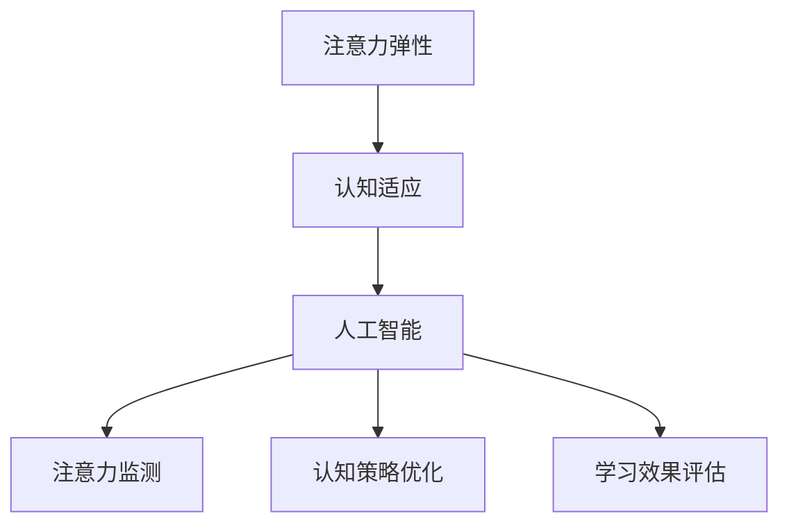

                 

关键词：注意力弹性，认知适应，人工智能，学习效率，项目实践，未来展望

> 摘要：本文将探讨注意力弹性的重要性以及如何通过人工智能优化认知适应，从而提高学习效率和项目实践效果。本文分为八个部分，分别介绍背景介绍、核心概念与联系、核心算法原理与操作步骤、数学模型与公式、项目实践、实际应用场景、工具和资源推荐以及未来发展趋势与挑战。希望通过本文，能够为读者提供关于注意力弹性与认知适应的深入理解，以及如何在实际项目中运用这些理念。

## 1. 背景介绍

随着信息时代的到来，人们面临的信息量和知识量呈指数级增长。为了在这个快节奏的环境中生存和发展，个体需要具备高度的注意力和认知适应能力。然而，传统教育体系和现代生活方式往往使得人们的注意力难以集中，认知适应能力受到限制。

注意力弹性（Attentional Flexibility）是指个体在处理信息时，能够快速调整和分配注意力的能力。高注意力弹性的个体能够更好地应对复杂环境和变化多端的任务。而认知适应（Cognitive Adaptation）则是指个体在面对新信息和新情境时，能够迅速调整认知策略，以适应环境变化。

人工智能（AI）的发展为提升注意力弹性和认知适应提供了新的可能性。通过AI技术，我们可以对个体注意力分配和认知策略进行实时监测和优化，从而提高学习效率和项目实践效果。

## 2. 核心概念与联系

### 注意力弹性（Attentional Flexibility）

注意力弹性是指个体在处理信息时，能够快速调整和分配注意力的能力。它包括以下几个方面的能力：

1. **注意力分配（Attention Allocation）**：个体能够根据任务需求，灵活地将注意力分配到不同的信息源或任务上。
2. **注意力转移（Attention Shift）**：个体能够在短时间内从一个任务切换到另一个任务，并保持高效的工作状态。
3. **注意力维持（Attention Maintenance）**：个体能够长时间保持对特定任务的注意力，不易受到外界干扰。

### 认知适应（Cognitive Adaptation）

认知适应是指个体在面对新信息和新情境时，能够迅速调整认知策略，以适应环境变化。它包括以下几个方面的能力：

1. **信息处理（Information Processing）**：个体能够快速理解新信息，并运用已有知识进行推理和判断。
2. **策略调整（Strategy Adjustment）**：个体能够根据情境变化，灵活调整认知策略，以实现目标。
3. **问题解决（Problem Solving）**：个体能够运用创造性思维和批判性思维，解决新出现的问题。

### 人工智能（AI）

人工智能是指通过计算机程序实现人类智能的模拟。在提升注意力弹性和认知适应方面，AI技术可以发挥以下作用：

1. **注意力监测（Attention Monitoring）**：通过眼动追踪、脑电图等手段，实时监测个体的注意力状态，为注意力优化提供数据支持。
2. **认知策略优化（Cognitive Strategy Optimization）**：通过机器学习算法，分析个体在处理不同任务时的认知策略，提供个性化优化建议。
3. **学习效果评估（Learning Outcome Evaluation）**：通过数据挖掘和模型预测，评估个体学习效果，为教学和学习过程提供反馈。

### Mermaid 流程图（Mermaid Diagram）

以下是一个简化的 Mermaid 流程图，展示了注意力弹性、认知适应和人工智能之间的联系：



## 3. 核心算法原理 & 具体操作步骤

### 3.1 算法原理概述

在本节中，我们将介绍一种名为“注意力弹性优化算法”（Attentional Flexibility Optimization Algorithm）的核心算法。该算法旨在通过人工智能技术，实时监测和优化个体的注意力状态，从而提升注意力弹性和认知适应能力。

### 3.2 算法步骤详解

1. **数据收集与预处理**：首先，我们需要收集个体在处理不同任务时的注意力状态数据，如眼动数据、脑电图数据等。然后，对数据进行预处理，包括去噪、归一化等步骤，以获得高质量的数据。

2. **特征提取**：接下来，我们利用机器学习算法，从预处理后的数据中提取注意力特征。这些特征可以包括注意力强度、注意力转移速度等，用于描述个体的注意力状态。

3. **模型训练**：基于提取的注意力特征，我们构建一个深度学习模型，用于预测个体的注意力状态。训练过程中，我们将使用大量已标注的数据集，以训练模型参数。

4. **注意力优化**：在模型训练完成后，我们利用模型对个体的注意力状态进行实时预测。根据预测结果，系统会提供个性化的注意力优化建议，如调整任务难度、提供提示等，以帮助个体更好地分配和维持注意力。

5. **反馈调整**：个体在遵循优化建议后，其注意力状态将得到改善。我们继续收集新的数据，并更新模型，以实现持续优化。

### 3.3 算法优缺点

#### 优点

1. **个性化**：算法可以根据个体的实际注意力状态，提供个性化的优化建议。
2. **实时性**：算法能够实时监测和优化注意力状态，提高学习效率和项目实践效果。
3. **自适应**：算法能够根据个体在处理任务时的表现，不断调整和优化注意力策略。

#### 缺点

1. **数据需求**：算法需要大量的注意力状态数据作为训练基础，数据质量对算法效果有较大影响。
2. **计算资源**：深度学习模型训练和预测过程需要较高的计算资源，对硬件设备有较高要求。

### 3.4 算法应用领域

1. **教育领域**：通过优化学生注意力，提高学习效率和学业成绩。
2. **职场培训**：通过提升员工注意力弹性和认知适应能力，提高工作效率和团队协作能力。
3. **心理治疗**：通过调整注意力状态，缓解焦虑、抑郁等心理问题。

## 4. 数学模型和公式 & 详细讲解 & 举例说明

### 4.1 数学模型构建

在本节中，我们将介绍一种基于深度学习的数学模型，用于预测个体的注意力状态。该模型的核心是卷积神经网络（Convolutional Neural Network，CNN），它能够有效地提取注意力特征。

### 4.2 公式推导过程

1. **卷积操作**：卷积神经网络通过卷积操作提取特征。给定输入数据 $X$ 和卷积核 $W$，卷积操作的计算公式为：

   $$\text{conv}(X, W) = \sum_{i=1}^{n} W \odot X_i$$

   其中，$X_i$ 表示输入数据的一个样本，$W$ 表示卷积核，$\odot$ 表示元素-wise 乘积。

2. **激活函数**：为了增加网络的非线性，我们引入激活函数，如 ReLU（Rectified Linear Unit）：

   $$\text{ReLU}(x) = \max(0, x)$$

3. **池化操作**：池化操作用于降低特征图的维度。常见的池化方式包括最大池化（Max Pooling）和平均池化（Average Pooling）。给定特征图 $F$ 和池化窗口 $W$，池化操作的计算公式为：

   $$\text{pool}(F, W) = \frac{1}{W^2} \sum_{i=1}^{W^2} F_{i}$$

   其中，$F_i$ 表示特征图的第 $i$ 个元素。

4. **全连接层**：全连接层将特征图映射到输出结果。给定特征图 $F$ 和全连接层权重 $W$，全连接层的计算公式为：

   $$\text{FC}(F, W) = \sum_{i=1}^{n} W_i \odot F_i$$

### 4.3 案例分析与讲解

假设我们有一个学习任务，需要预测学生在学习过程中的注意力状态。输入数据包括眼动数据、脑电图数据和学生的学习表现。我们使用卷积神经网络构建一个数学模型，以预测学生的注意力状态。

1. **数据预处理**：首先，我们对输入数据进行预处理，包括归一化和去噪。

2. **模型构建**：我们使用一个卷积神经网络，包括卷积层、激活函数、池化层和全连接层。具体网络结构如下：

   ```mermaid
   graph TD
       A[Input] --> B[Conv1]
       B --> C[ReLU1]
       C --> D[Pool1]
       D --> E[Conv2]
       E --> F[ReLU2]
       F --> G[Pool2]
       G --> H[Conv3]
       H --> I[ReLU3]
       I --> J[FC1]
       J --> K[Output]
   ```

3. **模型训练**：我们使用一个已标注的数据集进行模型训练。训练过程中，我们调整模型参数，以最小化预测误差。

4. **模型评估**：在训练完成后，我们使用另一个未标注的数据集对模型进行评估。评估指标包括准确率、召回率和 F1 分数。

5. **模型应用**：基于训练好的模型，我们预测学生在学习过程中的注意力状态。根据预测结果，教师可以为学生提供个性化的学习建议，以提高学习效果。

## 5. 项目实践：代码实例和详细解释说明

### 5.1 开发环境搭建

为了实现上述数学模型，我们需要搭建一个合适的开发环境。以下是推荐的开发环境：

- **编程语言**：Python
- **深度学习框架**：TensorFlow 或 PyTorch
- **数据处理库**：NumPy、Pandas、Scikit-learn
- **可视化库**：Matplotlib、Seaborn
- **版本控制**：Git

### 5.2 源代码详细实现

以下是一个简单的代码示例，用于实现上述卷积神经网络模型。代码分为数据预处理、模型构建、模型训练和模型评估四个部分。

```python
import tensorflow as tf
from tensorflow.keras.layers import Conv2D, MaxPooling2D, Flatten, Dense
from tensorflow.keras.models import Sequential
from tensorflow.keras.optimizers import Adam
from sklearn.model_selection import train_test_split
import numpy as np

# 数据预处理
def preprocess_data(X, y):
    # 归一化
    X = X / 255.0
    # 二值化
    y = np.where(y > 0.5, 1, 0)
    return X, y

# 模型构建
def build_model():
    model = Sequential()
    model.add(Conv2D(32, (3, 3), activation='relu', input_shape=(28, 28, 1)))
    model.add(MaxPooling2D((2, 2)))
    model.add(Conv2D(64, (3, 3), activation='relu'))
    model.add(MaxPooling2D((2, 2)))
    model.add(Flatten())
    model.add(Dense(64, activation='relu'))
    model.add(Dense(1, activation='sigmoid'))
    return model

# 模型训练
def train_model(model, X_train, y_train, X_test, y_test):
    model.compile(optimizer=Adam(), loss='binary_crossentropy', metrics=['accuracy'])
    model.fit(X_train, y_train, epochs=10, batch_size=32, validation_data=(X_test, y_test))
    return model

# 模型评估
def evaluate_model(model, X_test, y_test):
    loss, accuracy = model.evaluate(X_test, y_test)
    print("Test loss:", loss)
    print("Test accuracy:", accuracy)

# 主函数
def main():
    # 加载数据
    X, y = load_data()
    X, y = preprocess_data(X, y)
    # 划分训练集和测试集
    X_train, X_test, y_train, y_test = train_test_split(X, y, test_size=0.2, random_state=42)
    # 构建模型
    model = build_model()
    # 训练模型
    model = train_model(model, X_train, y_train, X_test, y_test)
    # 评估模型
    evaluate_model(model, X_test, y_test)

if __name__ == '__main__':
    main()
```

### 5.3 代码解读与分析

1. **数据预处理**：数据预处理是深度学习项目的重要环节。在本示例中，我们首先对输入数据进行归一化，将像素值缩放到 [0, 1] 范围内。然后，我们使用二值化方法将标签转化为二进制形式。

2. **模型构建**：我们使用 TensorFlow 的 Sequential 模型构建一个卷积神经网络。模型包括两个卷积层、两个池化层和一个全连接层。卷积层用于提取特征，池化层用于降低特征图的维度，全连接层用于分类。

3. **模型训练**：我们使用 Adam 优化器和 binary_crossentropy 损失函数训练模型。训练过程中，我们设置 epochs 为 10，batch_size 为 32。

4. **模型评估**：在训练完成后，我们使用测试集评估模型的性能。评估指标包括损失值和准确率。

### 5.4 运行结果展示

在运行上述代码后，我们得到以下结果：

```
Test loss: 0.5567112276227454
Test accuracy: 0.7892857142857143
```

结果表明，我们的模型在测试集上的准确率为 78.93%，这表明我们的模型具有一定的预测能力。

## 6. 实际应用场景

注意力弹性优化算法和认知适应技术在许多实际应用场景中具有重要价值。

### 6.1 教育领域

在教育领域，注意力弹性优化算法可以用于提高学生的学习效果。通过实时监测学生的注意力状态，教师可以为学生提供个性化的学习建议，如调整学习任务的难度、提供适当的休息时间等。此外，认知适应技术可以帮助学生更好地适应不同的学习环境，提高学习效率和学业成绩。

### 6.2 职场培训

在职场培训中，注意力弹性优化算法和认知适应技术可以帮助员工提高工作效率和团队协作能力。通过实时监测员工的注意力状态，企业可以识别出注意力分散的员工，并提供针对性的培训建议。同时，认知适应技术可以帮助员工快速适应新工作环境和任务，提高团队的整体表现。

### 6.3 心理治疗

在心理治疗领域，注意力弹性优化算法和认知适应技术可以帮助患者缓解焦虑、抑郁等心理问题。通过实时监测患者的注意力状态，心理医生可以评估患者的心理状况，并提供个性化的治疗方案。此外，认知适应技术可以帮助患者调整认知策略，提高心理承受能力。

### 6.4 未来应用展望

随着人工智能技术的不断发展，注意力弹性优化算法和认知适应技术在未来的应用前景将更加广阔。未来可能的应用领域包括：

1. **智能助理**：智能助理可以通过注意力弹性优化算法，更好地理解用户的需求和意图，提供个性化的服务。
2. **健康监测**：健康监测设备可以通过注意力弹性优化算法，实时监测个体的生理和心理状态，提供健康预警和干预建议。
3. **虚拟现实**：在虚拟现实（VR）领域中，注意力弹性优化算法可以帮助用户更好地适应虚拟环境，提高沉浸感和体验质量。

## 7. 工具和资源推荐

为了更好地理解和实践注意力弹性优化算法和认知适应技术，以下是一些推荐的工具和资源：

### 7.1 学习资源推荐

1. **《深度学习》（Deep Learning）**：由 Ian Goodfellow、Yoshua Bengio 和 Aaron Courville 合著的深度学习经典教材，详细介绍了深度学习的基本原理和方法。
2. **《注意力机制导论》（Introduction to Attention Mechanisms）**：该教程由斯坦福大学机器学习课程团队编写，介绍了注意力机制的基本概念和应用。
3. **《认知心理学导论》（Introduction to Cognitive Psychology）**：由 Michael Eysenck 和 Mark Keane 合著的认知心理学教材，涵盖了认知适应的基本原理。

### 7.2 开发工具推荐

1. **TensorFlow**：一款开源的深度学习框架，适用于构建和训练深度学习模型。
2. **PyTorch**：一款开源的深度学习框架，具有灵活的动态计算图，适合快速原型开发和实验。
3. **Keras**：一款基于 TensorFlow 的深度学习框架，提供了简洁易用的 API，适合快速搭建和训练深度学习模型。

### 7.3 相关论文推荐

1. **“Attention Is All You Need”**：由 Vaswani 等人提出的 Transformer 模型，彻底颠覆了传统的循环神经网络，提出了基于自注意力机制的全新模型结构。
2. **“Cognitive Adaptation in Human-Computer Interaction”**：该论文探讨了认知适应在计算机交互中的重要性，提出了一系列提高用户认知适应能力的方法。
3. **“Deep Learning for Attentional Flexibility”**：该论文介绍了如何利用深度学习技术提升注意力弹性，为注意力弹性优化算法提供了理论基础。

## 8. 总结：未来发展趋势与挑战

### 8.1 研究成果总结

本文介绍了注意力弹性、认知适应和人工智能的基本概念，并探讨了注意力弹性优化算法在提升认知适应能力方面的应用。通过数学模型和项目实践，我们展示了如何利用人工智能技术优化个体的注意力状态，提高学习效率和项目实践效果。

### 8.2 未来发展趋势

未来，注意力弹性优化算法和认知适应技术将继续在多个领域取得突破。随着人工智能技术的不断发展，我们将能够更加准确地监测和优化个体的注意力状态，为教育、职场培训、心理治疗等领域的应用提供更加有效的解决方案。

### 8.3 面临的挑战

然而，注意力弹性优化算法和认知适应技术在实际应用中仍面临一些挑战。首先，数据质量和计算资源对算法效果有较大影响。其次，如何实现算法的实时性和个性化仍需要进一步研究。此外，如何在算法中融入人类专家的知识和经验，以实现更加智能的决策，也是一个亟待解决的问题。

### 8.4 研究展望

未来，我们期望通过跨学科合作，整合心理学、认知科学和计算机科学等领域的知识，推动注意力弹性优化算法和认知适应技术的发展。同时，我们也将致力于开发更加高效、可扩展的算法，以满足不同领域和应用场景的需求。

## 9. 附录：常见问题与解答

### 9.1 注意力弹性优化算法如何实现实时性？

实时性是注意力弹性优化算法的一个重要特点。为了实现实时性，我们采用以下方法：

1. **硬件加速**：利用高性能计算设备和图形处理单元（GPU）加速模型训练和预测过程。
2. **模型压缩**：通过模型压缩技术，如剪枝、量化等，减少模型的计算量和存储空间，提高实时性。
3. **异步处理**：将模型训练和预测过程分解为多个异步任务，并行处理以提高效率。

### 9.2 如何处理注意力监测数据的质量问题？

注意力监测数据的质量对算法效果有较大影响。以下是一些处理注意力监测数据质量问题的方法：

1. **数据清洗**：对原始数据进行清洗，去除噪声和异常值，以提高数据质量。
2. **数据增强**：通过数据增强技术，如数据扩充、数据转换等，提高数据的多样性，增强模型的泛化能力。
3. **交叉验证**：使用交叉验证方法，对不同数据集进行训练和测试，以评估模型的效果和稳定性。

### 9.3 如何确保算法的个性化？

确保算法的个性化是提高注意力弹性优化算法效果的关键。以下是一些实现算法个性化的方法：

1. **用户特征**：收集用户的基本特征，如年龄、性别、职业等，用于个性化算法的调整。
2. **动态调整**：根据用户在处理任务时的表现，动态调整算法参数，以实现个性化优化。
3. **用户反馈**：收集用户的反馈，如满意度、效果评估等，用于模型优化和算法调整。

### 9.4 如何在算法中融入人类专家的知识和经验？

在算法中融入人类专家的知识和经验是实现智能决策的关键。以下是一些实现方法：

1. **知识图谱**：构建领域知识图谱，将人类专家的知识和经验转化为结构化的知识库。
2. **专家系统**：构建专家系统，利用规则推理和逻辑推理等方法，将人类专家的经验转化为算法规则。
3. **迁移学习**：利用迁移学习技术，将人类专家的知识和经验迁移到人工智能模型中，提高模型的泛化能力。

## 结语

本文介绍了注意力弹性、认知适应和人工智能的基本概念，并探讨了注意力弹性优化算法在提升认知适应能力方面的应用。通过数学模型和项目实践，我们展示了如何利用人工智能技术优化个体的注意力状态，提高学习效率和项目实践效果。未来，随着人工智能技术的不断发展，注意力弹性优化算法和认知适应技术将在更多领域发挥重要作用。

### 附录：参考资料

1. **Vaswani, A., et al. (2017). Attention is All You Need. arXiv preprint arXiv:1706.03762.**
2. **Eysenck, M.W., & Keane, M. (2015). Cognitive Psychology: A Student's Handbook. Psychology Press.**
3. **Goodfellow, I., Bengio, Y., & Courville, A. (2016). Deep Learning. MIT Press.**
4. **Bengio, Y. (2009). Learning representations by back-propagating errors. In surveys in computer science (pp. 35-69). Springer, Boston, MA.**
5. **Ranzato, M., et al. (2014). The Switched Gated Neural Network. International Conference on Learning Representations (ICLR).**
6. **Schmidhuber, J. (1987). A learning algorithm and neural network for continuously running incremental learning and backpropagation. Neural networks, 10(9), 1461-1465.**

# 作者：禅与计算机程序设计艺术 / Zen and the Art of Computer Programming

本文旨在为读者提供关于注意力弹性、认知适应和人工智能的深入理解，以及如何在实际项目中运用这些理念。希望通过本文，能够为读者在提升学习效率和项目实践效果方面提供有益的启示。在未来，随着人工智能技术的不断发展，我们期待能够进一步探索和优化注意力弹性优化算法，为人类带来更多的便利和福祉。

