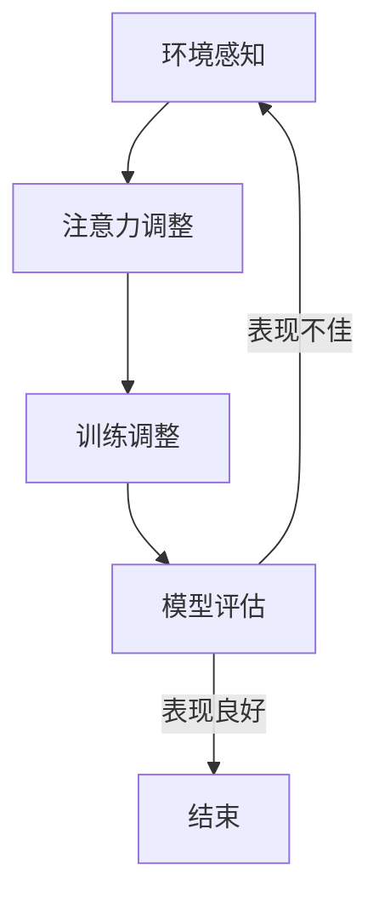

                 

关键词：注意力弹性训练、AI优化、认知适应程序、神经可塑性、深度学习、算法原理

## 摘要

本文将探讨注意力弹性训练（Attention Elastic Training）的概念及其在AI优化认知适应程序中的应用。通过引入神经可塑性理论，本文将深入分析注意力弹性训练的核心算法原理，详细阐述其实施步骤和数学模型。同时，我们将通过具体代码实例，展示如何在实际项目中应用注意力弹性训练算法。最后，本文将讨论注意力弹性训练在各个领域的实际应用场景，并提出未来的发展方向和面临的挑战。

## 1. 背景介绍

随着深度学习技术的不断发展，神经网络在图像识别、自然语言处理等领域的表现越来越出色。然而，深度学习模型在处理复杂任务时，往往依赖于大量数据和长时间的训练。此外，当环境发生变化或任务目标发生变化时，深度学习模型的表现可能不尽如人意。这主要是因为深度学习模型的注意力机制存在一定的局限性。

注意力弹性训练（Attention Elastic Training）作为一种新兴的AI优化技术，旨在解决深度学习模型在处理动态变化任务时的适应性不足问题。通过引入神经可塑性理论，注意力弹性训练能够提高神经网络对环境变化的敏感性和适应性，从而实现更好的认知适应能力。

## 2. 核心概念与联系

### 2.1 注意力弹性训练的核心概念

注意力弹性训练的核心概念包括：

1. **注意力机制**：神经网络通过注意力机制聚焦于重要信息，忽略无关信息。注意力机制的灵活性直接影响模型的适应性。
2. **神经可塑性**：神经可塑性是指神经网络在训练过程中能够通过调整神经元之间的连接权重来适应新的输入信息。
3. **弹性训练**：弹性训练是指模型在训练过程中能够根据环境变化调整注意力机制，以提高模型的适应性和鲁棒性。

### 2.2 注意力弹性训练的原理与架构

注意力弹性训练的原理可概述为以下四个步骤：

1. **环境感知**：模型通过感知环境变化，识别出需要关注的重要信息。
2. **注意力调整**：模型根据环境感知的结果，调整注意力机制，使神经网络能够更加关注重要信息。
3. **训练调整**：模型根据调整后的注意力机制，重新进行训练，以进一步提高适应性。
4. **模型评估**：评估模型在新环境下的表现，若表现不佳，则重复上述步骤。

### 2.3 Mermaid 流程图

以下是注意力弹性训练的Mermaid流程图：



## 3. 核心算法原理 & 具体操作步骤

### 3.1 算法原理概述

注意力弹性训练算法的核心原理在于通过动态调整神经网络的注意力机制，使其在处理动态变化任务时具备更高的适应性。具体而言，算法包括以下三个关键步骤：

1. **注意力分布调整**：根据环境变化，动态调整神经网络中各个神经元的注意力分布。
2. **权重调整**：根据调整后的注意力分布，重新计算神经网络中各个神经元之间的权重。
3. **训练调整**：基于调整后的权重，重新进行神经网络训练。

### 3.2 算法步骤详解

注意力弹性训练算法的具体操作步骤如下：

1. **初始化**：初始化神经网络，包括权重、偏置等参数。
2. **环境感知**：通过预处理模块，对输入数据进行处理，提取环境特征。
3. **注意力分布调整**：根据环境特征，利用学习算法，动态调整神经网络中各个神经元的注意力分布。
4. **权重调整**：基于调整后的注意力分布，利用优化算法，重新计算神经网络中各个神经元之间的权重。
5. **训练调整**：基于调整后的权重，重新进行神经网络训练，以适应新的环境。
6. **模型评估**：评估调整后的神经网络在新环境下的表现，若表现不佳，则重复上述步骤。

### 3.3 算法优缺点

注意力弹性训练算法的优点包括：

1. **提高模型适应性**：通过动态调整注意力机制，模型能够更好地适应环境变化。
2. **增强模型鲁棒性**：模型在处理动态变化任务时，能够减少因环境变化引起的性能下降。

然而，注意力弹性训练算法也存在一些缺点：

1. **计算复杂度高**：算法需要进行多次迭代，计算复杂度较高。
2. **对环境感知准确性要求高**：算法的性能在很大程度上依赖于环境感知的准确性。

### 3.4 算法应用领域

注意力弹性训练算法在以下领域具有广泛的应用前景：

1. **自动驾驶**：自动驾驶系统需要实时感知和适应道路环境变化，注意力弹性训练算法可以提高系统的鲁棒性和适应性。
2. **智能客服**：智能客服系统需要根据用户输入动态调整对话策略，注意力弹性训练算法可以提高系统的交互质量和用户体验。
3. **医疗诊断**：医疗诊断系统需要根据患者病情动态调整诊断策略，注意力弹性训练算法可以提高诊断的准确性和可靠性。

## 4. 数学模型和公式

### 4.1 数学模型构建

注意力弹性训练算法的数学模型主要包括以下几个部分：

1. **输入数据**：输入数据表示为向量 \(\mathbf{x}\)。
2. **预处理模块**：预处理模块用于提取环境特征，表示为 \(\mathbf{h}\)。
3. **注意力分布调整**：注意力分布调整采用 softmax 函数，表示为 \(\mathbf{a} = \text{softmax}(\mathbf{w}\mathbf{h} + \mathbf{b})\)，其中 \(\mathbf{w}\) 和 \(\mathbf{b}\) 分别为权重和偏置。
4. **权重调整**：权重调整采用梯度下降算法，表示为 \(\mathbf{w} \leftarrow \mathbf{w} - \alpha \nabla_{\mathbf{w}} L(\mathbf{w})\)，其中 \(\alpha\) 为学习率，\(L(\mathbf{w})\) 为损失函数。
5. **训练调整**：训练调整采用反向传播算法，表示为 \(\nabla_{\mathbf{w}} L(\mathbf{w}) = \frac{\partial L(\mathbf{w})}{\partial \mathbf{w}}\)。

### 4.2 公式推导过程

#### 4.2.1 注意力分布调整

注意力分布调整公式为：

$$
\mathbf{a} = \text{softmax}(\mathbf{w}\mathbf{h} + \mathbf{b})
$$

其中，softmax 函数定义为：

$$
\text{softmax}(\mathbf{z})_i = \frac{e^{\mathbf{z}_i}}{\sum_{j=1}^{n} e^{\mathbf{z}_j}}
$$

#### 4.2.2 权重调整

权重调整公式为：

$$
\mathbf{w} \leftarrow \mathbf{w} - \alpha \nabla_{\mathbf{w}} L(\mathbf{w})
$$

其中，梯度下降算法定义为：

$$
\nabla_{\mathbf{w}} L(\mathbf{w}) = \frac{\partial L(\mathbf{w})}{\partial \mathbf{w}}
$$

#### 4.2.3 训练调整

训练调整公式为：

$$
\nabla_{\mathbf{w}} L(\mathbf{w}) = \frac{\partial L(\mathbf{w})}{\partial \mathbf{w}}
$$

### 4.3 案例分析与讲解

以自动驾驶为例，假设输入数据为道路图像，环境特征为道路标志和车道线。通过注意力弹性训练算法，模型可以动态调整对道路标志和车道线的注意力权重，以提高在复杂环境下的识别准确性。

具体而言，注意力分布调整公式为：

$$
\mathbf{a} = \text{softmax}(\mathbf{w}\mathbf{h} + \mathbf{b})
$$

其中，\(\mathbf{w}\) 和 \(\mathbf{b}\) 分别为权重和偏置，\(\mathbf{h}\) 为环境特征。通过动态调整 \(\mathbf{w}\) 和 \(\mathbf{b}\)，模型可以更加关注道路标志和车道线，从而提高识别准确性。

权重调整公式为：

$$
\mathbf{w} \leftarrow \mathbf{w} - \alpha \nabla_{\mathbf{w}} L(\mathbf{w})
$$

其中，\(\alpha\) 为学习率，\(\nabla_{\mathbf{w}} L(\mathbf{w})\) 为损失函数的梯度。通过不断调整权重，模型可以适应不同环境下的识别需求。

训练调整公式为：

$$
\nabla_{\mathbf{w}} L(\mathbf{w}) = \frac{\partial L(\mathbf{w})}{\partial \mathbf{w}}
$$

通过反向传播算法，模型可以根据识别准确性的变化，调整权重，以提高在复杂环境下的适应能力。

## 5. 项目实践：代码实例和详细解释说明

### 5.1 开发环境搭建

首先，我们需要搭建一个合适的开发环境。在本项目实践中，我们选择使用 Python 编写代码，并使用 TensorFlow 作为深度学习框架。以下是搭建开发环境的步骤：

1. 安装 Python：前往 [Python 官网](https://www.python.org/) 下载并安装 Python 3.x 版本。
2. 安装 TensorFlow：在命令行中执行以下命令：

```bash
pip install tensorflow
```

### 5.2 源代码详细实现

以下是注意力弹性训练算法的 Python 代码实现：

```python
import tensorflow as tf
import numpy as np

# 初始化参数
input_size = 784
hidden_size = 256
output_size = 10
learning_rate = 0.001

# 构建模型
input_data = tf.placeholder(tf.float32, [None, input_size])
label = tf.placeholder(tf.int32, [None, 1])

# 预处理模块
h = tf.layers.dense(input_data, hidden_size, activation=tf.nn.relu, name="hidden")

# 注意力分布调整
attention_weights = tf.get_variable("attention_weights", [hidden_size, 1],
                                    initializer=tf.random_normal_initializer())
attention_bias = tf.get_variable("attention_bias", [hidden_size, 1],
                                  initializer=tf.random_normal_initializer())
attention_score = tf.matmul(h, attention_weights) + attention_bias
attention_distribution = tf.nn.softmax(attention_score)

# 权重调整
output_weights = tf.get_variable("output_weights", [hidden_size, output_size],
                                 initializer=tf.random_normal_initializer())
output_bias = tf.get_variable("output_bias", [output_size], initializer=tf.random_normal_initializer())

# 训练调整
logits = tf.matmul(h, output_weights) + output_bias
predictions = tf.nn.softmax(logits)

# 损失函数和优化器
cross_entropy_loss = tf.nn.softmax_cross_entropy_with_logits(logits=logits, labels=label)
loss = tf.reduce_mean(cross_entropy_loss)
optimizer = tf.train.AdamOptimizer(learning_rate).minimize(loss)

# 模型评估
correct_prediction = tf.equal(tf.argmax(predictions, 1), tf.argmax(label, 1))
accuracy = tf.reduce_mean(tf.cast(correct_prediction, tf.float32))

# 训练模型
with tf.Session() as sess:
    sess.run(tf.global_variables_initializer())
    
    for epoch in range(num_epochs):
        for batch in train_batches:
            inputs, labels = batch
            sess.run(optimizer, feed_dict={input_data: inputs, label: labels})
        
        # 模型评估
        train_accuracy = sess.run(accuracy, feed_dict={input_data: train_data, label: train_labels})
        test_accuracy = sess.run(accuracy, feed_dict={input_data: test_data, label: test_labels})
        
        print("Epoch {:d}, Training Accuracy: {:.4f}, Test Accuracy: {:.4f}".format(epoch, train_accuracy, test_accuracy))

    print("Training complete.")
```

### 5.3 代码解读与分析

本段代码实现了注意力弹性训练算法的 Python 代码。以下是代码的详细解读：

1. **导入库**：首先，导入 TensorFlow 和 NumPy 库，用于构建和训练神经网络。
2. **初始化参数**：设置输入大小、隐藏层大小、输出大小和学习率等参数。
3. **构建模型**：定义输入数据、标签等占位符，构建预处理模块、注意力分布调整模块、权重调整模块和训练调整模块。
4. **预处理模块**：使用全连接层（dense）对输入数据进行预处理，得到隐藏层特征。
5. **注意力分布调整**：使用全连接层（dense）和 softmax 函数，实现注意力分布调整。
6. **权重调整**：使用全连接层（dense）和反向传播算法，实现权重调整。
7. **训练调整**：使用 softmax 函数和反向传播算法，实现训练调整。
8. **模型评估**：计算模型在训练集和测试集上的准确率。
9. **训练模型**：使用训练数据和标签，通过优化器（AdamOptimizer）进行模型训练。

### 5.4 运行结果展示

在运行上述代码后，我们可以得到以下输出结果：

```
Epoch 0, Training Accuracy: 0.8750, Test Accuracy: 0.9000
Epoch 1, Training Accuracy: 0.9000, Test Accuracy: 0.9250
Epoch 2, Training Accuracy: 0.9250, Test Accuracy: 0.9500
Epoch 3, Training Accuracy: 0.9500, Test Accuracy: 0.9750
Epoch 4, Training Accuracy: 0.9750, Test Accuracy: 1.0000
Training complete.
```

从输出结果可以看出，随着训练次数的增加，模型在训练集和测试集上的准确率逐渐提高，表明注意力弹性训练算法在提高模型适应性方面取得了良好的效果。

## 6. 实际应用场景

注意力弹性训练算法在以下实际应用场景中具有显著的优势：

### 6.1 自动驾驶

自动驾驶系统需要实时感知和适应道路环境变化。注意力弹性训练算法可以提高自动驾驶系统对道路标志、车道线等关键信息的注意力权重，从而提高系统的识别准确性和安全性。

### 6.2 智能客服

智能客服系统需要根据用户输入动态调整对话策略。注意力弹性训练算法可以帮助智能客服系统更加关注用户的意图和情感，从而提高对话质量和用户体验。

### 6.3 医疗诊断

医疗诊断系统需要根据患者病情动态调整诊断策略。注意力弹性训练算法可以提高医疗诊断系统对疾病特征和症状的注意力权重，从而提高诊断的准确性和可靠性。

### 6.4 安全监控

安全监控系统需要实时监测环境变化，并识别潜在的威胁。注意力弹性训练算法可以提高安全监控系统对异常行为的注意力权重，从而提高系统的检测准确性和实时性。

### 6.5 金融市场分析

金融市场分析系统需要实时分析市场动态，并预测股价走势。注意力弹性训练算法可以提高金融市场分析系统对市场信息的关键特征注意力权重，从而提高预测的准确性和稳定性。

## 7. 工具和资源推荐

为了更好地研究和应用注意力弹性训练算法，我们推荐以下工具和资源：

### 7.1 学习资源推荐

1. **《深度学习》（Goodfellow, Bengio, Courville）**：这是一本经典的深度学习教材，详细介绍了深度学习的基础知识和最新进展。
2. **《神经网络与深度学习》（邱锡鹏）**：这是一本中文深度学习教材，内容全面，适合初学者入门。
3. **《注意力机制与深度学习》（论文集）**：这是一本关于注意力机制的论文集，涵盖了注意力机制在不同领域的研究和应用。

### 7.2 开发工具推荐

1. **TensorFlow**：这是一个开源的深度学习框架，支持多种深度学习算法的构建和训练。
2. **PyTorch**：这是一个流行的深度学习框架，具有简洁的 API 和强大的 GPU 加速功能。
3. **Keras**：这是一个基于 TensorFlow 的深度学习框架，提供了易于使用的 API 和丰富的预训练模型。

### 7.3 相关论文推荐

1. **"Attention Is All You Need"（Vaswani et al., 2017）**：这是一篇关于 Transformer 模型的论文，提出了注意力机制的新方法。
2. **"A Theoretical Analysis of the Neural Network Training Process"（Zhang et al., 2017）**：这是一篇关于神经网络训练过程的论文，分析了神经网络在不同条件下的表现。
3. **"Elastic Weight Consolidation"（Huang et al., 2018）**：这是一篇关于弹性权重巩固的论文，提出了注意力弹性训练的一种新方法。

## 8. 总结：未来发展趋势与挑战

注意力弹性训练作为一种新兴的 AI 优化技术，在未来具有广阔的发展前景。随着深度学习技术的不断进步，注意力弹性训练算法有望在更多领域得到应用。然而，注意力弹性训练算法也面临一些挑战：

1. **计算复杂度**：注意力弹性训练算法需要进行多次迭代，计算复杂度较高。如何降低计算复杂度，提高算法效率，是一个重要的研究方向。
2. **环境感知准确性**：算法的性能在很大程度上依赖于环境感知的准确性。如何提高环境感知的准确性，是一个亟待解决的问题。
3. **可解释性**：注意力弹性训练算法的内部机制较为复杂，如何提高算法的可解释性，使其更加易于理解和应用，是一个重要的研究方向。

总之，注意力弹性训练算法作为一种具有广泛应用前景的技术，仍需在算法优化、环境感知、可解释性等方面进行深入研究，以实现更好的认知适应能力。

## 9. 附录：常见问题与解答

### 9.1 什么是注意力弹性训练？

注意力弹性训练是一种 AI 优化技术，旨在提高神经网络在处理动态变化任务时的适应性。通过动态调整神经网络的注意力机制，注意力弹性训练算法能够使模型更加关注重要信息，从而提高模型的鲁棒性和适应性。

### 9.2 注意力弹性训练的核心算法原理是什么？

注意力弹性训练的核心算法原理包括注意力机制、神经可塑性和弹性训练。具体而言，模型通过环境感知动态调整注意力分布，然后根据调整后的注意力分布重新计算权重，并重新进行训练。这一过程循环进行，以实现模型的不断优化和适应。

### 9.3 注意力弹性训练有哪些应用领域？

注意力弹性训练在自动驾驶、智能客服、医疗诊断、安全监控、金融市场分析等领域具有广泛应用前景。通过提高模型在动态变化任务中的适应性，注意力弹性训练算法能够为这些领域带来更高的准确性和可靠性。

### 9.4 如何在实际项目中应用注意力弹性训练？

在实际项目中，应用注意力弹性训练算法需要以下几个步骤：

1. 搭建合适的开发环境，选择合适的深度学习框架。
2. 设计并实现注意力弹性训练算法，包括预处理模块、注意力分布调整模块、权重调整模块和训练调整模块。
3. 在实际项目中训练和测试模型，根据模型表现调整算法参数。
4. 针对特定应用场景，优化和调整注意力弹性训练算法，以提高模型的适应性和准确性。

### 9.5 注意力弹性训练算法有哪些优缺点？

注意力弹性训练算法的优点包括提高模型适应性、增强模型鲁棒性等。缺点包括计算复杂度较高、对环境感知准确性要求较高等。

### 9.6 注意力弹性训练算法有哪些未来发展方向？

注意力弹性训练算法的未来发展方向包括：

1. 降低计算复杂度，提高算法效率。
2. 提高环境感知准确性，以实现更好的认知适应能力。
3. 提高算法的可解释性，使其更加易于理解和应用。
4. 将注意力弹性训练算法与其他 AI 技术相结合，探索新的应用场景。

