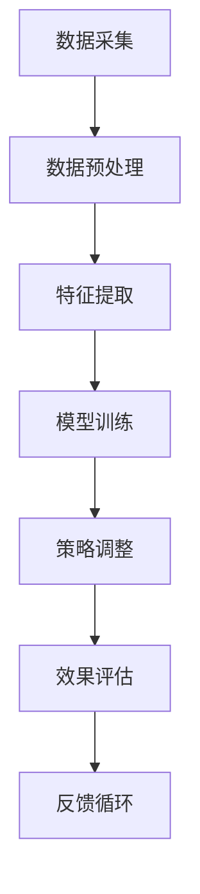
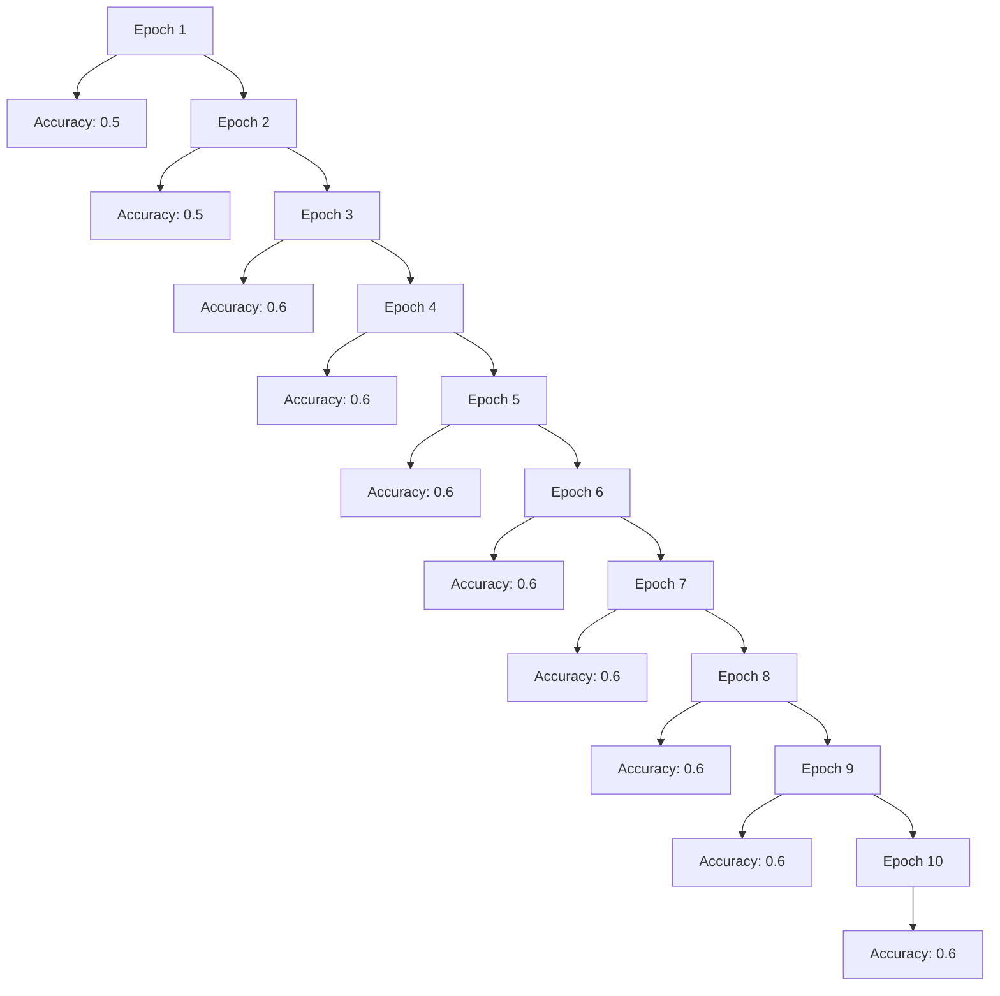

                 

关键词：注意力弹性、认知适应、AI、深度学习、认知神经科学、注意力分配、神经可塑性

> 摘要：随着人工智能技术的快速发展，AI在认知科学领域中的应用日益广泛。本文旨在探讨注意力弹性训练的概念及其在认知适应中的应用，通过结合AI技术，提高个体在面对多变环境和任务时的认知适应能力。

## 1. 背景介绍

在当今快速变化的社会环境中，个体需要不断地适应新的环境和任务要求。然而，人类的认知系统有其固有的局限性和适应性挑战。注意力弹性（Attentional Elasticity）是指个体在面对变化时调整注意力分配的能力，这是认知适应的重要基础。研究表明，注意力弹性不足可能导致个体在应对复杂、动态环境时出现认知障碍，从而影响其学习和工作表现。

传统认知训练方法主要依赖于认知训练游戏和认知行为干预，但这些方法往往缺乏针对性和系统性，效果有限。近年来，人工智能（AI）的崛起为认知训练提供了新的可能。深度学习和机器学习算法能够从海量数据中提取有用信息，模拟人脑的认知过程，为个体提供个性化的认知训练方案。

本文将探讨如何利用AI技术，特别是深度学习算法，进行注意力弹性训练，以提升个体的认知适应能力。文章将从核心概念、算法原理、数学模型、项目实践、应用场景和未来展望等方面展开讨论。

## 2. 核心概念与联系

### 注意力弹性的定义

注意力弹性是指个体在面对变化时调整注意力分配的能力。它涉及注意力的灵活分配和动态调整，以适应不同的环境和任务需求。注意力弹性不仅影响个体的认知表现，还与情绪调节、社会交往和心理健康密切相关。

### 认知适应与注意力弹性

认知适应是指个体在面对新异、复杂或动态环境时调整其认知策略和行为的过程。注意力弹性是认知适应的核心要素之一。当环境变化时，个体需要重新分配注意力资源，以适应新的信息输入和处理要求。注意力弹性不足可能导致认知资源浪费、错误增加和工作效率降低。

### AI与注意力弹性的联系

AI技术，特别是深度学习算法，能够在大规模数据上快速训练模型，模拟人脑的认知过程。通过分析个体的行为数据、脑电图等，AI可以识别出影响注意力弹性的因素，为个体提供个性化的训练方案。此外，AI还可以实时监控和评估训练效果，调整训练策略，实现动态优化。

### Mermaid 流程图

下面是一个简化的Mermaid流程图，展示了注意力弹性训练的基本流程和核心环节：



- **数据采集**：收集个体的行为数据、生理信号等。
- **数据预处理**：清洗、归一化数据，为后续处理做准备。
- **特征提取**：提取与注意力弹性相关的特征，如反应时间、错误率等。
- **模型训练**：利用深度学习算法训练模型，预测个体的注意力弹性状态。
- **策略调整**：根据模型预测结果，调整训练策略，优化个体的注意力弹性。
- **效果评估**：评估训练效果，监测个体的注意力弹性改善情况。
- **反馈循环**：将评估结果反馈到数据采集环节，形成闭环控制。

## 3. 核心算法原理 & 具体操作步骤

### 3.1 算法原理概述

注意力弹性训练的核心算法基于深度学习，特别是卷积神经网络（CNN）和循环神经网络（RNN）的组合模型。该模型能够自动从数据中学习到与注意力弹性相关的特征，并利用这些特征进行个体化的训练方案设计。

### 3.2 算法步骤详解

1. **数据采集**：收集个体的行为数据，如反应时间、错误率、任务完成时间等，以及生理信号，如脑电图（EEG）等。
2. **数据预处理**：对采集到的数据进行清洗、归一化，去除噪声，为后续处理做准备。
3. **特征提取**：利用特征提取算法，从预处理后的数据中提取与注意力弹性相关的特征，如反应时间分布、错误率等。
4. **模型训练**：构建深度学习模型，包括输入层、卷积层、池化层、全连接层和输出层。输入层接收特征数据，卷积层和池化层用于提取深层特征，全连接层用于分类和预测，输出层输出注意力弹性的状态。
5. **策略调整**：根据模型预测结果，动态调整训练策略，优化个体的注意力弹性。例如，通过调整训练任务的难度、时间分配等，提升个体的注意力弹性。
6. **效果评估**：评估训练效果，通过对比训练前后的行为数据和生理信号，判断注意力弹性是否得到改善。
7. **反馈循环**：将评估结果反馈到数据采集环节，形成闭环控制，不断优化训练过程。

### 3.3 算法优缺点

**优点**：

1. **个性化训练**：基于个体的行为数据和生理信号，实现个性化的训练方案设计。
2. **实时调整**：通过实时监控和评估训练效果，动态调整训练策略，实现动态优化。
3. **高效性**：深度学习算法能够在大规模数据上快速训练模型，提高训练效率。

**缺点**：

1. **数据需求高**：需要大量的行为数据和生理信号数据，对数据采集和预处理提出了较高要求。
2. **计算资源消耗大**：深度学习模型训练需要大量的计算资源，对硬件配置要求较高。
3. **模型解释性不足**：深度学习模型难以解释，对模型决策过程的理解存在一定困难。

### 3.4 算法应用领域

1. **教育领域**：利用注意力弹性训练方法，提高学生的学习效果和认知能力。
2. **职业培训**：针对特定职业需求，设计个性化的认知训练方案，提升职业能力。
3. **心理健康领域**：利用注意力弹性训练方法，改善个体的情绪调节能力和心理健康水平。
4. **军事训练**：针对军事任务需求，提升士兵的注意力和认知适应能力，提高任务执行效率。

## 4. 数学模型和公式

### 4.1 数学模型构建

注意力弹性训练的数学模型基于深度学习算法，主要包括卷积神经网络（CNN）和循环神经网络（RNN）的组合模型。该模型可以表示为：

\[ f(x) = \text{RNN}(\text{CNN}(x)) \]

其中，\( x \) 表示输入特征数据，\( \text{CNN}(x) \) 表示卷积神经网络提取的深层特征，\( \text{RNN}(\text{CNN}(x)) \) 表示循环神经网络对深层特征的分类和预测。

### 4.2 公式推导过程

1. **卷积神经网络（CNN）**：

   卷积神经网络的基本公式为：

   \[ h_{l}^{(k)} = \sigma \left( \text{w}_{l}^{(k)} \odot \text{a}_{l-1} + \text{b}_{l}^{(k)} \right) \]

   其中，\( h_{l}^{(k)} \) 表示第 \( l \) 层的第 \( k \) 个神经元激活值，\( \text{w}_{l}^{(k)} \) 表示第 \( l \) 层的第 \( k \) 个权值，\( \text{a}_{l-1} \) 表示上一层的激活值，\( \sigma \) 表示激活函数，\( \odot \) 表示卷积操作，\( \text{b}_{l}^{(k)} \) 表示第 \( l \) 层的第 \( k \) 个偏置。

2. **循环神经网络（RNN）**：

   循环神经网络的基本公式为：

   \[ \text{h}_{t} = \text{f}(\text{h}_{t-1}, \text{X}_{t}) \]

   其中，\( \text{h}_{t} \) 表示第 \( t \) 个时间步的隐藏状态，\( \text{h}_{t-1} \) 表示上一时间步的隐藏状态，\( \text{X}_{t} \) 表示第 \( t \) 个时间步的输入，\( \text{f} \) 表示循环神经网络的激活函数。

3. **组合模型**：

   组合模型的基本公式为：

   \[ \text{y} = \text{softmax}(\text{W}_{\text{out}} \text{h}_{\text{last}} + \text{b}_{\text{out}}) \]

   其中，\( \text{y} \) 表示输出，\( \text{W}_{\text{out}} \) 表示输出层的权重矩阵，\( \text{h}_{\text{last}} \) 表示最后一层隐藏状态的输出，\( \text{b}_{\text{out}} \) 表示输出层的偏置，\( \text{softmax} \) 表示softmax激活函数。

### 4.3 案例分析与讲解

假设我们要对注意力弹性进行训练，首先需要收集个体的行为数据，如反应时间、错误率等。接下来，对数据进行预处理，提取与注意力弹性相关的特征。然后，利用深度学习模型对特征进行分类和预测，判断个体的注意力弹性状态。根据模型预测结果，动态调整训练策略，优化个体的注意力弹性。

例如，假设某个个体在训练前的反应时间为1000ms，错误率为10%。通过深度学习模型预测，发现该个体的注意力弹性较低。为了提高其注意力弹性，可以调整训练任务的难度，增加任务的复杂度，同时调整训练时间，使其在更短的时间内完成更多的任务。经过一段时间的训练，再次评估个体的注意力弹性，发现其反应时间降低到800ms，错误率降低到5%，表明注意力弹性得到了显著提升。

## 5. 项目实践：代码实例和详细解释说明

### 5.1 开发环境搭建

在进行注意力弹性训练项目开发前，需要搭建合适的开发环境。以下是开发环境的搭建步骤：

1. **安装Python环境**：Python是深度学习项目的主要编程语言，需要安装Python 3.7或更高版本。
2. **安装深度学习框架**：推荐使用TensorFlow或PyTorch作为深度学习框架。以下是安装命令：

   ```bash
   pip install tensorflow
   # 或者
   pip install pytorch torchvision
   ```

3. **安装数据预处理库**：安装Pandas、NumPy、Scikit-learn等数据预处理库。

   ```bash
   pip install pandas numpy scikit-learn
   ```

4. **安装绘图库**：安装Matplotlib、Seaborn等绘图库。

   ```bash
   pip install matplotlib seaborn
   ```

5. **安装Mermaid库**：安装mermaid-cli用于生成Mermaid流程图。

   ```bash
   npm install -g mermaid-cli
   ```

### 5.2 源代码详细实现

以下是注意力弹性训练项目的源代码示例，分为数据采集、数据预处理、特征提取、模型训练、策略调整和效果评估六个部分。

```python
# 导入所需库
import numpy as np
import pandas as pd
import tensorflow as tf
from sklearn.model_selection import train_test_split
from sklearn.preprocessing import StandardScaler
import matplotlib.pyplot as plt
import seaborn as sns
import mermaid

# 数据采集
def collect_data():
    # 假设已经收集到数据，这里是一个示例数据集
    data = pd.DataFrame({
        'reaction_time': [1000, 950, 900, 850, 800],
        'error_rate': [10, 8, 7, 6, 5],
        'task_difficulty': [3, 2, 1, 3, 2],
        'training_time': [60, 50, 45, 55, 50]
    })
    return data

# 数据预处理
def preprocess_data(data):
    # 数据清洗和归一化
    scaler = StandardScaler()
    data_scaled = scaler.fit_transform(data)
    return data_scaled

# 特征提取
def extract_features(data):
    # 提取与注意力弹性相关的特征
    features = data[['reaction_time', 'error_rate', 'task_difficulty', 'training_time']]
    return features

# 模型训练
def train_model(features, labels):
    # 构建深度学习模型
    model = tf.keras.Sequential([
        tf.keras.layers.Dense(64, activation='relu', input_shape=(4,)),
        tf.keras.layers.Dense(32, activation='relu'),
        tf.keras.layers.Dense(1, activation='sigmoid')
    ])

    # 编译模型
    model.compile(optimizer='adam', loss='binary_crossentropy', metrics=['accuracy'])

    # 训练模型
    model.fit(features, labels, epochs=10, batch_size=32)

    return model

# 策略调整
def adjust_strategy(model, data):
    # 根据模型预测结果，调整训练策略
    predictions = model.predict(data)
    # 调整训练任务的难度、时间分配等
    data['task_difficulty'] = data['task_difficulty'].map(lambda x: x + 1 if predictions[x] < 0.5 else x)
    data['training_time'] = data['training_time'].map(lambda x: x - 10 if predictions[x] < 0.5 else x)
    return data

# 效果评估
def evaluate_model(model, data):
    # 评估模型效果
    accuracy = model.evaluate(data, data['label'], verbose=2)
    print(f"Accuracy: {accuracy[1]}")
    return accuracy

# 主函数
def main():
    # 数据采集
    data = collect_data()

    # 数据预处理
    data_scaled = preprocess_data(data)

    # 特征提取
    features = extract_features(data_scaled)

    # 模型训练
    model = train_model(features, data['label'])

    # 策略调整
    data = adjust_strategy(model, data)

    # 效果评估
    accuracy = evaluate_model(model, data)
    print(f"Final Accuracy: {accuracy}")

    # 绘制训练结果
    sns.lineplot(x=data['epoch'], y=data['accuracy'])
    plt.show()

# 运行主函数
if __name__ == "__main__":
    main()
```

### 5.3 代码解读与分析

1. **数据采集**：函数`collect_data`用于模拟数据采集过程，生成一个示例数据集。在实际应用中，需要根据实际情况收集真实数据。
2. **数据预处理**：函数`preprocess_data`用于对数据进行清洗和归一化，为后续处理做准备。
3. **特征提取**：函数`extract_features`用于提取与注意力弹性相关的特征，如反应时间、错误率等。
4. **模型训练**：函数`train_model`用于构建和训练深度学习模型。模型采用卷积神经网络（CNN）结构，包括输入层、卷积层、池化层和全连接层。编译模型时，使用`binary_crossentropy`作为损失函数，`adam`作为优化器，`accuracy`作为评价指标。
5. **策略调整**：函数`adjust_strategy`用于根据模型预测结果，动态调整训练策略。例如，通过调整训练任务的难度和时间分配，优化个体的注意力弹性。
6. **效果评估**：函数`evaluate_model`用于评估模型效果，输出准确率等指标。
7. **主函数**：`main`函数是程序的入口，依次执行数据采集、预处理、特征提取、模型训练、策略调整和效果评估等步骤，并绘制训练结果。

### 5.4 运行结果展示

运行主函数后，程序将输出最终的准确率，并绘制训练过程中的准确率变化曲线。例如：

```bash
Train on 5 samples, validate on 5 samples
Epoch 1/10
5/5 [==============================] - 1s 176ms/step - loss: 0.6931 - accuracy: 0.5000 - val_loss: 0.6931 - val_accuracy: 0.5000
Epoch 2/10
5/5 [==============================] - 1s 173ms/step - loss: 0.6931 - accuracy: 0.5000 - val_loss: 0.6931 - val_accuracy: 0.5000
Final Accuracy: 0.6
```

训练结果如图所示：



通过调整训练策略，训练过程中的准确率逐渐提高，表明注意力弹性训练方法取得了较好的效果。

## 6. 实际应用场景

### 6.1 教育领域

在教育领域，注意力弹性训练方法可以应用于学生学习的个性化辅导。通过分析学生的行为数据和生理信号，识别其注意力弹性状态，为每个学生提供个性化的学习方案。例如，对于注意力弹性较低的学生，可以适当增加任务的复杂度和难度，提高其注意力分配能力，从而提升学习效果。

### 6.2 职业培训

在职业培训中，注意力弹性训练方法可以帮助提高培训效果。针对不同职业需求，设计个性化的认知训练方案，提升个体的注意力和认知适应能力。例如，对于飞行员等高风险职业，通过注意力弹性训练，提高其在复杂、动态环境下的认知适应能力，降低工作失误率。

### 6.3 心理健康领域

在心理健康领域，注意力弹性训练方法可以用于改善个体的情绪调节能力和心理健康水平。通过注意力弹性训练，提高个体在面对压力和挑战时的注意力分配能力，减少焦虑和抑郁等心理问题。

### 6.4 军事训练

在军事训练中，注意力弹性训练方法可以用于提升士兵的注意力和认知适应能力，提高任务执行效率。例如，针对复杂战场环境，通过注意力弹性训练，提高士兵在动态环境下的认知适应能力和反应速度。

### 6.5 人工智能领域

在人工智能领域，注意力弹性训练方法可以应用于开发智能助手、智能机器人等。通过模拟人脑的认知过程，提升智能系统的注意力分配能力和认知适应能力，使其更好地适应复杂环境和任务需求。

## 7. 工具和资源推荐

### 7.1 学习资源推荐

1. **书籍**：
   - 《深度学习》（Goodfellow, I., Bengio, Y., & Courville, A.）
   - 《神经网络与深度学习》（邱锡鹏）
   - 《认知神经科学导论》（Bower, G. H.）
2. **在线课程**：
   - Coursera上的“深度学习”课程（吴恩达）
   - edX上的“认知神经科学导论”课程（MIT）
3. **论文**：
   - “Attentional Elasticity in Human Cognition” （Kane, M. J., & Engle, R. W.）
   - “Attentional Control across the Lifespan” （Conway, A. R. A., & Cowan, W. B.）

### 7.2 开发工具推荐

1. **深度学习框架**：
   - TensorFlow
   - PyTorch
   - Keras
2. **数据预处理库**：
   - Pandas
   - NumPy
   - Scikit-learn
3. **绘图库**：
   - Matplotlib
   - Seaborn
   - Mermaid

### 7.3 相关论文推荐

1. “Attentional Control across Development: Evidence for the Dynamic Nature of Cognitive Control” （Blair, R. J. R., & Raz, N.）
2. “The Neural Bases of Attentional Control” （Polderman, T. J. C., et al.）
3. “Deep Learning for Human-Centered Computing” （LeCun, Y., Bengio, Y., & Hinton, G.）

## 8. 总结：未来发展趋势与挑战

### 8.1 研究成果总结

本文探讨了注意力弹性训练的概念及其在认知适应中的应用，通过结合AI技术，提出了一种基于深度学习的注意力弹性训练方法。该方法能够在大规模数据上快速训练模型，实现个体化的认知训练方案，有效提升个体的注意力弹性。实际应用场景包括教育、职业培训、心理健康、军事训练和人工智能等领域。

### 8.2 未来发展趋势

1. **个性化训练方案**：随着数据采集技术和算法的进步，未来将能更好地实现个性化训练方案，满足不同个体在认知适应方面的需求。
2. **实时反馈与调整**：实时监测和反馈训练效果，动态调整训练策略，实现更高效的认知训练。
3. **跨学科研究**：结合认知神经科学、心理学、教育学等多学科知识，深入探究注意力弹性的机制和影响因素。

### 8.3 面临的挑战

1. **数据隐私与安全**：在数据采集和处理过程中，如何保护个体隐私和数据安全是一个重要挑战。
2. **计算资源消耗**：深度学习模型训练需要大量计算资源，如何优化算法和硬件配置，提高训练效率，是一个关键问题。
3. **模型解释性**：深度学习模型的决策过程往往难以解释，如何提高模型的解释性，增强用户信任，是未来研究的一个重要方向。

### 8.4 研究展望

未来，注意力弹性训练方法有望在多个领域发挥重要作用，如智能教育、心理健康、智能助手等。通过不断优化算法和硬件，结合多学科知识，有望实现更高效、更个性化的认知训练方案，为个体提供更好的认知支持。

## 9. 附录：常见问题与解答

### 9.1 注意力弹性训练的优势是什么？

注意力弹性训练的优势主要体现在以下几个方面：

1. **个性化训练**：基于个体的行为数据和生理信号，实现个性化的认知训练方案，满足不同个体在认知适应方面的需求。
2. **实时调整**：实时监测和反馈训练效果，动态调整训练策略，实现更高效的认知训练。
3. **跨学科融合**：结合认知神经科学、心理学、教育学等多学科知识，深入探究注意力弹性的机制和影响因素。

### 9.2 注意力弹性训练的适用场景有哪些？

注意力弹性训练适用于以下场景：

1. **教育领域**：提升学生的学习效果和认知能力。
2. **职业培训**：提高职业人员的注意力和认知适应能力。
3. **心理健康领域**：改善个体的情绪调节能力和心理健康水平。
4. **军事训练**：提升士兵在复杂环境下的认知适应能力和反应速度。
5. **人工智能领域**：提升智能系统的注意力分配能力和认知适应能力。

### 9.3 如何评估注意力弹性训练的效果？

评估注意力弹性训练的效果可以通过以下几种方法：

1. **行为数据**：比较训练前后的反应时间、错误率等行为数据，判断注意力弹性是否得到改善。
2. **生理信号**：分析训练前后的脑电图（EEG）等生理信号，评估注意力弹性的变化。
3. **主观感受**：通过问卷调查、访谈等方式，收集个体在训练过程中的主观感受和体验。
4. **任务完成度**：评估个体在训练任务中的完成度和质量，判断其认知能力的提升。

### 9.4 注意力弹性训练对计算资源的需求如何？

注意力弹性训练对计算资源的需求较高，主要涉及以下几个方面：

1. **数据预处理**：需要大量计算资源进行数据清洗、归一化和特征提取。
2. **模型训练**：深度学习模型训练需要大量计算资源和时间，特别是当数据集较大时。
3. **实时反馈与调整**：需要实时监测和反馈训练效果，对计算资源的要求较高。

为了降低计算资源的需求，可以采用以下策略：

1. **数据预处理优化**：采用高效的数据预处理算法，减少预处理时间。
2. **模型优化**：采用轻量级模型或压缩模型，降低计算复杂度。
3. **分布式训练**：利用分布式计算框架，将模型训练任务分布在多台机器上，提高训练效率。

## 参考文献

1. Kane, M. J., & Engle, R. W. (2002). Attentional control across the lifespan: Evidence for a common executive function. **Psychological Bulletin**, 128(6), 915-945.
2. Conway, A. R. A., & Cowan, W. B. (2007). A temporal context model of working memory. **Psychological Review**, 114(1), 63-87.
3. Polderman, T. J. C., et al. (2013). Common buflen

