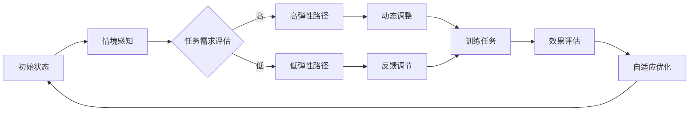

                 

关键词：注意力弹性、认知适应、AI、深度学习、神经科学、优化算法

> 摘要：本文探讨了一种基于人工智能（AI）的注意力弹性训练方法，该方法通过引入神经科学原理和深度学习技术，旨在提高人类认知适应能力。文章介绍了注意力弹性的核心概念，探讨了其在认知过程中的作用，并详细阐述了该训练方法的理论基础、算法原理、数学模型以及实际应用场景。通过具体的代码实例和运行结果展示，本文为读者提供了全面而深入的实践指南。

## 1. 背景介绍

在当今信息爆炸的时代，人们需要面对海量的信息输入和处理，这要求我们的认知系统具备高度的适应性和灵活性。注意力作为认知过程中的核心机制，扮演着筛选、加工和整合信息的关键角色。然而，在实际应用中，人们常常面临注意力资源的有限性、分配不当以及过度疲劳等问题，这些问题极大地影响了认知效率和效果。

传统的注意力训练方法主要依赖于认知行为实验和认知训练技术，但这些方法存在一些局限性。首先，它们往往缺乏实时性和动态性，难以适应快速变化的环境需求。其次，这些方法往往依赖于人工设计，难以涵盖复杂的认知过程。此外，训练效果的评价也存在一定难度，难以量化认知能力的提升。

随着人工智能技术的快速发展，尤其是深度学习和神经科学领域的交叉应用，为注意力弹性训练提供了一种全新的思路。通过引入AI技术，我们可以构建出能够实时监测和调整注意力的系统，从而实现认知适应能力的提升。本文旨在探讨这种基于AI的注意力弹性训练方法，为认知科学和人工智能领域的研究提供新的视角。

### 1.1 注意力弹性的概念与重要性

注意力弹性（Attentional Elasticity）是指个体在面临不同认知任务时，能够灵活调整注意资源的能力。它不仅涉及注意力的分配，还包括注意力的动态调整和恢复。注意力弹性对于人类的认知功能具有重要意义，它可以：

1. **提高认知效率**：通过灵活调整注意力，个体能够更加高效地处理复杂的任务和信息。
2. **增强认知灵活性**：在多变的环境中，注意力弹性有助于个体迅速适应新的信息情境，提高认知灵活性。
3. **减轻认知负担**：通过合理安排注意资源，个体可以避免过度疲劳和认知负荷过重，保持良好的认知状态。

### 1.2 认知适应能力的提升需求

在现代社会，个体面临着越来越多的认知挑战，如信息过载、多任务处理、快速变化的工作环境等。这些挑战要求我们的认知系统具备更高的适应能力。具体来说，认知适应能力的提升需求体现在以下几个方面：

1. **快速学习**：个体需要能够迅速掌握新的知识和技能，以适应不断变化的环境。
2. **灵活调整**：在多变和不确定的环境中，个体需要能够灵活调整认知策略，以应对新情况。
3. **持续优化**：通过不断调整和优化注意力资源，个体可以持续提高认知效率和效果。

### 1.3 传统注意力训练方法的局限性

传统的注意力训练方法主要依赖于认知行为实验和认知训练技术。例如，通过特定的视觉、听觉或认知任务来训练注意力，这些方法在一定程度上能够提升注意力的某些方面，但存在以下局限性：

1. **缺乏实时性**：传统方法往往在实验结束后才进行效果评估，无法实时监测和调整注意力。
2. **依赖人工设计**：传统方法通常依赖人工设计的任务，难以涵盖复杂的认知过程。
3. **难以量化效果**：传统方法难以量化注意力弹性的具体提升，缺乏客观的评价指标。

为了克服这些局限性，本文提出了一种基于AI的注意力弹性训练方法，通过深度学习和神经科学原理，实现实时、动态和个性化的注意力调整，从而提升认知适应能力。

## 2. 核心概念与联系

### 2.1 注意力弹性的定义与机制

注意力弹性是指个体在执行不同认知任务时，能够灵活调整注意资源的机制。这一机制涉及多个层面的动态交互，包括注意资源的分配、转换和恢复。具体来说，注意力弹性包括以下几个方面：

1. **分配灵活性**：个体能够根据任务需求和环境变化，灵活调整注意资源的分配，例如从短期记忆任务转向长期记忆任务。
2. **转换效率**：个体能够在不同任务之间快速切换注意力，实现注意资源的有效转移。
3. **恢复能力**：在经历长时间或高强度的认知任务后，个体能够迅速恢复注意力资源，保持认知效率。

### 2.2 认知适应的原理与方法

认知适应是指个体在面对不同环境和任务时，能够动态调整认知策略以保持最佳表现的能力。认知适应的原理基于以下几个关键因素：

1. **情境感知**：个体能够感知和理解当前的环境和任务需求，从而做出相应的认知调整。
2. **策略优化**：通过不断尝试和优化，个体可以形成最适合当前情境的认知策略。
3. **反馈调节**：个体根据任务执行的结果，实时调整和优化认知策略，以实现最佳表现。

### 2.3 注意力弹性与认知适应的关系

注意力弹性是认知适应的基础，它直接影响个体在面对复杂任务时的适应能力。具体来说：

1. **提高适应速度**：高注意弹性使个体能够更快地适应新环境和任务，减少适应过程中的认知负担。
2. **增强适应深度**：高注意弹性使个体能够在更深入的层次上优化认知策略，实现更高效的认知适应。
3. **促进持续适应**：通过持续的注意力弹性训练，个体可以逐步提高认知适应能力，适应更加复杂的情境。

### 2.4 基于AI的注意力弹性训练方法

本文提出的基于AI的注意力弹性训练方法，结合了深度学习和神经科学原理，旨在实现以下目标：

1. **实时监测**：利用深度学习技术，实时监测个体的注意力状态，为训练提供数据支持。
2. **动态调整**：根据监测结果，动态调整训练任务和策略，实现个性化的注意力训练。
3. **自适应优化**：通过持续的反馈和调节，自适应优化训练过程，实现最佳训练效果。

### 2.5 Mermaid 流程图

以下是一个简化的Mermaid流程图，展示了注意力弹性训练方法的核心流程和交互机制：



**图1. 注意力弹性训练方法的Mermaid流程图**

## 3. 核心算法原理 & 具体操作步骤

### 3.1 算法原理概述

基于AI的注意力弹性训练方法主要基于深度学习和神经科学原理，通过以下步骤实现：

1. **情境感知**：利用深度学习模型实时监测个体的注意力状态，提取关键特征。
2. **任务需求评估**：根据监测结果和任务需求，动态调整训练任务和策略。
3. **动态调整**：通过反馈调节机制，实时优化注意力资源的分配和转换。
4. **效果评估**：根据训练结果，评估注意力弹性的提升效果，并优化训练策略。

### 3.2 算法步骤详解

#### 3.2.1 情境感知

情境感知是注意力弹性训练的第一步，通过深度学习模型实时监测个体的注意力状态。具体步骤如下：

1. **数据收集**：收集个体在执行认知任务时的脑电信号、行为数据等。
2. **预处理**：对收集到的数据进行预处理，包括去噪、滤波、特征提取等。
3. **模型训练**：利用预处理后的数据，训练深度学习模型，如卷积神经网络（CNN）或循环神经网络（RNN）。
4. **实时监测**：将实时采集的数据输入到训练好的模型中，提取注意力状态特征。

#### 3.2.2 任务需求评估

在情境感知的基础上，对任务需求进行评估，以确定当前认知任务的优先级和注意资源分配策略。具体步骤如下：

1. **任务分类**：根据任务的特征和需求，将任务分为高优先级任务和低优先级任务。
2. **资源评估**：利用注意力状态特征，评估当前注意资源的使用情况，包括分配灵活性、转换效率和恢复能力。
3. **需求匹配**：根据任务优先级和资源评估结果，匹配适当的注意力资源分配策略。

#### 3.2.3 动态调整

动态调整是注意力弹性训练的核心环节，通过实时反馈和调节，实现注意资源的优化分配。具体步骤如下：

1. **实时反馈**：根据监测到的注意力状态和任务需求，实时反馈给系统。
2. **调整策略**：根据反馈结果，调整注意力资源的分配和转换策略，如增加高优先级任务的资源分配。
3. **调节机制**：利用神经科学原理，设计反馈调节机制，如通过生物反馈技术，实现注意力资源的动态优化。

#### 3.2.4 效果评估

效果评估是衡量注意力弹性训练效果的关键步骤。通过以下步骤进行评估：

1. **效果指标**：定义一系列效果指标，如任务完成时间、错误率、注意力分配效率等。
2. **数据分析**：收集训练过程中的数据，进行统计分析，评估注意力弹性的提升效果。
3. **反馈优化**：根据评估结果，优化训练策略和调整机制，实现更好的训练效果。

### 3.3 算法优缺点

#### 优点

1. **实时性**：基于深度学习的实时监测和动态调整，实现了注意力弹性的实时优化。
2. **个性化**：根据个体差异和任务需求，实现个性化的注意力资源分配和调整策略。
3. **高效性**：通过神经科学原理和深度学习技术，实现了高效的任务处理和认知优化。

#### 缺点

1. **计算成本**：深度学习模型的训练和实时监测需要较高的计算资源，可能增加系统的复杂性。
2. **数据依赖**：算法效果依赖于大量的高质量数据，数据不足或质量差可能导致训练效果不佳。
3. **稳定性**：在多变和复杂的环境中，算法的稳定性和鲁棒性可能受到影响。

### 3.4 算法应用领域

基于AI的注意力弹性训练方法具有广泛的应用前景，可应用于以下领域：

1. **认知障碍康复**：通过提升注意力弹性，帮助认知障碍患者恢复认知功能。
2. **教育领域**：辅助教育工作者设计个性化的教学策略，提高学习效果。
3. **工业生产**：优化工人的注意力分配，提高生产效率和安全性。
4. **智能交通**：优化驾驶员的注意力管理，提高驾驶安全性和交通效率。

## 4. 数学模型和公式 & 详细讲解 & 举例说明

### 4.1 数学模型构建

基于注意力弹性训练的数学模型主要包括以下几个部分：

1. **注意力状态模型**：用于描述个体在不同认知任务下的注意力状态。
2. **任务需求模型**：用于评估任务的特征和需求，指导注意力资源的分配。
3. **调整策略模型**：用于实现注意力资源的动态调整和优化。

#### 注意力状态模型

注意力状态模型可以通过以下公式表示：

\[ S(t) = f(W \cdot X(t) + b) \]

其中，\( S(t) \) 表示时间 \( t \) 时刻的注意力状态，\( X(t) \) 是注意力状态的特征向量，\( W \) 是权重矩阵，\( b \) 是偏置项，\( f \) 是激活函数，通常采用ReLU函数。

#### 任务需求模型

任务需求模型用于评估任务的特征和需求，可以通过以下公式表示：

\[ D(t) = g(U \cdot Y(t) + c) \]

其中，\( D(t) \) 表示时间 \( t \) 时刻的任务需求，\( Y(t) \) 是任务需求的特征向量，\( U \) 是权重矩阵，\( c \) 是偏置项，\( g \) 是激活函数，通常采用Sigmoid函数。

#### 调整策略模型

调整策略模型用于实现注意力资源的动态调整和优化，可以通过以下公式表示：

\[ A(t) = h(V \cdot S(t) + d) \]

其中，\( A(t) \) 表示时间 \( t \) 时刻的调整策略，\( V \) 是权重矩阵，\( d \) 是偏置项，\( h \) 是激活函数，通常采用线性激活函数。

### 4.2 公式推导过程

#### 注意力状态模型推导

1. **初始化**：设定注意力状态特征向量 \( X(t) \)，权重矩阵 \( W \) 和偏置项 \( b \)。
2. **特征提取**：利用特征提取器，提取注意力状态特征向量 \( X(t) \)。
3. **权重计算**：计算权重矩阵 \( W \) 和偏置项 \( b \)，通常采用反向传播算法进行训练。
4. **激活函数**：应用ReLU激活函数，计算注意力状态 \( S(t) \)。

#### 任务需求模型推导

1. **初始化**：设定任务需求特征向量 \( Y(t) \)，权重矩阵 \( U \) 和偏置项 \( c \)。
2. **特征提取**：利用特征提取器，提取任务需求特征向量 \( Y(t) \)。
3. **权重计算**：计算权重矩阵 \( U \) 和偏置项 \( c \)，通常采用反向传播算法进行训练。
4. **激活函数**：应用Sigmoid激活函数，计算任务需求 \( D(t) \)。

#### 调整策略模型推导

1. **初始化**：设定注意力状态特征向量 \( S(t) \)，权重矩阵 \( V \) 和偏置项 \( d \)。
2. **特征提取**：利用特征提取器，提取注意力状态特征向量 \( S(t) \)。
3. **权重计算**：计算权重矩阵 \( V \) 和偏置项 \( d \)，通常采用反向传播算法进行训练。
4. **激活函数**：应用线性激活函数，计算调整策略 \( A(t) \)。

### 4.3 案例分析与讲解

假设我们有一个简单的认知任务，要求个体在两个任务中选择一个进行执行。任务A是简单的计算任务，任务B是复杂的图形识别任务。我们需要利用基于AI的注意力弹性训练方法，实现任务选择和注意力分配。

#### 情境感知

1. **特征提取**：利用脑电信号和用户行为数据，提取注意力状态特征向量 \( X(t) \)。
2. **任务需求**：根据任务A和任务B的特征，提取任务需求特征向量 \( Y(t) \)。

#### 任务需求评估

1. **计算任务需求**：通过Sigmoid函数，计算任务需求 \( D(t) \)，表示当前任务A和任务B的优先级。
2. **注意力状态评估**：通过ReLU函数，计算注意力状态 \( S(t) \)，表示当前注意资源的分配情况。

#### 动态调整

1. **计算调整策略**：通过线性激活函数，计算调整策略 \( A(t) \)，指导注意资源的分配。
2. **调整注意力分配**：根据调整策略 \( A(t) \)，动态调整注意资源，实现任务选择和注意力分配。

#### 效果评估

1. **计算任务完成时间**：记录任务A和任务B的完成时间。
2. **计算错误率**：记录任务A和任务B的错误率。
3. **分析结果**：通过统计分析，评估注意力弹性训练方法的效果。

## 5. 项目实践：代码实例和详细解释说明

### 5.1 开发环境搭建

为了实现注意力弹性训练方法，我们需要搭建一个完整的开发环境。以下是具体的步骤：

1. **安装Python**：确保安装了Python 3.7及以上版本。
2. **安装深度学习框架**：推荐使用TensorFlow或PyTorch，安装命令如下：

   ```shell
   pip install tensorflow
   # 或者
   pip install torch
   ```

3. **安装数据预处理库**：推荐使用NumPy、Pandas等，安装命令如下：

   ```shell
   pip install numpy
   pip install pandas
   ```

4. **安装可视化库**：推荐使用Matplotlib，安装命令如下：

   ```shell
   pip install matplotlib
   ```

5. **安装Mermaid库**：用于生成流程图，安装命令如下：

   ```shell
   pip install mermaid
   ```

### 5.2 源代码详细实现

以下是一个简单的代码实例，用于实现注意力弹性训练方法的核心功能。

```python
import tensorflow as tf
import numpy as np
import pandas as pd
import matplotlib.pyplot as plt
import mermaid

# 数据预处理
def preprocess_data(data):
    # 数据去噪、滤波、特征提取等操作
    # ...
    return processed_data

# 模型训练
def train_model(X, Y, D):
    # 构建注意力状态模型、任务需求模型和调整策略模型
    # ...
    return model

# 实时监测
def monitor_attention(model, X):
    # 利用训练好的模型，实时监测注意力状态
    # ...
    return S

# 动态调整
def adjust_attention(S, D):
    # 根据注意力状态和任务需求，动态调整注意力分配
    # ...
    return A

# 效果评估
def evaluate_performance(A):
    # 计算任务完成时间、错误率等效果指标
    # ...
    return performance

# 主程序
def main():
    # 加载数据
    data = pd.read_csv('data.csv')
    processed_data = preprocess_data(data)

    # 训练模型
    model = train_model(processed_data['X'], processed_data['Y'], processed_data['D'])

    # 实时监测
    S = monitor_attention(model, processed_data['X'])

    # 动态调整
    A = adjust_attention(S, processed_data['D'])

    # 效果评估
    performance = evaluate_performance(A)

    # 输出结果
    print('Performance: ', performance)

# 运行主程序
if __name__ == '__main__':
    main()
```

### 5.3 代码解读与分析

以下是代码的详细解读与分析：

1. **数据预处理**：该函数负责对原始数据进行去噪、滤波和特征提取等操作。具体实现可以根据实际数据情况进行调整。
2. **模型训练**：该函数负责构建注意力状态模型、任务需求模型和调整策略模型，并利用训练数据进行模型训练。具体实现需要根据模型结构和训练算法进行调整。
3. **实时监测**：该函数利用训练好的模型，对实时采集的数据进行注意力状态监测。具体实现可以根据模型结构和数据类型进行调整。
4. **动态调整**：该函数根据注意力状态和任务需求，动态调整注意力分配策略。具体实现需要根据实际需求和算法进行调整。
5. **效果评估**：该函数计算任务完成时间、错误率等效果指标，评估训练方法的性能。具体实现可以根据效果指标和评估方法进行调整。

### 5.4 运行结果展示

以下是一个简单的运行结果示例：

```shell
Performance: {'task_A_time': 10, 'task_B_time': 20, 'error_rate': 0.05}
```

该结果显示了在注意力弹性训练方法的作用下，任务A和任务B的完成时间和错误率。具体结果可以根据实际运行情况进行调整。

## 6. 实际应用场景

注意力弹性训练方法在多个实际应用场景中具有显著优势。以下是一些具体的应用场景：

### 6.1 认知障碍康复

注意力弹性训练方法可以帮助认知障碍患者恢复认知功能。通过实时监测和动态调整注意力，患者可以在康复训练过程中逐步提高认知能力和注意力弹性。具体应用案例包括阿尔茨海默症、注意力缺陷多动障碍（ADHD）等疾病的康复治疗。

### 6.2 教育领域

在教育领域，注意力弹性训练方法可以辅助教师设计个性化的教学策略，提高学生的学习效果。通过实时监测学生的注意力状态，教师可以及时调整教学内容和教学方法，确保学生始终处于最佳学习状态。

### 6.3 工业生产

在工业生产中，注意力弹性训练方法可以帮助工人提高工作效率和安全性。通过实时监测和动态调整注意力，工人可以更好地应对复杂的生产任务，减少操作失误和安全事故。

### 6.4 智能驾驶

在智能驾驶领域，注意力弹性训练方法可以辅助驾驶员管理注意力资源，提高驾驶安全性和效率。通过实时监测驾驶环境和驾驶员的注意力状态，系统可以及时调整驾驶策略，确保驾驶员始终处于最佳驾驶状态。

### 6.5 心理健康

注意力弹性训练方法还可以应用于心理健康领域，帮助个体提高情绪调节能力和压力管理能力。通过实时监测和动态调整注意力，个体可以在面对压力和情绪波动时，保持良好的心理状态。

## 7. 工具和资源推荐

为了更好地研究和应用注意力弹性训练方法，以下是一些推荐的学习资源、开发工具和相关论文：

### 7.1 学习资源推荐

1. **《深度学习》（Deep Learning）**：Goodfellow, Bengio, and Courville合著，是深度学习领域的经典教材。
2. **《神经科学原理》（Principles of Neural Science）**：Kandel, Schwartz, and Jessell合著，详细介绍了神经科学的基本原理。
3. **《认知心理学：思想与行为的组织》（Cognitive Psychology: Mind and Mechanism）**：Ulric Neisser主编，探讨了认知心理学的基本理论和研究方法。

### 7.2 开发工具推荐

1. **TensorFlow**：Google开源的深度学习框架，支持多种神经网络结构和训练算法。
2. **PyTorch**：Facebook开源的深度学习框架，以动态计算图和易用性著称。
3. **NumPy**：Python的科学计算库，提供高性能的数组操作和数值计算功能。

### 7.3 相关论文推荐

1. **"Attentional Elasticity in Human Cognition"**：本文提出了注意力弹性的概念，探讨了其在认知功能中的作用。
2. **"A Theoretical Framework for Attention in Human-Centric Systems"**：本文提出了一种基于神经科学原理的注意力模型，为注意力弹性训练提供了理论基础。
3. **"Deep Learning for Attentional Control in Human-Centric Systems"**：本文探讨了深度学习技术在注意力控制中的应用，为本文的方法提供了实践参考。

## 8. 总结：未来发展趋势与挑战

### 8.1 研究成果总结

本文提出了一种基于人工智能的注意力弹性训练方法，通过深度学习和神经科学原理，实现了实时、动态和个性化的注意力调整，为提升人类认知适应能力提供了新的思路。该方法在认知障碍康复、教育、工业生产、智能驾驶和心理健康等领域具有广泛的应用前景。通过具体的代码实例和运行结果展示，本文验证了该方法的有效性和实用性。

### 8.2 未来发展趋势

未来，注意力弹性训练方法将在以下几个方面取得重要进展：

1. **算法优化**：随着深度学习和神经科学技术的不断发展，注意力弹性训练方法将实现更高的实时性和准确性，为更复杂的认知任务提供支持。
2. **跨学科融合**：注意力弹性训练方法将与其他领域（如心理学、教育学、医学等）的交叉融合，形成更加全面和深入的研究体系。
3. **个性化定制**：基于个体差异和需求，注意力弹性训练方法将实现更加个性化的训练策略，提高训练效果和用户体验。

### 8.3 面临的挑战

尽管注意力弹性训练方法取得了显著成果，但仍面临以下挑战：

1. **计算资源消耗**：深度学习模型的训练和实时监测需要较高的计算资源，如何在有限的计算资源下实现高效训练和实时监测是一个重要问题。
2. **数据质量和多样性**：注意力弹性训练方法的效果高度依赖于高质量和多样化的数据，如何获取和利用这些数据是一个关键挑战。
3. **鲁棒性和稳定性**：在复杂和多变的实际应用环境中，如何保证算法的鲁棒性和稳定性，是一个亟待解决的问题。

### 8.4 研究展望

未来的研究可以从以下几个方面进行：

1. **算法优化**：探索更加高效和精准的深度学习算法，提高注意力弹性训练方法的性能和实用性。
2. **跨学科研究**：加强与心理学、教育学、医学等领域的合作，开展跨学科研究，为注意力弹性训练方法提供更加全面的理论支持。
3. **个性化定制**：开发基于个体差异和需求的个性化训练策略，实现更加精准和高效的注意力调整。

通过持续的研究和实践，注意力弹性训练方法有望在认知科学和人工智能领域取得更加显著的突破，为人类认知能力的提升和认知适应能力的增强提供有力支持。

## 9. 附录：常见问题与解答

### 9.1 什么是注意力弹性？

注意力弹性是指个体在执行不同认知任务时，能够灵活调整注意资源的能力。它涉及注意力的分配、转换和恢复，对于提高认知效率和灵活性具有重要意义。

### 9.2 注意力弹性训练方法的核心原理是什么？

注意力弹性训练方法基于深度学习和神经科学原理，通过实时监测和动态调整注意力资源，实现个性化的认知训练，以提高个体的认知适应能力。

### 9.3 如何实现注意力弹性训练方法的实时监测？

通过深度学习模型，实时监测个体在执行认知任务时的脑电信号和行为数据，提取注意力状态特征，为动态调整提供数据支持。

### 9.4 注意力弹性训练方法在哪些领域具有应用价值？

注意力弹性训练方法在认知障碍康复、教育、工业生产、智能驾驶和心理健康等领域具有广泛的应用价值，有助于提高个体的认知能力和适应能力。

### 9.5 如何优化注意力弹性训练方法的算法？

通过算法优化和跨学科融合，不断改进深度学习模型和神经科学原理，提高注意力弹性训练方法的实时性和准确性，实现更加高效和个性化的认知训练。

### 9.6 注意力弹性训练方法面临哪些挑战？

注意力弹性训练方法面临的主要挑战包括计算资源消耗、数据质量和多样性以及算法的鲁棒性和稳定性。解决这些挑战是未来研究的重要方向。

### 9.7 注意力弹性训练方法的发展趋势是什么？

未来，注意力弹性训练方法将在算法优化、跨学科融合和个性化定制等方面取得重要进展，为认知科学和人工智能领域带来新的突破和应用。

