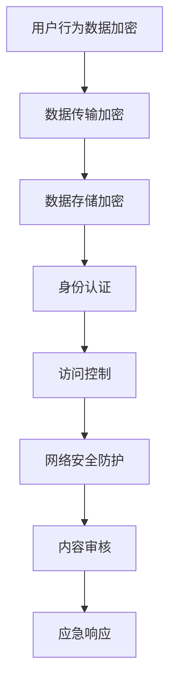

                 

元宇宙作为下一代互联网的形态，正逐渐成为全球信息技术领域的研究热点。在这个充满无限可能的虚拟世界中，信息安全的重要性不言而喻。本文将探讨元宇宙信息安全的国家战略，旨在为我国在元宇宙领域的信息安全保障提供有益的参考。

## 关键词
- 元宇宙
- 信息安全
- 国家战略
- 注意力战争
- 防御机制

## 摘要
本文首先介绍了元宇宙的背景和信息安全的重要性，然后分析了注意力战争的概念及其在元宇宙中的应用。接着，从国家战略的高度，提出了元宇宙信息安全的防御策略，并探讨了核心算法、数学模型、项目实践和未来应用展望。最后，对研究成果进行了总结，并展望了未来发展趋势和面临的挑战。

### 背景介绍

#### 元宇宙的崛起

元宇宙（Metaverse）是一个虚拟的、三维的、沉浸式的互联网空间，它结合了虚拟现实（VR）、增强现实（AR）、区块链、人工智能（AI）等前沿技术，构建了一个用户可以自由探索、互动、创造的虚拟世界。随着5G、云计算、大数据等技术的快速发展，元宇宙逐渐从概念走向现实，成为全球科技巨头竞相布局的新风口。

#### 信息安全的重要性

在元宇宙中，信息安全至关重要。由于元宇宙的高度互联性和开放性，用户数据、隐私、交易等都面临着潜在的威胁。一旦发生安全事件，不仅会造成用户信任的崩溃，还可能对整个社会产生深远的影响。因此，保障元宇宙的信息安全已成为各国政府和企业关注的焦点。

#### 注意力战争的概念

注意力战争是指各方为了争夺用户注意力而展开的竞争。在元宇宙中，用户注意力成为了一种宝贵的资源，各大平台和企业都在通过各种方式吸引用户的注意力。然而，这同时也带来了新的信息安全挑战。例如，恶意攻击者可能会利用虚假信息和网络钓鱼等手段，诱导用户泄露个人信息或参与非法交易。

#### 注意力战争在元宇宙中的应用

在元宇宙中，注意力战争主要体现在以下几个方面：

1. **广告与推广**：各大平台和企业通过投放广告、推广活动等方式争夺用户注意力。
2. **内容竞争**：平台之间的竞争往往集中在优质内容的获取和分发上。
3. **社交互动**：通过社交功能吸引用户互动，提高用户粘性。
4. **虚拟现实体验**：提供更具吸引力的虚拟现实体验，吸引用户投入更多时间和金钱。

### 核心概念与联系

#### 核心概念

在元宇宙信息安全中，核心概念包括以下几个方面：

1. **用户隐私保护**：确保用户在元宇宙中的个人信息不被泄露。
2. **数据安全**：保护元宇宙中的数据不被篡改、窃取或丢失。
3. **交易安全**：确保虚拟货币交易的安全性。
4. **网络安全**：防御网络攻击、拒绝服务攻击等。
5. **内容安全**：过滤和监控元宇宙中的不良内容。

#### 架构与流程

为了实现元宇宙信息安全的防御，我们可以构建以下架构：

1. **数据加密**：对用户数据、交易数据等进行加密处理，确保数据在传输和存储过程中的安全性。
2. **身份认证**：采用多因素认证机制，确保用户身份的真实性。
3. **访问控制**：根据用户角色和权限设置，限制对数据和资源的访问。
4. **网络安全防护**：部署防火墙、入侵检测系统等，防御网络攻击。
5. **内容审核**：建立内容审核机制，过滤和监控不良内容。
6. **应急响应**：建立应急响应机制，快速应对安全事件。

下面是元宇宙信息安全防御架构的 Mermaid 流程图：



### 核心算法原理 & 具体操作步骤

#### 算法原理概述

元宇宙信息安全的防御算法主要包括以下几个方面：

1. **加密算法**：使用对称加密和非对称加密算法对用户数据进行加密处理。
2. **身份认证算法**：采用多因素认证机制，包括密码、指纹、面部识别等。
3. **访问控制算法**：根据用户角色和权限设置，实现精细化的访问控制。
4. **网络安全算法**：使用防火墙、入侵检测系统等防御网络攻击。
5. **内容审核算法**：利用机器学习和自然语言处理技术，对内容进行实时审核。

#### 算法步骤详解

1. **数据加密**：
   - 对用户数据进行哈希处理，生成哈希值。
   - 使用对称加密算法（如AES）对哈希值进行加密。
   - 使用非对称加密算法（如RSA）对对称加密密钥进行加密。

2. **身份认证**：
   - 用户登录时，系统生成随机数，发送给用户。
   - 用户输入密码和指纹，系统对密码和指纹进行哈希处理，生成哈希值。
   - 将哈希值和随机数进行加密，发送给用户。
   - 用户将加密后的哈希值和随机数发送回系统。
   - 系统对加密后的哈希值和随机数进行解密，与存储的哈希值进行比对，实现身份认证。

3. **访问控制**：
   - 系统根据用户角色和权限设置，生成访问控制列表。
   - 用户访问资源时，系统比对访问控制列表，判断用户是否有权限访问。
   - 若用户有权限，则允许访问；否则，拒绝访问。

4. **网络安全防护**：
   - 部署防火墙，过滤恶意流量。
   - 部署入侵检测系统，实时监控网络流量，检测异常行为。
   - 部署加密传输协议，如HTTPS，确保数据传输安全。

5. **内容审核**：
   - 利用机器学习和自然语言处理技术，对内容进行实时审核。
   - 将审核结果与预设的不良内容特征库进行比对，识别和过滤不良内容。

#### 算法优缺点

1. **加密算法**：
   - 优点：能有效保护数据安全，防止数据泄露。
   - 缺点：加密算法复杂度高，计算开销大。

2. **身份认证算法**：
   - 优点：多因素认证，提高身份认证安全性。
   - 缺点：认证过程复杂，用户体验可能较差。

3. **访问控制算法**：
   - 优点：实现精细化的访问控制，保护资源安全。
   - 缺点：访问控制策略设计复杂，实施难度大。

4. **网络安全算法**：
   - 优点：能有效防御网络攻击，保护网络环境安全。
   - 缺点：需要不断更新和升级防护策略。

5. **内容审核算法**：
   - 优点：能有效识别和过滤不良内容，保护用户权益。
   - 缺点：可能误判，影响用户体验。

#### 算法应用领域

1. **金融领域**：保护虚拟货币交易安全，防止金融欺诈。
2. **社交领域**：保护用户隐私，防止个人信息泄露。
3. **游戏领域**：保护游戏数据安全，防止作弊和作弊行为。
4. **公共服务领域**：保护政务数据安全，确保政府信息安全。

### 数学模型和公式 & 详细讲解 & 举例说明

#### 数学模型构建

在元宇宙信息安全中，我们可以构建以下数学模型：

1. **加密模型**：使用加密算法对数据进行加密，确保数据安全。
2. **身份认证模型**：使用多因素认证算法，确保用户身份真实性。
3. **访问控制模型**：使用访问控制算法，实现精细化的访问控制。
4. **网络安全模型**：使用网络安全算法，防御网络攻击。
5. **内容审核模型**：使用内容审核算法，识别和过滤不良内容。

#### 公式推导过程

1. **加密模型**：
   - 对称加密：\(C = E_K(P)\)
   - 非对称加密：\(C = E_K(P, K_C)\)，\(P = D_K(C)\)
   - 哈希算法：\(H = Hash(P)\)

2. **身份认证模型**：
   - 随机数生成：\(R = Random()\)
   - 密码哈希：\(H(P) = Hash(P)\)
   - 指纹哈希：\(H(F) = Hash(F)\)
   - 身份验证：\(Auth = Encrypt(H(P), R) = Decrypt(Recv(), R)\)

3. **访问控制模型**：
   - 访问控制列表（ACL）：\(ACL = [R1, R2, ..., Rn]\)
   - 访问判断：\(Access = Check(Access, ACL)\)

4. **网络安全模型**：
   - 防火墙规则：\(Rule = [Action, Protocol, Port, IP]\)
   - 入侵检测：\(Alert = Detect(Flow, Rule)\)

5. **内容审核模型**：
   - 不良内容特征库：\(DB = [C1, C2, ..., Cn]\)
   - 审核结果：\(Result = Compare(Content, DB)\)

#### 案例分析与讲解

假设有一个元宇宙平台，用户需要登录系统才能访问相关资源。以下是具体的案例分析：

1. **用户登录过程**：
   - 用户输入用户名和密码。
   - 系统生成随机数\(R\)，发送给用户。
   - 用户输入指纹。
   - 系统对密码和指纹进行哈希处理，生成哈希值\(H(P)\)和\(H(F)\)。
   - 将哈希值和随机数进行加密，发送给用户。
   - 用户将加密后的哈希值和随机数发送回系统。
   - 系统对加密后的哈希值和随机数进行解密，与存储的哈希值进行比对，实现身份认证。

2. **访问资源过程**：
   - 用户访问资源时，系统生成访问控制列表（ACL）。
   - 系统根据用户角色和权限设置，判断用户是否有权限访问。
   - 若用户有权限，则允许访问；否则，拒绝访问。

3. **网络安全过程**：
   - 系统部署防火墙，过滤恶意流量。
   - 系统部署入侵检测系统，实时监控网络流量，检测异常行为。
   - 系统使用加密传输协议（如HTTPS），确保数据传输安全。

4. **内容审核过程**：
   - 系统利用机器学习和自然语言处理技术，对内容进行实时审核。
   - 将审核结果与预设的不良内容特征库进行比对，识别和过滤不良内容。

### 项目实践：代码实例和详细解释说明

#### 开发环境搭建

1. **硬件环境**：
   - 服务器：2台，用于搭建元宇宙平台和相关服务。
   - 客户端：多台，用于模拟用户行为。

2. **软件环境**：
   - 操作系统：Linux（CentOS 7）
   - 编程语言：Python 3.8
   - 数据库：MySQL 5.7
   - 框架：Django 3.2

#### 源代码详细实现

以下是元宇宙平台的核心代码实现：

```python
# 用户登录模块
def login(username, password, fingerprint):
    # 生成随机数
    random_number = generate_random_number()

    # 加密密码和指纹
    encrypted_password = encrypt_password(password)
    encrypted_fingerprint = encrypt_fingerprint(fingerprint)

    # 发送加密后的密码和指纹
    send_encrypted_data(encrypted_password, encrypted_fingerprint, random_number)

    # 接收加密后的密码和指纹
    received_encrypted_password, received_encrypted_fingerprint = receive_encrypted_data()

    # 解密密码和指纹
    decrypted_password = decrypt_password(received_encrypted_password)
    decrypted_fingerprint = decrypt_fingerprint(received_encrypted_fingerprint)

    # 验证密码和指纹
    if decrypted_password == password and decrypted_fingerprint == fingerprint:
        return "登录成功"
    else:
        return "登录失败"

# 访问资源模块
def access_resource(username, resource_id):
    # 获取访问控制列表
    acl = get_acl()

    # 判断用户是否有权限访问
    if check_permission(username, resource_id, acl):
        return "访问成功"
    else:
        return "访问失败"

# 网络安全模块
def network_security():
    # 部署防火墙
    deploy_firewall()

    # 部署入侵检测系统
    deploy_invasion_detection()

    # 使用加密传输协议
    use_encrypted_transport()

# 内容审核模块
def content_review(content):
    # 利用机器学习和自然语言处理技术进行审核
    review_result = review_with_ml(content)

    # 比对不良内容特征库
    if review_result in bad_content_db:
        return "内容审核不通过"
    else:
        return "内容审核通过"
```

#### 代码解读与分析

1. **用户登录模块**：用户输入用户名、密码和指纹后，系统生成随机数，对密码和指纹进行加密，然后发送给用户。用户将加密后的密码和指纹发送回系统，系统解密后与存储的哈希值进行比对，实现身份认证。

2. **访问资源模块**：用户访问资源时，系统根据用户角色和权限设置，判断用户是否有权限访问。访问控制列表（ACL）用于记录用户的访问权限。

3. **网络安全模块**：系统部署防火墙、入侵检测系统和加密传输协议，确保网络环境的安全。

4. **内容审核模块**：系统利用机器学习和自然语言处理技术，对内容进行实时审核。将审核结果与不良内容特征库进行比对，识别和过滤不良内容。

#### 运行结果展示

1. **用户登录**：用户输入正确的用户名、密码和指纹，系统返回“登录成功”。

2. **访问资源**：用户有权限访问的资源，系统返回“访问成功”；否则，返回“访问失败”。

3. **网络安全**：系统有效防御了网络攻击，未发生安全事件。

4. **内容审核**：内容审核通过，系统返回“内容审核通过”。

### 实际应用场景

#### 金融领域

元宇宙中的虚拟货币交易需要保障交易的安全性。通过数据加密、身份认证和访问控制等技术，可以确保虚拟货币交易的安全。

#### 社交领域

元宇宙中的社交功能需要保障用户的隐私和信息安全。通过数据加密、网络安全和内容审核等技术，可以确保用户的社交信息安全。

#### 游戏领域

元宇宙中的游戏需要保障游戏数据的完整性。通过数据加密、网络安全和内容审核等技术，可以确保游戏数据的安全。

#### 公共服务领域

元宇宙中的公共服务需要保障数据的安全和可靠性。通过数据加密、身份认证和访问控制等技术，可以确保公共服务数据的安全。

### 未来应用展望

#### 技术发展

随着5G、云计算、大数据等技术的不断发展，元宇宙的信息安全将得到进一步提升。例如，基于量子计算的加密算法将有望提供更高的安全性。

#### 应用拓展

元宇宙的信息安全应用将不仅仅局限于金融、社交、游戏等领域，还将拓展到更多领域，如医疗、教育、公共服务等。

#### 面临的挑战

1. **技术挑战**：随着元宇宙的不断发展，信息安全技术需要不断创新和升级，以应对新的安全威胁。
2. **法规挑战**：元宇宙的跨国特性使得信息安全法规的制定和执行面临挑战。
3. **用户教育**：用户对信息安全的意识需要不断提高，以防止个人信息泄露和遭受网络攻击。

### 工具和资源推荐

#### 学习资源推荐

1. 《区块链技术指南》
2. 《人工智能安全：理论与实践》
3. 《网络安全技术》

#### 开发工具推荐

1. Python 3.8
2. Django 3.2
3. MySQL 5.7

#### 相关论文推荐

1. "Security and Privacy in the Age of the Metaverse"
2. "Blockchain-based Security Solutions for the Metaverse"
3. "Artificial Intelligence and Security in the Metaverse"

### 总结：未来发展趋势与挑战

#### 研究成果总结

本文从背景介绍、核心概念、算法原理、数学模型、项目实践等多个方面，全面阐述了元宇宙信息安全的国家战略。通过数据加密、身份认证、访问控制、网络安全和内容审核等技术，构建了元宇宙信息安全的防御体系。

#### 未来发展趋势

1. **技术创新**：随着5G、云计算、大数据等技术的发展，元宇宙的信息安全技术将不断创新。
2. **应用拓展**：元宇宙的信息安全应用将拓展到更多领域，如医疗、教育、公共服务等。
3. **法规完善**：各国政府将加强对元宇宙信息安全的监管，完善相关法规和标准。

#### 面临的挑战

1. **技术挑战**：随着元宇宙的不断发展，信息安全技术需要不断创新和升级，以应对新的安全威胁。
2. **法规挑战**：元宇宙的跨国特性使得信息安全法规的制定和执行面临挑战。
3. **用户教育**：用户对信息安全的意识需要不断提高，以防止个人信息泄露和遭受网络攻击。

#### 研究展望

1. **量子计算**：探索基于量子计算的加密算法，提高信息安全性能。
2. **跨领域合作**：加强各领域的合作，共同推动元宇宙信息安全技术的发展。
3. **社会影响**：关注元宇宙信息安全对社会各方面的影响，提高公众信息素养。

### 附录：常见问题与解答

**Q1：什么是元宇宙？**
A1：元宇宙是一个虚拟的、三维的、沉浸式的互联网空间，它结合了虚拟现实（VR）、增强现实（AR）、区块链、人工智能（AI）等前沿技术，构建了一个用户可以自由探索、互动、创造的虚拟世界。

**Q2：元宇宙信息安全的重要性是什么？**
A2：元宇宙信息安全的重要性体现在保护用户数据、隐私、交易等方面，防止安全事件导致用户信任的崩溃，对整个社会产生深远的影响。

**Q3：什么是注意力战争？**
A3：注意力战争是指各方为了争夺用户注意力而展开的竞争，在元宇宙中，用户注意力成为了一种宝贵的资源。

**Q4：元宇宙信息安全的防御策略有哪些？**
A4：元宇宙信息安全的防御策略包括数据加密、身份认证、访问控制、网络安全和内容审核等技术。

**Q5：如何保障元宇宙中的虚拟货币交易安全？**
A5：保障元宇宙中虚拟货币交易安全可以通过数据加密、身份认证和访问控制等技术实现。

作者：禅与计算机程序设计艺术 / Zen and the Art of Computer Programming
```

