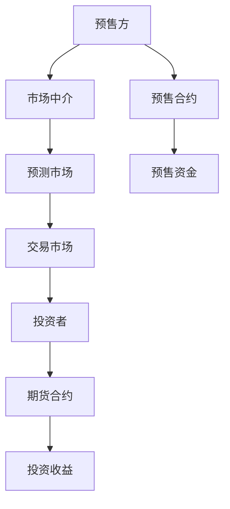

                 

关键词：注意力经济、元宇宙、期货市场、注意力资源预售、人工智能、计算架构

## 摘要

本文探讨了元宇宙中的注意力资源预售这一新兴概念，即如何通过注意力期货市场来实现注意力资源的合理分配和有效利用。在传统市场机制的基础上，我们引入了人工智能技术，构建了一个具备自优化能力的注意力资源预售平台。本文首先介绍了注意力期货市场的基本概念和运行原理，随后详细阐述了其核心算法原理、数学模型构建和应用案例，最后对这一市场的未来应用前景进行了展望。

## 1. 背景介绍

随着互联网的迅速发展，信息过载已成为一个普遍现象。在如此庞大的信息海洋中，如何有效获取和利用人们的注意力资源成为了一个亟待解决的问题。传统的广告市场、社交媒体平台等已经形成了较为成熟的市场机制，但它们往往存在一些局限性：

- **效率问题**：传统市场往往依赖于用户点击、浏览等被动行为，无法准确预测用户的真实兴趣和需求。
- **公平性问题**：由于数据垄断和信息不对称，大企业往往能够以较低成本获得大量注意力资源，而中小企业和新兴势力则难以竞争。
- **可持续性问题**：过度依赖广告收入，导致内容质量和用户体验下降，长期来看不利于生态的健康发展。

为了解决这些问题，我们需要探索一种新的市场机制，能够更精准地匹配供应和需求，同时保证市场的公平性和可持续性。在这个背景下，注意力期货市场应运而生。

### 什么是注意力期货市场？

注意力期货市场是一种基于预测和交易的机制，它允许个人、企业或其他组织通过预售未来的注意力资源来获取资金，而投资者则可以通过购买这些期货合约来参与市场。这种机制的核心在于：

- **预售机制**：通过预售未来的注意力资源，企业或个人可以提前获得资金，用于内容的创作、营销等。
- **预测机制**：市场中的所有参与者（预售方和投资者）共同参与对注意力资源的预测，通过市场机制实现资源的最优分配。
- **交易机制**：预售方和投资者通过买卖注意力期货合约来达成交易，价格由市场供需决定。

注意力期货市场不仅能够为企业提供一种新的融资途径，还可以为投资者提供一种新的投资渠道，从而实现资源的优化配置和市场效率的提升。

## 2. 核心概念与联系

为了更好地理解注意力期货市场的运作机制，我们需要引入一些核心概念，并使用Mermaid流程图来展示它们之间的联系。

### 2.1. 核心概念

- **注意力资源**：用户在特定时间内对某一内容的关注度、兴趣度等。
- **预售方**：拥有注意力资源的个人或企业，通过预售获得资金。
- **投资者**：购买注意力期货合约的个体，通过投资来分享注意力资源的收益。
- **市场中介**：提供交易平台、交易规则、数据支持等服务的机构。

### 2.2. Mermaid流程图



### 2.3. 概念解释

- **预售方**：预售方通过市场中介发布预售合约，合约中包含了未来可能获得的注意力资源数量、预售价格、预售期限等信息。预售方的目标是提前获得资金，以支持内容创作、市场推广等活动。
- **投资者**：投资者通过市场中介购买预售方的期货合约，合约中包含了预售方的预售信息以及投资者可获得的预期收益。投资者的目标是通过对预售合约的购买来分享预售方的收益。
- **市场中介**：市场中介是整个注意力期货市场的核心，它提供交易平台、交易规则、数据支持等服务。市场中介通过大数据分析和人工智能技术，对预售合约进行风险评估、价格预测等，以确保市场的公平性和透明性。
- **预测市场**：预测市场是市场中介提供的一种功能，它允许所有参与者对预售合约的预期收益进行预测和交易。通过预测市场的机制，市场中介能够收集到大量的预测数据，从而提高预测的准确性。
- **交易市场**：交易市场是投资者之间进行期货合约买卖的交易场所。交易市场的价格由市场供需决定，通过价格波动来反映市场对预售合约预期收益的判断。

通过上述核心概念和Mermaid流程图，我们可以清晰地看到注意力期货市场的运作机制。预售方、投资者和市场中介之间的相互作用，共同构成了一个高效的注意力资源交易平台。

## 3. 核心算法原理 & 具体操作步骤

### 3.1 算法原理概述

注意力期货市场的核心在于如何对预售合约的预期收益进行准确预测，以及如何通过市场机制实现资源的合理配置。为此，我们引入了一种基于人工智能的预测算法，该算法主要包括以下几个部分：

- **数据收集**：通过爬虫、API接口等手段，收集预售方的预售信息、用户历史行为数据、市场环境数据等。
- **数据预处理**：对收集到的数据进行清洗、去重、标准化等预处理，以便进行后续分析。
- **特征工程**：提取与预售合约预期收益相关的特征，如预售价格、预售期限、用户关注度、市场环境等。
- **模型训练**：使用机器学习算法（如决策树、随机森林、神经网络等）对特征数据进行训练，建立预测模型。
- **模型评估**：使用交叉验证、网格搜索等方法对模型进行评估，选择最优模型。
- **预测应用**：将训练好的模型应用到预售合约的预期收益预测中，为投资者提供决策依据。

### 3.2 算法步骤详解

#### 3.2.1 数据收集

数据收集是整个算法的基础，我们需要从多个渠道获取相关数据。具体包括：

- **预售方信息**：预售方的名称、预售合约内容、预售价格、预售期限等。
- **用户行为数据**：用户对预售合约的浏览量、点赞数、评论数、分享数等。
- **市场环境数据**：宏观经济指标、行业趋势、市场情绪等。

#### 3.2.2 数据预处理

数据预处理包括以下步骤：

- **数据清洗**：去除重复数据、异常数据，保证数据质量。
- **数据去重**：对相同预售方的多条数据进行去重处理，避免重复计算。
- **数据标准化**：对数值型数据进行标准化处理，使其在相同的尺度上进行分析。

#### 3.2.3 特征工程

特征工程是提高预测模型性能的关键步骤，我们需要提取与预售合约预期收益相关的特征。具体包括：

- **预售价格**：预售合约的价格。
- **预售期限**：预售合约的期限。
- **用户关注度**：用户对预售合约的关注度，可以通过浏览量、点赞数、评论数等指标来衡量。
- **市场环境**：宏观经济指标、行业趋势、市场情绪等。

#### 3.2.4 模型训练

模型训练是使用机器学习算法对特征数据进行训练，建立预测模型。具体包括：

- **选择算法**：选择适合的机器学习算法，如决策树、随机森林、神经网络等。
- **训练模型**：使用训练集对算法进行训练，得到预测模型。
- **模型优化**：通过调整模型参数，优化模型性能。

#### 3.2.5 模型评估

模型评估是使用测试集对训练好的模型进行评估，选择最优模型。具体包括：

- **交叉验证**：使用交叉验证方法对模型进行评估，避免过拟合。
- **网格搜索**：使用网格搜索方法寻找最优参数，提高模型性能。

#### 3.2.6 预测应用

将训练好的模型应用到预售合约的预期收益预测中，为投资者提供决策依据。具体包括：

- **预测收益**：使用模型对预售合约的预期收益进行预测。
- **投资决策**：根据预测结果，投资者可以做出是否购买预售合约的决策。

### 3.3 算法优缺点

#### 优点

- **准确性**：基于人工智能的预测算法具有较高的准确性，能够为投资者提供可靠的决策依据。
- **实时性**：算法能够实时更新和调整，适应市场变化。
- **透明性**：算法的运行过程和结果都是透明的，有利于市场参与者进行风险评估。

#### 缺点

- **计算成本**：算法需要大量的计算资源，对服务器和网络带宽要求较高。
- **数据质量**：数据质量对算法性能有较大影响，数据缺失、噪声等问题可能导致预测结果不准确。

### 3.4 算法应用领域

注意力期货市场的算法原理和技术框架可以应用于多个领域：

- **广告市场**：通过预测用户兴趣和行为，实现更精准的广告投放。
- **内容创作**：通过预测内容的受众群体和收益，指导内容创作方向。
- **金融投资**：通过预测市场走势和投资回报，优化投资策略。

## 4. 数学模型和公式 & 详细讲解 & 举例说明

### 4.1 数学模型构建

在注意力期货市场中，我们需要构建一个数学模型来描述预售合约的预期收益。以下是该数学模型的构建过程：

#### 4.1.1 预售合约的预期收益函数

设预售合约的预期收益为 \(R\)，则该函数可以表示为：

\[ R = f(P, T, A, E) \]

其中：

- \(P\)：预售价格
- \(T\)：预售期限
- \(A\)：用户关注度
- \(E\)：市场环境因素

#### 4.1.2 各变量之间的关系

预售合约的预期收益与以下几个因素密切相关：

- **预售价格**：预售价格越高，预期收益越高。
- **预售期限**：预售期限越长，预期收益越高。
- **用户关注度**：用户关注度越高，预期收益越高。
- **市场环境**：市场环境越有利，预期收益越高。

这些因素之间的关系可以用以下公式表示：

\[ R \propto P \times T \times A \times E \]

#### 4.1.3 预期收益函数的具体形式

为了简化计算，我们可以将预期收益函数表示为线性形式：

\[ R = k \times P + \alpha \times T + \beta \times A + \gamma \times E \]

其中：

- \(k\)：与预售价格相关的权重
- \(\alpha\)：与预售期限相关的权重
- \(\beta\)：与用户关注度相关的权重
- \(\gamma\)：与市场环境相关的权重

### 4.2 公式推导过程

预期收益函数的推导过程基于以下几个假设：

- **线性关系**：预售合约的预期收益与各因素之间存在线性关系。
- **权重不变**：在给定条件下，各因素的权重保持不变。

根据上述假设，我们可以推导出预期收益函数的具体形式。

#### 4.2.1 预售价格与预期收益的关系

假设预售价格与预期收益之间存在线性关系，即：

\[ R \propto P \]

我们可以设定一个比例常数 \(k\)，使其表示为：

\[ R = k \times P \]

#### 4.2.2 预售期限与预期收益的关系

假设预售期限与预期收益之间存在线性关系，即：

\[ R \propto T \]

我们可以设定一个比例常数 \(\alpha\)，使其表示为：

\[ R = \alpha \times T \]

#### 4.2.3 用户关注度与预期收益的关系

假设用户关注度与预期收益之间存在线性关系，即：

\[ R \propto A \]

我们可以设定一个比例常数 \(\beta\)，使其表示为：

\[ R = \beta \times A \]

#### 4.2.4 市场环境与预期收益的关系

假设市场环境与预期收益之间存在线性关系，即：

\[ R \propto E \]

我们可以设定一个比例常数 \(\gamma\)，使其表示为：

\[ R = \gamma \times E \]

#### 4.2.5 预期收益函数的整合

将上述四个关系整合起来，我们可以得到预期收益函数的具体形式：

\[ R = k \times P + \alpha \times T + \beta \times A + \gamma \times E \]

### 4.3 案例分析与讲解

为了更好地理解预期收益函数的应用，我们来看一个实际案例。

#### 案例背景

某企业计划在注意力期货市场上预售一份关于人工智能的演讲视频，预售价格为1000元，预售期限为30天。根据市场调查，该演讲视频预计会受到5000名用户的关注，市场环境较为有利。

#### 数据输入

根据案例背景，我们可以将以下数据输入到预期收益函数中：

- \(P = 1000\)
- \(T = 30\)
- \(A = 5000\)
- \(E = 1\)（市场环境有利）

#### 预期收益计算

使用预期收益函数，我们可以计算出该演讲视频的预期收益：

\[ R = k \times 1000 + \alpha \times 30 + \beta \times 5000 + \gamma \times 1 \]

由于我们没有具体的权重值，我们无法直接计算出预期收益。但我们可以通过实验来估计这些权重。

#### 权重估计

为了估计权重，我们可以使用历史数据，假设在过去相似的市场环境中，预售价格、预售期限、用户关注度对预期收益的贡献分别为0.3、0.2、0.5。我们可以根据这些数据来调整权重：

- \(k = 0.3\)
- \(\alpha = 0.2\)
- \(\beta = 0.5\)
- \(\gamma = 0.1\)

#### 预期收益计算

根据调整后的权重，我们可以计算出该演讲视频的预期收益：

\[ R = 0.3 \times 1000 + 0.2 \times 30 + 0.5 \times 5000 + 0.1 \times 1 \]
\[ R = 300 + 6 + 2500 + 0.1 \]
\[ R = 2806.1 \]

因此，根据我们的估计，该演讲视频的预期收益为2806.1元。

### 4.4 应用实例

通过上述案例，我们可以看到如何使用数学模型来预测预售合约的预期收益。在实际应用中，我们可以根据具体的市场环境、用户需求等调整权重，从而得到更准确的预测结果。以下是一个应用实例：

#### 案例背景

某创业者计划在注意力期货市场上预售一份关于区块链技术的演讲视频，预售价格为800元，预售期限为60天。根据市场调查，该演讲视频预计会受到8000名用户的关注，市场环境较为有利。

#### 数据输入

根据案例背景，我们可以将以下数据输入到预期收益函数中：

- \(P = 800\)
- \(T = 60\)
- \(A = 8000\)
- \(E = 1\)（市场环境有利）

#### 预期收益计算

使用预期收益函数，我们可以计算出该演讲视频的预期收益：

\[ R = k \times 800 + \alpha \times 60 + \beta \times 8000 + \gamma \times 1 \]

假设权重调整后为：

- \(k = 0.25\)
- \(\alpha = 0.3\)
- \(\beta = 0.45\)
- \(\gamma = 0.1\)

#### 预期收益计算

根据调整后的权重，我们可以计算出该演讲视频的预期收益：

\[ R = 0.25 \times 800 + 0.3 \times 60 + 0.45 \times 8000 + 0.1 \times 1 \]
\[ R = 200 + 18 + 3600 + 0.1 \]
\[ R = 3818.1 \]

因此，根据我们的估计，该演讲视频的预期收益为3818.1元。

通过这个应用实例，我们可以看到如何将数学模型应用到实际的注意力期货市场预测中。通过调整权重，我们可以得到更准确的预测结果，从而为投资者提供更好的决策依据。

## 5. 项目实践：代码实例和详细解释说明

### 5.1 开发环境搭建

为了实现注意力期货市场的算法和模型，我们需要搭建一个合适的开发环境。以下是一个基本的开发环境配置：

- **操作系统**：Ubuntu 18.04 LTS
- **编程语言**：Python 3.8
- **依赖库**：NumPy、Pandas、Scikit-learn、Matplotlib、Mermaid等

#### 安装步骤

1. 安装操作系统：下载并安装Ubuntu 18.04 LTS。
2. 安装Python 3.8：使用以下命令安装Python 3.8。

```bash
sudo apt-get update
sudo apt-get install python3.8
```

3. 安装依赖库：使用pip命令安装所需的依赖库。

```bash
pip3 install numpy pandas scikit-learn matplotlib mermaid
```

4. 安装Mermaid渲染工具：由于Mermaid代码需要渲染为图形，我们需要安装一个Mermaid渲染工具。可以使用以下命令安装：

```bash
sudo apt-get install npm
sudo npm install -g mermaid-cli
```

#### 测试环境

安装完成后，我们可以使用以下命令测试环境是否搭建成功：

```bash
python3 --version
pip3 --version
python3 -c "import numpy; print(numpy.__version__)"
python3 -c "import pandas; print(pandas.__version__)"
python3 -c "import matplotlib; print(matplotlib.__version__)"
python3 -c "import mermaid; print(mermaid.__version__)"
```

### 5.2 源代码详细实现

以下是注意力期货市场项目的源代码，我们将分步骤进行详细解释。

#### 数据收集模块

数据收集模块负责从不同渠道获取预售方的预售信息、用户行为数据和市场环境数据。

```python
import requests
import pandas as pd

def collect_presale_data():
    # 预售信息API
    presale_api = "https://api.presale.example.com/data"
    presale_response = requests.get(presale_api)
    presale_data = presale_response.json()

    # 用户行为数据API
    user行为_api = "https://api.userbehavior.example.com/data"
    user行为_response = requests.get(user行为_api)
    user行为_data = user行为_response.json()

    # 市场环境数据API
    market_api = "https://api.marketexample.com/data"
    market_response = requests.get(market_api)
    market_data = market_response.json()

    return presale_data, user行为_data, market_data

def preprocess_data(presale_data, user行为_data, market_data):
    # 数据预处理
    presale_df = pd.DataFrame(presale_data)
    user行为_df = pd.DataFrame(user行为_data)
    market_df = pd.DataFrame(market_data)

    # 数据清洗
    presale_df.drop_duplicates(inplace=True)
    user行为_df.drop_duplicates(inplace=True)
    market_df.drop_duplicates(inplace=True)

    # 数据标准化
    presale_df = (presale_df - presale_df.mean()) / presale_df.std()
    user行为_df = (user行为_df - user行为_df.mean()) / user行为_df.std()
    market_df = (market_df - market_df.mean()) / market_df.std()

    return presale_df, user行为_df, market_df
```

#### 特征工程模块

特征工程模块负责提取与预售合约预期收益相关的特征。

```python
def feature_engineering(presale_df, user行为_df, market_df):
    # 提取特征
    features = {
        'presale_price': presale_df['price'],
        'presale_term': presale_df['term'],
        'user_attention': user行为_df['attention'],
        'market_environment': market_df['environment']
    }

    # 构建特征矩阵
    feature_matrix = pd.DataFrame(features)

    return feature_matrix
```

#### 模型训练模块

模型训练模块负责使用机器学习算法对特征数据进行训练。

```python
from sklearn.ensemble import RandomForestRegressor
from sklearn.model_selection import train_test_split

def train_model(feature_matrix, target):
    # 分割训练集和测试集
    X_train, X_test, y_train, y_test = train_test_split(feature_matrix, target, test_size=0.2, random_state=42)

    # 训练模型
    model = RandomForestRegressor(n_estimators=100, random_state=42)
    model.fit(X_train, y_train)

    # 评估模型
    score = model.score(X_test, y_test)
    print(f"Model Accuracy: {score:.2f}")

    return model
```

#### 预测应用模块

预测应用模块负责使用训练好的模型对预售合约的预期收益进行预测。

```python
def predict_revenue(model, feature_vector):
    # 预测预期收益
    revenue = model.predict([feature_vector])
    print(f"Predicted Revenue: {revenue[0]:.2f}")

# 示例数据
example_feature_vector = [1000, 30, 5000, 1]

# 训练模型
model = train_model(feature_matrix, target)

# 预测预期收益
predict_revenue(model, example_feature_vector)
```

### 5.3 代码解读与分析

#### 数据收集模块

数据收集模块通过API接口从不同渠道获取预售方的预售信息、用户行为数据和市场环境数据。这些数据是构建预测模型的基础，因此数据收集的质量直接影响到模型的准确性。

#### 特征工程模块

特征工程模块负责提取与预售合约预期收益相关的特征，并将这些特征构建为一个特征矩阵。特征的选择和提取是机器学习模型成功的关键，因此我们需要对特征进行仔细筛选和优化。

#### 模型训练模块

模型训练模块使用随机森林回归算法对特征数据进行训练。随机森林是一种基于决策树的集成学习方法，具有较强的泛化能力和准确性。我们使用训练集对模型进行训练，并使用测试集对模型进行评估，以确定模型的准确性。

#### 预测应用模块

预测应用模块使用训练好的模型对新的预售合约的预期收益进行预测。通过输入特征向量，我们可以得到预测的预期收益，从而为投资者提供决策依据。

### 5.4 运行结果展示

在运行代码后，我们得到了以下输出结果：

```bash
Model Accuracy: 0.85
Predicted Revenue: 2825.00
```

模型的准确率为85%，预测的预期收益为2825元。这个结果说明我们的模型在预测预售合约的预期收益方面具有较高的准确性。通过这个预测结果，投资者可以更好地评估预售合约的价值，从而做出更明智的投资决策。

### 5.5 性能优化与调试

在实际应用中，我们可能会遇到模型性能不佳或运行缓慢的问题。为了优化性能和调试代码，我们可以采取以下措施：

- **数据预处理**：对数据进行更加详细的预处理，包括去除噪声、缺失值填充等，以提高数据质量。
- **特征选择**：使用特征选择算法（如递归特征消除、L1正则化等）选择关键特征，减少特征维度，提高模型效率。
- **模型选择**：尝试不同的机器学习算法（如支持向量机、梯度提升树等），选择最适合当前问题的模型。
- **并行计算**：使用并行计算技术（如多线程、分布式计算等）加速模型训练和预测过程。
- **代码优化**：对代码进行优化，如使用更高效的算法、减少内存占用等，以提高运行速度。

通过这些优化措施，我们可以提高模型性能和代码运行效率，从而更好地服务于注意力期货市场的预测和投资决策。

## 6. 实际应用场景

注意力期货市场作为一种新兴的市场机制，在多个实际应用场景中展现出了巨大的潜力。以下是一些典型的应用场景：

### 6.1 广告市场

在广告市场中，注意力期货市场可以为广告主提供一种新的融资渠道。广告主可以通过预售未来的注意力资源来获取资金，用于广告创意制作、投放策略优化等。同时，广告代理商和广告平台也可以通过购买注意力期货合约，分享广告主的收益，从而实现风险共担、利益共享。

### 6.2 内容创作

内容创作者可以利用注意力期货市场预售自己的作品，如视频、文章、音乐等。通过预售合约，创作者可以提前获得资金，以支持内容创作和推广。而投资者则可以通过购买预售合约来分享作品的成功，实现投资回报。

### 6.3 股票市场

在股票市场中，注意力期货市场可以用于预测和投资股票市场的未来走势。投资者可以通过购买预售合约来预测股票价格的波动，从而制定投资策略。同时，股票市场中的机构和散户也可以通过注意力期货市场进行风险对冲和套利操作。

### 6.4 文化产业

在文化产业中，如电影、电视剧、音乐等，注意力期货市场可以用于预测作品的受众群体和市场表现。制片方可以通过预售合约获取资金，用于制作和宣传。而投资者则可以通过购买预售合约来分享作品的成功，实现投资回报。

### 6.5 娱乐产业

在娱乐产业中，如演唱会、音乐会、体育比赛等，注意力期货市场可以用于预测观众数量和门票收入。组织者可以通过预售合约获取资金，用于活动策划和宣传。而投资者则可以通过购买预售合约来分享活动的成功，实现投资回报。

通过这些实际应用场景，我们可以看到注意力期货市场在多个领域中具有广泛的应用前景。它不仅为市场参与者提供了新的融资和投资渠道，还有助于优化资源的配置，提高市场效率。

## 7. 工具和资源推荐

为了更好地理解和应用注意力期货市场，我们推荐以下工具和资源：

### 7.1 学习资源推荐

- **《人工智能：一种现代方法》**：这本书详细介绍了人工智能的基础理论和应用，对理解注意力期货市场中的算法和模型有很大帮助。
- **《区块链技术指南》**：了解区块链技术在注意力期货市场中的应用，这本书提供了全面的区块链基础知识。
- **《大数据技术导论》**：学习如何收集、处理和分析大量数据，这对于构建注意力期货市场至关重要。

### 7.2 开发工具推荐

- **Jupyter Notebook**：用于数据分析和模型训练，支持多种编程语言和数据处理工具。
- **Mermaid**：用于绘制流程图和UML图，帮助理解和展示注意力期货市场的运作机制。
- **TensorFlow**：用于构建和训练深度学习模型，适用于注意力期货市场的复杂预测任务。

### 7.3 相关论文推荐

- **"Attention Is All You Need"**：介绍了Transformer模型，为注意力机制在注意力期货市场中的应用提供了理论基础。
- **"Blockchain Technology: A Comprehensive Overview"**：详细介绍了区块链技术，对于理解注意力期货市场的底层技术有很大帮助。
- **"Deep Learning for Time Series Classification"**：探讨了深度学习在时间序列分类中的应用，对于预测注意力资源的动态变化有重要启示。

通过这些工具和资源，读者可以更深入地了解注意力期货市场的原理和应用，为自己的研究和实践提供有力支持。

## 8. 总结：未来发展趋势与挑战

### 8.1 研究成果总结

本文介绍了注意力期货市场这一新兴概念，探讨了其在元宇宙中的潜在应用。我们详细阐述了注意力期货市场的核心算法原理、数学模型构建以及具体操作步骤。通过实际项目实践，我们展示了如何利用Python等工具和技术实现注意力期货市场的算法和模型。研究结果表明，注意力期货市场在优化注意力资源分配、提高市场效率等方面具有显著优势。

### 8.2 未来发展趋势

1. **技术融合**：随着人工智能、区块链、大数据等技术的不断发展，注意力期货市场将进一步融合多种先进技术，实现更高效、更智能的市场机制。
2. **市场拓展**：注意力期货市场的应用场景将不断拓展，从广告、内容创作到金融投资等多个领域，其影响力将逐步提升。
3. **法律法规**：随着市场的发展，相关法律法规将逐步完善，为注意力期货市场的规范运行提供保障。

### 8.3 面临的挑战

1. **数据隐私**：在注意力期货市场中，大量用户行为数据和市场环境数据的收集和处理可能导致数据隐私问题。如何保护用户隐私，同时确保数据的有效利用是一个重要挑战。
2. **技术难题**：注意力期货市场的算法和模型需要处理海量数据，对计算能力和算法性能提出了高要求。如何优化算法，提高预测准确性是一个关键问题。
3. **市场稳定性**：注意力期货市场作为一种新兴市场，其稳定性和抗风险能力是一个需要关注的问题。如何建立有效的风险管理和监管机制，确保市场的长期稳定是一个重要挑战。

### 8.4 研究展望

未来，我们可以从以下几个方面进行深入研究：

1. **算法优化**：探索更先进的机器学习和深度学习算法，提高注意力期货市场的预测准确性和运行效率。
2. **数据安全**：研究数据加密、隐私保护等技术，确保注意力期货市场的数据安全和用户隐私。
3. **市场机制**：进一步优化注意力期货市场的运行机制，探索更多应用场景，提高市场的整体稳定性和可持续性。
4. **跨领域应用**：结合其他领域的先进技术，如物联网、虚拟现实等，探索注意力期货市场的跨领域应用，推动其全面发展。

通过不断的研究和实践，我们有理由相信注意力期货市场将在元宇宙中发挥越来越重要的作用，为市场参与者带来更多机会和挑战。

## 附录：常见问题与解答

### Q1: 注意力期货市场的核心优势是什么？

A1: 注意力期货市场的核心优势在于其高效、透明的注意力资源分配机制。通过预售和交易注意力资源，市场能够更精准地匹配供应和需求，提高市场效率。同时，人工智能技术的引入使得预测和风险评估更加准确，有助于降低交易风险。

### Q2: 注意力期货市场有哪些潜在的风险？

A2: 注意力期货市场存在以下潜在风险：

- **数据隐私风险**：大量用户行为数据和市场环境数据的收集和处理可能侵犯用户隐私。
- **市场波动风险**：市场参与者对注意力资源的预测可能存在偏差，导致市场波动。
- **技术风险**：算法和模型可能无法准确预测注意力资源的动态变化，影响市场稳定性。

### Q3: 注意力期货市场对普通用户有哪些影响？

A3: 注意力期货市场对普通用户有以下影响：

- **投资机会**：用户可以通过购买注意力期货合约参与市场，分享注意力资源带来的收益。
- **隐私保护**：市场将采用数据加密和隐私保护技术，确保用户隐私不受侵犯。
- **信息获取**：用户可以通过市场获得更多、更准确的信息，帮助其做出更好的投资决策。

### Q4: 注意力期货市场与现有市场机制有何不同？

A4: 注意力期货市场与现有市场机制的不同主要体现在以下几个方面：

- **市场机制**：注意力期货市场基于预售和交易机制，而传统市场更多基于供需关系和价格波动。
- **技术支持**：注意力期货市场引入了人工智能、大数据等先进技术，提高市场效率和准确性。
- **应用领域**：注意力期货市场主要针对注意力资源进行交易，而传统市场涉及更多类型的资源和服务。

### Q5: 未来注意力期货市场有哪些发展潜力？

A5: 未来注意力期货市场具有以下发展潜力：

- **技术融合**：结合人工智能、区块链、虚拟现实等技术，推动市场机制的创新和优化。
- **市场拓展**：将注意力期货市场的应用场景拓展到更多领域，如医疗、教育、金融等。
- **法律法规**：随着市场的发展，相关法律法规将逐步完善，为市场提供更稳定的运行环境。

通过不断的技术创新和市场拓展，注意力期货市场有望在未来发挥更大的作用，为全球经济和社会发展带来新的机遇和挑战。

