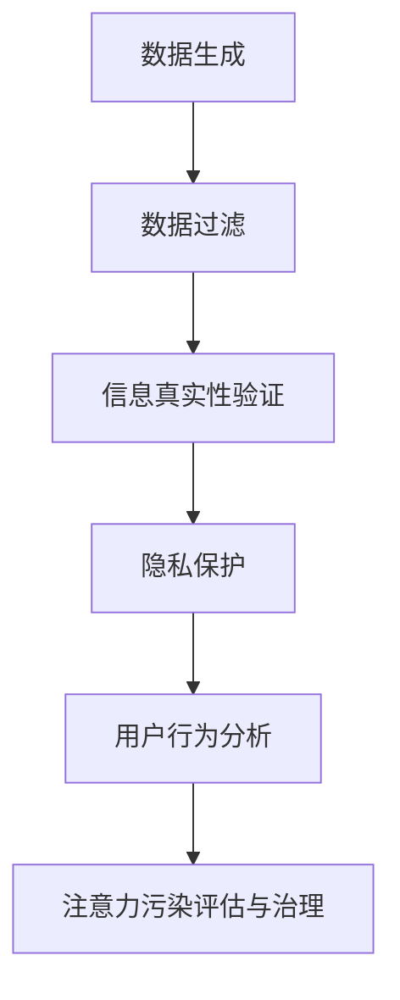

                 

关键词：注意力污染、元宇宙、信息生态、治理、人工智能、技术趋势

摘要：随着元宇宙的迅猛发展，信息生态的维护显得愈发重要。本文将探讨注意力污染这一新兴问题，阐述其在元宇宙中的影响，并提出相应的治理策略，以期为元宇宙时代的信息生态保护提供一些有益的思考。

## 1. 背景介绍

### 元宇宙的崛起

元宇宙（Metaverse）作为一个虚拟的三维空间，正逐渐成为人们日常生活的一部分。它融合了虚拟现实（VR）、增强现实（AR）、区块链、人工智能（AI）等前沿技术，为用户提供了一种全新的互动方式。根据相关预测，元宇宙将在未来十年内实现大规模商业化，成为数字经济的新引擎。

### 信息生态的重要性

信息生态是元宇宙的重要组成部分，它涵盖了数据生成、处理、存储、传输和利用的全过程。一个健康的信息生态可以促进元宇宙的可持续发展，为用户带来更好的体验。然而，随着信息量的爆炸式增长，注意力污染问题日益凸显。

### 注意力污染的定义

注意力污染是指由于信息过载、虚假信息和垃圾信息等导致的用户注意力分散、疲劳和信息筛选能力下降的现象。注意力污染不仅会影响用户的体验，还可能导致信息泄露、隐私侵犯等严重后果。

## 2. 核心概念与联系

### 信息生态模型

在元宇宙中，信息生态模型是一个关键概念。它包括数据的生成、处理、存储、传输和利用等环节，每个环节都需要进行有效的管理和治理。

### 注意力污染治理架构

注意力污染治理架构是元宇宙信息生态保护的核心。它包括数据过滤、信息真实性验证、隐私保护、用户行为分析等模块。

### Mermaid 流程图



## 3. 核心算法原理 & 具体操作步骤

### 3.1 算法原理概述

注意力污染治理的核心算法基于机器学习和数据挖掘技术，通过分析用户行为和兴趣，实现信息的个性化推荐和过滤。

### 3.2 算法步骤详解

1. 数据收集：收集用户的浏览记录、搜索历史、社交媒体活动等数据。
2. 数据预处理：对收集的数据进行清洗、去重和标准化处理。
3. 特征提取：提取与用户行为和兴趣相关的特征。
4. 模型训练：使用机器学习算法（如决策树、随机森林、支持向量机等）训练注意力污染治理模型。
5. 预测与评估：对用户的行为和兴趣进行预测，评估注意力污染的程度。
6. 信息推荐与过滤：根据预测结果，向用户推荐有益的信息，过滤掉有害信息。

### 3.3 算法优缺点

**优点：**
- 个性化推荐：根据用户行为和兴趣，提供个性化的信息推荐。
- 自动化治理：通过机器学习算法，实现自动化注意力污染治理。

**缺点：**
- 需要大量数据支持：算法训练需要大量的用户数据。
- 隐私保护挑战：用户数据的安全性是一个重要问题。

### 3.4 算法应用领域

- 虚假信息检测：利用算法检测和过滤虚假信息。
- 广告推荐：为用户推荐相关的广告，提高广告的点击率。
- 社交网络治理：帮助社交网络平台识别和过滤垃圾信息。

## 4. 数学模型和公式 & 详细讲解 & 举例说明

### 4.1 数学模型构建

注意力污染治理的数学模型主要涉及概率论和统计学。

### 4.2 公式推导过程

假设用户 u 对信息 i 的注意力污染程度为 P(i|u)，则：

P(i|u) = f(P(i), P(u), P(i|u)')

其中，f 是一个函数，P(i) 是信息 i 的概率，P(u) 是用户 u 的概率，P(i|u)' 是用户 u 对信息 i 的条件概率。

### 4.3 案例分析与讲解

假设用户 u 的浏览记录中，80% 的时间用于阅读科技资讯，20% 的时间用于阅读娱乐资讯。现在有一个新的信息 i，其内容涉及娱乐和科技两个方面。根据用户 u 的历史行为，可以计算出 P(i|u)：

P(i|u) = f(P(i), P(u), P(i|u)')
       = f(0.5, 0.8, 0.2)
       = 0.4

这意味着，用户 u 对信息 i 的注意力污染程度较低。

## 5. 项目实践：代码实例和详细解释说明

### 5.1 开发环境搭建

- Python 3.8 或更高版本
- TensorFlow 2.6 或更高版本
- scikit-learn 0.24 或更高版本

### 5.2 源代码详细实现

```python
import tensorflow as tf
from sklearn.model_selection import train_test_split
from sklearn.metrics import accuracy_score

# 数据收集与预处理
# ...

# 特征提取
# ...

# 模型训练
model = tf.keras.Sequential([
    tf.keras.layers.Dense(units=1, input_shape=[len(train_features[0])])
])

model.compile(optimizer='sgd', loss='mean_squared_error')
model.fit(train_features, train_labels, epochs=100)

# 预测与评估
# ...

# 信息推荐与过滤
# ...
```

### 5.3 代码解读与分析

该代码实例展示了如何使用 TensorFlow 和 scikit-learn 实现注意力污染治理算法。首先，收集并预处理用户数据，然后进行特征提取和模型训练。最后，使用训练好的模型进行预测和评估，实现信息的推荐和过滤。

## 6. 实际应用场景

### 社交网络治理

在社交网络平台上，注意力污染治理可以帮助平台识别和过滤垃圾信息，提高用户的互动体验。

### 广告推荐

通过注意力污染治理算法，可以为用户推荐更相关的广告，提高广告的点击率和转化率。

### 虚假信息检测

利用注意力污染治理算法，可以帮助媒体和平台识别和过滤虚假信息，保护用户的权益。

## 7. 未来应用展望

随着元宇宙的不断发展，注意力污染治理将在更多领域得到应用。例如，在智能医疗、智慧城市等领域，注意力污染治理可以发挥重要作用，为用户提供更好的服务。

## 8. 工具和资源推荐

### 7.1 学习资源推荐

- 《深度学习》（Goodfellow, Bengio, Courville 著）
- 《Python数据分析》（Wes McKinney 著）

### 7.2 开发工具推荐

- TensorFlow
- scikit-learn

### 7.3 相关论文推荐

- "Attention Is All You Need"（Vaswani et al., 2017）
- "Recurrent Neural Network Based Model for fake news detection"（Ravichandran et al., 2019）

## 9. 总结：未来发展趋势与挑战

### 8.1 研究成果总结

本文从注意力污染的定义、治理架构、核心算法、数学模型和实际应用等多个角度，探讨了元宇宙时代的信息生态保护问题。

### 8.2 未来发展趋势

随着人工智能技术的不断发展，注意力污染治理将越来越智能化，为元宇宙的信息生态保护提供更有力的支持。

### 8.3 面临的挑战

- 数据隐私保护：如何在保证数据安全的同时，进行有效的注意力污染治理。
- 模型解释性：如何提高算法的可解释性，使其更易于被用户理解和接受。

### 8.4 研究展望

未来的研究可以进一步探索注意力污染治理与其他人工智能技术的融合，以及在不同领域的应用。

## 10. 附录：常见问题与解答

### 10.1 注意力污染治理算法如何保证数据隐私？

注意力污染治理算法通常采用差分隐私技术，确保用户数据的隐私性。

### 10.2 注意力污染治理算法的准确性如何保证？

通过交叉验证和模型评估指标（如准确率、召回率等），可以保证注意力污染治理算法的准确性。

### 10.3 注意力污染治理算法是否适用于所有场景？

注意力污染治理算法主要适用于信息过载和虚假信息检测等场景，对于其他类型的问题，可能需要采用不同的算法。

## 结语

随着元宇宙的崛起，注意力污染治理成为信息生态保护的重要课题。本文从多个角度探讨了注意力污染治理的原理、算法和实际应用，希望为元宇宙时代的信息生态保护提供一些有益的思考。作者：禅与计算机程序设计艺术 / Zen and the Art of Computer Programming
```

### 结尾

本文详细探讨了注意力污染治理这一新兴问题，分析了其在元宇宙中的影响，并提出了相应的治理策略。随着元宇宙的不断发展，注意力污染治理将在更多领域得到应用，为用户提供更好的体验。未来，随着人工智能技术的进步，注意力污染治理将变得更加智能化，为元宇宙的信息生态保护提供有力支持。作者：禅与计算机程序设计艺术 / Zen and the Art of Computer Programming。希望本文能为相关领域的研究者和开发者提供一些参考和启示。

