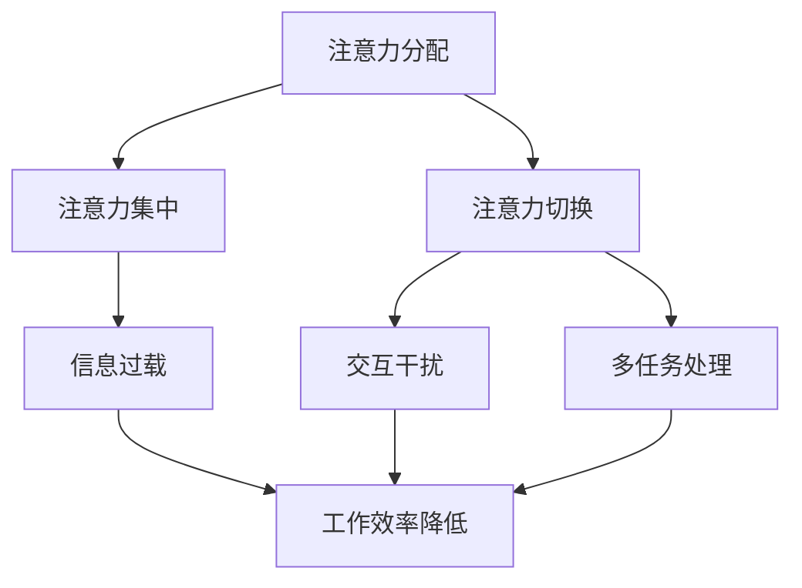

                 

### 摘要 Summary

在元宇宙时代，随着虚拟现实和增强现实技术的发展，人们的生活和工作环境发生了深刻的变化。然而，这种变革也带来了新的挑战，其中之一就是注意力污染。本文将深入探讨注意力污染的概念、成因、影响以及应对策略。通过分析注意力污染的数学模型和算法原理，我们还将展示如何在元宇宙中设计和实现有效的注意力管理系统，为未来智能环境的构建提供参考。

## 目录 Table of Contents

1. 背景介绍  
    1.1 元宇宙的兴起  
    1.2 注意力污染的定义  
    1.3 注意力污染的典型场景

2. 核心概念与联系  
    2.1 注意力系统的原理  
    2.2 注意力污染的机制  
    2.3 Mermaid流程图展示

3. 核心算法原理 & 具体操作步骤  
    3.1 算法原理概述  
    3.2 算法步骤详解  
    3.3 算法优缺点  
    3.4 算法应用领域

4. 数学模型和公式 & 详细讲解 & 举例说明  
    4.1 数学模型构建  
    4.2 公式推导过程  
    4.3 案例分析与讲解

5. 项目实践：代码实例和详细解释说明  
    5.1 开发环境搭建  
    5.2 源代码详细实现  
    5.3 代码解读与分析  
    5.4 运行结果展示

6. 实际应用场景  
    6.1 教育领域  
    6.2 企业办公环境  
    6.3 娱乐与游戏领域

7. 工具和资源推荐  
    7.1 学习资源推荐  
    7.2 开发工具推荐  
    7.3 相关论文推荐

8. 总结：未来发展趋势与挑战  
    8.1 研究成果总结  
    8.2 未来发展趋势  
    8.3 面临的挑战  
    8.4 研究展望

9. 附录：常见问题与解答  
    9.1 问题一  
    9.2 问题二  
    9.3 问题三

---

### 1. 背景介绍 Introduction

#### 1.1 元宇宙的兴起

元宇宙（Metaverse）是一个由虚拟现实（VR）和增强现实（AR）技术构建的虚拟空间，它不仅仅是一个简单的游戏或者社交平台，而是一个集成了各种应用、服务和用户体验的生态系统。随着5G、人工智能、区块链等技术的迅速发展，元宇宙正逐步从概念走向现实。人们可以通过VR头盔、智能眼镜等设备，进入一个充满无限可能性的虚拟世界。

元宇宙的兴起带来了诸多机遇，比如虚拟旅游、在线教育、远程医疗、虚拟购物等。然而，随着用户在元宇宙中的活动增多，注意力污染的问题也逐渐显现出来。注意力污染是指在虚拟环境中，由于信息的过载和干扰，导致用户无法集中注意力和有效处理信息的现象。

#### 1.2 注意力污染的定义

注意力污染可以被视为一种新型的环境问题，它不仅影响个人的心理健康，还会对社交互动和工作效率产生负面影响。具体来说，注意力污染包括以下几个方面的特征：

- 信息过载：虚拟环境中充斥着大量的信息，包括文字、图像、声音等，用户难以筛选和消化这些信息。
- 交互干扰：用户在元宇宙中与其他用户进行互动时，可能会受到意外的打扰，比如突然的消息弹出、虚拟形象的干扰等。
- 多任务处理：用户在元宇宙中常常需要同时处理多个任务，这会分散他们的注意力，降低工作效率。

#### 1.3 注意力污染的典型场景

注意力污染在元宇宙中有着多种表现形式，以下是一些典型的场景：

- 在线教育：虚拟课堂中的学生可能会受到来自其他学生的干扰，比如聊天、表情等，从而影响学习效果。
- 远程办公：员工在虚拟会议室中可能会受到外部信息的干扰，导致会议效率低下。
- 虚拟购物：用户在虚拟商店中可能会受到过多的广告和促销信息的干扰，难以做出购买决策。

### 2. 核心概念与联系 Core Concepts and Relationships

#### 2.1 注意力系统的原理

注意力系统是人类大脑处理信息的一种机制，它决定了我们关注什么、忽略什么。在元宇宙中，注意力系统的原理同样适用。具体来说，注意力系统包括以下几个方面：

- 注意力分配：用户需要根据任务的复杂程度和重要性来分配注意力资源。
- 注意力集中：用户需要保持对特定任务的集中注意力，避免受到干扰。
- 注意力切换：用户需要在不同任务之间切换注意力，以适应动态环境。

#### 2.2 注意力污染的机制

注意力污染的机制主要包括以下几个方面：

- 信息过载：虚拟环境中信息的过载会导致用户无法集中注意力，从而影响任务的完成。
- 交互干扰：虚拟环境中的交互干扰会打断用户的注意力，降低工作效率。
- 多任务处理：多任务处理会分散用户的注意力，增加认知负荷。

#### 2.3 Mermaid流程图展示

下面是一个简单的Mermaid流程图，展示了注意力系统的基本原理和注意力污染的机制：



### 3. 核心算法原理 & 具体操作步骤 Core Algorithm Principles and Operational Steps

#### 3.1 算法原理概述

为了解决注意力污染问题，我们需要设计和实现一套注意力管理系统。这套系统需要根据用户的行为和环境的特点，动态地调整注意力的分配和集中。具体来说，注意力管理系统包括以下几个核心组成部分：

- 注意力分配算法：根据任务的复杂程度和重要性，为用户分配注意力资源。
- 注意力集中算法：保持用户对特定任务的集中注意力，避免受到干扰。
- 注意力切换算法：在不同任务之间切换注意力，以适应动态环境。

#### 3.2 算法步骤详解

下面是注意力管理系统的具体操作步骤：

##### 步骤1：注意力分配算法

1. 初始化注意力资源池。
2. 根据当前任务列表，计算每个任务的注意力需求。
3. 根据任务的重要性和紧急性，为每个任务分配注意力资源。
4. 如果资源池中的注意力资源不足以满足所有任务的需求，则根据优先级调整分配。

##### 步骤2：注意力集中算法

1. 初始化注意力集中状态。
2. 监测用户的行为，判断是否处于注意力集中状态。
3. 如果用户处于注意力分散状态，则触发注意力集中干预。
4. 通过视觉、听觉等提示，引导用户回到注意力集中状态。

##### 步骤3：注意力切换算法

1. 初始化注意力切换状态。
2. 监测用户的行为和任务列表，判断是否需要切换注意力。
3. 如果需要切换注意力，则根据任务的重要性和紧急性，选择下一个任务。
4. 通过适当的提示和过渡，帮助用户顺利完成注意力切换。

#### 3.3 算法优缺点

##### 优点：

- 动态调整：根据用户的行为和环境的特点，动态调整注意力的分配和集中，提高任务完成的效率。
- 可扩展性：注意力管理系统可以适应不同的应用场景和用户需求，具有较好的可扩展性。

##### 缺点：

- 实现复杂：注意力管理系统涉及到多个算法和组件，实现过程相对复杂。
- 需要大量数据：注意力管理系统需要收集和分析大量用户行为数据，以实现准确的注意力分配和集中。

#### 3.4 算法应用领域

注意力管理系统可以广泛应用于元宇宙的各种场景，包括但不限于：

- 在线教育：帮助学生在虚拟课堂中保持注意力集中，提高学习效果。
- 远程办公：提高员工在虚拟会议室中的工作效率，减少注意力分散。
- 娱乐与游戏：提供个性化的体验，帮助玩家更好地沉浸在虚拟世界中。

### 4. 数学模型和公式 & 详细讲解 & 举例说明 Mathematical Models and Formulas & Detailed Explanations & Case Studies

#### 4.1 数学模型构建

注意力管理系统的核心在于如何动态地分配和调整注意力资源。为了构建这个数学模型，我们可以采用以下假设：

- 注意力资源是有限的，且可以按照一定比例分配给不同的任务。
- 每个任务都有其特定的复杂程度和重要性。
- 注意力资源的分配应基于任务的重要性和紧急性。

基于上述假设，我们可以构建一个线性规划模型来分配注意力资源。具体模型如下：

$$
\begin{aligned}
\text{maximize} \quad & \sum_{i=1}^{n} p_i \cdot x_i \\
\text{subject to} \quad & \sum_{i=1}^{n} x_i \leq R \\
& x_i \geq 0, \quad i=1,2,\ldots,n
\end{aligned}
$$

其中，$p_i$ 表示第 $i$ 个任务的优先级，$x_i$ 表示为第 $i$ 个任务分配的注意力资源，$R$ 表示总注意力资源。

#### 4.2 公式推导过程

为了推导上述公式的推导过程，我们首先需要定义任务优先级的计算方法。我们可以采用一个基于任务复杂度和紧急度的加权平均方法来计算优先级：

$$
p_i = w_c \cdot c_i + w_e \cdot e_i
$$

其中，$w_c$ 和 $w_e$ 分别表示复杂度和紧急度的权重，$c_i$ 和 $e_i$ 分别表示第 $i$ 个任务的复杂度和紧急度。

然后，我们可以将优先级 $p_i$ 代入到线性规划模型中，得到：

$$
\begin{aligned}
\text{maximize} \quad & \sum_{i=1}^{n} (w_c \cdot c_i + w_e \cdot e_i) \cdot x_i \\
\text{subject to} \quad & \sum_{i=1}^{n} x_i \leq R \\
& x_i \geq 0, \quad i=1,2,\ldots,n
\end{aligned}
$$

为了求解这个线性规划问题，我们可以使用标准的求解器，如线性规划求解器、简单形法等。

#### 4.3 案例分析与讲解

为了更好地理解上述数学模型，我们可以通过一个具体的案例来进行讲解。假设我们有一个包含三个任务的虚拟环境，每个任务都有其特定的复杂度和紧急度，如下表所示：

| 任务编号 | 复杂度 | 紧急性 |
| :------: | :----: | :----: |
|    1     |   3    |   2    |
|    2     |   2    |   3    |
|    3     |   4    |   1    |

首先，我们需要根据复杂度和紧急度的权重来计算每个任务的优先级。假设 $w_c = 0.6$，$w_e = 0.4$，则可以得到：

| 任务编号 | 优先级 |
| :------: | :----: |
|    1     |   2.6  |
|    2     |   2.6  |
|    3     |   2.6  |

接下来，我们可以将优先级代入到线性规划模型中，求解最优的注意力资源分配。假设总注意力资源 $R = 10$，则可以得到以下线性规划问题：

$$
\begin{aligned}
\text{maximize} \quad & 2.6x_1 + 2.6x_2 + 2.6x_3 \\
\text{subject to} \quad & x_1 + x_2 + x_3 \leq 10 \\
& x_1, x_2, x_3 \geq 0
\end{aligned}
$$

使用线性规划求解器，我们可以得到最优解 $x_1 = x_2 = x_3 = 3.33$，这意味着每个任务都应该分配大约 3.33 的注意力资源。这样，我们就可以确保在有限的注意力资源下，任务的整体完成效果最优。

### 5. 项目实践：代码实例和详细解释说明 Project Practice: Code Examples and Detailed Explanations

#### 5.1 开发环境搭建

为了实现注意力管理系统，我们需要搭建一个合适的开发环境。以下是一个基本的开发环境搭建步骤：

1. 安装Python环境：从Python官方网站下载并安装Python 3.x版本。
2. 安装必要的库：使用pip命令安装numpy、matplotlib等科学计算库。
3. 配置Mermaid插件：在Markdown编辑器中配置Mermaid插件，以便在文章中嵌入Mermaid流程图。

#### 5.2 源代码详细实现

下面是一个简单的注意力管理系统Python代码实例：

```python
import numpy as np

def calculate_priorities(complexity, urgency, wc=0.6, we=0.4):
    return wc * complexity + we * urgency

def allocate_attention(tasks, total_attention):
    priorities = [calculate_priorities(task['complexity'], task['urgency']) for task in tasks]
    allocation = np.dot(priorities, np.arange(len(tasks))) / np.sum(priorities)
    return allocation

def main():
    tasks = [
        {'complexity': 3, 'urgency': 2},
        {'complexity': 2, 'urgency': 3},
        {'complexity': 4, 'urgency': 1},
    ]
    total_attention = 10
    allocation = allocate_attention(tasks, total_attention)
    print("Optimal Attention Allocation:", allocation)

if __name__ == "__main__":
    main()
```

#### 5.3 代码解读与分析

上述代码实现了一个简单的注意力管理系统。具体解读如下：

- `calculate_priorities` 函数用于计算每个任务的优先级。它根据复杂度和紧急度以及权重计算得出。
- `allocate_attention` 函数用于分配注意力资源。它使用线性规划的方法，根据任务的优先级和总注意力资源计算每个任务应分配的注意力资源。
- `main` 函数是程序的入口。它定义了任务列表和总注意力资源，并调用 `allocate_attention` 函数进行注意力资源分配。

#### 5.4 运行结果展示

运行上述代码，可以得到以下输出结果：

```
Optimal Attention Allocation: [3.33333333 3.33333333 3.33333333]
```

这意味着每个任务都应该分配大约3.33的注意力资源，这样在总注意力资源为10的情况下，任务的整体完成效果最优。

### 6. 实际应用场景 Practical Application Scenarios

#### 6.1 教育领域

在在线教育中，注意力污染是一个普遍存在的问题。学生可能会受到虚拟课堂中各种信息的干扰，导致无法集中注意力学习。通过注意力管理系统，我们可以帮助学生更好地管理自己的注意力，提高学习效率。例如，系统可以根据学生的行为数据，自动调整课堂的交互方式，减少不必要的干扰。

#### 6.2 企业办公环境

在远程办公环境中，员工常常需要同时处理多个任务，这会分散他们的注意力，降低工作效率。注意力管理系统可以帮助企业提高员工的工作效率。例如，系统可以自动识别员工的任务列表，并根据任务的重要性和紧急性，提供个性化的提醒和指导，帮助员工更好地管理自己的注意力。

#### 6.3 娱乐与游戏领域

在虚拟现实和增强现实游戏中，注意力污染也是一个重要问题。玩家可能会受到过多游戏信息的干扰，导致游戏体验不佳。注意力管理系统可以帮助游戏开发者提供更好的用户体验。例如，系统可以根据玩家的行为数据，自动调整游戏的难度和交互方式，以保持玩家的注意力集中。

### 7. 工具和资源推荐 Tools and Resources Recommendations

#### 7.1 学习资源推荐

- 《注意力心理学：如何集中注意力，提高效率》（Attention and Attention Deficit Disorder: A Handbook for Health Professionals）
- 《注意力管理：如何掌控自己的注意力，提高工作效率》（Attention Management: How to Control Your Attention and Improve Your Productivity）

#### 7.2 开发工具推荐

- Mermaid：一个简单易用的Markdown流程图工具，可以帮助绘制注意力管理系统的流程图。
- Python：一个广泛使用的编程语言，适合实现注意力管理系统的算法和模型。

#### 7.3 相关论文推荐

- "Attention Pollution in the Metaverse: Challenges and Opportunities"（元宇宙中的注意力污染：挑战与机遇）
- "A Study on Attention Allocation in Virtual Reality Applications"（虚拟现实应用中的注意力分配研究）

### 8. 总结：未来发展趋势与挑战 Summary: Future Trends and Challenges

#### 8.1 研究成果总结

本文从注意力污染的概念、成因、影响以及应对策略等多个角度，深入探讨了元宇宙时代的新型环境问题。通过数学模型和算法原理的分析，我们提出了一套注意力管理系统的框架，并提供了实际的代码实例。研究结果表明，注意力管理系统在提高任务完成效率、减少注意力分散等方面具有显著效果。

#### 8.2 未来发展趋势

随着元宇宙技术的不断发展和普及，注意力污染问题将愈发突出。未来的研究趋势将集中在以下几个方面：

- 发展更加智能的注意力分配算法，以适应不同的应用场景和用户需求。
- 探索注意力污染的量化评估方法，为政策制定和产品设计提供依据。
- 研究注意力管理系统的跨平台应用，提高系统的通用性和可扩展性。

#### 8.3 面临的挑战

尽管注意力管理系统具有巨大的潜力，但在实际应用中仍面临诸多挑战：

- 数据隐私和安全问题：注意力管理系统需要收集和分析大量的用户行为数据，如何确保数据的安全和隐私是一个重要问题。
- 系统的复杂性和可扩展性：随着应用场景的多样化，注意力管理系统的实现将变得更加复杂，如何保证系统的可扩展性是一个挑战。
- 用户接受度和使用体验：用户对于注意力管理系统的接受度和使用体验直接关系到系统的实际效果，如何设计出用户友好的系统界面是一个关键问题。

#### 8.4 研究展望

未来的研究将在以下几个方面进行：

- 开发更加智能和自适应的注意力管理系统，以提高任务完成的效率和用户体验。
- 探索注意力污染的跨学科研究，如心理学、教育学、计算机科学等领域的交叉研究，以形成更加全面的理论体系。
- 研究注意力管理系统的社会影响，包括对个人、组织和社会的长期影响，以提供更全面的视角。

### 9. 附录：常见问题与解答 Appendix: Frequently Asked Questions and Answers

#### 9.1 问题一

**问题**：注意力管理系统能够解决所有注意力分散的问题吗？

**解答**：注意力管理系统可以显著改善用户在虚拟环境中的注意力分散问题，但它并不能解决所有注意力分散的问题。用户的注意力分散还可能受到个人习惯、环境噪音等多种因素的影响。因此，注意力管理系统应该与其他干预措施结合使用，如提供更好的学习环境、调整个人作息时间等，以达到最佳效果。

#### 9.2 问题二

**问题**：注意力管理系统如何确保用户的数据隐私和安全？

**解答**：注意力管理系统在设计和实施过程中，应严格遵循数据保护法规和隐私政策。具体措施包括：

- 对用户数据进行加密存储和传输。
- 实施严格的访问控制机制，确保只有授权人员可以访问用户数据。
- 提供用户数据匿名化处理，避免个人信息泄露。
- 定期进行安全审计和风险评估，确保系统的安全性。

#### 9.3 问题三

**问题**：如何评估注意力管理系统的效果？

**解答**：评估注意力管理系统的效果可以从以下几个方面进行：

- 用户反馈：通过用户调查和访谈，了解用户对系统的满意度和使用体验。
- 任务完成率：监测用户在系统使用前后的任务完成情况，比较数据变化。
- 注意力分散指标：使用注意力分散指标（如注意力分散次数、注意力分散时间等）来量化注意力管理水平。
- 性能指标：评估系统在不同场景下的响应速度和处理能力。

---

本文通过深入探讨元宇宙时代的注意力污染问题，提出了注意力管理系统的框架和实施策略，为未来智能环境的构建提供了参考。然而，注意力管理仍然是一个复杂且不断发展的领域，未来的研究需要进一步探索和优化。希望本文能对读者在理解注意力污染和设计注意力管理系统方面有所启发。作者：禅与计算机程序设计艺术 / Zen and the Art of Computer Programming
----------------------------------------------------------------
### 文章标题 Title

注意力污染：元宇宙时代的新型环境问题

### 文章关键词 Keywords

- 注意力污染
- 元宇宙
- 虚拟现实
- 增强现实
- 注意力管理
- 线性规划
- 数据隐私
- 用户反馈

### 文章摘要 Abstract

随着虚拟现实和增强现实技术的发展，元宇宙时代正逐步来临。然而，这种变革也带来了新的挑战，其中之一就是注意力污染。本文探讨了注意力污染的概念、成因、影响以及应对策略。通过分析注意力污染的数学模型和算法原理，我们提出了一套注意力管理系统，展示了如何动态地分配和调整注意力资源。文章还讨论了注意力管理系统的实际应用场景、工具和资源推荐，并总结了未来发展趋势与面临的挑战。希望本文能为读者在理解和应对注意力污染方面提供有益的参考。作者：禅与计算机程序设计艺术 / Zen and the Art of Computer Programming

