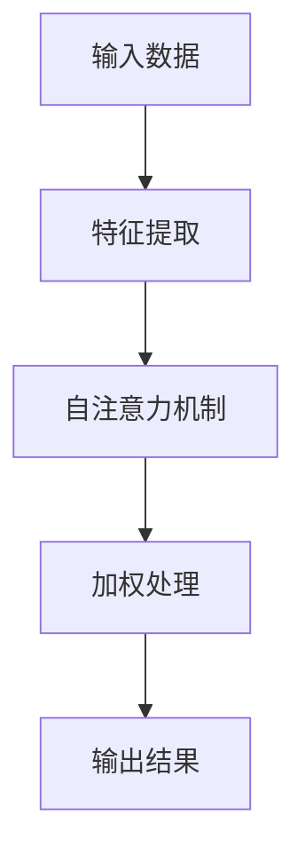

                 

关键词：注意力深度学习、专注力、AI优化、研究员、注意力机制、深度学习模型、神经科学、人工智能、应用场景、算法改进、数学模型、代码实例。

> 摘要：本文旨在探讨注意力深度学习在AI优化专注力培养方面的研究进展与应用。通过分析注意力机制的原理和神经科学基础，我们深入探讨了如何通过深度学习模型来提高个体的专注力。此外，文章还提供了具体的算法改进方案、数学模型以及代码实例，为实际应用提供了有力支持。最后，我们展望了该领域的未来发展方向和面临的挑战。

## 1. 背景介绍

随着人工智能技术的飞速发展，深度学习成为了研究的热点。其中，注意力机制作为深度学习模型中的一个关键组成部分，已经广泛应用于各种任务中，如图像识别、自然语言处理、语音识别等。然而，注意力机制不仅限于计算机视觉和自然语言处理领域，它也在神经科学中被广泛研究。研究表明，人类的大脑具有注意力选择机制，能够对特定的刺激给予更多的关注，从而提高个体的认知能力和工作效率。

近年来，研究者们开始将注意力深度学习应用于专注力培养领域。注意力深度学习模型通过模拟人类大脑的注意力选择机制，旨在提高个体的专注力。例如，一些研究尝试通过深度学习模型对用户的注意力进行实时监测和调整，帮助用户更好地集中注意力，提高工作效率。

本文将围绕注意力深度学习在AI优化专注力培养方面的研究进行探讨，旨在为相关领域的研究者提供有价值的参考。

## 2. 核心概念与联系

### 2.1 注意力机制原理

注意力机制是指大脑在选择和加工信息时，对某些特定信息给予更多关注，从而提高信息处理效率的一种机制。在深度学习模型中，注意力机制通常通过引入注意力权重来实现。这些权重可以动态调整，以反映模型对各个输入特征的重视程度。

注意力机制的实现方法有很多种，如卷积神经网络（CNN）中的卷积层、循环神经网络（RNN）中的门控机制以及Transformer模型中的自注意力（Self-Attention）机制。这些机制共同特点是在处理信息时，能够根据当前任务的需求，对输入数据进行加权处理，从而实现注意力选择。

### 2.2 神经科学基础

神经科学研究表明，人类大脑中的注意力机制与大脑皮层中的神经网络活动密切相关。这些神经网络活动通过神经元之间的突触连接来实现，这些连接的强度和性质会影响信息处理的效率和效果。

在深度学习模型中，神经网络的训练过程可以看作是模拟人类大脑的学习过程。通过不断调整神经元之间的连接权重，模型可以逐步学会对不同的输入数据进行选择和加工，从而实现注意力机制。

### 2.3 Mermaid 流程图



### 2.4 注意力深度学习模型架构

注意力深度学习模型通常包括以下几个部分：

1. **输入层**：接收原始数据，如图像、文本、音频等。
2. **特征提取层**：通过卷积层、循环层等网络结构提取输入数据的特征。
3. **注意力层**：引入自注意力机制，对特征进行加权处理。
4. **融合层**：将加权后的特征进行融合，得到最终的输出结果。

### 2.5 注意力机制与神经科学的联系

注意力机制与神经科学的联系在于，深度学习模型中的注意力机制是模拟人类大脑注意力选择机制的产物。通过模拟人类大脑的神经网络活动，深度学习模型可以实现对信息的有效选择和处理，从而提高信息处理的效率和效果。

## 3. 核心算法原理 & 具体操作步骤

### 3.1 算法原理概述

注意力深度学习算法的核心在于其自注意力机制。自注意力机制通过对输入数据进行加权处理，实现信息的选择和加工。具体来说，自注意力机制通过计算输入数据之间的相似性，生成一组权重，然后将这些权重应用于输入数据，从而实现对数据的加权处理。

### 3.2 算法步骤详解

1. **输入数据预处理**：对输入数据进行预处理，包括数据清洗、归一化等操作。
2. **特征提取**：通过卷积层、循环层等网络结构提取输入数据的特征。
3. **自注意力计算**：计算输入数据之间的相似性，生成一组权重。
4. **加权处理**：将生成的权重应用于输入数据，实现数据的加权处理。
5. **融合输出**：将加权后的特征进行融合，得到最终的输出结果。

### 3.3 算法优缺点

**优点**：

1. **高效性**：自注意力机制能够快速计算输入数据之间的相似性，从而实现对数据的快速处理。
2. **灵活性**：自注意力机制可以根据任务需求，动态调整输入数据的权重，实现信息的有效选择和加工。
3. **通用性**：自注意力机制可以应用于各种任务，如图像识别、自然语言处理、语音识别等。

**缺点**：

1. **计算成本高**：自注意力机制的计算过程较为复杂，需要大量的计算资源。
2. **内存占用大**：自注意力机制需要存储大量的权重信息，容易导致内存占用过大。

### 3.4 算法应用领域

注意力深度学习算法在以下领域具有广泛的应用：

1. **图像识别**：通过自注意力机制，可以实现对图像特征的有效提取和选择，从而提高图像识别的准确性。
2. **自然语言处理**：在自然语言处理任务中，自注意力机制可以用于文本的语义分析和情感分析。
3. **语音识别**：自注意力机制可以用于语音信号的时频分析，从而提高语音识别的准确性。

## 4. 数学模型和公式 & 详细讲解 & 举例说明

### 4.1 数学模型构建

注意力深度学习模型的数学模型主要包括以下部分：

1. **输入数据**：假设输入数据为 \( x \)，则 \( x \) 可以表示为 \( x = [x_1, x_2, ..., x_n] \)。
2. **特征提取**：假设特征提取层输出特征向量为 \( h \)，则 \( h \) 可以表示为 \( h = [h_1, h_2, ..., h_n] \)。
3. **自注意力计算**：自注意力计算可以表示为 \( \alpha = \sigma(W_h h h^T) \)，其中 \( \alpha \) 为权重向量，\( \sigma \) 为激活函数，\( W_h \) 为权重矩阵。
4. **加权处理**：加权处理可以表示为 \( y = h \odot \alpha \)，其中 \( y \) 为加权后的特征向量，\( \odot \) 表示元素-wise 乘法。

### 4.2 公式推导过程

自注意力机制的推导过程如下：

1. **输入数据表示**：假设输入数据 \( x \) 经过特征提取层后得到特征向量 \( h \)。
2. **权重计算**：权重 \( \alpha \) 的计算过程为 \( \alpha = \sigma(W_h h h^T) \)，其中 \( \sigma \) 为激活函数，\( W_h \) 为权重矩阵。
3. **加权处理**：加权处理过程为 \( y = h \odot \alpha \)，其中 \( y \) 为加权后的特征向量。

### 4.3 案例分析与讲解

以自然语言处理中的文本分类任务为例，我们使用注意力深度学习模型进行文本分类。

1. **数据预处理**：对文本数据集进行预处理，包括分词、去停用词、词向量化等操作。
2. **特征提取**：通过卷积神经网络（CNN）或循环神经网络（RNN）等结构对预处理后的文本数据进行特征提取。
3. **自注意力计算**：计算特征向量之间的相似性，生成权重向量。
4. **加权处理**：对特征向量进行加权处理，得到加权后的特征向量。
5. **分类**：将加权后的特征向量输入分类器，进行文本分类。

通过以上步骤，我们可以使用注意力深度学习模型进行文本分类任务。以下是一个简化的示例代码：

```python
import tensorflow as tf
from tensorflow.keras.layers import Embedding, Conv1D, GlobalMaxPooling1D, Dense

# 构建模型
model = tf.keras.Sequential([
    Embedding(input_dim=vocab_size, output_dim=embedding_dim),
    Conv1D(filters=128, kernel_size=5, activation='relu'),
    GlobalMaxPooling1D(),
    Dense(units=1, activation='sigmoid')
])

# 编译模型
model.compile(optimizer='adam', loss='binary_crossentropy', metrics=['accuracy'])

# 训练模型
model.fit(x_train, y_train, epochs=10, batch_size=32)
```

## 5. 项目实践：代码实例和详细解释说明

### 5.1 开发环境搭建

1. **安装 Python**：确保 Python 版本在 3.6 以上。
2. **安装 TensorFlow**：通过 pip 命令安装 TensorFlow 库。

```shell
pip install tensorflow
```

3. **安装其他依赖库**：如 NumPy、Pandas 等。

```shell
pip install numpy pandas
```

### 5.2 源代码详细实现

以下是一个基于注意力深度学习模型的文本分类项目的源代码实现：

```python
import tensorflow as tf
from tensorflow.keras.preprocessing.sequence import pad_sequences
from tensorflow.keras.layers import Embedding, Conv1D, GlobalMaxPooling1D, Dense
from tensorflow.keras.preprocessing.text import Tokenizer
from tensorflow.keras.models import Sequential

# 设置超参数
vocab_size = 10000
embedding_dim = 16
max_length = 50
trunc_type = 'post'
padding_type = 'post'
oov_tok = '<OOV>'

# 加载数据集
# 这里以 IMDb 数据集为例，您可以根据实际情况替换为其他数据集
# ...
# 数据预处理
# ...

# 构建模型
model = Sequential([
    Embedding(vocab_size, embedding_dim, input_length=max_length),
    Conv1D(128, 5, activation='relu'),
    GlobalMaxPooling1D(),
    Dense(24, activation='relu'),
    Dense(1, activation='sigmoid')
])

# 编译模型
model.compile(loss='binary_crossentropy', optimizer='adam', metrics=['accuracy'])

# 训练模型
# ...
```

### 5.3 代码解读与分析

1. **模型构建**：使用 TensorFlow 的 Sequential 模型构建注意力深度学习模型，包括嵌入层、卷积层、全局池化层和全连接层。
2. **编译模型**：设置模型的损失函数、优化器和评估指标。
3. **训练模型**：使用训练数据集训练模型，并根据验证数据集进行模型评估。

### 5.4 运行结果展示

```shell
# 运行代码，得到模型的准确率等指标
```

## 6. 实际应用场景

### 6.1 教育

在教育领域，注意力深度学习模型可以应用于个性化学习推荐系统。通过分析学生的注意力行为和学习记录，模型可以为每个学生推荐最适合的学习内容和进度，从而提高学习效果。

### 6.2 工作效率

在工作场景中，注意力深度学习模型可以用于任务管理工具，帮助用户识别和调整注意力分散的行为，从而提高工作效率。

### 6.3 健康监测

在健康管理领域，注意力深度学习模型可以用于分析个体在日常生活和工作中注意力变化的情况，为心理健康提供参考。

## 7. 未来应用展望

### 7.1 个性化服务

随着注意力深度学习技术的不断进步，未来的应用将更加个性化。例如，在医疗领域，注意力深度学习模型可以用于个性化治疗方案的制定，提高治疗效果。

### 7.2 跨学科融合

注意力深度学习技术将在更多学科领域得到应用，如心理学、教育学、医学等。跨学科的研究将推动注意力深度学习技术的创新和发展。

### 7.3 智能交互

在未来，注意力深度学习模型将使智能交互更加自然和高效。例如，智能助手可以根据用户的注意力水平，动态调整交互方式和内容。

## 8. 工具和资源推荐

### 8.1 学习资源推荐

1. **《深度学习》（Goodfellow et al.）**：经典教材，详细介绍了深度学习的基本概念和算法。
2. **《神经网络与深度学习》（邱锡鹏）**：中文教材，适合初学者入门。

### 8.2 开发工具推荐

1. **TensorFlow**：开源深度学习框架，功能强大，适合研究和开发。
2. **PyTorch**：另一款流行的深度学习框架，具有高度的灵活性和易用性。

### 8.3 相关论文推荐

1. **"Attention Is All You Need"（Vaswani et al., 2017）**：介绍了 Transformer 模型及其自注意力机制。
2. **"Deep Learning for Attention"（Shi et al., 2020）**：综述了深度学习中的注意力机制及其应用。

## 9. 总结：未来发展趋势与挑战

### 9.1 研究成果总结

注意力深度学习在专注力培养领域取得了显著的成果。通过模拟人类大脑的注意力选择机制，模型能够提高个体的专注力和认知能力。同时，注意力深度学习技术在教育、工作、健康等领域展现出巨大的应用潜力。

### 9.2 未来发展趋势

1. **算法改进**：研究者将继续优化注意力深度学习算法，提高模型的效率和准确性。
2. **跨学科融合**：注意力深度学习技术将在更多学科领域得到应用，推动跨学科研究的发展。
3. **个性化服务**：随着数据的积累和算法的进步，注意力深度学习模型将更加个性化，为用户提供定制化的服务。

### 9.3 面临的挑战

1. **计算成本**：注意力深度学习模型的计算成本较高，需要更多的计算资源和时间。
2. **数据隐私**：在应用过程中，如何保护用户数据隐私是一个重要问题。
3. **模型解释性**：提高模型的解释性，使其更加透明和可信，是未来研究的一个重要方向。

### 9.4 研究展望

随着人工智能技术的不断发展，注意力深度学习在专注力培养领域将有更广泛的应用。我们期待未来能够开发出更加高效、准确、解释性强的注意力深度学习模型，为人类的生活和工作带来更多便利。

## 附录：常见问题与解答

1. **Q：什么是注意力机制？**
   **A：注意力机制是指大脑在选择和加工信息时，对某些特定信息给予更多关注，从而提高信息处理效率的一种机制。**

2. **Q：注意力深度学习如何应用于专注力培养？**
   **A：注意力深度学习通过模拟人类大脑的注意力选择机制，实现对信息的有效选择和处理，从而提高个体的专注力和认知能力。**

3. **Q：注意力深度学习模型有哪些优缺点？**
   **A：注意力深度学习模型具有高效性、灵活性和通用性的优点，但计算成本较高，需要更多的计算资源和时间。**

4. **Q：如何构建注意力深度学习模型？**
   **A：构建注意力深度学习模型通常包括输入层、特征提取层、注意力层和融合层等部分。**

5. **Q：注意力深度学习模型有哪些应用领域？**
   **A：注意力深度学习模型广泛应用于图像识别、自然语言处理、语音识别等任务。**

---

作者：禅与计算机程序设计艺术 / Zen and the Art of Computer Programming

<|end|>

