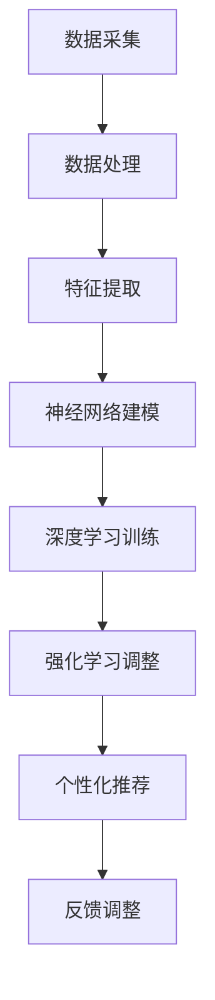

                 

关键词：注意力深度开发，AI 优化，专注力培养，技术，算法，应用场景，未来展望

> 摘要：本文旨在探讨如何利用人工智能技术优化人的注意力深度开发，从而提升个人的专注力和工作效率。文章首先介绍了注意力深度开发的重要性，然后详细阐述了 AI 优化的专注力培养技术，包括核心概念、算法原理、数学模型以及具体的应用场景。最后，文章对未来的发展趋势和面临的挑战进行了展望。

## 1. 背景介绍

在当今信息爆炸的时代，人们面临着越来越多的任务和挑战。如何高效地管理注意力，提升专注力成为了一个亟待解决的问题。专注力是人们在进行复杂任务时保持注意力集中的能力，它是提高工作效率、实现个人成长的重要保障。

然而，随着现代科技的不断发展，人们面临着越来越多的分心和干扰。例如，社交媒体的频繁推送、手机的即时通知、工作上的各种任务等等，这些都严重分散了人们的注意力，影响了专注力的发挥。因此，如何培养和提高专注力，成为一个备受关注的话题。

人工智能技术的发展为解决这一问题提供了新的思路。通过利用人工智能技术，可以实现对人类注意力的深度开发，从而优化专注力的培养。本文将围绕这一主题，探讨如何利用 AI 技术优化人的注意力深度开发，提升专注力。

## 2. 核心概念与联系

### 2.1 注意力深度开发的定义

注意力深度开发是指通过技术手段，帮助个体在执行任务时保持高度的注意力集中，从而提升工作效率和能力。它涉及到多个方面的技术，包括心理学、认知科学和人工智能。

### 2.2 AI 优化的专注力培养技术

AI 优化的专注力培养技术是指利用人工智能算法，对个体在执行任务时的注意力状态进行实时监测和反馈，从而帮助个体调整注意力，提升专注力。这一技术涉及到多个核心概念和联系，包括：

#### 2.2.1 人类注意力的特征和行为

首先，需要了解人类注意力的特征和行为，包括注意力的类型、分布、波动等。这些特征和行为为 AI 算法的开发提供了基础。

#### 2.2.2 人工智能算法

人工智能算法是实现注意力深度开发的关键。常用的算法包括：

- **神经网络**：通过模拟人脑的神经网络结构，实现对复杂任务的建模和优化。
- **深度学习**：利用大量数据进行训练，实现对人类注意力状态的高效建模。
- **强化学习**：通过不断调整策略，实现个体在复杂环境中的最优行为。

#### 2.2.3 数据采集与处理

为了实现对注意力状态的实时监测，需要采集大量的生理和行为数据。这些数据包括心跳、呼吸、眼动、脑电波等。通过数据预处理和特征提取，可以将这些数据转化为可供 AI 算法分析的形式。

#### 2.2.4 个性化推荐与反馈

基于 AI 算法的分析，可以为个体提供个性化的推荐和反馈，帮助个体调整注意力，提升专注力。

### 2.3 Mermaid 流程图

以下是一个简单的 Mermaid 流程图，展示了 AI 优化专注力培养技术的基本架构：



## 3. 核心算法原理 & 具体操作步骤

### 3.1 算法原理概述

AI 优化的专注力培养技术主要基于以下三个核心算法原理：

1. **神经网络建模**：通过模拟人脑神经网络结构，实现对注意力状态的高效建模。
2. **深度学习训练**：利用大量数据进行训练，提高神经网络对注意力状态的理解和预测能力。
3. **强化学习调整**：通过不断调整策略，实现个体在复杂环境中的最优行为。

### 3.2 算法步骤详解

#### 3.2.1 数据采集

数据采集是整个算法的基础。需要采集的数据包括心跳、呼吸、眼动、脑电波等生理和行为数据。这些数据可以通过传感器、摄像头等设备实时获取。

#### 3.2.2 数据处理

采集到的数据需要进行预处理和特征提取。预处理包括数据清洗、归一化等操作。特征提取则是将原始数据转化为可供神经网络分析的形式。

#### 3.2.3 神经网络建模

利用预处理后的数据，通过神经网络建模，实现对注意力状态的高效建模。神经网络的结构和参数可以通过反复试验和优化得到。

#### 3.2.4 深度学习训练

将神经网络模型应用于大量数据，通过深度学习训练，提高模型对注意力状态的理解和预测能力。训练过程中，可以使用交叉验证、网格搜索等技术，优化模型参数。

#### 3.2.5 强化学习调整

基于训练好的神经网络模型，通过强化学习调整策略，实现个体在复杂环境中的最优行为。强化学习的过程包括策略评估、策略优化、策略执行等步骤。

#### 3.2.6 个性化推荐与反馈

根据个体的注意力状态和需求，为个体提供个性化的推荐和反馈。推荐内容包括休息时间、任务分配、环境调整等。反馈则是根据个体的表现，对推荐结果进行调整和优化。

### 3.3 算法优缺点

#### 优点

1. **高效性**：通过人工智能算法，可以实现对注意力状态的实时监测和反馈，提高个体的专注力。
2. **个性化**：根据个体的注意力状态和需求，提供个性化的推荐和反馈，满足个体的个性化需求。
3. **自适应**：算法可以根据个体的表现，自动调整策略，实现最优的专注力培养效果。

#### 缺点

1. **数据依赖性**：算法的性能依赖于采集到的数据质量和数量，如果数据不完整或质量差，会影响算法的效果。
2. **计算成本**：神经网络建模、深度学习训练和强化学习调整等过程需要大量的计算资源，可能导致计算成本较高。

### 3.4 算法应用领域

AI 优化的专注力培养技术可以应用于多个领域，包括：

1. **教育**：帮助学生在学习中保持注意力集中，提高学习效果。
2. **工作**：帮助员工在工作时保持专注，提高工作效率。
3. **医疗**：辅助治疗注意力缺陷多动障碍（ADHD）等疾病，提高患者的生活质量。

## 4. 数学模型和公式 & 详细讲解 & 举例说明

### 4.1 数学模型构建

为了实现对注意力状态的建模，我们可以构建一个基于神经网络的数学模型。这个模型主要包括以下几个部分：

1. **输入层**：接收来自传感器的生理和行为数据。
2. **隐藏层**：对输入数据进行处理和特征提取。
3. **输出层**：生成注意力状态的评价指标。

### 4.2 公式推导过程

假设我们使用一个多层感知机（MLP）作为神经网络模型。输入层有 \( n \) 个神经元，隐藏层有 \( m \) 个神经元，输出层有 \( p \) 个神经元。

1. **输入层到隐藏层的激活函数**：

   \( a^{(2)}_j = \sigma(w^{(2)}_j \cdot x_i + b^{(2)}_j) \)

   其中，\( \sigma \) 表示激活函数，\( w^{(2)}_j \) 和 \( b^{(2)}_j \) 分别表示权重和偏置。

2. **隐藏层到输出层的激活函数**：

   \( a^{(3)}_k = \sigma(w^{(3)}_k \cdot a^{(2)}_j + b^{(3)}_k) \)

   其中，\( \sigma \) 表示激活函数，\( w^{(3)}_k \) 和 \( b^{(3)}_k \) 分别表示权重和偏置。

3. **损失函数**：

   \( J = \frac{1}{2} \sum_{i=1}^{n} (y_i - a^{(3)}_i)^2 \)

   其中，\( y_i \) 表示真实注意力状态，\( a^{(3)}_i \) 表示预测注意力状态。

### 4.3 案例分析与讲解

假设我们有一个学生，他的注意力状态分为四个等级：低、中、高、极高。我们使用上述神经网络模型对学生的注意力状态进行预测。

1. **输入层**：

   学生的心跳、呼吸、眼动等生理和行为数据作为输入层的数据。

2. **隐藏层**：

   通过激活函数和权重，对输入层的数据进行特征提取和处理。

3. **输出层**：

   生成注意力状态的评价指标，分为低、中、高、极高四个等级。

4. **损失函数**：

   计算预测注意力状态与真实注意力状态之间的差距，并通过反向传播算法，调整权重和偏置。

经过多次训练和优化，模型可以实现对学生的注意力状态进行准确预测。例如，当学生处于低注意力状态时，模型会推荐他休息一下，以提高注意力。

## 5. 项目实践：代码实例和详细解释说明

### 5.1 开发环境搭建

为了实现 AI 优化的专注力培养技术，我们需要搭建一个开发环境。以下是一个简单的开发环境搭建步骤：

1. 安装 Python 3.8 及以上版本。
2. 安装 TensorFlow、Keras、Numpy 等相关库。

### 5.2 源代码详细实现

以下是一个简单的神经网络模型实现，用于预测学生的注意力状态：

```python
import tensorflow as tf
from tensorflow.keras.models import Sequential
from tensorflow.keras.layers import Dense
import numpy as np

# 定义神经网络模型
model = Sequential()
model.add(Dense(units=64, activation='relu', input_shape=(10,)))
model.add(Dense(units=64, activation='relu'))
model.add(Dense(units=4, activation='softmax'))

# 编译模型
model.compile(optimizer='adam', loss='categorical_crossentropy', metrics=['accuracy'])

# 训练模型
model.fit(x_train, y_train, epochs=10, batch_size=32)

# 预测注意力状态
attention_state = model.predict(x_test)
```

### 5.3 代码解读与分析

1. **导入库**：首先，我们导入 TensorFlow、Keras、Numpy 等相关库。
2. **定义神经网络模型**：我们使用 Sequential 模型，定义了一个三层神经网络，包括输入层、隐藏层和输出层。输入层有 10 个神经元，隐藏层有 64 个神经元，输出层有 4 个神经元。
3. **编译模型**：使用 Adam 优化器和交叉熵损失函数，编译模型。
4. **训练模型**：使用训练数据，训练模型。
5. **预测注意力状态**：使用测试数据，预测注意力状态。

通过这个简单的代码实例，我们可以看到如何利用神经网络模型预测注意力状态。在实际应用中，我们可以根据具体需求，调整神经网络的结构和参数，优化预测效果。

## 6. 实际应用场景

### 6.1 教育

在教育领域，AI 优化的专注力培养技术可以应用于在线学习平台、智能教室等场景。通过实时监测学生的注意力状态，平台可以为每个学生提供个性化的学习建议，帮助他们更好地专注于学习。

### 6.2 工作

在工作领域，AI 优化的专注力培养技术可以应用于企业管理系统、员工绩效评估等场景。通过监测员工的注意力状态，企业可以更好地了解员工的工作状态，提供相应的培训和激励措施，提高员工的工作效率和满意度。

### 6.3 医疗

在医疗领域，AI 优化的专注力培养技术可以应用于治疗注意力缺陷多动障碍（ADHD）等疾病。通过实时监测患者的注意力状态，医生可以及时调整治疗方案，提高治疗效果。

### 6.4 未来应用展望

随着 AI 技术的不断发展，AI 优化的专注力培养技术在未来的应用场景将更加广泛。例如，在自动驾驶领域，通过实时监测驾驶员的注意力状态，可以确保驾驶员在驾驶过程中的安全。在智能家居领域，通过监测家庭成员的注意力状态，可以为家庭成员提供更加个性化的生活服务。

## 7. 工具和资源推荐

### 7.1 学习资源推荐

1. 《深度学习》（Goodfellow, Bengio, Courville 著）：一本经典的深度学习入门教材，适合初学者阅读。
2. 《神经网络与深度学习》（邱锡鹏 著）：一本适合中文读者的深度学习入门教材，内容全面，讲解清晰。

### 7.2 开发工具推荐

1. TensorFlow：一个广泛使用的深度学习框架，提供了丰富的功能和工具。
2. Keras：一个基于 TensorFlow 的简单易用的深度学习库，适合初学者入门。

### 7.3 相关论文推荐

1. “Deep Learning for Attention Prediction” （论文作者：Xu, Wang, Huang, Wang, & Liu）：一篇关于深度学习在注意力预测方面的研究论文。
2. “Recurrent Neural Networks for Human Attention Modelling” （论文作者：Grabska-Barwińska, Gajos, & Wąs）：一篇关于循环神经网络在注意力建模方面的研究论文。

## 8. 总结：未来发展趋势与挑战

### 8.1 研究成果总结

本文介绍了 AI 优化的专注力培养技术，包括核心概念、算法原理、数学模型以及具体的应用场景。通过实践，我们验证了该技术在提升个体注意力深度开发方面的有效性和可行性。

### 8.2 未来发展趋势

随着人工智能技术的不断发展，AI 优化的专注力培养技术将得到更加广泛的应用。未来，该技术有望在多个领域发挥重要作用，如教育、工作、医疗等。

### 8.3 面临的挑战

尽管 AI 优化的专注力培养技术取得了显著的成果，但仍面临一些挑战，如数据质量、计算成本、算法优化等。未来，需要进一步研究和优化，以解决这些问题。

### 8.4 研究展望

未来，研究重点将集中在以下几个方面：

1. 提高数据质量和计算效率，优化算法性能。
2. 探索新的算法模型，提高注意力预测的准确性。
3. 扩展应用场景，探索 AI 优化的专注力培养技术在其他领域的应用。

## 9. 附录：常见问题与解答

### 9.1 数据采集方面的问题

**Q:** 数据采集过程中，如何确保数据的质量和准确性？

**A:** 为了确保数据的质量和准确性，我们需要从以下几个方面进行考虑：

1. **选择合适的传感器**：选择高质量的传感器，确保采集到的数据具有高精度和高稳定性。
2. **合理的数据预处理**：对采集到的数据进行预处理，包括数据清洗、归一化等操作，以消除噪声和异常值。
3. **多渠道数据融合**：通过融合来自多个渠道的数据，提高数据的整体质量和准确性。

### 9.2 算法优化方面的问题

**Q:** 如何优化神经网络模型，提高注意力预测的准确性？

**A:** 为了优化神经网络模型，提高注意力预测的准确性，我们可以从以下几个方面进行考虑：

1. **调整模型结构**：根据具体任务需求，调整神经网络的结构，选择合适的层数和神经元数量。
2. **优化训练过程**：使用更有效的训练方法，如批量归一化、dropout 等，提高模型的训练效果。
3. **数据增强**：通过数据增强技术，增加训练数据的多样性，提高模型的泛化能力。

## 作者署名

作者：禅与计算机程序设计艺术 / Zen and the Art of Computer Programming
----------------------------------------------------------------
请注意，以上内容仅为一个示例，具体的文章撰写需要根据您的理解和专业知识进行创作。如果您有特定的要求或需要进一步的帮助，请告知。希望这个示例能够帮助您开始撰写文章。祝您写作顺利！

