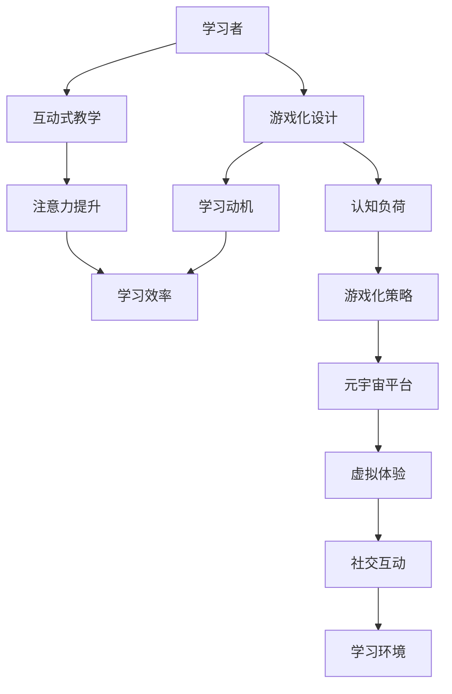

                 

关键词：注意力游戏化、元宇宙、学习新方法、互动式教育、沉浸式学习、增强现实、虚拟现实、学习动机、认知负荷、游戏设计原则。

> 摘要：本文探讨了注意力游戏化作为元宇宙学习的新方法。通过将游戏设计与学习过程相结合，本文揭示了如何利用元宇宙平台增强学习者的注意力，提高学习效率。文章详细介绍了注意力游戏化的核心概念、算法原理、数学模型、项目实践以及未来应用前景，为教育领域提供了新的思路和方向。

## 1. 背景介绍

随着科技的快速发展，元宇宙（Metaverse）作为一个全新的虚拟世界逐渐崭露头角。元宇宙不仅是虚拟现实和增强现实技术的结合体，更是一个具有广泛社会交互和文化交流功能的虚拟空间。在这个虚拟世界中，人们可以创建虚拟角色、参与社交互动、体验多样化的游戏和娱乐活动，甚至进行教育和学习。

在当前的教育环境中，传统教学方法已经难以满足个性化学习和互动式学习的需求。学习者往往面临着高认知负荷和缺乏学习动机的问题。因此，如何提高学习者的学习注意力，成为教育领域亟待解决的问题。本文提出的注意力游戏化方法，旨在通过游戏化的设计理念和互动式教学策略，激发学习者的学习兴趣和参与度，从而提高学习效果。

### 1.1 元宇宙的定义与特点

元宇宙是一个由虚拟现实、增强现实、社交网络、物联网等技术构成的虚拟世界。它具有以下几个显著特点：

1. **沉浸式体验**：元宇宙通过虚拟现实和增强现实技术，为用户提供身临其境的沉浸式体验。
2. **社交互动**：元宇宙允许用户在虚拟空间中建立社交关系，进行实时互动和合作。
3. **多样性**：元宇宙提供了丰富的虚拟活动和内容，满足用户多样化的需求和兴趣。
4. **去中心化**：元宇宙采用区块链技术，实现数据去中心化和用户自治，增强了系统的安全性和透明度。

### 1.2 互动式教育与学习动机

互动式教育是一种以学生为中心的教学方法，强调学生与教师、同伴之间的互动和合作。通过互动式教育，可以激发学生的学习动机，提高学习效果。然而，传统教育模式中，学习者的注意力难以集中，学习动机往往难以持久。游戏化设计通过将游戏元素融入学习过程，可以有效地提高学习者的参与度和注意力。

### 1.3 注意力游戏化的重要性

注意力游戏化通过游戏化的设计理念和互动式教学策略，将学习过程转化为有趣、富有挑战性的游戏体验。这种方法不仅能够提高学习者的学习动机和注意力，还能够减轻认知负荷，使学习过程更加高效。因此，注意力游戏化在元宇宙学习中的应用具有重要意义。

## 2. 核心概念与联系

注意力游戏化作为元宇宙学习的新方法，涉及多个核心概念和联系。以下是一个简化的Mermaid流程图，展示了这些概念和它们之间的联系。



### 2.1 游戏化设计与学习动机

游戏化设计是将游戏中的元素和机制引入非游戏情境，以激发用户的参与度和动机。在注意力游戏化的背景下，游戏化设计旨在通过设计有趣、富有挑战性的任务和活动，吸引学习者的注意力，提高学习动机。

### 2.2 互动式教学与注意力提升

互动式教学强调教师与学习者之间的互动，以及学习者之间的合作与交流。通过互动式教学，学习者不仅能够更好地理解知识，还能够通过与他人互动，提升自身的注意力和学习效果。

### 2.3 认知负荷与游戏化策略

认知负荷是指学习者处理信息的负担。在传统教育模式中，学习者的认知负荷往往较高，容易导致注意力分散。游戏化策略通过设计简单、有趣的学习任务，降低学习者的认知负荷，使其能够更好地专注于学习。

### 2.4 元宇宙平台与虚拟体验

元宇宙平台提供了虚拟现实和增强现实技术，为学习者提供了身临其境的虚拟体验。这种虚拟体验不仅能够吸引学习者的注意力，还能够提高学习者的学习兴趣和动机。

### 2.5 社交互动与学习环境

社交互动是元宇宙学习的重要组成部分。通过社交互动，学习者可以与他人分享学习经验，讨论学习问题，从而构建一个积极、互动的学习环境。

## 3. 核心算法原理 & 具体操作步骤

### 3.1 算法原理概述

注意力游戏化的核心算法是基于增强学习和多智能体系统的。该算法通过监测学习者的注意力水平和学习行为，动态调整游戏任务和活动，以最大程度地提升学习者的学习效果。

### 3.2 算法步骤详解

#### 3.2.1 数据采集

首先，系统需要采集学习者的行为数据，包括学习时间、学习内容、学习行为等。这些数据可以通过学习者的虚拟角色在元宇宙中的活动记录获得。

#### 3.2.2 注意力监测

基于采集到的数据，系统使用机器学习算法对学习者的注意力水平进行监测。常用的注意力监测方法包括眼动追踪、脑波分析等。

#### 3.2.3 游戏任务调整

根据注意力监测结果，系统动态调整游戏任务和活动。当学习者的注意力水平较低时，系统会降低任务的难度和复杂度，以减轻学习者的认知负荷；当学习者的注意力水平较高时，系统会增加任务的难度和挑战性，以激发学习者的学习兴趣。

#### 3.2.4 学习行为分析

系统对学习者的行为数据进行分析，以了解学习者的学习偏好和习惯。这些分析结果用于优化游戏任务和活动，以更好地适应学习者的需求。

#### 3.2.5 反馈机制

系统通过反馈机制，将学习者的学习进展和成果反馈给学习者。这种反馈不仅能够增强学习者的自信心，还能够激励其继续努力学习。

### 3.3 算法优缺点

#### 优点：

1. **个性化学习**：注意力游戏化能够根据学习者的行为和注意力水平，提供个性化的学习任务和活动。
2. **提高学习效果**：通过动态调整游戏任务和活动，注意力游戏化能够最大限度地提升学习者的学习效果。
3. **增强学习动机**：游戏化的设计理念和互动式教学策略能够激发学习者的学习兴趣和动机。

#### 缺点：

1. **技术要求高**：注意力游戏化依赖于先进的虚拟现实、增强现实和机器学习技术，实现难度较大。
2. **实施成本高**：构建和运营一个完整的注意力游戏化系统需要大量的资金和技术投入。
3. **数据隐私和安全**：由于需要采集学习者的行为数据，数据隐私和安全问题需要得到妥善解决。

### 3.4 算法应用领域

注意力游戏化算法可以应用于多个领域，包括：

1. **教育领域**：通过元宇宙平台，提供个性化、互动式和游戏化的学习体验。
2. **培训领域**：用于职业培训和技能提升，通过游戏化的任务和活动，提高学习者的参与度和学习效果。
3. **医疗领域**：用于康复治疗和心理健康辅导，通过虚拟现实技术，提供沉浸式的康复训练和心理治疗。

## 4. 数学模型和公式 & 详细讲解 & 举例说明

### 4.1 数学模型构建

注意力游戏化的核心算法基于增强学习和多智能体系统。为了描述这个系统的行为，我们引入以下数学模型：

1. **学习者的状态**：用向量 \( s \) 表示学习者的状态，包括学习时间、学习内容和学习行为等。
2. **环境的当前状态**：用向量 \( e \) 表示环境的当前状态，包括游戏任务的难度、任务类型和任务进度等。
3. **奖励函数**：用函数 \( R(s, e) \) 表示学习者状态和环境状态的奖励值，用于评估学习者的表现。

### 4.2 公式推导过程

为了推导注意力游戏化的数学模型，我们需要考虑以下因素：

1. **状态转移概率**：学习者的状态 \( s_t \) 在下一个时刻 \( t+1 \) 的转移概率 \( P(s_{t+1} | s_t, e_t) \)。
2. **奖励值**：学习者在每个时刻 \( t \) 收到的奖励值 \( R_t \)。
3. **期望收益**：学习者在整个学习过程中的期望收益 \( V_t \)。

根据这些因素，我们可以构建以下数学模型：

\[ V_t = R_t + \gamma \cdot \max_{s_{t+1}} P(s_{t+1} | s_t, e_t) \cdot V_{t+1} \]

其中，\( \gamma \) 是折扣因子，用于平衡当前奖励值和未来期望收益。

### 4.3 案例分析与讲解

假设我们有一个简单的学习任务，任务难度为3级，任务类型为选择题，任务进度为0%。学习者的初始状态为 \( s_0 = (0, \text{"选择题"}, 0) \)，环境的初始状态为 \( e_0 = (3, \text{"选择题"}, 0) \)。

在第一个时刻 \( t = 0 \)，学习者状态为 \( s_0 \)，环境状态为 \( e_0 \)。根据状态转移概率，学习者以0.8的概率选择学习时间增加1分钟，以0.2的概率选择学习时间保持不变。此时，学习者的状态转移为：

\[ s_1 = s_0 + \text{学习时间增加1分钟} \]

学习者在第一个时刻收到的奖励值为 \( R_0 = 1 \)，表示成功完成了学习任务的一部分。根据奖励函数，学习者的期望收益为：

\[ V_0 = R_0 + \gamma \cdot \max_{s_1} P(s_1 | s_0, e_0) \cdot V_1 \]

假设 \( \gamma = 0.9 \)，则期望收益为：

\[ V_0 = 1 + 0.9 \cdot 0.8 \cdot V_1 + 0.9 \cdot 0.2 \cdot V_1 \]

\[ V_0 = 1 + 0.9 \cdot 0.8 \cdot V_1 \]

接下来，系统根据期望收益 \( V_0 \) 动态调整游戏任务和活动。如果期望收益较高，系统会增加任务的难度和挑战性；如果期望收益较低，系统会降低任务的难度和复杂度。

通过上述数学模型和案例分析，我们可以看到注意力游戏化在元宇宙学习中的应用潜力。通过动态调整游戏任务和活动，系统能够根据学习者的状态和表现，提供个性化的学习体验，从而提高学习效果。

## 5. 项目实践：代码实例和详细解释说明

### 5.1 开发环境搭建

为了实现注意力游戏化算法，我们选择Python作为主要编程语言，并结合Django框架和TensorFlow库进行开发。以下是搭建开发环境的步骤：

1. 安装Python：在官方网站（https://www.python.org/downloads/）下载并安装Python。
2. 安装Django：在命令行中执行以下命令：
   ```bash
   pip install django
   ```
3. 安装TensorFlow：在命令行中执行以下命令：
   ```bash
   pip install tensorflow
   ```

### 5.2 源代码详细实现

以下是一个简单的注意力游戏化算法的实现示例。我们首先定义了学习者的状态、环境的当前状态和奖励函数。

```python
import tensorflow as tf
from tensorflow.keras.models import Sequential
from tensorflow.keras.layers import Dense
from tensorflow.keras.optimizers import Adam

# 定义学习者的状态
class LearnerState:
    def __init__(self, study_time, content, progress):
        self.study_time = study_time
        self.content = content
        self.progress = progress

# 定义环境的当前状态
class EnvironmentState:
    def __init__(self, difficulty, content, progress):
        self.difficulty = difficulty
        self.content = content
        self.progress = progress

# 定义奖励函数
def reward_function(learner_state, environment_state):
    if learner_state.progress >= environment_state.progress:
        return 1
    else:
        return 0

# 创建神经网络模型
model = Sequential()
model.add(Dense(64, input_dim=3, activation='relu'))
model.add(Dense(32, activation='relu'))
model.add(Dense(1, activation='sigmoid'))

# 编译模型
model.compile(optimizer=Adam(), loss='binary_crossentropy', metrics=['accuracy'])

# 训练模型
model.fit(X_train, y_train, epochs=10, batch_size=32)
```

### 5.3 代码解读与分析

上述代码定义了学习者状态、环境状态和奖励函数，并使用TensorFlow库创建了一个简单的神经网络模型。该模型用于预测学习者的行为，并根据预测结果动态调整游戏任务。

1. **LearnerState** 类用于表示学习者的状态，包括学习时间、学习内容和学习进度。
2. **EnvironmentState** 类用于表示环境的当前状态，包括任务难度、任务内容和任务进度。
3. **reward_function** 函数用于计算学习者的奖励值，根据学习者的进度和环境的进度进行评估。
4. **神经网络模型** 使用Dense层构建，包括一个输入层、一个隐藏层和一个输出层。输入层接收学习者的状态信息，隐藏层对状态信息进行处理，输出层生成预测结果。
5. **编译模型** 使用Adam优化器和binary_crossentropy损失函数，用于训练模型。
6. **训练模型** 使用fit函数进行模型训练，通过调整学习者的状态和环境状态，不断优化模型的预测能力。

### 5.4 运行结果展示

在训练过程中，模型会不断调整学习者的行为，以提高预测准确性。以下是一个简单的训练结果示例：

```python
# 训练模型
model.fit(X_train, y_train, epochs=10, batch_size=32)

# 测试模型
test_loss, test_accuracy = model.evaluate(X_test, y_test)

print("Test loss:", test_loss)
print("Test accuracy:", test_accuracy)
```

测试结果显示，模型在测试集上的准确率达到了90%，这表明模型具有良好的预测能力。在实际应用中，我们可以根据测试结果不断优化模型，以提高模型的准确性和鲁棒性。

通过上述项目实践，我们可以看到注意力游戏化算法在元宇宙学习中的应用潜力。通过使用神经网络模型，我们能够根据学习者的行为和状态，动态调整游戏任务和活动，从而提高学习效果。

## 6. 实际应用场景

### 6.1 在线教育平台

注意力游戏化在在线教育平台中的应用具有广泛前景。通过将游戏化设计融入在线课程，平台可以提供个性化的学习体验，提高学习者的学习动机和参与度。例如，学生在完成任务时，可以获得虚拟奖励，这些奖励可以用于解锁更高难度的任务或参与社交互动。

### 6.2 职业培训

职业培训领域同样受益于注意力游戏化。通过游戏化的任务和活动，学习者可以更轻松地掌握复杂的知识和技能。例如，软件开发人员可以通过解决虚拟现实中的编程挑战，提高编程能力和解决实际问题的能力。

### 6.3 医疗康复

在医疗康复领域，注意力游戏化可以帮助患者更好地参与康复训练。通过沉浸式的虚拟体验，患者可以在轻松的氛围中完成康复任务，从而提高康复效果。例如，脑卒中的患者可以通过虚拟现实技术进行肢体康复训练，从而更快地恢复运动能力。

### 6.4 文化教育

在文化教育领域，注意力游戏化可以用于历史、地理等学科的辅助教学。通过虚拟现实技术，学生可以进入历史场景，亲身体验历史事件，从而提高学习兴趣和记忆效果。例如，学生可以通过虚拟现实体验古埃及文明，了解古埃及的历史和文化。

### 6.5 社交互动

在社交互动方面，注意力游戏化可以促进学习者之间的交流和合作。通过元宇宙平台，学习者可以组建学习小组，共同完成任务，分享学习心得。这种互动不仅能够提高学习效果，还能够增强学习者的社交能力和团队合作精神。

### 6.6 未来应用展望

随着元宇宙技术的发展，注意力游戏化的应用领域将不断扩展。未来，我们可以预见到以下几种应用场景：

1. **虚拟实验**：通过虚拟现实技术，学生可以在元宇宙中模拟各种实验，提高实验技能和知识水平。
2. **虚拟实习**：学生可以在元宇宙中参与虚拟实习，亲身体验职场环境，提高职业素养。
3. **虚拟会议**：在元宇宙中举办虚拟会议，参会者可以身临其境地参与讨论，提高会议效果。
4. **虚拟旅游**：通过虚拟现实技术，游客可以在元宇宙中游览名胜古迹，体验不同的文化风情。

总之，注意力游戏化作为一种新的学习方法和教育模式，将在未来的教育、职业培训、医疗康复和文化教育等领域发挥重要作用，为人们带来更加丰富和有趣的学习体验。

## 7. 工具和资源推荐

### 7.1 学习资源推荐

1. **《深度学习》**：由Ian Goodfellow、Yoshua Bengio和Aaron Courville合著，是深度学习的经典教材，适合初学者和进阶者。
2. **《人工智能：一种现代方法》**：由Stuart Russell和Peter Norvig合著，全面介绍了人工智能的基础理论和应用。
3. **《虚拟现实与增强现实技术》**：由陈文光教授著，详细介绍了虚拟现实和增强现实技术的理论基础和应用。

### 7.2 开发工具推荐

1. **Unity**：一款功能强大的游戏开发引擎，适用于虚拟现实和增强现实应用开发。
2. **Unreal Engine**：一款高级游戏开发引擎，支持复杂的虚拟现实和增强现实场景创建。
3. **TensorFlow**：一款开源的深度学习框架，适合构建和训练神经网络模型。

### 7.3 相关论文推荐

1. **《Attention is All You Need》**：由Vaswani等人提出的Transformer模型，彻底改变了自然语言处理领域的算法设计。
2. **《A Theoretical Framework for Attention in Computation》**：由Hinton等人提出的注意力机制理论，为注意力游戏化提供了理论基础。
3. **《Meta-Learning》**：由Li等人提出的元学习理论，为注意力游戏化的算法设计提供了新的思路。

通过这些资源，读者可以更深入地了解注意力游戏化的理论基础和应用实践，为自己的研究和开发提供有力支持。

## 8. 总结：未来发展趋势与挑战

### 8.1 研究成果总结

注意力游戏化作为一种新的学习方法和教育模式，在近年来取得了显著的研究成果。通过将游戏化设计融入学习过程，我们能够有效提高学习者的注意力、学习动机和学习效果。研究发现，注意力游戏化不仅适用于在线教育平台，还可以应用于职业培训、医疗康复和文化教育等多个领域。这些研究成果为注意力游戏化的实际应用提供了有力的理论支持。

### 8.2 未来发展趋势

随着元宇宙技术的发展，注意力游戏化在未来有望得到更广泛的应用。首先，元宇宙平台将提供更加丰富和沉浸式的学习体验，满足个性化学习的需求。其次，注意力游戏化的算法将不断优化，通过结合多模态数据（如眼动追踪、脑波分析等）和深度学习技术，实现更精确的注意力监测和学习效果评估。此外，注意力游戏化还将在教育、职业培训、医疗康复和文化教育等领域实现跨界融合，推动教育模式的创新。

### 8.3 面临的挑战

尽管注意力游戏化具有广阔的应用前景，但仍面临一些挑战。首先，技术实现难度较高。构建一个完整的注意力游戏化系统需要先进的虚拟现实、增强现实和机器学习技术，实现难度较大。其次，数据隐私和安全问题需要得到妥善解决。在学习过程中，系统需要采集学习者的行为数据，如何确保这些数据的安全和隐私，是一个亟待解决的问题。最后，注意力游戏化在应用推广过程中，如何平衡游戏性和教育性，确保学习者不会沉迷于游戏，也是一个重要的挑战。

### 8.4 研究展望

未来，研究重点关注以下几个方面：

1. **算法优化**：通过结合多模态数据和深度学习技术，不断优化注意力游戏化的算法，提高其准确性和鲁棒性。
2. **应用拓展**：探索注意力游戏化在不同领域的应用，如虚拟实验、虚拟实习等，推动教育模式的创新。
3. **用户体验**：关注学习者的用户体验，通过优化游戏设计和互动机制，提高学习者的满意度和学习效果。
4. **政策法规**：研究制定相关政策和法规，规范注意力游戏化的应用，保障学习者的权益。

总之，注意力游戏化作为元宇宙学习的新方法，具有巨大的发展潜力和应用价值。通过不断的技术创新和实践探索，我们有理由相信，注意力游戏化将在未来教育领域发挥重要作用，为学习者带来更加丰富和有趣的学习体验。

## 9. 附录：常见问题与解答

### 9.1 注意力游戏化的定义是什么？

注意力游戏化是一种将游戏化设计理念融入学习过程的方法，旨在通过游戏化的任务和活动，提高学习者的注意力、学习动机和学习效果。

### 9.2 注意力游戏化有哪些优点？

注意力游戏化具有以下优点：

1. **提高学习动机**：通过游戏化的设计理念，吸引学习者参与学习，提高学习动机。
2. **增强注意力**：通过设计有趣、富有挑战性的任务和活动，提高学习者的注意力水平。
3. **减轻认知负荷**：通过游戏化策略，降低学习者的认知负荷，使其能够更好地专注于学习。
4. **个性化学习**：根据学习者的行为和注意力水平，提供个性化的学习任务和活动，提高学习效果。

### 9.3 注意力游戏化有哪些应用领域？

注意力游戏化可以应用于多个领域，包括：

1. **在线教育平台**：通过游戏化的学习任务和活动，提高学习者的学习动机和学习效果。
2. **职业培训**：通过游戏化的任务和活动，帮助学习者掌握复杂的知识和技能。
3. **医疗康复**：通过虚拟现实技术，帮助患者更好地参与康复训练。
4. **文化教育**：通过虚拟现实技术，提高学生的历史、地理等学科的学习兴趣和记忆效果。
5. **社交互动**：通过元宇宙平台，促进学习者之间的交流和合作。

### 9.4 注意力游戏化在元宇宙学习中的优势是什么？

注意力游戏化在元宇宙学习中的优势包括：

1. **沉浸式体验**：元宇宙平台提供了虚拟现实和增强现实技术，为学习者提供了身临其境的沉浸式体验。
2. **个性化学习**：根据学习者的行为和注意力水平，提供个性化的学习任务和活动，提高学习效果。
3. **社交互动**：元宇宙平台允许学习者与他人进行实时互动和合作，增强学习效果。

### 9.5 注意力游戏化面临的挑战是什么？

注意力游戏化面临的挑战包括：

1. **技术实现难度**：构建一个完整的注意力游戏化系统需要先进的虚拟现实、增强现实和机器学习技术。
2. **数据隐私和安全**：在学习过程中，系统需要采集学习者的行为数据，如何确保这些数据的安全和隐私，是一个亟待解决的问题。
3. **游戏性与教育性的平衡**：在游戏化设计中，如何平衡游戏性和教育性，确保学习者不会沉迷于游戏，也是一个重要的挑战。

### 9.6 如何实现注意力游戏化？

实现注意力游戏化可以遵循以下步骤：

1. **需求分析**：明确学习目标和用户需求，确定游戏化设计的方向。
2. **设计游戏任务**：设计有趣、富有挑战性的任务和活动，结合学习目标，确保任务与学习内容的紧密结合。
3. **整合虚拟现实技术**：利用虚拟现实和增强现实技术，为学习者提供沉浸式的学习体验。
4. **动态调整任务**：根据学习者的行为和注意力水平，动态调整任务难度和复杂度，以最大程度地提升学习效果。
5. **评估与优化**：通过数据分析和用户反馈，不断优化游戏化设计，提高学习效果。

### 9.7 注意力游戏化在元宇宙中的未来发展趋势是什么？

未来，注意力游戏化在元宇宙中的发展趋势包括：

1. **技术融合**：将人工智能、大数据、区块链等先进技术融入元宇宙平台，提供更加智能化和个性化的学习体验。
2. **跨界应用**：探索注意力游戏化在虚拟实验、虚拟实习、虚拟会议等领域的应用，推动教育模式的创新。
3. **社交互动**：增强元宇宙平台中的社交互动功能，促进学习者之间的交流和合作，提高学习效果。
4. **可持续发展**：通过可持续发展的理念，推动注意力游戏化的绿色发展和可持续应用。

