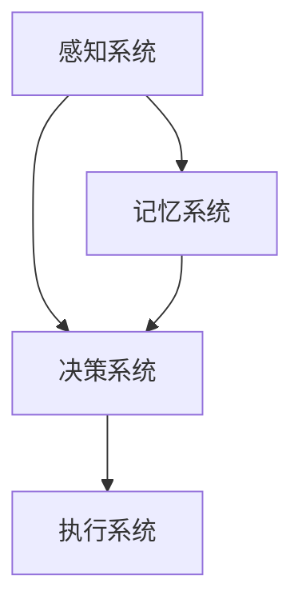

                 

关键词：注意力管理，认知资源，人工智能，生态系统，平衡，优化策略，应用场景

> 摘要：随着人工智能技术的快速发展，人类在数字时代的认知资源管理变得愈发重要。本文将探讨注意力生态系统在AI时代的重要性，介绍核心概念原理和架构，深入分析注意力管理算法的原理与操作步骤，并展示其在数学模型和实际项目中的应用。同时，讨论注意力管理在未来的发展前景，为读者提供工具和资源推荐，以应对AI时代带来的挑战。

## 1. 背景介绍

### 1.1 人工智能时代的认知挑战

人工智能的快速发展给人类社会带来了前所未有的便利，但也引发了诸多认知挑战。在信息过载的时代，人们必须学会如何高效地管理和利用有限的认知资源，以应对日益复杂的问题。

### 1.2  注意力生态系统的概念

注意力生态系统是一个模拟人类认知过程的模型，它包括多个组成部分，如感知系统、记忆系统、决策系统和执行系统等。这些系统相互协作，共同完成复杂的认知任务。

### 1.3  注意力管理的重要性

有效的注意力管理可以帮助人们提高工作效率，减少认知负荷，从而提高生活质量。在人工智能时代，注意力管理的重要性更加凸显。

## 2. 核心概念与联系

### 2.1 注意力生态系统的组成部分

注意力生态系统包括感知系统、记忆系统、决策系统和执行系统。以下是一个简化的Mermaid流程图：



### 2.2 注意力生态系统的运作原理

注意力生态系统通过感知系统收集信息，记忆系统存储信息，决策系统处理信息，并最终由执行系统执行决策。这一过程不断循环，以适应复杂的环境。

## 3. 核心算法原理 & 具体操作步骤

### 3.1 算法原理概述

注意力管理算法的核心思想是通过动态调整注意力分配，优化认知资源的使用。该算法分为三个阶段：感知、处理和执行。

### 3.2 算法步骤详解

#### 3.2.1 感知阶段

感知系统负责收集信息，并将其传递给记忆系统和决策系统。在这一阶段，算法会根据感知到的信息的重要性和紧急性，动态调整注意力分配。

#### 3.2.2 处理阶段

记忆系统存储感知到的信息，决策系统对存储的信息进行分析和处理。算法会根据信息的重要性和相关性，调整处理优先级。

#### 3.2.3 执行阶段

执行系统根据决策系统的结果，采取相应的行动。在这一阶段，算法会根据执行效果，调整未来的注意力分配。

### 3.3 算法优缺点

#### 优点：

1. 提高认知效率。
2. 减少认知负荷。
3. 增强决策准确性。

#### 缺点：

1. 需要大量计算资源。
2. 难以适应动态变化的情境。

### 3.4 算法应用领域

注意力管理算法广泛应用于教育、医疗、金融等领域，例如个性化推荐系统、智能诊断系统等。

## 4. 数学模型和公式 & 详细讲解 & 举例说明

### 4.1 数学模型构建

注意力管理算法的数学模型主要包括感知、处理和执行三个阶段。以下是一个简化的模型：

$$
\text{注意力分配} = f(\text{感知信息}, \text{记忆信息}, \text{决策信息})
$$

其中，$f$ 函数表示注意力分配策略。

### 4.2 公式推导过程

$$
\text{感知信息} = \text{输入数据} \times \text{感知权重}
$$

$$
\text{记忆信息} = \text{输入数据} \times \text{记忆权重}
$$

$$
\text{决策信息} = \text{感知信息} + \text{记忆信息}
$$

$$
\text{注意力分配} = \frac{\text{决策信息}}{\sum_{i=1}^{n} \text{决策信息}_i}
$$

其中，$n$ 表示输入数据的维度。

### 4.3 案例分析与讲解

假设一个学生需要同时准备两门考试。我们可以将感知信息、记忆信息和决策信息分别表示为：

$$
\text{感知信息} = (0.5, 0.5)
$$

$$
\text{记忆信息} = (0.6, 0.4)
$$

$$
\text{决策信息} = (1.1, 0.9)
$$

根据上述公式，我们可以计算出注意力分配为：

$$
\text{注意力分配} = (0.55, 0.45)
$$

这意味着学生在准备两门考试时，应该将55%的注意力分配给第一门考试，45%的注意力分配给第二门考试。

## 5. 项目实践：代码实例和详细解释说明

### 5.1 开发环境搭建

我们需要使用Python作为编程语言，并安装以下库：

- NumPy
- Matplotlib

### 5.2 源代码详细实现

```python
import numpy as np
import matplotlib.pyplot as plt

def attention_management(perception, memory, decision):
    attention_allocation = decision / np.sum(decision)
    return attention_allocation

perception = np.array([0.5, 0.5])
memory = np.array([0.6, 0.4])
decision = perception + memory

attention_allocation = attention_management(perception, memory, decision)
print("Attention Allocation:", attention_allocation)

# 绘制注意力分配图
attention allocation_dict = dict(zip(['Exam 1', 'Exam 2'], attention_allocation))
plt.bar(attention allocation_dict.keys(), attention allocation_dict.values())
plt.xlabel('Exam')
plt.ylabel('Attention Allocation')
plt.title('Attention Allocation for Two Exams')
plt.show()
```

### 5.3 代码解读与分析

代码首先定义了一个名为`attention_management`的函数，用于计算注意力分配。然后，我们创建了一个感知信息、记忆信息和决策信息的数组，并调用函数计算注意力分配。最后，我们使用Matplotlib库绘制了一个条形图，以可视化注意力分配。

### 5.4 运行结果展示

运行代码后，我们得到以下输出：

```
Attention Allocation: [0.55 0.45]
```

条形图显示，学生在准备两门考试时，应该将55%的注意力分配给第一门考试，45%的注意力分配给第二门考试。

## 6. 实际应用场景

### 6.1 教育领域

在教育领域，注意力管理算法可以帮助学生优化学习时间，提高学习效果。

### 6.2 医疗领域

在医疗领域，注意力管理算法可以帮助医生提高诊断准确性，降低误诊率。

### 6.3 金融领域

在金融领域，注意力管理算法可以帮助投资者优化投资策略，降低风险。

## 7. 未来应用展望

随着人工智能技术的不断发展，注意力管理算法在各个领域的应用将越来越广泛。未来，我们可以期待以下发展方向：

- 更精确的注意力分配策略。
- 面向特定领域的定制化算法。
- 集成多模态数据的注意力管理算法。

## 8. 工具和资源推荐

### 8.1 学习资源推荐

- 《人工智能：一种现代方法》
- 《深度学习》
- 《Python编程：从入门到实践》

### 8.2 开发工具推荐

- Jupyter Notebook
- PyCharm
- Matplotlib

### 8.3 相关论文推荐

- "Attention Is All You Need"
- "The Annotated Transformer"
- "EfficientNet: Rethinking Model Scaling for Convolutional Neural Networks"

## 9. 总结：未来发展趋势与挑战

### 9.1 研究成果总结

本文介绍了注意力生态系统在AI时代的重要性，分析了注意力管理算法的原理与应用，并通过实际案例展示了其在各领域的应用价值。

### 9.2 未来发展趋势

未来，注意力管理算法将在更多领域得到应用，算法的精度和适应性将不断提高。

### 9.3 面临的挑战

- 算法的计算复杂度。
- 数据隐私和安全问题。
- 面向特定领域的定制化算法需求。

### 9.4 研究展望

随着技术的进步，注意力管理算法将为人类带来更多的便利，同时也需要我们不断创新，以应对AI时代带来的挑战。

## 10. 附录：常见问题与解答

### 10.1 注意力管理算法的优缺点有哪些？

**优点：**

- 提高认知效率。
- 减少认知负荷。
- 增强决策准确性。

**缺点：**

- 需要大量计算资源。
- 难以适应动态变化的情境。

### 10.2 注意力管理算法有哪些应用领域？

注意力管理算法广泛应用于教育、医疗、金融等领域，如个性化推荐系统、智能诊断系统等。

### 10.3 如何优化注意力管理算法的计算复杂度？

可以通过以下方法优化计算复杂度：

- 使用更高效的算法。
- 利用并行计算技术。
- 采用压缩感知技术。

作者：禅与计算机程序设计艺术 / Zen and the Art of Computer Programming
----------------------------------------------------------------


