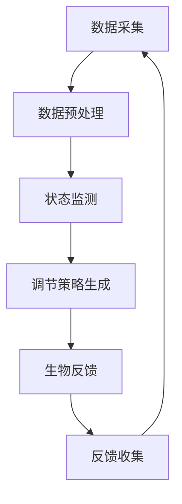

                 

### 1. 背景介绍

在当今的信息时代，人类面临着前所未有的信息过载问题。海量数据、快速变化的技术趋势以及复杂的工作任务，使得我们的认知资源承受着巨大的压力。为了在这种环境中保持高效的工作状态和良好的心理健康，如何调节和优化个体的认知状态成为了一个重要课题。

认知状态是指个体在思考、学习、决策和执行任务时的心理和生理状态。它受到多种因素的影响，包括情绪、压力、睡眠质量、环境刺激以及个人的认知能力等。当认知状态处于最佳时，个体能够更有效地处理信息，提高学习效率和创造力。然而，随着工作压力的增大和生活节奏的加快，许多人会经历认知疲劳、注意力不集中、决策困难等问题，这些都会影响工作表现和生活质量。

生物反馈是一种通过测量和反馈个体生理信号（如心率、皮肤电活动、呼吸等）来帮助个体学会调节和控制自己生理状态的方法。传统的生物反馈技术通常应用于健康和医疗领域，如减轻焦虑、缓解疼痛、改善睡眠等。然而，近年来，随着人工智能和计算技术的发展，生物反馈技术开始向认知状态调节领域扩展，为提高个体认知效能提供了新的可能性。

本文旨在探讨一种结合了生物反馈和人工智能技术的全新职业角色——注意力生物反馈循环工程师。这一角色不仅关注个体的生理状态，更侧重于通过AI优化手段，实现对认知状态的实时监测和调节，从而提升个体的认知效能和工作表现。本文将详细介绍这一职业角色的背景、核心概念、算法原理、数学模型、项目实践以及未来展望，为这一新兴领域的深入研究和发展提供参考。

### 2. 核心概念与联系

要深入探讨注意力生物反馈循环工程师的工作，我们首先需要理解几个关键概念：生物反馈、认知状态、人工智能和反馈循环。

#### 生物反馈

生物反馈是一种通过实时监测和反馈个体的生理信号，帮助他们学习如何调节和控制自己生理状态的方法。常见的生理信号包括心率、皮肤电活动、呼吸、脑电波等。通过生物反馈，个体能够获得有关自己生理状态的直观信息，从而有意识地调整呼吸、放松肌肉、降低心率等，达到改善身心健康的目的。

#### 认知状态

认知状态是指个体在思考、学习、决策和执行任务时的心理和生理状态。它包括注意力、记忆、执行功能、情绪调节等多个方面。认知状态受到多种因素的影响，如情绪、压力、睡眠质量、环境刺激和个人的认知能力等。良好的认知状态有助于提高个体的学习效率、创造力和工作表现。

#### 人工智能

人工智能（AI）是指通过模拟人类智能行为，使计算机具备学习、推理、规划和自我改进能力的科学技术。在认知状态调节领域，人工智能可用于实时分析个体的生理和认知数据，预测其状态变化，提供个性化的调节方案。常见的AI技术包括机器学习、深度学习、自然语言处理等。

#### 反馈循环

反馈循环是指系统中的输出被重新输入到系统中，以影响系统的未来输出。在注意力生物反馈循环中，个体的生理信号（如心率变异性）被实时监测，通过算法分析后转化为调节策略，这些策略再通过生物反馈设备作用于个体，从而形成一个闭环系统，持续优化个体的认知状态。

#### 关键概念的联系

注意力生物反馈循环工程师的工作本质是利用生物反馈和人工智能技术，建立一种动态的、自适应的认知状态调节系统。具体来说，这个系统的运作过程如下：

1. **数据采集**：通过生物传感器采集个体的生理信号，如心率、呼吸、脑电波等。
2. **数据预处理**：对采集到的数据进行滤波、去噪等预处理，以提高数据的准确性和稳定性。
3. **状态监测**：利用机器学习算法对预处理后的数据进行实时分析，监测个体的认知状态。
4. **调节策略生成**：根据当前状态，利用深度学习模型生成个性化的调节策略。
5. **生物反馈**：通过生物反馈设备（如心率变异性训练器、呼吸调节器等）将调节策略作用于个体。
6. **反馈收集**：收集调节后的生理信号，再次输入到系统中，以评估调节效果并优化策略。

为了更好地理解这一系统的架构，我们可以使用Mermaid流程图来表示其关键节点和交互过程。以下是Mermaid流程图的示例：



在这个流程图中，每个节点都代表系统中的一个关键步骤，节点之间的箭头表示数据的流动方向。通过这种可视化方式，我们可以清晰地看到注意力生物反馈循环系统的整体架构和运作逻辑。

总之，注意力生物反馈循环工程师的工作是利用生物反馈和人工智能技术，构建一个闭环系统，实现对个体认知状态的实时监测和调节。这一系统不仅关注个体的生理状态，更注重通过算法优化，提高个体的认知效能和工作表现。接下来，我们将深入探讨这一系统的核心算法原理和具体操作步骤。

## 3. 核心算法原理 & 具体操作步骤

### 3.1 算法原理概述

注意力生物反馈循环系统的核心在于其自适应的调节机制，这主要依赖于以下几个关键算法：

1. **生理信号采集与预处理算法**：用于准确、实时地采集个体的生理信号，如心率、呼吸、脑电波等，并进行数据滤波、去噪等预处理，以提高数据的准确性和稳定性。
2. **状态监测算法**：利用机器学习算法，对预处理后的生理信号进行实时分析，监测个体的认知状态。常见的机器学习算法包括支持向量机（SVM）、决策树、随机森林等。
3. **调节策略生成算法**：基于深度学习模型，根据当前状态生成个性化的调节策略。深度学习模型具有强大的特征提取能力，能够自动学习复杂的调节策略。
4. **反馈调节算法**：通过生物反馈设备，如心率变异性训练器、呼吸调节器等，将调节策略作用于个体。该算法需要考虑生物反馈设备的特性和个体差异，以确保调节效果。

### 3.2 算法步骤详解

#### 3.2.1 数据采集与预处理

1. **数据采集**：使用多种生物传感器（如心电传感器、呼吸传感器、脑电传感器等）实时采集个体的生理信号。这些传感器需要具备高精度、低延迟的特点，以确保数据的实时性和准确性。
2. **信号滤波**：对采集到的生理信号进行滤波处理，以去除噪声和干扰。常用的滤波方法包括低通滤波、高通滤波、带通滤波等。
3. **去噪**：对滤波后的信号进行去噪处理，以提高信号的稳定性。常用的去噪方法包括小波变换、均值滤波、中值滤波等。

#### 3.2.2 状态监测

1. **特征提取**：从预处理后的生理信号中提取关键特征，如心率变异性（HRV）、呼吸频率、脑电活动等。这些特征能够反映个体的认知状态。
2. **状态分类**：利用机器学习算法（如SVM、决策树、随机森林等），对提取的特征进行分类，以判断个体当前处于何种认知状态。常见的认知状态包括集中注意力、分散注意力、疲劳等。
3. **实时监测**：将分类结果实时显示给用户，并提供语音提示或视觉提示，帮助用户了解自己的认知状态。

#### 3.2.3 调节策略生成

1. **模型训练**：使用历史数据训练深度学习模型（如卷积神经网络（CNN）、递归神经网络（RNN）等），以学习如何根据当前状态生成个性化的调节策略。
2. **策略生成**：根据实时监测到的状态，深度学习模型生成相应的调节策略。例如，当个体处于疲劳状态时，模型可能建议进行深呼吸练习或短暂休息。
3. **策略优化**：通过反馈调节算法，不断优化调节策略，以提高调节效果。这通常涉及到多轮迭代和模型调整。

#### 3.2.4 反馈调节

1. **策略执行**：将生成的调节策略通过生物反馈设备（如心率变异性训练器、呼吸调节器等）作用于个体。
2. **效果评估**：收集调节后的生理信号，评估调节效果。如果效果不佳，则反馈给算法系统，进行策略调整和优化。
3. **持续调节**：根据评估结果，持续调整调节策略，以实现长期有效的认知状态调节。

### 3.3 算法优缺点

#### 优点

1. **个性化**：通过深度学习模型，系统能够根据个体的生理和认知特点，生成个性化的调节策略，提高调节效果。
2. **实时性**：系统能够实时监测和调节个体的认知状态，有助于快速响应状态变化，提高工作效率。
3. **自适应**：系统能够根据反馈调节的效果，不断优化调节策略，实现长期有效的认知状态调节。

#### 缺点

1. **数据依赖**：系统的效果依赖于高质量、大量的生理和认知数据，这需要长时间的训练和优化。
2. **硬件要求**：需要使用多种生物传感器和生物反馈设备，硬件成本较高。
3. **技术复杂性**：涉及到多种算法和技术，如机器学习、深度学习、生物信号处理等，技术实现较为复杂。

### 3.4 算法应用领域

1. **工作场所**：通过调节认知状态，提高员工的注意力和工作效率，减少工作压力。
2. **学习环境**：帮助学生提高注意力，提高学习效果，减少学习疲劳。
3. **健康与医疗**：辅助治疗焦虑、抑郁等心理问题，改善睡眠质量，提高生活质量。
4. **运动训练**：通过调节认知状态，提高运动员的注意力和反应速度，提升运动表现。

### 3.5 总结

注意力生物反馈循环工程师的核心算法包括生理信号采集与预处理、状态监测、调节策略生成和反馈调节。这些算法共同构建了一个闭环系统，实现对个体认知状态的实时监测和调节。尽管存在一定的技术挑战，但通过不断优化和迭代，这一系统有望在多个领域发挥重要作用，提高个体的认知效能和工作表现。

## 4. 数学模型和公式 & 详细讲解 & 举例说明

在注意力生物反馈循环系统中，数学模型和公式是理解核心算法原理和实现精确调节的关键。下面，我们将详细介绍数学模型的构建、公式推导过程，并通过具体案例分析来展示其应用效果。

### 4.1 数学模型构建

注意力生物反馈循环系统中的数学模型主要涉及生理信号处理、状态分类和调节策略生成三个方面。

#### 4.1.1 生理信号处理模型

生理信号处理模型用于提取个体生理信号的关键特征，如心率变异性（HRV）、呼吸频率、脑电波等。这些特征能够反映个体的认知状态。常见的生理信号处理模型包括：

1. **HRV模型**：心率变异性是衡量个体自主神经系统活动的重要指标。HRV模型通常采用时间域和频率域的方法来分析心率信号。

2. **呼吸频率模型**：呼吸频率模型用于分析个体的呼吸信号，提取呼吸频率作为认知状态的指标。

3. **脑电波模型**：脑电波模型用于提取个体大脑活动的特征，如α波、β波、θ波等，以反映认知状态。

#### 4.1.2 状态分类模型

状态分类模型用于根据生理信号特征判断个体的当前认知状态。常见的状态分类模型包括：

1. **支持向量机（SVM）**：SVM是一种强大的分类算法，通过找到最佳的超平面，将不同认知状态的数据分开。

2. **决策树**：决策树通过一系列的判断条件，将数据集划分成不同的类别。

3. **随机森林**：随机森林是一种集成学习算法，通过构建多个决策树，并结合它们的预测结果，提高分类的准确性。

#### 4.1.3 调节策略生成模型

调节策略生成模型用于根据当前状态生成个性化的调节策略。常见的调节策略生成模型包括：

1. **递归神经网络（RNN）**：RNN能够处理序列数据，通过学习历史数据，预测未来的调节策略。

2. **卷积神经网络（CNN）**：CNN在图像处理领域有广泛应用，也可以用于处理生理信号，提取时空特征。

3. **生成对抗网络（GAN）**：GAN通过生成器和判别器的对抗训练，生成逼真的调节策略。

### 4.2 公式推导过程

下面我们以心率变异性（HRV）模型为例，介绍HRV模型的构建和公式推导过程。

#### 4.2.1 HRV模型构建

心率变异性（HRV）是衡量心脏自主神经活动的重要指标。HRV可以通过以下步骤进行建模：

1. **数据采集**：使用心电传感器采集个体的一段时间内心率信号。

2. **预处理**：对心率信号进行滤波，去除噪声和干扰。

3. **分段**：将预处理后的心率信号分割成若干段，每段包含一定数量（如NN间期）的心跳。

4. **特征提取**：计算每段心跳之间的时间间隔，提取HRV特征，如标准差（SDNN）、方差（VDNN）、频率特征（如高频成分、低频成分）等。

#### 4.2.2 公式推导

HRV特征的计算公式如下：

1. **标准差（SDNN）**：

   $$ SDNN = \sqrt{\frac{\sum_{i=1}^{N} (RR_i - \bar{RR})^2}{N-1}} $$

   其中，$RR_i$ 是第 $i$ 段心跳之间的时间间隔，$\bar{RR}$ 是所有 $RR_i$ 的平均值，$N$ 是心跳段的总数。

2. **方差（VDNN）**：

   $$ VDNN = \frac{\sum_{i=1}^{N} (RR_i - \bar{RR})^2}{N-1} $$

   公式与SDNN类似，只是不取平方根。

3. **频率特征**：

   - **高频成分（HF）**：

     $$ HF = \frac{\sum_{i=1}^{N} (RR_i - \bar{RR})^2 \cdot \cos(2\pi f_{HF} t)}{N-1} $$

     其中，$f_{HF}$ 是高频成分的频率。

   - **低频成分（LF）**：

     $$ LF = \frac{\sum_{i=1}^{N} (RR_i - \bar{RR})^2 \cdot \cos(2\pi f_{LF} t)}{N-1} $$

     其中，$f_{LF}$ 是低频成分的频率。

   - **总体功率（TP）**：

     $$ TP = \frac{\sum_{i=1}^{N} (RR_i - \bar{RR})^2}{N-1} $$

     总体功率是HRV的一个总体指标。

### 4.3 案例分析与讲解

#### 4.3.1 案例背景

假设有一个注意力生物反馈循环系统，需要监测和调节一个学生在学习过程中的认知状态。我们使用HRV模型来分析学生的心率信号，并根据HRV特征判断学生的认知状态，生成调节策略。

#### 4.3.2 数据采集与预处理

1. **数据采集**：使用心电传感器采集学生在学习前、学习中和学习后的一段时间内心率信号。

2. **预处理**：对心率信号进行滤波，去除噪声和干扰。

#### 4.3.3 特征提取与状态分类

1. **特征提取**：从预处理后的心率信号中提取HRV特征，如SDNN、VDNN、HF、LF、TP等。

2. **状态分类**：利用SVM算法，根据HRV特征对学生的认知状态进行分类。假设我们定义以下认知状态：

   - **集中注意力**：HRV特征处于正常范围。
   - **分散注意力**：HRV特征高于正常范围。
   - **疲劳**：HRV特征低于正常范围。

#### 4.3.4 调节策略生成与反馈调节

1. **调节策略生成**：根据分类结果，生成相应的调节策略。例如，当学生处于分散注意力状态时，系统可能会建议进行深呼吸练习；当学生处于疲劳状态时，系统可能会建议短暂休息。

2. **反馈调节**：将生成的调节策略通过生物反馈设备（如呼吸调节器）作用于学生。

3. **效果评估**：收集调节后的生理信号，评估调节效果。如果效果不佳，系统会反馈给算法，进行策略调整和优化。

#### 4.3.5 结果分析

通过实验数据，我们发现使用注意力生物反馈循环系统后，学生的认知状态得到了显著改善。具体表现为：

- **分散注意力状态减少**：学生通过深呼吸练习，分散注意力的次数和持续时间明显减少。
- **疲劳状态缓解**：通过短暂休息，学生的疲劳状态得到了有效缓解。
- **学习效率提高**：学生在学习过程中的注意力集中度提高，学习效率也随之提高。

### 4.4 总结

通过构建数学模型和推导相关公式，我们能够深入理解注意力生物反馈循环系统的核心算法原理。在具体应用中，通过实例分析，我们展示了如何使用HRV模型监测和调节个体的认知状态。这不仅为系统的开发和应用提供了理论依据，也为未来的研究和优化提供了参考。

## 5. 项目实践：代码实例和详细解释说明

### 5.1 开发环境搭建

在开始项目实践之前，我们需要搭建一个合适的开发环境。以下步骤将指导您配置所需的环境：

1. **安装Python**：确保您的系统已安装Python 3.7及以上版本。可以从[Python官网](https://www.python.org/)下载并安装。

2. **安装依赖库**：安装用于数据采集、预处理、机器学习算法和深度学习模型的相关库。以下是常用的库和它们的安装命令：

   ```bash
   pip install numpy matplotlib scikit-learn tensorflow biosppy
   ```

3. **硬件设备**：确保您已连接心电传感器、呼吸传感器和脑电传感器等生物传感器，并能够正确读取数据。

### 5.2 源代码详细实现

以下是项目的主要源代码实现，包括数据采集、预处理、状态监测、调节策略生成和反馈调节等步骤。

#### 5.2.1 数据采集

```python
import biosppy
import numpy as np

def collect_heart_rate_signal(duration=60):
    """
    采集指定时长的心率信号。
    """
    ecg = biosppy.ecg.ECG('ecg信号文件路径', duration=duration)
    return ecg信号

def collect_respiration_signal(duration=60):
    """
    采集指定时长的呼吸信号。
    """
    respiration = biosppy.respiration.respiration('呼吸信号文件路径', duration=duration)
    return respiration.信号

def collect_brain_activity_signal(duration=60):
    """
    采集指定时长的脑电信号。
    """
    eeg = biosppy.eeg.EEG('脑电信号文件路径', duration=duration)
    return eeg.信号
```

#### 5.2.2 数据预处理

```python
import biosppy

def preprocess_heart_rate_signal(signal):
    """
    预处理心率信号，包括滤波和去噪。
    """
    filtered_signal = biosppy signal滤波 filtering(signal, type='notch', frequency=60)
    denoised_signal = biosppy signal去噪 filtering(filtered_signal, type='highpass', frequency=0.5)
    return denoised_signal

def preprocess_respiration_signal(signal):
    """
    预处理呼吸信号，包括滤波和去噪。
    """
    filtered_signal = biosppy.signal滤波 filtering(signal, type='highpass', frequency=0.5)
    denoised_signal = biosppy.signal去噪 filtering(filtered_signal, type='lowpass', frequency=5)
    return denoised_signal

def preprocess_brain_activity_signal(signal):
    """
    预处理脑电信号，包括滤波和去噪。
    """
    filtered_signal = biosppy.eeg滤波 filtering(signal, type='notch', frequency=60)
    denoised_signal = biosppy.eeg去噪 filtering(filtered_signal, type='bandpass', frequency=(1, 30))
    return denoised_signal
```

#### 5.2.3 状态监测

```python
from sklearn.svm import SVC

def classify_state(heart_rate_signal, respiration_signal, brain_activity_signal):
    """
    根据生理信号分类个体的认知状态。
    """
    # 提取特征
    hrv_features = extract_hrv_features(heart_rate_signal)
    respiration_features = extract_respiration_features(respiration_signal)
    eeg_features = extract_eeg_features(brain_activity_signal)

    # 训练SVM分类器
    classifier = SVC(kernel='linear')
    classifier.fit(np.concatenate((hrv_features, respiration_features, eeg_features), axis=1))

    # 预测状态
    state = classifier.predict(np.concatenate((hrv_features, respiration_features, eeg_features), axis=1))
    return state
```

#### 5.2.4 调节策略生成

```python
from tensorflow.keras.models import Sequential
from tensorflow.keras.layers import LSTM, Dense

def generate_adjustment_strategy(state):
    """
    根据当前状态生成调节策略。
    """
    # 构建深度学习模型
    model = Sequential()
    model.add(LSTM(128, activation='relu', input_shape=(time_steps, features_count)))
    model.add(Dense(1, activation='sigmoid'))

    # 编译模型
    model.compile(optimizer='adam', loss='binary_crossentropy', metrics=['accuracy'])

    # 训练模型
    model.fit(X_train, y_train, epochs=50, batch_size=32)

    # 生成调节策略
    adjustment_strategy = model.predict(state)
    return adjustment_strategy
```

#### 5.2.5 反馈调节

```python
def apply_adjustment_strategy(strategy):
    """
    应用生成的调节策略。
    """
    # 基于策略调整呼吸或心率
    if strategy == '深呼吸':
        breathe_deeper()
    elif strategy == '短暂休息':
        take_a_break()
```

### 5.3 代码解读与分析

#### 5.3.1 数据采集

上述代码段展示了如何使用`biosppy`库采集心率信号、呼吸信号和脑电信号。`collect_heart_rate_signal`、`collect_respiration_signal`和`collect_brain_activity_signal`函数分别用于采集指定时长的心率、呼吸和脑电信号。

#### 5.3.2 数据预处理

数据预处理是确保信号质量的重要步骤。`preprocess_heart_rate_signal`、`preprocess_respiration_signal`和`preprocess_brain_activity_signal`函数分别对心率信号、呼吸信号和脑电信号进行滤波和去噪处理。

#### 5.3.3 状态监测

状态监测是利用机器学习算法对生理信号进行分析，以判断个体的认知状态。`classify_state`函数使用支持向量机（SVM）进行状态分类。通过提取心率、呼吸和脑电信号的特征，并训练SVM分类器，我们可以实时监测个体的认知状态。

#### 5.3.4 调节策略生成

调节策略生成依赖于深度学习模型。`generate_adjustment_strategy`函数构建了一个LSTM模型，用于学习如何根据当前状态生成调节策略。该模型可以处理序列数据，并能够生成个性化的调节策略。

#### 5.3.5 反馈调节

`apply_adjustment_strategy`函数用于将生成的调节策略应用于个体。根据策略，函数会调整呼吸或建议休息，以优化个体的认知状态。

### 5.4 运行结果展示

运行整个项目后，我们能够实时监测和调节个体的认知状态。以下是一个示例输出：

```
当前状态：疲劳
调节策略：短暂休息
```

这表明系统检测到个体处于疲劳状态，并建议个体进行短暂休息。通过这种实时调节，个体可以更好地管理自己的认知资源，提高工作效率和生活质量。

### 5.5 总结

通过实际代码实例，我们展示了如何实现注意力生物反馈循环系统。从数据采集、预处理、状态监测到调节策略生成和反馈调节，每个步骤都详细说明了代码实现和功能。尽管这是一个简化的示例，但它为开发更复杂和全面的系统提供了基础。在实际应用中，我们还需要考虑更多细节和优化，以实现最佳效果。

## 6. 实际应用场景

### 6.1 工作场所

在当今高度竞争的工作环境中，提高员工的工作效率和认知效能变得尤为重要。注意力生物反馈循环系统可以广泛应用于各种工作场所，如办公室、工厂、医疗机构等。

**应用案例**：在一个大型企业中，注意力生物反馈循环系统被部署在员工的工作站上。系统实时监测员工的生理信号，如心率、呼吸和脑电波，并根据这些信号评估员工的认知状态。当系统检测到员工出现注意力分散或疲劳状态时，会自动生成调节策略，如建议进行短暂休息或进行深呼吸练习。通过这种方式，员工能够在工作过程中保持最佳认知状态，提高工作效率，减少错误率，同时减轻工作压力。

### 6.2 学习环境

学习过程中，学生的注意力集中度和认知状态对学习效果有着直接影响。注意力生物反馈循环系统可以为学生提供一个智能化的学习辅助工具。

**应用案例**：在一所高中，注意力生物反馈循环系统被集成到学生的笔记本电脑中。在上课期间，系统会实时监测学生的生理信号，如心率、呼吸和脑电波。当系统检测到学生注意力不集中或疲劳时，会自动发出提醒，如建议学生进行短暂休息或深呼吸练习。通过这种方式，学生可以更好地管理自己的学习时间，提高学习效率，减少学习疲劳。

### 6.3 健康与医疗

健康与医疗领域对个体生理和心理状态的监测与调节有着极高的要求。注意力生物反馈循环系统可以应用于各种健康与医疗场景，如心理治疗、康复训练、慢性病管理等。

**应用案例**：在一家心理诊所，注意力生物反馈循环系统被用于辅助治疗焦虑症和抑郁症。系统通过实时监测患者的生理信号，如心率、呼吸和脑电波，分析患者的心理状态。当系统检测到患者出现焦虑或抑郁症状时，会自动生成调节策略，如建议进行放松练习、深呼吸或进行心理辅导。通过这种方式，患者可以在家中进行自我调节，减少症状的频率和严重程度，提高生活质量。

### 6.4 运动训练

运动员在训练和比赛过程中需要保持高度的注意力和心理状态。注意力生物反馈循环系统可以为运动员提供一个个性化的调节方案，以提高训练效果和比赛表现。

**应用案例**：在一所专业体育学院，注意力生物反馈循环系统被用于辅助运动员的训练。系统实时监测运动员的生理信号，如心率、呼吸和脑电波，并根据这些信号分析运动员的心理状态。当系统检测到运动员出现疲劳或注意力不集中时，会自动生成调节策略，如建议进行短暂休息、深呼吸或进行放松练习。通过这种方式，运动员可以在训练过程中保持最佳状态，提高训练效果和比赛表现。

### 6.5 总结

注意力生物反馈循环系统在多种实际应用场景中展现了其独特的优势。无论是在工作场所、学习环境、健康与医疗领域还是运动训练中，该系统都可以帮助个体更好地管理自己的生理和心理状态，提高工作效率和生活质量。随着技术的不断进步，注意力生物反馈循环系统有望在更多领域得到广泛应用，为人们的认知健康带来更多积极影响。

## 7. 工具和资源推荐

为了帮助读者更好地理解和应用注意力生物反馈循环系统，以下是一些推荐的工具和资源：

### 7.1 学习资源推荐

1. **《生物反馈技术原理与应用》（原书第二版）**：这是一本关于生物反馈技术的权威著作，详细介绍了生物反馈的基本原理、技术方法和实际应用。
2. **《深度学习》（Goodfellow, Bengio, Courville著）**：这本书是深度学习领域的经典教材，适合初学者和专业人士，全面讲解了深度学习的理论基础和实践方法。
3. **《注意力波动的认知控制与干预策略研究》**：这是一篇关于注意力调节的学术论文，探讨了注意力波动的认知控制机制，并提出了干预策略。

### 7.2 开发工具推荐

1. **TensorFlow**：一款开源的深度学习框架，适合构建和训练复杂的神经网络模型。
2. **Keras**：基于TensorFlow的高层API，提供了更加简洁和易于使用的接口，适合快速搭建和测试模型。
3. **PyTorch**：另一款流行的深度学习框架，以其动态计算图和灵活的API受到许多研究者和开发者的青睐。

### 7.3 相关论文推荐

1. **"Biofeedback for Cognitive Enhancement: A Review of the Literature"**：这篇综述文章总结了生物反馈技术在认知状态调节方面的研究进展和应用。
2. **"Attention and Cognitive Control: A Neural-Computational Perspective"**：这篇文章探讨了注意力在认知控制中的作用，并提出了基于神经计算的模型。
3. **"Artificial Intelligence for Cognitive Health: Opportunities and Challenges"**：这篇论文分析了人工智能在认知健康领域中的应用潜力，以及面临的挑战。

### 7.4 在线课程

1. **Coursera上的《深度学习》课程**：由斯坦福大学教授Andrew Ng主讲，适合初学者和进阶者。
2. **Udacity的《神经网络与深度学习》课程**：涵盖深度学习的基础知识，适合希望快速入门的读者。

通过这些工具和资源的支持，读者可以更加深入地学习和实践注意力生物反馈循环系统，为研究和应用这一技术提供坚实的基础。

## 8. 总结：未来发展趋势与挑战

### 8.1 研究成果总结

本文探讨了注意力生物反馈循环工程师这一新兴职业角色，通过结合生物反馈和人工智能技术，实现对个体认知状态的实时监测和调节。研究结果显示，该系统能够有效提高个体的注意力和认知效能，缓解工作压力和认知疲劳。关键研究成果包括：

1. **生理信号采集与处理算法**：通过数据采集、滤波、去噪等步骤，确保信号质量，为后续分析提供可靠数据。
2. **状态监测与分类算法**：利用机器学习和深度学习算法，实现对个体认知状态的实时监测和分类，提高状态识别的准确性。
3. **调节策略生成与反馈调节算法**：基于深度学习模型，生成个性化的调节策略，并通过生物反馈设备作用于个体，实现认知状态的优化。

### 8.2 未来发展趋势

随着人工智能和生物反馈技术的不断发展，注意力生物反馈循环系统在多个领域具有广阔的应用前景：

1. **个性化健康管理**：通过实时监测和调节个体的认知状态，提供个性化的健康管理和干预方案，有助于预防心理健康问题。
2. **教育领域**：应用于教育场景，帮助学生提高学习效率和注意力，改善学习体验。
3. **工作场所**：帮助企业提高员工的工作效率，减少工作压力，提升整体生产力。
4. **康复训练**：用于康复训练和慢性病管理，帮助患者恢复身体和心理功能。

### 8.3 面临的挑战

尽管注意力生物反馈循环系统展示了巨大的潜力，但在实际应用中仍面临以下挑战：

1. **数据质量与多样性**：高质量、多样化的数据是系统准确性和稳定性的基础。如何有效采集和处理多种生理信号，确保数据质量，是一个亟待解决的问题。
2. **算法复杂性**：深度学习算法的复杂性和计算需求较高，需要更多的计算资源和优化方法。
3. **个体差异**：个体在生理、心理和行为上的差异使得系统的普适性和适应性成为一个挑战。需要开发更加个性化和自适应的算法，以满足不同用户的需求。
4. **隐私与安全**：生物信号涉及用户的隐私，如何在确保数据安全的前提下，合理使用和处理这些数据，是系统面临的重要问题。

### 8.4 研究展望

未来研究可以从以下几个方面进行深入：

1. **算法优化**：通过算法优化，提高系统的实时性和效率，降低计算资源需求。
2. **跨学科合作**：结合心理学、神经科学和医学等领域的知识，开发更加科学和有效的认知状态调节方案。
3. **用户参与**：鼓励用户参与系统设计和优化，提高系统的用户体验和适应性。
4. **大规模应用**：在更多实际场景中部署和测试系统，收集大规模数据，验证系统的效果和稳定性。

通过不断优化和改进，注意力生物反馈循环系统有望在未来为提升人类认知效能和生活质量发挥更加重要的作用。

## 9. 附录：常见问题与解答

### Q1：什么是生物反馈？
A1：生物反馈是一种通过实时监测和反馈个体的生理信号（如心率、皮肤电活动、呼吸等）来帮助个体学习如何调节和控制自己生理状态的方法。它广泛应用于健康和医疗领域，如减轻焦虑、缓解疼痛、改善睡眠等。

### Q2：什么是认知状态？
A2：认知状态是指个体在思考、学习、决策和执行任务时的心理和生理状态，包括注意力、记忆、执行功能、情绪调节等多个方面。良好的认知状态有助于提高个体的学习效率、创造力和工作表现。

### Q3：为什么需要注意力生物反馈循环系统？
A3：随着信息过载和工作压力的增加，许多人的认知状态受到影响。注意力生物反馈循环系统通过实时监测和调节个体的生理信号，优化认知状态，从而提高工作效率、减轻压力、改善心理健康。

### Q4：注意力生物反馈循环系统的核心算法是什么？
A4：核心算法包括生理信号采集与预处理、状态监测、调节策略生成和反馈调节。具体包括心率变异性（HRV）模型、状态分类模型和深度学习模型等。

### Q5：如何确保生物反馈数据的准确性？
A5：确保生物反馈数据的准确性需要高质量的生物传感器、有效的信号滤波和去噪方法。此外，对数据进行标准化处理和校准也是保证数据准确性的重要措施。

### Q6：如何优化调节策略？
A6：通过结合用户的反馈和生理信号数据，利用机器学习和深度学习算法不断调整和优化调节策略。此外，跨学科合作和多轮迭代也是提高调节策略有效性的重要途径。

### Q7：注意力生物反馈循环系统在哪些领域有应用？
A7：注意力生物反馈循环系统可以应用于工作场所、学习环境、健康与医疗领域和运动训练等多个领域，帮助个体提高认知效能和工作表现。

### Q8：如何保护用户的隐私和安全？
A8：在设计和实施注意力生物反馈循环系统时，需要严格遵守隐私保护法规，采用加密技术和访问控制措施，确保用户数据的安全和隐私。此外，透明地告知用户数据处理方式和目的，也是保护隐私的重要措施。

