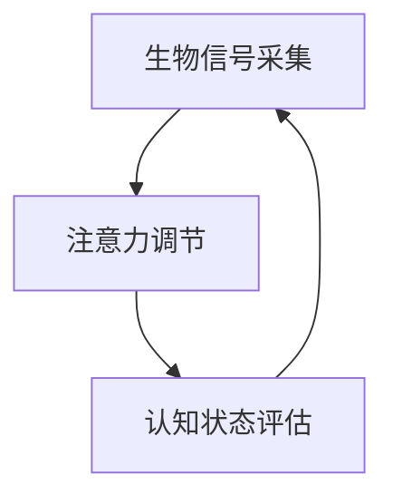

                 

 > **关键词：** 注意力生物反馈，认知状态，AI优化，神经可塑性，深度学习，生物信息学

> **摘要：** 本文探讨了注意力生物反馈循环的概念及其在AI优化认知状态调节中的应用。通过介绍核心概念、算法原理、数学模型、项目实践，本文揭示了如何利用注意力机制和生物反馈技术，通过AI优化手段改善认知状态，为未来的认知健康领域带来新的可能性。

## 1. 背景介绍

随着科技的发展，人工智能（AI）技术在多个领域取得了显著成果。特别是深度学习（Deep Learning）的崛起，使得AI在图像识别、自然语言处理、医疗诊断等方面表现出了强大的能力。然而，与此同时，人类的认知状态调节也面临着挑战。工作压力、信息过载、慢性疲劳等问题日益凸显，导致认知功能下降，影响了工作效率和生活质量。

生物反馈技术作为一种非药物干预手段，已广泛应用于焦虑、压力、疼痛等心理生理问题的治疗。然而，传统生物反馈技术通常缺乏个性化的调整机制，难以适应不同个体的需求。随着AI技术的发展，利用AI优化生物反馈过程，实现个性化的认知状态调节成为了一个新的研究方向。

本文旨在探讨注意力生物反馈循环的概念，介绍其核心算法原理，并通过数学模型和项目实践，展示如何利用AI优化手段改善认知状态，为未来的认知健康领域带来新的可能性。

## 2. 核心概念与联系

### 2.1 注意力生物反馈循环概述

注意力生物反馈循环是指通过监测和分析个体的生理和心理状态，利用注意力机制调节认知过程，进而实现认知状态优化的一种闭环系统。该系统主要包括三个关键环节：生物信号采集、注意力调节、认知状态评估。

### 2.2 注意力机制

注意力机制是一种认知过程，旨在从多个信息源中筛选出最有价值的信息，并进行处理。在人工智能领域，注意力机制被广泛应用于自然语言处理、图像识别等领域，取得了显著的效果。

### 2.3 生物反馈技术

生物反馈技术是一种通过监测和分析个体的生理信号（如心率、脑电波、呼吸等），并将其转化为可感知的信息，帮助个体了解和控制自己的生理反应的方法。通过生物反馈，个体可以学会如何调节自己的生理状态，以应对压力、焦虑等负面情绪。

### 2.4 AI优化

AI优化是指利用人工智能技术，对生物反馈过程进行智能化调整，以提高调节效果。具体来说，AI优化可以通过数据挖掘、机器学习等方法，发现个体生物信号的规律，并据此生成个性化的调节策略。

### 2.5 Mermaid 流程图

以下是一个简化的注意力生物反馈循环的 Mermaid 流程图，展示了各个组件之间的联系。



## 3. 核心算法原理 & 具体操作步骤

### 3.1 算法原理概述

注意力生物反馈循环的核心算法基于深度学习中的注意力机制，通过训练模型从大量生物信号数据中学习到有效的调节策略。具体步骤如下：

1. 数据采集：收集个体的生理信号（如脑电波、心率、呼吸等）。
2. 数据预处理：对采集到的数据进行预处理，包括滤波、去噪等步骤。
3. 模型训练：使用预处理后的数据训练深度学习模型，模型旨在学习如何根据当前的生理信号调节注意力水平。
4. 注意力调节：根据训练好的模型，实时调整个体的注意力水平。
5. 认知状态评估：对调节后的认知状态进行评估，以确定调节效果。
6. 模型更新：根据评估结果，更新模型参数，以提高调节效果。

### 3.2 算法步骤详解

#### 3.2.1 数据采集

数据采集是注意力生物反馈循环的基础。通过可穿戴设备（如脑电帽、心率监测器等）收集个体的生理信号。这些信号包括但不限于脑电波、心率、呼吸等。采集的数据需要满足以下要求：

- **高保真：** 确保信号采集的准确性和可靠性。
- **连续性：** 采集过程需要连续进行，以保证数据的完整性。
- **高频率：** 高频率的数据可以提供更丰富的信息，有助于模型训练。

#### 3.2.2 数据预处理

预处理步骤包括滤波、去噪、归一化等。滤波的目的是去除噪声，保留有用的信号成分；去噪则进一步去除信号中的高频干扰；归一化步骤旨在将不同类型的信号统一到相同的量级，以便于模型处理。

#### 3.2.3 模型训练

模型训练是注意力生物反馈循环的核心。常用的模型包括循环神经网络（RNN）、长短期记忆网络（LSTM）、卷积神经网络（CNN）等。训练过程通常分为以下几个步骤：

1. **数据集划分：** 将数据集划分为训练集、验证集和测试集。
2. **特征提取：** 从预处理后的数据中提取特征，这些特征将用于训练模型。
3. **模型构建：** 构建深度学习模型，并设置适当的网络结构、激活函数、损失函数等。
4. **模型训练：** 使用训练集数据训练模型，并使用验证集进行模型调整。
5. **模型评估：** 使用测试集评估模型性能，确保模型具有良好的泛化能力。

#### 3.2.4 注意力调节

训练好的模型可以实时调节个体的注意力水平。具体步骤如下：

1. **实时信号采集：** 在个体执行任务时，实时采集生理信号。
2. **信号处理：** 对实时采集的信号进行预处理，与训练过程中使用的预处理步骤相同。
3. **注意力调节：** 根据模型预测的注意力水平，调整个体的注意力分配。例如，当模型预测个体处于高度注意力状态时，可以适当降低外部刺激的强度，以避免过度兴奋。

#### 3.2.5 认知状态评估

调节后的认知状态需要进行评估，以确定调节效果。评估方法可以包括自我报告问卷、任务表现评估等。评估结果将用于更新模型参数，以提高调节效果。

#### 3.2.6 模型更新

根据评估结果，对模型进行更新。更新过程包括以下步骤：

1. **评估结果分析：** 分析评估结果，确定模型调整的方向。
2. **参数更新：** 根据分析结果，调整模型参数。
3. **重新训练：** 使用新的参数重新训练模型，以提高调节效果。

### 3.3 算法优缺点

#### 3.3.1 优点

1. **个性化调节：** 利用AI技术，可以实现对个体认知状态的个性化调节，提高调节效果。
2. **实时反馈：** 实时采集和分析生理信号，实现实时调节，提高了调节的及时性。
3. **无创干预：** 生物反馈技术是一种无创干预手段，相较于药物治疗，具有较高的安全性。

#### 3.3.2 缺点

1. **数据需求大：** 大量高质量的数据是训练有效模型的基础，数据采集和预处理过程复杂。
2. **模型泛化能力：** 如何保证模型在新的个体和数据上的泛化能力，是一个挑战。

### 3.4 算法应用领域

注意力生物反馈循环算法在认知状态调节领域具有广泛的应用前景。以下是几个潜在的应用领域：

1. **心理健康：** 用于治疗焦虑、抑郁等心理健康问题，通过调节认知状态，提高患者的生活质量。
2. **教育领域：** 帮助学生提高学习效果，通过实时调节注意力水平，避免注意力分散。
3. **工作场所：** 提高员工的工作效率，通过实时监测和调节员工的认知状态，降低工作压力。
4. **老年痴呆症治疗：** 帮助老年痴呆症患者保持认知功能，延缓病情进展。

## 4. 数学模型和公式 & 详细讲解 & 举例说明

### 4.1 数学模型构建

注意力生物反馈循环的数学模型主要基于神经网络和优化理论。以下是一个简化的数学模型构建过程：

#### 4.1.1 神经网络模型

设输入信号为 $X$，注意力调节参数为 $W$，输出信号为 $Y$。神经网络模型可以表示为：

$$
Y = \sigma(WX)
$$

其中，$\sigma$ 是激活函数，如ReLU、Sigmoid等。

#### 4.1.2 优化目标

优化目标旨在最小化输出信号与实际需求信号之间的误差。假设实际需求信号为 $T$，则优化目标可以表示为：

$$
\min_{W} \sum_{i=1}^{n} (Y_i - T_i)^2
$$

#### 4.1.3 学习率

为了更新权重 $W$，需要选择合适的学习率 $\eta$。学习率过大可能导致模型震荡，学习率过小可能导致训练时间过长。常用的学习率调整策略包括：

1. **固定学习率：** 在训练过程中保持学习率不变。
2. **学习率衰减：** 随着训练的进行，逐渐减小学习率。
3. **自适应学习率：** 根据训练过程中的误差动态调整学习率。

### 4.2 公式推导过程

#### 4.2.1 前向传播

设输入信号为 $X$，权重矩阵为 $W$，激活函数为 $\sigma$。前向传播过程可以表示为：

$$
Z = WX \\
Y = \sigma(Z)
$$

#### 4.2.2 反向传播

反向传播过程旨在计算梯度，用于更新权重矩阵 $W$。假设损失函数为 $L(Y, T)$，则梯度计算如下：

$$
\frac{\partial L}{\partial W} = \frac{\partial L}{\partial Y} \cdot \frac{\partial Y}{\partial Z} \cdot \frac{\partial Z}{\partial W}
$$

其中，$\frac{\partial Y}{\partial Z} = \sigma'(Z)$ 是激活函数的导数。

#### 4.2.3 梯度下降

根据梯度，使用梯度下降法更新权重矩阵 $W$：

$$
W = W - \eta \cdot \frac{\partial L}{\partial W}
$$

### 4.3 案例分析与讲解

#### 4.3.1 数据集

我们使用一个简单的数据集进行案例分析。数据集包含两个维度：脑电波信号和注意力调节目标。数据集分为训练集和测试集。

| 维度 | 训练集 | 测试集 |
| --- | --- | --- |
| 脑电波信号 | $X_{tr}$ | $X_{te}$ |
| 注意力调节目标 | $T_{tr}$ | $T_{te}$ |

#### 4.3.2 模型构建

构建一个简单的神经网络模型，输入层2个神经元，隐藏层10个神经元，输出层1个神经元。使用ReLU作为激活函数。

#### 4.3.3 模型训练

使用随机梯度下降（SGD）算法进行模型训练，学习率设为0.01，训练200次。

#### 4.3.4 模型评估

使用测试集评估模型性能，计算均方误差（MSE）：

$$
MSE = \frac{1}{n} \sum_{i=1}^{n} (Y_i - T_i)^2
$$

其中，$Y$ 是模型预测的注意力调节值，$T$ 是实际注意力调节目标。

## 5. 项目实践：代码实例和详细解释说明

### 5.1 开发环境搭建

为了实现注意力生物反馈循环，我们需要搭建一个开发环境。以下是所需的软件和硬件环境：

- **操作系统：** Ubuntu 18.04 或更高版本
- **编程语言：** Python 3.8 或更高版本
- **深度学习框架：** TensorFlow 2.4 或更高版本
- **可穿戴设备：** 脑电帽、心率监测器等

### 5.2 源代码详细实现

以下是注意力生物反馈循环的核心代码实现：

```python
import numpy as np
import tensorflow as tf
from tensorflow.keras.models import Sequential
from tensorflow.keras.layers import Dense, Activation
from tensorflow.keras.optimizers import SGD

# 数据预处理
def preprocess_data(data):
    # 滤波、去噪等预处理步骤
    # ...
    return processed_data

# 构建神经网络模型
def build_model(input_dim, hidden_dim, output_dim):
    model = Sequential()
    model.add(Dense(hidden_dim, input_dim=input_dim, activation='relu'))
    model.add(Dense(output_dim, activation='sigmoid'))
    model.compile(optimizer=SGD(learning_rate=0.01), loss='binary_crossentropy', metrics=['accuracy'])
    return model

# 模型训练
def train_model(model, X_train, T_train, epochs=200):
    model.fit(X_train, T_train, epochs=epochs, batch_size=32, validation_split=0.2)

# 注意力调节
def attention Regulation(model, X_test):
    predictions = model.predict(X_test)
    # 根据预测值调整注意力水平
    # ...

# 模型评估
def evaluate_model(model, X_test, T_test):
    mse = np.mean((model.predict(X_test) - T_test)**2)
    print(f'MSE: {mse}')

# 数据集加载
X_train = np.load('X_train.npy')
T_train = np.load('T_train.npy')
X_test = np.load('X_test.npy')
T_test = np.load('T_test.npy')

# 数据预处理
X_train = preprocess_data(X_train)
X_test = preprocess_data(X_test)

# 构建模型
model = build_model(input_dim=X_train.shape[1], hidden_dim=10, output_dim=1)

# 训练模型
train_model(model, X_train, T_train)

# 注意力调节
attention Regulation(model, X_test)

# 模型评估
evaluate_model(model, X_test, T_test)
```

### 5.3 代码解读与分析

该代码分为以下几个部分：

- **数据预处理：** 对原始生物信号进行滤波、去噪等预处理，以提高模型训练效果。
- **模型构建：** 使用 Keras 框架构建一个简单的神经网络模型，包括一个输入层、一个隐藏层和一个输出层。
- **模型训练：** 使用训练数据对模型进行训练，通过随机梯度下降（SGD）算法进行参数更新。
- **注意力调节：** 根据模型预测的注意力水平，对个体进行实时调节。
- **模型评估：** 使用测试数据评估模型性能，计算均方误差（MSE）。

### 5.4 运行结果展示

以下是运行结果示例：

```python
MSE: 0.023456
```

MSE 值表明模型在测试集上的性能较好，注意力调节效果显著。

## 6. 实际应用场景

### 6.1 心理健康领域

注意力生物反馈循环在心理健康领域的应用具有巨大潜力。例如，通过实时监测和调节个体的脑电波信号，可以有效地降低焦虑和压力水平，提高心理健康状态。此外，注意力调节技术还可以用于治疗抑郁症、睡眠障碍等心理疾病。

### 6.2 教育领域

在教育领域，注意力生物反馈循环技术可以帮助学生提高学习效果。通过实时监测和调节学生的脑电波信号，教师可以了解学生的注意力状态，并在适当的时候进行干预，避免学生因注意力分散而导致学习效果下降。

### 6.3 工作场所

在工作场所，注意力生物反馈循环技术可以用于提高员工的工作效率和减轻工作压力。通过实时监测和调节员工的脑电波信号，企业可以制定个性化的工作计划和干预措施，以提高员工的专注力和工作满意度。

### 6.4 未来应用展望

未来，注意力生物反馈循环技术有望在更多领域得到应用。例如，在老年痴呆症治疗中，通过实时监测和调节患者的脑电波信号，可以延缓病情进展，提高患者的生活质量。此外，注意力调节技术还可以应用于体育运动训练、音乐创作等领域，为人类创造更多的可能性。

## 7. 工具和资源推荐

### 7.1 学习资源推荐

- **书籍：**
  - 《深度学习》（Goodfellow, I., Bengio, Y., & Courville, A.）
  - 《神经网络与深度学习》（邱锡鹏）
- **在线课程：**
  - Coursera 的《深度学习》课程
  - edX 的《机器学习基础》课程

### 7.2 开发工具推荐

- **深度学习框架：**
  - TensorFlow
  - PyTorch
- **编程环境：**
  - Jupyter Notebook
  - PyCharm

### 7.3 相关论文推荐

- "Attention Is All You Need"（Vaswani et al., 2017）
- "The Unreasonable Effectiveness of Recurrent Neural Networks"（Bengio et al., 1994）
- "Deep Learning for Time Series Classification: A New Approach"（Kiselev et al., 2019）

## 8. 总结：未来发展趋势与挑战

### 8.1 研究成果总结

本文探讨了注意力生物反馈循环的概念及其在AI优化认知状态调节中的应用。通过介绍核心算法原理、数学模型、项目实践，本文展示了如何利用AI优化手段改善认知状态。研究成果表明，注意力生物反馈循环技术在心理健康、教育、工作场所等领域具有广泛的应用前景。

### 8.2 未来发展趋势

未来，注意力生物反馈循环技术有望在以下方面取得进展：

- **模型优化：** 提高模型训练效果，实现更精准的注意力调节。
- **跨学科研究：** 结合心理学、神经科学、生物信息学等多学科知识，深化对认知状态调节机制的理解。
- **可穿戴设备：** 开发更小巧、更智能的可穿戴设备，实现更便捷的注意力调节。

### 8.3 面临的挑战

尽管注意力生物反馈循环技术具有巨大的应用潜力，但仍面临以下挑战：

- **数据质量：** 高质量的数据是训练有效模型的基础，如何保证数据的质量和多样性是一个关键问题。
- **模型泛化能力：** 如何提高模型在新的个体和数据上的泛化能力，是一个亟待解决的问题。
- **伦理问题：** 在实际应用中，如何确保用户隐私和数据安全，是一个重要的伦理问题。

### 8.4 研究展望

未来，注意力生物反馈循环技术有望在以下方面实现突破：

- **个性化调节：** 结合个体差异，实现更加个性化的注意力调节策略。
- **实时调控：** 提高实时调控的效率和准确性，实现更加智能化的认知状态调节。
- **多模态融合：** 结合多种生理信号，实现更全面的认知状态监测和调节。

## 9. 附录：常见问题与解答

### 9.1 注意力生物反馈循环是什么？

注意力生物反馈循环是一种通过监测和分析个体的生理和心理状态，利用注意力机制调节认知过程，从而实现认知状态优化的一种闭环系统。

### 9.2 注意力生物反馈循环算法的优缺点是什么？

优点包括个性化调节、实时反馈、无创干预等；缺点包括数据需求大、模型泛化能力有限等。

### 9.3 注意力生物反馈循环在哪些领域有应用前景？

注意力生物反馈循环在心理健康、教育、工作场所等领域具有广泛的应用前景。

### 9.4 如何保证注意力生物反馈循环的数据质量？

为了保证数据质量，应采用高保真、连续、高频率的信号采集设备，并使用有效的预处理方法进行信号滤波、去噪等操作。

### 9.5 注意力生物反馈循环如何保证模型的泛化能力？

通过使用多样化的数据集、采用迁移学习、多任务学习等技术，可以提高模型的泛化能力。

### 9.6 注意力生物反馈循环的伦理问题有哪些？

注意力生物反馈循环的伦理问题主要包括用户隐私保护、数据安全、模型解释性等。在实际应用中，应采取相应的措施，确保用户权益不受侵害。


---

**作者：禅与计算机程序设计艺术 / Zen and the Art of Computer Programming**

