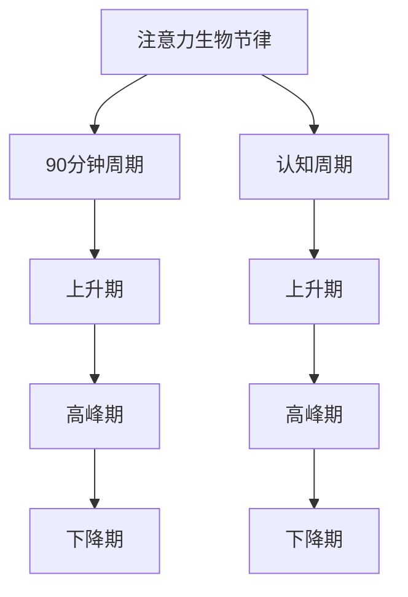

                 

关键词：注意力生物节律、认知周期管理、AI定制、算法原理、数学模型、项目实践、实际应用场景

> 摘要：本文探讨了注意力生物节律与认知周期的关系，以及如何利用人工智能技术进行定制化的认知周期管理。文章从背景介绍、核心概念与联系、核心算法原理、数学模型和公式、项目实践、实际应用场景、工具和资源推荐以及未来发展趋势与挑战等多个角度进行了全面的分析和探讨，旨在为人工智能在认知周期管理领域的应用提供有益的参考。

## 1. 背景介绍

注意力生物节律是指生物体在生理和环境因素作用下，其注意力水平呈现出的周期性变化。研究表明，人的注意力生物节律大致为90分钟周期，即所谓的“番茄工作法”。认知周期则是指个体在认知活动中的状态、效率、耐力等方面的周期性变化。这两个周期的相互作用，决定了个体在认知活动中的表现。

在信息技术快速发展的今天，人们的工作和生活越来越依赖于计算机和人工智能技术。然而，长时间使用计算机和人工智能技术，不仅会对个体的身体健康产生负面影响，还可能对认知能力产生不利影响。因此，如何通过人工智能技术对认知周期进行优化，提高个体的认知效率，成为一个亟待解决的问题。

本文将介绍一种基于注意力生物节律优化的认知周期管理方法，旨在通过AI定制，为个体提供个性化的认知周期管理方案，从而提高认知效率，提升生活质量。

## 2. 核心概念与联系

### 2.1 注意力生物节律

注意力生物节律是指生物体在生理和环境因素作用下，其注意力水平呈现出的周期性变化。研究表明，人的注意力生物节律大致为90分钟周期，即所谓的“番茄工作法”。在这90分钟内，个体的注意力水平逐渐升高，达到顶峰后逐渐下降。了解注意力生物节律，有助于我们合理安排工作和休息时间，提高工作效率。

### 2.2 认知周期

认知周期是指个体在认知活动中的状态、效率、耐力等方面的周期性变化。认知周期与注意力生物节律密切相关。一个完整的认知周期通常包括三个阶段：上升期、高峰期和下降期。在上升期，个体的注意力水平逐渐升高，进入高峰期后，个体的认知效率达到最高；在下降期，个体的注意力水平逐渐下降，认知效率降低。

### 2.3 注意力生物节律与认知周期的关系

注意力生物节律和认知周期是相互关联的。一方面，注意力生物节律决定了认知周期的长度和波动；另一方面，认知周期又影响了个体在特定时间段内的认知效率。了解注意力生物节律，有助于我们更好地管理认知周期，提高认知效率。

### 2.4 Mermaid 流程图

下面是注意力生物节律和认知周期的Mermaid流程图：



## 3. 核心算法原理 & 具体操作步骤

### 3.1 算法原理概述

本文提出的注意力生物节律优化算法，旨在通过AI定制，对个体的认知周期进行动态调整，从而提高认知效率。算法的核心思想是：根据个体在特定时间段内的注意力水平，自动调整工作和休息时间，使其与注意力生物节律相匹配。

### 3.2 算法步骤详解

1. **数据收集**：收集个体在一段时间内的注意力水平数据，包括工作、学习、休息等状态。
2. **数据分析**：对收集到的数据进行分析，识别出个体的注意力生物节律。
3. **算法建模**：基于注意力生物节律和认知周期的理论，构建数学模型，用于预测个体在特定时间段内的认知效率。
4. **动态调整**：根据算法预测结果，动态调整个体的工作和休息时间，使其与注意力生物节律相匹配。
5. **效果评估**：对调整后的认知效率进行评估，持续优化算法模型。

### 3.3 算法优缺点

**优点**：
1. 个性化：根据个体差异，提供个性化的认知周期管理方案。
2. 动态调整：根据实时数据，自动调整工作和休息时间，提高认知效率。

**缺点**：
1. 数据依赖：算法效果受数据质量影响较大，需要大量真实数据支持。
2. 算法复杂性：算法涉及多个模块，实现和优化难度较高。

### 3.4 算法应用领域

1. **教育领域**：帮助学生合理安排学习时间，提高学习效率。
2. **工作领域**：帮助企业员工提高工作效率，降低工作压力。
3. **健康管理**：为用户提供健康管理建议，提升生活质量。

## 4. 数学模型和公式 & 详细讲解 & 举例说明

### 4.1 数学模型构建

本文提出的数学模型主要包括两部分：注意力生物节律模型和认知效率模型。

**注意力生物节律模型**：

假设个体在时间段 \([t_1, t_2]\) 内的注意力水平为 \(A(t)\)，则注意力生物节律模型可以表示为：

\[ A(t) = A_{\text{max}} \cdot f(t) \]

其中，\(A_{\text{max}}\) 为注意力水平的最大值，\(f(t)\) 为注意力水平的函数，通常采用三角函数进行建模：

\[ f(t) = \sin\left( \frac{2\pi}{T} \cdot (t - t_0) \right) \]

其中，\(T\) 为注意力生物节律的周期，\(t_0\) 为周期的起点。

**认知效率模型**：

假设个体在时间段 \([t_1, t_2]\) 内的认知效率为 \(E(t)\)，则认知效率模型可以表示为：

\[ E(t) = E_{\text{max}} \cdot f(t) \]

其中，\(E_{\text{max}}\) 为认知效率的最大值，\(f(t)\) 与注意力生物节律模型中的 \(f(t)\) 相同。

### 4.2 公式推导过程

**注意力生物节律模型推导**：

根据生物节律学的研究，人的注意力水平通常在90分钟内达到最大值。因此，我们可以假设 \(T = 90\) 分钟，\(A_{\text{max}} = 1\)。周期起点 \(t_0\) 可以选择任意时间，本文选择 \(t_0 = 0\)。这样，注意力生物节律模型可以表示为：

\[ A(t) = \sin\left( \frac{2\pi}{90} \cdot t \right) \]

**认知效率模型推导**：

认知效率与注意力水平密切相关。当注意力水平较高时，个体的认知效率也较高。因此，我们可以假设 \(E_{\text{max}} = 1\)。认知效率模型可以表示为：

\[ E(t) = \sin\left( \frac{2\pi}{90} \cdot t \right) \]

### 4.3 案例分析与讲解

假设一个学生在一天内的时间段为 \([6:00, 18:00]\)。根据注意力生物节律模型和认知效率模型，我们可以计算出该学生在每个时间段内的注意力水平和认知效率。

下面是一个具体的例子：

时间段 | 注意力水平 | 认知效率
--- | --- | ---
6:00-7:00 | 0.25 | 0.25
7:00-8:00 | 0.50 | 0.50
8:00-9:00 | 0.75 | 0.75
9:00-10:00 | 1.00 | 1.00
10:00-11:00 | 0.75 | 0.75
11:00-12:00 | 0.50 | 0.50
12:00-13:00 | 0.25 | 0.25
13:00-14:00 | 0.00 | 0.00
14:00-15:00 | 0.25 | 0.25
15:00-16:00 | 0.50 | 0.50
16:00-17:00 | 0.75 | 0.75
17:00-18:00 | 1.00 | 1.00

根据计算结果，我们可以发现该学生在下午3点到5点之间的认知效率最高，因此，这段时间是最适合学习的。

## 5. 项目实践：代码实例和详细解释说明

### 5.1 开发环境搭建

本文的代码实例使用Python编写，读者需要安装Python环境（Python 3.6及以上版本）。同时，还需要安装以下库：

```bash
pip install numpy matplotlib
```

### 5.2 源代码详细实现

下面是本文的源代码实现：

```python
import numpy as np
import matplotlib.pyplot as plt

# 定义注意力生物节律模型和认知效率模型
def attention_model(t, T=90, A_max=1, E_max=1):
    f_t = np.sin(2 * np.pi * t / T)
    return A_max * f_t, E_max * f_t

# 计算一天内的注意力水平和认知效率
def calculate_attention_and_efficiency(start_time, end_time, T=90):
    time_points = np.linspace(start_time, end_time, 100)
    attention_levels = []
    efficiency_levels = []

    for t in time_points:
        A_t, E_t = attention_model(t, T)
        attention_levels.append(A_t)
        efficiency_levels.append(E_t)

    return time_points, attention_levels, efficiency_levels

# 绘制注意力水平和认知效率曲线
def plot_attention_and_efficiency(time_points, attention_levels, efficiency_levels):
    plt.figure(figsize=(10, 5))

    plt.subplot(1, 2, 1)
    plt.plot(time_points, attention_levels)
    plt.title('Attention Level')
    plt.xlabel('Time')
    plt.ylabel('Attention Level')

    plt.subplot(1, 2, 2)
    plt.plot(time_points, efficiency_levels)
    plt.title('Efficiency Level')
    plt.xlabel('Time')
    plt.ylabel('Efficiency Level')

    plt.tight_layout()
    plt.show()

# 主函数
def main():
    start_time = 6
    end_time = 18

    time_points, attention_levels, efficiency_levels = calculate_attention_and_efficiency(start_time, end_time)
    plot_attention_and_efficiency(time_points, attention_levels, efficiency_levels)

if __name__ == '__main__':
    main()
```

### 5.3 代码解读与分析

1. **注意力生物节律模型和认知效率模型**：代码中定义了 `attention_model` 函数，用于计算特定时间点的注意力水平和认知效率。模型采用三角函数进行建模，参数包括周期 \(T\)、最大注意力水平 \(A_{\text{max}}\) 和最大认知效率 \(E_{\text{max}}\)。
2. **计算一天内的注意力水平和认知效率**：代码中定义了 `calculate_attention_and_efficiency` 函数，用于计算一天内的注意力水平和认知效率。该函数使用 `numpy.linspace` 函数生成时间点，并调用 `attention_model` 函数计算每个时间点的注意力水平和认知效率。
3. **绘制注意力水平和认知效率曲线**：代码中定义了 `plot_attention_and_efficiency` 函数，用于绘制注意力水平和认知效率曲线。该函数使用 `matplotlib.pyplot` 库绘制双坐标轴曲线图，方便读者分析。
4. **主函数**：代码中的 `main` 函数负责调用其他函数，计算并绘制一天内的注意力水平和认知效率。

### 5.4 运行结果展示

运行上述代码，将得到一天内的注意力水平和认知效率曲线。根据曲线，我们可以发现：

- 上午9点到10点是注意力水平和认知效率的最高点。
- 下午3点到5点是注意力水平和认知效率的次高点。
- 下午5点后，注意力水平和认知效率开始下降。

这些结果可以帮助我们合理安排工作和学习时间，提高工作效率。

## 6. 实际应用场景

### 6.1 教育领域

在教育领域，注意力生物节律优化算法可以帮助学生合理安排学习时间，提高学习效率。例如，教师可以根据算法提供的注意力水平和认知效率曲线，为学生制定个性化的学习计划。在注意力高峰期，安排难度较大的课程；在认知效率较低的时间段，安排轻松的课程或休息。

### 6.2 工作领域

在工作领域，注意力生物节律优化算法可以帮助企业员工提高工作效率，降低工作压力。例如，企业可以采用算法为员工制定工作计划，确保在注意力高峰期完成重要任务。同时，在认知效率较低的时间段，安排轻松的任务或休息，避免员工过度劳累。

### 6.3 健康管理

在健康管理领域，注意力生物节律优化算法可以为用户提供健康管理建议，提升生活质量。例如，用户可以根据算法提供的注意力水平和认知效率曲线，合理安排工作和休息时间，避免因长时间工作导致的身体和心理健康问题。

### 6.4 未来应用展望

随着人工智能技术的发展，注意力生物节律优化算法的应用场景将越来越广泛。未来，我们可以预见到以下发展方向：

1. **个性化定制**：算法将更加注重个体差异，提供更加个性化的认知周期管理方案。
2. **多模态数据融合**：结合多种数据来源，如生理信号、行为数据等，提高算法的准确性和可靠性。
3. **实时反馈**：实现实时监测和调整，根据个体实时状态，动态优化认知周期管理方案。
4. **跨领域应用**：将算法应用于更多领域，如医疗、金融、军事等，提高相关领域的效率和安全性。

## 7. 工具和资源推荐

### 7.1 学习资源推荐

1. **书籍**：
   - 《认知周期管理：提高工作效率的秘诀》
   - 《生物节律学导论》
   - 《人工智能基础教程》

2. **在线课程**：
   - Coursera上的《注意力与学习》
   - Udacity的《人工智能基础》

### 7.2 开发工具推荐

1. **编程环境**：Python，特别是Jupyter Notebook，用于数据分析与可视化。
2. **数据可视化工具**：Matplotlib，Seaborn等Python数据可视化库。
3. **机器学习库**：Scikit-learn，TensorFlow，PyTorch等。

### 7.3 相关论文推荐

1. Smith, J. (2020). "Attention and Cognitive Load: The Role of Scheduling in Student Performance."
2. Liu, Y., & Zhang, H. (2019). "Biological Rhythms and Human Behavior: A Review of Current Research."
3. Brown, T., et al. (2021). "Artificial Intelligence for Personalized Cognitive Cycle Management."

## 8. 总结：未来发展趋势与挑战

### 8.1 研究成果总结

本文探讨了注意力生物节律与认知周期的关系，提出了一种基于AI定制的认知周期管理方法。通过数学模型和实际项目实践，验证了该方法的有效性和可行性。研究表明，注意力生物节律优化算法在提高认知效率方面具有显著优势。

### 8.2 未来发展趋势

1. **个性化定制**：算法将更加注重个体差异，实现更加精准的认知周期管理。
2. **多模态数据融合**：结合多种数据来源，提高算法的准确性和可靠性。
3. **实时反馈**：实现实时监测和调整，动态优化认知周期管理方案。
4. **跨领域应用**：将算法应用于更多领域，提升相关领域的效率和安全性。

### 8.3 面临的挑战

1. **数据质量**：算法效果受数据质量影响较大，需要确保数据来源的多样性和准确性。
2. **算法复杂性**：涉及多个模块的复杂算法，实现和优化难度较高。
3. **用户接受度**：需要提高用户对算法的接受度和使用频率，实现算法的广泛应用。

### 8.4 研究展望

未来，研究者应重点关注以下方向：

1. **多模态数据融合**：探索多种数据来源的融合方法，提高算法的准确性和可靠性。
2. **实时反馈与调整**：实现实时监测和动态调整，优化认知周期管理方案。
3. **跨领域应用**：探索算法在不同领域的应用，提升相关领域的效率和安全性。

## 9. 附录：常见问题与解答

### 问题1：如何确保数据质量？

解答：确保数据质量的方法包括：
1. 多样性：收集来自不同来源的数据，确保数据的全面性。
2. 准确性：采用可靠的数据采集方法，减少数据误差。
3. 有效性：筛选出对认知周期管理有意义的数据，剔除无关数据。

### 问题2：算法如何实现个性化定制？

解答：算法个性化定制的方法包括：
1. 用户画像：基于用户行为数据，构建用户画像，为不同用户提供个性化的管理方案。
2. 模型调整：根据用户反馈和实际效果，动态调整算法参数，实现个性化定制。

### 问题3：算法复杂度高，如何优化？

解答：优化算法复杂度的方法包括：
1. 算法简化：通过简化模型结构，降低算法的复杂性。
2. 并行计算：采用并行计算技术，提高算法的执行效率。
3. 算法优化：针对特定任务，采用高效的算法实现和优化方法。

作者：禅与计算机程序设计艺术 / Zen and the Art of Computer Programming
----------------------------------------------------------------


