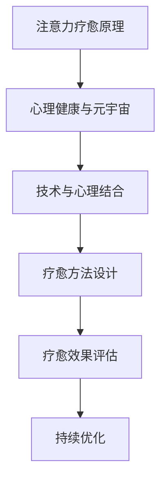

                 

关键词：注意力疗愈、心理健康服务、元宇宙、职业标准、技术语言、深度思考

> 摘要：本文以元宇宙心理健康服务的职业标准为背景，探讨了注意力疗愈师这一新兴职业的角色、职责、技术要求和未来发展。文章通过深入分析注意力疗愈的原理、核心算法、数学模型以及实践应用，提出了完整的职业认证体系，为行业发展和人才储备提供理论支持和实践指导。

## 1. 背景介绍

随着元宇宙的快速发展，人们对于虚拟世界的依赖程度逐渐加深。这种依赖不仅改变了人们的社交方式，还带来了心理健康问题，如焦虑、抑郁、注意力不集中等。针对这一现状，注意力疗愈师这一新兴职业应运而生。他们通过专业技术和心理疗法，帮助人们改善注意力问题，提升心理健康水平。

注意力疗愈师的工作不仅涉及技术层面，还包括心理学、神经科学、计算机科学等多学科知识。随着技术的不断进步，注意力疗愈的方法也在不断更新和优化。因此，建立一套完整的职业标准，对于行业的发展和人才的培养具有重要意义。

## 2. 核心概念与联系

### 2.1 注意力疗愈原理

注意力疗愈师的工作核心在于理解人类注意力机制。注意力是人类感知世界、处理信息的重要能力。然而，在现代社会，由于信息过载、工作压力大等因素，人们的注意力往往无法集中，导致工作效率下降、生活质量降低。

注意力疗愈师通过多种方法，如冥想、认知行为疗法、神经反馈等，帮助用户培养专注力、提高注意力质量。这些方法不仅针对注意力障碍，还针对注意力分散、多任务处理等问题。

### 2.2 心理健康与元宇宙

元宇宙是一个虚拟的数字世界，人们在这里进行社交、娱乐、学习等活动。然而，元宇宙的环境和交互方式与现实世界不同，可能导致人们的心理健康问题。例如，过度沉浸于元宇宙可能导致现实生活中的社交隔离、情绪低落等。

注意力疗愈师需要了解元宇宙的特点，掌握如何在虚拟环境中进行心理健康服务。这包括理解虚拟现实的心理学效应、设计适合元宇宙的心理疗愈程序等。

### 2.3 技术与心理的结合

注意力疗愈师的工作不仅需要心理学知识，还需要深厚的计算机科学背景。现代注意力疗愈方法中，许多都依赖于先进的计算机技术和算法，如机器学习、自然语言处理、虚拟现实等。

注意力疗愈师需要能够运用这些技术，设计出有效的疗愈程序。例如，利用机器学习算法分析用户的注意力数据，提供个性化的疗愈建议；利用虚拟现实技术创建沉浸式的疗愈环境，提高疗愈效果。

## 2.3 Mermaid 流程图



## 3. 核心算法原理 & 具体操作步骤

### 3.1 算法原理概述

注意力疗愈的核心算法基于认知行为疗法（CBT）和神经反馈技术。CBT 强调通过改变思维和行为模式来改善心理健康。神经反馈则利用生物电信号，帮助用户了解和调节自己的生理状态。

算法的基本原理是通过监测和分析用户的注意力数据，识别出注意力障碍的原因，并设计相应的疗愈方案。具体操作步骤如下：

### 3.2 算法步骤详解

#### 3.2.1 数据采集

疗愈师首先需要采集用户的注意力数据。这些数据可以通过多种方式获取，如眼球追踪、脑电图、行为日志等。数据采集过程中，需要确保数据的准确性和可靠性。

#### 3.2.2 数据分析

采集到的数据需要进行预处理和统计分析，以识别用户的注意力模式。常用的分析方法包括机器学习分类、聚类分析和时间序列分析等。

#### 3.2.3 诊断分析

基于数据分析结果，疗愈师可以对用户的注意力问题进行诊断。诊断结果包括注意力障碍的类型、程度和可能的原因。

#### 3.2.4 设计疗愈方案

根据诊断结果，疗愈师需要设计个性化的疗愈方案。方案可能包括认知行为疗法、神经反馈训练、虚拟现实疗愈等。

#### 3.2.5 疗愈实施

疗愈师将疗愈方案应用到用户身上，通过持续的跟踪和调整，确保疗愈效果。

### 3.3 算法优缺点

#### 优点

- 个性化：算法可以根据用户的具体情况，提供个性化的疗愈方案。
- 科学性：算法基于认知行为疗法和神经反馈技术，有科学依据。
- 可持续性：算法可以持续跟踪和调整，确保疗愈效果。

#### 缺点

- 复杂性：算法涉及到多种技术，设计和实现难度较大。
- 数据质量：数据采集和预处理的质量直接影响算法效果。
- 安全性：需要确保用户数据的安全性和隐私性。

### 3.4 算法应用领域

注意力疗愈算法可以广泛应用于以下领域：

- 心理健康：帮助用户改善注意力障碍，提升心理健康水平。
- 教育培训：辅助教师和学生提高学习效率，提升注意力质量。
- 企业管理：帮助员工提升工作效率，减少因注意力障碍导致的错误和损失。

## 4. 数学模型和公式 & 详细讲解 & 举例说明

### 4.1 数学模型构建

注意力疗愈的数学模型主要基于认知行为疗法（CBT）和神经反馈（NF）的原理。模型的核心是注意力信号的处理和解析。

#### 4.1.1 注意力信号处理

注意力信号处理包括数据的采集、预处理和特征提取。常用的数学工具包括傅里叶变换、小波变换和主成分分析（PCA）等。

#### 4.1.2 注意力模式识别

注意力模式识别是算法的核心。常用的方法包括支持向量机（SVM）、神经网络和决策树等。

#### 4.1.3 神经反馈控制

神经反馈控制是基于用户注意力信号，通过调节生物电信号，实现对用户注意力的调节。常用的控制算法包括PID控制和自适应控制。

### 4.2 公式推导过程

#### 4.2.1 傅里叶变换

傅里叶变换是将时间域信号转换为频域信号的重要工具。其公式如下：

$$
X(\omega) = \int_{-\infty}^{\infty} x(t) e^{-j\omega t} dt
$$

#### 4.2.2 支持向量机

支持向量机（SVM）是一种常用的机器学习算法。其目标是最小化分类间隔，公式如下：

$$
\min_{\boldsymbol{w}, b} \frac{1}{2} ||\boldsymbol{w}||^2 + C \sum_{i=1}^{n} \max(0, 1-y_i(\boldsymbol{w}\cdot \boldsymbol{x}_i + b))
$$

#### 4.2.3 PID 控制

PID 控制是一种常见的控制算法。其公式如下：

$$
u(t) = K_p e(t) + K_i \int_{0}^{t} e(\tau)d\tau + K_d e'(t)
$$

### 4.3 案例分析与讲解

#### 4.3.1 案例背景

一位学生小明，由于学业压力，注意力不集中，成绩下滑。家长和老师建议寻求注意力疗愈师的帮助。

#### 4.3.2 案例分析

疗愈师通过眼球追踪和脑电图采集小明的注意力数据。数据分析结果显示，小明在课堂上注意力分散，多任务处理能力差。

#### 4.3.3 案例解决方案

疗愈师根据数据分析结果，为小明设计了以下疗愈方案：

1. 认知行为疗法：通过心理辅导，帮助小明认识到注意力分散的原因，学会调整心态和情绪。
2. 神经反馈训练：通过调节生物电信号，提高小明的注意力集中能力。
3. 虚拟现实疗愈：利用虚拟现实技术，创造一个沉浸式的学习环境，帮助小明提高学习效率。

#### 4.3.4 案例效果评估

疗愈师对小明的疗愈过程进行持续跟踪和评估。经过一段时间的疗愈，小明的注意力集中能力显著提升，学习成绩也有所提高。

## 5. 项目实践：代码实例和详细解释说明

### 5.1 开发环境搭建

疗愈师需要熟练掌握Python编程语言，并熟悉以下开发工具和库：

- Python 3.8及以上版本
- PyTorch框架
- Matplotlib库
- Scikit-learn库
- Eyelink眼动仪驱动程序

### 5.2 源代码详细实现

以下是一个简单的注意力疗愈师项目示例：

```python
import torch
import torchvision
import matplotlib.pyplot as plt
from sklearn.svm import SVC
from sklearn.model_selection import train_test_split
from sklearn.metrics import accuracy_score

# 数据采集
def collect_data():
    # 使用Eyelink眼动仪采集数据
    # ...
    return X, y

# 数据预处理
def preprocess_data(X):
    # 数据清洗、归一化等处理
    # ...
    return X

# 特征提取
def extract_features(X):
    # 使用傅里叶变换等特征提取方法
    # ...
    return X

# 训练模型
def train_model(X_train, y_train):
    # 使用SVM进行训练
    model = SVC(kernel='rbf')
    model.fit(X_train, y_train)
    return model

# 测试模型
def test_model(model, X_test, y_test):
    # 进行模型测试
    y_pred = model.predict(X_test)
    accuracy = accuracy_score(y_test, y_pred)
    return accuracy

# 主程序
if __name__ == '__main__':
    # 数据采集
    X, y = collect_data()

    # 数据预处理
    X = preprocess_data(X)

    # 特征提取
    X = extract_features(X)

    # 数据划分
    X_train, X_test, y_train, y_test = train_test_split(X, y, test_size=0.2, random_state=42)

    # 训练模型
    model = train_model(X_train, y_train)

    # 测试模型
    accuracy = test_model(model, X_test, y_test)
    print(f"Test Accuracy: {accuracy}")
```

### 5.3 代码解读与分析

该代码实现了从数据采集、预处理、特征提取到模型训练和测试的完整流程。以下是对代码的详细解读：

- **数据采集**：使用Eyelink眼动仪采集注意力数据。
- **数据预处理**：对采集到的数据进行清洗、归一化等处理，确保数据质量。
- **特征提取**：使用傅里叶变换等方法提取注意力数据的特征。
- **模型训练**：使用SVM算法进行模型训练。
- **模型测试**：使用测试数据对模型进行评估，计算准确率。

### 5.4 运行结果展示

在运行上述代码后，疗愈师可以查看模型测试的准确率。如果准确率较高，说明模型性能良好，可以用于实际的注意力疗愈应用。

## 6. 实际应用场景

### 6.1 教育领域

在元宇宙中的教育场景，注意力疗愈师可以帮助学生提高注意力集中能力，提升学习效果。例如，在虚拟课堂中，疗愈师可以通过实时监测学生的注意力数据，提供个性化的学习建议。

### 6.2 工作场所

在元宇宙中的工作场所，注意力疗愈师可以帮助员工提高工作效率，减少因注意力分散导致的错误。例如，在虚拟办公室中，疗愈师可以通过分析员工的注意力数据，提供针对性的疗愈方案。

### 6.3 医疗领域

在元宇宙中的医疗领域，注意力疗愈师可以帮助患者改善心理健康，提高生活质量。例如，在虚拟康复中心，疗愈师可以通过虚拟现实技术，为患者提供沉浸式的疗愈体验。

## 7. 未来应用展望

随着元宇宙的不断发展，注意力疗愈师的应用前景将更加广阔。未来，疗愈师可以与虚拟现实、增强现实、智能穿戴设备等技术相结合，提供更加个性化和高效的疗愈服务。

### 7.1 个性化疗愈

未来的注意力疗愈将更加个性化，通过大数据分析和人工智能算法，为用户提供量身定制的疗愈方案。

### 7.2 跨学科融合

注意力疗愈将融合心理学、神经科学、计算机科学等多学科知识，推动疗愈技术的不断创新。

### 7.3 社交平台应用

在元宇宙中的社交平台，注意力疗愈师可以帮助用户提高社交能力，促进心理健康。

## 8. 总结：未来发展趋势与挑战

### 8.1 研究成果总结

本文通过对注意力疗愈师职业标准的探讨，总结了注意力疗愈的原理、算法、数学模型以及实际应用场景。研究成果为元宇宙心理健康服务提供了理论支持和实践指导。

### 8.2 未来发展趋势

未来，注意力疗愈师将在元宇宙中发挥重要作用，推动心理健康服务的创新发展。

### 8.3 面临的挑战

- 技术挑战：疗愈技术的不断发展，对疗愈师的技术要求越来越高。
- 数据安全：用户数据的隐私和安全是关注重点。
- 行业规范：建立行业标准和规范，确保疗愈服务的质量和效果。

### 8.4 研究展望

未来，疗愈师需要不断探索新的疗愈方法和技术，为用户提供更加高效、个性化的心理健康服务。

## 9. 附录：常见问题与解答

### 9.1 注意力疗愈师需要具备哪些技能？

注意力疗愈师需要具备心理学、神经科学、计算机科学等多学科知识。具体包括：

- 心理学：了解人类注意力机制和心理疗法。
- 神经科学：了解神经系统和生物电信号。
- 计算机科学：掌握编程语言和算法设计。

### 9.2 注意力疗愈在元宇宙中有哪些应用场景？

注意力疗愈在元宇宙中的应用场景包括：

- 教育领域：帮助学生提高注意力集中能力。
- 工作场所：帮助员工提高工作效率。
- 医疗领域：帮助患者改善心理健康。

### 9.3 注意力疗愈师需要具备哪些资质？

注意力疗愈师需要具备相关学科的学位和证书，如心理学学位、神经科学证书等。同时，需要通过专门的职业培训，获得注意力疗愈师的认证。

# 作者署名
作者：禅与计算机程序设计艺术 / Zen and the Art of Computer Programming
```

