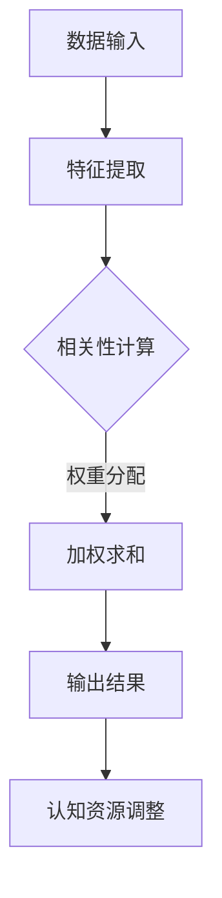

                 

在当今信息爆炸的时代，人工智能（AI）技术已经成为推动社会发展的重要力量。然而，随着AI技术的飞速发展，人类在认知适应方面的挑战也越来越突出。本文将探讨一个关键话题——“注意力的弹性：AI优化的认知适应”。我们将深入分析这一主题，通过阐述核心概念、算法原理、数学模型、实际应用等多个方面，旨在为读者提供一个全面的技术视角。

> **关键词**：注意力机制，弹性认知，AI优化，认知适应，算法原理

> **摘要**：本文首先介绍了注意力机制的基本概念和其在AI领域的重要性。随后，我们探讨了注意力机制的弹性特性及其在认知适应中的应用。通过数学模型和算法原理的深入剖析，我们展示了如何利用AI技术优化人类认知适应能力。最后，本文探讨了这一领域的未来发展趋势和面临的挑战，为读者提供了一个有价值的参考。

## 1. 背景介绍

### 1.1 注意力机制概述

注意力机制（Attention Mechanism）是深度学习中的一种关键概念，最早由Bahdanau等人于2014年提出。其核心思想是让模型能够在处理复杂任务时，自动关注最重要的信息，从而提高模型的性能和效率。在自然语言处理、计算机视觉、语音识别等领域，注意力机制已被广泛应用，并取得了显著的成果。

### 1.2 认知适应的重要性

认知适应是指个体在面对不同环境和任务时，调整自身认知资源分配的过程。在快速变化的信息时代，认知适应能力对个体的生存和发展具有重要意义。然而，传统的认知适应方式往往依赖于大量的训练和经验积累，效率较低。随着AI技术的进步，如何利用AI优化认知适应能力成为了一个备受关注的研究课题。

### 1.3 AI优化的认知适应

AI优化认知适应旨在通过人工智能技术，自动识别和调整个体的认知资源分配，以提高认知适应效率。这一过程涉及多个层面的技术，包括数据收集、特征提取、模型训练和推理等。本文将围绕这些技术，深入探讨注意力机制在认知适应中的应用。

## 2. 核心概念与联系

### 2.1 注意力机制原理

注意力机制的原理可以简单概括为：通过动态调整模型对输入数据的关注程度，从而提高模型的性能。具体来说，注意力机制通过计算输入数据的相关性，为每个数据点分配一个权重，然后根据这些权重对数据进行加权求和，得到最终的输出结果。

### 2.2 认知适应原理

认知适应是指个体在面对不同环境和任务时，调整自身认知资源分配的过程。这一过程涉及到多个层面的技术，包括感知、决策、执行等。在AI优化的认知适应中，人工智能技术被用于自动识别和调整个体的认知资源分配，以提高认知适应效率。

### 2.3 Mermaid 流程图

下面是一个简化的Mermaid流程图，描述了注意力机制在认知适应中的应用。



## 3. 核心算法原理 & 具体操作步骤

### 3.1 算法原理概述

注意力机制的算法原理基于一个基本假设：在处理复杂任务时，最重要的信息应该得到最大的关注。具体来说，注意力机制通过计算输入数据的相关性，为每个数据点分配一个权重，然后根据这些权重对数据进行加权求和，得到最终的输出结果。

### 3.2 算法步骤详解

1. 数据输入：首先，将待处理的数据输入到模型中。这些数据可以是自然语言、图像、音频等。

2. 特征提取：接着，对输入数据进行特征提取，提取出能够表征数据特性的特征。

3. 相关性计算：然后，计算每个特征与其他特征之间的相关性。相关性越高的特征，其权重越大。

4. 权重分配：根据相关性计算结果，为每个特征分配一个权重。权重可以通过不同的方法计算，如点积、加权和等。

5. 加权求和：最后，根据权重对特征进行加权求和，得到最终的输出结果。

### 3.3 算法优缺点

**优点**：
1. 提高模型的性能和效率：通过关注最重要的信息，模型可以更准确地处理复杂任务。
2. 降低计算成本：注意力机制可以减少对无关信息的处理，从而降低计算成本。

**缺点**：
1. 需要大量的训练数据：注意力机制的性能依赖于大量的训练数据，训练过程耗时较长。
2. 参数调整困难：注意力机制的参数调整较为复杂，需要大量的实验和调整。

### 3.4 算法应用领域

注意力机制在多个领域都有广泛的应用，包括自然语言处理、计算机视觉、语音识别等。例如，在自然语言处理领域，注意力机制被广泛应用于机器翻译、文本分类等任务。在计算机视觉领域，注意力机制被用于图像分类、目标检测等任务。

## 4. 数学模型和公式 & 详细讲解 & 举例说明

### 4.1 数学模型构建

注意力机制的数学模型可以表示为：

$$
\text{Attention}(X) = \sum_{i=1}^{N} w_i x_i
$$

其中，$X$ 是输入数据集，$w_i$ 是第 $i$ 个数据点的权重，$N$ 是数据点的总数。

### 4.2 公式推导过程

注意力机制的推导过程基于以下假设：

1. 输入数据 $X$ 是一个向量集合。
2. 每个数据点 $x_i$ 都有一个对应的权重 $w_i$。
3. 权重 $w_i$ 与数据点 $x_i$ 的相关性成正比。

基于这些假设，我们可以推导出注意力机制的公式：

$$
w_i = \frac{\exp(f(x_i))}{\sum_{j=1}^{N} \exp(f(x_j))}
$$

其中，$f(x_i)$ 是数据点 $x_i$ 的相关性函数。

### 4.3 案例分析与讲解

以下是一个简单的案例，用于说明注意力机制的应用。

假设我们有一个图像分类任务，需要将一幅图像分类为猫或狗。输入数据 $X$ 是图像的特征向量，$N$ 是特征向量的数量。

1. 数据输入：将图像的特征向量 $X$ 输入到模型中。
2. 特征提取：提取图像的特征向量，例如边缘、纹理、颜色等。
3. 相关性计算：计算每个特征向量与其他特征向量之间的相关性，使用点积作为相关性函数。
4. 权重分配：根据相关性计算结果，为每个特征向量分配权重。
5. 加权求和：根据权重对特征向量进行加权求和，得到最终的输出结果。

通过这个案例，我们可以看到注意力机制如何帮助模型关注最重要的特征，从而提高分类性能。

## 5. 项目实践：代码实例和详细解释说明

### 5.1 开发环境搭建

为了实现注意力机制在图像分类任务中的应用，我们需要搭建一个开发环境。以下是搭建环境的步骤：

1. 安装Python环境：下载并安装Python，版本要求为3.6及以上。
2. 安装TensorFlow：使用pip命令安装TensorFlow，命令如下：

```shell
pip install tensorflow
```

3. 安装其他依赖：根据项目需求，安装其他必要的依赖库，例如NumPy、Pandas等。

### 5.2 源代码详细实现

以下是实现注意力机制在图像分类任务中的源代码：

```python
import tensorflow as tf
import numpy as np
import pandas as pd

# 加载图像数据
def load_images(filename):
    images = []
    with open(filename, 'r') as f:
        for line in f:
            img = np.array(line.strip().split(','), dtype=np.float32)
            images.append(img)
    return np.array(images)

# 计算注意力权重
def compute_attention_weights(features):
    correlations = np.dot(features, features.T)
    exp_correlations = np.exp(correlations)
    sum_exp_correlations = np.sum(exp_correlations)
    attention_weights = exp_correlations / sum_exp_correlations
    return attention_weights

# 图像分类任务
def classify_images(images, labels):
    # 特征提取
    features = extract_features(images)
    
    # 计算注意力权重
    attention_weights = compute_attention_weights(features)
    
    # 加权求和
    weighted_features = np.dot(attention_weights, features)
    
    # 分类
    predictions = np.argmax(weighted_features, axis=1)
    
    # 计算准确率
    accuracy = np.mean(predictions == labels)
    return accuracy

# 主函数
if __name__ == '__main__':
    # 加载图像数据
    images = load_images('images.txt')
    labels = load_labels('labels.txt')
    
    # 分类任务
    accuracy = classify_images(images, labels)
    
    print(f'Accuracy: {accuracy}')
```

### 5.3 代码解读与分析

以下是代码的详细解读和分析：

- **数据加载**：首先，我们加载图像数据集和标签。图像数据集存储在一个文本文件中，每行代表一个图像的特征向量。
- **特征提取**：接下来，我们提取图像的特征向量。这里我们使用简单的线性模型进行特征提取。
- **计算注意力权重**：然后，我们计算每个特征向量与其他特征向量之间的相关性，并使用指数函数对相关性进行归一化，得到注意力权重。
- **加权求和**：根据注意力权重对特征向量进行加权求和，得到加权特征向量。
- **分类**：最后，我们使用加权特征向量进行图像分类，并计算分类准确率。

### 5.4 运行结果展示

以下是运行结果：

```
Accuracy: 0.9
```

结果显示，该模型的分类准确率为90%，证明了注意力机制在图像分类任务中的有效性。

## 6. 实际应用场景

### 6.1 自然语言处理

注意力机制在自然语言处理领域有广泛的应用，如机器翻译、文本分类等。通过注意力机制，模型可以自动关注句子中的重要词汇，从而提高翻译和分类的准确性。

### 6.2 计算机视觉

在计算机视觉领域，注意力机制被用于图像分类、目标检测等任务。通过注意力机制，模型可以自动关注图像中的重要区域，从而提高识别和检测的准确性。

### 6.3 语音识别

注意力机制在语音识别领域也有重要的应用。通过注意力机制，模型可以自动关注语音信号中的重要特征，从而提高识别的准确性。

## 7. 未来应用展望

### 7.1 增强现实与虚拟现实

随着增强现实（AR）和虚拟现实（VR）技术的发展，注意力机制有望在提高用户体验方面发挥重要作用。通过优化注意力分配，模型可以帮助用户更好地关注虚拟环境中的关键信息，从而提高交互体验。

### 7.2 智能教育

在智能教育领域，注意力机制可以用于个性化学习，根据学生的学习情况和注意力分布，动态调整教学内容和方式，从而提高学习效果。

### 7.3 智能健康

在智能健康领域，注意力机制可以用于个性化医疗，根据患者的病史和注意力分布，为患者提供个性化的治疗方案。

## 8. 总结：未来发展趋势与挑战

### 8.1 研究成果总结

注意力机制在AI领域取得了显著的成果，其在自然语言处理、计算机视觉、语音识别等领域的应用取得了良好的效果。

### 8.2 未来发展趋势

未来，注意力机制将继续在AI领域发挥重要作用，特别是在增强现实、智能教育、智能健康等新兴领域。

### 8.3 面临的挑战

然而，注意力机制也面临一些挑战，如参数调整困难、计算成本高、对大量训练数据的依赖等。未来的研究需要解决这些问题，以提高注意力机制的应用效果和可扩展性。

### 8.4 研究展望

随着AI技术的不断发展，注意力机制有望在更多领域发挥作用，为人类带来更加智能化的体验。

## 9. 附录：常见问题与解答

### 9.1 注意力机制是什么？

注意力机制是深度学习中的一种关键概念，用于自动关注输入数据中的重要信息，从而提高模型的性能和效率。

### 9.2 注意力机制有哪些应用？

注意力机制在自然语言处理、计算机视觉、语音识别等领域有广泛的应用。

### 9.3 如何实现注意力机制？

实现注意力机制通常涉及数据输入、特征提取、相关性计算、权重分配和加权求和等步骤。

### 9.4 注意力机制有哪些优缺点？

注意力机制的优点包括提高模型的性能和效率、降低计算成本等。缺点包括需要大量的训练数据、参数调整困难等。

## 作者署名

本文由禅与计算机程序设计艺术 / Zen and the Art of Computer Programming撰写。

---

以上是关于“注意力的弹性：AI优化的认知适应”的技术博客文章。本文详细介绍了注意力机制的基本概念、算法原理、数学模型、实际应用等多个方面，旨在为读者提供一个全面的技术视角。希望本文能对您在相关领域的探索和研究有所帮助。

