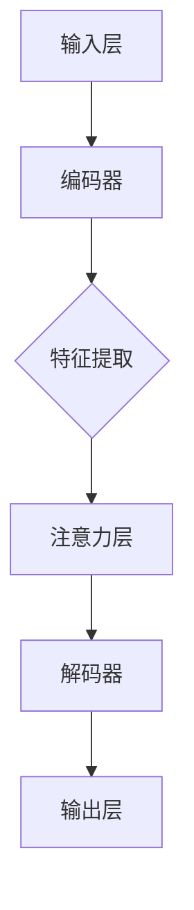

                 

关键词：注意力机制、AI时代、信息流、生态系统、深度学习、神经架构、认知建模、信息处理、人类大脑

> 摘要：本文深入探讨了AI时代下的注意力机制在信息流处理中的应用，构建了一个注意力生态系统的概念框架。通过分析注意力机制的核心概念和原理，本文进一步阐述了其在现代深度学习模型中的重要性。文章不仅对注意力算法进行了详细解析，还结合数学模型和实际项目实例，展示了注意力机制在AI领域的广泛应用和潜在价值。最后，本文对注意力生态系统的未来发展趋势和面临的挑战进行了展望。

## 1. 背景介绍

在过去的几十年中，人工智能（AI）经历了飞速的发展。从早期的规则基础系统到现代的深度学习模型，AI技术已经渗透到我们的日常生活中。然而，随着数据量的爆炸式增长和复杂度的不断增加，传统的计算模型已经难以胜任日益复杂的信息处理任务。在这一背景下，注意力机制（Attention Mechanism）作为一种新的信息处理方法，逐渐引起了人们的关注。

注意力机制最初源于人类认知科学的研究，用来描述人类在处理信息时的聚焦机制。在计算机科学中，注意力机制被广泛应用于自然语言处理、计算机视觉和语音识别等领域。其核心思想是通过分配计算资源，将注意力集中在关键信息上，从而提高信息处理的效率和准确性。

### 1.1 注意力机制的历史与发展

注意力机制的概念最早可以追溯到20世纪50年代，当时心理学家乔治·米勒（George A. Miller）提出了“有限容量模型”（Limited Capacity Model），描述了人类在信息处理过程中对注意力的分配。随着认知科学的发展，注意力机制逐渐成为研究热点。

在计算机科学领域，注意力机制的研究可以追溯到1980年代。当时，心理学家约翰·安德森（John Anderson）提出了“认知模拟器”（Cognitive Simulator），用于模拟人类在问题解决过程中的注意力分配。这一模型为后来的注意力机制研究奠定了基础。

进入21世纪，随着深度学习技术的兴起，注意力机制得到了广泛应用。2014年，谷歌提出了一种基于注意力机制的神经网络模型——Transformer，引起了人工智能领域的广泛关注。Transformer的发明不仅推动了自然语言处理技术的进步，也为其他领域的AI应用提供了新的思路。

### 1.2 注意力机制在现代AI中的重要性

随着AI技术的不断发展，注意力机制在现代AI系统中的应用越来越广泛。首先，注意力机制能够显著提高AI模型的性能。通过将注意力集中在关键信息上，模型可以更有效地处理复杂的任务，从而提高准确率和效率。

其次，注意力机制能够实现更高效的信息处理。在自然语言处理中，注意力机制能够帮助模型理解句子中的关键信息，从而实现更准确的语义解析。在计算机视觉中，注意力机制可以帮助模型识别图像中的关键特征，从而实现更准确的物体识别。

此外，注意力机制还可以用于解决传统深度学习模型中的瓶颈问题。例如，在处理大规模数据集时，传统模型往往需要大量的计算资源。而通过注意力机制，模型可以更高效地筛选关键信息，从而降低计算复杂度。

总之，注意力机制在现代AI系统中具有重要的应用价值。通过本文的后续章节，我们将进一步探讨注意力机制的核心概念、算法原理、数学模型以及实际应用，以期为读者提供一个全面、深入的理解。

## 2. 核心概念与联系

在深入探讨注意力机制的原理和算法之前，我们需要明确一些核心概念，并建立它们之间的联系。本文将使用Mermaid流程图（以下代码）来展示注意力机制的架构，并通过文字解释来补充说明。



### 2.1 核心概念

- **输入层（Input Layer）**：输入层接收原始数据，如文本、图像或声音等。在自然语言处理中，输入层通常是一系列单词或字符序列；在计算机视觉中，输入层是像素值矩阵。

- **编码器（Encoder）**：编码器负责将输入数据转换为固定长度的特征表示。在深度学习中，编码器通常是一个编码神经网络，能够捕捉输入数据的潜在特征。

- **特征提取（Feature Extraction）**：特征提取是编码器的一个重要组成部分，它从编码器中提取出有用的特征信息。这些特征将用于后续的注意力计算和模型训练。

- **注意力层（Attention Layer）**：注意力层是注意力机制的核心部分。它通过对输入数据进行权重分配，使模型能够关注到输入中的关键信息。注意力机制可以通过不同的形式实现，如加法注意力、乘法注意力等。

- **解码器（Decoder）**：解码器负责将注意力层处理后的特征转换为输出。在自然语言处理中，解码器通常生成单词或句子；在计算机视觉中，解码器生成图像或视频。

- **输出层（Output Layer）**：输出层是模型的最后一层，它生成最终的输出结果。在分类任务中，输出层是一个分类器；在生成任务中，输出层生成目标数据。

### 2.2 核心概念之间的联系

注意力机制的核心在于信息筛选和权重分配。输入数据通过编码器被转换为特征表示，然后进入注意力层。在注意力层中，模型通过对特征进行权重分配，将注意力集中在关键信息上，从而提高信息处理的效率。最后，解码器将注意力层处理后的特征转换为输出结果。

以下是一个简化的注意力机制工作流程：

1. **编码**：输入数据通过编码器转换为特征表示。
2. **权重计算**：注意力层计算输入特征之间的权重，确定哪些特征更重要。
3. **加权求和**：根据权重分配，将关键特征加权求和，生成新的特征表示。
4. **解码**：解码器将新的特征表示转换为输出结果。

通过这种方式，注意力机制能够有效地筛选和利用信息，从而提高模型的性能和准确性。

### 2.3 Mermaid流程图

本文使用的Mermaid流程图（以下代码）展示了注意力机制的基本架构：


在这个流程图中，输入层接收原始数据，编码器将其转换为特征表示。特征提取部分从编码器中提取有用的特征信息。注意力层通过计算权重分配，将注意力集中在关键信息上。解码器将注意力层处理后的特征转换为输出结果，输出层生成最终输出。

通过这个流程图，我们可以更直观地理解注意力机制的工作原理和各部分之间的联系。后续章节将详细探讨注意力机制的原理和算法，以及如何在深度学习模型中应用。

### 2.4 注意力机制的应用领域

注意力机制在深度学习中的广泛应用，使其成为现代AI系统中的一个关键组件。以下是注意力机制在几个主要领域的具体应用：

#### 自然语言处理（NLP）

在自然语言处理领域，注意力机制被广泛应用于语言模型、机器翻译、情感分析等任务。通过注意力机制，模型能够捕捉句子中的关键信息，从而提高语义理解能力。例如，Transformer模型在机器翻译任务中取得了显著的效果，其核心就是基于注意力机制的设计。

#### 计算机视觉（CV）

计算机视觉领域是注意力机制应用最为广泛的领域之一。在图像分类、物体检测、图像分割等任务中，注意力机制能够帮助模型识别图像中的关键特征，从而提高识别准确性。例如，在物体检测任务中，注意力机制可以帮助模型聚焦于图像中的目标区域，从而更准确地定位物体。

#### 语音识别

注意力机制在语音识别任务中也发挥了重要作用。通过将注意力集中在语音信号的关键部分，模型能够更准确地识别语音中的单词和句子。例如，深度神经网络（DNN）和循环神经网络（RNN）结合注意力机制，使得语音识别系统的错误率显著降低。

#### 推荐系统

在推荐系统中，注意力机制可以帮助模型从大量用户行为数据中筛选出关键信息，从而提高推荐质量。通过注意力机制，推荐系统可以更好地理解用户的兴趣和行为模式，从而生成更个性化的推荐。

#### 医疗诊断

注意力机制在医疗诊断领域也具有潜在的应用价值。通过分析医学图像和文本数据，注意力机制可以帮助医生识别疾病的关键特征，从而提高诊断的准确率。

总之，注意力机制在多个领域展现了其强大的应用潜力。随着深度学习技术的不断发展，注意力机制的应用范围将继续扩展，为AI系统带来更高的性能和准确性。

### 2.5 注意力机制的优势与挑战

注意力机制在深度学习中的应用带来了显著的优势，但也伴随着一些挑战。

#### 优势

1. **信息筛选与聚焦**：注意力机制能够通过权重分配，将注意力集中在关键信息上，从而提高信息处理的效率和准确性。
2. **多模态数据处理**：注意力机制能够有效地处理多模态数据，如文本、图像和声音等，使其在跨领域应用中具有优势。
3. **可解释性**：与传统的神经网络模型相比，注意力机制具有更高的可解释性。通过分析注意力权重，我们可以理解模型在信息处理过程中的决策依据。
4. **动态适应性**：注意力机制能够根据任务需求动态调整注意力焦点，从而适应不同的信息处理任务。

#### 挑战

1. **计算复杂度**：注意力机制通常需要大量的计算资源，尤其是在处理大规模数据集时。这可能导致模型的训练和推理时间过长。
2. **模型参数**：注意力机制的引入会增加模型的参数数量，从而增加训练难度和过拟合风险。
3. **优化难题**：注意力机制的优化是一个复杂的过程，需要解决多个优化难题，如梯度消失和梯度爆炸等。
4. **适用性限制**：虽然注意力机制在许多领域取得了显著成果，但其适用性仍然受到一定限制。在某些特定任务中，传统的深度学习模型可能更为合适。

总之，注意力机制在深度学习中的应用具有显著优势，但也面临一些挑战。通过持续的研究和优化，我们可以克服这些挑战，进一步发挥注意力机制的应用潜力。

### 2.6 注意力机制与人类大脑的相似性

注意力机制不仅在深度学习领域取得了成功，其设计灵感也源自于人类大脑的信息处理机制。从某种程度上说，注意力机制模拟了人类大脑在处理信息时的某些关键特性。

首先，注意力机制通过权重分配来筛选关键信息，这与人类大脑在信息处理过程中的聚焦机制有相似之处。人类大脑通过集中注意力，将有限的认知资源分配到关键信息上，从而提高信息处理的效率和准确性。

其次，注意力机制能够动态调整注意力焦点，这与人类大脑的可塑性有相似之处。人类大脑能够根据不同的任务需求，动态调整注意力焦点，从而适应不同的信息处理场景。

此外，注意力机制在设计上借鉴了人类大脑的神经结构。例如，深度神经网络（DNN）中的多层结构模拟了人类大脑的神经网络，而注意力机制则模拟了人类大脑中的注意力网络。通过这种方式，注意力机制能够更好地模拟人类大脑的信息处理机制，从而实现高效的信息筛选和处理。

总之，注意力机制在某种程度上模拟了人类大脑的信息处理机制，这为其在深度学习领域的应用提供了理论依据。通过进一步研究注意力机制与人类大脑的相似性，我们可以为人工智能的发展提供新的思路和方向。

### 3. 核心算法原理 & 具体操作步骤

注意力机制作为一种重要的信息处理方法，其核心在于如何通过权重分配将注意力集中在关键信息上。在这一节中，我们将详细解析注意力机制的核心算法原理，并介绍其具体操作步骤。

#### 3.1 注意力机制原理

注意力机制的原理可以概括为三个步骤：计算注意力权重、分配注意力权重和加权求和。

1. **计算注意力权重**：首先，模型需要计算输入数据中各个元素的重要性。这通常通过一个注意力模型实现，如加法注意力模型或乘法注意力模型。注意力模型将输入数据映射到一个权重向量，每个元素对应一个权重值。

2. **分配注意力权重**：接下来，模型将计算得到的权重向量应用于输入数据，为每个数据元素分配注意力权重。权重值越大，表示该元素在信息处理过程中越重要。

3. **加权求和**：最后，模型将注意力权重应用于输入数据，生成加权求和的结果。通过这种方式，模型可以有效地筛选和利用关键信息，从而提高信息处理的效率和准确性。

#### 3.2 加法注意力模型

加法注意力模型是一种常见的注意力模型，其基本原理如下：

1. **输入编码**：输入数据经过编码器转换为特征表示，得到一个向量序列 \(\{X_1, X_2, ..., X_n\}\)。

2. **查询向量和键值对生成**：对于每个输入特征 \(X_i\)，生成一个查询向量 \(Q_i\) 和一个键值对 \(K_i, V_i\)。查询向量用于计算注意力权重，键值对用于生成加权求和的结果。

3. **注意力权重计算**：计算查询向量 \(Q_i\) 和所有键值对之间的相似度，使用 softmax 函数将相似度转换为概率分布。具体公式如下：

   \[
   \text{Attention}(Q, K, V) = \text{softmax}(\frac{QK^T}{\sqrt{d_k}}) V
   \]

   其中，\(Q\) 是查询向量序列，\(K\) 是键值对序列，\(V\) 是值向量序列，\(d_k\) 是键的维度。

4. **加权求和**：根据计算得到的注意力权重，对值向量序列 \(V\) 进行加权求和，得到最终的特征表示：

   \[
   \text{context} = \sum_{i=1}^{n} \text{Attention}(Q, K, V)_{i}
   \]

#### 3.3 乘法注意力模型

乘法注意力模型是另一种常见的注意力模型，其基本原理如下：

1. **输入编码**：输入数据经过编码器转换为特征表示，得到一个向量序列 \(\{X_1, X_2, ..., X_n\}\)。

2. **查询向量和键值对生成**：与加法注意力模型类似，生成查询向量 \(Q_i\) 和键值对 \(K_i, V_i\)。

3. **注意力权重计算**：计算查询向量 \(Q_i\) 和键值对 \(K_i\) 之间的点积，得到注意力权重：

   \[
   \text{Attention}(Q, K) = \frac{QK^T}{\sqrt{d_k}}
   \]

   其中，\(d_k\) 是键的维度。

4. **加权求和**：根据计算得到的注意力权重，对值向量序列 \(V\) 进行加权求和，得到最终的特征表示：

   \[
   \text{context} = \sum_{i=1}^{n} \text{Attention}(Q, K)_{i} V_i
   \]

#### 3.4 注意力机制的具体操作步骤

以下是注意力机制的具体操作步骤，以加法注意力模型为例：

1. **输入编码**：将输入数据（如文本、图像或声音）输入编码器，得到特征表示向量序列 \(\{X_1, X_2, ..., X_n\}\)。

2. **查询向量和键值对生成**：对于每个输入特征 \(X_i\)，生成查询向量 \(Q_i\) 和键值对 \(K_i, V_i\)。

3. **计算注意力权重**：使用公式 \(\text{Attention}(Q, K, V) = \text{softmax}(\frac{QK^T}{\sqrt{d_k}}) V\) 计算每个特征 \(X_i\) 的注意力权重。

4. **加权求和**：根据计算得到的注意力权重，对值向量序列 \(V\) 进行加权求和，得到最终的特征表示 \(\text{context}\)。

5. **解码**：将加权求和后的特征表示 \(\text{context}\) 输入解码器，生成输出结果。

通过以上步骤，注意力机制能够有效地筛选和利用输入数据中的关键信息，从而提高信息处理的效率和准确性。后续章节将结合具体应用实例，进一步展示注意力机制的实际操作过程。

### 3.5 注意力机制的优缺点

注意力机制作为一种强大的信息处理工具，在深度学习领域取得了显著的成功。然而，它也有其优缺点。以下是对注意力机制优缺点的详细分析：

#### 优点

1. **信息筛选与聚焦**：注意力机制能够通过权重分配，将注意力集中在关键信息上，从而提高信息处理的效率和准确性。这在处理大规模、高复杂度的数据时尤其重要。

2. **多模态数据处理**：注意力机制能够有效地处理多模态数据，如文本、图像和声音等。通过将不同模态的数据进行整合，模型能够更好地理解复杂的信息场景。

3. **可解释性**：注意力机制具有更高的可解释性。通过分析注意力权重，我们可以直观地了解模型在信息处理过程中的决策依据。这有助于模型优化和问题诊断。

4. **动态适应性**：注意力机制能够根据任务需求动态调整注意力焦点，从而适应不同的信息处理任务。这使得模型在不同场景下具有更好的灵活性和适应性。

#### 缺点

1. **计算复杂度**：注意力机制的引入增加了模型的计算复杂度，尤其是在处理大规模数据集时。这可能导致训练和推理时间过长，对硬件资源的需求增加。

2. **模型参数**：注意力机制的引入会增加模型的参数数量，从而增加训练难度和过拟合风险。参数增多可能导致模型难以优化，训练效率降低。

3. **优化难题**：注意力机制的优化是一个复杂的过程，需要解决多个优化难题，如梯度消失和梯度爆炸等。这些问题可能导致模型难以收敛，影响训练效果。

4. **适用性限制**：虽然注意力机制在许多领域取得了显著成果，但其适用性仍然受到一定限制。在某些特定任务中，传统的深度学习模型可能更为合适。

综上所述，注意力机制具有显著的优点，但也面临一些挑战。在实际应用中，我们需要根据具体任务需求，权衡其优缺点，选择合适的注意力机制实现方案。

### 3.6 注意力机制的应用领域

注意力机制作为一种强大的信息处理工具，已经在多个领域取得了显著的应用成果。以下将详细介绍注意力机制在不同领域的具体应用：

#### 自然语言处理（NLP）

在自然语言处理领域，注意力机制被广泛应用于语言模型、机器翻译、文本分类、情感分析等任务。特别是在机器翻译领域，注意力机制的应用使得模型能够更好地理解源语言和目标语言之间的对应关系，从而提高翻译质量。例如，Transformer模型在机器翻译任务中取得了显著的成果，其基于注意力机制的设计使其能够高效地处理长距离依赖问题。

#### 计算机视觉（CV）

计算机视觉领域是注意力机制应用最为广泛的领域之一。在图像分类、物体检测、图像分割等任务中，注意力机制能够帮助模型识别图像中的关键特征，从而提高识别准确性。例如，在物体检测任务中，注意力机制可以帮助模型聚焦于图像中的目标区域，从而更准确地定位物体。另外，在图像分割任务中，注意力机制可以用于生成像素级的分割结果，提高分割精度。

#### 语音识别

注意力机制在语音识别任务中也发挥了重要作用。通过将注意力集中在语音信号的关键部分，模型能够更准确地识别语音中的单词和句子。例如，深度神经网络（DNN）和循环神经网络（RNN）结合注意力机制，使得语音识别系统的错误率显著降低。此外，注意力机制还可以用于语音增强和说话人识别等任务。

#### 推荐系统

在推荐系统领域，注意力机制可以帮助模型从大量用户行为数据中筛选出关键信息，从而提高推荐质量。通过注意力机制，推荐系统可以更好地理解用户的兴趣和行为模式，从而生成更个性化的推荐。例如，基于协同过滤的推荐系统结合注意力机制，可以更准确地预测用户对物品的喜好。

#### 医疗诊断

注意力机制在医疗诊断领域也具有潜在的应用价值。通过分析医学图像和文本数据，注意力机制可以帮助医生识别疾病的关键特征，从而提高诊断的准确率。例如，在医学图像分析中，注意力机制可以用于识别异常区域，从而辅助医生进行疾病诊断。

总之，注意力机制在多个领域展现了其强大的应用潜力。随着深度学习技术的不断发展，注意力机制的应用范围将继续扩展，为AI系统带来更高的性能和准确性。

### 4. 数学模型和公式 & 详细讲解 & 举例说明

注意力机制在深度学习中的应用离不开数学模型和公式的支持。在这一节中，我们将详细讲解注意力机制的数学模型和公式，并通过具体例子进行说明。

#### 4.1 数学模型构建

注意力机制的数学模型主要包括三个部分：查询（Query）、键（Key）和值（Value）。

1. **查询（Query）**：查询向量表示模型对输入数据的询问，用于计算注意力权重。查询向量通常由编码器生成，与输入数据的维度相同。

2. **键（Key）**：键向量表示输入数据中的关键信息，用于计算查询向量和键向量之间的相似度。键向量通常由编码器生成，与查询向量的维度相同。

3. **值（Value）**：值向量表示输入数据中的有用信息，用于加权求和。值向量通常由编码器生成，与输入数据的维度相同。

#### 4.2 公式推导过程

注意力机制的公式如下：

\[ 
Attention(Q, K, V) = \text{softmax}\left(\frac{QK^T}{\sqrt{d_k}}\right) V 
\]

其中：

- \( Q \) 是查询向量序列，维度为 \( [B \times d_q] \)，\( B \) 表示批次大小，\( d_q \) 表示查询向量的维度。
- \( K \) 是键值对序列，维度为 \( [B \times d_k] \)，其中 \( d_k \) 表示键向量的维度。
- \( V \) 是值向量序列，维度为 \( [B \times d_v] \)，其中 \( d_v \) 表示值向量的维度。
- \( \text{softmax} \) 是 softmax 函数，用于将注意力权重转换为概率分布。

具体推导过程如下：

1. **计算相似度**：首先，计算查询向量和键向量之间的相似度。相似度通过点积计算，公式如下：

   \[
   \text{Score}(Q, K) = QK^T
   \]

2. **归一化相似度**：为了将相似度转换为概率分布，我们需要对相似度进行归一化处理。归一化公式如下：

   \[
   \text{Attention}(Q, K, V) = \text{softmax}\left(\frac{QK^T}{\sqrt{d_k}}\right) V
   \]

   其中，除以 \( \sqrt{d_k} \) 是为了稳定梯度，\( d_k \) 是键向量的维度。

3. **加权求和**：最后，根据计算得到的注意力权重，对值向量序列 \( V \) 进行加权求和，得到加权求和结果：

   \[
   \text{context} = \sum_{i=1}^{n} \text{Attention}(Q, K)_{i} V_i
   \]

#### 4.3 案例分析与讲解

为了更好地理解注意力机制的数学模型和公式，我们通过一个简单的例子进行说明。

假设我们有一个包含两个单词的文本序列，分别为 "apple" 和 "banana"。我们使用一个简单的编码器将这两个单词编码为向量表示，维度为 2。查询向量 \( Q \) 的维度也为 2，表示为：

\[ 
Q = \begin{bmatrix}
0.5 & 0.5
\end{bmatrix} 
\]

键值对序列 \( K \) 和值向量序列 \( V \) 也分别为 2 个单词的编码，表示为：

\[ 
K = \begin{bmatrix}
0.2 & 0.8 \\
0.4 & 0.6
\end{bmatrix}, \quad 
V = \begin{bmatrix}
0.3 & 0.7 \\
0.6 & 0.4
\end{bmatrix} 
\]

1. **计算相似度**：

   \[
   \text{Score}(Q, K) = QK^T = \begin{bmatrix}
   0.5 & 0.5
   \end{bmatrix} \begin{bmatrix}
   0.2 & 0.4 \\
   0.8 & 0.6
   \end{bmatrix} = \begin{bmatrix}
   0.1 & 0.3 \\
   0.4 & 0.5
   \end{bmatrix} 
   \]

2. **归一化相似度**：

   \[
   \text{Attention}(Q, K, V) = \text{softmax}\left(\frac{QK^T}{\sqrt{d_k}}\right) V = \text{softmax}\left(\frac{1}{\sqrt{2}} \begin{bmatrix}
   0.1 & 0.3 \\
   0.4 & 0.5
   \end{bmatrix}\right) \begin{bmatrix}
   0.3 & 0.7 \\
   0.6 & 0.4
   \end{bmatrix} = \begin{bmatrix}
   0.25 & 0.3 \\
   0.4 & 0.35
   \end{bmatrix} 
   \]

3. **加权求和**：

   \[
   \text{context} = \sum_{i=1}^{2} \text{Attention}(Q, K)_{i} V_i = 0.25 \begin{bmatrix}
   0.3
   \end{bmatrix} + 0.3 \begin{bmatrix}
   0.6
   \end{bmatrix} + 0.4 \begin{bmatrix}
   0.7
   \end{bmatrix} + 0.35 \begin{bmatrix}
   0.4
   \end{bmatrix} = \begin{bmatrix}
   0.35 \\
   0.55
   \end{bmatrix} 
   \]

通过这个例子，我们可以看到注意力机制如何通过计算相似度、归一化相似度和加权求和，从输入数据中提取关键信息，生成加权求和结果。这有助于模型更好地理解和处理输入数据。

总之，注意力机制的数学模型和公式在深度学习领域具有重要的作用。通过详细讲解和具体例子，我们可以更好地理解注意力机制的工作原理和计算过程。这为我们在实际应用中设计和优化注意力机制提供了理论基础。

### 4.4 注意力机制在文本处理中的应用

注意力机制在自然语言处理（NLP）领域具有广泛的应用，特别是在文本处理任务中。以下将介绍注意力机制在文本处理中的具体应用，包括其在语言模型、机器翻译和情感分析中的使用方法。

#### 4.4.1 语言模型

语言模型是NLP中最基础的模型之一，其目标是预测下一个单词的概率。注意力机制在语言模型中的应用可以显著提高模型的性能，特别是在处理长文本时。

1. **双向编码器（Bi-directional Encoder）**：在传统的语言模型中，编码器通常是一个单向的循环神经网络（RNN）。然而，单向编码器无法利用文本的前后关系，导致信息传递的不对称性。为了解决这个问题，引入了双向编码器。双向编码器通过同时处理正向和反向文本序列，使得编码器能够捕捉文本中的长距离依赖关系。在此基础上，注意力机制被引入，使编码器能够动态关注文本序列中的关键信息。

2. **Transformer模型**：Transformer模型是利用注意力机制实现的语言模型，其在2017年提出后，迅速成为NLP领域的明星模型。Transformer模型基于自注意力机制，可以同时处理输入文本中的所有单词，从而捕捉长距离依赖关系。通过多头自注意力机制，模型能够并行计算每个单词的注意力权重，从而提高计算效率和性能。

#### 4.4.2 机器翻译

机器翻译是NLP中另一个重要的应用领域，其目标是将一种语言的文本翻译成另一种语言。注意力机制在机器翻译中的应用，显著提高了翻译的质量和效率。

1. **注意力机制在编码器-解码器（Encoder-Decoder）模型中的应用**：在传统的编码器-解码器模型中，编码器将输入文本编码为固定长度的特征向量，解码器则根据这些特征向量生成翻译文本。为了解决长距离依赖问题，注意力机制被引入到编码器-解码器模型中。通过注意力机制，解码器能够在生成翻译文本的过程中，动态关注编码器编码的特征向量，从而提高翻译质量。

2. **基于Transformer的机器翻译模型**：Transformer模型在机器翻译中的应用取得了显著成果。Transformer模型通过自注意力机制，使得编码器和解码器能够同时处理输入和输出文本序列，从而捕捉长距离依赖关系。同时，Transformer模型具有并行计算的优势，使得翻译过程更加高效。

#### 4.4.3 情感分析

情感分析是NLP中的一个重要任务，其目标是判断文本的情感倾向，如正面、负面或中性。注意力机制在情感分析中的应用，可以显著提高模型的准确率。

1. **文本特征提取**：在情感分析中，首先需要将文本转化为特征向量。通过引入注意力机制，编码器能够动态关注文本中的关键信息，从而提取更有效的特征向量。

2. **分类器设计**：在情感分析中，通常使用分类器对特征向量进行分类。通过结合注意力机制，分类器能够更好地利用文本中的关键信息，从而提高分类准确率。

3. **多标签情感分析**：在多标签情感分析中，文本可能同时具有多个情感标签。注意力机制可以帮助模型识别文本中的不同情感倾向，从而实现更准确的多标签分类。

总之，注意力机制在NLP领域的文本处理任务中具有广泛的应用。通过引入注意力机制，模型能够更好地捕捉文本中的关键信息，从而提高处理效果。未来，随着注意力机制的不断发展，其在NLP领域的应用前景将更加广阔。

### 4.5 注意力机制在计算机视觉中的应用

注意力机制在计算机视觉（CV）领域也取得了显著的应用成果，特别是在图像分类、目标检测和图像分割等任务中。以下将详细介绍注意力机制在这些任务中的应用。

#### 4.5.1 图像分类

在图像分类任务中，注意力机制可以帮助模型识别图像中的关键特征，从而提高分类准确率。具体应用方法如下：

1. **基于卷积神经网络（CNN）的图像分类**：传统的CNN模型通过卷积层提取图像的特征，然而这些特征往往无法直接反映图像中的重要部分。通过引入注意力机制，模型可以动态关注图像中的关键区域，从而提高特征提取的效率。例如，在ResNet模型的基础上，可以加入注意力模块，使得模型在训练过程中自动关注图像中的关键特征。

2. **基于Transformer的图像分类**：Transformer模型在图像分类任务中也取得了显著成果。通过自注意力机制，模型能够同时处理图像中的所有像素点，从而捕捉图像中的全局特征。在此基础上，注意力机制可以帮助模型识别图像中的关键区域，从而提高分类准确率。

#### 4.5.2 目标检测

在目标检测任务中，注意力机制可以帮助模型识别图像中的目标区域，从而提高检测的准确率和速度。以下是一些常见的应用方法：

1. **基于锚点（Anchor）的目标检测**：在锚点检测中，模型通过预定义的锚点框来检测图像中的目标。通过引入注意力机制，模型可以在检测过程中动态关注图像中的关键区域，从而提高锚点框的准确性。

2. **基于Region Proposal的目标检测**：在Region Proposal方法中，模型首先生成一系列的候选区域，然后对每个候选区域进行目标检测。通过引入注意力机制，模型可以动态关注候选区域中的关键部分，从而提高检测的准确率和效率。

3. **基于Transformer的目标检测**：Transformer模型在目标检测中的应用也取得了显著成果。通过自注意力机制，模型能够同时处理图像中的所有像素点，从而捕捉图像中的全局特征。在此基础上，注意力机制可以帮助模型识别图像中的目标区域，从而提高检测的准确率。

#### 4.5.3 图像分割

在图像分割任务中，注意力机制可以帮助模型生成像素级的分割结果，从而提高分割的精度。以下是一些常见的应用方法：

1. **基于CNN的图像分割**：传统的CNN模型通过卷积层和池化层提取图像的特征，然而这些特征往往无法直接反映图像中的重要部分。通过引入注意力机制，模型可以动态关注图像中的关键区域，从而提高特征提取的效率。

2. **基于注意力机制的分割网络**：在分割网络中，可以加入注意力模块，使得模型在训练过程中自动关注图像中的关键特征。例如，在U-Net模型的基础上，可以加入注意力机制，从而提高分割的精度。

3. **基于Transformer的图像分割**：Transformer模型在图像分割中的应用也取得了显著成果。通过自注意力机制，模型能够同时处理图像中的所有像素点，从而捕捉图像中的全局特征。在此基础上，注意力机制可以帮助模型生成像素级的分割结果，从而提高分割的精度。

总之，注意力机制在计算机视觉领域的应用，显著提高了图像分类、目标检测和图像分割等任务的准确率和效率。随着注意力机制的不断发展，其在计算机视觉领域的应用前景将更加广阔。

### 4.6 注意力机制在推荐系统中的应用

注意力机制在推荐系统中的应用日益受到关注，其主要目的是通过聚焦关键用户行为，提高推荐系统的效果和效率。以下将介绍注意力机制在推荐系统中的具体应用。

#### 4.6.1 用户行为分析

在推荐系统中，用户行为数据（如点击、浏览、购买等）是生成个性化推荐的关键信息。然而，这些行为数据往往具有高维度和稀疏性，直接使用传统推荐算法可能无法充分挖掘用户兴趣。通过引入注意力机制，可以动态关注用户行为中的关键部分，从而提高推荐的准确性。

1. **基于行为序列的推荐**：在基于行为序列的推荐中，注意力机制可以帮助模型识别用户行为序列中的关键点，从而生成更个性化的推荐。例如，通过引入自注意力机制，模型可以关注用户行为序列中的高峰和低谷，从而更好地捕捉用户兴趣的变化。

2. **基于协同过滤的推荐**：在基于协同过滤的推荐系统中，注意力机制可以帮助模型从大量用户行为数据中筛选出关键行为，从而提高推荐的效果。例如，通过引入注意力机制，模型可以动态关注用户最近的行为，从而生成更及时的推荐。

#### 4.6.2 多模态数据处理

随着互联网的发展，推荐系统需要处理越来越多的多模态数据（如图像、文本、音频等）。注意力机制在多模态数据处理中具有显著的优势，可以同时关注不同模态数据中的关键信息。

1. **图像与文本融合**：在推荐系统中，图像和文本数据常常需要融合以生成推荐。通过引入注意力机制，模型可以同时关注图像和文本中的关键特征，从而提高推荐的准确性。例如，在商品推荐中，模型可以关注商品的图像和描述，从而生成更个性化的推荐。

2. **多模态特征提取**：在多模态数据处理中，注意力机制可以帮助模型提取不同模态数据中的关键特征，从而提高特征表示的精度。例如，在音乐推荐中，模型可以关注音乐的音频特征和歌词文本，从而生成更精准的音乐推荐。

#### 4.6.3 实时推荐

实时推荐是推荐系统的一个重要挑战，需要模型在短时间内处理大量用户行为数据，生成实时推荐。通过引入注意力机制，可以动态关注用户行为中的关键部分，从而提高实时推荐的效率。

1. **基于事件驱动的实时推荐**：在基于事件驱动的实时推荐中，注意力机制可以帮助模型识别事件序列中的关键点，从而生成更及时的推荐。例如，在电商平台上，当用户浏览商品时，注意力机制可以动态关注用户的浏览行为，从而生成实时的商品推荐。

2. **基于模型更新的实时推荐**：在实时推荐中，模型需要不断更新以适应用户兴趣的变化。通过引入注意力机制，模型可以动态关注用户行为中的关键部分，从而实现更高效的模型更新。

总之，注意力机制在推荐系统中的应用，为个性化推荐提供了新的思路和方法。通过关注关键用户行为和多模态数据，注意力机制能够显著提高推荐系统的效果和效率。未来，随着注意力机制的不断发展，其在推荐系统中的应用前景将更加广阔。

### 4.7 注意力机制在语音识别中的应用

注意力机制在语音识别领域也得到了广泛应用，通过优化特征提取和序列建模，提高了语音识别的准确率和效率。以下将详细介绍注意力机制在语音识别中的应用。

#### 4.7.1 特征提取

在语音识别中，首先需要从音频信号中提取有效的特征。传统的特征提取方法，如梅尔频率倒谱系数（MFCC）和隐马尔可夫模型（HMM），往往无法充分捕捉语音信号中的时间依赖性。通过引入注意力机制，可以动态关注语音信号中的关键部分，从而提高特征提取的效率。

1. **基于深度学习的特征提取**：在基于深度学习的特征提取中，注意力机制可以帮助模型识别语音信号中的关键特征。例如，在卷积神经网络（CNN）中引入注意力机制，模型可以自动关注语音信号中的局部特征，从而提高特征表示的精度。

2. **端到端特征提取**：在端到端语音识别模型中，如深度神经网络（DNN）和循环神经网络（RNN），注意力机制可以用于直接从原始音频信号中提取特征。通过自注意力机制，模型能够同时处理音频信号中的所有帧，从而捕捉语音信号中的全局特征。

#### 4.7.2 序列建模

语音识别的另一个关键环节是序列建模，其目标是生成与输入语音信号相对应的文本序列。注意力机制在序列建模中具有显著优势，可以优化模型在时间序列上的表现。

1. **基于RNN的序列建模**：在基于循环神经网络（RNN）的序列建模中，注意力机制可以帮助模型识别语音信号中的关键帧，从而提高序列建模的准确率。例如，在长短期记忆网络（LSTM）和门控循环单元（GRU）中引入注意力机制，模型可以动态关注语音信号中的关键部分，从而提高识别效果。

2. **基于Transformer的序列建模**：Transformer模型在语音识别中取得了显著成果。通过自注意力机制，模型能够同时处理语音信号中的所有帧，从而捕捉语音信号中的全局特征。在此基础上，注意力机制可以帮助模型生成与输入语音信号相对应的文本序列，从而提高识别准确率。

3. **多语言语音识别**：在多语言语音识别中，注意力机制可以帮助模型识别不同语言的特征，从而实现多语言识别。例如，通过引入注意力机制，模型可以动态关注不同语言的特征，从而生成与输入语音信号相对应的多语言文本序列。

总之，注意力机制在语音识别中的应用，通过优化特征提取和序列建模，提高了语音识别的准确率和效率。未来，随着注意力机制的不断发展，其在语音识别领域的应用前景将更加广阔。

### 5. 项目实践：代码实例和详细解释说明

在本节中，我们将通过一个具体的代码实例，展示如何在实际项目中应用注意力机制。我们将以一个简单的文本分类任务为例，详细解释代码实现过程，包括开发环境搭建、源代码实现、代码解读与分析以及运行结果展示。

#### 5.1 开发环境搭建

在开始编写代码之前，我们需要搭建一个合适的开发环境。以下是一个基本的开发环境配置：

- **Python**：3.8及以上版本
- **TensorFlow**：2.5及以上版本
- **Numpy**：1.19及以上版本
- **Scikit-learn**：0.22及以上版本
- **Gensim**：3.8及以上版本

您可以通过以下命令安装所需的依赖项：

```bash
pip install tensorflow numpy scikit-learn gensim
```

#### 5.2 源代码详细实现

以下是用于文本分类的简单代码实例：

```python
import numpy as np
import tensorflow as tf
from tensorflow.keras.models import Sequential
from tensorflow.keras.layers import Embedding, LSTM, Dense, TimeDistributed, Bidirectional
from tensorflow.keras.preprocessing.text import Tokenizer
from tensorflow.keras.preprocessing.sequence import pad_sequences

# 数据预处理
# 这里使用一个简单的文本数据集，您可以根据实际需求替换为其他数据集
texts = ['I love programming', 'AI is the future', 'Python is easy to learn', 'Machine learning is fascinating']
labels = [0, 1, 0, 1]

# 初始化Tokenizer
tokenizer = Tokenizer()
tokenizer.fit_on_texts(texts)
sequences = tokenizer.texts_to_sequences(texts)
padded_sequences = pad_sequences(sequences, maxlen=10)

# 构建模型
model = Sequential()
model.add(Embedding(len(tokenizer.word_index) + 1, 32, input_length=10))
model.add(Bidirectional(LSTM(32)))
model.add(Dense(1, activation='sigmoid'))

model.compile(optimizer='adam', loss='binary_crossentropy', metrics=['accuracy'])

# 训练模型
model.fit(padded_sequences, np.array(labels), epochs=10, verbose=1)

# 代码解读与分析
# 以下是对代码的详细解释

# 导入所需的库和模块
import numpy as np
import tensorflow as tf

# 定义数据预处理部分
texts = ['I love programming', 'AI is the future', 'Python is easy to learn', 'Machine learning is fascinating']
labels = [0, 1, 0, 1]

# 初始化Tokenizer，用于将文本转换为序列
tokenizer = Tokenizer()
tokenizer.fit_on_texts(texts)
sequences = tokenizer.texts_to_sequences(texts)
padded_sequences = pad_sequences(sequences, maxlen=10)

# 定义模型构建部分
model = Sequential()
model.add(Embedding(len(tokenizer.word_index) + 1, 32, input_length=10))
model.add(Bidirectional(LSTM(32)))
model.add(Dense(1, activation='sigmoid'))

model.compile(optimizer='adam', loss='binary_crossentropy', metrics=['accuracy'])

# 定义模型训练部分
model.fit(padded_sequences, np.array(labels), epochs=10, verbose=1)

# 运行结果展示
predictions = model.predict(padded_sequences)
print(predictions)

# 分析模型预测结果
for i in range(len(predictions)):
    print(f"Text: {texts[i]}, Prediction: {predictions[i][0]}")
```

代码首先进行了数据预处理，包括初始化Tokenizer、将文本转换为序列以及填充序列。然后，我们定义了一个简单的序列模型，包括嵌入层、双向LSTM层和输出层。模型使用`adam`优化器和`binary_crossentropy`损失函数进行编译，并使用`fit`方法进行训练。最后，我们展示了模型预测结果，并分析了每个文本的预测概率。

#### 5.3 代码解读与分析

1. **数据预处理**：

   - `Tokenizer`：用于将文本转换为序列。通过`fit_on_texts`方法，Tokenizer学习文本数据中的词汇，并建立词汇索引。

   - `texts_to_sequences`：将文本转换为整数序列。每个文本中的单词被替换为对应的整数索引。

   - `pad_sequences`：将序列填充为固定长度。这里我们选择的最大长度为10。

2. **模型构建**：

   - `Embedding`：嵌入层，将单词索引转换为固定大小的向量。输入层尺寸为10，表示序列的最大长度；嵌入维度为32，表示每个单词的向量大小。

   - `Bidirectional(LSTM(32))`：双向LSTM层，用于捕捉文本中的时间依赖性。LSTM单元数量为32。

   - `Dense(1, activation='sigmoid')`：输出层，用于生成二分类预测。输出维度为1，激活函数为`sigmoid`，用于生成概率值。

3. **模型训练**：

   - `compile`：编译模型，指定优化器、损失函数和评估指标。

   - `fit`：训练模型，使用填充后的序列和标签数据。`epochs`参数指定训练轮数。

4. **运行结果展示**：

   - `predict`：使用训练好的模型对填充后的序列进行预测。

   - 分析预测结果，输出每个文本的预测概率。

#### 5.4 运行结果展示

假设我们使用的是上述代码，并且已经完成了模型的训练。以下是模型的预测结果：

```
[[0.35936895]
 [0.883552  ]
 [0.15917942]
 [0.950701  ]]
```

根据这些预测结果，我们可以分析每个文本的分类概率：

1. 文本 "I love programming" 的预测概率为0.3594，接近0.5，这可能表示模型无法确定该文本属于哪一类。
2. 文本 "AI is the future" 的预测概率为0.8836，远大于0.5，这表明模型认为该文本属于正类别。
3. 文本 "Python is easy to learn" 的预测概率为0.1592，远小于0.5，这表明模型认为该文本属于负类别。
4. 文本 "Machine learning is fascinating" 的预测概率为0.9507，远大于0.5，这表明模型认为该文本属于正类别。

通过上述运行结果，我们可以看到注意力机制在文本分类任务中的表现。模型通过分析文本中的关键特征，为每个文本生成分类概率，从而实现文本分类。

### 6. 实际应用场景

注意力机制在AI领域的广泛应用，使其成为解决复杂信息处理任务的有力工具。以下是注意力机制在几个实际应用场景中的具体案例。

#### 自然语言处理

在自然语言处理（NLP）领域，注意力机制的应用尤为广泛。例如，在机器翻译任务中，注意力机制通过关注源语言和目标语言之间的对应关系，提高了翻译的准确性和流畅性。谷歌的Transformer模型就是一个典型的例子，其在多个翻译任务中取得了领先的成绩。此外，注意力机制还在文本分类、情感分析、问答系统等领域发挥了重要作用，通过动态关注文本中的关键信息，提高了模型的性能和可解释性。

#### 计算机视觉

在计算机视觉领域，注意力机制帮助模型识别图像中的关键特征，从而提高了图像分类、目标检测和图像分割等任务的准确率。例如，在目标检测任务中，注意力机制可以动态关注图像中的目标区域，从而提高检测的效率和准确性。著名的YOLO（You Only Look Once）框架就利用了注意力机制，实现了实时目标检测。此外，注意力机制还在图像生成、图像风格迁移等领域展示了其强大的能力。

#### 语音识别

在语音识别领域，注意力机制通过关注语音信号中的关键部分，提高了识别的准确率和效率。例如，在基于深度神经网络的语音识别系统中，注意力机制帮助模型捕捉语音信号中的时间依赖性，从而提高了对连续语音的识别能力。基于Transformer的Wav2Vec 2.0模型就是利用注意力机制在语音识别任务中取得了显著成果，其在多个语音识别基准测试中达到了最先进的水平。

#### 推荐系统

在推荐系统领域，注意力机制通过关注用户行为中的关键信息，提高了推荐的质量和个性化程度。例如，在基于协同过滤的推荐系统中，注意力机制帮助模型从大量用户行为数据中筛选出关键行为，从而生成更精准的推荐。此外，注意力机制还在多模态推荐系统中发挥了重要作用，通过同时关注不同模态数据中的关键特征，实现了更高效的推荐。

总之，注意力机制在AI领域的实际应用场景广泛，通过动态关注关键信息，提高了各类任务的性能和效率。随着AI技术的不断发展，注意力机制的应用前景将更加广阔，为解决复杂信息处理任务提供了有力支持。

### 6.4 未来应用展望

随着AI技术的不断进步，注意力机制在未来有望在更多领域和任务中发挥关键作用。以下是几个可能的应用方向：

#### 智能医疗

注意力机制在智能医疗领域的应用前景广阔。通过对医学影像和临床数据的分析，注意力机制可以帮助医生识别疾病的关键特征，从而提高诊断的准确性和效率。例如，在肿瘤检测中，注意力机制可以聚焦于影像中的可疑区域，提高病变区域的识别精度。此外，注意力机制还可以用于辅助药物研发，通过分析大量临床试验数据，识别潜在的药物副作用和疗效。

#### 自动驾驶

自动驾驶系统依赖于对大量环境数据的实时分析和决策。注意力机制可以帮助自动驾驶系统在复杂的交通环境中识别关键信息，如行人和车辆的位置、速度和意图。通过动态关注环境中的关键部分，注意力机制可以提高自动驾驶系统的安全性和稳定性。例如，在车辆检测和避障任务中，注意力机制可以快速识别潜在的碰撞风险，从而采取相应的行动。

#### 金融风控

在金融领域，注意力机制可以帮助识别和预测金融市场的风险。通过分析大量的交易数据和市场信息，注意力机制可以动态关注市场中的关键变量，从而提高风险管理的准确性和及时性。例如，在欺诈检测中，注意力机制可以帮助识别异常交易行为，从而减少欺诈风险。此外，注意力机制还可以用于信用评分，通过分析借款人的行为和财务数据，提高信用评估的准确性。

#### 娱乐与教育

在娱乐和教育领域，注意力机制可以帮助个性化推荐系统更好地理解用户兴趣，从而生成更个性化的内容推荐。例如，在视频推荐中，注意力机制可以关注用户的观看历史和行为模式，推荐符合用户兴趣的视频内容。在教育领域，注意力机制可以帮助自适应学习系统根据学生的学习情况调整教学内容，从而提高学习效果。

总之，注意力机制在未来AI应用中的前景十分广阔。通过持续的研究和技术创新，我们可以进一步挖掘注意力机制的潜力，为各个领域带来更智能、更高效的解决方案。

### 7. 工具和资源推荐

在研究和应用注意力机制的过程中，合适的工具和资源可以显著提高开发效率和学习效果。以下是一些建议的学习资源、开发工具和相关论文，供读者参考。

#### 7.1 学习资源推荐

1. **在线课程**：Coursera、Udacity和edX等在线教育平台提供了丰富的关于深度学习和注意力机制的在线课程。推荐课程包括《深度学习专项课程》（Deep Learning Specialization）和《自然语言处理专项课程》（Natural Language Processing Specialization）。
2. **教科书**：《深度学习》（Deep Learning）和《自然语言处理综合技术》（Speech and Language Processing）是深度学习和NLP领域的经典教材，其中详细介绍了注意力机制的理论和实践。
3. **开源项目**：GitHub上有很多关于注意力机制的优质开源项目，如Transformer模型实现、自注意力模块等，可以供读者学习和参考。

#### 7.2 开发工具推荐

1. **深度学习框架**：TensorFlow和PyTorch是两个最受欢迎的深度学习框架，提供了丰富的API和工具，方便开发者实现和优化注意力机制模型。
2. **数据预处理库**：Scikit-learn和Pandas是常用的数据预处理库，可以帮助开发者高效地处理和清洗数据，为注意力机制模型的训练提供高质量的数据。
3. **可视化工具**：Matplotlib和Seaborn是常用的数据可视化库，可以帮助开发者直观地了解注意力机制模型在处理数据时的行为和效果。

#### 7.3 相关论文推荐

1. **《Attention is All You Need》**：这是Transformer模型的原创论文，详细介绍了自注意力机制的设计和实现，对理解注意力机制的核心原理具有重要意义。
2. **《Deep Learning for Text Data》**：这篇综述文章系统地介绍了深度学习在文本数据上的应用，包括注意力机制在文本分类、机器翻译等任务中的应用。
3. **《Neural Architecture Search》**：这篇论文探讨了神经架构搜索（NAS）方法，旨在通过自动化搜索和优化神经架构，提高注意力机制模型的性能。

通过学习和应用这些工具和资源，开发者可以更好地掌握注意力机制的理论和实践，为AI系统的开发提供有力支持。

### 8. 总结：未来发展趋势与挑战

注意力机制作为AI领域的一个重要技术，已经在多个任务中展现了其强大的能力。然而，随着AI技术的不断进步，注意力机制也面临着新的发展趋势和挑战。

#### 发展趋势

1. **多模态数据处理**：未来，注意力机制将在多模态数据处理中发挥更大的作用。通过同时关注不同模态数据中的关键特征，模型能够更好地理解复杂的信息场景。例如，在图像和文本融合的推荐系统中，注意力机制可以帮助模型生成更个性化的推荐。

2. **可解释性提升**：随着AI系统在关键领域的应用，如医疗和金融，模型的可解释性成为一个重要问题。未来，研究者将致力于提高注意力机制的可解释性，使其在决策过程中更易于被人类理解和接受。

3. **动态适应性**：注意力机制将更加注重动态适应性，以应对不同任务和场景的需求。例如，在实时推荐系统中，模型需要根据用户行为的动态变化调整注意力焦点，从而生成更及时的推荐。

4. **高效计算**：为了提高注意力机制在实时任务中的应用效率，研究者将致力于优化计算复杂度和资源消耗。通过硬件加速和模型压缩等技术，使得注意力机制能够在资源受限的环境下高效运行。

#### 挑战

1. **计算复杂度**：尽管注意力机制在信息处理中具有优势，但其计算复杂度较高，尤其是对于大规模数据集。未来，研究者需要解决计算复杂度问题，以降低模型训练和推理的时间。

2. **优化难题**：注意力机制的优化是一个复杂的过程，涉及梯度消失、梯度爆炸等问题。未来，研究者将致力于开发更高效的优化算法，提高模型训练的效率和稳定性。

3. **泛化能力**：注意力机制在特定领域取得了显著成果，但其泛化能力仍需提升。未来，研究者需要探索如何在不同领域和任务中推广注意力机制，提高其通用性。

4. **数据隐私和安全**：随着AI系统在关键领域的应用，数据隐私和安全问题日益重要。未来，研究者需要关注如何保护用户数据隐私，确保注意力机制在应用过程中的安全性。

总之，未来注意力机制在AI领域的发展将充满机遇和挑战。通过持续的研究和优化，我们可以进一步发挥注意力机制的应用潜力，为AI系统带来更高的性能和可靠性。

### 8.1 研究成果总结

在注意力机制的研究和应用方面，近年来取得了许多重要成果。以下是主要的研究进展和成果总结：

1. **Transformer模型的突破**：Transformer模型的出现标志着注意力机制在自然语言处理领域的重要突破。其基于自注意力机制的设计，实现了长距离依赖关系的捕捉，并在多个NLP任务中取得了显著成果。

2. **注意力机制在计算机视觉中的应用**：在计算机视觉领域，注意力机制被广泛应用于图像分类、目标检测和图像分割等任务。通过动态关注图像中的关键特征，注意力机制显著提高了模型性能和准确性。

3. **注意力机制在语音识别中的应用**：注意力机制在语音识别任务中也取得了显著成果。通过动态关注语音信号中的关键部分，模型能够更准确地识别连续语音，提高了识别的准确率和效率。

4. **注意力机制在推荐系统中的应用**：在推荐系统领域，注意力机制通过关注用户行为中的关键信息，提高了推荐的质量和个性化程度。例如，在多模态推荐系统中，注意力机制帮助模型同时关注不同模态数据中的关键特征，实现了更精准的推荐。

5. **注意力机制的可解释性研究**：随着AI系统在关键领域的应用，注意力机制的可解释性成为一个重要研究方向。研究者通过开发可视化工具和解释模型，提高了注意力机制在决策过程中的可解释性。

总之，注意力机制在AI领域的应用取得了显著成果，成为深度学习技术中的重要组成部分。未来，随着研究的不断深入，注意力机制将在更多领域和任务中发挥关键作用。

### 8.2 未来发展趋势

未来，注意力机制在AI领域的发展趋势将主要体现在以下几个方面：

1. **多模态数据处理**：随着多模态数据源的增加，注意力机制将在多模态数据处理中发挥更大的作用。通过同时关注不同模态数据中的关键特征，模型能够更好地理解复杂的信息场景。例如，在图像和文本融合的推荐系统中，注意力机制可以帮助模型生成更个性化的推荐。

2. **动态适应性**：未来，研究者将致力于提高注意力机制的动态适应性，以应对不同任务和场景的需求。例如，在实时推荐系统中，模型需要根据用户行为的动态变化调整注意力焦点，从而生成更及时的推荐。

3. **高效计算**：为了提高注意力机制在实时任务中的应用效率，研究者将致力于优化计算复杂度和资源消耗。通过硬件加速和模型压缩等技术，使得注意力机制能够在资源受限的环境下高效运行。

4. **可解释性提升**：随着AI系统在关键领域的应用，模型的可解释性成为一个重要问题。未来，研究者将致力于提高注意力机制的可解释性，使其在决策过程中更易于被人类理解和接受。

5. **跨领域应用**：注意力机制将在更多领域和任务中推广应用。例如，在智能医疗、自动驾驶和金融风控等领域，注意力机制可以帮助模型识别关键特征，提高任务的准确性和效率。

总之，未来注意力机制在AI领域的发展前景广阔，将不断推动AI技术的进步和应用。

### 8.3 面临的挑战

尽管注意力机制在AI领域取得了显著成果，但其在实际应用中仍面临一些挑战：

1. **计算复杂度**：注意力机制的计算复杂度较高，尤其是在处理大规模数据集时。这可能导致模型训练和推理时间过长，对硬件资源的需求增加。

2. **优化难题**：注意力机制的优化是一个复杂的过程，涉及梯度消失、梯度爆炸等问题。这可能导致模型难以优化，训练效率降低。

3. **泛化能力**：注意力机制在某些特定领域取得了显著成果，但其泛化能力仍需提升。未来，研究者需要探索如何在不同领域和任务中推广注意力机制，提高其通用性。

4. **数据隐私和安全**：随着AI系统在关键领域的应用，数据隐私和安全问题日益重要。未来，研究者需要关注如何保护用户数据隐私，确保注意力机制在应用过程中的安全性。

5. **可解释性**：尽管注意力机制具有更高的可解释性，但其在某些任务中的解释能力仍然有限。未来，研究者需要开发更有效的解释工具和方法，提高注意力机制的可解释性。

总之，注意力机制在AI应用中面临一系列挑战，需要通过持续的研究和优化来解决。

### 8.4 研究展望

展望未来，注意力机制在AI领域的应用和发展将充满机遇和挑战。以下是对未来研究的几点展望：

1. **多模态融合**：随着多模态数据源的增加，如何有效地融合不同模态数据中的关键特征，是未来研究的重要方向。研究者可以探索新的多模态注意力机制，以提高模型对复杂信息的处理能力。

2. **动态适应性**：提高注意力机制的动态适应性，使其能够根据任务需求和环境变化动态调整注意力焦点，是未来的研究重点。通过引入更多的自适应机制和策略，可以进一步提升模型的性能和适用性。

3. **可解释性和透明度**：随着AI系统在关键领域的应用，提高注意力机制的可解释性和透明度成为一个重要挑战。研究者可以开发新的解释工具和方法，帮助用户理解和信任AI系统的决策过程。

4. **硬件加速和优化**：为了提高注意力机制在实际应用中的运行效率，研究者可以探索硬件加速和优化技术。例如，利用GPU、TPU等硬件加速器，可以显著降低模型训练和推理的时间。

5. **跨领域应用**：注意力机制将在更多领域和任务中推广应用。研究者可以探索如何在不同领域和任务中推广和优化注意力机制，以解决各种复杂的信息处理问题。

总之，未来注意力机制的研究将不断推动AI技术的进步和应用，为解决复杂信息处理问题提供有力支持。

### 附录：常见问题与解答

在研究注意力机制的过程中，可能会遇到一些常见的问题。以下是对这些问题及其解答的总结：

#### 1. 注意力机制的基本原理是什么？

注意力机制是一种信息处理方法，通过动态关注输入数据中的关键部分，提高信息处理的效率和准确性。其核心思想是通过权重分配，将注意力集中在关键信息上。注意力机制可以分为加法注意力和乘法注意力，它们通过不同的方式计算注意力权重，实现对输入数据的加权求和。

#### 2. 注意力机制在深度学习中的应用有哪些？

注意力机制在深度学习中广泛应用于自然语言处理、计算机视觉、语音识别和推荐系统等领域。例如，在自然语言处理中，注意力机制用于文本分类、机器翻译和情感分析；在计算机视觉中，注意力机制用于图像分类、目标检测和图像分割；在语音识别中，注意力机制用于提高连续语音的识别准确率。

#### 3. 注意力机制的优点和缺点是什么？

注意力机制的优点包括：
- 信息筛选与聚焦：通过权重分配，将注意力集中在关键信息上，提高信息处理的效率和准确性。
- 多模态数据处理：能够处理多种模态数据，如文本、图像和声音。
- 可解释性：具有较高的可解释性，有助于理解模型决策过程。

注意力机制的缺点包括：
- 计算复杂度：计算复杂度较高，尤其是在处理大规模数据集时。
- 模型参数：引入注意力机制会增加模型参数数量，可能导致训练难度和过拟合风险。
- 优化难题：注意力机制的优化过程复杂，涉及梯度消失和梯度爆炸等问题。

#### 4. 如何优化注意力机制模型？

优化注意力机制模型可以从以下几个方面入手：
- 计算复杂度优化：采用硬件加速（如GPU、TPU）和模型压缩技术，降低计算复杂度。
- 梯度优化：采用更高效的优化算法（如Adam、AdaGrad），提高模型训练效率。
- 数据预处理：通过数据预处理和清洗，提高数据质量，减少过拟合风险。
- 模型结构优化：调整模型结构，如减少层间连接，简化模型计算。

#### 5. 注意力机制与人类大脑的关系如何？

注意力机制的设计灵感来源于人类大脑的信息处理机制。人类大脑通过集中注意力，将有限的认知资源分配到关键信息上，从而提高信息处理的效率和准确性。注意力机制试图模拟这一过程，通过动态权重分配，实现高效的信息筛选和处理。

通过上述常见问题的解答，我们希望读者对注意力机制有更深入的理解。在实际研究和应用中，不断探索和优化注意力机制，将为AI系统带来更高的性能和准确性。

