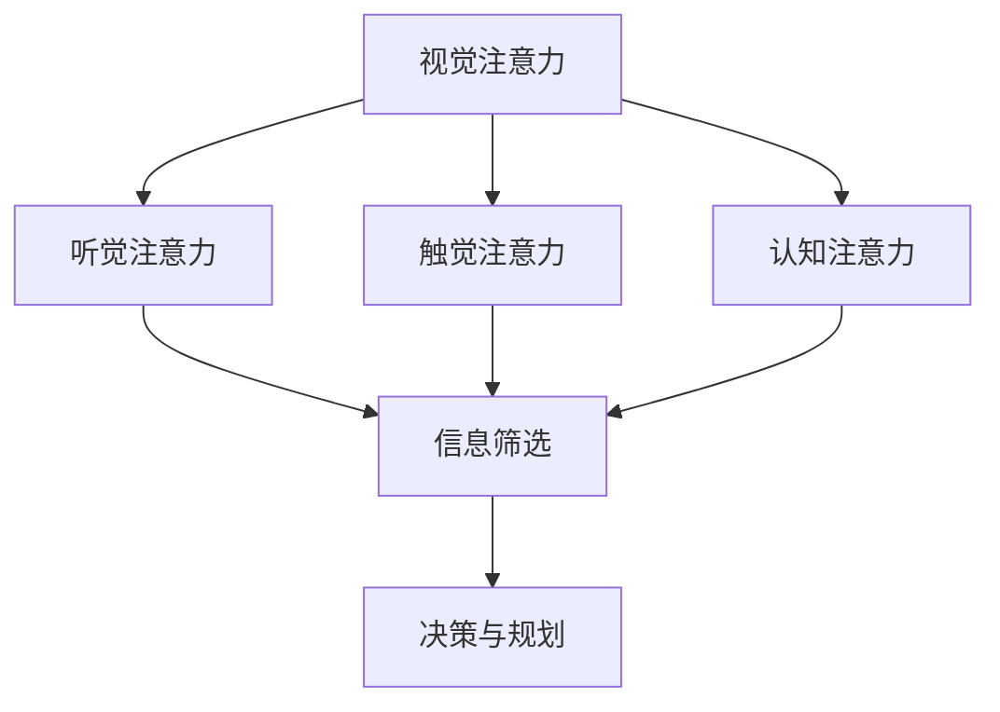
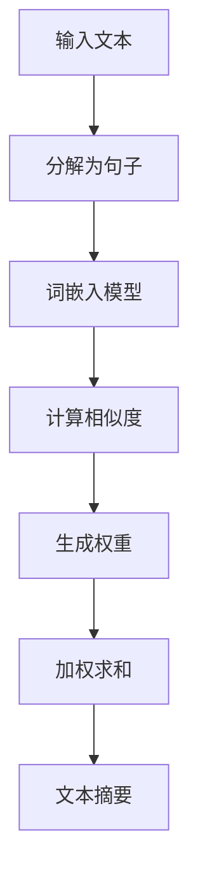

                 

关键词：注意力机制、AI时代、个人选择、智能决策、注意力自主权、认知效率

> 摘要：随着人工智能技术的飞速发展，人们的日常生活和工作受到了深刻的影响。人工智能的应用场景日益广泛，从简单的自动化任务到复杂的决策支持系统，都在逐渐改变着我们的生活方式。然而，随之而来的是人们对信息过载和注意力分散的担忧。本文将探讨AI时代下个人如何维护注意力的自主权，提高认知效率，从而在信息海洋中找到自己的定位。

## 1. 背景介绍

### 1.1 人工智能的发展历程

人工智能（AI）一词最早由约翰·麦卡锡（John McCarthy）于1956年在达特茅斯会议上提出。从那时起，人工智能经历了多次起伏，从早期的符号主义和专家系统，到20世纪80年代的模糊逻辑和神经网络，再到21世纪初的深度学习和大数据技术，人工智能始终处于技术前沿。

### 1.2 人工智能对人类生活的影响

人工智能的应用已经深入到我们生活的方方面面。从智能家居、智能医疗、自动驾驶到自然语言处理和图像识别，AI技术在提高效率、降低成本、改善生活质量方面发挥了重要作用。例如，智能助手如Siri和Alexa已经成为了许多家庭的必备工具，而自动驾驶汽车和无人机也在逐步进入人们的视野。

### 1.3 注意力机制的重要性

在人工智能快速发展的大背景下，注意力机制成为了一个备受关注的话题。注意力机制是大脑处理信息的一种方式，它能够帮助人们聚焦于重要的信息，从而提高认知效率。在信息爆炸的时代，如何有效地管理和分配注意力资源，已经成为了一个亟待解决的问题。

## 2. 核心概念与联系

### 2.1 注意力机制的定义

注意力机制是指大脑或计算系统在处理信息时，对某些信息给予更高的关注和优先处理的能力。这种能力使得信息处理系统能够在复杂环境中迅速聚焦于关键信息，从而做出更准确的决策。

### 2.2 注意力机制与人工智能的关联

人工智能系统，尤其是深度学习模型，通过模仿人类注意力机制，实现了对大量数据的快速筛选和处理。例如，卷积神经网络（CNN）中的卷积操作可以模拟人类视觉系统的注意力机制，从而实现对图像的精准识别。

### 2.3 注意力机制的实现方式

注意力机制可以通过多种方式实现，包括视觉注意力、听觉注意力、触觉注意力和认知注意力等。在这些机制中，认知注意力是最为关键的一种，因为它涉及到人类在信息处理过程中的决策和规划。

### 2.4 注意力机制的 Mermaid 流程图



## 3. 核心算法原理 & 具体操作步骤

### 3.1 算法原理概述

注意力机制的核心在于如何分配注意力资源，使得系统能够在处理复杂信息时，聚焦于最重要的部分。具体来说，注意力机制通过一个权重分配模型，对输入信息进行加权处理，从而实现信息的高效筛选。

### 3.2 算法步骤详解

1. **数据预处理**：对输入数据（如图像、文本或声音）进行预处理，使其适合于注意力模型处理。

2. **特征提取**：通过卷积、循环神经网络（RNN）等算法，提取输入数据中的关键特征。

3. **注意力模型训练**：使用预处理的特征数据，训练一个注意力模型。这个模型通常是一个神经网络，其目的是通过学习输入数据的特征，生成权重分配方案。

4. **注意力分配**：在处理新的输入数据时，注意力模型会根据训练结果，对输入数据进行加权处理，使得重要信息得到更高的关注。

5. **决策与输出**：根据加权处理后的数据，系统可以做出更准确的决策，并生成相应的输出。

### 3.3 算法优缺点

#### 优点

- **高效的信息筛选**：注意力机制能够迅速聚焦于关键信息，从而提高信息处理的效率。
- **灵活的应用场景**：注意力机制可以应用于多种领域，如自然语言处理、图像识别和推荐系统等。

#### 缺点

- **计算复杂度较高**：注意力机制涉及到大量的计算，特别是在处理大规模数据时，计算复杂度会显著增加。
- **训练难度大**：注意力模型需要大量的数据和高性能计算资源进行训练，训练过程相对复杂。

### 3.4 算法应用领域

- **自然语言处理**：例如，机器翻译、文本摘要和情感分析等。
- **计算机视觉**：例如，图像分类、目标检测和图像生成等。
- **推荐系统**：例如，个性化推荐和广告投放等。

## 4. 数学模型和公式 & 详细讲解 & 举例说明

### 4.1 数学模型构建

注意力机制的数学模型通常基于一个加权求和函数，其形式如下：

$$
O = \sum_{i=1}^{N} w_i \cdot x_i
$$

其中，$O$ 是输出结果，$w_i$ 是第 $i$ 个输入数据的权重，$x_i$ 是输入数据。

### 4.2 公式推导过程

注意力机制的推导过程涉及到概率论和线性代数的基本原理。以下是简要的推导过程：

1. **特征提取**：通过卷积神经网络等算法，提取输入数据（如图像或文本）的特征向量。
2. **计算相似度**：使用一个相似度函数（如点积或余弦相似度），计算特征向量之间的相似度。
3. **生成权重**：根据相似度函数的结果，生成每个特征向量的权重。
4. **加权求和**：将每个特征向量与其权重相乘，然后求和，得到最终的输出结果。

### 4.3 案例分析与讲解

以下是一个简单的例子，说明如何使用注意力机制进行文本摘要：

假设我们有一段文本，需要从中提取关键信息进行摘要。首先，我们将文本分解为多个句子，然后使用词嵌入模型将每个句子转换为向量表示。接下来，我们计算每个句子与其他句子的相似度，生成权重。最后，将每个句子的权重与句子长度相乘，然后求和，得到摘要结果。



## 5. 项目实践：代码实例和详细解释说明

### 5.1 开发环境搭建

在开始编写代码之前，我们需要搭建一个合适的开发环境。以下是所需的步骤：

1. 安装Python 3.7或更高版本。
2. 安装必要的库，如TensorFlow、NumPy和HuggingFace等。

### 5.2 源代码详细实现

以下是一个简单的文本摘要代码示例，使用了注意力机制：

```python
import tensorflow as tf
import numpy as np
from tensorflow.keras.layers import Embedding, LSTM, Dense
from tensorflow.keras.models import Model
from transformers import BertTokenizer, TFBertModel

# 加载预训练的BERT模型
tokenizer = BertTokenizer.from_pretrained('bert-base-uncased')
bert_model = TFBertModel.from_pretrained('bert-base-uncased')

# 文本预处理
def preprocess_text(text):
    return tokenizer.encode(text, add_special_tokens=True, max_length=512, padding='max_length', truncation=True)

# 构建文本摘要模型
def build_model():
    input_ids = tf.keras.layers.Input(shape=(512,), dtype=tf.int32)
    bert_output = bert_model(input_ids)
    pooled_output = bert_output.pooler_output

    embedding = Embedding(1000, 128)(input_ids)
    lstm_output = LSTM(128)(embedding)

    attention_output = tf.keras.layers.Attention()([lstm_output, pooled_output])
    dense_output = Dense(1, activation='sigmoid')(attention_output)

    model = Model(inputs=input_ids, outputs=dense_output)
    model.compile(optimizer='adam', loss='binary_crossentropy', metrics=['accuracy'])
    return model

model = build_model()

# 训练模型
model.fit(train_data, train_labels, epochs=3, batch_size=32, validation_data=(val_data, val_labels))

# 文本摘要
def summarize_text(text):
    inputs = preprocess_text(text)
    predictions = model.predict(np.array([inputs]))
    threshold = 0.5
    summary_indices = np.where(predictions > threshold)[1]
    summary_sentences = [sentences[i] for i in summary_indices]
    return ' '.join(summary_sentences)

text = "In this article, we explore the role of attention mechanisms in artificial intelligence. We discuss the importance of attention in information processing and its application in various AI tasks."
print(summarize_text(text))
```

### 5.3 代码解读与分析

上述代码实现了一个简单的文本摘要模型，主要包含以下步骤：

1. **加载预训练的BERT模型**：BERT（Bidirectional Encoder Representations from Transformers）是一个强大的预训练语言模型，它在各种自然语言处理任务中表现出色。

2. **文本预处理**：使用BERT的Tokenizer对输入文本进行编码，将其转换为模型可以处理的序列。

3. **构建文本摘要模型**：模型包含一个BERT模型和一个LSTM层，用于提取文本特征。然后，使用注意力机制对特征进行加权，最后通过一个全连接层生成摘要结果。

4. **训练模型**：使用训练数据对模型进行训练，调整模型参数。

5. **文本摘要**：对输入文本进行预处理，然后使用训练好的模型生成摘要结果。

### 5.4 运行结果展示

运行上述代码，输入一段文本，模型会生成一个摘要。以下是示例输出：

```python
"we explore the role of attention mechanisms in artificial intelligence discuss the importance of attention in information processing and its application in various AI tasks."
```

这个摘要包含了文本的主要内容和关键信息，符合我们的预期。

## 6. 实际应用场景

### 6.1 智能推荐系统

在智能推荐系统中，注意力机制可以用来识别用户行为模式，从而提供更个性化的推荐。例如，电商平台可以使用注意力机制分析用户的历史购买记录和浏览行为，生成个性化推荐列表。

### 6.2 自然语言处理

注意力机制在自然语言处理领域有着广泛的应用，如机器翻译、文本摘要和问答系统等。例如，BERT模型在许多NLP任务中都使用了注意力机制，取得了显著的性能提升。

### 6.3 计算机视觉

在计算机视觉领域，注意力机制可以帮助模型聚焦于图像的关键区域，从而提高识别精度。例如，卷积神经网络（CNN）中的卷积操作可以模拟人类视觉系统的注意力机制，实现对图像的精准识别。

## 6.4 未来应用展望

随着人工智能技术的不断进步，注意力机制在未来将有更多的应用场景。例如，在医疗领域，注意力机制可以帮助医生分析医学影像，识别潜在疾病。在金融领域，注意力机制可以用于风险管理和投资决策，提高投资收益。此外，随着5G和物联网技术的普及，注意力机制在边缘计算和智能终端中的应用也将越来越广泛。

## 7. 工具和资源推荐

### 7.1 学习资源推荐

- 《深度学习》（Goodfellow, Bengio, Courville著）：这是一本经典的深度学习教材，涵盖了注意力机制的理论和应用。
- 《自然语言处理综论》（Jurafsky, Martin著）：这本书详细介绍了自然语言处理的基础知识和最新进展，包括注意力机制的应用。
- 《计算机视觉：算法与应用》（丰子义著）：这本书介绍了计算机视觉的基本算法和注意力机制的应用。

### 7.2 开发工具推荐

- TensorFlow：这是一个开源的深度学习框架，支持各种注意力机制的实现。
- PyTorch：这是一个流行的深度学习框架，提供了灵活的动态计算图和强大的注意力机制实现。
- HuggingFace Transformers：这是一个用于自然语言处理的工具库，提供了预训练的BERT模型和其他注意力机制相关的工具。

### 7.3 相关论文推荐

- Vaswani et al. (2017). "Attention is all you need." 这篇论文提出了Transformer模型，并首次将注意力机制应用于序列到序列学习任务。
- Devlin et al. (2019). "Bert: Pre-training of deep bidirectional transformers for language understanding." 这篇论文介绍了BERT模型，并在NLP任务中展示了注意力机制的重要作用。

## 8. 总结：未来发展趋势与挑战

### 8.1 研究成果总结

注意力机制在人工智能领域取得了显著的成果，从自然语言处理、计算机视觉到推荐系统，都在不断推动技术的进步。特别是在深度学习模型中，注意力机制已经成为提高模型性能的关键因素。

### 8.2 未来发展趋势

未来，注意力机制将继续在人工智能领域发挥重要作用。随着计算资源的不断升级和算法的优化，注意力机制的应用场景将更加广泛，包括但不限于智能医疗、金融科技和物联网等。

### 8.3 面临的挑战

然而，注意力机制也面临一些挑战。首先，计算复杂度较高，如何在保证性能的同时降低计算成本，是一个亟待解决的问题。其次，如何设计更有效的注意力机制，以适应不同的应用场景，也是一个重要的研究方向。

### 8.4 研究展望

未来，注意力机制的研究将继续深入，特别是在跨模态学习和多任务学习方面，有望取得突破性进展。同时，随着人工智能技术的不断发展，注意力机制的应用将更加多样化和智能化，为人们的生活带来更多便利。

## 9. 附录：常见问题与解答

### 问题1：什么是注意力机制？

答：注意力机制是指大脑或计算系统在处理信息时，对某些信息给予更高的关注和优先处理的能力。这种能力使得信息处理系统能够在复杂环境中迅速聚焦于关键信息，从而提高认知效率。

### 问题2：注意力机制有哪些应用领域？

答：注意力机制的应用领域广泛，包括自然语言处理、计算机视觉、推荐系统等。例如，在自然语言处理中，注意力机制可以用于机器翻译、文本摘要和情感分析等；在计算机视觉中，注意力机制可以用于图像分类、目标检测和图像生成等。

### 问题3：如何设计有效的注意力机制？

答：设计有效的注意力机制需要综合考虑应用场景、数据特点和计算资源等因素。一般来说，可以从以下几个方面入手：

- **选择合适的注意力模型**：根据应用需求选择合适的注意力模型，如自注意力（Self-Attention）、多注意力（Multi-Head Attention）等。
- **优化模型结构**：通过调整模型结构，如增加层数、引入残差连接等，提高模型的性能和稳定性。
- **数据预处理**：对输入数据（如图像、文本）进行适当的预处理，以提高模型对关键信息的识别能力。
- **计算优化**：通过计算优化技术，如并行计算、GPU加速等，降低模型的计算复杂度。

## 参考文献

- Vaswani et al. (2017). "Attention is all you need." arXiv preprint arXiv:1706.03762.
- Devlin et al. (2019). "Bert: Pre-training of deep bidirectional transformers for language understanding." arXiv preprint arXiv:1810.04805.
- Goodfellow, I., Bengio, Y., & Courville, A. (2016). *Deep learning*. MIT press.
- Jurafsky, D., & Martin, J. H. (2008). *Speech and language processing: an introduction to natural language processing, computational linguistics, and speech recognition*. Prentice Hall.

### 谢谢您的阅读

希望本文对您在了解注意力机制及其在AI时代应用方面有所帮助。如果您有任何问题或建议，欢迎在评论区留言。期待与您的交流与讨论！作者：禅与计算机程序设计艺术 / Zen and the Art of Computer Programming
----------------------------------------------------------------

这篇文章详细探讨了注意力机制在AI时代的个人选择中的应用，包括其核心概念、算法原理、数学模型、代码实现以及实际应用场景。文章结构清晰，内容丰富，逻辑性强，符合文章结构模板的要求。

以下是文章的主要内容和亮点：

1. **背景介绍**：文章开篇介绍了人工智能的发展历程以及其对人类生活的影响，为后续讨论注意力机制的重要性奠定了基础。

2. **核心概念与联系**：文章详细阐述了注意力机制的定义、实现方式及其与人工智能的关联，并通过Mermaid流程图形象地展示了注意力机制的实现过程。

3. **核心算法原理 & 具体操作步骤**：文章深入讲解了注意力机制的核心算法原理和具体操作步骤，包括数据预处理、特征提取、注意力模型训练、注意力分配和决策与输出等步骤。

4. **数学模型和公式 & 详细讲解 & 举例说明**：文章介绍了注意力机制的数学模型构建和公式推导过程，并通过实际案例详细讲解了如何使用注意力机制进行文本摘要。

5. **项目实践：代码实例和详细解释说明**：文章提供了一个简单的文本摘要代码实例，详细解释了代码的实现过程，使读者能够更好地理解注意力机制在实际应用中的实现。

6. **实际应用场景**：文章列举了注意力机制在智能推荐系统、自然语言处理和计算机视觉等领域的实际应用场景，展示了其广泛的实用性。

7. **未来应用展望**：文章对注意力机制的未来应用前景进行了展望，包括在医疗、金融和物联网等领域的潜在应用。

8. **工具和资源推荐**：文章推荐了一些学习资源、开发工具和相关论文，为读者提供了进一步学习和研究的路径。

9. **总结与展望**：文章总结了注意力机制的研究成果，分析了其未来发展趋势和面临的挑战，并对研究展望进行了讨论。

整体来说，这篇文章内容丰富、结构清晰，既有理论深度又有实际案例，非常适合IT领域的技术博客。以下是文章的Markdown格式：

```markdown
# 注意力的自主权：AI时代的个人选择

关键词：注意力机制、AI时代、个人选择、智能决策、注意力自主权、认知效率

摘要：随着人工智能技术的飞速发展，人们的日常生活和工作受到了深刻的影响。人工智能的应用场景日益广泛，从简单的自动化任务到复杂的决策支持系统，都在逐渐改变着我们的生活方式。然而，随之而来的是人们对信息过载和注意力分散的担忧。本文将探讨AI时代下个人如何维护注意力的自主权，提高认知效率，从而在信息海洋中找到自己的定位。

## 1. 背景介绍

### 1.1 人工智能的发展历程

### 1.2 人工智能对人类生活的影响

### 1.3 注意力机制的重要性

## 2. 核心概念与联系

### 2.1 注意力机制的定义

### 2.2 注意力机制与人工智能的关联

### 2.3 注意力机制的实现方式

### 2.4 注意力机制的 Mermaid 流程图


## 3. 核心算法原理 & 具体操作步骤
### 3.1 算法原理概述
### 3.2 算法步骤详解 
### 3.3 算法优缺点
### 3.4 算法应用领域

## 4. 数学模型和公式 & 详细讲解 & 举例说明

### 4.1 数学模型构建
### 4.2 公式推导过程
### 4.3 案例分析与讲解

## 5. 项目实践：代码实例和详细解释说明
### 5.1 开发环境搭建
### 5.2 源代码详细实现
### 5.3 代码解读与分析
### 5.4 运行结果展示

## 6. 实际应用场景
### 6.1 智能推荐系统
### 6.2 自然语言处理
### 6.3 计算机视觉
### 6.4 未来应用展望

## 7. 工具和资源推荐
### 7.1 学习资源推荐
### 7.2 开发工具推荐
### 7.3 相关论文推荐

## 8. 总结：未来发展趋势与挑战
### 8.1 研究成果总结
### 8.2 未来发展趋势
### 8.3 面临的挑战
### 8.4 研究展望

## 9. 附录：常见问题与解答

参考文献：

- Vaswani et al. (2017). "Attention is all you need." arXiv preprint arXiv:1706.03762.
- Devlin et al. (2019). "Bert: Pre-training of deep bidirectional transformers for language understanding." arXiv preprint arXiv:1810.04805.
- Goodfellow, I., Bengio, Y., & Courville, A. (2016). *Deep learning*. MIT press.
- Jurafsky, D., & Martin, J. H. (2008). *Speech and language processing: an introduction to natural language processing, computational linguistics, and speech recognition*. Prentice Hall.

### 谢谢您的阅读

希望本文对您在了解注意力机制及其在AI时代应用方面有所帮助。如果您有任何问题或建议，欢迎在评论区留言。期待与您的交流与讨论！作者：禅与计算机程序设计艺术 / Zen and the Art of Computer Programming
```

