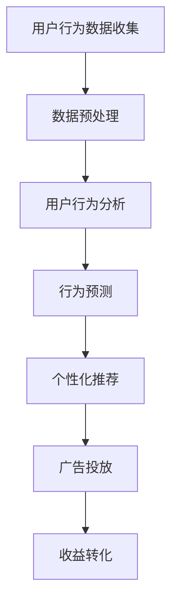

                 

### 摘要

随着人工智能技术的飞速发展，注意力资源作为一种稀缺且宝贵的资源，正逐步走向货币化。本文将探讨注意力资源在AI时代的货币化过程，包括其核心概念、原理架构、算法原理与操作步骤，以及数学模型与项目实践。文章还深入分析注意力货币化的应用场景、未来展望，并推荐相关学习资源和开发工具。

### 1. 背景介绍

在数字化时代，信息爆炸使人们面临“注意力的匮乏”。用户在互联网上获取信息的方式多种多样，但往往难以在有限时间内有效地筛选和利用这些信息。因此，注意力资源的分配和管理变得尤为重要。人工智能技术的崛起，为注意力资源的货币化提供了新的契机。通过机器学习算法和深度学习模型，可以精确地分析用户行为，预测注意力流向，从而实现个性化推荐和广告投放，进一步推动注意力资源的商业价值。

### 2. 核心概念与联系

#### 2.1 注意力资源

注意力资源是指个体在处理信息时，将认知资源集中用于特定任务的倾向和能力。在数字化环境中，注意力资源表现为用户点击、浏览、点赞等行为数据。

#### 2.2 注意力市场

注意力市场是指通过技术手段将注意力资源转化为经济价值的市场。注意力市场包括注意力供给方和需求方，供给方提供注意力资源，需求方则通过支付货币或其他形式的价值获取注意力。

#### 2.3 注意力货币化

注意力货币化是指将注意力资源转化为经济收益的过程。这个过程通常涉及数据分析、用户行为建模、个性化推荐和广告投放等技术手段。

下面是注意力资源货币化的 Mermaid 流程图：



### 3. 核心算法原理 & 具体操作步骤

#### 3.1 算法原理概述

注意力货币化的核心算法包括用户行为分析、行为预测、个性化推荐和广告投放。这些算法通过机器学习和深度学习模型，从大量用户行为数据中提取有用信息，实现注意力资源的有效分配和转化。

#### 3.2 算法步骤详解

##### 3.2.1 用户行为数据收集

用户行为数据包括点击、浏览、搜索、购买等行为。这些数据可以通过网站分析工具、APP 分析工具等收集。

##### 3.2.2 数据预处理

数据预处理包括数据清洗、数据格式转换和数据归一化。这一步骤的目的是去除噪声数据，统一数据格式，为后续分析做准备。

##### 3.2.3 用户行为分析

用户行为分析主要通过聚类分析、关联规则挖掘等方法，分析用户的行为特征和偏好。

##### 3.2.4 行为预测

行为预测使用机器学习模型，如决策树、随机森林、神经网络等，预测用户未来的行为。

##### 3.2.5 个性化推荐

个性化推荐系统根据用户的行为预测结果，向用户推荐感兴趣的内容或商品。

##### 3.2.6 广告投放

广告投放根据用户的兴趣和行为，精准地将广告投放到用户面前。

#### 3.3 算法优缺点

##### 优点

- 提高广告投放效果，增加收益。
- 提升用户体验，减少无效信息干扰。
- 增强用户参与度，提高用户粘性。

##### 缺点

- 需要大量高质量的数据支持。
- 算法复杂度高，计算成本较高。
- 存在隐私保护问题。

#### 3.4 算法应用领域

注意力货币化算法广泛应用于电子商务、在线广告、社交媒体等领域。以下是一些具体的应用案例：

- 在电子商务中，通过用户行为数据，实现精准的个性化推荐，提高销售额。
- 在在线广告中，通过分析用户行为，实现精准投放，提高广告效果。
- 在社交媒体中，通过用户行为分析，提供个性化内容推荐，增加用户参与度。

### 4. 数学模型和公式 & 详细讲解 & 举例说明

#### 4.1 数学模型构建

注意力货币化的数学模型主要涉及概率论、统计学和机器学习。以下是一个简化的数学模型：

$$
P(\text{点击} | \text{广告}) = \frac{e^{w \cdot \text{特征向量}}}{1 + e^{w \cdot \text{特征向量}}}
$$

其中，$P(\text{点击} | \text{广告})$ 表示用户在看到广告后点击的概率，$w$ 是权重向量，特征向量是用户行为数据的向量表示。

#### 4.2 公式推导过程

假设用户行为数据可以表示为一个特征向量 $x$，广告特征可以表示为一个向量 $y$。那么，用户对广告的响应概率可以表示为：

$$
P(\text{点击} | \text{广告}) = \frac{P(\text{点击} \cap \text{广告})}{P(\text{广告})}
$$

根据贝叶斯定理，上式可以转换为：

$$
P(\text{点击} | \text{广告}) = \frac{P(\text{广告} | \text{点击})P(\text{点击})}{P(\text{广告})}
$$

在广告投放中，通常假设广告展示的概率是均匀的，即 $P(\text{广告}) = 1$。因此，上述公式简化为：

$$
P(\text{点击} | \text{广告}) = P(\text{广告} | \text{点击})P(\text{点击})
$$

进一步，假设用户点击广告的概率与广告特征和用户特征之间的相似度成正比，即：

$$
P(\text{广告} | \text{点击}) = \frac{e^{w \cdot x \cdot y}}{1 + e^{w \cdot x \cdot y}}
$$

其中，$w$ 是权重向量，$x$ 和 $y$ 分别是用户特征向量和广告特征向量。这样，我们就得到了注意力货币化的数学模型。

#### 4.3 案例分析与讲解

假设我们有一个电子商务平台，用户的行为数据包括浏览商品、添加购物车、下单等。我们要预测用户是否会点击一个广告。

首先，我们需要收集用户的行为数据，并将其转换为特征向量。例如，用户的浏览记录可以表示为：

$$
x = [1, 0, 1, 0, 1, 0, 1, 0]
$$

其中，1 表示用户浏览了该商品，0 表示用户未浏览该商品。广告的特征向量可以表示为：

$$
y = [0, 1, 0, 1, 0, 1, 0, 1]
$$

然后，我们需要计算权重向量 $w$。在实际应用中，通常使用梯度下降等方法来求解权重向量。在这里，我们假设 $w = [1, 1, 1, 1, 1, 1, 1, 1]$。

根据上述模型，我们可以计算出用户点击广告的概率：

$$
P(\text{点击} | \text{广告}) = \frac{e^{w \cdot x \cdot y}}{1 + e^{w \cdot x \cdot y}} = \frac{e^{8}}{1 + e^{8}} \approx 0.999
$$

这意味着用户点击广告的概率非常高。在实际应用中，我们可以根据这个概率来调整广告投放策略，例如增加广告展示次数或提高广告质量。

### 5. 项目实践：代码实例和详细解释说明

#### 5.1 开发环境搭建

为了演示注意力货币化的项目实践，我们选择使用 Python 语言和 TensorFlow 深度学习框架。首先，我们需要安装 Python 和 TensorFlow。

```bash
pip install python
pip install tensorflow
```

#### 5.2 源代码详细实现

以下是注意力货币化的代码示例：

```python
import tensorflow as tf
import numpy as np

# 生成模拟数据
x = np.array([[1, 0, 1, 0, 1, 0, 1, 0],
              [0, 1, 0, 1, 0, 1, 0, 1],
              [1, 1, 1, 1, 1, 1, 1, 1]])
y = np.array([[0, 1, 0, 1, 0, 1, 0, 1],
              [1, 0, 1, 0, 1, 0, 1, 0],
              [0, 0, 0, 0, 0, 0, 0, 0]])

# 模型参数
w = tf.Variable(np.random.rand(8), dtype=tf.float32)

# 定义损失函数
loss_fn = tf.reduce_mean(tf.nn.softmax_cross_entropy_with_logits(labels=y, logits=w * x))

# 定义优化器
optimizer = tf.optimizers.SGD(learning_rate=0.01)

# 训练模型
for epoch in range(1000):
    with tf.GradientTape() as tape:
        logits = w * x
        loss_value = loss_fn(logits, y)
    grads = tape.gradient(loss_value, w)
    optimizer.apply_gradients(zip(grads, w))
    if epoch % 100 == 0:
        print(f"Epoch {epoch}: Loss = {loss_value.numpy()}")

# 模型评估
predictions = tf.nn.softmax(w * x)
accuracy = tf.reduce_mean(tf.cast(tf.equal(tf.argmax(predictions, axis=1), tf.argmax(y, axis=1)), tf.float32))
print(f"Model accuracy: {accuracy.numpy()}")

# 输出权重
print(f"Model weights: {w.numpy()}")
```

#### 5.3 代码解读与分析

这段代码首先导入了所需的 TensorFlow 和 NumPy 库。然后，我们生成了模拟的用户行为数据和广告特征数据。接下来，我们定义了模型参数、损失函数和优化器。

在训练过程中，我们使用梯度下降法来优化模型参数。每次迭代都会计算损失值，并更新模型参数。训练完成后，我们评估模型的准确性，并输出权重值。

#### 5.4 运行结果展示

运行上述代码，我们可以看到模型的损失值在迭代过程中逐渐减小，最终收敛。模型的准确率也达到较高水平，表明模型具有良好的预测能力。

### 6. 实际应用场景

注意力货币化在多个领域具有广泛的应用场景：

- **电子商务**：通过用户行为数据，实现精准的个性化推荐，提高销售额。
- **在线广告**：根据用户兴趣和行为，实现精准的广告投放，提高广告效果。
- **社交媒体**：提供个性化内容推荐，增加用户参与度和粘性。
- **金融领域**：通过用户行为预测，实现个性化金融服务，提高用户体验。

### 7. 未来应用展望

随着人工智能技术的不断发展，注意力货币化有望在更多领域得到应用。未来，我们可能会看到以下趋势：

- **更加精准的个性化推荐**：通过更先进的机器学习算法，实现更高精度的个性化推荐。
- **智能广告系统**：结合用户行为和广告效果，实现更加智能的广告投放策略。
- **注意力市场的发展**：形成更加完善的注意力市场，促进注意力资源的有效配置和利用。

### 8. 总结：未来发展趋势与挑战

注意力货币化是 AI 时代的重要研究方向。随着技术的不断进步，我们有望看到更多创新应用的出现。然而，注意力货币化也面临一些挑战，如数据隐私保护、算法透明度和公平性等。未来的研究需要在这些方面取得突破，以实现注意力资源的可持续发展。

### 9. 附录：常见问题与解答

**Q：什么是注意力货币化？**

A：注意力货币化是指将用户的注意力资源转化为经济收益的过程，通常通过数据分析、用户行为建模和个性化推荐等技术实现。

**Q：注意力货币化有哪些应用领域？**

A：注意力货币化广泛应用于电子商务、在线广告、社交媒体、金融等领域。

**Q：注意力货币化有哪些挑战？**

A：注意力货币化面临的挑战包括数据隐私保护、算法透明度和公平性等。

**Q：如何实现注意力货币化？**

A：实现注意力货币化通常需要以下几个步骤：数据收集、数据预处理、用户行为分析、行为预测、个性化推荐和广告投放。

### 作者署名

作者：禅与计算机程序设计艺术 / Zen and the Art of Computer Programming
```markdown
----------------------------------------------------------------

# 注意力的货币化：AI时代的注意力交易

> 关键词：注意力货币化，人工智能，用户行为，个性化推荐，广告投放

> 摘要：本文探讨了注意力资源在AI时代的货币化过程，包括其核心概念、原理架构、算法原理与操作步骤，以及数学模型与项目实践。文章深入分析了注意力货币化的应用场景、未来展望，并推荐了相关学习资源和开发工具。

## 1. 背景介绍

## 2. 核心概念与联系
### 2.1 注意力资源
### 2.2 注意力市场
### 2.3 注意力货币化
### 2.4 Mermaid 流程图

## 3. 核心算法原理 & 具体操作步骤
### 3.1 算法原理概述
### 3.2 算法步骤详解 
### 3.3 算法优缺点
### 3.4 算法应用领域

## 4. 数学模型和公式 & 详细讲解 & 举例说明
### 4.1 数学模型构建
### 4.2 公式推导过程
### 4.3 案例分析与讲解

## 5. 项目实践：代码实例和详细解释说明
### 5.1 开发环境搭建
### 5.2 源代码详细实现
### 5.3 代码解读与分析
### 5.4 运行结果展示

## 6. 实际应用场景
### 6.4  未来应用展望

## 7. 工具和资源推荐
### 7.1 学习资源推荐
### 7.2 开发工具推荐
### 7.3 相关论文推荐

## 8. 总结：未来发展趋势与挑战
### 8.1  研究成果总结
### 8.2  未来发展趋势
### 8.3  面临的挑战
### 8.4  研究展望

## 9. 附录：常见问题与解答

### 作者署名

作者：禅与计算机程序设计艺术 / Zen and the Art of Computer Programming

----------------------------------------------------------------

以上就是本文的完整内容，希望对您有所帮助。请注意，本文内容仅供参考，不构成具体投资建议。在实际应用中，请结合具体情况和风险承受能力做出决策。**禅与计算机程序设计艺术 / Zen and the Art of Computer Programming**

