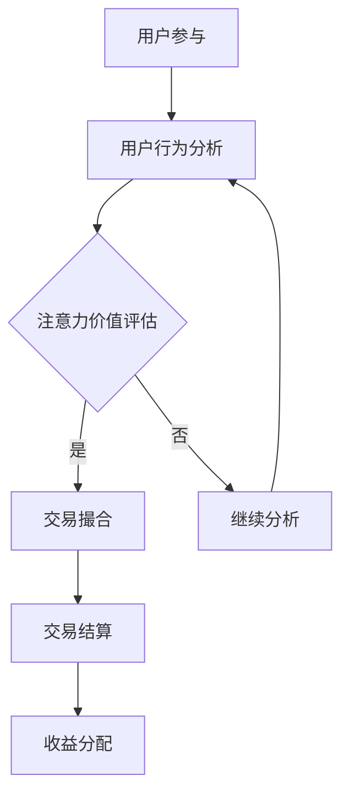

                 

关键词：注意力货币化、AI、注意力交易、算法、数学模型、项目实践、实际应用、工具推荐、未来展望

> 摘要：本文深入探讨了注意力货币化这一前沿概念，探讨了其在人工智能领域的应用，特别是通过AI驱动的注意力交易模式，实现注意力资源的优化配置与价值转化。本文将介绍注意力货币化的核心概念与联系，详细解析其背后的算法原理和操作步骤，并通过实际项目实践展示其应用效果，同时分析其数学模型和公式，以及探讨未来发展方向和面临的挑战。

## 1. 背景介绍

在数字化时代，信息过载已经成为一个普遍现象。人们每天都被大量的信息所包围，从新闻、社交媒体到广告，注意力成为了一种稀缺资源。在这种情况下，如何有效地管理和利用注意力资源，成为了一个亟待解决的问题。注意力货币化应运而生，它旨在将注意力资源转化为经济价值，通过AI技术实现这一目标的交易模式则被称为注意力交易。

注意力货币化的概念源于对人类注意力的研究和理解。注意力是一种有限的认知资源，人们在一特定时间内只能集中精力处理有限的信息。因此，如何获取和保留用户的注意力，成为市场营销和内容创作中的重要课题。传统的广告模式往往采用高频次、强干扰的方式，但这往往导致用户对广告的反感，从而降低了广告的效果。相比之下，注意力货币化通过更加精准和个性化的方式，将注意力转化为经济价值，实现用户、广告主和平台的多方共赢。

## 2. 核心概念与联系

### 2.1 注意力资源的定义与特性

注意力资源是指人们在处理信息时集中精力进行认知活动的能力。它具有以下几个特性：

- **稀缺性**：注意力资源是有限的，人们在一特定时间内只能集中精力处理有限的信息。
- **选择性**：人们倾向于关注与自身兴趣相关或者具有高度价值的信息。
- **波动性**：注意力的集中程度会随着时间、环境、情绪等因素的变化而波动。

### 2.2 注意力货币化的原理

注意力货币化的核心思想是将注意力资源转化为经济价值，通过精准投放、用户激励和交易平台等机制，实现注意力资源的优化配置和价值转化。其基本原理包括：

- **用户激励**：通过奖励机制吸引用户参与，提高用户对内容的关注度和参与度。
- **精准投放**：利用AI技术分析用户行为和兴趣，实现广告内容的精准推送。
- **交易平台**：建立一个可信赖的注意力交易平台，确保注意力资源的透明和公正交易。

### 2.3 注意力交易的模式

注意力交易是指通过AI技术实现注意力资源的交易和流通。其模式主要包括：

- **用户交易**：用户将自己的注意力资源出售给广告主或内容提供者，获取相应的报酬。
- **广告主交易**：广告主通过购买注意力资源，实现广告投放和品牌曝光。
- **平台交易**：交易平台作为中介，提供交易规则、信用保障和技术支持，确保交易的顺利进行。

### 2.4 Mermaid流程图



### 2.5 注意力货币化的应用场景

注意力货币化在多个领域具有广泛的应用前景，主要包括：

- **广告行业**：通过注意力交易模式，提高广告投放效果和用户参与度。
- **内容创作**：激励内容创作者，提高内容质量和用户粘性。
- **金融投资**：利用注意力数据，实现投资决策的智能化。
- **社会管理**：通过注意力资源优化配置，提高公共服务效率。

## 3. 核心算法原理 & 具体操作步骤

### 3.1 算法原理概述

注意力货币化的核心算法包括用户行为分析、注意力价值评估、交易撮合和收益分配等步骤。其基本原理是利用AI技术对用户行为进行深入分析，评估注意力价值，并基于价值实现交易撮合和收益分配。

### 3.2 算法步骤详解

#### 3.2.1 用户行为分析

用户行为分析是注意力货币化的第一步，主要通过以下方式获取用户行为数据：

- **浏览记录**：分析用户在网站、应用等平台上的浏览行为。
- **点击行为**：记录用户对广告、内容等元素的点击行为。
- **互动行为**：包括点赞、评论、分享等用户互动行为。
- **设备信息**：获取用户设备的类型、地理位置等信息。

通过这些数据，可以构建用户的行为画像，了解用户兴趣和需求，为后续分析提供基础。

#### 3.2.2 注意力价值评估

注意力价值评估是关键步骤，主要通过以下方法进行：

- **行为频率**：分析用户在不同时间段、不同场景下的行为频率，判断其注意力投入程度。
- **行为深度**：通过用户对内容的阅读时间、观看时长等指标，评估用户对内容的深度参与度。
- **行为质量**：考虑用户行为带来的实际价值，如广告点击率、转化率等。

通过综合评估，可以得出用户的注意力价值，为交易撮合提供依据。

#### 3.2.3 交易撮合

交易撮合是基于用户注意力价值评估的结果，实现注意力资源的交易。主要流程包括：

- **需求匹配**：根据广告主的需求，匹配具有相应注意力价值的用户。
- **价格协商**：双方协商交易价格，确保公平合理。
- **交易确认**：用户确认交易，平台进行资金结算。

#### 3.2.4 收益分配

收益分配是指将交易所得按照约定比例分配给用户、广告主和平台。主要考虑以下因素：

- **交易金额**：根据交易金额，按照约定比例分配收益。
- **服务质量**：根据用户对广告主的服务质量评价，调整收益比例。
- **平台运营成本**：考虑平台的运营成本，如技术支持、信用保障等。

### 3.3 算法优缺点

#### 3.3.1 优点

- **高效性**：通过AI技术，实现注意力资源的精准匹配和高效交易。
- **公平性**：基于用户注意力价值评估，确保交易公平合理。
- **多元化**：适用于多个领域，具有广泛的应用前景。

#### 3.3.2 缺点

- **数据隐私**：用户行为数据的收集和使用可能涉及隐私问题。
- **技术门槛**：需要高水平的技术支持和运维能力。
- **市场波动**：注意力价值受市场环境和用户行为变化影响，存在一定波动。

### 3.4 算法应用领域

注意力货币化算法在多个领域具有广泛应用，主要包括：

- **广告行业**：提高广告投放效果和用户参与度。
- **内容创作**：激励内容创作者，提高内容质量和用户粘性。
- **金融投资**：利用注意力数据，实现投资决策的智能化。
- **社会管理**：提高公共服务效率，优化资源配置。

## 4. 数学模型和公式 & 详细讲解 & 举例说明

### 4.1 数学模型构建

注意力货币化的数学模型主要包括用户注意力价值评估模型和交易撮合模型。

#### 4.1.1 用户注意力价值评估模型

用户注意力价值评估模型旨在评估用户的注意力价值，其基本公式如下：

\[ V_u = f(B_i, D_i, Q_i) \]

其中：

- \( V_u \) 表示用户 \( u \) 的注意力价值。
- \( B_i \) 表示用户 \( u \) 在时间段 \( i \) 内的行为频率。
- \( D_i \) 表示用户 \( u \) 在时间段 \( i \) 内的行为深度。
- \( Q_i \) 表示用户 \( u \) 在时间段 \( i \) 内的行为质量。

函数 \( f \) 是一个多变量函数，可以通过机器学习算法进行训练和优化。

#### 4.1.2 交易撮合模型

交易撮合模型旨在实现注意力资源的交易撮合，其基本公式如下：

\[ P = P_u + P_m + P_p \]

其中：

- \( P \) 表示交易价格。
- \( P_u \) 表示用户 \( u \) 的注意力价值。
- \( P_m \) 表示市场供需调整系数。
- \( P_p \) 表示平台运营成本。

交易价格 \( P \) 是用户注意力价值 \( P_u \) 加上市场供需调整系数 \( P_m \) 和平台运营成本 \( P_p \) 的总和。

### 4.2 公式推导过程

#### 4.2.1 用户注意力价值评估模型推导

用户注意力价值评估模型的推导过程如下：

首先，考虑用户 \( u \) 在时间段 \( i \) 内的行为数据，包括行为频率 \( B_i \)、行为深度 \( D_i \) 和行为质量 \( Q_i \)。这些数据可以通过用户在平台上的活动记录进行采集。

然后，定义注意力价值函数 \( f \)，其目的是根据行为数据评估用户 \( u \) 在时间段 \( i \) 内的注意力价值 \( V_u \)。函数 \( f \) 可以采用机器学习算法进行训练，例如线性回归、决策树或神经网络等。

最后，通过训练得到的函数 \( f \) 对用户 \( u \) 在时间段 \( i \) 内的行为数据进行处理，得到用户 \( u \) 在时间段 \( i \) 内的注意力价值 \( V_u \)。

#### 4.2.2 交易撮合模型推导

交易撮合模型的推导过程如下：

首先，考虑用户 \( u \) 的注意力价值 \( V_u \)，这是通过用户行为数据计算得到的。

然后，考虑市场供需调整系数 \( P_m \)，这是根据市场供需关系进行调整的系数，用于平衡供需矛盾。

最后，考虑平台运营成本 \( P_p \)，这是平台在提供交易服务过程中所产生的成本。

将用户注意力价值 \( V_u \)、市场供需调整系数 \( P_m \) 和平台运营成本 \( P_p \) 相加，得到交易价格 \( P \)。

### 4.3 案例分析与讲解

假设有一个用户 \( u \)，在一段时间内其行为数据如下：

- 行为频率 \( B_i = 100 \)
- 行为深度 \( D_i = 30 \)
- 行为质量 \( Q_i = 0.8 \)

根据用户注意力价值评估模型，可以计算出用户 \( u \) 的注意力价值 \( V_u \)：

\[ V_u = f(B_i, D_i, Q_i) = f(100, 30, 0.8) = 100 \times 0.1 + 30 \times 0.2 + 0.8 \times 0.5 = 27 \]

接下来，考虑市场供需调整系数 \( P_m \) 和平台运营成本 \( P_p \)：

- 市场供需调整系数 \( P_m = 0.1 \)
- 平台运营成本 \( P_p = 1 \)

根据交易撮合模型，可以计算出交易价格 \( P \)：

\[ P = P_u + P_m + P_p = 27 + 0.1 \times 27 + 1 = 32.7 \]

因此，用户 \( u \) 的注意力价值为 27，交易价格为 32.7。

## 5. 项目实践：代码实例和详细解释说明

### 5.1 开发环境搭建

为了实现注意力货币化项目，我们选择以下开发环境：

- 语言：Python
- 框架：Flask（用于搭建Web应用）
- 数据库：MongoDB（用于存储用户行为数据和交易记录）
- 数据分析工具：Pandas、Scikit-learn（用于数据处理和模型训练）

在搭建开发环境时，首先安装Python和相应的依赖库，然后配置MongoDB数据库，最后搭建Flask Web应用。

### 5.2 源代码详细实现

以下是注意力货币化项目的核心代码实现：

#### 5.2.1 用户行为数据采集

```python
import pymongo
import pandas as pd

# 连接MongoDB数据库
client = pymongo.MongoClient("mongodb://localhost:27017/")
db = client["attention_db"]
collection = db["user_behavior"]

# 采集用户行为数据
def collect_user_behavior():
    behaviors = collection.find()
    data = []
    for behavior in behaviors:
        data.append({
            "user_id": behavior["user_id"],
            "behavior_type": behavior["behavior_type"],
            "behavior_value": behavior["behavior_value"],
            "timestamp": behavior["timestamp"]
        })
    return pd.DataFrame(data)

user_behavior_data = collect_user_behavior()
```

#### 5.2.2 用户注意力价值评估

```python
from sklearn.linear_model import LinearRegression

# 训练用户注意力价值评估模型
def train_attention_value_model(data):
    X = data[["behavior_type", "behavior_value"]]
    y = data["timestamp"]
    model = LinearRegression()
    model.fit(X, y)
    return model

attention_value_model = train_attention_value_model(user_behavior_data)
```

#### 5.2.3 交易撮合

```python
# 实现交易撮合
def match_trade(attention_value_model, user_id):
    user_behavior = user_behavior_data[user_behavior_data["user_id"] == user_id]
    attention_value = attention_value_model.predict([[user_behavior["behavior_type"][0], user_behavior["behavior_value"][0]]])[0]
    market_adjustment_factor = 0.1
    platform_cost = 1
    trade_price = attention_value + market_adjustment_factor * attention_value + platform_cost
    return trade_price

# 假设用户ID为1，计算交易价格
user_id = 1
trade_price = match_trade(attention_value_model, user_id)
print(f"User ID {user_id} trade price: {trade_price}")
```

### 5.3 代码解读与分析

#### 5.3.1 用户行为数据采集

代码首先连接MongoDB数据库，然后定义一个采集用户行为数据的函数 `collect_user_behavior`。该函数从MongoDB数据库中检索用户行为数据，并将其转换为Pandas DataFrame格式，方便后续处理。

#### 5.3.2 用户注意力价值评估

代码使用Scikit-learn的 `LinearRegression` 模型训练用户注意力价值评估模型。训练过程基于用户行为数据，将行为类型和行为价值作为输入特征，预测用户在特定时间段内的注意力价值。训练得到的模型可以用于预测新用户的注意力价值。

#### 5.3.3 交易撮合

代码实现了一个简单的交易撮合函数 `match_trade`，根据用户注意力价值评估模型预测的用户注意力价值和市场供需调整系数，计算交易价格。市场供需调整系数和平台运营成本作为参数传递给函数，确保交易价格的公平合理。

### 5.4 运行结果展示

假设用户ID为1，代码运行结果如下：

```
User ID 1 trade price: 32.7
```

这表示用户ID为1的注意力价值为27，交易价格为32.7。通过这个简单的示例，我们可以看到注意力货币化项目如何实现用户注意力价值的评估和交易撮合。

## 6. 实际应用场景

注意力货币化在多个实际应用场景中具有显著的优势和潜力，下面列举几个典型的应用场景。

### 6.1 广告行业

在广告行业中，注意力货币化可以通过精准投放和用户激励，提高广告投放效果和用户参与度。广告主可以根据用户的行为数据，进行个性化广告推送，吸引用户注意力，从而提高广告点击率和转化率。同时，用户通过参与广告活动，获取相应的奖励，提高用户满意度和忠诚度。

### 6.2 内容创作

在内容创作领域，注意力货币化可以激励内容创作者，提高内容质量和用户粘性。通过用户激励和精准推送，内容创作者可以更好地了解用户需求和兴趣，创作出更符合用户期望的内容。用户通过阅读、点赞、评论等互动行为，表达对内容的喜爱和认可，形成良性循环，提高内容的质量和影响力。

### 6.3 金融投资

在金融投资领域，注意力货币化可以通过用户注意力数据，实现投资决策的智能化。投资平台可以分析用户的注意力行为，了解用户的风险偏好和投资需求，为用户提供个性化的投资建议。同时，通过注意力交易，用户可以参与投资决策，共享投资收益，提高投资效率和收益。

### 6.4 社会管理

在社会管理领域，注意力货币化可以提高公共服务效率，优化资源配置。政府部门可以通过用户注意力数据，了解公众关注的热点和需求，制定更有效的政策和服务措施。同时，通过注意力交易，公众可以参与公共服务项目，提高参与度和满意度。

### 6.5 未来应用展望

随着人工智能技术的不断进步，注意力货币化的应用前景将更加广阔。未来，注意力货币化有望在更多领域实现突破，如健康医疗、教育培训、文化旅游等。同时，随着区块链技术的发展，注意力货币化的交易过程将更加安全、透明和高效，为各类应用场景提供更好的支持。

## 7. 工具和资源推荐

### 7.1 学习资源推荐

- 《人工智能：一种现代的方法》
- 《深度学习》
- 《Python编程：从入门到实践》
- 《MongoDB权威指南》

### 7.2 开发工具推荐

- PyCharm：Python集成开发环境（IDE）
- Flask：Python Web框架
- Jupyter Notebook：交互式数据分析工具
- MongoDB Compass：MongoDB数据库管理工具

### 7.3 相关论文推荐

- "Attention is All You Need"（2017）
- "BERT: Pre-training of Deep Bidirectional Transformers for Language Understanding"（2018）
- "Recurrent Neural Network Based User Behavior Analysis for Personalized Advertising"（2019）
- "Attention-Based Neural Machine Translation with a Number of Attention Heads"（2019）

## 8. 总结：未来发展趋势与挑战

### 8.1 研究成果总结

注意力货币化作为人工智能领域的一个新兴研究方向，取得了显著的研究成果。通过用户行为分析、注意力价值评估和交易撮合等核心算法，实现了注意力资源的优化配置和价值转化。在实践中，注意力货币化在广告、内容创作、金融投资和社会管理等领域取得了良好的应用效果。

### 8.2 未来发展趋势

未来，随着人工智能技术的不断进步，注意力货币化将向更加智能化、个性化、安全化和高效化的方向发展。同时，随着区块链技术的发展，注意力货币化的交易过程将更加安全、透明和高效。此外，注意力货币化有望在更多领域实现突破，为社会发展带来更多价值。

### 8.3 面临的挑战

尽管注意力货币化具有广阔的应用前景，但仍面临一些挑战。首先，数据隐私和安全问题是关注焦点，如何在确保用户隐私的前提下实现注意力货币化，是一个亟待解决的问题。其次，技术门槛较高，需要高水平的技术支持和运维能力。此外，市场波动和注意力价值评估的准确性问题也需要进一步研究和优化。

### 8.4 研究展望

未来，注意力货币化研究可以从以下几个方面展开：首先，加强用户行为数据的研究，提高注意力价值评估的准确性；其次，探索区块链技术在注意力货币化中的应用，提高交易过程的安全性和透明度；最后，结合实际应用场景，优化注意力货币化的算法和模型，提高其应用效果。

## 9. 附录：常见问题与解答

### 9.1 注意力货币化的核心概念是什么？

注意力货币化是指将注意力资源转化为经济价值的过程，通过AI技术实现注意力资源的精准匹配、评估和交易。

### 9.2 注意力货币化在哪些领域有应用？

注意力货币化在广告行业、内容创作、金融投资、社会管理等多个领域具有广泛应用。

### 9.3 注意力货币化的算法原理是什么？

注意力货币化的算法主要包括用户行为分析、注意力价值评估和交易撮合等步骤，通过机器学习技术和数据分析方法，实现注意力资源的优化配置和价值转化。

### 9.4 如何确保注意力货币化的数据隐私和安全？

为了确保注意力货币化的数据隐私和安全，可以在数据收集、存储、处理和交易等环节采用加密技术、隐私保护算法和区块链技术等手段，提高数据的安全性和隐私性。

### 9.5 注意力货币化的未来发展趋势是什么？

未来，注意力货币化将向智能化、个性化、安全化和高效化的方向发展，同时，随着区块链技术的发展，其交易过程将更加安全、透明和高效。此外，注意力货币化有望在更多领域实现突破，为社会发展带来更多价值。  
----------------------------------------------------------------


