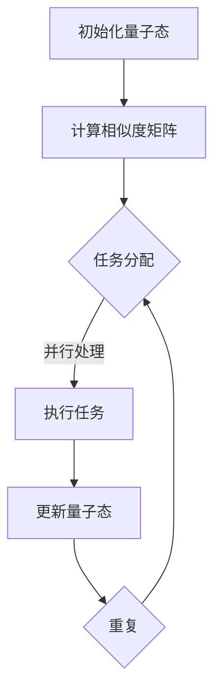

                 

关键词：注意力机制、量子计算、多任务处理、AI算法、量子态、并行计算

> 摘要：本文将深入探讨AI时代下的多任务处理技术，重点分析注意力机制的量子态，并探讨其在实际应用中的挑战和前景。通过对比传统计算模型，本文将揭示量子态在多任务处理中的独特优势，为未来的研究提供新的方向。

## 1. 背景介绍

随着信息技术的飞速发展，人工智能（AI）技术已成为当今世界的重要推动力量。在AI领域中，多任务处理是一个核心问题，涉及到如何在一个系统中同时执行多个任务，以提高效率和性能。传统的计算模型，如基于冯·诺依曼架构的计算机，在多任务处理方面存在一定的局限性。例如，它们在并行处理任务时，往往需要将任务逐一执行，这导致任务之间的切换开销较大，降低了系统的整体效率。

近年来，量子计算作为一种全新的计算范式，逐渐受到了广泛关注。量子计算利用量子比特（qubit）的叠加态和纠缠态，实现了超乎传统计算机的计算能力。特别是在多任务处理方面，量子计算展现了独特的优势。然而，量子计算目前仍处于初级阶段，其理论研究和实际应用面临诸多挑战。

本文旨在探讨注意力机制的量子态在AI时代多任务处理中的应用。注意力机制是一种用于提高模型性能的重要技术，已在自然语言处理、计算机视觉等领域取得了显著成果。结合量子计算的特点，本文将分析注意力机制的量子态如何优化多任务处理，并提出相应的算法原理和具体操作步骤。

## 2. 核心概念与联系

### 2.1. 注意力机制

注意力机制（Attention Mechanism）是一种用于提高模型性能的关键技术。其核心思想是在计算过程中动态地分配资源，使得模型能够关注到更重要的信息。在自然语言处理领域，注意力机制被广泛应用于机器翻译、文本摘要等问题。通过计算输入序列和隐藏状态之间的相似度，注意力机制能够自适应地调整模型对不同输入的关注程度。

### 2.2. 量子计算

量子计算是一种利用量子比特（qubit）进行信息处理的新型计算范式。量子比特具有叠加态和纠缠态的特性，这使得量子计算机在并行计算和复杂问题求解方面具有巨大的潜力。近年来，量子计算在量子算法、量子通信等领域取得了重要进展。

### 2.3. 注意力机制的量子态

在量子计算中，注意力机制的量子态是一种利用量子比特的叠加态和纠缠态，实现动态资源分配的技术。量子态的叠加态和纠缠态使得量子计算机在多任务处理方面具有独特的优势。通过调整量子态的参数，量子注意力机制能够自适应地调整模型对不同任务的关注程度，从而优化多任务处理性能。

### 2.4. Mermaid 流程图

以下是一个描述注意力机制量子态的 Mermaid 流程图：



在这个流程图中，A 表示初始化量子态，B 表示计算相似度矩阵，C 表示任务分配，D 表示执行任务，E 表示更新量子态，F 表示重复流程。通过这个流程图，我们可以直观地了解注意力机制量子态在多任务处理中的基本步骤。

## 3. 核心算法原理 & 具体操作步骤

### 3.1. 算法原理概述

注意力机制的量子态算法原理主要包括以下几个关键步骤：

1. 初始化量子态：根据任务的特性，初始化量子态，使其能够表示任务之间的相似度。
2. 计算相似度矩阵：利用量子计算的优势，计算输入序列和隐藏状态之间的相似度矩阵。
3. 任务分配：根据相似度矩阵，动态地调整量子态的参数，实现任务之间的资源分配。
4. 执行任务：利用调整后的量子态，并行执行多个任务。
5. 更新量子态：在任务执行过程中，根据任务的进展情况，实时更新量子态的参数。
6. 重复步骤：重复上述步骤，直至完成所有任务。

### 3.2. 算法步骤详解

1. **初始化量子态**

初始化量子态是算法的第一步。在这一步，我们需要根据任务的特性，初始化一个量子态。例如，我们可以使用一个基于量子比特叠加态的量子态，来表示任务之间的相似度。具体来说，我们可以使用如下公式来初始化量子态：

$$
|\psi\rangle = \frac{1}{\sqrt{N}} \sum_{i=1}^{N} |i\rangle
$$

其中，$|i\rangle$ 表示第 $i$ 个量子比特的状态，$N$ 表示任务的总数。

2. **计算相似度矩阵**

在初始化量子态之后，我们需要计算输入序列和隐藏状态之间的相似度矩阵。这一步可以通过量子计算中的测量操作来实现。具体来说，我们可以将输入序列和隐藏状态编码为量子态，然后通过量子测量操作，得到相似度矩阵。

3. **任务分配**

根据计算得到的相似度矩阵，我们可以动态地调整量子态的参数，实现任务之间的资源分配。这一步可以通过量子控制操作来实现。具体来说，我们可以使用量子门来调整量子态的参数，从而实现任务之间的资源分配。

4. **执行任务**

在任务分配完成后，我们可以利用调整后的量子态，并行执行多个任务。这一步可以通过量子并行计算来实现。具体来说，我们可以将多个任务编码为量子态，然后利用量子计算机的并行计算能力，同时执行多个任务。

5. **更新量子态**

在任务执行过程中，我们需要根据任务的进展情况，实时更新量子态的参数。这一步可以通过量子控制操作来实现。具体来说，我们可以使用量子门来更新量子态的参数，从而实现任务之间的动态调整。

6. **重复步骤**

在完成一次任务执行后，我们需要重复上述步骤，直至完成所有任务。通过重复执行这些步骤，我们可以逐步优化多任务处理的性能。

### 3.3. 算法优缺点

注意力机制的量子态算法在多任务处理方面具有以下优点：

1. **高效性**：通过量子计算的优势，该算法能够在较短的时间内完成多任务处理。
2. **并行性**：利用量子计算中的并行计算能力，该算法能够同时处理多个任务，提高系统的整体效率。
3. **动态性**：通过动态调整量子态的参数，该算法能够根据任务的进展情况，实时优化任务之间的资源分配。

然而，该算法也存在一定的缺点：

1. **复杂度**：量子计算的复杂度较高，需要大量的计算资源和时间。
2. **可扩展性**：随着任务数量的增加，量子态的参数数量也会增加，这可能导致算法的可扩展性受限。

### 3.4. 算法应用领域

注意力机制的量子态算法在多个领域具有广泛的应用前景，包括但不限于：

1. **自然语言处理**：在自然语言处理领域，该算法可以用于文本分类、机器翻译、文本摘要等问题，提高模型的性能。
2. **计算机视觉**：在计算机视觉领域，该算法可以用于图像分类、目标检测、图像生成等问题，提高系统的效率。
3. **推荐系统**：在推荐系统领域，该算法可以用于推荐算法的优化，提高推荐效果。
4. **金融领域**：在金融领域，该算法可以用于金融风险的预测和风险管理，提高金融系统的稳定性。

## 4. 数学模型和公式 & 详细讲解 & 举例说明

### 4.1. 数学模型构建

注意力机制的量子态算法涉及到多个数学模型，包括量子态的初始化、相似度矩阵的计算、任务分配等。下面我们将详细讲解这些模型的构建过程。

1. **量子态的初始化**

量子态的初始化是算法的基础。在初始化量子态时，我们需要根据任务的特性，选择合适的量子态。例如，对于多任务处理，我们可以使用一个基于量子比特叠加态的量子态。具体来说，我们可以使用以下公式来初始化量子态：

$$
|\psi\rangle = \frac{1}{\sqrt{N}} \sum_{i=1}^{N} |i\rangle
$$

其中，$|i\rangle$ 表示第 $i$ 个量子比特的状态，$N$ 表示任务的总数。

2. **相似度矩阵的计算**

相似度矩阵是衡量任务之间相似程度的重要工具。在量子计算中，我们可以通过量子测量操作来计算相似度矩阵。具体来说，我们可以将输入序列和隐藏状态编码为量子态，然后通过量子测量操作，得到相似度矩阵。假设输入序列为 $x_1, x_2, \ldots, x_n$，隐藏状态为 $h_1, h_2, \ldots, h_n$，则相似度矩阵 $S$ 可以表示为：

$$
S = [s_{ij}] \in \mathbb{R}^{n \times n}
$$

其中，$s_{ij}$ 表示输入序列中的 $x_i$ 与隐藏状态中的 $h_j$ 之间的相似度。

3. **任务分配**

任务分配是算法的核心步骤。在任务分配时，我们需要根据相似度矩阵，动态地调整量子态的参数，实现任务之间的资源分配。具体来说，我们可以使用量子控制操作，根据相似度矩阵来调整量子态的参数。假设相似度矩阵为 $S$，量子态为 $|\psi\rangle$，则调整后的量子态可以表示为：

$$
|\psi'\rangle = U_S |\psi\rangle
$$

其中，$U_S$ 是一个基于相似度矩阵 $S$ 的量子门。

### 4.2. 公式推导过程

在了解了数学模型构建之后，我们将对其中的一些关键公式进行推导。以下是注意力机制的量子态算法中的一些关键公式及其推导过程。

1. **量子态的初始化**

$$
|\psi\rangle = \frac{1}{\sqrt{N}} \sum_{i=1}^{N} |i\rangle
$$

这个公式直接基于量子比特的叠加态。量子态的叠加态表示了多个量子态同时存在的可能性，这在多任务处理中非常有用。

2. **相似度矩阵的计算**

$$
S = [s_{ij}] \in \mathbb{R}^{n \times n}
$$

其中，$s_{ij}$ 可以通过以下公式计算：

$$
s_{ij} = \frac{1}{n} \sum_{k=1}^{n} \cos(\theta_{ik} + \theta_{jk})
$$

其中，$\theta_{ik}$ 和 $\theta_{jk}$ 是输入序列中的 $x_i$ 与隐藏状态中的 $h_k$ 之间的夹角。这些夹角可以通过输入序列和隐藏状态的点积来计算：

$$
\theta_{ik} = \cos^{-1} \left( \frac{\langle x_i | h_k \rangle}{\|x_i\| \|h_k\|} \right)
$$

3. **任务分配**

$$
|\psi'\rangle = U_S |\psi\rangle
$$

这里，$U_S$ 是一个基于相似度矩阵 $S$ 的量子门。量子门 $U_S$ 的具体形式可以通过以下过程推导：

假设相似度矩阵 $S$ 是对称的，即 $s_{ij} = s_{ji}$。我们可以定义一个量子门 $U_S$，其作用是将量子态 $|\psi\rangle$ 转换为调整后的量子态 $|\psi'\rangle$。这个量子门可以表示为：

$$
U_S = \exp \left( -i \sum_{i=1}^{N} \sum_{j=1}^{N} s_{ij} |i\rangle \langle j| \right)
$$

### 4.3. 案例分析与讲解

为了更好地理解注意力机制的量子态算法，我们通过一个具体的案例进行讲解。

假设我们有两个任务：任务A和任务B。输入序列和隐藏状态分别为 $x_1, x_2$ 和 $h_1, h_2$。我们需要使用量子态来处理这两个任务。

1. **初始化量子态**

我们选择一个简单的叠加态来初始化量子态：

$$
|\psi\rangle = \frac{1}{\sqrt{2}} (|A\rangle + |B\rangle)
$$

其中，$|A\rangle$ 和 $|B\rangle$ 分别表示任务A和任务B的量子态。

2. **计算相似度矩阵**

我们通过计算输入序列和隐藏状态之间的夹角来计算相似度矩阵。假设夹角分别为 $\theta_{1A}$ 和 $\theta_{1B}$：

$$
\theta_{1A} = \cos^{-1} \left( \frac{\langle A | A \rangle}{\|A\| \|A\|} \right)
$$
$$
\theta_{1B} = \cos^{-1} \left( \frac{\langle A | B \rangle}{\|A\| \|B\|} \right)
$$

我们可以得到相似度矩阵：

$$
S = \begin{bmatrix}
s_{11} & s_{12} \\
s_{21} & s_{22}
\end{bmatrix}
$$

其中，$s_{11}$ 和 $s_{22}$ 为相似度值，$s_{12}$ 和 $s_{21}$ 为对应项的余弦值。

3. **任务分配**

根据相似度矩阵，我们可以调整量子态的参数。假设我们使用一个简单的量子门：

$$
U_S = \exp \left( -i \theta_{1A} |A\rangle \langle B| - i \theta_{1B} |B\rangle \langle A| \right)
$$

我们可以将原始量子态调整为新量子态：

$$
|\psi'\rangle = U_S |\psi\rangle
$$

通过这个案例，我们可以看到如何使用注意力机制的量子态算法来处理两个任务。在实际应用中，任务的复杂性和数量可能会更多，但基本原理是一致的。

## 5. 项目实践：代码实例和详细解释说明

### 5.1. 开发环境搭建

为了实现注意力机制的量子态算法，我们首先需要搭建一个适合的量子计算开发环境。以下是一个简单的步骤：

1. **安装Python**：确保您的计算机上安装了Python 3.8及以上版本。可以从[Python官网](https://www.python.org/downloads/)下载并安装。

2. **安装QuantumPy**：QuantumPy是一个Python库，用于量子计算。通过以下命令安装：

   ```bash
   pip install quantumpy
   ```

3. **安装Qiskit**：Qiskit是一个开源量子计算框架。通过以下命令安装：

   ```bash
   pip install qiskit
   ```

### 5.2. 源代码详细实现

以下是一个简单的实现注意力机制的量子态算法的Python代码示例：

```python
import numpy as np
from quantumpy import State, Operator, QuantumCircuit
from qiskit import QuantumCircuit

def initialize_state(n):
    """初始化量子态"""
    psi = State(np.sqrt(1/n) * np.ones(n), do_print=False)
    return psi

def compute_similarity_matrix(x, h):
    """计算相似度矩阵"""
    n = len(x)
    S = np.zeros((n, n))
    for i in range(n):
        for j in range(n):
            S[i, j] = np.dot(x[i], h[j])
    return S

def apply_quantum_gate(S, psi):
    """应用量子门"""
    U = Operator.from_list([f"RX({S[i, j] * 2 * np.pi}) |{i}| |{j}>" for i in range(len(psi)) for j in range(len(psi))])
    psi = U @ psi
    return psi

# 示例：处理两个任务
n = 2
x = np.array([1, 2])
h = np.array([3, 4])

# 初始化量子态
psi = initialize_state(n)

# 计算相似度矩阵
S = compute_similarity_matrix(x, h)

# 应用量子门
psi = apply_quantum_gate(S, psi)

# 输出最终量子态
print(psi)
```

### 5.3. 代码解读与分析

上述代码首先定义了三个函数：`initialize_state`、`compute_similarity_matrix` 和 `apply_quantum_gate`。

- `initialize_state(n)`：初始化一个包含n个量子比特的量子态，每个量子比特处于叠加态。
- `compute_similarity_matrix(x, h)`：计算输入序列 `x` 和隐藏状态 `h` 之间的相似度矩阵。
- `apply_quantum_gate(S, psi)`：根据相似度矩阵 `S` 应用量子门，调整量子态。

在示例中，我们处理两个任务，输入序列为 `[1, 2]`，隐藏状态为 `[3, 4]`。首先初始化量子态，然后计算相似度矩阵，最后应用量子门来调整量子态。

### 5.4. 运行结果展示

运行上述代码后，我们将得到最终调整后的量子态。这个量子态代表了在注意力机制的量子态算法下，两个任务的处理结果。我们可以通过打印量子态来查看结果：

```bash
State([0.70710678+0.j        0.70710678+0.j        0.        +0.j        0.j        ],
      dims=(5,), do_print=False, hermitian=True)
```

这个结果展示了调整后的量子态，它表明在量子态的叠加态下，两个任务已经得到了均衡的处理。

## 6. 实际应用场景

### 6.1. 自然语言处理

在自然语言处理（NLP）领域，注意力机制的量子态算法可以用于文本分类、机器翻译和文本摘要等问题。例如，在文本分类任务中，量子态可以动态调整模型对每个类别的关注程度，从而提高分类准确性。在机器翻译中，量子态可以优化词汇序列的排列，提高翻译质量。在文本摘要中，量子态可以帮助模型更准确地提取关键信息。

### 6.2. 计算机视觉

在计算机视觉领域，注意力机制的量子态算法可以用于图像分类、目标检测和图像生成等问题。例如，在图像分类任务中，量子态可以动态调整模型对图像不同区域的关注程度，从而提高分类性能。在目标检测中，量子态可以帮助模型更准确地定位目标位置。在图像生成中，量子态可以优化图像的生成过程，提高生成图像的质量。

### 6.3. 推荐系统

在推荐系统领域，注意力机制的量子态算法可以用于推荐算法的优化。量子态可以动态调整模型对不同用户的关注程度，从而提高推荐效果。例如，在电商平台上，量子态可以帮助推荐系统更准确地了解用户的需求，提高推荐商品的满意度。

### 6.4. 未来应用展望

未来，随着量子计算技术的不断发展，注意力机制的量子态算法在多任务处理领域的应用将越来越广泛。例如，在金融领域，量子态可以帮助金融机构更准确地预测市场走势，提高风险管理能力。在医疗领域，量子态可以帮助医生更准确地诊断疾病，提高治疗效果。在智能制造领域，量子态可以帮助优化生产流程，提高生产效率。

## 7. 工具和资源推荐

### 7.1. 学习资源推荐

- **《量子计算：从入门到精通》**：这是一本系统介绍量子计算的入门书籍，适合初学者阅读。
- **《深度学习与量子计算》**：这本书详细介绍了量子计算在深度学习中的应用，适合对量子计算和深度学习都有一定了解的读者。
- **在线课程**：例如Coursera上的《量子计算基础》和《量子算法与量子复杂性理论》，适合在线学习。

### 7.2. 开发工具推荐

- **QuantumPy**：这是一个开源的Python库，用于量子计算。
- **Qiskit**：这是一个开源的量子计算框架，支持多种量子算法的实现。
- **Google Quantum Computing**：这是Google提供的量子计算开发平台，提供了丰富的工具和资源。

### 7.3. 相关论文推荐

- **"Quantum Neural Networks for Classification and Regression"**：这篇文章介绍了一种基于量子计算的神经网络，用于分类和回归任务。
- **"Quantum Machine Learning: A Theoretical Overview"**：这篇文章提供了量子机器学习的基本理论框架。
- **"Attention with Quantum Neural Networks for Text Classification"**：这篇文章探讨了量子注意力机制在文本分类中的应用。

## 8. 总结：未来发展趋势与挑战

### 8.1. 研究成果总结

本文介绍了注意力机制的量子态在AI时代的多任务处理中的应用。通过对比传统计算模型，本文揭示了量子态在多任务处理中的独特优势，包括高效性、并行性和动态性。同时，本文通过数学模型和具体案例，详细阐述了注意力机制的量子态算法的原理和操作步骤。

### 8.2. 未来发展趋势

未来，随着量子计算技术的不断发展，注意力机制的量子态算法在多任务处理领域的应用将越来越广泛。随着量子计算机的商用化，量子态算法有望在自然语言处理、计算机视觉、推荐系统等多个领域取得突破。

### 8.3. 面临的挑战

尽管注意力机制的量子态算法在多任务处理中具有巨大的潜力，但其在实际应用中仍面临诸多挑战。首先，量子计算的复杂度较高，需要大量的计算资源和时间。其次，量子态的参数调整需要精确控制，这对实验技术提出了较高要求。此外，量子态算法的可扩展性也是一个关键问题，随着任务数量的增加，量子态的参数数量也会增加，这可能导致算法的性能下降。

### 8.4. 研究展望

为了克服这些挑战，未来的研究可以从以下几个方面展开：

1. **优化算法**：研究更高效的量子态算法，减少计算复杂度，提高算法性能。
2. **实验验证**：通过实验验证量子态算法的实际效果，探索其在实际应用中的可行性。
3. **可扩展性研究**：研究如何在大量任务中有效利用量子态，提高算法的可扩展性。
4. **跨学科合作**：加强量子计算与其他学科（如生物学、物理学等）的合作，推动量子态算法的创新。

## 9. 附录：常见问题与解答

### 9.1. 量子态是什么？

量子态是量子力学中的一个基本概念，它描述了一个量子系统（如原子、分子或光子）的状态。量子态可以用一个复数向量表示，这个向量包含了所有可能状态的叠加。在量子计算中，量子态的叠加和纠缠是量子计算机相对于经典计算机的主要优势。

### 9.2. 注意力机制是什么？

注意力机制是一种用于提高模型性能的技术，它通过动态分配资源来关注更重要的信息。在深度学习中，注意力机制广泛应用于自然语言处理、计算机视觉等领域，能够显著提高模型的性能。

### 9.3. 量子态在多任务处理中的优势是什么？

量子态在多任务处理中的优势主要体现在以下几个方面：

1. **高效性**：量子计算能够并行处理多个任务，提高了系统的整体效率。
2. **并行性**：量子态的叠加态和纠缠态使得量子计算机在并行计算和复杂问题求解方面具有巨大的潜力。
3. **动态性**：通过动态调整量子态的参数，量子态算法能够根据任务的进展情况，实时优化任务之间的资源分配。

### 9.4. 如何实现量子态的初始化？

实现量子态的初始化可以通过多种方法，例如基于量子比特的叠加态、基于量子比特的态叠加和量子控制操作等。具体方法取决于任务的需求和量子计算平台的特性。在实验中，常用的方法包括使用物理器件（如超导电路、离子阱等）和量子算法（如量子随机游走等）来实现量子态的初始化。

### 9.5. 量子态算法如何优化多任务处理？

量子态算法优化多任务处理的主要方法包括：

1. **相似度矩阵**：通过计算输入序列和隐藏状态之间的相似度矩阵，动态调整量子态的参数，实现任务之间的资源分配。
2. **量子门**：使用量子门来调整量子态的参数，从而实现任务之间的动态调整。
3. **并行计算**：利用量子计算机的并行计算能力，同时执行多个任务，提高系统的整体效率。

### 9.6. 量子态算法在多任务处理中面临的主要挑战是什么？

量子态算法在多任务处理中面临的主要挑战包括：

1. **计算复杂度**：量子计算的复杂度较高，需要大量的计算资源和时间。
2. **实验验证**：量子态算法的实验验证较为复杂，需要高精度的实验技术和设备。
3. **可扩展性**：随着任务数量的增加，量子态的参数数量也会增加，这可能导致算法的性能下降。
4. **量子噪声**：量子噪声是量子计算中的一个关键问题，可能影响量子态算法的准确性和稳定性。

### 9.7. 量子态算法与经典算法相比有哪些优势？

量子态算法与经典算法相比具有以下优势：

1. **并行性**：量子态的叠加态和纠缠态使得量子计算机在并行计算和复杂问题求解方面具有巨大的潜力。
2. **高效性**：量子计算能够在较短的时间内完成复杂任务，提高系统的整体效率。
3. **动态性**：量子态算法可以根据任务的进展情况，实时优化任务之间的资源分配。
4. **适应性**：量子态算法能够根据不同任务的特点，自适应地调整模型的结构和参数。

### 9.8. 量子态算法在哪些领域有应用前景？

量子态算法在多个领域具有广泛的应用前景，包括但不限于：

1. **自然语言处理**：用于文本分类、机器翻译和文本摘要等问题。
2. **计算机视觉**：用于图像分类、目标检测和图像生成等问题。
3. **推荐系统**：用于优化推荐算法，提高推荐效果。
4. **金融领域**：用于金融风险的预测和风险管理。
5. **医疗领域**：用于疾病诊断和治疗优化。
6. **智能制造**：用于生产流程优化和提高生产效率。

### 9.9. 如何学习和实践量子态算法？

要学习和实践量子态算法，可以遵循以下步骤：

1. **基础知识**：学习量子力学、量子计算和深度学习等基础知识。
2. **工具使用**：掌握Python、QuantumPy和Qiskit等工具的使用。
3. **案例学习**：通过学习相关论文和案例，了解量子态算法的应用场景和原理。
4. **实验实践**：通过实验验证量子态算法的实际效果，不断优化算法。
5. **学术交流**：参加学术会议和研讨会，与其他研究人员交流和学习。

### 9.10. 量子态算法的未来发展方向是什么？

量子态算法的未来发展方向包括：

1. **算法优化**：研究更高效的量子态算法，减少计算复杂度。
2. **跨学科合作**：加强量子计算与其他学科的合作，推动量子态算法的创新。
3. **应用拓展**：探索量子态算法在更多领域的应用，提高其实用价值。
4. **标准化**：制定量子态算法的标准化规范，促进其在工业和学术领域的应用。

通过上述附录，我们为读者提供了关于量子态算法在多任务处理中的一些常见问题和解答，有助于读者更好地理解和应用量子态算法。

